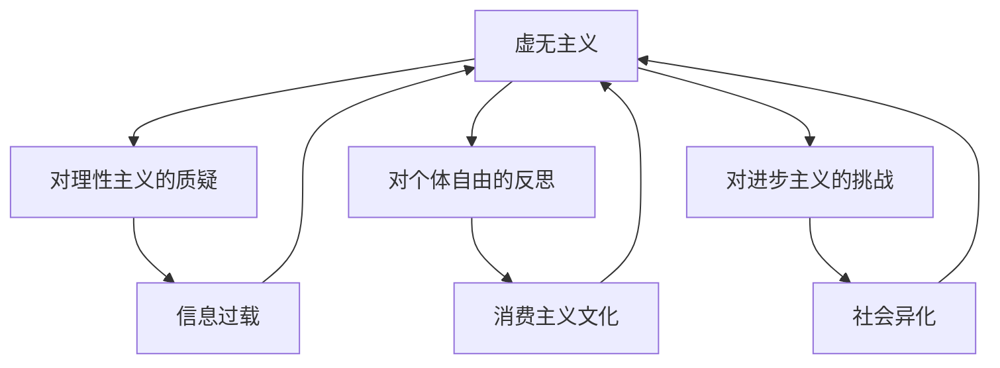

                 

# 虚无主义与现代性：探讨新时代的生活智慧

## 关键词

虚无主义、现代性、生活智慧、哲学思潮、价值观、心理学、社会学、实证研究

## 摘要

本文深入探讨了虚无主义与现代性的关系，以及如何通过培育积极的生活智慧来应对虚无主义的挑战。文章首先介绍了虚无主义和现代性的核心概念及其特征，然后通过对比分析二者之间的联系和区别，揭示了虚无主义在现代性背景下产生的原因。接着，文章探讨了生活智慧的重要性，并分析了如何通过提升个体自我认知、情感管理和人际关系处理能力来培养生活智慧。最后，文章提出了应对虚无主义挑战的具体策略，包括社会和文化层面的改进和个体层面的自我提升。通过本文的探讨，希望为读者提供关于新时代生活智慧的思考和实践指南。

### 第一部分：背景介绍

#### 问题背景

随着全球化进程的加快和信息技术的迅猛发展，现代社会正在经历深刻的变革。然而，这一变革也带来了许多新的问题和挑战，其中之一便是虚无主义的崛起。虚无主义作为一种哲学思潮，主张世界和人生无意义、无目的，这一观点在现代社会中得到了广泛的传播，并对人们的价值观、信仰和生活方式产生了深远的影响。

#### 问题描述

虚无主义在现代社会的传播和影响，不仅对个体的心理健康和生活质量构成威胁，也对整个社会的稳定和发展带来了挑战。因此，如何理解虚无主义，探讨其与现代性的关系，寻找新时代的生活智慧，成为了当前迫切需要解决的问题。

#### 问题解决

为了深入探讨虚无主义与现代性的关系，本书将采用哲学、社会学、心理学等多个学科的理论和方法，结合实证研究和案例分析，全面剖析虚无主义产生的根源、表现形式及其对现代生活的影响。同时，本书还将探讨如何在新时代背景下，通过培育积极的人生态度和价值观，应对虚无主义的挑战，提升个体和群体的生活智慧。

#### 边界与外延

在探讨虚无主义与现代性的关系时，我们需要明确几个边界和外延：

- **概念边界**：虚无主义是一种哲学思潮，主张世界和人生无意义、无目的。现代性则是一个更为广泛的概念，涉及社会结构、文化观念、科学技术等多个层面。
- **历史边界**：虚无主义并非现代社会特有的现象，它在不同的历史时期和文化背景下都有所体现。因此，在分析虚无主义与现代性的关系时，需要考虑到历史和文化的多样性。
- **研究范围**：本书主要关注虚无主义在现代社会中的传播和影响，以及如何通过培育积极的人生态度和价值观来应对这一挑战。具体研究范围包括哲学、社会学、心理学等多个领域。

#### 概念结构与核心要素组成

为了深入探讨虚无主义与现代性的关系，本书将涉及以下几个核心概念：

- **虚无主义**：作为一种哲学思潮，虚无主义主张世界和人生无意义、无目的。虚无主义的核心理念包括对传统价值观的质疑、对现实生活的厌倦以及对个人存在的怀疑。
- **现代性**：现代性是指现代社会在结构、文化、科技等方面的特征。现代性强调理性、科学、个体自由和民主，但也可能导致社会的异化、个体孤独以及对传统价值观的质疑。
- **生活智慧**：生活智慧是指个体在面对生活挑战时所表现出的积极态度和理性思考能力。生活智慧包括自我认知、情感管理、人际关系处理等方面。

这些核心概念相互联系，构成了本书的研究框架。通过分析虚无主义与现代性的关系，我们可以更好地理解现代社会中个体面临的挑战，并探索如何通过培育生活智慧来应对这些挑战。

---

### 第二部分：核心概念与联系

#### 核心概念

在探讨虚无主义与现代性的关系时，我们首先需要明确几个核心概念，包括虚无主义、现代性和生活智慧。

##### 1. 虚无主义

虚无主义是一种哲学思潮，起源于19世纪末的欧洲。它主张世界和人生缺乏固有意义和目的，是一种深刻的悲观主义。虚无主义的核心理念包括对传统价值观的质疑、对现实生活的厌倦以及对个人存在的怀疑。在现代社会中，虚无主义常常表现为一种对现状的不满和对未来的绝望。

虚无主义的主要特征包括：

- **对传统价值观的质疑**：虚无主义认为，传统的道德、宗教和社会规范无法为人们提供真正的意义和目的，因而对这些价值观进行批判和质疑。
- **对现实生活的厌倦**：虚无主义者对现实生活感到厌倦和不满，认为生活缺乏意义和目的，甚至是对抗和逃避现实的一种心态。
- **个人存在的怀疑**：虚无主义者常常质疑自己的存在意义，对个体存在的价值感到怀疑。

##### 2. 现代性

现代性是指现代社会在结构、文化、科技等方面的特征。现代性强调理性、科学、个体自由和民主，但也可能导致社会的异化、个体孤独以及对传统价值观的质疑。现代性的核心特征包括：

- **理性**：现代性强调理性思维和科学方法，认为理性是理解和改造世界的关键。
- **科学**：现代性倡导科学精神和科技进步，认为科学是推动社会发展和进步的动力。
- **个体自由**：现代性强调个体自由和权利，认为每个人都应该享有自主选择和表达的权利。
- **民主**：现代性推崇民主制度和政治参与，认为民主是保障个体权利和社会公正的重要手段。

##### 3. 生活智慧

生活智慧是指个体在面对生活挑战时所表现出的积极态度和理性思考能力。生活智慧包括自我认知、情感管理、人际关系处理等方面。生活智慧的主要特征包括：

- **自我认知**：生活智慧要求个体对自身有清晰的认识，包括自身的优点、缺点、价值观和目标等。
- **情感管理**：生活智慧要求个体能够有效管理自己的情感，包括情绪调节、压力管理和积极心态的保持。
- **人际关系处理**：生活智慧要求个体能够有效地处理人际关系，包括沟通技巧、合作精神和解决问题的能力。

#### 概念属性特征对比表格

为了更清晰地展示虚无主义、现代性和生活智慧的概念特征，我们可以通过以下表格进行对比：

| 概念       | 特征                                                                 |
|------------|--------------------------------------------------------------------|
| 虚无主义   | - 对传统价值观的质疑<br>- 对现实生活的厌倦<br>- 个人存在的怀疑 |
| 现代性     | - 理性<br>- 科学<br>- 个体自由<br>- 民主                   |
| 生活智慧   | - 自我认知<br>- 情感管理<br>- 人际关系处理                 |

#### ER实体关系图架构

下面是一个使用Mermaid绘制的ER实体关系图，展示了虚无主义、现代性和生活智慧之间的相互关系：

```mermaid
erDiagram
  A[虚无主义] ||--|{ 现代性 }|| B[生活智慧]
  B --|{ 虚无主义 }|| A
  A --|{ 现代性 }|| B
```

在这个ER图中，虚无主义、现代性和生活智慧三个实体之间存在双向关系。虚无主义既受到现代性的影响，也影响着现代性；同时，生活智慧既是对虚无主义的回应，也是现代性的体现。

---

通过以上对核心概念的阐述和对比分析，我们可以更深入地理解虚无主义、现代性和生活智慧之间的联系。在接下来的章节中，我们将进一步探讨虚无主义在现代性背景下的产生原因及其对现代生活的影响，并探讨如何通过培育生活智慧来应对虚无主义的挑战。

---

### 第三部分：虚无主义在现代性背景下的产生原因

在现代性背景下，虚无主义的产生具有深刻的历史和文化根源。要理解虚无主义在现代社会的兴起，我们需要从哲学、社会和文化等多个角度进行分析。

#### 哲学根源

1. **尼采的“上帝已死”**：尼采是虚无主义的代表性思想家之一。他提出“上帝已死”的口号，意味着传统的宗教和道德价值观的崩溃。尼采认为，当人们失去对上帝的信仰，就会陷入一种无意义和空虚的状态。
   
2. **存在主义的挑战**：存在主义哲学家如萨特和加缪等，也在一定程度上推动了虚无主义的发展。存在主义强调个体的自由和选择，但同时指出，自由本身意味着承担责任和面对不确定性，这可能导致个体感到无意义和孤独。

#### 社会根源

1. **现代化的快速推进**：现代化进程带来了社会的快速变革，传统的社会结构和价值观受到冲击。随着工业化和城市化的发展，人们的生活方式发生了巨大变化，传统的家庭和社区关系变得松散，个体感受到了前所未有的孤独。

2. **科技与信息的爆炸**：信息技术的迅猛发展使得人们能够获取大量的信息，但也导致了信息过载。在大量信息的包围下，人们往往感到无所适从，难以找到生活的方向和意义。

#### 文化根源

1. **消费主义文化**：消费主义文化强调物质财富和享受，追求短期满足。这种文化模式可能导致人们对生活意义的忽视，只关注表面的物质享受，从而陷入虚无主义的困境。

2. **媒体的影响**：媒体在塑造公众价值观和生活方式方面发挥着重要作用。现代媒体往往强调竞争、成功和物质财富，这可能加剧个体的焦虑感和无意义感。

#### 对现代生活的影响

1. **心理健康问题**：虚无主义可能导致个体产生严重的心理健康问题，如抑郁症、焦虑症等。长期处于虚无主义情绪中的人可能会失去对生活的热情和动力，导致生活质量下降。

2. **社会问题**：虚无主义的蔓延对社会稳定和发展构成威胁。当大量个体陷入虚无主义时，社会道德和价值观的崩塌可能导致社会动荡和不稳定。

通过以上分析，我们可以看到，虚无主义在现代性背景下产生的原因是多方面的，涉及哲学、社会和文化等多个层面。理解这些根源有助于我们更好地应对虚无主义带来的挑战，并探索培育积极生活智慧的有效途径。

---

### 第四部分：虚无主义与现代性的关系分析

虚无主义与现代性之间的关系是复杂而多层次的。一方面，虚无主义是对现代性某些特征的批判和反思；另一方面，现代性环境为虚无主义的兴起提供了土壤。下面，我们将通过几个关键点来详细探讨虚无主义与现代性的关系。

#### 虚无主义对现代性的批判

1. **对理性主义的质疑**：现代性强调理性思维和科学方法，但虚无主义认为，理性主义往往掩盖了现实生活的无意义。虚无主义者质疑科学和技术是否真的能够解决人类存在的基本问题。

2. **对个体自由的反思**：现代性推崇个体自由，但虚无主义指出，自由本身意味着承担责任和面对不确定性，这可能导致个体感到无意义和孤独。例如，萨特的存在主义哲学强调自由选择的后果，个体必须在孤独中面对自己的选择和责任。

3. **对进步主义的挑战**：现代性强调进步和改善，但虚无主义认为，历史和社会的进步并不意味着人类生活的改善。虚无主义者认为，无论社会如何进步，个体的存在和生活的意义仍然是无法保证的。

#### 现代性为虚无主义提供土壤

1. **信息过载**：现代科技的发展使得信息获取变得前所未有的便捷，但也导致了信息过载。面对大量信息，人们往往感到困惑和无从选择，这种信息过载状态可能导致虚无主义的产生。

2. **消费主义文化**：现代消费主义文化强调物质享受和短期满足，这可能导致人们对生活意义的忽视。当人们只关注物质财富和享受时，他们可能会失去对更深层次生活意义的探索。

3. **社会异化**：现代化进程中的社会变迁，如城乡差距、阶层分化等，可能导致个体在社会中的孤立和异化。这种社会异化感是虚无主义产生的一个重要因素。

#### 关系模型

为了更直观地展示虚无主义与现代性之间的关系，我们可以通过以下Mermaid关系图来描述：



在这个关系图中，虚无主义通过批判现代性的理性主义、个体自由和进步主义，与现代性的信息过载、消费主义文化和社会异化等特征相互关联，形成了复杂的互动关系。

---

通过以上分析，我们可以看到，虚无主义与现代性之间的关系是辩证的，二者既相互冲突又相互影响。理解这种关系有助于我们更全面地认识虚无主义在现代社会中的地位和作用，并为应对虚无主义带来的挑战提供理论支持。

---

### 第五部分：生活智慧的重要性与培养策略

在现代社会中，生活智慧对于个体的心理健康和生活质量具有至关重要的作用。生活智慧不仅帮助个体更好地应对生活挑战，还能提升整体幸福感和社会适应性。以下，我们将详细探讨生活智慧的重要性，并提出具体的培养策略。

#### 生活智慧的重要性

1. **心理健康**：生活智慧有助于个体更好地处理情绪和心理压力，减少心理健康问题的发生。例如，通过自我认知和情感管理，个体可以更好地调节情绪，减少焦虑和抑郁的风险。

2. **生活质量**：生活智慧使个体能够更有效地处理日常生活中的问题，从而提高生活质量。例如，通过良好的情感管理和人际关系处理，个体可以建立和谐的人际关系，提高生活的幸福感和满足感。

3. **社会适应性**：生活智慧帮助个体更好地适应社会变迁和环境变化，增强社会适应能力。例如，通过理性思考和问题解决能力，个体可以在面对不确定性时保持冷静和应对能力。

#### 培养生活智慧的策略

1. **自我认知**：自我认知是生活智慧的基础。个体需要通过反思和自我探索，了解自己的价值观、目标和优点。以下是一些培养自我认知的方法：

   - **日记反思**：定期记录自己的情绪、想法和经历，通过反思来深入理解自己。
   - **心理测试**：通过心理测试和评估工具，了解自己的性格特点和优势。
   - **导师指导**：寻找一位有经验的导师，通过交流和指导来提高自我认知。

2. **情感管理**：情感管理是生活智慧的重要组成部分。个体需要学会如何识别、理解和处理自己的情感。以下是一些培养情感管理能力的方法：

   - **情绪记录**：记录自己的情绪变化，通过分析情绪的模式和原因来更好地理解和管理情感。
   - **正念冥想**：通过正念冥想练习，培养专注力和情感调节能力。
   - **情感教育**：参加情感管理相关的课程或阅读相关书籍，提高情感认知和处理能力。

3. **人际关系处理**：良好的人际关系是生活智慧的重要体现。个体需要学会如何与他人建立和维持健康的关系。以下是一些培养人际关系处理能力的方法：

   - **沟通技巧**：通过学习有效的沟通技巧，如倾听、表达和反馈，提高沟通效果。
   - **合作精神**：培养团队合作精神，学会与他人协作和共同解决问题。
   - **社交技能**：参加社交活动和社交训练，提高社交能力和人际关系处理技巧。

#### 综合应用与实例

以下是一个关于培养生活智慧的实例：

**案例**：小明是一名年轻的程序员，他在工作中经常感到压力巨大，生活缺乏意义。通过学习生活智慧，他采取了以下措施：

- **自我认知**：通过定期写日记，小明意识到自己渴望更多的成就感和社会认可。
- **情感管理**：通过参加冥想课程，小明学会了如何更好地调节情绪，减少焦虑。
- **人际关系处理**：小明积极参加公司组织的团队建设活动，通过合作项目来提升团队协作能力。

经过一段时间的实践，小明的工作压力明显减轻，生活质量得到了显著提高。

---

通过以上策略，个体可以逐步培养和提高自己的生活智慧。这不仅有助于应对虚无主义的挑战，还能提升整体的心理健康和生活质量。

---

### 第六部分：应对虚无主义挑战的策略

在现代社会中，虚无主义的挑战不仅影响个体，也对整个社会产生深远的影响。为了应对虚无主义，我们需要从社会和文化层面进行系统性的改革，同时注重个体层面的自我提升。以下，我们将详细探讨应对虚无主义挑战的具体策略。

#### 社会层面

1. **教育改革**：教育是培养个体价值观和生活智慧的重要途径。通过改革教育体系，强调人文教育和道德教育，可以提升学生的自我认知和情感管理能力。以下是一些具体的改革措施：

   - **课程设置**：在课程中增加哲学、心理学和社会学等学科的内容，帮助学生理解虚无主义和现代性的关系。
   - **实践教育**：通过实践活动，如社区服务、社会实践和实地考察，让学生体验真实的社会环境，培养社会责任感和实践能力。
   - **教师培训**：加强对教师的培训，提高其在情感管理和生活智慧方面的教学能力。

2. **媒体引导**：媒体在塑造公众价值观方面具有重要影响力。为了应对虚无主义的挑战，媒体需要：

   - **传播正能量**：多报道积极向上的故事和人物，传递正能量，增强公众的信心和希望。
   - **批判性思维**：鼓励公众进行批判性思考，提高对信息的辨别能力，避免盲目跟风和沉迷于虚无主义情绪。
   - **多样化内容**：提供多样化的内容和观点，避免单一声音的垄断，促进公众的多元化思考。

3. **社会支持系统**：建立完善的社会支持系统，为个体提供心理健康服务和支持。以下是一些具体措施：

   - **心理咨询**：提供免费或低成本的心理咨询服务，帮助个体解决心理问题，提高心理健康水平。
   - **社会救助**：加强对贫困、失业等弱势群体的救助，提供基本生活保障，减少社会不公和剥夺感。
   - **社区支持**：鼓励社区建立互助组织，提供情感支持和生活帮助，增强社区凝聚力和归属感。

#### 个体层面

1. **自我提升**：个体可以通过以下方式提升自己的生活智慧和应对虚无主义的挑战：

   - **终身学习**：不断学习和充实自己，提高知识水平和思维能力，增强对生活意义的理解。
   - **积极心态**：培养积极乐观的心态，面对困难和挑战时保持坚定和乐观，增强心理韧性。
   - **情感管理**：学习情感管理技巧，学会调节情绪，避免过度情绪化和情绪崩溃。

2. **建立人际网络**：建立稳定和健康的人际关系网络，获得情感支持和社交支持。以下是一些具体方法：

   - **家庭关系**：加强与家庭成员的沟通和互动，建立和谐的家庭关系。
   - **朋友关系**：培养真诚的友谊，与朋友分享生活和情感，获得心理支持。
   - **社交活动**：参加各种社交活动和社区活动，扩大社交圈子，增强社交能力。

3. **参与社会事务**：通过参与社会事务和公共活动，提升社会责任感和参与感，增强对社会的归属感和认同感。以下是一些具体建议：

   - **志愿服务**：参加志愿服务，为他人提供帮助，培养奉献精神和人际交往能力。
   - **公益活动**：参与公益活动，提高对社会责任的认识，增强社会认同感。
   - **社区参与**：积极参与社区治理和公共事务，为社区发展贡献力量。

通过以上社会层面和个体层面的综合策略，我们可以有效应对虚无主义的挑战，提升个体和群体的生活智慧，构建一个更加和谐、有希望的社会。

---

### 第七部分：最佳实践与注意事项

在面对虚无主义挑战时，以下是一些最佳实践和注意事项，以帮助个体和社会更好地应对这一问题。

#### 最佳实践

1. **建立个人成长计划**：制定个人成长计划，设定具体的目标和行动步骤，通过不断学习和实践提升自我。

2. **参与心理健康教育**：参加心理健康课程和讲座，学习情绪管理和压力应对技巧，提高心理健康水平。

3. **建立积极的人际关系**：积极参与社交活动，建立和维护健康的人际关系，获得情感支持和社交支持。

4. **参与社会实践**：通过参与志愿服务、公益活动和社会事务，提升社会责任感和参与感，增强对社会的归属感和认同感。

5. **保持终身学习**：不断学习新知识、新技能，提高自身素质和应对生活挑战的能力。

#### 注意事项

1. **避免过度自我反思**：虽然自我反思有助于提升自我认知，但过度自我反思可能导致消极情绪和心理负担，应适度进行。

2. **避免追求完美**：在追求个人目标和成长过程中，避免追求完美，接受自己的不完美，培养包容和接纳的心态。

3. **注意心理保健**：在高压和挑战面前，注意心理保健，保持积极的心态和良好的生活习惯。

4. **寻求专业帮助**：在遇到严重心理问题和情绪困扰时，及时寻求专业心理咨询和帮助，避免问题恶化。

---

通过以上最佳实践和注意事项，个体和社会可以更好地应对虚无主义的挑战，提升生活智慧和心理健康水平。

---

### 总结

本文从多个角度深入探讨了虚无主义与现代性的关系，分析了虚无主义在现代性背景下的产生原因及其对现代生活的影响，并提出了培育生活智慧的具体策略。虚无主义作为一种哲学思潮，在现代性社会中具有复杂的影响，对个体的心理健康和社会稳定构成挑战。然而，通过培育积极的生活智慧，个体可以更好地应对虚无主义的挑战，提升生活质量和幸福感。

在现代社会，面对虚无主义的挑战，我们需要从社会层面和个体层面综合施策。社会层面，通过教育改革、媒体引导和社会支持系统的完善，为个体提供更多的支持和资源。个体层面，通过自我提升、建立积极的人际关系和参与社会实践，增强心理韧性和社会认同感。

展望未来，随着社会和科技的进一步发展，虚无主义的挑战将变得更加复杂和多元。因此，我们需要持续探索和推广生活智慧，提升个体和社会的整体幸福感和适应能力。通过共同努力，我们有望构建一个更加和谐、有希望的社会，为个体提供更多的生活智慧和意义。

---

### 拓展阅读

1. **《虚无主义：起源与影响》**：作者马丁·海德格尔，深入探讨了虚无主义的起源和影响，对理解虚无主义提供了重要的哲学视角。

2. **《现代性的哲学批判》**：作者让-弗朗索瓦·利奥塔，分析了现代性的哲学基础及其对个体和社会的深远影响。

3. **《生活的智慧》**：作者阿尔贝特·爱因斯坦，通过探讨科学和哲学，提出了关于生活智慧的深刻见解。

4. **《心理学与生活智慧》**：作者克里斯托弗·彼得森，结合心理学理论，提供了培养生活智慧的具体方法和实践指导。

5. **《社会的智慧：人类社会的演变与未来》**：作者雅克·阿塔利，探讨了社会智慧在人类社会演变中的作用和未来发展方向。

