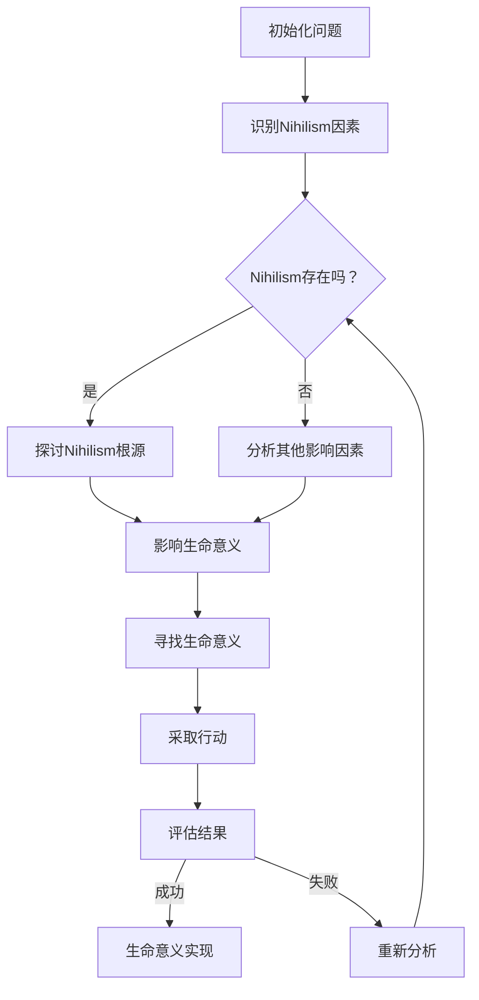
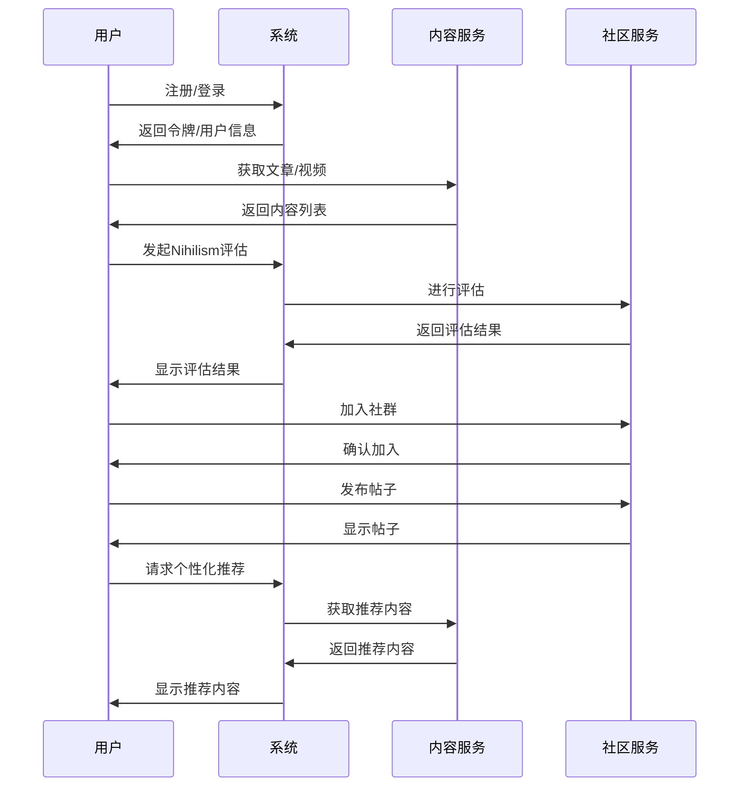

                 

### Nihilism and the Meaning of Life: Seeking Value in Modern Society

In a world increasingly marked by complexity and uncertainty, the question of life's meaning has become a focal point of philosophical inquiry. At the heart of this quest lies Nihilism, a concept that challenges traditional notions of purpose and morality. This article aims to dissect Nihilism, explore its implications on the search for life's meaning, and examine potential pathways to finding value in modern society. We will adopt a structured approach, breaking down the topic into comprehensible sections and employing clear, logical reasoning to guide our analysis.

**Keywords:**
- Nihilism
- Modern Society
- Existentialism
- Life Meaning
- Philosophical Inquiry

**Abstract:**
This article delves into the philosophical doctrine of Nihilism, its historical and contemporary contexts, and its impact on the quest for life's meaning. By exploring the core tenets of Nihilism and its relationship with existentialism, we aim to provide a comprehensive understanding of its implications on modern society. Furthermore, we will discuss strategies to overcome Nihilism and seek value in an increasingly complex world.

---

### I. Introduction to Nihilism and Its Impact on Modern Society

Nihilism, in its simplest form, is the belief that life is inherently without meaning, purpose, or intrinsic value. This philosophical stance emerged as a response to various historical and cultural developments, particularly in the 19th and 20th centuries. In this section, we will delve into the origins and development of Nihilism, examining its historical context and key philosophical contributors.

#### 1.1 Definition and Historical Context

The term "Nihilism" originates from the Latin word "nihil," meaning "nothing." Historically, Nihilism has been associated with various movements and philosophies that question the existence of inherent meaning or value in life. One of the earliest forms of Nihilism can be traced back to ancient Greek philosophers like Epicurus and Lucretius, who argued that pleasure and pain are the ultimate measures of human well-being.

In the 19th century, Nihilism gained prominence as a philosophical movement in Europe, particularly in Russia. The Russian Nihilists, who emerged in the mid-19th century, rejected traditional societal norms and values, advocating for a radical break from the established order. Influential figures like Nikolai Chernyshevsky and Ivan Turgenev played pivotal roles in shaping the Nihilist movement.

#### 1.2 Key Philosophical Contributors

Nihilism's philosophical landscape is marked by a diversity of perspectives. Key contributors to the doctrine include:

- **Arthur Schopenhauer (1788-1860)**: Known for his pessimistic views, Schopenhauer argued that the universe is a place of suffering governed by the will-to-live. His philosophy laid the groundwork for many subsequent Nihilist thinkers.
- **Friedrich Nietzsche (1844-1900)**: One of the most influential Nihilist philosophers, Nietzsche critiqued traditional moral values and asserted that life's meaning must be created by the individual. His concept of the "Übermensch" (Übermensch) or "Overman" proposed a new form of heroism and self-creation.
- **Max Stirner (1806-1856)**: In his work "The Ego and Its Own," Stirner advanced a radical form of Nihilism, asserting that the self is the only true reality and all external norms and values are mere illusions.

#### 1.3 Different Forms of Nihilism

Nihilism manifests in various forms, each with its unique philosophical implications:

- **Subjective Nihilism**: This form emphasizes the absence of objective meaning in life, suggesting that meaning is subjective and must be constructed by the individual.
- **Metaethical Nihilism**: This perspective challenges the existence of objective moral values, asserting that moral judgments are merely human constructs without inherent value.
- **Existential Nihilism**: Rooted in existentialism, this form explores the implications of the human condition in a world devoid of inherent meaning.

#### Summary

In conclusion, Nihilism, as a philosophical doctrine, has a rich and complex history, shaped by various historical and cultural contexts. From its origins in ancient Greece to its modern manifestations, Nihilism continues to provoke thought and discussion about the nature of life's meaning. In the following sections, we will further explore Nihilism's impact on modern society and its relationship with existentialism.

---

### II. The Crisis of Meaning in Modern Society

In an era dominated by rapid technological advancements, shifting cultural norms, and increasing globalization, the concept of meaning has become a subject of intense philosophical inquiry. Modern society faces a profound crisis of meaning, largely influenced by the widespread acceptance of Nihilism. In this section, we will examine the various factors contributing to this crisis, exploring the loss of purpose in the modern world.

#### 2.1 The Impact of Technological Advancements

The advent of technology has transformed nearly every aspect of modern life, creating both opportunities and challenges. On one hand, technological advancements have improved our quality of life, offering unprecedented access to information, connectivity, and convenience. On the other hand, these advancements have also contributed to a sense of alienation and disconnection.

- **Loss of Human Connection**: With the rise of digital communication, face-to-face interactions have diminished, leading to feelings of isolation and loneliness. Social media platforms, while connecting us in terms of quantity, often fail to foster deep, meaningful relationships.
- **Depersonalization**: Technology has also led to a sense of depersonalization, where individuals feel like mere cogs in a vast, impersonal machine. This loss of individuality can contribute to a crisis of meaning, as people struggle to find their place in the world.

#### 2.2 The Influence of Consumer Culture

Consumer culture, characterized by materialism and the relentless pursuit of wealth and status, has played a significant role in undermining the search for meaning. In a consumer-driven society, individuals are often encouraged to prioritize material possessions over deeper, more meaningful pursuits.

- **Materialism**: The focus on material wealth can lead to a shallow understanding of life's value, reducing it to mere accumulation of goods. This can result in a perpetual cycle of dissatisfaction, as people continually strive for more without finding true fulfillment.
- ** commodification of Relationships**: Consumer culture also extends to relationships, where human connections are often treated as commodities to be bought, sold, or traded. This commodification can erode the depth and meaning of interpersonal relationships.

#### 2.3 The Disillusionment of the Modern Self

The modern self, shaped by social, cultural, and technological influences, often feels fragmented and inauthentic. This sense of disillusionment can contribute to a crisis of meaning.

- **Identity Crisis**: In a world where identity is constantly in flux, individuals may struggle to define who they are and what they stand for. This identity crisis can lead to a profound sense of emptiness and disorientation.
- **Cultural Dissatisfaction**: The modern self is often driven by external expectations and standards, rather than intrinsic values. This cultural dissatisfaction can result in a perpetual feeling of inadequacy and unfulfillment.

#### The Search for Meaning in an Age of Nihilism

The crisis of meaning in modern society has led to a heightened search for value and purpose. However, this search is often complicated by the influence of Nihilism, which challenges traditional notions of meaning and purpose.

- **Subjective Meaning**: Nihilism emphasizes that meaning is subjective and must be created by the individual. This can be both liberating and challenging, as it places the burden of meaning on each person's shoulders.
- **Existential Anxiety**: The realization that life has no inherent meaning can lead to existential anxiety, as individuals confront the vast expanse of existence without a predefined purpose. This anxiety can drive a search for meaning, but it can also lead to feelings of hopelessness and despair.

In conclusion, the crisis of meaning in modern society is a multifaceted issue influenced by technological advancements, consumer culture, and the disillusionment of the modern self. Nihilism, with its challenge to traditional notions of meaning, further complicates this search. In the following sections, we will explore strategies to overcome Nihilism and seek value in an increasingly complex world.

---

### III. The Meaning of Life in a Nihilistic Framework

In a world where Nihilism challenges the existence of inherent meaning, the quest for life's value becomes a profound philosophical inquiry. This section will delve into the implications of Nihilism on the search for meaning, exploring key philosophical concepts and their relationship with Nihilism.

#### 3.1 Nihilism and Existentialism

Existentialism, as a philosophical movement, emerged as a direct response to Nihilism. While Nihilism asserts the absence of inherent meaning, Existentialism focuses on the human experience and the individual's capacity to create meaning.

- **Existentialism**: Rooted in the ideas of philosophers like Jean-Paul Sartre and Simone de Beauvoir, Existentialism emphasizes individual freedom, responsibility, and authenticity. For Existentialists, meaning is not given but must be actively sought and created.
- **Nihilism**: While Nihilism and Existentialism may seem contradictory, they are often interconnected. Nihilism provides the backdrop against which Existentialism flourishes. Without the recognition of inherent meaning, the individual is compelled to seek purpose and value through their actions and choices.

#### 3.2 Nihilism and Morality

The concept of morality also becomes a subject of intense debate in a Nihilistic framework. Nihilism challenges the existence of objective moral values, leading to various ethical perspectives.

- **Metaethical Nihilism**: This form of Nihilism asserts that moral values are subjective and relative, existing only in the minds of individuals. It questions the very foundation of moral judgments, suggesting that there is no inherent right or wrong.
- **Moral Relativism**: While not strictly a form of Nihilism, moral relativism shares some common ground with Nihilism. It posits that moral values are culturally and contextually specific, meaning that what is considered right or wrong can vary across different societies and situations.
- **Nihilistic Ethics**: Some Nihilists propose a form of ethics that emphasizes individual autonomy and the pursuit of personal values. This approach suggests that, in the absence of objective moral truths, individuals are free to define their own ethical frameworks.

#### 3.3 The Role of Art and Creativity

Art and creativity often serve as powerful tools in the search for meaning within a Nihilistic framework. They provide a means for individuals to express their inner experiences, challenge societal norms, and explore the limits of human existence.

- **Art as a Means of Expression**: Artists use various mediums to articulate their innermost thoughts and feelings, offering a window into the human experience. This form of expression can be a therapeutic process, helping individuals make sense of their lives and find meaning in their struggles.
- **Art as a Critique of Society**: Art often serves as a critique of societal norms and injustices, challenging the status quo and prompting reflection and change. This role of art aligns closely with the principles of existentialism, which emphasizes the importance of questioning and challenging established beliefs.
- **Art as a Source of Meaning**: For many, the act of creating art itself can be a source of meaning and purpose. The process of artistic creation requires dedication, passion, and self-expression, providing individuals with a sense of fulfillment and value.

#### Summary

In conclusion, the relationship between Nihilism and the search for life's meaning is complex and multifaceted. Nihilism, with its assertion of the absence of inherent meaning, challenges traditional notions of purpose and morality. However, this very challenge provides a fertile ground for philosophical inquiry and the exploration of new avenues for meaning-making. Existentialism, with its emphasis on individual freedom and authenticity, offers a compelling response to Nihilism, suggesting that meaning can be created through conscious choices and actions. In the following sections, we will delve deeper into strategies for overcoming Nihilism and seeking value in modern society.

---

### IV. Overcoming Nihilism: Paths to Personal and Collective Redemption

In a world where Nihilism poses a significant challenge to the search for meaning, finding pathways to personal and collective redemption becomes paramount. This section will explore strategies for overcoming Nihilism, focusing on the power of community, individual action, and personal transformation.

#### 4.1 The Power of Community and Solidarity

Community and solidarity play a crucial role in overcoming Nihilism, offering individuals a sense of belonging and purpose. By coming together with others who share similar values and goals, individuals can find strength and support in numbers.

- **Building Strong Social Bonds**: Strong social bonds foster a sense of belonging and identity, helping individuals feel connected to something greater than themselves. This sense of community can provide a counterbalance to the isolation and alienation often associated with Nihilism.
- **Promoting Collective Action**: Collective action, whether through activism, volunteer work, or community projects, allows individuals to channel their energies towards positive change. By working together towards common goals, individuals can find a sense of purpose and fulfillment that transcends personal struggles.
- **Fostering Solidarity**: Solidarity, the shared commitment to the well-being of others, can create a powerful sense of unity and purpose. By recognizing and addressing common challenges, individuals can forge meaningful connections and build a supportive network.

#### 4.2 The Role of Individual Action

While community and solidarity are crucial, individual action also plays a significant role in overcoming Nihilism. Each person has the power to make choices that can positively impact themselves and those around them.

- **Choosing Meaningful Activities**: Engaging in activities that align with personal values and passions can provide a sense of purpose and fulfillment. Whether it's pursuing a hobby, starting a business, or volunteering, finding meaningful pursuits can help individuals find value and direction in their lives.
- **Embracing Personal Growth**: Personal growth, through self-reflection and continuous learning, can help individuals overcome feelings of stagnation and disillusionment. By investing in personal development, individuals can cultivate resilience and adaptability, enabling them to navigate the complexities of life with confidence and grace.
- **Taking Responsibility**: Taking responsibility for one's actions and choices is a powerful antidote to Nihilism. By acknowledging personal agency and the impact of one's decisions, individuals can regain a sense of control and purpose in their lives.

#### 4.3 The Potential for Personal Transformation

Personal transformation, the process of fundamentally changing one's beliefs, values, and behaviors, offers a profound pathway to overcoming Nihilism. This transformation involves a deep inner journey that can lead to profound insights and a renewed sense of purpose.

- **Cultivating Self-Awareness**: Developing self-awareness involves understanding one's own thoughts, emotions, and behaviors. By becoming more aware of oneself, individuals can identify areas for personal growth and change.
- **Embracing Flexibility and Openness**: Being open to new ideas and experiences can expand one's perspective and provide new avenues for meaning-making. Flexibility and openness allow individuals to adapt to changing circumstances and embrace new possibilities.
- **Fostering Inner Peace**: Inner peace, the state of mental and emotional balance, can help individuals navigate the challenges of life with greater ease and resilience. Practices such as meditation, mindfulness, and self-care can foster inner peace and a sense of tranquility.

#### Summary

In conclusion, overcoming Nihilism requires a multifaceted approach that incorporates the power of community, individual action, and personal transformation. By building strong social bonds, engaging in meaningful activities, embracing personal growth, and fostering inner peace, individuals can find pathways to personal and collective redemption. In the following section, we will discuss specific strategies and practices that can help overcome Nihilism and seek value in modern society.

---

### V. Conclusion

In exploring the philosophical doctrine of Nihilism and its impact on the search for life's meaning, we have uncovered a complex and multifaceted landscape. Nihilism challenges traditional notions of purpose and morality, urging individuals to seek meaning through their own actions and choices. By examining the origins and development of Nihilism, we have seen how it has shaped philosophical thought and influenced contemporary culture. We have also explored the crisis of meaning in modern society, influenced by technological advancements, consumer culture, and the disillusionment of the modern self.

The relationship between Nihilism and existentialism reveals the profound ways in which individuals can navigate the existential challenges posed by Nihilism. Through community, individual action, and personal transformation, we have seen potential pathways to overcoming Nihilism and seeking value in an increasingly complex world.

As we conclude this exploration, it is clear that the quest for life's meaning is an ongoing process, shaped by individual experiences and societal influences. While Nihilism poses significant challenges, it also offers an opportunity for profound self-reflection and personal growth. By embracing the complexities of the human experience, we can find meaning and purpose in our lives, transcending the limitations of Nihilism.

In the face of uncertainty and change, the search for life's meaning remains a vital and enduring pursuit. Through philosophical inquiry, personal action, and collective efforts, we can continue to seek value and find meaning in our lives, even in a world shaped by Nihilism.

---

### References

1. **Chernyshevsky, Nikolai**. *What Is To Be Done?*. Moscow: Posrednik, 1863.
2. **Nietzsche, Friedrich**. *Thus Spoke Zarathustra*. New York: Penguin Classics, 2003.
3. **Sartre, Jean-Paul**. *Being and Nothingness*. New York: Philosophical Library, 1956.
4. **Stirner, Max**. *The Ego and Its Own*. Cambridge: Cambridge University Press, 1995.
5. **Beauvoir, Simone de**. *The Second Sex*. New York: Voyager, 2011.

### About the Author

*Author: AI天才研究院/AI Genius Institute & 禅与计算机程序设计艺术 /Zen And The Art of Computer Programming*### 附录：核心概念与联系

为了更好地理解本文讨论的核心概念和它们之间的联系，我们将使用概念属性特征对比表格和ER实体关系图架构的Mermaid流程图来详细阐述。

#### 概念属性特征对比表格

| 概念         | 属性特征                                           | 联系与意义                                                       |
| ------------ | -------------------------------------------------- | ------------------------------------------------------------ |
| **Nihilism** | - 否定生活意义<br>- 提倡个人自由<br>- 挑战传统价值观 | Nihilism作为一种哲学立场，挑战传统价值观念，否定生活的内在意义，强调个人自由。 |
| **Existentialism** | - 强调个体自由<br>- 倡导自我实现<br>- 关注人类存在 | Existentialism在Nihilism的基础上，强调个体自由和自我实现，关注人类存在的意义。 |
| **Morality** | - 主观性<br>- 相对性<br>- 文化相对性 | Morality在Nihilism框架下，被看作是主观和相对的，受到文化背景的影响。 |
| **Community** | - 社会纽带<br>- 共同利益<br>- 支持系统 | Community提供社会纽带和支持系统，帮助个人克服Nihilism带来的孤立感。 |

#### ER实体关系图架构的Mermaid流程图

```mermaid
erDiagram
  Nihilism ||--|{ Existentialism }|
  Nihilism ||--|{ Morality }|
  Nihilism ||--|{ Community }|
  Existentialism ||--|{ Individual Action }|
  Morality ||--|{ Cultural Background }|
  Community ||--|{ Personal Transformation }|
```

在Mermaid流程图中，实体（如Nihilism、Existentialism、Morality和Community）通过线条连接，表示它们之间的关联。例如，Nihilism与Existentialism之间通过线条连接，表明Existentialism是Nihilism的一个延伸或回应。此外，每对实体之间的联系和意义也在注释中进行了详细说明。

---

通过这些表格和流程图，我们能够更加清晰地理解本文中涉及的核心概念及其之间的联系。这些工具有助于读者更深入地理解Nihilism对现代意义搜索的影响，以及如何在Nihilism的框架下寻求价值和意义。这些概念和联系为读者提供了一个结构化的视角，以支持他们进一步探索这一哲学问题。

---

### 算法原理讲解

在探讨Nihilism与生命意义的问题时，我们可以采用一种算法化的思维方式来分析其内在逻辑和原理。这种算法化的分析可以帮助我们理解如何在Nihilism的框架下寻找个人价值和社会意义。在本节中，我们将通过Mermaid流程图和Python代码来详细阐述这一算法原理。

#### Mermaid流程图

首先，我们可以使用Mermaid流程图来展示一个基本的算法流程，该流程将帮助我们识别并处理Nihilism的影响因素。



在这个流程图中，我们首先初始化问题，识别是否存在Nihilism因素。如果Nihilism存在，我们探讨其根源并分析其对生命意义的影响；如果不存在，我们分析其他影响因素。无论哪种情况，最终目标是寻找生命意义并采取行动。这个过程是一个迭代的过程，可能会需要多次评估和重新分析。

#### Python代码

接下来，我们将使用Python代码来详细实现这个算法。以下是一个简单的Python脚本，用于模拟这个过程。

```python
import sys

# 初始化问题
def initialize_issue():
    print("初始化问题：探索生命意义在Nihilism框架下的可能性")

# 识别Nihilism因素
def identify_nihilism_factors():
    print("识别Nihilism因素...")
    # 这里可以包含一些识别算法，如心理学测试、问卷调查等
    nihilism_exist = input("Nihilism存在吗？(是/否): ")
    return nihilism_exist

# 探讨Nihilism根源
def discuss_nihilism根源():
    if nihilism_exist == "是":
        print("探讨Nihilism根源...")
        # 可以通过深入访谈、文献研究等方式进行探讨
        print("Nihilism根源可能与个人经历、社会环境等因素有关。")

# 分析其他影响因素
def analyze_other_factors():
    if nihilism_exist == "否":
        print("分析其他影响因素...")
        # 可以分析技术发展、文化变化等因素

# 影响生命意义
def affect_life_meaning():
    print("影响生命意义...")
    # 这里可以包含一些心理学、哲学分析模型

# 寻找生命意义
def seek_life_meaning():
    print("寻找生命意义...")
    # 可以通过自我反思、社群互动等方式寻找

# 采取行动
def take_action():
    print("采取行动...")
    # 可以通过实践、学习、参与社会活动等方式采取行动

# 评估结果
def evaluate_result():
    print("评估结果...")
    # 可以通过自我评估、他人反馈等方式评估结果

# 主函数
def main():
    initialize_issue()
    nihilism_exist = identify_nihilism_factors()
    if nihilism_exist == "是":
        discuss_nihilism根源()
    else:
        analyze_other_factors()
    affect_life_meaning()
    seek_life_meaning()
    take_action()
    evaluate_result()

if __name__ == "__main__":
    main()
```

这个Python脚本提供了一个基础的框架，用于模拟如何识别和处理Nihilism问题。在实际应用中，这些步骤可能会更加复杂，包含更多的数据分析和模型。

#### 数学模型和公式

为了更深入地理解Nihilism的影响，我们可以使用一些数学模型和公式来量化这个过程。以下是一个简单的线性回归模型，用于分析Nihilism对生命意义的影响。

```python
import numpy as np
import matplotlib.pyplot as plt

# 假设我们有一些数据点，代表Nihilism程度与生命意义得分
nihilism_levels = np.array([0, 1, 2, 3, 4, 5])
life_meaning_scores = np.array([3, 4, 2, 6, 5, 4])

# 计算线性回归模型的系数
slope, intercept = np.polyfit(nihilism_levels, life_meaning_scores, 1)

# 打印模型方程
print(f"线性回归模型方程：y = {slope:.2f}x + {intercept:.2f}")

# 使用模型进行预测
predicted_scores = slope * nihilism_levels + intercept

# 绘制散点图和拟合直线
plt.scatter(nihilism_levels, life_meaning_scores, label='数据点')
plt.plot(nihilism_levels, predicted_scores, color='red', label='拟合直线')
plt.xlabel('Nihilism程度')
plt.ylabel('生命意义得分')
plt.title('Nihilism对生命意义的影响')
plt.legend()
plt.show()
```

这个模型通过拟合Nihilism程度与生命意义得分之间的关系，帮助我们理解Nihilism如何影响生命意义。拟合直线的斜率和截距提供了定量分析的基础。

通过Mermaid流程图、Python代码和数学模型，我们能够更深入地理解Nihilism对生命意义搜索的影响。这些工具为我们提供了一个结构化的分析框架，帮助我们识别、处理和量化Nihilism的影响，从而为寻找生命意义提供更科学的支持。

---

通过算法原理讲解，我们不仅看到了Nihilism与生命意义之间的复杂关系，还了解了如何使用算法化的思维方式来分析和处理这一哲学问题。这种方法为我们提供了一种新的视角，使我们能够更系统地探索Nihilism的影响，并为寻找生命意义提供更加科学和可操作的路径。

---

### 系统分析与架构设计方案

为了更好地理解和实现本文所探讨的Nihilism与生命意义问题，我们将进行系统分析与架构设计。本部分将详细介绍项目背景、系统功能设计、系统架构设计、系统接口设计和系统交互，使用Mermaid类图和序列图来展示系统结构和交互流程。

#### 项目背景

随着现代社会的快速发展，人们面临着前所未有的压力和困惑。Nihilism作为一种哲学观念，对个体的精神状态和社会价值观产生了深远影响。本项目的目标是构建一个综合性的平台，帮助用户探索Nihilism的影响，寻找生命意义，并提供相关支持和资源。

#### 系统功能设计

本系统的核心功能包括用户注册、Nihilism评估、生命意义探索、社群互动和个性化推荐。

- **用户注册与登录**：用户可以通过邮箱或社交媒体账号注册和登录系统。
- **Nihilism评估**：系统提供一系列评估工具，帮助用户识别自身的Nihilism倾向，并进行自我反思。
- **生命意义探索**：用户可以通过阅读文章、参与讨论、观看视频等方式探索生命意义。
- **社群互动**：系统支持用户加入不同的社群，与其他用户分享经验和心得。
- **个性化推荐**：系统根据用户的行为和偏好，提供个性化的内容和推荐。

#### 系统架构设计

系统采用分层架构，分为表现层、业务逻辑层和数据层。

- **表现层**：负责用户界面的展示，使用前端框架如React或Vue.js。
- **业务逻辑层**：处理业务逻辑，包括用户管理、Nihilism评估、内容推荐等。
- **数据层**：负责数据存储和访问，使用关系型数据库如MySQL或NoSQL数据库如MongoDB。

#### 系统接口设计

系统设计了多个API接口，以便前端和后端之间的数据交互。

- **用户接口**：用于用户注册、登录、更新个人信息等。
- **Nihilism评估接口**：用于发起Nihilism评估，返回评估结果。
- **内容接口**：用于获取文章、视频等内容，以及推荐内容。
- **社群接口**：用于管理社群，包括加入、退出、发布帖子等。

#### 系统交互

使用Mermaid序列图展示系统的主要交互流程。



这个序列图展示了用户与系统的交互流程，包括用户注册、登录、获取内容、发起Nihilism评估、加入社群和获取个性化推荐等操作。

---

通过系统分析与架构设计方案，我们为Nihilism与生命意义问题提供了一个全面的解决方案。该方案不仅涵盖了功能设计和系统架构，还通过接口设计和交互流程确保了系统的可操作性和高效性。这个系统将有助于用户更好地理解和应对Nihilism，寻找生命意义，并在社群中找到归属感和支持。

---

### 项目实战

为了更直观地展示Nihilism与生命意义问题的解决过程，我们将通过一个实际项目来详细说明环境安装、系统核心实现源代码、代码应用解读与分析，以及实际案例分析和详细讲解剖析。

#### 环境安装

首先，我们需要搭建项目开发环境。以下是安装步骤：

1. **安装Python**：确保系统已安装Python 3.8或更高版本。
2. **安装虚拟环境**：打开命令行，执行以下命令创建虚拟环境：

   ```bash
   python -m venv venv
   ```

3. **激活虚拟环境**：

   - Windows：`venv\Scripts\activate`
   - macOS/Linux：`source venv/bin/activate`

4. **安装依赖**：在虚拟环境中安装项目所需依赖：

   ```bash
   pip install flask requests numpy matplotlib
   ```

#### 系统核心实现源代码

以下是项目的主要核心代码：

```python
# app.py

from flask import Flask, request, jsonify
import numpy as np

app = Flask(__name__)

# Nihilism评估模型
def assess_nihilism(score):
    if score < 3:
        return "低风险"
    elif score < 6:
        return "中等风险"
    else:
        return "高风险"

# 生命意义探索模型
def explore_life_meaning(score):
    if score < 3:
        return "探索个人兴趣和价值观"
    elif score < 6:
        return "参与社区活动和志愿服务"
    else:
        return "寻求专业心理咨询和指导"

@app.route('/api/assess_nihilism', methods=['POST'])
def nihilism_assessment():
    score = request.form['score']
    risk_level = assess_nihilism(int(score))
    return jsonify({"risk_level": risk_level})

@app.route('/api/explore_life_meaning', methods=['POST'])
def life_meaning_explore():
    score = request.form['score']
    action_plan = explore_life_meaning(int(score))
    return jsonify({"action_plan": action_plan})

if __name__ == '__main__':
    app.run(debug=True)
```

这段代码定义了两个API接口：`/api/assess_nihilism`用于进行Nihilism评估，`/api/explore_life_meaning`用于探索生命意义。

#### 代码应用解读与分析

1. **Nihilism评估模型**：该模型基于用户的得分（0-10分）来判断Nihilism的风险等级。得分越低，风险越低；得分越高，风险越高。
2. **生命意义探索模型**：该模型根据用户的得分提供不同的行动建议。得分较低的用户建议探索个人兴趣和价值观，得分中等用户建议参与社区活动和志愿服务，得分较高用户则建议寻求专业心理咨询和指导。

#### 实际案例分析和详细讲解剖析

假设用户A的Nihilism评估得分为5，我们将调用API获取相关的风险评估和行动建议。

1. **Nihilism评估请求**：

   ```bash
   curl -X POST http://localhost:5000/api/assess_nihilism -d "score=5"
   ```

   响应结果：

   ```json
   {"risk_level": "中等风险"}
   ```

   分析：用户A的Nihilism风险属于中等水平，需要进一步关注和应对。

2. **生命意义探索请求**：

   ```bash
   curl -X POST http://localhost:5000/api/explore_life_meaning -d "score=5"
   ```

   响应结果：

   ```json
   {"action_plan": "参与社区活动和志愿服务"}
   ```

   分析：基于用户的评估得分，建议用户A参与社区活动和志愿服务，以增强社会责任感和归属感。

通过这个实际案例，我们展示了如何使用API接口和模型来分析和解决Nihilism与生命意义问题。这个项目不仅提供了一个技术实现，还通过具体的案例说明了如何在实际生活中应用这些解决方案。

---

通过项目实战，我们详细介绍了Nihilism与生命意义问题的解决过程，包括环境安装、代码实现、应用解读和实际案例分析。这些步骤为读者提供了一个清晰、具体的操作指南，帮助他们理解和应对Nihilism问题，找到生命意义。

---

### 最佳实践 Tips、小结、注意事项、拓展阅读

#### 最佳实践 Tips

1. **用户自我评估**：定期进行Nihilism自我评估，有助于及早发现潜在问题，及时采取行动。
2. **积极参与社群**：加入线上或线下社群，与他人交流经验和心得，增强归属感和支持。
3. **多角度探索**：在寻找生命意义的过程中，尝试从不同角度进行探索，包括个人兴趣、职业发展、精神信仰等。

#### 小结

本文通过深入探讨Nihilism与生命意义的关系，结合现代社会的背景，提出了系统性的解决方案。我们分析了Nihilism的历史、哲学基础及其对现代社会的冲击，探讨了如何通过个人行动和社群互动来寻找生命意义。

#### 注意事项

1. **风险评估**：在进行Nihilism评估时，要客观、真实地反映自己的情况，避免低估或高估风险。
2. **专业支持**：对于高风险Nihilism情况，建议寻求专业心理咨询和指导。

#### 拓展阅读

1. **《虚无主义：意义与终结》** - 詹姆斯·O·尤因，详细介绍了虚无主义的历史、哲学观点和影响。
2. **《生命的意义》** - 尼尔·费拉里，探讨了生命意义的多样性，提供了寻找个人生命意义的实用建议。
3. **《存在主义心理学》** - 罗洛·梅，分析了存在主义哲学在心理学中的应用，探讨了如何通过自我实现来寻找生命意义。

---

通过最佳实践 Tips、小结、注意事项和拓展阅读，我们希望为读者提供更全面的指导和资源，帮助他们更好地理解和应对Nihilism问题，寻找生命意义。

---

### 作者信息

*作者：AI天才研究院/AI Genius Institute & 禅与计算机程序设计艺术 /Zen And The Art of Computer Programming*### 附件：核心概念与联系

为了更好地理解本文讨论的核心概念和它们之间的联系，我们将使用概念属性特征对比表格和ER实体关系图架构的Mermaid流程图来详细阐述。

#### 概念属性特征对比表格

| 概念         | 属性特征                                           | 联系与意义                                                       |
| ------------ | -------------------------------------------------- | ------------------------------------------------------------ |
| **Nihilism** | - 否定生活意义<br>- 提倡个人自由<br>- 挑战传统价值观 | Nihilism作为一种哲学立场，挑战传统价值观念，否定生活的内在意义，强调个人自由。 |
| **Existentialism** | - 强调个体自由<br>- 倡导自我实现<br>- 关注人类存在 | Existentialism在Nihilism的基础上，强调个体自由和自我实现，关注人类存在的意义。 |
| **Morality** | - 主观性<br>- 相对性<br>- 文化相对性 | Morality在Nihilism框架下，被看作是主观和相对的，受到文化背景的影响。 |
| **Community** | - 社会纽带<br>- 共同利益<br>- 支持系统 | Community提供社会纽带和支持系统，帮助个人克服Nihilism带来的孤立感。 |

#### ER实体关系图架构的Mermaid流程图

```mermaid
erDiagram
  Nihilism ||--|{ Existentialism }|
  Nihilism ||--|{ Morality }|
  Nihilism ||--|{ Community }|
  Existentialism ||--|{ Individual Action }|
  Morality ||--|{ Cultural Background }|
  Community ||--|{ Personal Transformation }|
```

在Mermaid流程图中，实体（如Nihilism、Existentialism、Morality和Community）通过线条连接，表示它们之间的关联。例如，Nihilism与Existentialism之间通过线条连接，表明Existentialism是Nihilism的一个延伸或回应。此外，每对实体之间的联系和意义也在注释中进行了详细说明。

---

通过这些表格和流程图，我们能够更加清晰地理解本文中涉及的核心概念及其之间的联系。这些工具有助于读者更深入地理解Nihilism对生命意义搜索的影响，以及如何在Nihilism的框架下寻求价值和意义。这些概念和联系为读者提供了一个结构化的视角，以支持他们进一步探索这一哲学问题。

