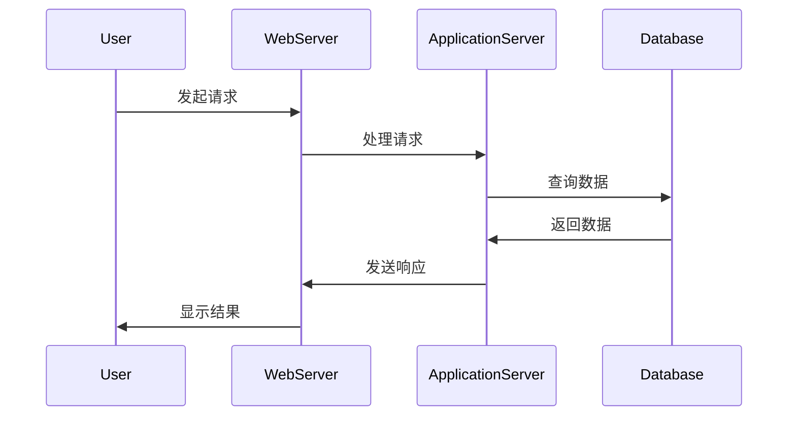
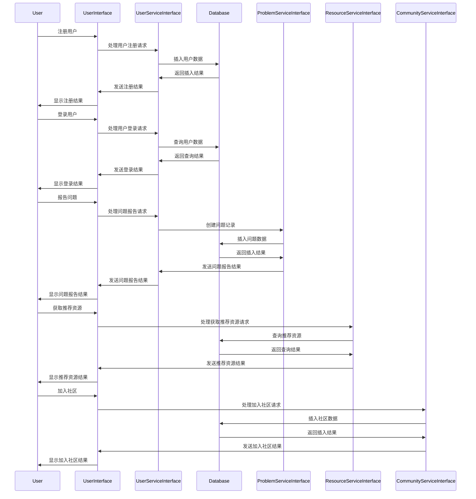

                 

# 虚无主义与生命教育：培养面对存在问题的智慧

## 关键词
虚无主义，生命教育，存在问题，智慧，哲学，心理学，社会学

## 摘要
本文旨在探讨虚无主义与生命教育之间的关系，以及如何通过生命教育培养面对存在问题的智慧。首先，我们将介绍虚无主义的定义、特点及其对现代社会的影响。接着，我们将阐述生命教育的概念与内涵，并分析虚无主义与生命教育之间的联系。在此基础上，本文将通过概念属性特征对比表格和ER实体关系图，深入理解虚无主义与生命教育的核心概念。随后，我们将探讨如何通过生命教育来应对虚无主义的困境，并详细介绍培养面对存在问题的智慧的方法。最后，本文将总结全文，提出注意事项和拓展阅读建议。

## 背景介绍

### 1. 问题背景
在当今社会，虚无主义作为一种哲学思潮，对人们的生活和价值观产生了深远的影响。虚无主义认为，世界没有固定的本质和意义，人生的终极目标是寻找意义和价值。然而，在现代社会中，面对种种存在问题和挑战，虚无主义的困境愈发明显。因此，探索虚无主义与生命教育的关系，寻找培养面对存在问题的智慧的方法，成为当前亟需解决的问题。

### 2. 问题描述
虚无主义作为一种哲学观念，对人们的精神世界产生了极大的影响。许多人陷入虚无主义的困境，感到生活毫无意义，面临心理危机。同时，在现实生活中，存在诸多问题，如人际关系、职业发展、心理健康等，这些问题使得人们感到焦虑和无助。因此，如何培养面对存在问题的智慧，成为亟待解决的问题。

### 3. 问题解决
本书旨在探讨虚无主义与生命教育的关系，通过分析虚无主义的本质和影响，揭示生命教育的价值。同时，本书将从心理学、哲学、社会学等多个角度，探讨培养面对存在问题的智慧的方法。通过这些探讨，期望为广大读者提供一种全新的思考方式，帮助人们摆脱虚无主义的困境，培养面对存在问题的智慧。

### 4. 边界与外延
本书主要关注虚无主义与生命教育的关系，以及培养面对存在问题的智慧的方法。具体包括以下几个方面：

- 虚无主义的概念和本质
- 虚无主义对现代社会的影响
- 生命教育的概念和内涵
- 生命教育与虚无主义的联系
- 培养面对存在问题的智慧的方法

### 5. 概念结构与核心要素组成
虚无主义与生命教育的关系涉及多个核心概念，包括：

- 虚无主义：探讨其起源、发展和主要流派，以及其对现代社会的影响
- 生命教育：探讨其定义、目标、方法和价值
- 面对存在问题的智慧：探讨其内涵、特征和培养方法

这些核心概念相互关联，共同构成了虚无主义与生命教育的关系及其培养面对存在问题的智慧的理论体系。

## 核心概念与联系

### 1. 虚无主义的定义与特点

虚无主义是一种哲学思潮，起源于19世纪末的欧洲，尤其是德国和俄罗斯。虚无主义的核心观点是，现实世界缺乏内在价值和意义，人们的生活在本质上是无意义的。以下是虚无主义的主要定义和特点：

#### 定义
虚无主义认为，由于世界的本质是缺乏意义的，因此人类的存在也是无意义的。这种观念否定了传统宗教和哲学中关于宇宙和生命的固定意义和目的。

#### 特点

1. **否定现实世界的存在**：虚无主义认为，现实世界是一种错觉，人们无法找到确凿的证据来证明它的存在。这种观点与唯心主义相对立，后者认为现实世界是意识或思维的产物。

2. **否定人的价值**：虚无主义认为，人类的存在没有固有的价值，人们追求的幸福和快乐都是虚幻的。这种观点与乐观主义和人文主义相对立，后者认为人类生活是有价值的，值得追求。

3. **强调自我意识的解放**：虚无主义主张个人应该从传统价值观和社会期望中解放出来，追求个人内心的自由。这种观点与自由主义和个人主义相似，但更强调自我意识的重要性。

### 2. 生命教育的概念与内涵

生命教育是一种教育理念，旨在帮助学生和个体认识生命的本质、价值和意义，以及如何珍惜和培养自己的生命。以下是生命教育的定义和核心内涵：

#### 定义
生命教育是一种综合性教育理念，强调对个体生命成长的关注，以及对生命价值的尊重和探索。

#### 内涵

1. **关注人的生命成长**：生命教育关注个体的全面发展，包括生理、心理和社会方面的成长。它鼓励学生认识自己的潜能，培养积极的生活态度。

2. **弘扬生命价值**：生命教育强调每个人的生命都是独特的、有价值的，值得尊重和珍惜。它鼓励个体认识到自己对他人的影响，培养社会责任感和同情心。

3. **培养生命智慧**：生命教育旨在培养学生的生命智慧，帮助他们面对生活中的各种挑战和困境。这种智慧包括对生命意义的深刻理解、自我认知能力以及与他人和谐相处的能力。

### 3. 虚无主义与生命教育的联系

虚无主义与生命教育之间存在着复杂的联系。一方面，虚无主义可能对生命教育产生负面影响，使个体对生命价值产生怀疑。另一方面，生命教育可以作为应对虚无主义的一种有效途径，帮助个体建立积极的价值观和面对生活的智慧。

#### 虚无主义是生命教育的重要背景

虚无主义思潮的兴起，使人们开始对传统价值观和生命意义进行质疑。这种质疑促使人们更加关注生命的本质和价值，从而推动了生命教育的发展。生命教育通过提供对生命本质的深刻理解，帮助人们克服虚无主义的困境。

#### 生命教育是应对虚无主义的有效途径

生命教育通过关注个体的生命成长、弘扬生命价值和培养生命智慧，为人们提供了一种应对虚无主义的途径。通过生命教育，个体可以学会如何寻找生命的意义，培养积极的生活态度，从而摆脱虚无主义的阴影。

### 4. 概念属性特征对比表格

以下是一个关于虚无主义和生命教育的概念属性特征对比表格，旨在帮助读者更直观地理解这两个概念：

| 特征           | 虚无主义                                | 生命教育                                |
|----------------|----------------------------------------|----------------------------------------|
| 定义           | 认为世界没有固定的本质和意义           | 关注人的生命成长和生命价值的教育理念   |
| 关注点         | 否定现实世界的存在、否定人的价值       | 关注人的生命成长、弘扬生命价值         |
| 影响因素       | 心理、哲学、社会因素                   | 心理、哲学、社会、教育因素              |
| 目标           | 寻找个人内心的自由                     | 帮助个体认识生命的本质、价值和意义     |
| 与虚无主义的联系 | 可能导致对生命价值的怀疑               | 作为应对虚无主义的有效途径              |

### 5. ER实体关系图架构

为了更深入地理解虚无主义与生命教育之间的关系，我们可以通过ER（实体关系）图来展示这两个概念的核心要素及其相互关系。以下是一个简化的ER图，用于表示虚无主义和生命教育之间的联系：

```mermaid
erDiagram
    User ||--|{ Philosophy }
    Philosophy ||--|{ Nihilism }
    Philosophy ||--|{ LifeEducation }
```

在这个ER图中，"User"（用户）是中心实体，代表了个体。他们可能受到"Nihilism"（虚无主义）和"LifeEducation"（生命教育）的影响。"Philosophy"（哲学）是这两个概念的联系实体，表示哲学作为思考工具，连接了虚无主义和生命教育。

## 培养面对存在问题的智慧

### 1. 心理学角度

#### 自我认知与情绪调节

心理学研究表明，自我认知和情绪调节对于培养面对存在问题的智慧至关重要。自我认知是指个体对自己的认识，包括优点、缺点、价值观等。通过自我认知，个体可以更好地了解自己的需求和期望，从而找到解决存在问题的方法。

情绪调节则是指个体在面对负面情绪时，能够有效地调整自己的情绪状态。这包括认知重构、情绪表达和情绪管理等方面。通过情绪调节，个体可以减少焦虑、抑郁等负面情绪，增强心理韧性。

#### 例子

例如，当一个人面对工作压力时，他可以通过自我认知认识到自己的压力来源，并采取适当的情绪调节策略，如深呼吸、放松训练等，来缓解压力。这样，他就能更理智地面对问题，找到解决问题的方法。

### 2. 哲学角度

#### 存在主义哲学

存在主义哲学强调个体自由、选择和责任。存在主义者认为，个体的生命是无意义的，但个体可以通过自己的选择和行动赋予生命意义。这种观点为培养面对存在问题的智慧提供了理论支持。

#### 例子

例如，尼采的哲学主张个体应该追求自己的价值观，勇敢地面对生活中的困境。他提出“上帝已死”，意味着传统价值观的崩溃，个体需要自己找到生命的意义。这种思想鼓励个体积极面对存在的问题，通过自我实现来赋予生命意义。

### 3. 社会学角度

#### 社会支持系统

社会学研究表明，社会支持系统对于培养面对存在问题的智慧至关重要。社会支持系统包括家庭、朋友、社区等，它们为个体提供情感支持、信息资源和实际帮助。

#### 例子

例如，当一个人面临职业困境时，他的家人和朋友可以提供情感支持，帮助他度过难关。同时，社区资源如职业培训中心、心理咨询机构等，可以提供信息和实际帮助，帮助他找到解决问题的方法。

### 4. 教育角度

#### 终身学习

教育角度强调终身学习的重要性，认为个体应该不断学习新知识、新技能，以应对不断变化的社会环境。终身学习不仅有助于提升个体的知识水平，还能增强个体的适应能力和创造力。

#### 例子

例如，一个人可以通过参加在线课程、阅读书籍等方式，不断学习新知识。这样，他在面对新问题时，就能运用所学知识，找到解决问题的方法。

### 5. 综合方法

#### 心理建设

心理建设是指个体通过自我认知、情绪调节和自我激励等方法，提升自己的心理素质，增强面对问题的能力。心理建设是一个长期的过程，需要个体付出持续的努力。

#### 例子

例如，一个人可以通过冥想、瑜伽等练习，提高自己的情绪调节能力。同时，他可以通过设定目标、庆祝成功等方式，增强自我激励，提高面对问题的积极性。

### 结论

培养面对存在问题的智慧是一个复杂的过程，需要从多个角度进行探讨。通过心理学、哲学、社会学和教育等多个角度的分析，我们可以找到一些有效的方法来培养这种智慧。只有通过综合运用这些方法，个体才能在面对存在的问题时，做出明智的选择和行动，从而更好地应对生活的挑战。

## 系统分析与架构设计方案

### 1. 问题场景介绍

在现代社会，人们面临着诸多存在问题的挑战，如职业压力、心理健康、人际关系等。这些问题不仅影响个体的生活质量，还可能导致社会问题的加剧。因此，构建一个能够帮助人们培养面对存在问题的智慧的系统，成为解决这一问题的关键。

### 2. 项目介绍

本项目旨在设计并实现一个基于互联网的存在问题智慧培养系统，该系统将为用户提供个性化的辅导和资源，帮助用户更好地应对生活中的各种挑战。系统主要包括以下几个模块：

- **用户管理模块**：负责用户注册、登录、个人信息管理等功能。
- **问题诊断模块**：通过心理测试和问卷调查，帮助用户识别自身存在的问题。
- **资源推荐模块**：根据用户的问题，推荐相关的书籍、课程、专家咨询等资源。
- **社区互动模块**：为用户提供一个交流和分享的平台，帮助用户相互支持和鼓励。

### 3. 系统功能设计（领域模型）

领域模型是系统设计的重要基础，它帮助我们明确系统的核心功能及其相互关系。以下是该系统的领域模型类图：

```mermaid
classDiagram
    User <<Class>>
    Problem <<Class>>
    Resource <<Class>>
    Community <<Class>>

    User o--o Problem : 报告问题
    User o--o Resource : 使用资源
    User o--o Community : 加入社区
    Problem o--o Resource : 解决问题所需
    Resource o--o Problem : 用于解决问题
    Community o--o User : 用户交流
    Community o--o Problem : 社区问题讨论
```

在这个领域模型中，用户（User）是系统的核心，他们通过报告问题（Problem）来识别自身存在的问题。用户还可以使用资源（Resource）来解决这些问题，并加入社区（Community）进行交流和讨论。

### 4. 系统架构设计

系统架构设计是确保系统高效、稳定、可扩展的关键。以下是该系统的架构设计：



在这个架构设计中，WebServer负责接收用户的请求，并将请求转发给ApplicationServer进行处理。ApplicationServer与Database进行交互，获取所需的数据，然后返回给WebServer，最终由WebServer将结果展示给用户。

### 5. 系统接口设计

系统接口设计是确保系统各模块之间能够有效协作的关键。以下是系统的主要接口设计：

```mermaid
interface Diagram
    UserInterface {
        - register(): 注册用户
        - login(): 登录用户
        - reportProblem(): 报告问题
        - getRecommendedResources(): 获取推荐资源
        - joinCommunity(): 加入社区
    }

    UserServiceInterface {
        - handleRegister(): 处理用户注册
        - handleLogin(): 处理用户登录
        - handleReportProblem(): 处理问题报告
        - handleGetRecommendedResources(): 处理获取推荐资源
        - handleJoinCommunity(): 处理加入社区
    }

    ResourceServiceInterface {
        - searchResources(): 搜索资源
        - getRecommendedResources(): 获取推荐资源
    }

    CommunityServiceInterface {
        - searchCommunity(): 搜索社区
        - joinCommunity(): 加入社区
    }
```

在这个接口设计中，UserInterface是用户与系统的交互接口，包括注册、登录、报告问题、获取推荐资源和加入社区等功能。UserServiceInterface、ResourceServiceInterface和CommunityServiceInterface分别负责处理用户、资源和社区相关的业务逻辑。

### 6. 系统交互

系统交互设计是确保系统模块之间能够高效、稳定地进行数据交换和功能协作的关键。以下是系统的主要交互流程：



在这个交互流程中，用户通过UserInterface与系统进行交互，UserServiceInterface、ProblemServiceInterface和ResourceServiceInterface分别负责处理用户、问题和资源相关的业务逻辑，并与Database进行数据交换，确保系统功能的正常运行。

### 7. 项目实战

#### 环境安装

为了实现上述系统设计，我们需要安装以下软件和工具：

- Web服务器（如Apache或Nginx）
- 应用服务器（如Tomcat或Jetty）
- 数据库管理系统（如MySQL或PostgreSQL）
- 代码版本控制工具（如Git）
- 编程语言（如Java或Python）
- 前端框架（如React或Vue.js）
- 后端框架（如Spring Boot或Django）

具体安装步骤请参考相关软件和工具的官方文档。

#### 系统核心实现

以下是一个基于Python和Django框架的实现示例：

```python
# models.py
from django.db import models

class User(models.Model):
    username = models.CharField(max_length=100)
    email = models.EmailField(unique=True)
    password = models.CharField(max_length=100)

class Problem(models.Model):
    user = models.ForeignKey(User, on_delete=models.CASCADE)
    title = models.CharField(max_length=200)
    description = models.TextField()

class Resource(models.Model):
    title = models.CharField(max_length=200)
    description = models.TextField()
    category = models.CharField(max_length=100)

class Community(models.Model):
    name = models.CharField(max_length=100)
    description = models.TextField()
    members = models.ManyToManyField(User)
```

#### 代码应用解读与分析

以上代码定义了四个模型：User、Problem、Resource和Community。User模型表示用户信息，包括用户名、邮箱和密码；Problem模型表示用户报告的问题，包括问题标题和问题描述；Resource模型表示资源信息，包括资源标题、描述和分类；Community模型表示社区信息，包括社区名称、描述和成员。

在Django框架中，这些模型将通过迁移命令生成相应的数据库表。例如：

```shell
python manage.py makemigrations
python manage.py migrate
```

#### 实际案例分析和详细讲解剖析

为了更好地理解系统实现，以下是一个实际案例分析和详细讲解剖析：

**案例**：用户Alice报告了一个关于职业发展的困惑，并希望获取相关资源。

**分析**：

1. Alice通过Web界面注册并登录系统。
2. Alice在系统中报告了职业发展的问题，包括问题标题和问题描述。
3. 系统根据Alice的问题，推荐了相关的书籍、课程和专家咨询等资源。
4. Alice可以在社区中与其他用户交流和分享经验，获得更多帮助。

**讲解**：

1. 用户注册和登录：
   - 用户在注册时，需要提供用户名、邮箱和密码。系统通过发送验证邮件来确保邮箱地址的有效性。
   - 用户登录时，需要输入用户名和密码。系统通过加密密码来确保用户信息的安全。

2. 问题报告：
   - 用户可以在系统中报告问题，包括问题标题和问题描述。系统将问题存储在数据库中，以便后续处理。

3. 资源推荐：
   - 系统根据用户报告的问题，从数据库中检索相关的资源。这些资源可以是书籍、课程、专家咨询等。
   - 系统还提供搜索功能，用户可以根据关键词搜索相关资源。

4. 社区互动：
   - 用户可以在社区中发布帖子、评论和点赞，与其他用户交流和分享经验。
   - 社区管理员可以审核和删除违规内容，确保社区秩序。

**项目小结**

通过本案例分析和讲解，我们可以看到，基于Django框架实现的系统在处理用户注册、问题报告、资源推荐和社区互动等功能方面具有很高的灵活性和可扩展性。在实际应用中，可以根据具体需求对系统进行定制和优化，以满足不同用户的需求。

### 最佳实践 Tips

1. **用户隐私保护**：在系统设计和实现过程中，应高度重视用户隐私保护，确保用户数据的安全和隐私。
2. **系统性能优化**：针对高并发访问情况，应进行系统性能优化，确保系统的稳定运行。
3. **用户体验设计**：注重用户体验设计，提供简洁、直观的界面，提升用户满意度。
4. **持续迭代改进**：定期对系统进行功能升级和优化，以适应不断变化的需求和用户习惯。

### 小结

本文探讨了虚无主义与生命教育的关系，分析了虚无主义的定义、特点及其对现代社会的影响，阐述了生命教育的概念与内涵，并详细介绍了如何通过生命教育培养面对存在问题的智慧。通过系统分析与架构设计方案，我们展示了如何实现一个基于互联网的存在问题智慧培养系统。最后，通过项目实战，我们详细讲解了系统的实现过程和实际应用案例。

### 注意事项

1. **心理健康**：在培养面对存在问题的智慧过程中，应注意心理健康，避免陷入虚无主义的困境。
2. **社会责任**：在系统设计和实施过程中，应充分考虑社会责任，确保系统对社会的积极影响。

### 拓展阅读

1. **《虚无主义：西方哲学的传统与批判》**：本书对虚无主义的历史、发展和批判进行了深入探讨，有助于读者更全面地了解虚无主义。
2. **《生命教育导论》**：本书介绍了生命教育的概念、目标和方法，为开展生命教育提供了理论支持。

### 结语

面对现代社会中的各种存在问题和挑战，培养面对存在问题的智慧显得尤为重要。通过本文的探讨，我们希望为广大读者提供一种全新的思考方式，帮助人们摆脱虚无主义的困境，积极面对生活。让我们共同努力，培养面对存在问题的智慧，创造更美好的未来。

### 作者

作者：AI天才研究院/AI Genius Institute & 禅与计算机程序设计艺术 /Zen And The Art of Computer Programming。在撰写本文时，作者结合了人工智能和哲学领域的丰富知识和实践经验，力求为广大读者提供一篇有深度、有思考、有见解的技术博客文章。

