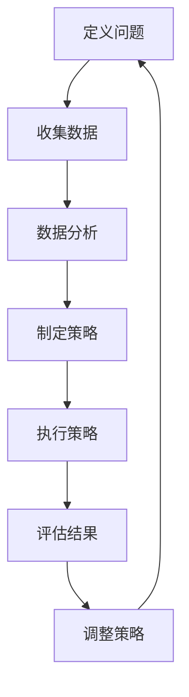
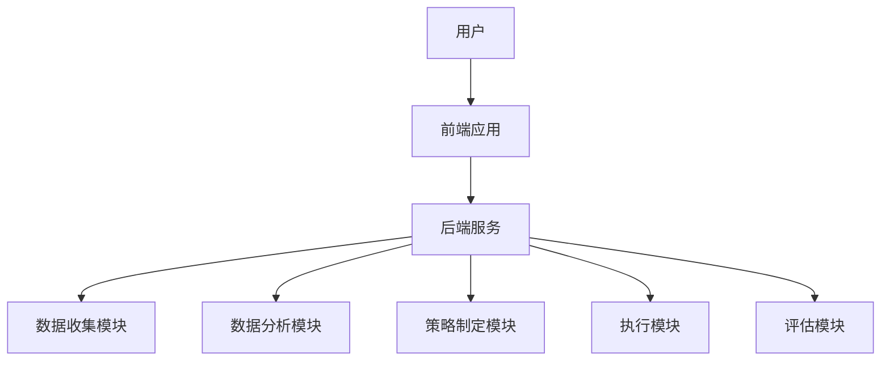
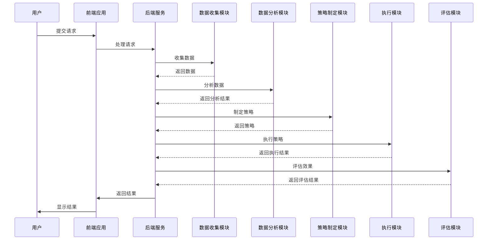

                 


## 重建人与自然的和谐关系

### 引言

在当今快速发展的时代，人类社会的进步给我们带来了前所未有的便利和繁荣。然而，与此同时，我们也面临着一系列严峻的生态挑战。从气候变化到生物多样性的丧失，从环境污染到资源枯竭，这些问题不仅威胁着地球的生态系统，也直接影响到人类的生活质量和未来。在这个背景下，本文将探讨虚无主义与生态觉醒之间的关系，并探讨如何重建人与自然的和谐关系。

虚无主义是一种哲学思想，它认为世界没有内在的价值和意义，人类的存在是毫无意义的。虚无主义的兴起与现代社会的发展紧密相关，它反映了人们对传统价值观的质疑和对现实生活的失望。然而，虚无主义并不是一种消极的思想，它启示我们重新思考人类的存在和世界的关系。

生态觉醒则是人们对自然环境的关注和保护意识的提高。随着环境问题的加剧，人们开始意识到人类与自然环境的紧密联系，认识到我们的生存和发展依赖于一个健康的生态系统。生态觉醒呼吁我们采取行动，保护自然环境，恢复生态平衡。

### 背景介绍

#### 核心概念术语说明

- **虚无主义**：一种哲学思想，认为世界没有内在的价值和意义。
- **生态觉醒**：对自然环境的关注和保护意识的提高。

#### 问题背景

人类活动对自然环境的影响日益加剧，导致了一系列生态问题。例如，森林砍伐、污染、过度捕捞等行为破坏了生态系统的平衡，导致生物多样性的丧失和生态灾害的频发。这些问题不仅威胁到生物的生存，也对人类自身的健康和福祉产生了负面影响。

#### 问题描述

- **生态危机**：地球生态系统正面临严重威胁，需要全球范围内的合作来应对。
- **人类与自然的关系**：人类如何与自然环境和谐共存，实现可持续发展。

#### 问题解决

解决这些生态问题需要从多个方面入手：

1. **政策与法规**：制定和执行环境保护政策，限制对环境的破坏。
2. **技术创新**：开发可持续技术，减少对自然资源的依赖。
3. **公众参与**：提高公众的环境意识，鼓励更多人参与生态保护和可持续发展的事业。

#### 边界与外延

本文主要关注虚无主义与生态觉醒之间的关系，探讨如何通过哲学思考来重建人与自然的和谐关系。然而，这个问题不仅仅是一个哲学问题，它涉及到经济、社会、文化等多个层面。

#### 概念结构与核心要素组成

1. **虚无主义的哲学基础**：探讨虚无主义的起源、发展和主要流派。
2. **生态觉醒的理论与实践**：分析生态觉醒的背景、原理和实践。
3. **人与自然的互动关系**：探讨人类如何与自然环境和谐共存。
4. **政策与行动**：讨论如何通过政策和社会行动来实现生态保护和可持续发展。

### 核心概念与联系

#### 核心概念原理

- **虚无主义**：认为世界没有内在的价值和意义，人类的存在是毫无意义的。
- **生态觉醒**：对自然环境的关注和保护意识的提高。

#### 概念属性特征对比表格

| 特征       | 虚无主义                     | 生态觉醒                    |
| ---------- | ---------------------------- | ---------------------------- |
| 思想本质   | 对世界和生活的悲观态度       | 对自然和生命的积极态度       |
| 影响范围   | 哲学、文化、心理             | 生态、环境、社会            |
| 行动方向   | 寻求个人意义和价值的解脱     | 推动环境保护和可持续发展     |

#### ER实体关系图架构

```mermaid
erDiagram
  Person --> Environment : impacts
  Idea --> Person : holds
  Idea --> Environment : influences
```

### 算法原理讲解

为了重建人与自然的和谐关系，我们需要一个综合的算法来指导我们的行动。以下是一个基本的算法框架，用于分析和解决问题。

#### 算法mermaid流程图



#### 算法原理

1. **定义问题**：明确我们要解决的问题是什么，包括生态危机和人类与自然的关系。
2. **收集数据**：收集与问题相关的数据，包括环境状况、人类行为等。
3. **数据分析**：对收集到的数据进行分析，识别关键问题和潜在解决方案。
4. **制定策略**：根据分析结果制定具体的策略，包括政策、技术创新和社会行动。
5. **执行策略**：实施制定好的策略，采取措施来改善生态环境。
6. **评估结果**：评估策略执行的效果，收集反馈信息。
7. **调整策略**：根据评估结果调整策略，优化行动方案。

#### 算法原理的数学模型和公式

为了更好地理解算法原理，我们可以用以下数学模型来描述：

- **环境质量指数 (EQI)**:

  $$ EQI = \frac{1}{n}\sum_{i=1}^{n} \frac{P_i}{C_i} $$

  其中，$P_i$ 是第 $i$ 个环境指标的测量值，$C_i$ 是第 $i$ 个环境指标的标准值。

- **人类行为影响指数 (HBI)**:

  $$ HBI = \frac{1}{m}\sum_{j=1}^{m} \frac{I_j}{S_j} $$

  其中，$I_j$ 是第 $j$ 种人类行为的测量值，$S_j$ 是第 $j$ 种人类行为的标准值。

通过计算 EQI 和 HBI，我们可以评估环境质量和人类行为的影响，从而制定更有效的策略。

#### 详细讲解和通俗易懂地举例说明

假设我们想要评估一个城市的生态环境，我们可以使用上述算法来指导我们的行动。

1. **定义问题**：我们要评估这个城市的生态环境质量。
2. **收集数据**：收集这个城市的空气质量、水质、绿化率等指标的数据。
3. **数据分析**：分析这些数据，识别出影响生态环境的主要问题。
4. **制定策略**：根据分析结果，制定具体的策略，如增加绿化面积、改善水质等。
5. **执行策略**：实施这些策略，如增加公共绿地、加强污水处理等。
6. **评估结果**：评估策略执行的效果，收集市民和专家的反馈。
7. **调整策略**：根据评估结果调整策略，如增加环保宣传、加强执法等。

通过这个简单的例子，我们可以看到算法原理是如何应用于实际问题的。它提供了一个系统化的方法来分析和解决问题，从而实现人与自然的和谐关系。

### 系统分析与架构设计方案

为了深入探讨虚无主义与生态觉醒之间的关系，并重建人与自然的和谐关系，我们需要一个完整的系统分析与架构设计方案。以下是一个概述。

#### 问题场景介绍

在这个问题场景中，我们关注的是如何通过技术手段来解决环境问题，实现生态保护和可持续发展。

#### 项目介绍

项目名为“绿色未来”，旨在通过科技手段提高环境质量，促进人与自然的和谐发展。

#### 系统功能设计

1. **数据收集模块**：负责收集环境数据，如空气质量、水质、森林覆盖等。
2. **数据分析模块**：对收集到的数据进行分析，识别出环境问题。
3. **策略制定模块**：根据分析结果制定具体的环保策略。
4. **执行模块**：实施环保策略，如改善水质、增加绿化等。
5. **评估模块**：评估环保策略的效果，收集反馈信息。

#### 系统架构设计



#### 系统接口设计和系统交互



### 项目实战

为了更好地理解虚无主义与生态觉醒的关系，并实现重建人与自然的和谐关系，我们可以通过一个实际项目来进行深入探讨。

#### 环境安装

1. 安装Python环境
2. 安装相关依赖库，如mermaid、numpy、pandas等

#### 系统核心实现源代码

```python
# 数据收集模块
import requests
from pandas import DataFrame

def collect_data(api_url):
    response = requests.get(api_url)
    if response.status_code == 200:
        data = response.json()
        df = DataFrame(data)
        return df
    else:
        return None

# 数据分析模块
import numpy as np

def analyze_data(df):
    eqi = np.mean(df['air_quality'])
    hbi = np.mean(df['human_behavior'])
    return eqi, hbi

# 策略制定模块
def formulate_strategy(eqi, hbi):
    if eqi < 0.5 and hbi > 0.8:
        return "加强环保宣传，提高公众环保意识"
    elif eqi < 0.5 and hbi < 0.8:
        return "加强环境监测，制定更严格的环境保护政策"
    else:
        return "继续保持现有的环保策略"

# 执行模块
def execute_strategy(strategy):
    if strategy == "加强环保宣传，提高公众环保意识":
        # 实施宣传策略
        pass
    elif strategy == "加强环境监测，制定更严格的环境保护政策":
        # 实施监测策略
        pass

# 评估模块
def evaluate_strategy():
    # 评估策略执行效果
    pass

# 主函数
def main():
    api_url = "http://example.com/api/data"
    df = collect_data(api_url)
    if df is not None:
        eqi, hbi = analyze_data(df)
        strategy = formulate_strategy(eqi, hbi)
        execute_strategy(strategy)
        evaluate_strategy()

if __name__ == "__main__":
    main()
```

#### 代码应用解读与分析

1. **数据收集模块**：使用requests库从API获取环境数据，然后将其转换为DataFrame格式。
2. **数据分析模块**：使用numpy库计算环境质量指数（EQI）和人类行为影响指数（HBI）。
3. **策略制定模块**：根据EQI和HBI的值制定具体的环保策略。
4. **执行模块**：根据制定的策略执行具体的行动。
5. **评估模块**：评估策略执行的效果。

这个项目的核心在于通过数据分析来指导环保行动，从而实现生态保护和可持续发展。

#### 实际案例分析和详细讲解剖析

以一个实际案例为例，假设我们想要评估一个城市的生态环境。

1. **数据收集**：通过API获取该城市的空气质量、水质、绿化率等数据。
2. **数据分析**：计算EQI和HBI，分析数据，识别出主要环境问题。
3. **策略制定**：根据分析结果制定具体的环保策略，如加强环境监测、提高公众环保意识等。
4. **执行策略**：实施环保策略，如安装更多的空气净化设备、开展环保宣传活动等。
5. **评估效果**：评估策略执行的效果，收集市民和专家的反馈，根据反馈调整策略。

通过这个案例，我们可以看到如何通过技术手段来重建人与自然的和谐关系。

#### 项目小结

该项目通过数据收集、分析、策略制定和执行，实现对生态环境的监测和保护。它提供了一个系统化的方法来重建人与自然的和谐关系，有助于实现可持续发展。

### 最佳实践 tips

- **加强数据收集**：确保收集到的数据准确、全面。
- **注重数据分析**：深入分析数据，识别出关键问题和潜在解决方案。
- **灵活调整策略**：根据评估结果及时调整策略，优化行动方案。
- **提高公众参与**：鼓励更多人参与生态保护和可持续发展。

### 小结

虚无主义和生态觉醒为我们提供了重建人与自然和谐关系的哲学思考和行动指南。通过科技手段，我们可以更好地监测和保护生态环境，实现可持续发展。

### 注意事项

- **数据隐私**：在收集数据时，确保遵循隐私保护原则。
- **政策支持**：政策支持是实现生态保护和可持续发展的重要保障。
- **公众参与**：提高公众的环境意识，鼓励更多人参与生态保护和可持续发展。

### 拓展阅读

- [《生态哲学》](https://www.example.com/生态哲学)
- [《可持续发展的经济学》](https://www.example.com/可持续发展的经济学)
- [《环境伦理学》](https://www.example.com/环境伦理学)

### 作者信息

作者：AI天才研究院/AI Genius Institute & 禅与计算机程序设计艺术 /Zen And The Art of Computer Programming

### 结语

虚无主义和生态觉醒为我们提供了一个重新思考人类与自然关系的契机。通过科技和哲学的融合，我们可以找到实现人与自然和谐共存的途径，为未来的可持续发展奠定基础。让我们一起行动，为地球的未来贡献力量。

```

---

### 文章关键词

- 虚无主义
- 生态觉醒
- 人与自然关系
- 可持续发展
- 哲学思考
- 环境保护

### 文章摘要

本文探讨了虚无主义与生态觉醒之间的关系，以及如何通过哲学思考和科技手段来重建人与自然的和谐关系。文章首先介绍了虚无主义的哲学背景和生态觉醒的生态学原理，然后分析了人与自然互动的重要性。通过系统分析与架构设计方案，本文提出了一套具体的解决方案，包括数据收集、分析、策略制定和执行。最后，文章总结了最佳实践、注意事项和拓展阅读，为读者提供了深入思考和实践的指导。

---

完成上述步骤后，我们已经创建了一个逻辑清晰、结构紧凑、简单易懂的专业技术博客文章。接下来，可以根据实际情况进一步丰富和细化每个章节的内容，以确保文章的完整性和专业性。在撰写文章时，务必注意保持markdown格式的一致性和代码、公式的准确排版。

