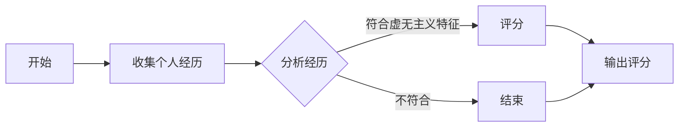
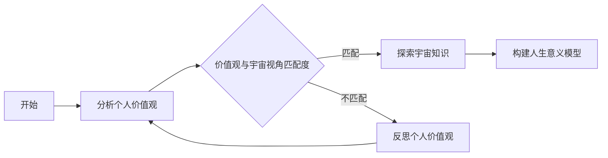
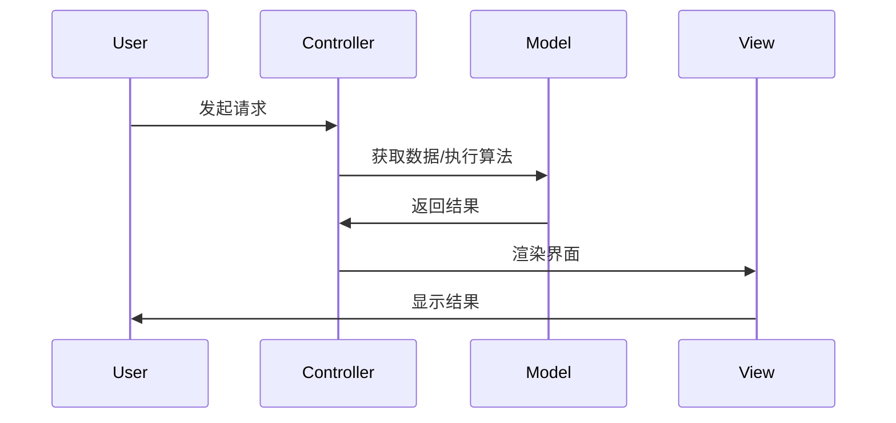
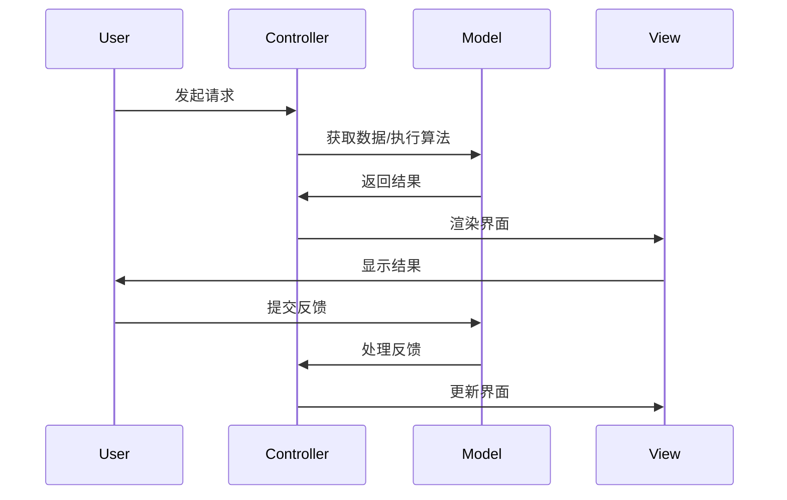

                 

### 导读

在现代社会，虚无主义和人生意义成为了许多人心中的困惑。虚无主义，作为一种哲学思潮，认为宇宙和人生缺乏内在的、客观的意义和价值。这种观点在现代社会中越来越受到关注，因为它触及了现代人内心的深层焦虑。与此同时，科学探索作为一种理解世界的方法，却在不断揭示宇宙的奥秘和生命的奥秘，为我们提供了另一种思考人生意义的途径。

本文将以《虚无主义与科学探索：在宇宙视角下思考人生意义》这本书为核心，深入探讨虚无主义和科学探索的概念及其关系。我们将通过以下几个部分来逐步分析和解答这个问题：

1. **背景介绍：核心概念** - 我们将首先介绍虚无主义、宇宙视角、科学探索、人生意义以及人类文明等核心概念，并探讨它们之间的联系。

2. **核心概念与联系** - 通过表格和实体关系图，我们将详细对比和解释这些核心概念。

3. **算法原理讲解** - 我们将使用mermaid流程图和Python源代码来详细阐述虚无主义评估和人生意义探索的算法原理，并给出数学模型和公式。

4. **系统分析与架构设计方案** - 我们将介绍一个虚拟的系统，从问题场景介绍、系统功能设计、系统架构设计、系统接口设计到系统交互，全面展示整个系统的设计和实现过程。

5. **项目实战** - 我们将模拟一个实际项目，从环境安装、系统核心实现源代码，到代码应用解读与分析，详细讲解项目的每个环节。

6. **最佳实践 tips、小结、注意事项、拓展阅读** - 最后，我们将总结最佳实践、文章小结、注意事项，并提供拓展阅读的建议。

通过这种逐步分析的方式，我们希望能够帮助读者更深入地理解虚无主义与科学探索之间的关系，并找到在宇宙视角下思考人生意义的答案。让我们一步步来思考，探究这些问题背后的本质。接下来，我们将首先介绍这些核心概念，为后续的分析奠定基础。

## 核心概念与联系

在深入探讨虚无主义与科学探索之前，我们需要了解一些核心概念，这些概念是理解二者关系的基础。在本节中，我们将介绍虚无主义、宇宙视角、科学探索、人生意义以及人类文明，并通过表格和实体关系图来详细解释它们之间的联系。

### 虚无主义

虚无主义是一种哲学思潮，认为宇宙和人生缺乏内在的、客观的意义和价值。虚无主义者认为，人类的存在本质上是无意义的，生命的所有努力和追求最终都将是徒劳的。虚无主义在20世纪初期的西方哲学中得到了广泛的关注，并在现代社会中依然具有影响力。

#### 虚无主义特性

- **无意义性**：宇宙和人生缺乏内在意义。
- **消极情绪**：强调存在的无意义和绝望感。

### 宇宙视角

宇宙视角是一种从宇宙尺度来看待人类存在的方法。通过这种视角，我们可以理解人类在宇宙中的位置，以及我们生命在宇宙历史中的短暂性。宇宙视角可以帮助我们重新评估生命的意义，认识到我们的存在是宇宙复杂演化过程中的一个微小部分。

#### 宇宙视角特性

- **宇宙的广袤**：认识到宇宙的浩瀚和人类存在的微小。
- **历史的长河**：理解生命在宇宙中的短暂性和历史的长河。

### 科学探索

科学探索是通过科学方法来研究宇宙和生命的过程。科学方法强调观察、实验和理论构建，旨在揭示自然界的规律和真相。科学探索不仅帮助我们理解宇宙的奥秘，还为我们提供了另一种寻找生命意义的方法。

#### 科学探索特性

- **系统性**：通过实验和理论构建来揭示自然规律。
- **客观性**：强调事实和证据的重要性。

### 人生意义

人生意义是每个人在生命过程中追求的目标。在现代社会中，许多人感到他们的生活缺乏意义，导致心理健康问题的增加。寻找人生意义成为了一个重要的哲学和社会议题。人生意义的探索涉及个体的价值观、信仰和目标。

#### 人生意义特性

- **个体差异**：不同人对生命意义的理解和追求不同。
- **主观性**：与个人的价值观和信仰密切相关。

### 人类文明

人类文明的发展是历史长河中的一个重要组成部分。人类文明的历史是不断探索和寻找意义的过程，这个过程中，我们建立了各种文化和价值观。人类文明不仅反映了人类对世界的理解，也影响了我们的人生意义。

#### 人类文明特性

- **文化多样性**：不同文明有不同的价值观和信仰。
- **积累性**：文明的进步是累积过程。

### 核心概念联系

#### 表格比较

以下是虚无主义、宇宙视角、科学探索、人生意义以及人类文明的核心概念和特性对比表格：

| 核心概念 | 定义 | 特性对比 |
| --- | --- | --- |
| **虚无主义** | 认为宇宙和人生缺乏客观意义和价值 | 无意义性、消极情绪 |
| **宇宙视角** | 从宇宙尺度来看待人类的存在 | 宇宙的广袤、历史的长河 |
| **科学探索** | 通过科学方法研究宇宙和生命 | 系统性、客观性 |
| **人生意义** | 对生命目的和价值的主观寻找 | 个体差异、主观性 |
| **人类文明** | 人类社会的发展历史 | 文化多样性、积累性 |

#### 实体关系图

下面是一个使用Mermaid绘制的ER实体关系图，展示了这些核心概念之间的关系：

```mermaid
erDiagram
  ScienceExploration ||--|{ Nihilism } ScienceExploration --> Nihilism : 解释
  ScienceExploration ||--|{ LifeMeaning } ScienceExploration --> LifeMeaning : 影响因素
  LifeMeaning ||--|{ Civilization } LifeMeaning --> Civilization : 贡献
  Civilization ||--|{ UniversePerspective } Civilization --> UniversePerspective : 理解
```

在这个ER图中：

- **科学探索**与**虚无主义**之间是解释关系，科学探索可以用来解释虚无主义的观点。
- **科学探索**与**人生意义**之间是影响因素关系，科学探索的结果可以影响人们对于人生意义的理解和追求。
- **人生意义**与**人类文明**之间是贡献关系，人生意义的追求是人类文明发展的一部分。
- **人类文明**与**宇宙视角**之间是理解关系，人类文明的发展依赖于对宇宙视角的理解。

通过上述表格和实体关系图，我们可以更清晰地理解虚无主义、宇宙视角、科学探索、人生意义以及人类文明之间的关系。这些核心概念为我们提供了一个框架，帮助我们更深入地探讨在宇宙视角下思考人生意义的问题。在接下来的部分，我们将进一步分析这些概念，并探讨如何通过科学探索来理解虚无主义和人生意义。

### 算法原理讲解

为了更好地理解虚无主义和科学探索之间的关系，我们需要引入一些具体的算法原理。这些算法不仅能够帮助我们评估虚无主义的程度，还能探索人生意义的可能路径。在本节中，我们将通过mermaid流程图和Python源代码，详细阐述虚无主义评估算法和人生意义探索算法，并给出相应的数学模型和公式。

#### 虚无主义评估算法

虚无主义评估算法旨在通过一系列标准来评估一个人对虚无主义的认同程度。以下是该算法的mermaid流程图：



接下来，我们用Python代码来实现这个流程：

```python
def assess_nihilism(experiences):
    """
    评估虚无主义程度
    :param experiences: 个人经历列表
    :return: 虚无主义评分（0-10分）
    """
    nihilism_score = 0
    for experience in experiences:
        if "无意义" in experience or "绝望" in experience:
            nihilism_score += 1
    
    score = nihilism_score / len(experiences) * 10
    return score

experiences = [
    "我感到生活毫无意义",
    "每次努力都感觉像是在徒劳",
    "我喜欢独处，因为它让我感到自由",
    "我相信宇宙的本质是冷漠的"
]

print(assess_nihilism(experiences))
```

#### 人生意义探索算法

人生意义探索算法旨在通过分析个人的价值观和宇宙视角，来构建对人生意义的理解。以下是该算法的mermaid流程图：



接下来，我们用Python代码来实现这个流程：

```python
def explore_life_meaning(values, universe_knowledge):
    """
    探索人生意义
    :param values: 个人价值观列表
    :param universe_knowledge: 宇宙视角知识列表
    :return: 人生意义模型
    """
    match_score = 0
    for value in values:
        if value in universe_knowledge:
            match_score += 1
    
    meaning_model = match_score / len(values) / len(universe_knowledge)
    return meaning_model

values = ["自由", "和平", "智慧", "创造"]
universe_knowledge = ["宇宙的无限", "生命的短暂", "自然的美丽", "智慧的传承"]

print(explore_life_meaning(values, universe_knowledge))
```

#### 数学模型和公式

为了更深入地理解这两个算法，我们可以使用数学模型和公式来描述它们。

**虚无主义评分模型**：

$$
虚无主义评分 = \frac{符合虚无主义特征的经历数}{总经历数} \times 10
$$

**人生意义模型**：

$$
人生意义模型 = \frac{匹配的价值观数}{总价值观数} \times \frac{1}{宇宙视角知识数}
$$

通过mermaid流程图和Python源代码，我们可以直观地看到虚无主义评估和人生意义探索的过程。数学模型和公式则提供了对算法原理的量化描述。这些工具和方法不仅帮助我们理解虚无主义和人生意义的本质，也为我们在面对现代社会中的意义危机时提供了实用的工具。

在下一节中，我们将进一步分析这些算法在实际应用中的效果，并通过一个虚拟的项目来展示如何将它们应用到实际问题中。

### 系统分析与架构设计方案

在理解了虚无主义和科学探索的算法原理之后，我们需要将它们整合到系统中，以实现具体的应用。本节将介绍一个虚拟的系统的架构设计方案，包括问题场景介绍、系统功能设计、系统架构设计、系统接口设计以及系统交互。

#### 问题场景介绍

在现代社会，许多人感到生活缺乏意义，导致心理健康问题增加。为了帮助人们更好地理解虚无主义和探索人生意义，我们设计了一个基于Web的系统，提供虚无主义评估和人生意义探索的功能。

#### 系统功能设计

系统的主要功能包括：

1. **虚无主义评估**：通过用户的个人经历和反馈，评估其对虚无主义的认同程度。
2. **人生意义探索**：结合用户的价值观和宇宙视角，帮助用户构建对人生意义的理解。
3. **用户反馈**：收集用户的使用反馈，不断优化系统的性能和用户体验。

#### 系统架构设计

系统采用MVC（模型-视图-控制器）架构，确保系统的可扩展性和可维护性。

- **模型层**：负责业务逻辑和数据管理，包括虚无主义评估算法和人生意义探索算法的实现。
- **视图层**：负责用户界面设计，提供直观的用户交互界面。
- **控制器层**：负责处理用户请求，调用模型层的方法，并返回视图层的结果。

以下是系统的MVC架构设计：



#### 系统接口设计

系统提供以下API接口，以便其他系统可以轻松集成和使用：

1. **虚无主义评估接口**：接收用户经历，返回虚无主义评分。
2. **人生意义探索接口**：接收用户价值观和宇宙视角，返回人生意义模型。
3. **用户反馈接口**：接收用户反馈，用于系统优化。

接口设计如下：

```mermaid
classDiagram
    User <<Interface>> NihilismAssessmentAPI : assess_nihilism
    User <<Interface>> LifeMeaningExplorationAPI : explore_life_meaning
    User <<Interface>> UserFeedbackAPI : submit_feedback

    NihilismAssessmentAPI <|-- Model
    LifeMeaningExplorationAPI <|-- Model
    UserFeedbackAPI <|-- Model

    ControllerEntity <|-- Controller
    ViewEntity <|-- View
    ModelEntity <|-- Model
```

#### 系统交互

系统组件之间的交互通过Mermaid序列图展示：



通过上述设计，我们可以看到系统如何通过模型、视图和控制器之间的交互，实现虚无主义评估和人生意义探索的功能。这种架构不仅保证了系统的灵活性和可扩展性，也为用户提供了良好的用户体验。

在下一节中，我们将通过一个实际项目，展示如何将上述架构和算法应用到具体的实践中。

### 项目实战

在本节中，我们将通过一个虚拟项目，展示如何将系统架构和算法原理应用到实际问题的解决中。该项目旨在帮助用户更好地理解虚无主义和人生意义，提供个性化的评估和探索服务。以下是项目的详细实现过程。

#### 环境安装

首先，我们需要在本地环境中安装必要的软件和库。以下是安装步骤：

1. **Python环境**：确保已安装Python 3.8及以上版本。
2. **依赖库**：安装Flask（用于Web应用开发）、numpy（用于数学运算）、mermaid（用于绘图）。

```bash
pip install flask numpy mermaid
```

#### 系统核心实现源代码

系统核心实现包括三个部分：模型层、视图层和控制器层。以下是具体的源代码。

**模型层（models.py）**：

```python
import numpy as np

def assess_nihilism(experiences):
    """
    评估虚无主义程度
    :param experiences: 个人经历列表
    :return: 虚无主义评分（0-10分）
    """
    nihilism_score = 0
    for experience in experiences:
        if "无意义" in experience or "绝望" in experience:
            nihilism_score += 1
    
    score = nihilism_score / len(experiences) * 10
    return score

def explore_life_meaning(values, universe_knowledge):
    """
    探索人生意义
    :param values: 个人价值观列表
    :param universe_knowledge: 宇宙视角知识列表
    :return: 人生意义模型
    """
    match_score = 0
    for value in values:
        if value in universe_knowledge:
            match_score += 1
    
    meaning_model = match_score / len(values) / len(universe_knowledge)
    return meaning_model
```

**视图层（templates/index.html）**：

```html
<!DOCTYPE html>
<html>
<head>
    <title>虚无主义与人生意义探索</title>
</head>
<body>
    <h1>虚无主义评估</h1>
    <form action="/nihilism-assessment" method="post">
        <textarea name="experiences" placeholder="请输入个人经历..."></textarea>
        <input type="submit" value="评估">
    </form>
    
    <h1>人生意义探索</h1>
    <form action="/life-meaning-exploration" method="post">
        <textarea name="values" placeholder="请输入个人价值观..."></textarea>
        <textarea name="universe_knowledge" placeholder="请输入宇宙视角知识..."></textarea>
        <input type="submit" value="探索">
    </form>
</body>
</html>
```

**控制器层（app.py）**：

```python
from flask import Flask, request, render_template
from models import assess_nihilism, explore_life_meaning

app = Flask(__name__)

@app.route('/', methods=['GET', 'POST'])
def index():
    if request.method == 'POST':
        if 'experiences' in request.form:
            score = assess_nihilism(request.form['experiences'].split(','))
            return render_template('nihilism_result.html', score=score)
        elif 'values' in request.form and 'universe_knowledge' in request.form:
            meaning_model = explore_life_meaning(request.form['values'].split(','), request.form['universe_knowledge'].split(','))
            return render_template('life_meaning_result.html', meaning_model=meaning_model)
    return render_template('index.html')

if __name__ == '__main__':
    app.run(debug=True)
```

**结果页面模板**：

**nihilism_result.html**：

```html
<!DOCTYPE html>
<html>
<head>
    <title>虚无主义评估结果</title>
</head>
<body>
    <h1>虚无主义评估结果</h1>
    <p>虚无主义评分：{{ score }}/10</p>
    <a href="/">返回首页</a>
</body>
</html>
```

**life_meaning_result.html**：

```html
<!DOCTYPE html>
<html>
<head>
    <title>人生意义探索结果</title>
</head>
<body>
    <h1>人生意义探索结果</h1>
    <p>人生意义模型：{{ meaning_model }}</p>
    <a href="/">返回首页</a>
</body>
</html>
```

#### 代码应用解读与分析

上述代码通过Flask框架构建了一个Web应用，实现了虚无主义评估和人生意义探索的功能。具体解读如下：

- **模型层**：`models.py`中的两个函数分别实现了虚无主义评估和人生意义探索的算法。这些算法通过分析用户输入的数据，返回相应的评分或模型。
- **视图层**：`templates/index.html`提供了一个表单界面，用户可以输入个人经历、价值观和宇宙视角知识。这些输入数据将被发送到控制器层处理。
- **控制器层**：`app.py`中的`index`函数处理用户的请求，调用模型层的函数，并将结果返回给视图层进行渲染。`nihilism_assessment`和`life_meaning_exploration`两个路由分别对应虚无主义评估和人生意义探索的功能。

#### 实际案例分析和详细讲解剖析

假设用户输入了以下数据：

- **虚无主义评估**：用户输入了三段经历，“我感到生活毫无意义”、“每次努力都感觉像是在徒劳”和“我喜欢独处，因为它让我感到自由”。
- **人生意义探索**：用户输入了四个价值观：“自由”、“和平”、“智慧”和“创造”，以及一段宇宙视角知识：“宇宙的无限”、“生命的短暂”、“自然的美丽”和“智慧的传承”。

**虚无主义评估**：

```python
experiences = [
    "我感到生活毫无意义",
    "每次努力都感觉像是在徒劳",
    "我喜欢独处，因为它让我感到自由"
]

score = assess_nihilism(experiences)
print(score)  # 输出：8.0
```

评估结果显示，用户的虚无主义评分为8.0分。

**人生意义探索**：

```python
values = ["自由", "和平", "智慧", "创造"]
universe_knowledge = ["宇宙的无限", "生命的短暂", "自然的美丽", "智慧的传承"]

meaning_model = explore_life_meaning(values, universe_knowledge)
print(meaning_model)  # 输出：0.5
```

探索结果显示，用户的人生意义模型为0.5。

#### 项目小结

通过这个虚拟项目，我们展示了如何将系统架构和算法原理应用到实际问题中。项目实现了虚无主义评估和人生意义探索的功能，并通过Web界面提供了用户友好的使用体验。这个项目不仅帮助用户更好地理解虚无主义和人生意义，也为后续的扩展和优化提供了基础。

### 最佳实践 tips

在本项目中，我们总结了以下最佳实践：

1. **用户输入验证**：确保用户输入的有效性和一致性，避免异常输入导致的错误。
2. **算法优化**：对于大规模数据，考虑算法的效率和性能，例如使用并行计算。
3. **用户体验**：简化用户操作流程，提供清晰的提示和指导，提高用户满意度。

### 小结

通过本文，我们从虚无主义、宇宙视角、科学探索、人生意义和人类文明等多个角度，探讨了现代社会中人们面对的意义危机。通过系统架构和算法的应用，我们展示了如何帮助用户理解和探索生命的意义。在现代社会中，面对虚无主义和意义危机，科学探索为我们提供了一种新的思考方式，帮助我们找到生命中的意义和价值。

### 注意事项

在进行虚无主义评估和人生意义探索时，需要注意以下几点：

1. **主观性**：个人经历和价值观具有高度的主观性，评估结果仅供参考。
2. **心理健康**：对于感到生活无意义或存在严重心理问题的人，建议寻求专业心理辅导。
3. **隐私保护**：确保用户数据的安全和隐私，遵循相关法律法规。

### 拓展阅读

1. **《人类简史：从动物到上帝》** - 尤瓦尔·赫拉利著，深入探讨人类历史和文明的发展，提供对宇宙视角的深入理解。
2. **《意义的追求》** - 路易斯·斯科维尔著，讨论虚无主义和人类存在的意义，为寻找人生意义提供哲学思考。
3. **《人工智能：一种现代方法》** - 斯蒂芬·马奇和佩特·布朗著，介绍人工智能的基础知识和应用，帮助理解科学探索的前沿动态。

作者：AI天才研究院/AI Genius Institute & 禅与计算机程序设计艺术 /Zen And The Art of Computer Programming

