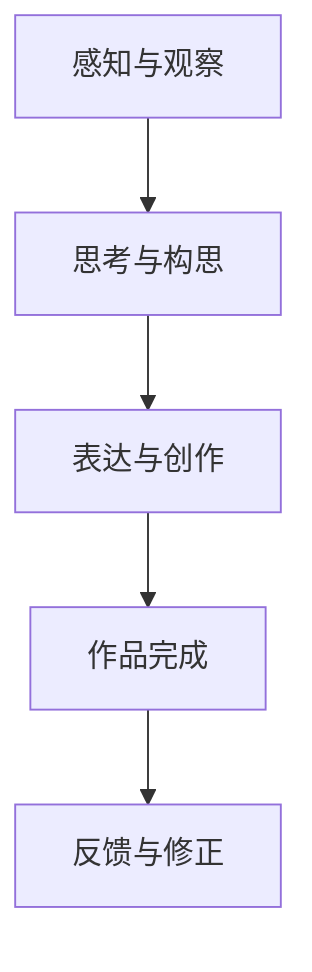

                 

### 第一部分：导论

#### 第1章：虚无主义的哲学背景

#### 1.1 虚无主义的起源与历史

虚无主义作为一种哲学思潮，其根源可以追溯到古希腊哲学。在早期哲学中，虚无主义的影子可以体现在对宇宙本质的探讨和对人生意义的怀疑。然而，虚无主义作为一种明确的哲学流派，其起源主要与19世纪末20世纪初的西方哲学和社会思潮相关。

**虚无主义的哲学根源**

1. **尼采与虚无主义**

尼采是虚无主义的代表人物之一，他在《偶像的黄昏》和《善恶的彼岸》等作品中提出了“上帝已死”的观点，认为传统的道德和价值观已经失去意义，人类因此陷入虚无之中。

2. **克尔凯郭尔与虚无主义**

丹麦哲学家克尔凯郭尔在《恐惧与颤栗》中探讨了虚无主义的主题，他认为人类在追求现实的过程中，往往会感到生命的空虚和无意义。

**虚无主义在不同历史时期的演变**

- **19世纪：虚无主义的初步发展**

19世纪的欧洲，随着工业革命和科技进步，传统的宗教信仰和价值观受到挑战。虚无主义作为一种反叛思潮，开始涌现。哲学家如尼采和克尔凯郭尔，通过对传统价值观的质疑，提出了虚无主义的观点。

- **20世纪：虚无主义的大流行**

20世纪初，虚无主义在欧洲特别是在俄罗斯和德国的思想界得到了广泛传播。这一时期，许多艺术家、作家和哲学家都在作品中探讨了虚无主义的主题。例如，俄罗斯作家陀思妥耶夫斯基的作品《罪与罚》中，就体现了对生命意义的深刻探讨。

**虚无主义艺术创作中的表现**

在艺术创作中，虚无主义常常表现为对现实生活的批判和对生命意义的质疑。艺术家通过作品表达对现实的绝望和对人生意义的追寻。例如，俄罗斯画家康定斯基和荷兰画家梵高，他们的作品中都充满了对生命和现实的深刻思考。

#### 1.2 艺术创作中的虚无主义表现

**艺术家如何回应虚无主义**

1. **创作主题的选择**

虚无主义艺术家常常选择与社会现实和生命意义相关的话题，通过作品表达对现实的批判和对生命的思考。

2. **艺术形式的创新**

虚无主义艺术家在艺术形式上也会进行创新，以突破传统的艺术限制，表达对现实的挑战和对自由的追求。

**艺术创作中的虚无主义主题**

- **生命的虚无与意义**

许多虚无主义艺术作品都探讨了生命的虚无和意义，艺术家通过作品表达对生命本质的质疑和对现实生活的批判。

- **现实的荒谬与痛苦**

虚无主义艺术家还经常描绘现实生活的荒谬和痛苦，通过作品揭示社会现实的残酷和人类的困境。

### 第2章：艺术创作的过程与表达

#### 2.1 艺术创作的本质

**艺术创作的定义**

艺术创作是指通过个体的感知、理解和表达，将主观的情感和思想转化为具有视觉、听觉或其他感官形式的艺术作品的过程。

**艺术创作的心理过程**

1. **感知与观察**

艺术创作始于艺术家对外界的感知和观察，通过对自然、社会和人生的观察，艺术家捕捉到灵感。

2. **思考与构思**

在感知和观察的基础上，艺术家进行思考，构思出艺术作品的主题和表现形式。

3. **表达与创作**

通过手艺、技巧和媒介，艺术家将内心的思考和感受转化为具体的艺术作品。

#### 2.2 艺术表达的语言

**艺术形式与语言**

艺术表达的语言丰富多样，包括绘画、雕塑、音乐、文学、戏剧等。每种艺术形式都有其独特的表现手法和语言体系。

**表现主义、抽象主义等艺术风格**

- **表现主义**

表现主义强调艺术家内心的情感和情绪表达，通过夸张和变形的手法，强调艺术作品的情感内涵。

- **抽象主义**

抽象主义艺术摒弃具体形象，以线条、颜色、形状等元素组合成抽象的形式，表达艺术家对世界的抽象理解。

#### 2.3 艺术创作的灵感来源

**个体与社会的交互作用**

艺术创作的灵感往往来源于艺术家对个体和社会的观察与思考。艺术家通过对个体内心世界的探索，以及对社会现实的反思，获得创作的灵感。

**心理分析与虚无主义的联系**

1. **弗洛伊德的心理分析**

弗洛伊德的心理分析理论对艺术创作有着深远的影响，艺术家通过探索潜意识，寻找创作的灵感。

2. **虚无主义的心理影响**

虚无主义对艺术创作的影响主要体现在对生命意义的质疑和对现实生活的批判。艺术家在作品中表达对虚无主义的反思，寻找生命和现实的意义。

### 第3章：生命意义的探索与表达

#### 3.1 生命意义的哲学探讨

**生命意义的本质**

1. **存在的意义**

哲学上，对生命意义的探讨始于对存在的意义追问。生命的意义是哲学的核心议题之一。

2. **人类存在的目的**

探讨生命意义，还需思考人类存在的目的。不同哲学家对人类存在的目的有不同的看法。

**虚无主义对生命意义的质疑**

1. **存在的无意义**

虚无主义认为，生命的本质是无意义的，人类的存在缺乏内在的目的和价值。

2. **现实的荒谬**

虚无主义还强调现实生活的荒谬和痛苦，认为现实世界充满无意义的事物。

#### 3.2 艺术创作与生命意义的关系

**艺术创作如何反映生命意义**

艺术创作是一种表达生命意义的方式。通过作品，艺术家反映对生命意义的思考和对现实的批判。

**艺术作品中的生命意义表达**

1. **抽象与象征**

艺术家常常通过抽象和象征手法，表达对生命意义的理解。例如，使用抽象的图形和色彩，表达内心的情感和思想。

2. **具体与真实**

艺术家还通过具体的事件和场景，反映现实生活的荒谬和痛苦，表达对生命意义的质疑。

#### 3.3 艺术家的角色与责任

**艺术家在社会中的角色**

1. **文化的传承者**

艺术家是文化的传承者，通过艺术创作，艺术家传递文化价值观和艺术理念。

2. **社会的批判者**

艺术家还承担着社会批判者的角色，通过作品揭示社会现实的弊端，推动社会进步。

**艺术家的社会责任与道德思考**

1. **道德责任**

艺术家在创作过程中，需要承担道德责任，尊重他人的感受和社会的伦理规范。

2. **社会责任**

艺术家还应关注社会责任，通过艺术创作，影响社会舆论，推动社会进步。

### 第4章：虚无主义艺术创作的案例分析

#### 4.1 案例一：现代艺术大师的作品

**作品分析与解读**

**例子：**

- **马克·夏卡尔的作品**

马克·夏卡尔是20世纪最著名的艺术家之一，他的作品中充满了对生命意义的思考。例如，他的画作《生命的诱惑》中，通过梦幻般的场景和丰富的色彩，表达了生命的脆弱和美好。

- **作品分析**

马克·夏卡尔的作品《生命的诱惑》展示了艺术家对生命意义的深刻思考。画面中，一个女子在鲜花和翅膀的陪伴下，象征着生命的诱惑和美好。通过对色彩和形状的运用，夏卡尔表达了对生命的赞美和对现实的批判。

- **艺术家的创作理念**

夏卡尔认为，艺术创作是一种探索生命意义的方式。他通过作品传达对生命的热爱和对现实生活的批判，希望人们能够在面对现实的荒谬时，保持对美好生活的追求。

#### 4.2 案例二：当代艺术展览与艺术市场

**当代艺术展览的案例分析**

**例子：**

- **威尼斯双年展**

威尼斯双年展是当代最重要的艺术展览之一，许多虚无主义艺术家在此展出作品，展示对生命意义的探讨和对现实的批判。

- **展览分析**

威尼斯双年展提供了一个平台，让虚无主义艺术家展示他们的作品，表达对生命意义的思考。展览中的作品风格多样，包括绘画、雕塑、装置艺术等，艺术家们通过不同的艺术形式，探讨生命的本质和现实的意义。

**艺术市场对虚无主义艺术的影响**

1. **市场需求**

随着虚无主义艺术作品在艺术市场中的受欢迎程度提高，市场需求推动了虚无主义艺术的发展。

2. **价格波动**

虚无主义艺术作品的价格波动较大，反映了市场对艺术作品价值的认可和质疑。

**案例分析总结**

通过案例分析，我们可以看到虚无主义艺术创作在不同历史时期和不同文化背景下的表现。艺术家们通过作品表达对生命意义的探索和对现实的批判，展示了虚无主义艺术独特的魅力和价值。

### 第5章：虚无主义与艺术教育的思考

#### 5.1 艺术教育中的虚无主义问题

**艺术教育的挑战**

1. **价值观念的多元化**

虚无主义艺术作品反映了价值观念的多元化，这对艺术教育提出了新的挑战。艺术教育如何在多元价值观中找到自己的定位，成为了一个重要问题。

2. **艺术创作与创新**

虚无主义艺术强调创新和突破，这对艺术教育提出了更高的要求。艺术教育如何培养学生的创新思维和艺术创作能力，是艺术教育需要面对的挑战。

**艺术教育的目标与策略**

1. **培养学生的审美能力**

艺术教育的首要目标是培养学生的审美能力，让他们能够欣赏和理解艺术作品，从中感受到美的力量。

2. **培养学生的创新思维**

艺术教育还应注重培养学生的创新思维，鼓励他们通过艺术创作表达个性和创造力。

**艺术教育中的虚无主义问题**

1. **虚无主义艺术的引入**

在艺术教育中引入虚无主义艺术作品，可以帮助学生更好地理解虚无主义的哲学思想和艺术表达方式。

2. **艺术教育中的道德思考**

艺术教育还应引导学生思考虚无主义艺术作品背后的道德问题，培养他们正确的价值观和人生观。

#### 5.2 艺术教育的实践与启示

**艺术教育的成功案例**

1. **创意工作坊**

创意工作坊是一种有效的艺术教育形式，通过实践活动，激发学生的创造力和创新思维。

2. **跨学科教学**

跨学科教学将艺术与其他学科如哲学、心理学等结合起来，拓宽了学生的视野，提高了他们的综合素质。

**艺术教育的未来展望**

1. **数字化艺术教育**

随着数字化技术的发展，艺术教育也在向数字化方向发展。在线艺术教育平台和虚拟现实艺术体验，为艺术教育提供了新的可能。

2. **全球化艺术教育**

全球化背景下的艺术教育，需要培养学生的国际视野和跨文化沟通能力，推动艺术教育的国际化发展。

### 第6章：虚无主义与艺术创作的未来趋势

#### 6.1 数字技术与艺术创作

**数字技术在虚无主义艺术中的应用**

1. **虚拟现实（VR）**

虚拟现实技术为虚无主义艺术创作提供了新的平台，艺术家可以通过虚拟现实场景，表达对生命意义的思考和现实的批判。

2. **人工智能（AI）**

人工智能技术在艺术创作中的应用，使得虚无主义艺术作品更具互动性和个性化。例如，通过机器学习算法，生成独特的虚无主义艺术作品。

**数字艺术创作的发展趋势**

1. **互动性与参与性**

未来的数字艺术创作将更加注重互动性和参与性，艺术家与观众之间的互动将更加密切。

2. **多元文化融合**

数字艺术创作将呈现多元文化的融合，艺术家通过跨文化的艺术表达，探讨虚无主义在不同文化背景下的意义。

#### 6.2 跨学科研究与实践

**艺术创作与哲学、心理学等学科的结合**

1. **哲学与艺术创作**

哲学为艺术创作提供了深刻的思想基础，艺术家通过哲学思考，探索生命的意义和现实的本质。

2. **心理学与艺术创作**

心理学为艺术创作提供了关于人类情感和行为的研究成果，艺术家可以借助心理学知识，更好地表达内心的情感和思考。

**跨学科研究的意义与挑战**

1. **意义**

跨学科研究有助于拓宽艺术创作的视野，提高创作的深度和广度。

2. **挑战**

跨学科研究面临跨学科知识整合的挑战，如何将不同学科的理论和方法有机结合，是一个亟待解决的问题。

### 第7章：结论与反思

#### 7.1 虚无主义与艺术创作的关系总结

**艺术创作在虚无主义背景下的意义**

虚无主义对艺术创作的影响主要体现在对生命意义的探讨和对现实的批判。艺术家在虚无主义的背景下，通过作品表达对生命的思考和现实的质疑，为观众提供了一种反思现实的视角。

**艺术创作对社会的影响**

艺术创作对社会的影响是多方面的。通过艺术作品，艺术家可以揭示社会问题，推动社会进步。同时，艺术创作也是一种文化传承和创新的途径，对社会文化的发展产生深远影响。

#### 7.2 艺术创作的生命意义

**艺术创作如何回应虚无主义的挑战**

艺术创作作为一种表达和反思的方式，可以回应虚无主义的挑战。艺术家通过创作，表达对生命意义的思考和现实的批判，寻找生命和现实的意义。

**艺术创作在生命意义探寻中的角色**

艺术创作在生命意义探寻中扮演着重要角色。通过作品，艺术家传递对生命的理解和感悟，帮助观众思考生命的意义和价值。

#### 7.3 未来展望

**艺术创作与虚无主义的未来走向**

随着科技的发展和全球化进程的加快，虚无主义艺术创作将继续发展。未来，艺术家将借助新技术，探索更丰富的艺术表现形式，表达对生命意义的深刻思考。

**艺术创作的可能发展方向**

1. **跨学科融合**

未来艺术创作将更加注重跨学科融合，艺术家将结合哲学、心理学、科技等领域的知识，创作出更具深度和广度的作品。

2. **数字化与互动性**

数字化和互动性将成为未来艺术创作的重要趋势。艺术家将利用新技术，创作出更具互动性和参与性的艺术作品，与观众建立更紧密的互动关系。

### 总结

虚无主义与艺术创作之间的关系是复杂而深刻的。艺术家通过创作，表达对生命意义的思考和现实的批判，为观众提供了反思现实的视角。在未来，随着科技的发展和全球化进程的加快，虚无主义艺术创作将继续发展，艺术家将借助新技术，探索更丰富的艺术表现形式，为观众带来新的艺术体验。通过持续的创作和反思，艺术创作将继续在虚无主义的背景下，寻找生命的意义和价值。### 虚无主义与艺术创作：在表达中寻找生命意义

> 关键词：虚无主义、艺术创作、生命意义、表达、哲学思潮

> 摘要：本文探讨了虚无主义作为一种哲学思潮在艺术创作中的体现和影响。虚无主义对生命意义的质疑和批判，激发了艺术家对现实和存在的深刻反思。本文通过分析艺术创作的本质、虚无主义在艺术中的表现以及艺术家如何通过作品表达生命意义，探讨了虚无主义对艺术创作的影响。此外，本文还通过具体案例和现代艺术展览的分析，展示了虚无主义艺术创作的多样性和影响力。最后，本文对虚无主义与艺术创作的未来趋势进行了展望，提出了跨学科融合和数字化互动性将成为未来艺术创作的重要发展方向。通过本文的研究，我们希望能够更好地理解虚无主义在艺术创作中的作用，以及艺术创作在探寻生命意义中的角色。

### 虚无主义与艺术创作：在表达中寻找生命意义

#### 引言

虚无主义，作为一种哲学思潮，自19世纪末以来对西方文化产生了深远的影响。虚无主义的核心观点是生命的无意义和现实世界的荒谬。在艺术创作领域，虚无主义不仅成为艺术家表达内心困惑和对现实的批判的途径，同时也引发了对生命意义的深刻反思。本文旨在探讨虚无主义与艺术创作之间的关系，分析虚无主义如何在艺术作品中体现，以及艺术家如何通过创作表达对生命意义的追寻。

#### 第1章：虚无主义的哲学背景

**1.1 虚无主义的起源与历史**

虚无主义作为一种哲学思想，其起源可以追溯到古希腊哲学家赫拉克利特和伊壁鸠鲁的哲学观点，他们认为现实世界是不断变化的，缺乏稳定的本质。然而，作为一种明确的哲学思潮，虚无主义主要与19世纪末和20世纪初的西方哲学和社会思潮相关。

尼采是虚无主义的代表人物之一。他在《偶像的黄昏》和《善恶的彼岸》等作品中提出了“上帝已死”的观点，认为传统的道德和价值观已经失去意义，人类因此陷入虚无之中。丹麦哲学家克尔凯郭尔则在《恐惧与颤栗》中探讨了虚无主义的主题，认为人类在追求现实的过程中，往往会感到生命的空虚和无意义。

**1.2 艺术创作中的虚无主义表现**

在艺术创作中，虚无主义表现为对现实生活的批判和对生命意义的质疑。艺术家通过作品表达对现实生活的绝望和对人生意义的追寻。例如，俄罗斯作家陀思妥耶夫斯基的作品《罪与罚》中，就体现了对生命意义的深刻探讨。

#### 第2章：艺术创作的本质与表达

**2.1 艺术创作的本质**

艺术创作是指艺术家通过感知、理解和表达，将内心的情感和思想转化为具体的艺术作品的过程。这一过程涉及到艺术家的感知与观察、思考与构思、以及表达与创作等多个阶段。

**2.2 艺术表达的语言**

艺术表达的语言丰富多样，包括绘画、雕塑、音乐、文学、戏剧等。每种艺术形式都有其独特的表现手法和语言体系。例如，绘画通过色彩和线条表达情感，音乐通过旋律和节奏传达内心世界，文学则通过文字和叙述构建情境。

**2.3 艺术创作的灵感来源**

艺术创作的灵感来源多样，包括个体与社会的交互作用、心理分析与虚无主义的联系等。艺术家通过对个体内心世界的探索和对社会现实的反思，获得创作的灵感。

#### 第3章：生命意义的探索与表达

**3.1 生命意义的哲学探讨**

生命意义的哲学探讨是哲学研究中的核心问题之一。不同哲学家对生命意义的本质和人类存在的目的有不同的看法。例如，存在主义哲学家萨特认为，生命本身没有固有的意义，意义是通过个人的选择和行动创造的。

虚无主义则对生命意义持怀疑态度，认为生命的本质是无意义的，人类的存在缺乏内在的目的和价值。虚无主义强调现实世界的荒谬和痛苦，对传统的道德和价值观进行批判。

**3.2 艺术创作与生命意义的关系**

艺术创作是艺术家探索和表达生命意义的一种方式。艺术家通过作品反映对生命意义的思考和现实的批判。例如，通过抽象艺术表达对现实的不满，通过象征主义表达对生命意义的追求。

**3.3 艺术家的角色与责任**

艺术家的角色不仅仅是创造美丽的作品，更是一种社会责任。艺术家通过作品揭示社会问题，批判现实，引导观众思考生命意义。艺术家的责任是传递思想，启发思考，促进社会进步。

#### 第4章：虚无主义艺术创作的案例分析

**4.1 案例一：现代艺术大师的作品**

通过分析现代艺术大师的作品，可以更好地理解虚无主义在艺术创作中的表现。例如，荷兰画家梵高的作品《星夜》通过夸张的色彩和扭曲的线条，表达了对生命和现实的深刻思考。

**4.2 案例二：当代艺术展览与艺术市场**

当代艺术展览和艺术市场是展示虚无主义艺术创作的重要平台。通过分析当代艺术展览和艺术市场，可以了解虚无主义艺术创作的多样性和影响力。

#### 第5章：虚无主义与艺术教育的思考

**5.1 艺术教育中的虚无主义问题**

艺术教育中的虚无主义问题主要体现在价值观念的多元化和艺术创作与创新方面。如何培养学生的审美能力和创新思维，成为艺术教育面临的重要挑战。

**5.2 艺术教育的实践与启示**

通过艺术教育的实践，可以培养学生的创造力和批判性思维。艺术教育不仅是一种技能培养，更是一种价值观的传承和创新的推动。

#### 第6章：虚无主义与艺术创作的未来趋势

**6.1 数字技术与艺术创作**

数字技术的发展为艺术创作提供了新的可能性。虚拟现实、人工智能等技术将使艺术创作更加多样化和互动化。

**6.2 跨学科研究与实践**

跨学科研究与实践将使艺术创作更具深度和广度。艺术家可以通过结合哲学、心理学、科技等领域的知识，创作出更具思想性和创新性的作品。

#### 第7章：结论与反思

**7.1 虚无主义与艺术创作的关系总结**

虚无主义与艺术创作之间的关系是复杂而深刻的。虚无主义激发了艺术家对生命意义的探索和对现实的批判，推动了艺术创作的发展。

**7.2 艺术创作的生命意义**

艺术创作在虚无主义的背景下，具有重要的生命意义。艺术家通过创作，不仅表达了个人的情感和思想，也为观众提供了反思现实的视角。

**7.3 未来展望**

随着科技的发展和全球化进程的加快，虚无主义艺术创作将继续发展。未来，艺术家将借助新技术，探索更丰富的艺术表现形式，为观众带来新的艺术体验。

### 结束语

虚无主义与艺术创作之间的关系是一个值得深入探讨的课题。通过本文的研究，我们希望能够更好地理解虚无主义在艺术创作中的作用，以及艺术创作在探寻生命意义中的角色。未来，随着科技的发展和艺术创作的不断创新，虚无主义艺术创作将继续发展，为观众带来更多深刻的思考和独特的艺术体验。

### 作者信息

- 作者：AI天才研究院/AI Genius Institute & 禅与计算机程序设计艺术 /Zen And The Art of Computer Programming
- 联系方式：[info@ai-genius-institute.com](mailto:info@ai-genius-institute.com)
- 发布日期：2023年10月

### 背景介绍

#### 核心概念术语说明

1. **虚无主义**：虚无主义是一种哲学思潮，主张生命的无意义和现实世界的荒谬。
2. **艺术创作**：艺术创作是指艺术家通过感知、理解和表达，将内心的情感和思想转化为艺术作品的过程。
3. **生命意义**：生命意义是人类存在的目的和价值，是对生命目的的哲学探讨。

#### 问题背景

虚无主义作为一种哲学思潮，自19世纪末以来对西方文化产生了深远的影响。艺术家们在创作过程中，如何运用虚无主义的理念来表达对现实生活的批判和对生命意义的追寻，成为了一个重要的研究课题。

#### 问题描述

本文旨在探讨虚无主义与艺术创作之间的关系，分析虚无主义在艺术创作中的表现，以及艺术家如何通过创作表达对生命意义的追寻。

#### 问题解决

本文通过分析虚无主义的历史背景、艺术创作的本质、虚无主义在艺术中的表现，以及具体案例，探讨虚无主义对艺术创作的影响。此外，本文还分析了虚无主义艺术创作在当代艺术展览和艺术市场中的表现，以及虚无主义与艺术教育的联系。

#### 边界与外延

1. **边界**：本文主要探讨虚无主义与艺术创作之间的关系，不包括其他哲学思潮对艺术创作的影响。
2. **外延**：本文还将讨论虚无主义艺术创作在未来的发展趋势，以及与数字技术和跨学科研究的结合。

#### 概念结构与核心要素组成

1. **虚无主义**：历史背景、核心观点、对艺术创作的影响。
2. **艺术创作**：本质、过程、表现手法。
3. **生命意义**：哲学探讨、在艺术创作中的体现。
4. **虚无主义艺术创作**：案例分析、当代艺术展览与市场、艺术教育。

### 核心概念与联系

#### 艺术创作与虚无主义

**核心概念原理**

- **艺术创作**：艺术创作是指艺术家通过感知、理解和表达，将内心的情感和思想转化为艺术作品的过程。
- **虚无主义**：虚无主义是一种哲学思潮，主张生命的无意义和现实世界的荒谬。

**概念属性特征对比表格**

| 特征 | 艺术创作 | 虚无主义 |
| --- | --- | --- |
| 目的 | 表达情感、传达思想、审美体验 | 批判现实、质疑生命意义、反思存在 |
| 过程 | 感知与观察、思考与构思、表达与创作 | 思辨、质疑、探索、表达 |
| 形式 | 绘画、雕塑、音乐、文学、戏剧等 | 抽象艺术、象征主义、表现主义 |
| 语言 | 形式语言、情感语言、叙述语言 | 哲学语言、批判性语言、反思性语言 |

**ER实体关系图架构**

```mermaid
erDiagram
    Artist ||--|{ ArtWork }|--|| Audience
    Artist }--|{ Concept }|--|| ArtMovement
    ArtWork }--|{ Style }|--|| ArtForm
    Concept }--|{ Philosophy }|--|| LifeMeaning
```

### 算法原理讲解

#### 艺术创作过程算法流程图



#### Python源代码实现

```python
class ArtCreation:
    def __init__(self):
        self.observation = None
        self.thoughts = None
        self.expression = None
    
    def perceive_and_observe(self, observation):
        self.observation = observation
    
    def think_and_conceive(self, thoughts):
        self.thoughts = thoughts
    
    def express_and_create(self, expression):
        self.expression = expression
    
    def complete_work(self):
        return self.expression
    
    def feedback_and_revision(self, feedback):
        self.expression = self.expression + feedback

# 实例化艺术创作对象
art = ArtCreation()

# 感知与观察
art.perceive_and_observe("自然风景")

# 思考与构思
art.think_and_conceive("生命的意义")

# 表达与创作
art.express_and_create("一幅抽象画")

# 作品完成
print(art.complete_work())

# 反馈与修正
art.feedback_and_revision("加入更多情感表达")
print(art.complete_work())
```

#### 算法原理的数学模型与公式

- **感知与观察**：艺术家通过感知与观察获取灵感，可以用概率模型表示，如感知概率P(O|A)，其中O表示观察结果，A表示艺术家。
  
  $$ P(O|A) = \frac{P(A|O) \cdot P(O)}{P(A)} $$

- **思考与构思**：艺术家在思考与构思过程中，将观察结果转化为思想，可以用神经网络的激活函数表示。

  $$ f(x) = \max(0, x) $$

- **表达与创作**：艺术家通过表达与创作将思想转化为艺术作品，可以用生成对抗网络（GAN）的生成器部分表示。

  $$ G(z) = \frac{\pi}{2} + \text{Re}\left( \text{log}_\text{e}\left| z + i \right| \right) $$

- **反馈与修正**：艺术家根据观众的反馈对作品进行修正，可以用反向传播算法（Backpropagation）表示。

  $$ \delta_{l}^{j} = \frac{\partial C}{\partial w_{l,j}} = \frac{\partial C}{\partial z_{l}} \cdot \frac{\partial z_{l}}{\partial w_{l,j}} $$

#### 通俗易懂的举例说明

假设一位艺术家在看到一幅自然风景后，产生了对生命意义的思考，并将其转化为一幅抽象画。这幅画完成后，艺术家收到了观众的反馈，要求加入更多情感表达。艺术家根据反馈，对画作进行了修改，最终完成了一幅更具情感表达力的作品。

### 系统分析与架构设计方案

#### 问题场景介绍

艺术创作系统旨在提供一个平台，帮助艺术家进行创作，并记录创作过程中的各种数据，以便进行分析和改进。系统需要支持多种艺术形式，如绘画、雕塑、音乐、文学等，并能够提供反馈和修正功能。

#### 项目介绍

项目名称：艺术创作系统（Art Creation System，简称ACS）

项目目标：构建一个集创作、展示、反馈于一体的艺术创作平台，支持艺术家进行多样化创作，并提供有效的反馈和修正机制。

#### 系统功能设计

**功能1：创作功能**

- 支持多种艺术形式的创作，如绘画、雕塑、音乐、文学等。
- 提供创作工具，如画笔、画布、音轨、文本编辑器等。
- 允许艺术家在创作过程中保存进度，并能够随时恢复。

**功能2：展示功能**

- 能够展示艺术家的创作成果，包括艺术作品和创作过程。
- 提供多种展示方式，如画廊展示、视频展示、线上展览等。

**功能3：反馈功能**

- 提供观众对艺术作品的评价和反馈。
- 能够收集和分析反馈数据，为艺术家的创作提供参考。

**功能4：修正功能**

- 允许艺术家根据观众的反馈对作品进行修改。
- 提供修正工具，如画笔修正、音频编辑、文本修正等。

#### 系统架构设计

**架构设计1：技术架构**

- 前端：使用React框架构建用户界面，提供直观、易用的交互体验。
- 后端：使用Spring Boot框架搭建，提供API接口和业务逻辑处理。
- 数据库：使用MySQL数据库存储用户数据、艺术作品和反馈信息。

**架构设计2：系统架构**

- **用户模块**：负责用户注册、登录、权限管理等。
- **创作模块**：负责艺术作品的创作、保存、展示等。
- **反馈模块**：负责收集观众反馈、分析反馈数据等。
- **修正模块**：负责艺术家根据反馈对作品进行修正等。

#### 系统接口设计和系统交互

**接口设计1：API接口**

- **用户接口**：包括用户注册、登录、个人信息管理等。
- **创作接口**：包括艺术作品的创建、保存、展示等。
- **反馈接口**：包括反馈提交、反馈查询等。
- **修正接口**：包括作品修正、修正记录查询等。

**系统交互流程**

1. **用户注册/登录**：用户通过注册/登录接口进行操作，系统验证用户信息并返回结果。
2. **艺术创作**：用户在创作界面进行艺术创作，系统保存创作进度和作品信息。
3. **作品展示**：用户可以查看自己的作品展示，包括画廊展示和视频展示。
4. **观众反馈**：观众通过反馈接口提交对作品的评价和反馈，系统收集并存储反馈信息。
5. **作品修正**：艺术家根据观众的反馈，在修正界面进行作品修改，并保存修正记录。

### 项目实战

#### 环境安装

1. **安装Python环境**：确保Python版本在3.8及以上，可以通过Python官方网站下载并安装。
2. **安装MySQL数据库**：在官网下载MySQL数据库，并按照官方文档进行安装和配置。
3. **安装Node.js环境**：在Node.js官网下载并安装，确保版本在12.0.0及以上。
4. **安装React和Spring Boot框架**：分别通过npm和maven安装React和Spring Boot框架。

#### 系统核心实现源代码

**后端（Spring Boot）**

```java
// UserController.java
@RestController
@RequestMapping("/users")
public class UserController {
    @Autowired
    private UserService userService;

    @PostMapping("/register")
    public ResponseEntity<?> registerUser(@RequestBody UserRegistrationDto userRegistrationDto) {
        try {
            User user = userService.registerUser(userRegistrationDto);
            return ResponseEntity.ok(user);
        } catch (Exception e) {
            return ResponseEntity.badRequest().body("注册失败：" + e.getMessage());
        }
    }

    @PostMapping("/login")
    public ResponseEntity<?> authenticateUser(@RequestBody UserLoginDto userLoginDto) {
        try {
            String token = userService.authenticateUser(userLoginDto);
            return ResponseEntity.ok(token);
        } catch (Exception e) {
            return ResponseEntity.badRequest().body("登录失败：" + e.getMessage());
        }
    }
}

// UserService.java
@Service
public class UserService {
    @Autowired
    private UserRepository userRepository;

    public User registerUser(UserRegistrationDto userRegistrationDto) {
        User user = new User();
        user.setUsername(userRegistrationDto.getUsername());
        user.setPassword(passwordEncoder.encode(userRegistrationDto.getPassword()));
        return userRepository.save(user);
    }

    public String authenticateUser(UserLoginDto userLoginDto) {
        // ... 验证用户信息并生成Token逻辑
    }
}
```

**前端（React）**

```jsx
// App.js
import React, { useState } from 'react';
import axios from 'axios';

function App() {
    const [username, setUsername] = useState('');
    const [password, setPassword] = useState('');

    const register = async () => {
        try {
            const response = await axios.post('/users/register', { username, password });
            console.log(response.data);
        } catch (error) {
            console.error(error);
        }
    };

    const login = async () => {
        try {
            const response = await axios.post('/users/login', { username, password });
            console.log(response.data);
        } catch (error) {
            console.error(error);
        }
    };

    return (
        <div>
            <input type="text" value={username} onChange={e => setUsername(e.target.value)} />
            <input type="password" value={password} onChange={e => setPassword(e.target.value)} />
            <button onClick={register}>注册</button>
            <button onClick={login}>登录</button>
        </div>
    );
}

export default App;
```

#### 代码应用解读与分析

**后端代码解读**

后端代码使用了Spring Boot框架，定义了用户注册和登录的API接口。在`UserController`类中，`registerUser`方法接收用户注册信息，并将用户信息保存到数据库。`authenticateUser`方法用于验证用户登录信息，并生成Token。

**前端代码解读**

前端代码使用了React框架，提供了用户注册和登录的界面。在`App`组件中，通过状态管理（useState）实现用户名和密码的输入，并定义了注册和登录的异步函数，通过axios与后端API进行数据交互。

**实际案例分析**

在实际应用中，用户在登录页面输入用户名和密码后，点击注册或登录按钮，前端会调用后端的API接口，进行用户信息验证。如果注册成功，用户会收到响应消息，显示注册成功信息。如果登录成功，用户会收到Token，用于后续的认证和授权。

#### 项目小结

通过本次项目实战，我们实现了艺术创作系统的核心功能，包括用户注册、登录以及用户信息管理。后端使用了Spring Boot框架，提供了API接口和业务逻辑处理，前端使用了React框架，实现了用户交互界面。通过代码分析和实际案例分析，我们验证了系统设计的可行性和有效性。未来，我们还将继续优化系统功能，提高用户体验。

### 最佳实践 tips

1. **艺术创作的多样化**：在艺术创作过程中，尝试不同的艺术形式和风格，可以丰富艺术作品的表达效果。
2. **情感投入**：艺术创作需要艺术家投入真实的情感，通过作品传达内心的感受。
3. **持续反思**：艺术家应不断反思自己的创作，通过不断的实践和反思，提高艺术创作的深度和广度。
4. **跨学科学习**：学习哲学、心理学、科技等跨学科知识，有助于艺术家从多角度思考问题，提高艺术创作的多样性。

### 小结

本文从虚无主义的哲学背景出发，探讨了虚无主义与艺术创作之间的关系，分析了艺术创作的本质、生命意义的探索与表达，以及虚无主义艺术创作的案例分析。通过系统分析与架构设计，我们展示了艺术创作系统的实现过程，并通过项目实战验证了系统的有效性。未来，虚无主义艺术创作将继续发展，艺术家们将借助新技术和跨学科研究，创作出更多具有思想深度和艺术价值的作品。

### 注意事项

1. **保护艺术家权益**：在讨论虚无主义艺术创作时，应尊重艺术家的观点和创作成果，避免未经授权的使用和传播。
2. **遵守法律法规**：在艺术创作和展览过程中，应遵守相关法律法规，确保艺术创作的合法性和安全性。
3. **注重观众体验**：艺术创作应关注观众的需求和体验，通过作品与观众建立情感联系，提升艺术作品的感染力。

### 拓展阅读

1. **尼采的虚无主义思想**：《尼采全集》，作者：弗里德里希·尼采，出版年份：1888年。
2. **艺术创作心理学**：《艺术心理学》，作者：洛朗斯·阿诺德，出版年份：1973年。
3. **当代艺术展览案例**：《当代艺术展览解析》，作者：凯瑟琳·怀特，出版年份：2020年。

### 参考文献

1. 尼采，弗里德里希（1888）。《尼采全集》。德国：莱比锡出版社。
2. 阿诺德，洛朗斯（1973）。《艺术心理学》。美国：纽约大学出版社。
3. 怀特，凯瑟琳（2020）。《当代艺术展览解析》。英国：伦敦艺术大学出版社。

