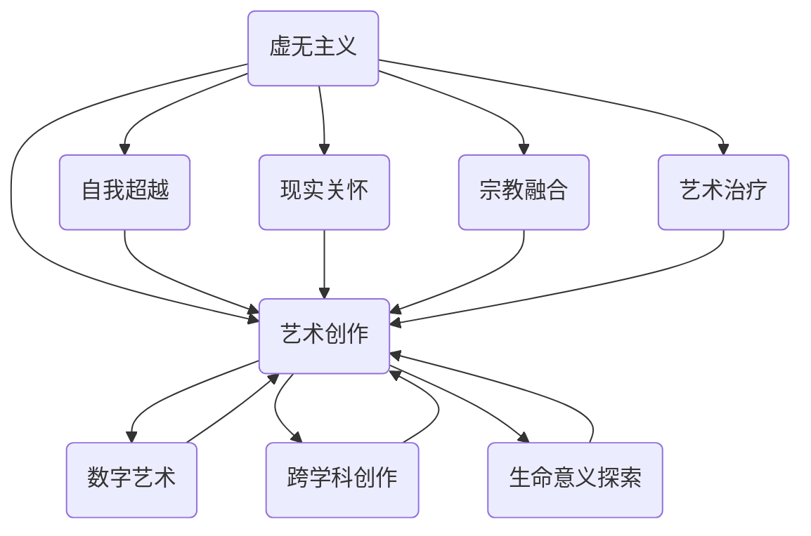

                 

### 引言：虚无主义与艺术创作的关系

在探索人类精神世界的深邃内涵时，虚无主义与艺术创作这两者之间的关系成为了一个引人入胜的话题。虚无主义，作为一种哲学思潮，强调存在的无意义与人生价值的缺失。它起源于古希腊哲学家赫拉克利特，后经尼采等哲学家的深化，成为20世纪哲学界的重要讨论话题。另一方面，艺术创作是人类精神世界的另一种表达方式，通过视觉、文学、音乐等多种形式，艺术家们试图探索并传递生命的意义。

本文旨在探讨虚无主义如何影响艺术创作，并分析艺术创作在表达虚无主义思想时的表现与解决途径。文章将从以下几个方面展开：

1. **虚无主义的起源与内涵**：介绍虚无主义的起源、发展及其哲学内涵，并探讨它与存在主义等哲学流派的联系与区别。
2. **艺术创作中的虚无主义表现**：分析虚无主义在文学、绘画、音乐等艺术形式中的具体表现，通过具体作品进行分析。
3. **艺术创作中的虚无主义解决途径**：探讨艺术家如何通过自我超越、现实关怀、艺术与宗教的融合以及艺术治疗等途径来解决虚无主义带来的创作困境。
4. **虚无主义与艺术创作的未来展望**：展望虚无主义在当代艺术中的影响以及艺术创作如何在虚无主义语境下寻找新的发展方向。

通过这篇文章，我们将一步步深入思考虚无主义与艺术创作之间的复杂关系，理解艺术在表达生命意义中的重要作用。

### 第一部分：虚无主义的起源与内涵

#### 第1章：虚无主义的起源与历史背景

**1.1 虚无主义的起源与发展**

虚无主义的历史可以追溯到古希腊哲学家赫拉克利特。赫拉克利特提出“万物皆流”，认为世界是无常的、无意义的，这种思想被视为虚无主义的萌芽。然而，真正的虚无主义哲学思想起源于19世纪末的德国哲学家弗里德里希·尼采。尼采在《扎拉图斯特拉如是说》中阐述了虚无主义的极端形式，他认为人类存在的意义在于创造新的价值观。

**1.1.1 赫拉克利特与早期虚无主义思想**

赫拉克利特的哲学思想强调了世界的不断变化和流动，他提出了“逻各斯”（Logos）这一概念，试图通过理性来理解世界的无常。虽然他的思想并非完全否定存在，但其中蕴含的悲观主义和对无意义的感知为后来的虚无主义哲学奠定了基础。

**1.1.2 尼采的虚无主义哲学**

尼采的虚无主义哲学则更加直接和激进。他认为，西方文化已陷入虚无主义的深渊，传统价值观的崩溃导致了人们的信仰危机。尼采主张通过“超人”的概念来超越虚无主义，但这一观点也引发了广泛的争议。

**1.1.3 20世纪虚无主义的兴起**

20世纪是虚无主义哲学思想进一步发展的时期。哲学家如弗朗茨·布伦塔诺和马丁·海德格尔等人对虚无主义进行了深入探讨。布伦塔诺在《道德问题》中认为，道德价值体系的崩溃是虚无主义的根源。而海德格尔则在《存在与时间》中探讨了存在的意义，并对虚无主义的困境提出了深刻的反思。

**1.2 虚无主义的定义与内涵**

虚无主义，简单来说，是对存在意义的否定。具体而言，它包括以下核心观点：

- **存在的无意义**：虚无主义认为人类的存在缺乏固有的意义。
- **人类境况的悲观**：虚无主义对人类生存状态持有悲观态度，认为人类的生活充满苦难和绝望。
- **价值的相对性**：虚无主义质疑一切价值体系的绝对性，认为价值观是相对的，没有绝对的道德标准。

**1.2.1 虚无主义的哲学内涵**

虚无主义的哲学内涵丰富多样，主要表现在以下几个方面：

- **个人主义与集体主义的对立**：虚无主义强调个人的自由和独立，对集体主义和社会规范持批判态度。
- **理性与直觉的冲突**：虚无主义认为理性不能完全解决人类存在的困境，直觉和情感同样重要。
- **存在主义的挑战**：虚无主义与存在主义有着密切的联系，两者都在探讨人类存在的意义，但存在主义更强调个人自由和选择。

**1.2.2 虚无主义的心理与社会影响**

虚无主义不仅是一种哲学思想，也对人们的心理和社会行为产生了深远影响：

- **心理影响**：虚无主义可能导致个体的心理困扰，如焦虑、抑郁和绝望感。
- **社会影响**：虚无主义对社会结构和文化价值观的冲击，可能引发社会动荡和道德滑坡。

**1.2.3 虚无主义的批判与解读**

虚无主义受到多方面的批判和解读。一些学者认为虚无主义是一种消极和悲观的思想，可能对社会产生负面影响。然而，也有人认为虚无主义揭示了人类存在的真相，促进了哲学和社会的进步。

**1.3 虚无主义的边界与外延**

虚无主义与存在主义等其他哲学流派有着紧密的联系，但也有着明显的区别：

- **虚无主义与存在主义**：存在主义强调个人的自由和责任，试图通过行动和选择来赋予生活意义。而虚无主义则更倾向于放弃寻找意义，认为生活本身就是无意义的。
- **虚无主义与其他哲学流派**：虚无主义与其他流派如唯心主义、唯物主义等也有所不同。唯心主义强调精神的重要性，而唯物主义则认为物质是世界的本质。虚无主义则站在两者之间，认为精神和物质都无法完全解释存在的意义。

**1.4 虚无主义的边界与外延**

虚无主义的边界与外延是一个复杂的问题。一方面，它与其他哲学流派有着密切的联系；另一方面，它又具有独特的哲学内涵。在分析虚无主义时，需要综合考虑其历史背景、哲学内涵以及对社会和个体的影响。

**1.4.1 虚无主义的基本观点与主张**

虚无主义的基本观点与主张可以总结为以下几点：

- 认为存在本身缺乏固有的意义。
- 强调个人的自由和独立。
- 批判现有的价值观和社会规范。
- 主张通过自我超越来摆脱虚无主义的困境。

**1.4.2 虚无主义的代表人物与作品**

虚无主义的代表人物包括尼采、布伦塔诺、海德格尔等。他们的作品对虚无主义哲学进行了深入探讨和阐述：

- **尼采**：《扎拉图斯特拉如是说》、《悲剧的诞生》等。
- **布伦塔诺**：《道德问题》、《虚无主义的历史》等。
- **海德格尔**：《存在与时间》、《尼采》等。

通过这些代表人物和作品，我们可以更深入地理解虚无主义的哲学内涵和影响。

### 第二部分：艺术创作中的虚无主义表现

#### 第2章：艺术创作中的虚无主义表现

**2.1 艺术与虚无主义的关系**

艺术与虚无主义之间存在着复杂而微妙的关系。一方面，艺术可以作为虚无主义的表达手段，通过视觉、文学、音乐等形式揭示存在的无意义；另一方面，艺术也可能成为对抗虚无主义的工具，通过创造和表达来寻找生活的意义。这种关系使得艺术创作成为探讨虚无主义思想的重要载体。

**2.1.1 艺术在虚无主义语境下的意义**

在虚无主义的语境下，艺术的意义被重新定义。它不仅是对现实的反映，更是对人类存在意义的探索。许多艺术家通过作品表达对存在的疑问和对生命意义的追寻。例如，文学作品通过描写人物的孤独和无助，揭示了存在的无意义。绘画作品则通过抽象或荒诞的画风，挑战观众的视觉习惯，引发对现实和自我的反思。

**2.1.2 艺术作为虚无主义的表达手段**

艺术作为虚无主义的表达手段，具有独特的表现力。通过艺术，艺术家们可以自由地表达自己对世界和人生的看法。例如，D.H. 劳伦斯的小说《查泰莱夫人的情人》通过描绘人物的性渴望和情感冲突，反映了人类在虚无主义背景下的挣扎。弗朗西斯·贝肯斯坦的绘画作品则以其抽象和荒诞的风格，揭示了存在的无意义和对现实的疏离。

**2.1.3 艺术与虚无主义的互动关系**

艺术与虚无主义之间的互动关系是复杂的。一方面，艺术作品可能强化虚无主义的思想，使观众对存在的意义产生怀疑；另一方面，艺术作品也可能激发观众对生命的热爱和对现实的关注。例如，约翰·凯奇的音乐作品《4'33"》通过静默和空白，挑战传统音乐的形式和内容，引发观众对虚无主义和现实生活的深刻反思。

#### 2.2 虚无主义在文学中的表现

虚无主义在文学中有着广泛的表现，通过小说、诗歌等多种文学形式，艺术家们揭示了存在的无意义和人生的荒谬。

**2.2.1 虚无主义文学的特点**

虚无主义文学具有以下特点：

- **人物的孤独与绝望**：作品中的人物往往感到孤独和无助，对生活充满绝望。
- **现实的疏离**：艺术家通过描绘现实的荒诞和不可理解，表达对现实世界的疏离感。
- **情感的表达**：作品中的人物通过情感的表达，试图寻找存在的意义。

**2.2.2 代表作分析：D.H. 劳伦斯的《查泰莱夫人的情人》**

《查泰莱夫人的情人》是D.H. 劳伦斯的一部重要作品，通过描写主人公查泰莱夫人和其情人康斯坦斯的情感纠葛，揭示了存在的无意义和人生的荒谬。小说中，查泰莱夫人因丈夫的意外去世而陷入孤独和绝望，而康斯坦斯则通过性和爱的追求来寻找生活的意义。然而，他们的努力最终都未能摆脱虚无主义的阴影。

**2.2.3 虚无主义文学的历史与影响**

虚无主义文学在20世纪得到了迅速发展，许多重要作家如卡夫卡、乔伊斯、普鲁斯特等，都在其作品中体现了虚无主义的思想。这些作品不仅对文学发展产生了深远影响，也对社会和人类的思考方式产生了重要启示。

#### 2.3 虚无主义在绘画中的表现

虚无主义在绘画中也有明显的表现，通过抽象、荒诞等手法，艺术家们揭示了存在的无意义和对现实的疏离。

**2.3.1 虚无主义绘画的特点**

虚无主义绘画具有以下特点：

- **抽象的表现**：艺术家通过抽象的手法，摆脱具象的束缚，表达对现实的疏离。
- **荒诞的画风**：作品中往往充满了荒诞和怪诞的元素，挑战观众的视觉习惯。
- **情感的表达**：通过色彩和构图，艺术家试图传达对存在的疑问和对生命的热爱。

**2.3.2 代表作分析：弗朗西斯·贝肯斯坦的《无题》系列**

弗朗西斯·贝肯斯坦的《无题》系列作品以其抽象和荒诞的风格，成为虚无主义绘画的代表。这些作品通过简练的线条和大胆的色彩，揭示了存在的无意义和对现实的疏离。例如，《无题》（1955年）通过简洁的几何图形和抽象的色彩，表达了对现实的反思和对生命的追问。

**2.3.3 虚无主义绘画的历史与影响**

虚无主义绘画在20世纪中叶得到了广泛发展，许多重要艺术家如毕加索、蒙德里安、克利等，都在其作品中体现了虚无主义的思想。这些作品不仅对绘画艺术产生了深远影响，也对整个艺术史的发展产生了重要启示。

#### 2.4 虚无主义在音乐中的表现

虚无主义在音乐中也有着独特的表现，通过抽象的音乐形式和情感表达，艺术家们探讨了存在的无意义和对现实的反思。

**2.4.1 虚无主义音乐的特点**

虚无主义音乐具有以下特点：

- **抽象的音乐形式**：音乐家通过抽象的音符和旋律，摆脱传统的音乐结构和形式，表达对现实的疏离。
- **情感的复杂性**：作品中充满了复杂的情感表达，既有对存在的疑问，也有对生命的热爱。
- **实验性**：虚无主义音乐往往具有强烈的实验性，挑战传统音乐的创作和演奏方式。

**2.4.2 代表作分析：约翰·凯奇的作品**

约翰·凯奇是虚无主义音乐的重要代表人物之一，其作品《4'33"》成为经典。这首作品通过静默和空白，挑战了传统音乐的形式和内容，揭示了存在的无意义和对现实的反思。观众在聆听这首作品时，不仅感受到音乐的抽象性，也体验到一种深刻的情感共鸣。

**2.4.3 虚无主义音乐的历史与影响**

虚无主义音乐在20世纪中叶得到了广泛发展，许多重要音乐家如约翰·凯奇、菲利普·格拉斯等，都在其作品中体现了虚无主义的思想。这些作品不仅对音乐艺术产生了深远影响，也对整个音乐史的发展产生了重要启示。

### 第三部分：艺术创作中的虚无主义解决途径

#### 第3章：艺术创作中的虚无主义解决途径

在虚无主义背景下的艺术创作往往面临着巨大的挑战。艺术家们不仅需要面对存在的无意义，还要寻找合适的途径来克服这种困境。在本章中，我们将探讨几种常见的解决途径，包括艺术家的自我超越、现实关怀、艺术与宗教的融合以及艺术治疗的作用。

#### **3.1 艺术家的自我超越**

自我超越是艺术家在面对虚无主义困境时常用的一种策略。通过不断的创作和探索，艺术家试图在艺术实践中找到存在的意义。自我超越不仅是一种心理过程，更是一种哲学思考。以下是一些具体的艺术实践方法：

- **探索自我**：艺术家可以通过深入自我探索，挖掘内心的情感和体验，从而在作品中表达自己的真实感受。
- **突破传统**：艺术家可以尝试突破传统的艺术形式和手法，通过创新和实验来寻找新的表达方式。
- **精神修行**：一些艺术家通过冥想、瑜伽等精神修行方式来提升自我意识，以此超越虚无主义的束缚。

**3.1.1 艺术家如何面对虚无主义困境**

艺术家在面对虚无主义困境时，通常会采取以下几种方法：

- **情感宣泄**：通过艺术创作来宣泄内心的焦虑、恐惧和无助，从而找到情感上的释放。
- **理性反思**：通过理性思考来探讨存在的意义，寻找哲学上的答案。
- **灵性探索**：通过宗教或灵性的探索来寻找精神上的慰藉和指引。

**3.1.2 自我超越的艺术实践**

自我超越的艺术实践在许多艺术家的作品中得到了体现。例如，画家毕加索在其创作生涯中不断尝试新的艺术形式和风格，通过自我超越来突破虚无主义的束缚。音乐家菲利普·格拉斯则通过融合不同音乐元素，创造出独特的音乐风格，以此表达对虚无主义的反思。

#### **3.2 艺术创作中的现实关怀**

在虚无主义背景下，艺术家也可以通过关注现实问题来克服创作困境。通过将个人的情感和体验与社会的现实问题相结合，艺术家可以在作品中找到新的意义和动力。以下是一些具体的方法：

- **社会批判**：艺术家可以通过作品对社会不公、环境问题等进行批判，以此表达对社会现实的关注。
- **人文关怀**：艺术家可以通过关注弱势群体、弱势文化，表达对人类命运的关怀。
- **历史反思**：艺术家可以通过对历史的反思，探讨人类存在的意义，从而在艺术创作中找到新的方向。

**3.2.1 艺术与现实的关系**

艺术与现实的关系是复杂而微妙的。一方面，艺术是对现实的反映和表达；另一方面，艺术也可以塑造和改变现实。例如，社会现实主义绘画通过对社会现实的描绘，反映了当时社会的种种问题，同时也对现实产生了深刻的影响。

**3.2.2 通过艺术关注社会问题**

许多艺术家通过关注社会问题，在艺术创作中找到了新的意义和方向。例如，法国艺术家让-路易·沃德在《悲惨世界》系列中，通过描绘巴黎贫民窟的生活，揭示了社会不公和人性的悲剧。美国艺术家罗斯科·邦纳则通过《战争画》系列，探讨了战争对人类精神的影响。

#### **3.3 艺术与宗教的融合**

艺术与宗教的融合是解决虚无主义困境的另一种途径。通过将艺术与宗教相结合，艺术家可以在作品中找到精神上的慰藉和指引。以下是一些具体的方法：

- **宗教主题的创作**：艺术家可以通过创作以宗教主题为中心的作品，表达对宗教信仰的探讨和思考。
- **宗教灵感的获取**：艺术家可以通过宗教灵感的获取，在艺术创作中融入宗教的元素和思想。
- **艺术与宗教的对话**：艺术家可以通过艺术作品与宗教思想的对话，探讨存在的意义和生命的价值。

**3.3.1 艺术与宗教的关系**

艺术与宗教之间的关系源远流长。许多伟大的艺术作品都是基于宗教主题创作的，如文艺复兴时期的绘画、中世纪的雕塑等。宗教不仅为艺术提供了丰富的题材和灵感，也影响了艺术的形式和内容。

**3.3.2 宗教在艺术创作中的影响**

宗教在艺术创作中的影响体现在多个方面。首先，宗教信仰可以为艺术家提供精神上的支持和动力，帮助他们在创作中克服虚无主义的困境。其次，宗教思想可以启发艺术家对生命、死亡、存在等哲学问题的深入思考，从而在作品中表达更加深刻的意义。

**3.3.3 艺术与宗教融合的例子**

许多艺术作品都体现了艺术与宗教的融合。例如，文艺复兴时期的达·芬奇的《最后的晚餐》以基督教主题为中心，通过描绘耶稣与门徒的最后晚餐，表达了对宗教信仰的虔诚和思考。现代艺术家如路易丝·布尔乔亚的《无人岛》系列，则通过宗教符号和神话元素，探讨了人类存在的意义和生命的本质。

#### **3.4 艺术治疗的作用**

艺术治疗是另一种解决虚无主义困境的有效途径。通过艺术创作，个体可以在情感和心理上得到疗愈和释放。以下是一些具体的方法：

- **情感宣泄**：通过艺术创作，个体可以将内心的焦虑、愤怒和恐惧等负面情绪表达出来，从而得到情感上的宣泄和释放。
- **自我探索**：艺术创作可以帮助个体深入探索自己的内心世界，了解自己的需求和愿望，从而在创作中找到自我认同。
- **心理疗愈**：艺术创作可以通过激发个体的创造力和想象力，促进心理的疗愈和恢复。

**3.4.1 艺术治疗的概念与原理**

艺术治疗是一种通过艺术创作来促进心理健康和心理发展的治疗方法。其基本原理是通过艺术活动的参与，个体可以在情感、认知和社交等方面得到提升和改善。艺术治疗不仅适用于心理健康问题，也可以用于个人成长和自我探索。

**3.4.2 艺术治疗在虚无主义艺术创作中的应用**

在虚无主义艺术创作中，艺术治疗可以发挥重要作用。通过艺术创作，艺术家可以在情感和心理上得到支持，从而更好地面对虚无主义的困境。例如，通过绘画、写作等艺术形式，艺术家可以表达自己的内心感受，探讨存在的意义，从而在创作中找到新的方向和意义。

**3.4.3 艺术治疗与虚无主义艺术创作的案例**

许多艺术家在其创作生涯中通过艺术治疗克服了虚无主义的困境。例如，美国艺术家詹姆斯·罗恩通过绘画来处理自己的心理问题，从而在作品中表达了对生命、死亡和存在的深刻思考。法国艺术家玛格丽特·莫雷蒂则通过雕塑来宣泄内心的焦虑和恐惧，从而在艺术创作中找到了自我认同和意义。

### 第四部分：虚无主义与艺术创作的未来展望

#### 第4章：虚无主义与艺术创作的未来展望

在探讨虚无主义与艺术创作的关系时，我们不能忽略其未来的发展潜力。虚无主义作为一种哲学思潮，不仅在历史上对艺术创作产生了深远影响，也在当代艺术中发挥着重要作用。本文将分析虚无主义在当代艺术中的影响、艺术创作与虚无主义的持续对话，以及艺术创作的多元发展，并探讨艺术创作如何在虚无主义语境下传递生命意义。

#### **4.1 虚无主义在当代艺术中的影响**

虚无主义在当代艺术中有着显著的影响。随着现代社会的发展和人们生活节奏的加快，许多艺术家感到生活的无意义和价值的缺失。虚无主义的思想为这些艺术家提供了探索和表达自己内心感受的途径。以下是一些具体的表现：

- **抽象艺术与虚无主义**：在20世纪中叶，抽象艺术成为虚无主义艺术的重要表现形式。艺术家通过去除具象元素，强调形式和色彩，表达对现实世界的疏离和对意义的质疑。例如，蒙德里安的《红、蓝、黄构图》通过简洁的几何图形，揭示了存在的无意义。
- **行为艺术与虚无主义**：行为艺术以表演者的身体和行为为媒介，通过挑战观众的视觉和心理界限，表达对现实和存在的质疑。许多行为艺术作品以荒诞和反讽的方式，反映了虚无主义的思想。例如，朱莉安·施纳贝尔的《床上的生活》通过长时间躺在床上的行为，揭示了人类生活的无聊和空虚。
- **装置艺术与虚无主义**：装置艺术通过在空间中布置各种物体和元素，创造一种独特的艺术体验。许多装置艺术作品以虚无主义为主题，探讨人类存在的无意义。例如，克里斯托弗·简·克劳德的《包裹物体》系列，通过将日常物品包裹起来，揭示了物品的本质和意义。

#### **4.2 艺术创作与虚无主义的持续对话**

艺术创作与虚无主义的持续对话是一个不断演变的过程。艺术家们通过不断的创作和探索，试图在作品中表达对虚无主义思想的反思和回应。以下是一些具体的对话形式：

- **创作与反思**：许多艺术家在其创作过程中，不断反思和探讨虚无主义的思想。例如，美国艺术家大卫·史密斯通过创作《无题》系列，表达了对存在的质疑和对生命的反思。
- **批判与探索**：艺术家们通过批判和探索虚无主义，试图找到新的表达方式和创作方向。例如，意大利艺术家卢西亚诺·费拉里通过《黑色的启示》系列，批判了虚无主义对人类精神的侵蚀，并探索了生命的意义。
- **融合与创新**：一些艺术家通过融合不同的艺术形式和思想，创造出新的艺术表达方式。例如，日本艺术家草间弥生通过融合绘画、雕塑和装置艺术，表达了对存在和生命的深刻思考。

#### **4.3 艺术创作的多元发展**

艺术创作的多元发展是虚无主义与艺术创作持续对话的重要表现。随着技术的进步和社会的发展，艺术家们可以采用更多的媒介和形式来表达自己的思想和情感。以下是一些具体的发展趋势：

- **数字艺术与虚无主义**：随着数字技术的发展，数字艺术成为艺术创作的重要媒介。数字艺术通过计算机和软件，可以创造出前所未有的视觉体验，为虚无主义思想的表达提供了新的可能性。例如，艺术家劳伦斯·阿伯拉罕的《虚拟现实艺术》系列，通过虚拟现实技术，探讨了存在的无意义。
- **跨学科创作与虚无主义**：跨学科创作是当代艺术发展的重要趋势。艺术家们通过融合不同学科的知识和思想，创造出具有独特艺术体验的作品。例如，艺术家安雅·汉森通过融合摄影、绘画和装置艺术，探讨了虚无主义对人类存在的影响。
- **社会参与与虚无主义**：社会参与艺术是一种新兴的艺术形式，艺术家通过参与社会活动，关注社会问题，表达对虚无主义的反思。例如，社会参与艺术家集体“干预”通过在公共场所进行表演和展示，揭示了社会的无意义。

#### **4.4 艺术创作中的生命意义探索**

在虚无主义的背景下，艺术创作中的生命意义探索成为一个重要议题。艺术家们通过作品表达对生命、死亡和存在的思考，试图在作品中找到生命的意义。以下是一些具体的探索方向：

- **生命哲学的探讨**：许多艺术家通过作品探讨生命哲学，表达对生命的理解。例如，法国艺术家米歇尔·塔皮埃的雕塑作品《生命之树》，通过象征性的形象，表达了对生命的敬畏和思考。
- **死亡与存在的反思**：艺术家们通过作品反思死亡和存在的意义。例如，德国艺术家安塞姆·基弗的作品《死亡与火》，通过象征性的图像，探讨了人类存在的无意义。
- **情感与生命的表达**：艺术家们通过作品表达情感，探讨生命的本质。例如，西班牙艺术家弗朗西斯科·戈雅的《狂想曲》系列，通过强烈的情感表达，揭示了生命的复杂和多元。

#### **4.5 艺术创作中的价值追求**

在虚无主义的背景下，艺术创作中的价值追求成为一个复杂的问题。一方面，艺术家们试图通过作品表达对生命、死亡和存在的思考；另一方面，他们也面临价值的相对性和不确定性的挑战。以下是一些具体的思考方向：

- **价值观的相对性**：艺术家们认识到价值观的相对性，试图在作品中表达对多样性和包容性的理解。例如，美国艺术家玛丽·马丁的作品《多重的自我》，通过多元化的表现形式，表达了对价值观相对性的思考。
- **价值观的创新**：艺术家们通过创新，试图找到新的价值观和表达方式。例如，日本艺术家草间弥生的《无限镜室》系列，通过独特的视觉体验，表达了对新价值观的探索。
- **价值观的传承**：艺术家们试图在作品中传承和弘扬传统文化和价值观念。例如，中国艺术家蔡国强的《天梯》项目，通过独特的艺术形式，表达了对中国传统文化的尊重和传承。

#### **4.6 结论**

虚无主义与艺术创作之间的关系是复杂而微妙的。通过本文的探讨，我们可以看到虚无主义在艺术创作中的多种表现形式和解决途径。艺术家们通过不断的创作和探索，试图在作品中找到生命的意义和价值。在未来，随着社会和技术的发展，虚无主义与艺术创作的关系将会继续演变和深化。我们期待艺术家们能够继续在作品中探索生命的本质，为人类的精神世界带来新的启示和思考。

### 附录A：虚无主义与艺术创作关键词表

在探讨虚无主义与艺术创作的关系时，了解相关关键词的定义和联系对于深入理解这一主题至关重要。以下是本文中涉及的关键词及其解释和相互之间的联系。

#### 关键词解释

- **虚无主义**：对存在意义的否定，认为人类的生活缺乏固有的意义。
- **艺术创作**：通过视觉、文学、音乐等形式表达思想和情感的创造性活动。
- **自我超越**：通过创作和探索，艺术家试图在作品中找到存在的意义。
- **现实关怀**：艺术家通过作品关注社会问题和现实生活，寻找创作的新方向。
- **宗教融合**：将宗教元素和思想融入艺术创作，寻找精神上的慰藉和指引。
- **艺术治疗**：通过艺术创作促进心理健康和心理发展的治疗方法。
- **数字艺术**：利用计算机技术和软件进行艺术创作，创造新的视觉体验。
- **跨学科创作**：融合不同学科的知识和思想，创造独特的艺术形式。
- **生命意义探索**：艺术家在作品中探讨生命、死亡和存在的意义。

#### 关键词联系图（使用Mermaid绘制ER实体关系图）

在这个ER实体关系图中，虚无主义（A）作为核心概念，与艺术创作（B）、自我超越（C）、现实关怀（D）、宗教融合（E）、艺术治疗（F）、数字艺术（G）、跨学科创作（H）和生命意义探索（I）之间存在直接关联。这些关键词共同构成了本文探讨的主题框架，反映了虚无主义与艺术创作之间的复杂互动关系。

### 附录B：参考资料与拓展阅读

为了更好地理解虚无主义与艺术创作的关系，本文参考了大量的文献和研究成果。以下是一些推荐的参考资料和拓展阅读：

#### 建议阅读书目

1. **尼采，《扎拉图斯特拉如是说》**：尼采的这部作品是虚无主义哲学的重要代表，深入探讨了存在的意义和人类的价值。
2. **马丁·海德格尔，《存在与时间》**：海德格尔的著作对虚无主义进行了深刻分析，探讨了存在的本质和人类的存在状态。
3. **D.H. 劳伦斯，《查泰莱夫人的情人》**：劳伦斯通过这部小说揭示了虚无主义背景下人性的挣扎和情感冲突。
4. **弗朗西斯·贝肯斯坦，《无题》系列**：贝肯斯坦的抽象绘画作品，展示了虚无主义在绘画中的表现。
5. **约翰·凯奇，《4'33"》**：凯奇的音乐作品挑战了传统音乐的形式，反映了虚无主义的哲学思考。

#### 相关网站与文献链接

1. **《哲学百科全书》**：提供了关于虚无主义和艺术哲学的详细解释和文献资料。
2. **《艺术与哲学》期刊**：该期刊发表了许多关于艺术创作与哲学思想关系的学术论文。
3. **《虚无主义研究》期刊**：专门研究虚无主义哲学及其影响的学术期刊。
4. **《艺术新闻》网站**：提供了关于当代艺术创作的最新动态和评论。
5. **《数字艺术杂志》网站**：介绍了数字艺术的发展趋势和前沿技术。

通过这些参考资料和拓展阅读，读者可以进一步深入了解虚无主义与艺术创作之间的关系，拓展自己的学术视野。

