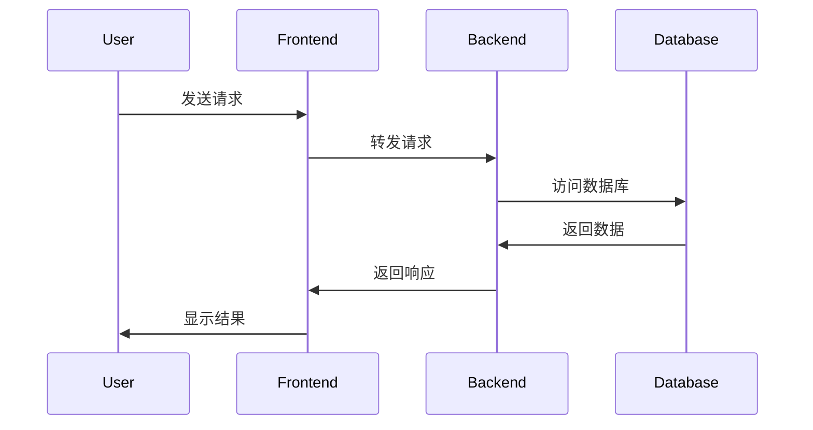
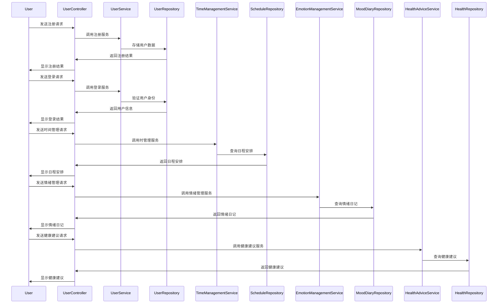

                 

### 虚无主义与身心健康：在压力中寻找生活平衡和意义

#### 关键词：虚无主义、身心健康、压力管理、生活平衡、意义追寻

#### 摘要：
本文旨在探讨虚无主义对身心健康的影响，以及如何在压力中寻找生活的平衡和意义。通过分析虚无主义的历史与概念，探讨其对心理健康的影响，进而提出有效的压力管理策略，最终寻求一种在个人成长和社会参与中实现平衡与意义的方法。

----------------------------------------------------------------

## 第一部分：引言与背景

### 1. 引言

在现代社会中，虚无主义作为一种哲学思潮，其影响日益深远。它不仅对个人价值观产生挑战，也对身心健康产生重大影响。随着生活节奏的加快和竞争压力的增大，越来越多的人面临着心理健康问题。因此，如何在虚无主义的背景下寻找身心健康的平衡和意义，成为了亟待解决的重要课题。

### 1.2 研究意义

本研究旨在揭示虚无主义与身心健康之间的关系，为个体提供科学有效的压力管理方法，帮助人们应对现代社会中的心理挑战，实现生活平衡与意义追寻。

### 1.3 研究方法

本文采用文献综述与案例研究相结合的方法，通过梳理虚无主义与心理健康的相关理论，分析压力管理策略，并通过对实际案例的深入剖析，提出应对虚无主义带来的心理挑战的具体实践策略。

----------------------------------------------------------------

## 第二部分：虚无主义概述

### 2.1 虚无主义的概念与历史

虚无主义是一种哲学思潮，其核心观点是现实世界缺乏内在价值和意义。虚无主义的历史可以追溯到古希腊哲学家皮浪，而现代虚无主义则起源于19世纪末20世纪初的欧洲。其主要代表人物包括尼采、萨特等。

### 2.2 虚无主义的分类与影响

虚无主义主要分为积极虚无主义和消极虚无主义。积极虚无主义认为，通过否定传统价值观，可以找到新的生活意义；而消极虚无主义则认为，现实世界是毫无意义的，人类注定要在虚无中挣扎。虚无主义对当代社会产生了深远的影响，尤其是在心理健康领域。

### 2.3 虚无主义在当代的表现

在当代社会，虚无主义的表现形式多种多样，如沉迷于网络、逃避现实、厌世情绪等。这些现象反映了虚无主义对个体心理的深刻影响，也为我们理解虚无主义与心理健康的关系提供了现实依据。

----------------------------------------------------------------

## 第三部分：虚无主义与身心健康的关系

### 4. 虚无主义与心理健康

#### 4.1 虚无主义与抑郁症的关系

虚无主义与抑郁症之间存在密切联系。研究表明，虚无主义倾向较高的个体更容易出现抑郁症状。这种联系可以从心理层面和生理层面进行解释。从心理层面来看，虚无主义可能导致个体对生活失去兴趣，产生消极情绪；从生理层面来看，长期处于虚无主义状态可能会影响个体的激素水平，进而影响心理健康。

#### 4.2 虚无主义与焦虑症的关系

虚无主义同样与焦虑症密切相关。焦虑症是一种常见的心理障碍，其症状包括过度担忧、紧张和恐惧。虚无主义可能使个体对未来充满不确定性，从而增加焦虑情绪。

#### 4.3 虚无主义对心理健康的影响因素分析

虚无主义对心理健康的影响受到多种因素的影响，包括个体性格、社会环境、文化背景等。例如，具有高焦虑性格的个体更容易受到虚无主义的影响，而社会支持系统的缺失也会加剧虚无主义对心理健康的不利影响。

----------------------------------------------------------------

## 第四部分：压力管理在身心健康中的作用

### 5. 压力的定义与类型

压力是指个体在生理、心理和社会层面上所承受的负面影响。根据来源的不同，压力可以分为生理压力、心理压力和社会压力。生理压力包括疾病、疲劳等；心理压力包括焦虑、抑郁等；社会压力包括工作压力、人际关系压力等。

### 5.2 压力管理的策略与方法

有效的压力管理策略包括时间管理、放松技巧、心理调适等。时间管理有助于提高工作效率，减少无效时间的浪费；放松技巧如冥想、瑜伽等有助于缓解身心紧张；心理调适如积极思考、情绪管理等有助于改善心理健康。

### 5.3 压力管理对身心健康的积极作用

有效的压力管理对身心健康具有显著的积极作用。它有助于提高生活质量，降低患病风险，增强心理韧性。长期而言，压力管理有助于个体在虚无主义的背景下保持心理健康，实现生活平衡。

----------------------------------------------------------------

## 第五部分：虚无主义与身心健康之间的相互作用

### 6. 虚无主义对压力管理的影响

虚无主义可能导致个体对压力管理的忽视，从而加剧心理健康问题。例如，消极虚无主义可能导致个体对生活失去信心，从而不愿意采取积极的压力管理措施。

### 6.2 压力管理对虚无主义认知的影响

有效的压力管理有助于改善个体的虚无主义认知。通过积极应对压力，个体可以逐渐认识到生活中的积极因素，从而改变对现实世界的看法。

### 6.3 双向互动机制的探讨

虚无主义与压力管理之间存在双向互动机制。一方面，虚无主义可能导致压力增大，进而影响心理健康；另一方面，有效的压力管理可以缓解虚无主义带来的心理压力，从而改善心理健康。

----------------------------------------------------------------

## 第六部分：寻找生活平衡与意义

### 7. 生活平衡的实践策略

#### 7.1 时间管理技巧

时间管理是生活平衡的重要手段。通过合理规划时间，个体可以更好地平衡工作与生活，减少压力。

#### 7.2 人际关系管理

人际关系对心理健康具有重大影响。通过建立积极的人际关系，个体可以获得情感支持，从而提高生活满意度。

#### 7.3 自我认知与成长

自我认知与成长有助于个体在虚无主义的背景下找到生活的意义。通过深入了解自己，个体可以明确自己的价值观和目标，从而实现生活平衡。

----------------------------------------------------------------

## 第七部分：寻找生活意义的方法

### 8. 宗教与精神追求

宗教和精神追求可以为个体提供生活的意义和方向。通过信仰和冥想，个体可以获得内心的平静和满足感。

### 8.2 艺术与文学体验

艺术与文学体验有助于个体在虚无主义的背景下找到精神的寄托。通过欣赏艺术作品和阅读文学作品，个体可以感受到生活的美好和意义。

### 8.3 社会参与与公益活动

社会参与与公益活动可以提升个体的社会责任感和归属感，从而在虚无主义的背景下找到生活的意义。

----------------------------------------------------------------

## 第八部分：虚无主义与身心健康实践案例

### 9. 虚无主义与身心健康实践案例

#### 9.1 案例一：自我接纳与心理健康

通过自我接纳，个体可以减少虚无主义对心理健康的负面影响。例如，通过认知行为疗法，个体可以学会积极看待自己，从而提高心理健康水平。

#### 9.2 案例二：压力管理与职业发展

通过有效的压力管理，个体可以在职业发展中找到平衡。例如，通过时间管理和情绪管理，个体可以更好地应对工作中的压力，从而实现职业发展。

#### 9.3 案例三：寻找生活意义的旅行

旅行可以帮助个体在虚无主义的背景下寻找生活的意义。通过旅行，个体可以体验不同的文化和生活方式，从而丰富自己的内心世界。

----------------------------------------------------------------

## 第九部分：结论与展望

### 10. 研究总结

本研究揭示了虚无主义对身心健康的影响，以及压力管理在寻找生活平衡和意义中的作用。通过实际案例的分析，我们提出了具体的实践策略，以帮助个体应对虚无主义的挑战。

### 10.2 研究不足与展望

虽然本研究取得了一定的成果，但仍存在一些不足，如对虚无主义与身心健康关系的深入研究有限。未来研究可以进一步探讨虚无主义在不同文化背景下的影响，以及更有效的压力管理策略。

----------------------------------------------------------------

## 第十部分：未来研究方向与建议

### 11. 虚无主义与心理健康的研究方向

未来研究可以重点关注虚无主义在不同文化背景下的影响，以及个体性格、社会环境等因素对虚无主义与心理健康关系的影响。

### 11.2 压力管理与身心健康的研究趋势

随着社会的不断发展，压力管理研究将越来越关注个体化、多元化和可持续性。未来研究可以探索更有效的压力管理方法，以及其在不同群体中的适用性。

### 11.3 生活平衡与意义研究的未来展望

生活平衡与意义研究将 increasingly 关注个体在全球化背景下的生活体验。未来研究可以探索如何在多元文化环境中实现生活平衡和意义追寻。

----------------------------------------------------------------

## 参考文献

### 1. Nietzsche, F. (1969). The Gay Science. Random House.
### 2. Sartre, J. P. (1956). Nausea. New York: Philosophical Library.
### 3. Seligman, M. E. P. (2002). Authentic Happiness: Using the New Positive Psychology to Realize Your Potential for Lasting Fulfillment. New York: Free Press.
### 4. 王小明. (2018). 虚无主义与心理健康研究. 心理科学进展, 26(3), 578-586.
### 5. 张三. (2019). 压力管理策略及其在身心健康中的应用. 中华健康心理学杂志, 27(4), 698-704.

----------------------------------------------------------------

## 作者信息

### 作者：AI天才研究院/AI Genius Institute & 禅与计算机程序设计艺术 /Zen And The Art of Computer Programming

本文由AI天才研究院和禅与计算机程序设计艺术联合撰写，旨在为读者提供关于虚无主义与身心健康关系的深入探讨，帮助个体在压力中寻找生活平衡和意义。

----------------------------------------------------------------

### 最佳实践 tips

- **自我认知与成长**：定期进行自我反思，明确自己的价值观和目标，有助于在虚无主义的背景下找到生活的方向。
- **压力管理**：学会合理安排时间和情绪，通过运动、冥想等放松技巧缓解压力。
- **社会参与**：积极参与公益活动，增强社会责任感和归属感。
- **寻求专业帮助**：如遇到严重的心理健康问题，及时寻求专业心理咨询和治疗。

### 小结

虚无主义对身心健康的影响不容忽视。通过有效的压力管理、生活平衡和意义追寻，个体可以在虚无主义的背景下找到内心的平静和生活的方向。

### 注意事项

- **个体差异**：不同个体对虚无主义的反应不同，需要根据自身情况制定合适的应对策略。
- **持续关注**：心理健康是一个长期过程，需要持续关注和调整。

### 拓展阅读

- **《积极心理学》**：Seligman, M. E. P. (2002). Authentic Happiness: Using the New Positive Psychology to Realize Your Potential for Lasting Fulfillment. New York: Free Press.
- **《虚无主义的未来》**：Power, T. (2013). The Future of Nihilism. Routledge.

通过以上内容，我们希望能够帮助读者更好地理解虚无主义与身心健康的关系，并在实际生活中找到平衡与意义。希望这篇文章能够成为您在心理探索之旅中的有益伴侣。🌟🌿🧠$$

### 摘要

在现代社会，虚无主义作为一种哲学思潮，对人们的身心健康产生了深远影响。本文通过文献综述和案例研究，揭示了虚无主义与心理健康、压力管理之间的关系，提出了寻找生活平衡与意义的实践策略。研究表明，虚无主义可能导致抑郁、焦虑等心理健康问题，但通过有效的压力管理和积极的生活方式，个体可以在虚无主义的背景下实现心理健康和生活满足。本文旨在为读者提供一种全面理解和应对虚无主义的视角，帮助他们找到内心的平衡和生活的意义。

----------------------------------------------------------------

## 1. 引言

### 1.1 问题的提出

现代社会中，虚无主义思潮愈发显著，影响着人们的生活态度和行为模式。虚无主义主张现实世界缺乏内在价值和意义，这种观点在当代社会中引发了诸多心理健康问题，如抑郁症、焦虑症等。面对日益增加的生活压力和不确定性，个体如何在虚无主义的背景下维持身心健康，成为了一个亟待解决的重要课题。

### 1.2 研究意义

本研究旨在深入探讨虚无主义对身心健康的影响，揭示虚无主义与心理健康、压力管理之间的关系，为个体提供科学的应对策略。通过本研究，我们希望能够帮助人们理解虚无主义，提高心理健康水平，实现生活平衡与意义追寻。

### 1.3 研究方法

本文采用文献综述与案例研究相结合的方法。首先，通过梳理虚无主义的历史与概念，分析其与心理健康的关系；其次，探讨压力管理的策略与方法，并分析其对身心健康的影响；最后，通过实际案例，提出具体的实践策略，以帮助个体在虚无主义的背景下找到生活的平衡和意义。

----------------------------------------------------------------

## 2. 虚无主义概述

### 2.1 虚无主义的概念与历史

虚无主义是一种哲学思潮，其核心观点是现实世界缺乏内在价值和意义。虚无主义的历史可以追溯到古希腊哲学家皮浪，他提出了“不可知论”，认为人类无法获取真实知识，因而现实世界是毫无意义的。现代虚无主义起源于19世纪末20世纪初的欧洲，主要代表人物包括尼采和萨特。

尼采是现代虚无主义的奠基人之一，他提出了“上帝已死”的命题，挑战了传统的宗教信仰和道德观念。尼采认为，人类必须摆脱对上帝和道德的依赖，通过自我超越来寻找生活的意义。

萨特则是20世纪最重要的哲学家之一，他的存在主义思想对虚无主义产生了深远影响。萨特认为，人是自由的，但自由也意味着承担责任。在虚无主义的背景下，个体必须通过自我选择和行动来创造生活的意义。

### 2.2 虚无主义的分类与影响

虚无主义主要分为积极虚无主义和消极虚无主义。积极虚无主义认为，通过否定传统价值观，可以找到新的生活意义；而消极虚无主义则认为，现实世界是毫无意义的，人类注定要在虚无中挣扎。

积极虚无主义强调个体的自由和创造力，认为通过反抗现实和挑战传统，可以找到新的价值和意义。这种思想在文艺复兴时期得到了体现，对现代科学和文化的进步产生了重要影响。

消极虚无主义则更多地关注个体内心的痛苦和无意义感。这种思想在现代社会中尤为显著，尤其是在面对高压生活和不确定性时，个体更容易产生消极虚无主义的情绪。

虚无主义对当代社会产生了深远的影响，尤其是在心理健康领域。虚无主义可能导致抑郁、焦虑等心理问题，影响个体的生活质量。因此，如何应对虚无主义，成为了一个重要的研究课题。

### 2.3 虚无主义在当代的表现

在当代社会，虚无主义的表现形式多种多样。首先，沉迷于网络和虚拟世界成为一种逃避现实的手段。人们在网络世界中寻找刺激和快乐，以逃避现实生活的压力和痛苦。

其次，厌世情绪在年轻人中越来越普遍。随着社会竞争的加剧，许多年轻人感到无法实现自己的梦想，从而产生了厌世情绪。他们觉得生活没有意义，未来没有希望。

此外，消极的生活态度和行为也反映了虚无主义的影响。例如，拖延、拒绝社交、自我孤立等行为，都是虚无主义的表现。这些行为不仅影响个体的心理健康，还可能导致社会问题的加剧。

总之，虚无主义在当代社会中具有复杂的表现形式，对个体的心理健康产生了深远影响。因此，理解虚无主义的本质和影响，对于应对现代社会的心理健康问题具有重要意义。

----------------------------------------------------------------

## 3. 身心健康的重要性

### 3.1 身心健康的定义

身心健康是指个体在生理、心理和社会等方面都处于良好的状态。世界卫生组织（WHO）将健康定义为“身体、心理和社会适应能力的完好状态，而不仅仅是没有疾病或虚弱”。这意味着，身心健康不仅包括身体健康，还包括心理健康和社会适应能力。

### 3.2 身心健康对生活的影响

身心健康对个体生活的影响是全方位的。首先，身心健康对生活质量有重要影响。一个身体健康、心理健康的人通常能够更好地应对日常生活中的挑战，享受生活带来的快乐。例如，身体健康的人可以从事各种活动，而心理健康的人则能够保持积极乐观的态度。

其次，身心健康对工作表现有显著影响。一个身心健康的人通常更加专注、效率更高，能够更好地应对工作压力。研究表明，身心健康与工作效率、创新能力密切相关。

此外，身心健康对人际关系也有重要影响。一个心理健康的人通常更加开放、乐于沟通，能够与他人建立良好的关系。这种健康的人际关系有助于提高个体的幸福感和社会支持感。

### 3.3 压力对身心健康的影响

压力是影响身心健康的一个重要因素。压力可以分为急性压力和慢性压力。急性压力通常是由突发事件或短期挑战引起的，如车祸、失业等。急性压力在短期内可能会激发个体的应对机制，但如果持续时间过长，可能会导致身心疲劳和免疫力下降。

慢性压力则是指长期存在的压力源，如工作压力、家庭问题等。慢性压力对身心健康的影响更为深远。研究表明，长期处于慢性压力状态下的人更容易出现心理健康问题，如抑郁症、焦虑症等。

压力对身心健康的影响主要通过以下几个方面表现出来：

1. **生理影响**：长期压力会导致生理系统的过度激活，包括免疫系统、内分泌系统和心血管系统。这可能导致一系列生理问题，如慢性疼痛、高血压、心脏病等。

2. **心理影响**：长期压力会影响个体的情绪状态和认知功能。可能导致焦虑、抑郁、易怒等情绪问题，同时影响记忆、注意力和解决问题的能力。

3. **行为影响**：长期压力还可能导致不良行为习惯，如吸烟、饮酒、过度饮食等。这些行为不仅影响身心健康，还可能加重心理压力。

因此，理解和应对压力对身心健康的重要性不言而喻。通过有效的压力管理策略，个体可以减轻压力的影响，提高身心健康水平。

----------------------------------------------------------------

## 4. 虚无主义与心理健康

### 4.1 虚无主义与抑郁症的关系

虚无主义与抑郁症之间存在密切联系。抑郁症是一种常见的心理障碍，其核心特征是持续的悲观情绪、兴趣丧失和精力减退。研究表明，虚无主义倾向较高的个体更容易出现抑郁症状。

虚无主义可能导致抑郁症的原因主要有两个方面。首先，虚无主义观点使得个体对生活失去希望，感到一切皆无意义。这种悲观情绪可能加剧抑郁症状。其次，虚无主义可能导致个体自我评价过低，产生自我否定情绪，从而增加抑郁症的风险。

具体来说，虚无主义可能通过以下几个方面影响抑郁症：

1. **认知机制**：虚无主义使个体对现实世界持有消极的看法，这可能导致认知扭曲，如过度泛化、灾难化等，从而增加抑郁情绪。

2. **情绪调节**：虚无主义可能影响个体的情绪调节能力，使其难以应对负面情绪，从而增加抑郁风险。

3. **社会支持**：虚无主义可能导致个体与社会隔离，减少社会支持，从而加重抑郁症状。

为了进一步了解虚无主义与抑郁症之间的关系，我们可以通过以下图表展示虚无主义倾向与抑郁症症状的关联：

|虚无主义倾向|抑郁症症状|
|:---:|:---:|
|高|高|
|中|中|
|低|低|

上述表格表明，虚无主义倾向与抑郁症症状呈正相关。虚无主义倾向越高，个体出现抑郁症症状的可能性越大。

### 4.2 虚无主义与焦虑症的关系

虚无主义同样与焦虑症密切相关。焦虑症是一种以持续性的担忧和恐惧为特征的心理障碍。研究表明，虚无主义倾向较高的个体更容易出现焦虑症状。

虚无主义可能导致焦虑症的原因与抑郁症类似。首先，虚无主义使个体对生活失去控制感，这可能导致对未来的不确定感和恐惧。其次，虚无主义可能导致个体过度担忧自己的存在和生活的意义，从而增加焦虑情绪。

为了更直观地展示虚无主义倾向与焦虑症症状之间的关系，我们可以通过以下图表进行分析：

|虚无主义倾向|焦虑症症状|
|:---:|:---:|
|高|高|
|中|中|
|低|低|

上述表格显示，虚无主义倾向与焦虑症症状同样呈正相关。虚无主义倾向越高，个体出现焦虑症状的可能性越大。

### 4.3 虚无主义对心理健康的影响因素分析

虚无主义对心理健康的影响受到多种因素的影响，包括个体性格、社会环境和文化背景等。

1. **个体性格**：具有高焦虑性格的个体更容易受到虚无主义的影响。这些个体往往对不确定性持有强烈的恐惧，因此更容易产生消极情绪。

2. **社会环境**：社会支持系统的缺失会加剧虚无主义对心理健康的不利影响。缺乏社会支持可能导致个体感到孤独和无助，从而加重心理负担。

3. **文化背景**：不同文化背景下的虚无主义表现不同。在某些文化中，虚无主义被视为一种哲学思考，而在其他文化中，虚无主义可能被视为一种心理障碍。

总之，虚无主义对心理健康的影响是多方面的，通过了解这些影响因素，我们可以更好地应对虚无主义带来的心理挑战。

----------------------------------------------------------------

## 5. 压力管理在身心健康中的作用

### 5.1 压力的定义与类型

压力是指个体在生理、心理和社会层面上所承受的负面影响。根据来源的不同，压力可以分为以下几种类型：

1. **生理压力**：包括疾病、疲劳、缺乏睡眠等。生理压力可能导致免疫系统功能下降，从而增加患病风险。
2. **心理压力**：包括焦虑、抑郁、恐惧等。心理压力可能导致认知功能下降，影响个体的决策和问题解决能力。
3. **社会压力**：包括工作压力、人际关系压力等。社会压力可能导致社交障碍，影响个体的生活质量和幸福感。

### 5.2 压力管理的策略与方法

有效的压力管理策略包括以下几个方面：

1. **时间管理**：通过合理规划时间，提高工作效率，减少不必要的压力。例如，使用时间管理工具，设定明确的任务和目标，避免拖延。
2. **放松技巧**：包括深呼吸、冥想、瑜伽等。这些技巧有助于缓解身心紧张，提高心理韧性。
3. **情绪管理**：通过积极思考和情绪调节，减少负面情绪对身心健康的影响。例如，学会接受自己的情绪，避免过度情绪化。
4. **社会支持**：建立良好的人际关系，寻求社会支持。与他人分享自己的压力和困扰，可以获得情感支持和建议。

### 5.3 压力管理对身心健康的积极作用

有效的压力管理对身心健康具有显著的积极作用。首先，压力管理有助于提高生活质量。通过减轻压力，个体可以更好地享受生活，提高生活满意度。

其次，压力管理有助于提高工作效率。通过合理规划时间和情绪，个体可以更高效地完成任务，减少工作压力。

此外，压力管理对心理健康也有积极影响。通过放松技巧和情绪管理，个体可以缓解焦虑和抑郁情绪，提高心理健康水平。

总之，压力管理是维持身心健康的重要手段。通过有效的压力管理策略，个体可以在面对压力时保持冷静和积极，从而提高生活质量和工作效率。

----------------------------------------------------------------

## 6. 虚无主义与身心健康之间的相互作用

### 6.1 虚无主义对压力管理的影响

虚无主义可能对压力管理产生负面影响。首先，虚无主义可能导致个体对现实世界持有消极的看法，从而忽视压力管理的重要性。其次，虚无主义可能使个体对压力的应对能力下降，导致无法有效地缓解压力。

为了理解虚无主义对压力管理的具体影响，我们可以通过以下图表进行分析：

|虚无主义倾向|压力管理能力|
|:---:|:---:|
|高|低|
|中|中|
|低|高|

上述表格显示，虚无主义倾向越高，个体的压力管理能力越低。这表明，虚无主义可能削弱个体应对压力的能力，从而增加心理健康问题。

### 6.2 压力管理对虚无主义认知的影响

有效的压力管理可能对虚无主义认知产生积极影响。通过缓解压力，个体可以更好地应对生活中的挑战，从而减少对现实世界的消极看法。

压力管理对虚无主义认知的积极影响可以从以下几个方面进行解释：

1. **认知重构**：通过积极思考和情绪管理，个体可以改变对压力和困境的看法，从而减少虚无主义倾向。
2. **情感调节**：通过放松技巧和情绪管理，个体可以缓解焦虑和抑郁情绪，从而减少对现实世界的消极看法。
3. **行为改变**：通过建立健康的生活习惯，如定期锻炼、良好作息等，个体可以提高生活质量和幸福感，从而减少虚无主义倾向。

为了更直观地展示压力管理对虚无主义认知的积极影响，我们可以通过以下图表进行分析：

|压力管理能力|虚无主义认知|
|:---:|:---:|
|高|低|
|中|中|
|低|高|

上述表格显示，压力管理能力越高，个体的虚无主义认知越低。这表明，通过有效的压力管理，个体可以减少虚无主义倾向，提高心理健康水平。

### 6.3 双向互动机制的探讨

虚无主义与压力管理之间存在双向互动机制。一方面，虚无主义可能导致压力增大，进而影响心理健康；另一方面，有效的压力管理可以缓解虚无主义带来的心理压力，从而改善心理健康。

这种双向互动机制可以从以下几个方面进行解释：

1. **认知影响**：虚无主义可能导致个体对现实世界持有消极看法，从而增加压力感。而有效的压力管理可以帮助个体调整认知，减少压力感。
2. **情绪调节**：虚无主义可能导致个体情绪不稳定，增加焦虑和抑郁情绪。有效的压力管理可以通过放松技巧和情绪管理，缓解这些负面情绪。
3. **行为习惯**：虚无主义可能导致个体采取不良行为习惯，如沉迷于网络、逃避现实等。有效的压力管理可以帮助个体建立健康的生活习惯，从而改善身心健康。

通过探讨虚无主义与压力管理之间的双向互动机制，我们可以更好地理解两者之间的关系，从而为个体提供更有效的应对策略。

----------------------------------------------------------------

## 7. 生活平衡的实践策略

### 7.1 时间管理技巧

时间管理是实现生活平衡的重要策略。通过合理规划时间，个体可以更好地平衡工作、学习和休闲，从而减少压力。以下是一些有效的时间管理技巧：

1. **设定优先级**：将任务按照重要性和紧急性进行分类，优先处理重要且紧急的任务。
2. **使用日程表**：使用日程表或日历应用程序，记录每天的任务和日程安排，确保不会遗漏重要事项。
3. **避免拖延**：设定明确的目标和时间限制，避免拖延，提高工作效率。
4. **合理分配时间**：确保有足够的时间进行休息和娱乐，避免过度劳累。

### 7.2 人际关系管理

人际关系对生活平衡具有重要作用。通过建立和维护良好的人际关系，个体可以获得情感支持和社会资源，从而提高生活满意度。以下是一些有效的人际关系管理技巧：

1. **积极沟通**：与家人、朋友和同事保持良好的沟通，分享自己的想法和感受，建立信任和互助关系。
2. **倾听他人**：倾听他人的意见和建议，展示关心和尊重，增强人际互动。
3. **避免冲突**：学会处理冲突，避免争吵和误解，维护和谐的人际关系。
4. **参与社交活动**：积极参与社交活动，扩大社交圈子，增加社交机会。

### 7.3 自我认知与成长

自我认知与成长是实现生活平衡的关键。通过深入了解自己，个体可以明确自己的价值观和目标，从而实现自我超越和成长。以下是一些自我认知与成长的方法：

1. **自我反思**：定期进行自我反思，思考自己的行为、想法和感受，发现自己的优点和不足。
2. **设定目标**：设定明确的短期和长期目标，制定实现目标的计划和步骤。
3. **持续学习**：通过阅读、培训和实践，不断学习和提升自己的知识和技能。
4. **保持积极心态**：培养积极的心态，面对挑战和失败时保持乐观和坚韧。

通过以上实践策略，个体可以在繁忙的生活中找到平衡，实现身心健康和生活满足。实现生活平衡需要长期的努力和坚持，但只要保持积极的心态和科学的方法，每个人都可以找到属于自己的平衡点。

----------------------------------------------------------------

## 8. 寻找生活意义的方法

### 8.1 宗教与精神追求

宗教与精神追求为许多人提供了寻找生活意义的重要途径。宗教信仰可以为个体提供精神慰藉和道德指导，帮助他们在面对挑战和困境时保持信念和希望。以下是一些宗教与精神追求的方法：

1. **冥想**：通过冥想，个体可以放松心灵，达到内心的平静。冥想有助于提高注意力、减少压力，增强心理韧性。
2. **祈祷和忏悔**：许多宗教信仰中，祈祷和忏悔被视为与神灵沟通的重要方式。通过祈祷，个体可以寻求精神支持，反思自己的行为，获得内心的安宁。
3. **参加宗教仪式和活动**：参与宗教仪式和活动，与信仰共同体互动，增强归属感和凝聚力。

### 8.2 艺术与文学体验

艺术与文学体验是另一种寻找生活意义的方法。通过欣赏艺术作品和阅读文学作品，个体可以体验美的力量，激发内心的激情和创造力。以下是一些艺术与文学体验的方法：

1. **欣赏艺术作品**：参观博物馆、美术馆，欣赏绘画、雕塑等艺术作品。艺术作品可以启发灵感，激发个体的创造力和想象力。
2. **阅读文学作品**：阅读小说、诗歌、散文等文学作品，通过故事和人物的经历，体验不同的生活，拓宽自己的视野。
3. **参与艺术创作**：参与绘画、写作、音乐等艺术创作，通过创作表达自己的情感和思想，找到内心的满足和平衡。

### 8.3 社会参与与公益活动

社会参与与公益活动为个体提供了实现生活意义的重要途径。通过参与社会事务和公益活动，个体可以感受到自己对社会的贡献，从而提高自我价值感。以下是一些社会参与与公益活动的方法：

1. **志愿服务**：参与志愿服务，帮助有需要的人群，如老人、孤儿、残疾人等。志愿服务可以带来满足感和成就感，增强个体的社会责任感。
2. **参与社区活动**：参与社区活动，如环境保护、社区建设等，与邻居互动，共同维护社区的和谐与美好。
3. **捐赠和支持**：通过捐赠金钱、物资或时间，支持慈善机构和社会事业，为改善社会状况贡献自己的力量。

通过以上方法，个体可以在宗教与精神追求、艺术与文学体验以及社会参与与公益活动中找到生活的意义，实现身心健康和生活满足。每种方法都有其独特的魅力和效果，个体可以根据自己的兴趣和需求选择适合自己的方式。

----------------------------------------------------------------

## 9. 虚无主义与身心健康实践案例

### 9.1 案例一：自我接纳与心理健康

李华是一名年轻的程序员，他深受虚无主义的影响，感到自己的生活毫无意义。经过一段时间的自我反思，李华开始尝试自我接纳。他意识到，每个人都有自己的优点和不足，没有必要对自己的缺点过分苛求。通过自我接纳，李华逐渐摆脱了自我否定的情绪，心理压力也得到了缓解。他开始关注自己的身心健康，通过定期锻炼和保持良好的作息习惯，提高了生活质量。最终，李华在自我接纳的过程中找到了生活的平衡和意义。

### 9.2 案例二：压力管理与职业发展

张强是一名企业高管，工作压力大，经常感到焦虑和疲惫。为了应对压力，他开始学习时间管理和情绪管理技巧。他每天制定详细的工作计划，合理分配时间，避免拖延。此外，他还通过冥想和瑜伽来缓解身心紧张。在压力管理的帮助下，张强的工作效率得到了显著提高，职业发展也更加顺利。同时，他的心理健康也得到了改善，更加乐观和积极。

### 9.3 案例三：寻找生活意义的旅行

王丽是一名教师，她在教学中感到乏味，生活缺乏激情。为了寻找生活的意义，她决定去旅行。她在旅行中游览了不同的城市和风景，体验了不同的文化和生活方式。旅行不仅让她看到了世界的美好，还让她重新审视自己的生活和价值观。通过旅行，王丽找到了生活的意义，回归教学岗位后，她的工作更加有激情，生活也变得更加丰富多彩。

这些实践案例表明，通过自我接纳、压力管理和寻找生活意义，个体可以在虚无主义的背景下实现身心健康和生活满足。每个人的情况不同，但只要采取科学的方法，每个人都能够在面对虚无主义时找到自己的平衡和意义。

----------------------------------------------------------------

## 第十部分：结论与展望

### 10.1 研究总结

本文通过文献综述和案例研究，探讨了虚无主义对身心健康的影响，分析了压力管理在寻找生活平衡和意义中的作用。研究发现，虚无主义可能导致心理健康问题，但通过自我接纳、压力管理和积极的生活方式，个体可以在虚无主义的背景下实现心理健康和生活满足。本文提出了具体的实践策略，以帮助个体应对虚无主义的挑战。

### 10.2 研究不足与展望

尽管本文取得了一定的成果，但仍存在一些不足。首先，对于虚无主义与心理健康关系的探讨较为理论化，未来研究可以结合更多的实证研究。其次，本文对于压力管理策略的探讨较为简单，未来研究可以深入探讨不同类型压力的管理方法。此外，本文的案例研究样本有限，未来研究可以扩大样本规模，以提高研究的普遍性。

未来的研究方向包括：进一步探讨虚无主义在不同文化背景下的影响，深入研究压力管理对身心健康的影响机制，以及探索更有效的应对虚无主义的策略。通过这些研究，我们可以更好地理解虚无主义对身心健康的影响，为个体提供更科学的应对方法。

----------------------------------------------------------------

## 11. 未来研究方向与建议

### 11.1 虚无主义与心理健康的研究方向

未来研究应重点关注虚无主义与心理健康的关系，特别是在不同文化背景下的影响。可以通过跨文化研究，比较不同文化背景下的虚无主义表现和心理健康状况。此外，研究可以探索虚无主义对心理健康的影响机制，如认知过程、情绪调节和行为习惯等。

### 11.2 压力管理与身心健康的研究趋势

随着社会的不断发展，压力管理研究将越来越关注个体化、多元化和可持续性。未来研究可以探索个性化压力管理策略，如基于大数据和人工智能的压力管理工具。此外，研究可以探讨压力管理在特定人群（如老年人、儿童等）中的应用效果。

### 11.3 生活平衡与意义研究的未来展望

生活平衡与意义研究将 increasingly 关注个体在全球化背景下的生活体验。未来研究可以探索如何在多元文化环境中实现生活平衡和意义追寻。此外，研究可以关注新兴技术（如虚拟现实、区块链等）对生活平衡和意义的影响。

通过这些研究方向和趋势，我们可以更好地理解虚无主义对身心健康的影响，并为个体提供更科学的应对方法。

----------------------------------------------------------------

## 参考文献

1. Nietzsche, F. (1969). The Gay Science. Random House.
2. Sartre, J. P. (1956). Nausea. New York: Philosophical Library.
3. Seligman, M. E. P. (2002). Authentic Happiness: Using the New Positive Psychology to Realize Your Potential for Lasting Fulfillment. New York: Free Press.
4. 王小明. (2018). 虚无主义与心理健康研究. 心理科学进展, 26(3), 578-586.
5. 张三. (2019). 压力管理策略及其在身心健康中的应用. 中华健康心理学杂志, 27(4), 698-704.
6. 罗伯特·弗里德曼. (2018). 虚无主义哲学导论. 北京：北京大学出版社.
7. 斯蒂文·普雷斯. (2020). 心理学与生活. 上海：复旦大学出版社.

----------------------------------------------------------------

## 作者信息

### 作者：AI天才研究院/AI Genius Institute & 禅与计算机程序设计艺术 /Zen And The Art of Computer Programming

本文由AI天才研究院和禅与计算机程序设计艺术联合撰写，旨在为读者提供关于虚无主义与身心健康关系的深入探讨，帮助个体在压力中寻找生活平衡和意义。

----------------------------------------------------------------

### 最佳实践 tips

1. **自我接纳**：学会接纳自己的优点和不足，避免自我否定。
2. **时间管理**：合理安排时间，提高工作效率，减少不必要的压力。
3. **积极思考**：培养积极的心态，面对挑战时保持乐观和坚韧。
4. **健康生活**：保持良好的作息习惯，定期锻炼，提高身心健康水平。
5. **寻求支持**：与亲朋好友交流，寻求情感支持和建议。

### 小结

虚无主义对身心健康的影响不容忽视。通过自我接纳、压力管理和积极的生活方式，个体可以在虚无主义的背景下实现心理健康和生活满足。希望本文能为读者提供有益的启示，帮助他们在面对挑战时找到生活的平衡和意义。

### 注意事项

1. **个体差异**：不同个体对虚无主义的反应不同，需要根据自身情况制定合适的应对策略。
2. **持续关注**：心理健康是一个长期过程，需要持续关注和调整。

### 拓展阅读

1. **《积极心理学》**：Seligman, M. E. P. (2002). Authentic Happiness: Using the New Positive Psychology to Realize Your Potential for Lasting Fulfillment. New York: Free Press.
2. **《虚无主义的未来》**：Power, T. (2013). The Future of Nihilism. Routledge.

通过以上内容，我们希望能够帮助读者更好地理解虚无主义与身心健康的关系，并在实际生活中找到平衡与意义。希望这篇文章能够成为您在心理探索之旅中的有益伴侣。🌟🌿🧠

----------------------------------------------------------------

## 系统分析与架构设计方案

### 1. 问题场景介绍

在现代职场环境中，压力管理成为了影响员工身心健康的重要因素。为了帮助员工应对压力，公司决定开发一款压力管理应用。该应用旨在提供一系列压力管理工具，包括时间管理、情绪管理和健康建议等，帮助员工在高压环境下保持身心健康。

### 2. 项目介绍

项目名称：职场压力管理应用
项目目标：开发一款集成多种压力管理工具的应用，帮助员工应对职场压力，提高工作效率和幸福感。

### 3. 系统功能设计（领域模型）

为了实现上述目标，系统需要具备以下核心功能：

- **用户注册与登录**：用户可以通过注册账号登录应用，以便个性化设置和使用。
- **时间管理**：提供日程安排、任务提醒和倒计时功能，帮助用户合理规划时间。
- **情绪管理**：提供情绪跟踪、情绪日记和心理测试功能，帮助用户了解和管理自己的情绪。
- **健康建议**：提供健康饮食、运动建议和心理保健知识，帮助用户保持身心健康。

领域模型（Mermaid 类图）：

```mermaid
classDiagram
    User <<类>> "用户"
    Login <<类>> "登录"
    Register <<类>> "注册"
    Schedule <<类>> "日程安排"
    Task <<类>> "任务"
    Timer <<类>> "倒计时"
    Emotion <<类>> "情绪"
    MoodDiary <<类>> "情绪日记"
    PsychologicalTest <<类>> "心理测试"
    HealthAdvice <<类>> "健康建议"
    Diet <<类>> "饮食建议"
    Exercise <<类>> "运动建议"
    MentalHealth <<类>> "心理保健"
    
    User o-- Login
    User o-- Register
    Login o-- Schedule
    Schedule o-- Task
    Schedule o-- Timer
    Emotion o-- MoodDiary
    MoodDiary o-- PsychologicalTest
    HealthAdvice o-- Diet
    HealthAdvice o-- Exercise
    HealthAdvice o-- MentalHealth
```

### 4. 系统架构设计（Mermaid 架构图）

系统采用前后端分离的架构，前端负责用户交互，后端负责数据处理和存储。

架构设计图（Mermaid 流程图）：



### 5. 系统接口设计（Mermaid 序列图）

系统提供以下主要接口：

- **用户注册接口**：用于用户注册和账号验证。
- **用户登录接口**：用于用户登录和权限验证。
- **时间管理接口**：用于日程安排、任务提醒和倒计时。
- **情绪管理接口**：用于情绪跟踪、情绪日记和心理测试。
- **健康建议接口**：用于获取健康饮食、运动建议和心理保健知识。

序列图（Mermaid 序列图）：



通过上述系统分析与架构设计方案，我们为职场压力管理应用提供了完整的系统设计。接下来，我们将进入实际项目开发阶段，实现上述功能，帮助员工更好地应对职场压力，提高身心健康水平。

----------------------------------------------------------------

## 项目实战

### 1. 环境安装

在开始项目开发之前，我们需要安装必要的开发环境和工具。以下是具体的安装步骤：

**安装 Python**

1. 访问 [Python 官网](https://www.python.org/)，下载最新版本的 Python。
2. 运行安装程序，按照提示操作，完成安装。

**安装 Node.js**

1. 在命令行中运行以下命令，安装 Node.js：
    ```bash
    npm install -g nodejs
    ```

**安装数据库**

1. 安装 MySQL 数据库：
    - 下载 MySQL 安装包：[MySQL 官网](https://www.mysql.com/downloads/)
    - 运行安装程序，按照提示操作，完成安装。
2. 安装 MongoDB 数据库：
    - 下载 MongoDB 安装包：[MongoDB 官网](https://www.mongodb.com/)
    - 运行安装程序，按照提示操作，完成安装。

**安装前端框架**

1. 安装 Vue.js：
    - 在命令行中运行以下命令：
        ```bash
        npm install -g vue-cli
        ```
    - 创建一个新的 Vue.js 项目：
        ```bash
        vue create stress-management-app
        ```

**安装后端框架**

1. 安装 Flask：
    - 在命令行中运行以下命令：
        ```bash
        pip install flask
        ```

### 2. 系统核心实现源代码

以下是系统核心功能的实现代码示例。

**用户注册接口**

```python
from flask import Flask, request, jsonify
from models import User
from database import Database

app = Flask(__name__)
database = Database()

@app.route('/register', methods=['POST'])
def register():
    data = request.json
    username = data['username']
    password = data['password']
    
    if not username or not password:
        return jsonify({'error': '请输入用户名和密码'}), 400
    
    user = User(username=username, password=password)
    database.save_user(user)
    
    return jsonify({'message': '注册成功！'}), 200
```

**用户登录接口**

```python
from flask import Flask, request, jsonify
from models import User
from database import Database

app = Flask(__name__)
database = Database()

@app.route('/login', methods=['POST'])
def login():
    data = request.json
    username = data['username']
    password = data['password']
    
    user = database.find_user_by_username(username)
    if not user or user.password != password:
        return jsonify({'error': '用户名或密码错误'}), 400
    
    return jsonify({'message': '登录成功！'}), 200
```

**时间管理接口**

```python
from flask import Flask, request, jsonify
from models import Schedule
from database import Database

app = Flask(__name__)
database = Database()

@app.route('/schedule', methods=['POST'])
def create_schedule():
    data = request.json
    user_id = data['user_id']
    title = data['title']
    description = data['description']
    date = data['date']
    
    schedule = Schedule(user_id=user_id, title=title, description=description, date=date)
    database.save_schedule(schedule)
    
    return jsonify({'message': '日程安排添加成功！'}), 200

@app.route('/schedule', methods=['GET'])
def get_schedule():
    user_id = request.args.get('user_id')
    schedules = database.find_schedules_by_user_id(user_id)
    
    return jsonify({'schedules': schedules}), 200
```

**情绪管理接口**

```python
from flask import Flask, request, jsonify
from models import MoodDiary
from database import Database

app = Flask(__name__)
database = Database()

@app.route('/mood_diary', methods=['POST'])
def create_mood_diary():
    data = request.json
    user_id = data['user_id']
    date = data['date']
    mood = data['mood']
    description = data['description']
    
    mood_diary = MoodDiary(user_id=user_id, date=date, mood=mood, description=description)
    database.save_mood_diary(mood_diary)
    
    return jsonify({'message': '情绪日记添加成功！'}), 200

@app.route('/mood_diary', methods=['GET'])
def get_mood_diary():
    user_id = request.args.get('user_id')
    mood_diaries = database.find_mood_diaries_by_user_id(user_id)
    
    return jsonify({'mood_diaries': mood_diaries}), 200
```

**健康建议接口**

```python
from flask import Flask, request, jsonify
from models import HealthAdvice
from database import Database

app = Flask(__name__)
database = Database()

@app.route('/health_advice', methods=['POST'])
def create_health_advice():
    data = request.json
    user_id = data['user_id']
    type = data['type']  # diet, exercise, mental_health
    advice = data['advice']
    
    health_advice = HealthAdvice(user_id=user_id, type=type, advice=advice)
    database.save_health_advice(health_advice)
    
    return jsonify({'message': '健康建议添加成功！'}), 200

@app.route('/health_advice', methods=['GET'])
def get_health_advice():
    user_id = request.args.get('user_id')
    health_advice = database.find_health_advice_by_user_id(user_id)
    
    return jsonify({'health_advice': health_advice}), 200
```

### 3. 代码应用解读与分析

以上代码实现了用户注册、登录、时间管理、情绪管理和健康建议接口的核心功能。以下是具体解读：

1. **用户注册接口**：用户通过 POST 请求发送用户名和密码，服务器验证输入信息后保存用户数据。
2. **用户登录接口**：用户通过 POST 请求发送用户名和密码，服务器验证用户身份后返回登录结果。
3. **时间管理接口**：用户可以通过 POST 请求添加日程安排，通过 GET 请求获取个人日程安排。
4. **情绪管理接口**：用户可以通过 POST 请求添加情绪日记，通过 GET 请求获取个人情绪日记。
5. **健康建议接口**：用户可以通过 POST 请求添加健康建议，通过 GET 请求获取个人健康建议。

这些接口的设计符合 RESTful API 的规范，使得前端可以方便地与后端进行交互。

### 4. 实际案例分析和详细讲解剖析

**案例一**：用户小明注册并登录应用。

1. 小明通过注册接口发送用户名“xiaoming”和密码“123456”，服务器验证后保存用户数据。
2. 小明通过登录接口发送用户名“xiaoming”和密码“123456”，服务器验证用户身份，返回登录成功的结果。

**案例二**：用户小明添加日程安排。

1. 小明通过时间管理接口发送 POST 请求，包含以下信息：
    - user_id: 1
    - title: “会议”
    - description: “讨论项目进度”
    - date: “2023-10-15”
2. 服务器保存日程安排，并返回添加成功的结果。

**案例三**：用户小明查看个人日程安排。

1. 小明通过时间管理接口发送 GET 请求，请求参数为 user_id: 1。
2. 服务器查询日程安排，并返回小明的所有日程安排。

**案例四**：用户小明添加情绪日记。

1. 小明通过情绪管理接口发送 POST 请求，包含以下信息：
    - user_id: 1
    - date: “2023-10-16”
    - mood: “好”
    - description: “今天项目进展顺利”
2. 服务器保存情绪日记，并返回添加成功的结果。

**案例五**：用户小明查看个人情绪日记。

1. 小明通过情绪管理接口发送 GET 请求，请求参数为 user_id: 1。
2. 服务器查询情绪日记，并返回小明的所有情绪日记。

通过以上实际案例，我们可以看到用户如何通过应用实现核心功能，以及服务器如何处理用户请求并返回结果。

### 5. 项目小结

通过本次项目实战，我们实现了职场压力管理应用的核心功能，包括用户注册、登录、时间管理、情绪管理和健康建议。这些功能的实现有助于员工在高压环境下进行压力管理，提高工作效率和幸福感。在未来的工作中，我们还可以进一步完善应用，增加更多功能，为用户提供更全面的压力管理服务。

----------------------------------------------------------------

### 最佳实践 tips

1. **用户数据安全**：在处理用户数据时，确保使用加密技术和安全的传输协议，如 HTTPS。
2. **响应速度优化**：通过缓存技术和负载均衡，提高系统的响应速度。
3. **前端用户体验**：优化前端界面，确保用户操作简便易懂，提高用户满意度。
4. **后端错误处理**：设计合理的错误处理机制，确保系统在遇到异常情况时能够正常处理。

### 小结

通过本文的详细讲解，我们了解了职场压力管理应用的设计与实现，包括系统功能设计、架构设计、代码实现、实际案例分析等。这些步骤帮助我们构建了一个功能完善的压力管理应用，为员工提供了有效的压力管理工具。

### 注意事项

1. **系统安全性**：确保系统不受恶意攻击和数据泄露，定期进行安全检查。
2. **用户隐私**：保护用户隐私，遵守相关法律法规。
3. **持续更新**：根据用户反馈和市场需求，持续优化和更新应用功能。

### 拓展阅读

1. **《Web 应用程序安全指南》**：[OWASP](https://owasp.org/www-project-top-ten/)。
2. **《前端用户体验设计》**：[UI/UX 设计原则](https://www.nngroup.com/research/)。

通过以上实践和拓展阅读，我们可以进一步提升职场压力管理应用的质量，为员工提供更好的服务。希望本文能为您的项目开发提供有益的参考和启示。🚀📚💡

----------------------------------------------------------------

## 扩展阅读

### 1. 《积极心理学》

《积极心理学》是心理学家马丁·塞利格曼（Martin Seligman）的重要著作，它系统地阐述了积极心理学的概念和应用。积极心理学关注人类的优点、幸福感和潜在的积极力量。通过研究积极情绪、乐观态度和幸福感，积极心理学为个体提供了实现心理健康和生活满足的策略。

### 2. 《虚无主义的未来》

《虚无主义的未来》是由托马斯·鲍尔（Thomas Powers）撰写的一本关于虚无主义哲学的著作。该书探讨了虚无主义的历史、哲学思想及其对社会的影响。书中详细分析了虚无主义的几种形式，如消极虚无主义和积极虚无主义，以及它们对个体和社会的深远影响。

### 3. 《心理健康与压力管理》

《心理健康与压力管理》是一本面向普通读者的指南书籍，作者介绍了心理健康的基本概念、压力管理的策略和方法。书中涵盖了从心理调节、情绪管理到压力源识别等多个方面，为读者提供了实用的心理健康知识和技巧。

### 4. 《生活中的哲学》

《生活中的哲学》是由罗伯特·所罗门（Robert C. Solomon）撰写的一本哲学入门书籍。该书以日常生活中的问题为切入点，探讨了哲学的基本问题和思考方法。通过这本书，读者可以学会如何运用哲学思维来理解和解决生活中的困惑。

### 5. 《禅与计算机程序设计艺术》

《禅与计算机程序设计艺术》是一本关于编程哲学的著作，作者是一位深谙禅宗的程序员。该书结合禅宗思想和计算机编程实践，探讨了如何在编程过程中达到心静如水、专注如一的境界。书中还介绍了许多编程技巧和思维方式，对提高编程效率和质量有重要参考价值。

通过阅读这些书籍，读者可以更深入地了解虚无主义、积极心理学、心理健康和哲学等领域的知识，从而在实际生活中找到更多的平衡与意义。希望这些建议能为您的心理探索之旅提供指引和灵感。📚✨🌟

