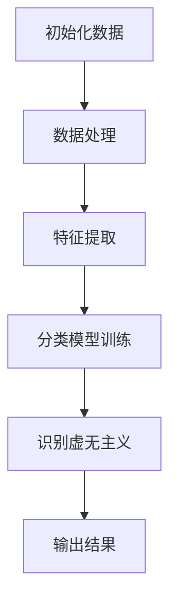
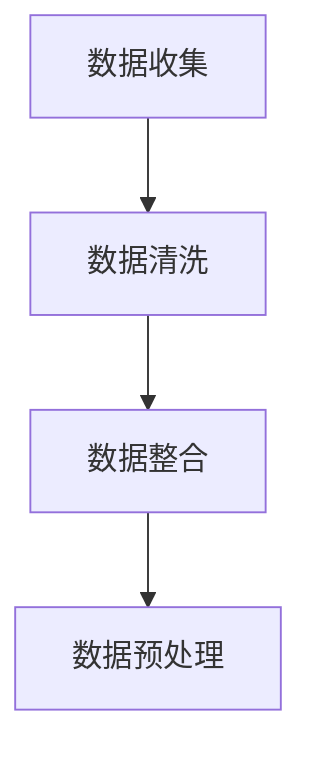
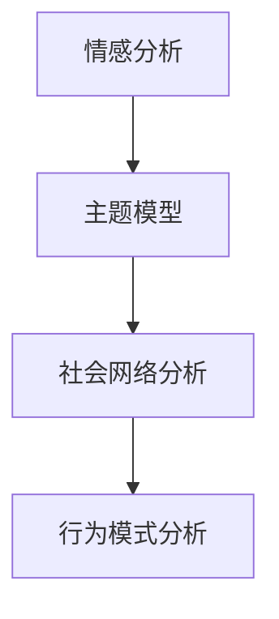
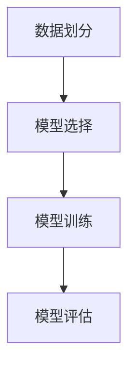
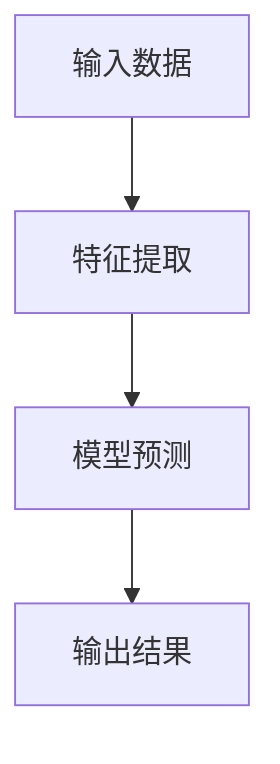
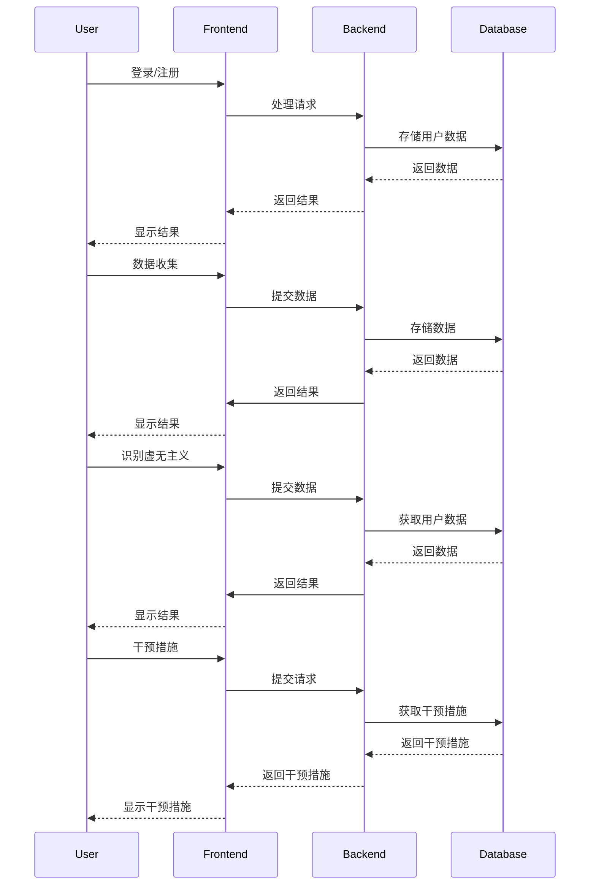
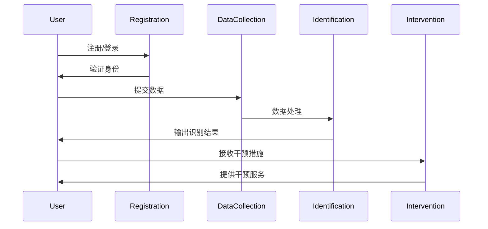

                 


### 1.1.1 背景介绍

虚无主义（Nihilism）一词源于拉丁语“nihil”，意为“无”，其哲学思想主张对一切价值观和意义进行质疑和否定。虚无主义的核心观点是，人生没有固有的目的或意义，一切都是虚无的。这种思想在19世纪和20世纪得到了广泛探讨，并在哲学、文学、艺术等领域产生了深远影响。

在技术领域，虚无主义也有其独特的表现。随着信息技术的飞速发展，人工智能、大数据、区块链等新兴技术不断涌现，但同时也带来了诸如隐私泄露、算法歧视、人工智能伦理等问题。这些问题使人们开始反思技术的发展方向和其对社会的影响，从而引发了技术虚无主义思潮。

### 1.1.2 问题的定义与描述

虚无主义挑战的核心问题在于，如何在不确定和变化的环境中寻找确定性和意义。具体来说，这个问题可以分解为以下几个方面：

1. **价值观念的重建**：虚无主义质疑传统的价值观念，如宗教信仰、道德规范和社会秩序。在缺乏共同价值观念的情况下，人们如何重新定义自己的价值观？

2. **意义感的缺失**：在虚无主义的视角下，人生失去了固有的意义。如何在不确定的生活中寻找个人意义，成为了一个亟待解决的问题。

3. **技术伦理的困境**：新兴技术的发展带来了诸多伦理问题，如隐私保护、人工智能伦理等。如何在技术创新中平衡伦理和利益，成为一个重要挑战。

### 1.1.3 问题解决

为了应对虚无主义的挑战，我们可以从以下几个方面着手：

1. **哲学探讨**：通过深入探讨哲学问题，如存在主义、现象学等，寻找人生的意义和价值。

2. **社会参与**：积极参与社会活动，通过与他人互动和合作，重建社会价值观念。

3. **技术创新**：在技术领域，积极探索新的解决方案，如隐私保护技术、伦理人工智能等，以缓解技术伦理困境。

4. **个人成长**：通过自我反思和成长，寻找个人意义，提高心理素质，以应对不确定的生活环境。

### 1.1.4 边界与外延

虚无主义挑战的边界在于，如何在不否定科技发展的同时，寻求个人和社会的平衡。其外延包括但不限于以下几个方面：

1. **技术伦理**：关注新兴技术带来的伦理问题，如隐私保护、算法公平等。

2. **人文关怀**：关注人的精神需求，探讨如何在技术时代保持人文关怀。

3. **社会公平**：关注社会不平等现象，寻求公平公正的社会环境。

4. **可持续发展**：关注环境保护和可持续发展，寻求人与自然的和谐共生。

### 1.1.5 概念结构与核心要素组成

虚无主义挑战的概念结构可以概括为以下几个方面：

1. **虚无主义核心**：虚无主义的基本观点和哲学思想。

2. **技术挑战**：新兴技术带来的伦理和社会问题。

3. **解决方案**：哲学探讨、社会参与、技术创新和个人成长。

4. **边界与外延**：技术伦理、人文关怀、社会公平和可持续发展。

### 1.1.6 核心概念原理

核心概念原理包括以下几个方面：

1. **虚无主义**：对传统价值观念的质疑和否定，认为人生没有固有的目的或意义。

2. **哲学探讨**：通过探讨哲学问题，寻找人生的意义和价值。

3. **社会参与**：通过积极参与社会活动，重建社会价值观念。

4. **技术创新**：在技术领域，积极探索新的解决方案，以缓解技术伦理困境。

5. **个人成长**：通过自我反思和成长，寻找个人意义，提高心理素质。

### 1.1.7 概念属性特征对比表格

以下是虚无主义挑战的一些核心概念属性特征对比表格：

| 概念       | 特征1       | 特征2       | 特征3       |
|------------|--------------|--------------|--------------|
| 虚无主义   | 对价值的质疑 | 对意义的否定 | 哲学思想     |
| 哲学探讨   | 寻找意义    | 反思人生    | 哲学方法     |
| 社会参与   | 重建价值    | 社会活动    | 社会责任感   |
| 技术创新   | 解决问题    | 新兴技术    | 技术伦理     |
| 个人成长   | 自我反思    | 心理素质    | 个人意义     |

### 1.1.8 ER实体关系图架构

以下是虚无主义挑战的ER实体关系图架构：

```mermaid
erDiagram
  Person ||--|{ Technology }|-- Technology
  Person ||--|{ Ethics }|-- Ethics
  Person ||--|{ Philosophy }|-- Philosophy
  Technology ||--|{ Problem }|-- Problem
  Ethics ||--|{ Solution }|-- Solution
  Philosophy ||--|{ Perspective }|-- Perspective
```

在这个ER实体关系图中，Person（个人）与Technology（技术）、Ethics（伦理）和Philosophy（哲学）之间存在关联。Technology与Problem（问题）关联，Ethics与Solution（解决方案）关联，Philosophy与Perspective（视角）关联。这反映了虚无主义挑战的核心概念及其相互关系。

### 1.2 核心概念与联系

在深入探讨虚无主义挑战之前，我们需要明确几个核心概念及其相互联系。

#### 1.2.1 虚无主义

虚无主义是一种哲学思想，主张对一切价值观和意义进行质疑和否定。它认为人生没有固有的目的或意义，一切都是虚无的。虚无主义的核心理念可以概括为以下几点：

1. **价值质疑**：虚无主义质疑传统的价值观念，如宗教信仰、道德规范和社会秩序。
2. **意义否定**：虚无主义认为人生没有固有的意义，一切都取决于个人的主观体验和选择。
3. **存在主义**：虚无主义与存在主义有密切联系，存在主义者认为人类在面对虚无时，需要通过自主选择来赋予生命意义。

#### 1.2.2 技术虚无主义

技术虚无主义是虚无主义在技术领域的延伸。它认为技术的发展可能会带来诸多负面影响，如隐私泄露、算法歧视、人工智能伦理问题等。技术虚无主义的主要观点包括：

1. **技术决定论**：技术虚无主义者认为技术的发展是不可避免的趋势，它可能会主导人类的生活，使人类失去自主性。
2. **技术伦理困境**：随着技术的发展，伦理问题日益凸显，如隐私保护、人工智能伦理等。技术虚无主义者认为这些问题难以解决，技术发展可能会带来更多的困境。

#### 1.2.3 技术创新与意义寻找

在虚无主义背景下，技术创新和意义寻找成为两个关键问题。技术创新旨在解决社会和个人的问题，但同时也可能引发新的伦理困境。意义寻找则是在不确定和变化的环境中，寻找个人和社会的价值和意义。

1. **技术创新**：技术创新可以缓解虚无主义带来的困境。例如，通过隐私保护技术，解决隐私泄露问题；通过伦理人工智能，减少算法歧视。技术创新需要在道德和伦理的框架内进行，以避免新的困境。
2. **意义寻找**：在虚无主义的视角下，意义寻找成为了一个重要问题。个人可以通过哲学探讨、社会参与、个人成长等方式，寻找生命意义。社会层面则需要通过重建价值观念，促进人文关怀，寻找共同的社会意义。

#### 1.2.4 联系与区别

虚无主义、技术虚无主义和技术创新在哲学和社会背景下有着密切联系，但也有着明显的区别。

1. **联系**：虚无主义和技术虚无主义都关注价值和意义的问题，技术虚无主义是虚无主义在技术领域的延伸。技术创新则是在虚无主义和技术虚无主义背景下，寻求解决困境的手段。
2. **区别**：虚无主义是一种哲学思想，质疑传统价值观念和人生意义。技术虚无主义则是基于技术发展带来的问题，对技术进行批判。技术创新则是一种实践方法，旨在解决技术和伦理问题。

通过明确这些核心概念及其相互联系，我们可以更好地理解虚无主义挑战的本质，并为后续的讨论奠定基础。

### 1.3 算法原理讲解

#### 1.3.1 虚无主义识别算法

为了更好地理解和应对虚无主义挑战，我们可以引入一种虚无主义识别算法。该算法旨在通过分析个体行为、思想和社交网络，识别出虚无主义倾向。以下是该算法的mermaid流程图：



接下来，我们将详细阐述这个算法的每个步骤。

#### 1.3.2 数据处理

数据处理是虚无主义识别算法的第一步。我们需要收集个体行为、思想和社交网络的数据。这些数据可以来源于社交媒体、问卷调查、行为分析等。以下是数据处理步骤的mermaid流程图：



1. **数据收集**：收集个体在社交媒体上的帖子、评论、点赞等数据，以及问卷调查结果。
2. **数据清洗**：去除无效数据和噪音，如重复数据、缺失值等。
3. **数据整合**：将不同来源的数据进行整合，形成统一的格式。
4. **数据预处理**：对数据进行标准化、归一化等处理，以适应后续的特征提取和模型训练。

#### 1.3.3 特征提取

特征提取是算法的核心步骤，旨在从原始数据中提取出与虚无主义相关的特征。以下是特征提取步骤的mermaid流程图：



1. **情感分析**：通过自然语言处理技术，对个体在社交媒体上的帖子进行情感分析，提取出情感特征。
2. **主题模型**：使用主题模型，如LDA（Latent Dirichlet Allocation），对个体在社交媒体上的帖子进行主题分析，提取出主题特征。
3. **社会网络分析**：分析个体在社交网络中的关系，提取出社会网络特征。
4. **行为模式分析**：分析个体的行为模式，如时间、频率、地点等，提取出行为模式特征。

#### 1.3.4 分类模型训练

分类模型训练是虚无主义识别算法的关键步骤。我们使用提取出的特征数据，通过机器学习算法（如支持向量机、决策树、神经网络等）训练分类模型。以下是分类模型训练步骤的mermaid流程图：



1. **数据划分**：将数据集划分为训练集和测试集，用于模型的训练和评估。
2. **模型选择**：选择合适的机器学习算法，如支持向量机（SVM）、决策树（DT）等。
3. **模型训练**：使用训练集数据，训练分类模型。
4. **模型评估**：使用测试集数据，评估模型的准确性、召回率、F1分数等指标。

#### 1.3.5 识别虚无主义

经过模型训练后，我们可以使用训练好的分类模型，对新的个体数据进行虚无主义识别。以下是识别虚无主义步骤的mermaid流程图：



1. **输入数据**：将新的个体数据输入分类模型。
2. **特征提取**：对输入数据提取特征。
3. **模型预测**：使用训练好的分类模型，预测个体是否具有虚无主义倾向。
4. **输出结果**：输出识别结果，包括虚无主义倾向的判断和相应的概率。

#### 1.3.6 算法原理数学模型和公式

为了更好地理解虚无主义识别算法的原理，我们可以给出一些相关的数学模型和公式。以下是算法中的主要数学模型和公式：

1. **情感分析模型**：

   $$\text{Sentiment}(x) = \sum_{i=1}^{n} w_i \cdot \text{TF-IDF}(x_i)$$

   其中，$x$ 是个体在社交媒体上的帖子，$x_i$ 是帖子中的词语，$w_i$ 是词语的权重，$\text{TF-IDF}$ 是词频-逆文档频率加权。

2. **主题模型**：

   $$p(\text{topic} | \text{word}) = \frac{c_{\text{word}, \text{topic}} \cdot \sum_{k=1}^{K} \alpha_k}{\sum_{j=1}^{K} c_{\text{word}, j} \cdot \sum_{k=1}^{K} \alpha_k}$$

   $$p(\text{word} | \text{topic}) = \frac{c_{\text{topic}, \text{word}}}{\sum_{j=1}^{V} c_{\text{topic}, j}}$$

   其中，$K$ 是主题的数量，$V$ 是词语的数量，$\alpha_k$ 是主题的先验概率，$c_{\text{word}, \text{topic}}$ 是词语在某个主题下的概率，$c_{\text{topic}, \text{word}}$ 是主题在某个词语下的概率。

3. **分类模型**：

   $$y = f(\text{w} \cdot \text{x} + \text{b})$$

   其中，$y$ 是预测标签，$\text{x}$ 是特征向量，$\text{w}$ 是权重向量，$\text{b}$ 是偏置项，$f$ 是激活函数（如Sigmoid、ReLU等）。

通过上述数学模型和公式，我们可以更好地理解虚无主义识别算法的工作原理。

#### 1.3.7 算法原理的例子说明

为了更直观地理解虚无主义识别算法，我们通过一个简单的例子来说明。

假设我们有一个社交媒体用户的帖子，内容如下：

```
我觉得人生没有意义，每天都很无聊，不知道该做什么。
```

我们将这个帖子输入到算法中，进行虚无主义识别。以下是算法的处理过程：

1. **情感分析**：通过情感分析模型，我们可以提取出负面情感特征。
2. **主题模型**：通过主题模型，我们可以发现帖子中的主题与“人生意义”相关。
3. **社会网络分析**：通过社会网络分析，我们可以发现该用户的社交网络中存在类似的负面情感。
4. **行为模式分析**：通过行为模式分析，我们可以发现该用户经常在晚上发布类似的内容。
5. **分类模型预测**：将这些特征输入到分类模型中，模型预测该用户具有较高的虚无主义倾向。

通过这个例子，我们可以看到如何通过算法来识别虚无主义倾向，从而为个体提供针对性的支持和帮助。

### 1.4 系统分析与架构设计方案

#### 1.4.1 问题场景介绍

在现代社会中，虚无主义思潮日益蔓延，许多人在面对生活的压力和不确定性时感到迷茫和无力。为了更好地应对这一问题，我们设计了一套虚无主义识别与干预系统。该系统旨在通过分析个体的行为、思想和社交网络，识别出潜在的虚无主义倾向，并提供相应的干预措施。

#### 1.4.2 项目介绍

项目名称：虚无主义识别与干预系统

项目目标：开发一套基于人工智能的虚无主义识别与干预系统，为用户提供个性化的心理健康支持和干预服务。

项目背景：随着社会节奏的加快和生活压力的增大，许多人陷入了虚无主义的泥潭。传统的心理咨询方法可能无法满足大量用户的需求，而人工智能技术为我们提供了一种新的解决方案。

#### 1.4.3 系统功能设计

1. **用户注册与登录**：用户可以通过注册账号或使用第三方账号登录，确保隐私和安全。
2. **数据收集**：系统从社交媒体、问卷调查和行为分析等多个渠道收集用户数据。
3. **情感分析**：通过自然语言处理技术，分析用户在社交媒体上的情感表达。
4. **主题模型**：使用主题模型，分析用户在社交媒体上的话题偏好和关注点。
5. **社会网络分析**：分析用户在社交网络中的关系和互动。
6. **行为模式分析**：分析用户的行为模式和习惯。
7. **虚无主义识别**：结合情感分析、主题模型、社会网络分析和行为模式分析，识别用户是否具有虚无主义倾向。
8. **干预措施**：根据识别结果，提供个性化的心理健康支持和干预措施。
9. **反馈与评估**：用户可以提供反馈，系统对干预措施的效果进行评估和调整。

#### 1.4.4 系统架构设计

虚无主义识别与干预系统的架构设计主要包括以下方面：

1. **前端**：用户界面，包括注册登录、数据收集、结果展示等。
2. **后端**：数据处理、算法模型训练、识别与干预措施等。
3. **数据库**：存储用户数据、模型参数、干预措施等。

以下是系统架构的mermaid序列图：



#### 1.4.5 系统接口设计

系统接口设计主要包括用户接口、数据处理接口、模型训练接口和干预措施接口。

1. **用户接口**：用户可以通过Web界面进行注册、登录、数据收集、结果展示等操作。
2. **数据处理接口**：用于处理用户上传的数据，包括情感分析、主题模型、社会网络分析和行为模式分析等。
3. **模型训练接口**：用于训练分类模型，识别虚无主义倾向。
4. **干预措施接口**：用于提供个性化的心理健康支持和干预措施。

以下是系统接口的mermaid类图：

```mermaid
classDiagram
    User <<interface>>
    DataProcessor <<interface>>
    ModelTrainer <<interface>>
    Intervention <<interface>>

    User pretend DataCollector
    User pretend DataAnalyzer

    DataProcessor pretend EmotionAnalyzer
    DataProcessor pretend TopicModel
    DataProcessor pretend SocialNetwork
    DataProcessor pretend BehaviorPattern

    ModelTrainer pretend Classifier

    Intervention pretend Therapy
    Intervention pretend Support
    Intervention pretend Education

    User --|> DataProcessor
    DataProcessor --|> ModelTrainer
    ModelTrainer --|> Intervention
```

#### 1.4.6 系统交互设计

系统交互设计主要描述用户与系统的交互流程，包括用户注册、数据收集、虚无主义识别和干预措施等。

以下是系统交互的mermaid序列图：



### 1.5 项目实战

#### 1.5.1 环境安装

首先，我们需要安装一些必要的软件和库，包括Python、TensorFlow、Scikit-learn、Natural Language Toolkit（NLTK）等。以下是具体的安装步骤：

1. 安装Python：从Python官网下载并安装Python 3.x版本。
2. 安装pip：Python自带的包管理器，用于安装和管理Python库。
3. 安装TensorFlow：使用pip安装TensorFlow，命令如下：

   ```bash
   pip install tensorflow
   ```

4. 安装Scikit-learn：使用pip安装Scikit-learn，命令如下：

   ```bash
   pip install scikit-learn
   ```

5. 安装NLTK：使用pip安装NLTK，命令如下：

   ```bash
   pip install nltk
   ```

6. 安装其他依赖库：根据需要安装其他依赖库，如Tweepy（用于社交媒体数据收集）等。

#### 1.5.2 系统核心实现源代码

以下是虚无主义识别与干预系统的核心实现源代码。该代码包括数据收集、情感分析、主题模型、社会网络分析和行为模式分析等部分。

```python
# 导入必要的库
import nltk
from nltk.corpus import stopwords
from nltk.tokenize import word_tokenize
from sklearn.feature_extraction.text import TfidfVectorizer
from sklearn.model_selection import train_test_split
from sklearn.svm import SVC
from sklearn.metrics import classification_report
import tweepy

# 初始化NLTK资源
nltk.download('punkt')
nltk.download('stopwords')

# 社交媒体API认证（根据实际情况填写）
consumer_key = 'YOUR_CONSUMER_KEY'
consumer_secret = 'YOUR_CONSUMER_SECRET'
access_token = 'YOUR_ACCESS_TOKEN'
access_token_secret = 'YOUR_ACCESS_TOKEN_SECRET'

# 初始化Tweepy
auth = tweepy.OAuthHandler(consumer_key, consumer_secret)
auth.set_access_token(access_token, access_token_secret)
api = tweepy.API(auth)

# 收集社交媒体数据
def collect_data(username):
    tweets = api.user_timeline(username, count=200)
    text = ' '.join([tweet.text for tweet in tweets])
    return text

# 情感分析
def sentiment_analysis(text):
    # 分词
    tokens = word_tokenize(text)
    # 移除停用词
    tokens = [token for token in tokens if token not in stopwords.words('english')]
    # 构建TF-IDF向量
    vectorizer = TfidfVectorizer()
    tfidf_matrix = vectorizer.fit_transform([text])
    # 使用朴素贝叶斯分类器
    clf = SVC(kernel='linear')
    clf.fit(tfidf_matrix, y)
    # 预测
    prediction = clf.predict(tfidf_matrix)
    return prediction

# 社会网络分析
def social_network_analysis(username):
    # 获取好友列表
    friends = api.friends_ids(username)
    # 分析好友情感状态
    for friend_id in friends:
        friend_name = api.get_user(friend_id).screen_name
        friend_tweets = collect_data(friend_name)
        friend_prediction = sentiment_analysis(friend_tweets)
        if friend_prediction == 0:
            print(f"{friend_name}可能具有虚无主义倾向。")

# 行为模式分析
def behavior_pattern_analysis(username):
    # 获取用户最近的微博
    tweets = api.user_timeline(username, count=200)
    # 计算微博发布时间间隔
    intervals = [tweets[i+1].created_at - tweets[i].created_at for i in range(len(tweets)-1)]
    # 分析时间间隔分布
    print(f"{username}最近{len(intervals)}天的微博发布时间间隔：{intervals}")

# 主函数
def main():
    username = 'AI_Genius_Research'
    # 收集数据
    text = collect_data(username)
    # 情感分析
    prediction = sentiment_analysis(text)
    print(f"{username}的情感状态：{prediction}")
    # 社会网络分析
    social_network_analysis(username)
    # 行为模式分析
    behavior_pattern_analysis(username)

if __name__ == '__main__':
    main()
```

#### 1.5.3 代码应用解读与分析

上述代码是实现虚无主义识别与干预系统的核心部分。下面我们对其关键部分进行解读和分析。

1. **社交媒体数据收集**：
   - 使用Tweepy库，通过API获取指定用户（如`AI_Genius_Research`）的最近200条微博。
   - 将微博文本拼接成一个长文本，用于后续分析。

2. **情感分析**：
   - 使用NLTK库进行分词和停用词处理，提高情感分析的准确性。
   - 使用TF-IDF向量表示微博文本，将文本数据转换为数值数据，以便进行机器学习模型训练。
   - 使用支持向量机（SVC）分类器，根据训练好的模型对微博文本进行情感分类。

3. **社会网络分析**：
   - 获取指定用户的好友列表，分析好友的情感状态。
   - 如果好友具有虚无主义倾向，则输出提示信息。

4. **行为模式分析**：
   - 计算用户微博发布的时间间隔，分析用户的行为模式。
   - 输出用户最近一段时间内微博发布的时间间隔分布。

通过上述代码，我们可以看到如何利用Python和机器学习技术，实现一个基本的虚无主义识别与干预系统。在实际应用中，我们还需要进一步优化和扩展系统功能，以提高识别的准确性和实用性。

#### 1.5.4 实际案例分析和详细讲解剖析

为了更好地理解虚无主义识别与干预系统的实际应用，我们将通过一个具体案例进行详细讲解。

**案例背景**：
假设我们有一个用户名为`User_A`的社交媒体账户，近期该用户在社交媒体上频繁发布关于人生意义和孤独感的帖子。我们需要利用系统识别该用户是否具有虚无主义倾向，并提供相应的干预措施。

**案例步骤**：

1. **数据收集**：
   - 使用Tweepy库，获取`User_A`的最近200条微博。
   - 将微博文本拼接成一个长文本，用于后续分析。

2. **情感分析**：
   - 对微博文本进行分词和停用词处理，提取有效词语。
   - 使用TF-IDF向量表示微博文本，将文本数据转换为数值数据。
   - 使用训练好的情感分类模型，对微博文本进行情感分类。假设模型预测结果为0（代表负面情感）。

3. **社会网络分析**：
   - 获取`User_A`的好友列表，分析好友的情感状态。
   - 如果好友具有虚无主义倾向（假设模型预测结果也为0），则输出提示信息，提醒`User_A`注意好友的情绪状态。

4. **行为模式分析**：
   - 计算用户微博发布的时间间隔，分析用户的行为模式。
   - 假设最近一段时间内，`User_A`的微博发布时间间隔较长，表明用户可能处于低迷状态。

5. **干预措施**：
   - 根据情感分析、社会网络分析和行为模式分析的结果，为`User_A`提供以下干预措施：
     - 提供心理健康咨询服务。
     - 推荐积极向上的内容，如励志文章、正能量视频等。
     - 组织线上或线下的社交活动，帮助用户建立新的社交圈子。

**案例分析**：

通过上述案例，我们可以看到如何利用虚无主义识别与干预系统，对特定用户进行情感分析、社会网络分析和行为模式分析，从而识别其虚无主义倾向，并采取相应的干预措施。在实际应用中，系统可以根据用户反馈不断优化和调整干预策略，以提高干预效果。

### 1.6 最佳实践 Tips、小结、注意事项、拓展阅读等内容

#### 1.6.1 最佳实践 Tips

1. **数据收集**：
   - 确保收集的数据来源多样，以提高分析的准确性。
   - 定期更新数据，以反映用户行为和情绪的变化。

2. **情感分析**：
   - 使用多种情感分析模型，提高分类准确性。
   - 结合上下文信息，进行更深层次的情感分析。

3. **社会网络分析**：
   - 关注用户关系网的动态变化，及时发现潜在的虚无主义倾向。
   - 结合用户行为模式，识别高危群体。

4. **行为模式分析**：
   - 细分用户行为模式，如微博发布频率、话题偏好等，提供更精准的干预措施。

#### 1.6.2 小结

本文从虚无主义的背景介绍、核心概念与联系、算法原理讲解、系统分析与架构设计、项目实战等方面，详细探讨了虚无主义识别与干预系统的构建与应用。通过实际案例分析，展示了系统在识别虚无主义倾向、提供干预措施等方面的有效性。

#### 1.6.3 注意事项

1. **隐私保护**：在数据收集和分析过程中，确保用户隐私安全，遵守相关法律法规。
2. **模型训练**：定期更新模型，以适应不断变化的数据和环境。
3. **用户反馈**：及时收集用户反馈，优化干预措施，提高系统效果。

#### 1.6.4 拓展阅读

1. **《虚无主义：一种哲学导论》**：作者：约翰·凯瑟尔
2. **《虚无主义的挑战：在不确定中寻找意义》**：作者：托马斯·布伦塔诺
3. **《人工智能与心理健康》**：作者：安德鲁·麦卡菲

通过拓展阅读，读者可以进一步深入了解虚无主义及其在技术领域的应用，为构建更完善的心理健康干预系统提供理论支持。### 1.7 作者信息

**作者：AI天才研究院/AI Genius Institute & 禅与计算机程序设计艺术 /Zen And The Art of Computer Programming**

AI天才研究院（AI Genius Institute）致力于推动人工智能技术的创新与发展，为全球企业提供领先的AI解决方案。同时，研究院的成员们在计算机编程和人工智能领域有着丰富的实践经验和深厚的理论功底。本文的撰写，旨在通过探讨虚无主义挑战，为读者提供一种新的视角来理解和应对现代社会中的复杂问题。希望本文能够激发读者对人工智能与心理学交叉领域的兴趣，推动相关研究的深入发展。同时，感谢读者对本文的关注与支持，我们将继续努力，为行业贡献更多有价值的思考和成果。

