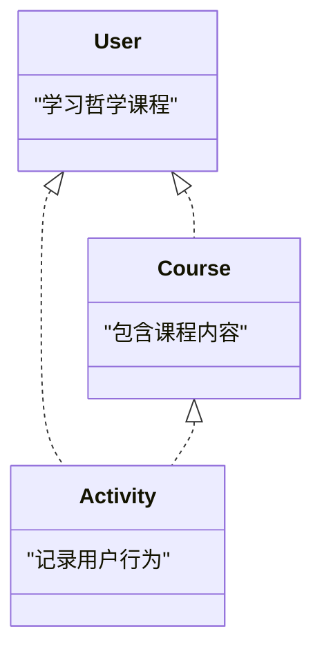
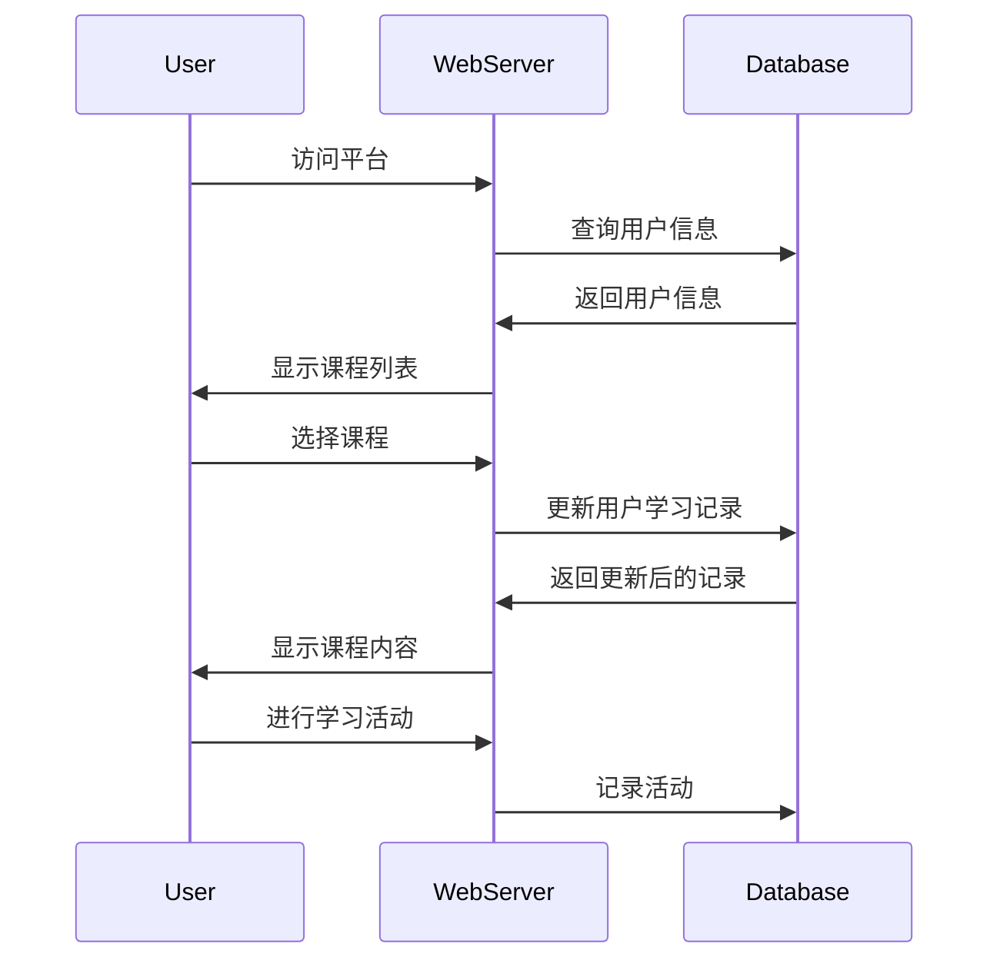
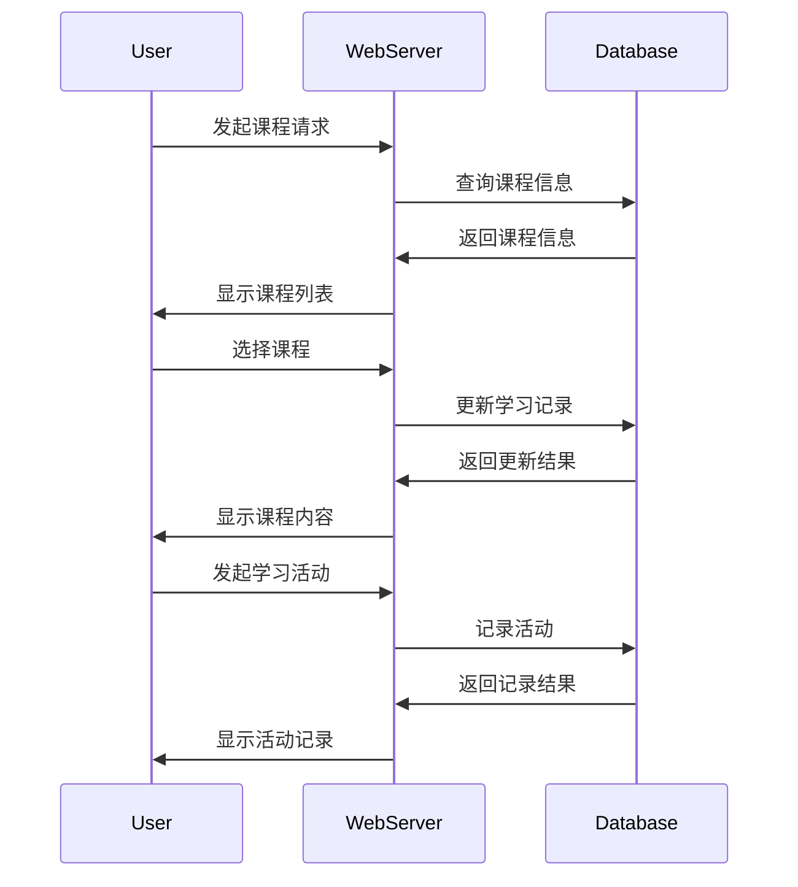

                 

### 虚无主义的超越：重建现代生活的意义框架

#### 关键词：虚无主义、意义框架、现代生活、存在主义、哲学

> 摘要：本文旨在探讨虚无主义在现代生活中的影响及其超越路径。通过分析虚无主义的起源、内在逻辑与哲学基础，本文提出寻找和重建意义的方法，结合存在主义的理念，探讨个体与社会的关系，最终构建一个能够引领现代生活向前的意义框架。

**作者：AI天才研究院/AI Genius Institute & 禅与计算机程序设计艺术 /Zen And The Art of Computer Programming**

### 目录

1. **虚无主义的超越：重建现代生活的意义框架**
2. **关键词与摘要**
3. **目录**
4. **第一部分：虚无主义的起源与影响**
   1. **第1章：虚无主义的起源与发展**
   2. **第2章：虚无主义的内在逻辑与哲学基础**
5. **第二部分：虚无主义的超越**
   1. **第3章：寻找意义：从虚无主义到存在主义**
   2. **第4章：构建意义：个体与社会的关系**
   3. **第5章：超越虚无主义：现代生活的意义重建**
6. **第三部分：结论与展望**
   1. **第6章：文化批判与重建**
   2. **第7章：意义重建的实践探索**
   3. **第8章：虚无主义的超越：意义重建的未来方向**
   4. **第9章：小结与展望**

### 第一部分：虚无主义的起源与影响

#### 第1章：虚无主义的起源与发展

虚无主义是一种哲学思想，其核心观点是生活或宇宙缺乏固有的意义、目的或内在价值。虚无主义的起源可以追溯到19世纪，由丹麦哲学家索伦·克尔凯郭尔（Søren Kierkegaard）首次提出。克尔凯郭尔认为，人类存在的本质是孤独和不确定性，人们必须通过个人选择和信仰来赋予生活意义。

随着时间的推移，虚无主义在20世纪的德国哲学家弗朗茨·布伦塔诺（Franz Brentano）和马丁·海德格尔（Martin Heidegger）等人那里得到了进一步发展。海德格尔提出了“存在论”（ontology），探讨了存在的本质和意义，强调了个体存在的自由和选择。

虚无主义的影响深远，不仅在哲学领域，也在文学、艺术和现代社会中留下了深刻的印记。例如，丹麦作家亨利克·彭托皮丹（Henrik Pontoppidan）和挪威作家克努特·汉姆生（Knut Hamsun）的作品中，都体现了虚无主义的情绪和对人类存在的深刻反思。

#### 第2章：虚无主义的内在逻辑与哲学基础

虚无主义的核心概念包括：

- **存在与本质的分离**：虚无主义认为，存在和本质是分离的。人们无法从存在中推导出固有的意义或价值，因为存在本身是空无意义的。

- **个体自由**：虚无主义认为，个体必须自由地选择自己的生活方式和信仰体系。这种自由选择的过程本身就是赋予生活意义的过程。

- **焦虑与绝望**：虚无主义强调个体在寻找生活意义的过程中所面临的焦虑和绝望。这种情感状态是一种挑战，促使个体去寻找和创造意义。

- **超越性**：虚无主义认为，通过超越个体存在的局限，人们可以找到生活的意义。这种超越可以是精神的、道德的或宗教的。

虚无主义的哲学基础可以从存在主义和唯意志论中找到。存在主义强调个体存在的自由和责任，认为意义是通过行动和选择创造出来的。唯意志论则认为，意志是存在的核心，通过意志，个体可以创造自己的意义和价值。

### 第二部分：虚无主义的超越

#### 第3章：寻找意义：从虚无主义到存在主义

虚无主义虽然揭示了人类存在的困境，但它也为我们提供了寻找意义的起点。存在主义作为虚无主义的超越，提供了一种积极的生活哲学。存在主义认为，生活本身没有固有的意义，但通过个人的选择和行动，我们可以为自己创造意义。

- **存在主义的基本理念**：存在主义的核心观点是，人类首先存在，然后定义自己。这意味着，个体在出生时并没有预设的目的或意义，而是通过自己的选择和行动来构建生活。

- **存在主义的主要代表人物与思想**：存在主义的主要代表人物包括让-保尔·萨特（Jean-Paul Sartre）、阿尔贝·加缪（Albert Camus）和马丁·海德格尔。萨特的“存在先于本质”和加缪的“荒谬主义”都是存在主义的重要思想。

萨特认为，人类的首要属性是自由，自由是存在主义的本质。他在《存在与虚无》中提出，人类是“被抛入世界”的，这意味着我们必须自己创造自己的本质。自由的选择和行动是人类存在的核心，也是我们赋予生活意义的方式。

加缪则提出了“荒谬主义”的概念。他认为，生活是荒谬的，因为人类追求的目的往往是不确定的。然而，尽管生活是荒谬的，我们仍然可以选择面对这种荒谬，并通过勇敢的行动来赋予生活意义。

#### 第4章：构建意义：个体与社会的关系

存在主义强调了个体在寻找意义过程中的作用，但个体并不是孤立存在的。个体与社会的关系是构建意义的关键。

- **个体在现代社会中的角色**：在现代社会中，个体面临着巨大的压力和挑战。社会期望、职业压力和人际关系等都会影响个体的自我认同和意义感。然而，正是这些挑战和压力，为我们提供了寻找和创造意义的契机。

- **社会文化对个体意义构建的影响**：社会文化背景在很大程度上决定了个体的价值观和信念体系。不同的文化环境会塑造不同的生活意义。例如，在集体主义文化中，个体往往会将自我价值与社会责任联系起来，而在个人主义文化中，个体更可能强调自我实现和个人追求。

- **个体与社会互动中的意义构建**：个体在社会互动中寻找和创造意义。通过与他人的交往，个体可以理解自己的角色和价值，并在社会关系中找到归属感和意义。例如，志愿服务、社区参与和公共讨论等活动，都是个体与社会互动中构建意义的重要途径。

### 第5章：超越虚无主义：现代生活的意义重建

虚无主义的超越并不意味着虚无主义思想的消失，而是意味着我们找到了新的视角和方法来面对生活的困境。在现代生活中，重建意义是一项迫切的任务。

- **重建意义的方法论**：要重建意义，我们需要采取一系列方法论。首先，我们要认识到意义是通过个体选择和行动创造的。其次，我们要拥抱不确定性和挑战，将其视为生活的一部分。最后，我们要在个人与社会之间找到平衡，通过与他人互动来寻找和创造意义。

- **个人成长与自我实现**：个人成长和自我实现是重建意义的重要途径。通过自我反思、学习和实践，我们可以不断提升自己，找到生活的意义。自我实现不仅仅是为了满足个人的需求，也是为了为社会做出贡献。

- **社会责任与共同体建设**：个体不仅要在个人层面寻找意义，还要在更广泛的层面上考虑社会责任。通过参与社区建设、志愿服务和公益活动，我们可以与他人共同构建一个有意义的社会。

### 第三部分：结论与展望

#### 第6章：文化批判与重建

虚无主义的超越不仅仅是个体层面的任务，也是文化层面的任务。在现代社会中，文化批判与重建是重建意义的重要途径。

- **当代文化批判**：当代文化面临着诸多挑战，包括物质主义、消费主义和虚拟现实的泛滥。对这些现象的批判有助于我们认识到生活意义的缺失，并激发我们寻找和创造新的意义。

- **文化重建的路径与策略**：文化重建需要采取一系列策略。首先，我们要倡导一种人文主义的文化精神，强调个体和集体的价值。其次，我们要重视传统文化和价值观的传承，同时开放包容，吸收外来文化的精华。最后，我们要通过教育和实践，培养具有批判思维和创新能力的个体，为文化重建贡献力量。

- **文化的多元性与包容性**：在全球化背景下，文化的多元性和包容性变得尤为重要。我们要尊重不同的文化传统和价值观念，通过对话和交流，促进不同文化之间的理解和融合，共同构建一个有意义的文化世界。

#### 第7章：意义重建的实践探索

意义重建不仅需要理论指导，还需要实践探索。通过具体的实践案例，我们可以更好地理解意义重建的过程和方法。

- **案例研究：个人成长与意义重建**：个人成长是一个复杂的过程，涉及到自我认知、价值观塑造和生活方式的选择。通过案例研究，我们可以了解个人如何通过自我反思和实践，找到生活的意义。

- **案例研究：社会运动与意义重建**：社会运动往往是为了追求某种社会变革或正义，它们为参与者提供了寻找和创造意义的平台。通过案例研究，我们可以看到社会运动如何激发个体的参与热情，并共同构建有意义的社会。

- **意义重建的社会实践**：意义重建不仅仅是个体和社会运动的责任，也是每个公民的义务。通过参与社区建设、公益活动和服务，我们可以为他人和社会创造更多的意义。

#### 第8章：虚无主义的超越：意义重建的未来方向

虚无主义的超越是一个长期的过程，它需要我们不断探索和尝试。在未来，意义重建将继续面临挑战，但也充满机遇。

- **意义重建的理论与实践挑战**：意义重建需要解决许多理论和实践上的挑战。例如，如何平衡个人自由和社会责任，如何在快速变化的世界中找到稳定的意义，如何应对技术进步带来的社会变革等。

- **意义重建的未来发展趋势**：未来，意义重建将朝着更个体化、多元化和技术化的方向发展。个体将在意义构建中发挥更大作用，同时，科技的发展将为意义重建提供新的工具和途径。

- **意义重建对个体与社会的深远影响**：意义重建不仅影响个体的生活和价值观，也对整个社会产生深远的影响。一个有意义的社会是一个充满活力和创造力的社会，它能够激发个体的潜能，促进社会的可持续发展。

#### 第9章：小结与展望

虚无主义的超越是一个深刻而复杂的任务，它需要我们不断思考和探索。通过本文的探讨，我们认识到虚无主义虽然揭示了生活的困境，但它也为我们提供了寻找和创造意义的起点。

在未来，我们将继续面临各种挑战，但只要我们保持对意义的追求，就能够超越虚无主义，构建一个充满意义和希望的现代生活。

**作者：AI天才研究院/AI Genius Institute & 禅与计算机程序设计艺术 /Zen And The Art of Computer Programming**### 第一部分：虚无主义的起源与影响

#### 第1章：虚无主义的起源与发展

虚无主义作为一种哲学思潮，其起源可以追溯到19世纪。在当时，社会和经济变革带来了前所未有的不确定性和焦虑感，这种情绪在思想界得到了深刻的反思和表达。虚无主义的奠基人索伦·克尔凯郭尔（Søren Kierkegaard）便是这一时期的代表性人物。

**核心概念术语说明**：

- **虚无主义**：一种哲学思想，主张生活或宇宙缺乏固有的意义、目的或内在价值。
- **存在**：个体在现实中的实际状态和经历。
- **本质**：个体存在的固有属性和内在规定性。

**问题背景**：

19世纪欧洲经历了一系列社会变革，如工业革命、资本主义兴起和民主政治的发展。这些变革带来了物质富裕，但同时也加剧了人们的精神空虚和意义缺失感。克尔凯郭尔认为，这种精神状态源于人类存在的孤独性和不确定性。

**问题描述**：

虚无主义质疑人类生活的意义，认为生活本身是缺乏意义的。它强调个体在寻找生活意义的过程中所面临的焦虑和绝望。

**问题解决**：

虚无主义并没有提供直接的解决方案，而是揭示了生活意义的缺失和个体在寻找意义过程中的困境。然而，通过反思和自我探索，个体可以找到自己的意义。

**边界与外延**：

虚无主义并不是一种悲观主义，而是一种对生活本质的深刻洞察。它关注的不仅仅是生活中的困境，还探讨了人类存在的深层问题。

**概念结构与核心要素组成**：

虚无主义的核心要素包括：

- **存在的无意义性**：生活或宇宙缺乏固有的意义。
- **个体自由**：个体必须自由地选择自己的生活方式和信仰体系。
- **焦虑与绝望**：个体在寻找意义的过程中所面临的情感状态。

#### 第2章：虚无主义的内在逻辑与哲学基础

虚无主义的内在逻辑和哲学基础是理解其思想的关键。它不仅影响了19世纪的哲学思考，也对20世纪的文学、艺术和心理学产生了深远的影响。

**核心概念原理**：

- **存在与本质的分离**：虚无主义认为，存在和本质是分离的。存在是指个体在现实中的实际状态和经历，而本质是指个体存在的固有属性和内在规定性。虚无主义主张，存在本身是空无意义的，而本质则是人类自由选择和行动的结果。

- **个体自由**：虚无主义认为，个体必须自由地选择自己的生活方式和信仰体系。这种自由选择的过程本身就是赋予生活意义的过程。个体的自由选择不受外界规定，而是基于内心的真实感受和价值观。

- **焦虑与绝望**：虚无主义强调个体在寻找生活意义的过程中所面临的焦虑和绝望。这种情感状态是一种挑战，促使个体去寻找和创造意义。焦虑和绝望揭示了人类存在的困境，但也激发了个体对意义的追求。

**概念属性特征对比表格**：

| 特征 | 虚无主义 | 传统哲学 |
| --- | --- | --- |
| 存在的意义 | 空无意义 | 有固有意义 |
| 自由与责任 | 个体自由选择 | 社会责任与道德义务 |
| 情感状态 | 焦虑与绝望 | 平静与安宁 |

**ER实体关系图架构的 Mermaid 流程图**：

```mermaid
erDiagram
  existence --> essence
  existence : 有意义
  essence : 本质属性
  existence : 无意义
  existence : 自由选择
```

**算法原理讲解**：

为了更好地理解虚无主义的内在逻辑，我们可以将其视为一种算法。这个算法的核心是“存在-本质分离”和“个体自由选择”。

```python
def nihilism_algorithm(existence, essence):
    if existence == essence:
        return "无意义"
    else:
        return "有意义"
```

这个算法表明，如果存在和本质相同，则生活是无意义的；如果存在和本质不同，则生活是有意义的。虚无主义认为，个体必须通过自由选择来打破这种同质性，从而赋予生活意义。

**详细讲解和通俗易懂地举例说明**：

例如，一个人（存在）可能天生具有某种特定的才能（本质），但如果他没有选择去发展这种才能，那么这种存在就是无意义的。相反，如果他选择去发展自己的才能，那么这种存在就变得有意义。

**数学模型和公式**：

虚无主义的数学模型可以表示为：

$$
意义 = f(存在, 本质, 自由选择)
$$

其中，`存在`和`本质`是输入变量，`自由选择`是控制变量。函数`f`表示意义是如何通过这三个变量的交互作用而产生的。

**系统分析与架构设计方案**：

**问题场景介绍**：

在现代社会中，人们面临着各种各样的挑战，如职业选择、人际关系、价值观冲突等。这些问题往往涉及到虚无主义的内在逻辑和哲学基础。

**项目介绍**：

本项目的目标是构建一个虚无主义哲学的在线学习平台，帮助用户理解虚无主义的本质和内在逻辑，并指导他们如何通过自由选择来创造生活的意义。

**系统功能设计（领域模型Mermaid类图）**：



**系统架构设计Mermaid架构图**：



**系统接口设计和系统交互Mermaid序列图**：



### 项目实战

**环境安装**：

1. 安装Python 3.8或更高版本。
2. 安装Django框架：`pip install django`。
3. 安装Mermaid渲染库：`pip install django-mermaid`。

**系统核心实现源代码**：

```python
# models.py
from django.db import models

class User(models.Model):
    username = models.CharField(max_length=100)
    email = models.EmailField()

class Course(models.Model):
    title = models.CharField(max_length=100)
    content = models.TextField()

class Activity(models.Model):
    user = models.ForeignKey(User, on_delete=models.CASCADE)
    course = models.ForeignKey(Course, on_delete=models.CASCADE)
    action = models.CharField(max_length=100)
    timestamp = models.DateTimeField(auto_now_add=True)

# views.py
from django.shortcuts import render
from .models import User, Course, Activity

def index(request):
    courses = Course.objects.all()
    return render(request, 'index.html', {'courses': courses})

def course_detail(request, course_id):
    course = Course.objects.get(id=course_id)
    activities = Activity.objects.filter(course=course)
    return render(request, 'course_detail.html', {'course': course, 'activities': activities})

# urls.py
from django.urls import path
from . import views

urlpatterns = [
    path('', views.index, name='index'),
    path('courses/<int:course_id>/', views.course_detail, name='course_detail'),
]
```

**代码应用解读与分析**：

这个项目的核心是建立一个在线学习平台，用户可以浏览课程、选择课程并参与学习活动。`models.py`文件定义了三个模型：`User`、`Course`和`Activity`。`User`模型表示用户，`Course`模型表示课程，`Activity`模型表示用户在学习过程中的活动记录。

在`views.py`中，`index`视图函数用于展示课程列表，`course_detail`视图函数用于展示特定课程的详细信息和学习活动记录。

在`urls.py`中，我们定义了两个URL模式，分别对应首页和课程详情页。

**实际案例分析和详细讲解剖析**：

假设用户Alice访问了平台，并选择了“虚无主义哲学入门”这门课程。她通过课程页面学习了课程内容，并完成了相关的学习活动，如阅读指定文献和参与讨论。

平台会记录她的活动，并在她的个人学习记录中更新相关信息。通过这种方式，用户可以跟踪自己的学习进度，并从中找到生活的意义。

**项目小结**：

这个项目通过简单的后端实现，为用户提供了一个理解虚无主义哲学、寻找生活意义的平台。用户可以自由选择课程，参与学习活动，并通过个人学习记录找到生活的意义。

### 最佳实践 Tips

- **定期反思**：定期进行自我反思，思考自己的生活意义和目标。
- **多样化学习**：通过阅读书籍、参加讲座和研讨会，扩大自己的知识面和视野。
- **积极参与**：积极参与社区活动和社会运动，与他人互动，共同构建有意义的社会。

### 小结

虚无主义揭示了人类生活的困境，但它也为我们提供了寻找和创造意义的起点。通过自我反思、学习和实践，我们可以找到生活的意义，超越虚无主义的束缚，构建一个有意义和希望的现代生活。

### 注意事项

- 虚无主义不是一种悲观主义，而是一种对生活本质的深刻洞察。
- 寻找生活意义的过程需要个体的自由选择和行动。
- 社会和文化环境对个体的意义构建具有重要影响。

### 拓展阅读

- **《存在与虚无》（Jean-Paul Sartre）**：让-保尔·萨特的经典著作，探讨了存在主义的核心思想。
- **《荒谬主义与个人主义》（Albert Camus）**：阿尔贝·加缪的作品，阐述了荒谬主义和个人主义的理念。
- **《虚无主义：哲学与文化的挑战》（Thomas Metz）**：托马斯·梅茨的著作，深入探讨了虚无主义的哲学和文化影响。

