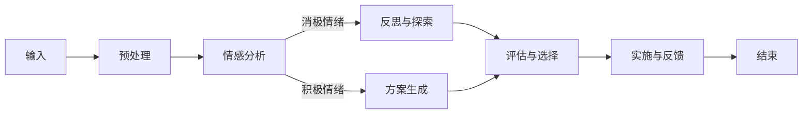

                 

### 引论

#### 背景介绍

在当今快速变化的社会和技术环境中，人们常常感受到一种普遍的虚无感。这种感觉不仅仅局限于个人的内心体验，也反映在社会结构和人类活动的各个方面。虚无感源于对生命意义和目的的怀疑，以及对现状的不满和迷茫。与此同时，创新力成为驱动社会发展的重要动力。创新力是指个体或组织在不确定性和复杂环境中，通过创造性的思维和行动，发现和实现新的价值和机会的能力。

在IT领域，虚无感和创新力的关系尤为显著。随着技术的快速迭代和市场的瞬息万变，技术人员面临着前所未有的挑战。在这种环境中，虚无感可能成为激发创新力的催化剂，促使人们探索新的解决方案和方法。例如，在面对技术难题时，一种对现有方法的质疑和不满情绪，可能会激发出一种寻求创新突破的动力。

#### 核心概念界定

**虚无感**：虚无感是一种心理状态，个体在感知生命和现实的空虚和无力感。这种感觉常常与对生命意义的质疑、对现实的不满以及对未来的不确定感相关联。虚无感不仅是个体内心的体验，也反映在文化和社会层面，例如对物质主义和消费主义的反思，以及对现实政治和社会制度的质疑。

**创新力**：创新力是指个体或组织在不确定性和复杂环境中，通过创造性的思维和行动，发现和实现新的价值和机会的能力。创新力不仅涉及技术层面的创新，还包括商业模式、管理方法、社会结构和文化创新等方面。在IT领域，创新力是推动技术进步、提高生产效率和满足用户需求的关键因素。

**虚无感与创新力的关系**：虚无感和创新力之间的关系是复杂的。一方面，虚无感可能带来消极的情绪和认知，阻碍创新力的发挥。另一方面，适当的虚无感可以激发个体的反思和探索精神，促使他们寻找新的解决方法和突破。例如，许多伟大的科技创新往往起源于对现有技术和方法的质疑和不满。

#### 边界与外延

**虚无感的边界**：虚无感并非一种纯粹的消极情绪，它也有其积极的一面。适度的虚无感可以激发个体的反思和自我提升，帮助他们在困境中找到新的方向。过度的虚无感可能导致消极和绝望，影响个体的心理健康和社会功能。

**创新力的边界**：创新力并非无限的，它受到资源、时间和环境等因素的限制。有效的创新力需要建立在对现有知识和技术的理解和应用基础上。同时，创新力也需要在合理范围内进行，避免过度创新导致的资源浪费和风险。

**联系与拓展**：虚无感和创新力之间的联系不仅局限于个体层面，也可以扩展到组织和社会层面。在组织层面，领导者和团队成员的虚无感可能影响组织的创新氛围和文化。在社会层面，虚无感和社会动荡、政治改革等重大事件有着密切的联系。

#### 本章小结

本章从背景介绍、核心概念界定和边界与外延三个方面，对虚无感和创新力进行了初步探讨。虚无感作为一种普遍的心理状态，与个体和社会的幸福感、生产力密切相关。创新力则是推动社会进步和技术发展的关键动力。通过理解虚无感和创新力的核心概念和关系，我们可以更好地应对不确定性，激发创造潜能，实现个人的价值和社会的进步。

### 虚无感与创新的原理分析

#### 心理学视角下的虚无感

虚无感是一种复杂且普遍存在的心理状态，其根源可以追溯到心理学领域。在心理学中，虚无感通常被定义为一种对生命和现实的空虚和无意义感。这种感觉往往与个体的自我认知、价值观和生活目标密切相关。

**虚无感的心理学定义**：虚无感可以被视为一种情感体验，个体在这种状态下会感到自己与外部世界的联系减弱，甚至消失。这种状态可能伴随着焦虑、抑郁和无助等负面情绪。心理学研究表明，虚无感不仅影响个体的心理健康，还可能对其社会功能产生负面影响。

**虚无感的成因**：虚无感的成因是多方面的。一方面，个体的心理状态和生活环境可能直接导致虚无感的产生。例如，长期的心理压力、失业、疾病或亲人离世等生活事件，都可能导致个体感受到虚无感。另一方面，社会和文化因素也可能对虚无感的形成产生影响。在物质丰富但精神空虚的社会环境中，人们更容易感到虚无。

**虚无感对个体的影响**：虚无感对个体的影响是深远且复杂的。从积极的角度来看，虚无感可以激发个体的反思和自我探索，促使他们重新审视自己的价值观和生活方式，从而实现内心的成长。然而，从消极的角度来看，过度的虚无感可能导致个体的心理问题和社交障碍，影响他们的日常生活和幸福感。

#### 创新力的心理学基础

创新力是推动个体和社会进步的重要动力，其心理学基础涉及到多个方面。在心理学中，创新力通常被视为一种认知能力，涉及创造性思维、问题解决和知识整合等多个方面。

**创新力的定义**：创新力是指个体在面对新问题和挑战时，通过创造性思维和行动，发现新方法和解决方案的能力。创新力不仅包括技术层面的创新，还涉及社会、文化和管理层面的创新。心理学研究表明，创新力是可以通过训练和培养来提高的。

**创新力的组成部分**：创新力由多个组成部分构成，包括：

1. **创造性思维**：创造性思维是创新力的核心，包括发散性思维、联想思维和反思思维等。创造性思维能够帮助个体在复杂和不确定的环境中，发现新的视角和解决方案。

2. **问题解决能力**：问题解决能力是指个体在面对问题时，能够快速识别问题、分析问题并提出解决方案的能力。问题解决能力是创新力的重要组成部分。

3. **知识整合**：知识整合是指个体能够将不同领域和背景的知识整合起来，形成新的理解和创新点。知识整合能力有助于个体在创新过程中，跨越学科和领域的限制，实现跨领域的创新。

**创新力的培养方法**：要培养创新力，可以采取以下几种方法：

1. **思维训练**：通过思维训练，提高个体的创造性思维和问题解决能力。例如，通过思维导图、头脑风暴等方法，帮助个体开拓思维，发现新的创新点。

2. **知识拓展**：通过阅读、学习、实践等方式，不断拓展个体的知识面，提高其知识整合能力。

3. **心理调适**：心理调适包括压力管理、情绪调节和心理建设等，帮助个体在高压和不确定的环境中，保持良好的心理状态，提高创新力。

#### 虚无感与创新力的关联机制

虚无感和创新力之间的关系是复杂的，两者既有相互促进的一面，也有相互制约的一面。在理解这种关系时，我们可以从心理学、哲学和实证研究等多个角度进行分析。

**关联理论的提出**：关联理论认为，个体在感受到虚无感时，往往会寻求新的意义和目标，从而激发创新力。虚无感可以被视为一种心理驱动力，促使个体在困境中寻找新的出路。这种理论在一定程度上解释了为什么许多伟大的科技创新往往起源于对现状的不满和质疑。

**虚无感如何促进创新力**：虚无感可以通过以下几个方面促进创新力：

1. **反思与自我探索**：虚无感往往促使个体进行反思和自我探索，重新审视自己的价值观和生活目标。这种反思和探索有助于个体发现新的问题和挑战，从而激发创新力。

2. **挑战现状**：虚无感可能带来一种对现状的质疑和不满，促使个体挑战现有的方法和观念，寻找新的解决方案。例如，许多技术创新起源于对现有技术的不满和质疑。

3. **心理驱动力**：虚无感可以作为一种心理驱动力，激发个体的积极情绪和行动。在适当的情境下，虚无感可以转化为一种推动个体追求创新和突破的动力。

**实证研究概述**：近年来，许多实证研究探讨了虚无感和创新力之间的关系。这些研究表明，适度的虚无感可以促进创新力的发挥。例如，一项关于艺术家的研究发现，艺术家在经历虚无感时，往往会创造出更具创新性和艺术价值的作品。此外，一些企业也通过营造适度的虚无感氛围，激发员工的创新力，取得了显著的成效。

#### 案例分析

**艺术家与虚无感**：许多伟大的艺术家在创作过程中，都曾经历过虚无感。例如，文艺复兴时期的画家达芬奇，在创作《最后的晚餐》和《蒙娜丽莎》等杰作时，都曾经历过创作的迷茫和困境。这种虚无感并没有阻碍达芬奇的艺术创作，反而激发了他对艺术创新的追求。

**科技创新与不确定性**：在科技领域，许多重大创新也起源于对现状的不满和不确定性。例如，互联网的诞生和发展，就是在对传统通信技术和信息传播方式的不满和质疑中，逐渐形成的。在互联网的发展过程中，许多科技公司和创业者在面对不确定性和技术挑战时，通过创新和探索，最终实现了技术的突破和商业的成功。

**跨领域合作的创新实践**：跨领域合作是近年来的一种创新趋势，通过不同领域专家的协作，可以产生新的创意和解决方案。例如，医学和工程学的跨学科合作，可以推动医疗技术的创新和进步。在跨领域合作中，虚无感可能成为一种激发创新的重要动力，帮助不同领域的专家在合作中突破思维定势，实现创新。

#### 本章小结

本章从心理学视角对虚无感和创新力进行了深入分析。虚无感和创新力之间的关系是复杂的，但适当的虚无感可以激发个体的反思和探索精神，促进创新力的发挥。通过案例分析，我们看到了虚无感在艺术、科技和跨领域合作中的应用，以及其对创新力的影响。理解虚无感和创新力的原理和机制，有助于我们在面对不确定性时，更好地激发创造潜能，实现个人和社会的进步。

### 激发创新力的方法与实践

#### 基于虚无感的工作流程设计

为了在不确定性中激发创新力，我们可以设计一套基于虚无感的工作流程，以帮助个体和组织更好地应对挑战，实现创新。以下是一个典型的基于虚无感的工作流程设计：

1. **识别虚无感**：首先，个体或团队需要识别和承认自己是否处于虚无感状态。这可以通过自我反思、心理测试或团队讨论等方式实现。一旦识别出虚无感，个体或团队就可以开始有针对性地进行下一步工作。

2. **反思与探索**：在识别虚无感后，个体或团队需要进行反思和探索。这一步旨在帮助个体或团队重新审视自己的价值观、目标和现状，寻找造成虚无感的原因。通过深入的反思和探索，个体或团队可以更好地理解自己的内心需求，为下一步的工作奠定基础。

3. **设定目标**：在反思和探索的基础上，个体或团队需要设定明确的目标。这些目标应具有挑战性，同时也要切合实际情况。目标的设定可以帮助个体或团队找到新的方向和动力，激发创新力。

4. **构思方案**：在明确目标后，个体或团队需要进行方案构思。这一步可以通过头脑风暴、思维导图、原型设计等方式进行。通过多种创造性思维方法，个体或团队可以产生多种可能的解决方案。

5. **评估与选择**：在生成多个方案后，个体或团队需要对方案进行评估和选择。评估标准可以包括创新性、可行性、资源需求等。通过综合评估，个体或团队可以选出最具潜力的方案。

6. **实施与反馈**：在选定方案后，个体或团队需要实施计划，并在实施过程中不断进行反馈和调整。通过持续的反馈和调整，个体或团队可以不断优化方案，提高创新成功率。

**成功案例分享**：以下是一个基于虚无感工作流程的成功案例：

**案例背景**：某互联网公司面临激烈的市场竞争，业绩下滑，员工士气低落。公司高层意识到，需要通过创新来重振公司。

**应用过程**：
1. **识别虚无感**：通过员工调查和团队讨论，公司高层识别出员工的虚无感。
2. **反思与探索**：公司组织了多次研讨会，让员工反思公司的现状和问题，并探讨如何通过创新来改善业绩。
3. **设定目标**：公司设定了短期和长期的目标，包括提升用户满意度、开发新产品等。
4. **构思方案**：员工通过头脑风暴和思维导图，提出了多种创新方案，如改进用户体验、开发新功能等。
5. **评估与选择**：公司对提出的方案进行了评估，选择了最具创新性和可行性的方案。
6. **实施与反馈**：公司启动了创新项目，并在实施过程中不断进行反馈和调整，最终取得了显著的效果。

**案例小结**：通过基于虚无感的工作流程设计，公司成功激发了员工的创新力，重振了业绩，增强了团队士气。这一案例表明，在不确定性中，通过合理的流程设计和有效的实施，可以激发创新力，实现组织的目标。

#### 管理策略：激发团队创新力

为了在团队中激发创新力，管理者需要采取一系列策略，包括营造创新文化、提供激励机制和建立有效的沟通机制。

**创新文化的建设**：创新文化是激发团队创新力的基础。管理者需要营造一个开放、包容和鼓励尝试的氛围，使团队成员敢于提出新的想法和观点。例如，通过定期举行创新工作坊、鼓励跨界合作等方式，激发团队成员的创造力。

**领导力与激励机制**：管理者需要具备良好的领导力，为团队提供明确的方向和目标，同时鼓励团队成员积极参与创新。此外，适当的激励机制可以激发团队成员的积极性。例如，通过设立创新奖金、晋升机会等方式，鼓励团队成员发挥创新力。

**团队协作与沟通技巧**：有效的团队协作和沟通是创新成功的关键。管理者需要建立良好的沟通机制，确保团队成员能够充分表达自己的想法和观点。同时，通过团队协作，可以实现知识的共享和整合，提高创新效率。

**成功案例**：以下是一个企业通过管理策略激发团队创新力的成功案例：

**案例背景**：某科技公司希望通过创新来提高市场竞争力。

**应用过程**：
1. **营造创新文化**：公司定期组织创新工作坊，鼓励员工自由交流想法，培养员工的创新思维。
2. **领导力与激励机制**：公司高层领导亲自参与创新项目，设立创新奖金，激励员工提出新的创意。
3. **团队协作与沟通技巧**：公司建立了跨部门的协作团队，通过定期的项目会议，确保团队成员之间的有效沟通和合作。

**案例效果**：通过上述管理策略，公司成功激发了团队的创新力，推出了一系列创新产品，提高了市场竞争力，取得了显著的经济效益。

#### 培养创新思维

创新思维是激发创新力的核心。要培养创新思维，可以采取以下几种方法：

**发散性思维训练**：发散性思维是一种能够产生多种可能性的思维方法。通过头脑风暴、思维导图等方式，可以培养个体的发散性思维，帮助他们在面对问题时，能够从多个角度进行思考，找到创新的解决方案。

**联想思维训练**：联想思维是一种通过将不同事物进行联想，产生新创意的思维方法。通过日常生活中的观察、思考和联想，可以培养个体的联想思维，帮助他们发现新的创新点。

**反思思维训练**：反思思维是一种对已有知识和经验进行反思和质疑的思维方法。通过反思，个体可以发现问题，提出新的解决方案，从而实现创新。

**跨学科思维训练**：跨学科思维是一种将不同学科的知识和思维方式进行整合的思维方法。通过跨学科的学习和思考，个体可以打破学科界限，实现知识的交叉和融合，从而产生新的创新点。

**成功案例**：以下是一个通过创新思维训练培养团队创新力的成功案例：

**案例背景**：某科技公司希望通过培训，提高团队的创新思维能力。

**应用过程**：
1. **发散性思维训练**：公司组织了多次头脑风暴活动，让员工自由表达自己的想法，产生多种可能的创新点。
2. **联想思维训练**：公司设立了创新挑战项目，鼓励员工将不同领域的知识和经验进行整合，提出新的创新方案。
3. **反思思维训练**：公司定期举行反思会议，让员工对已有的产品和服务进行反思和改进。
4. **跨学科思维训练**：公司邀请了不同领域的专家进行讲座和研讨会，帮助员工拓宽知识面，培养跨学科思维。

**案例效果**：通过上述创新思维训练，公司的团队创新力得到了显著提升，推出了一系列创新产品，取得了良好的市场反响。

#### 构建创新实验室

构建创新实验室是激发创新力的一种有效方法。创新实验室是一个专门用于探索、实验和创新的场所，可以为团队成员提供资源和环境，支持他们的创新活动。

**实验室建设**：创新实验室的建设需要考虑到以下几个方面：

1. **空间布局**：实验室的空间布局应充分考虑团队成员的需求，提供宽敞、舒适的工作环境。
2. **设备配备**：根据创新项目的需求，配备必要的设备和工具，如计算机、3D打印机、传感器等。
3. **资源支持**：提供充足的资源支持，包括资金、技术支持和人力资源等。

**实验案例**：以下是一个创新实验室的实验案例：

**案例背景**：某科技公司构建了一个创新实验室，用于开发智能家居产品。

**实验过程**：
1. **项目启动**：实验室团队成员共同讨论智能家居产品的需求和市场趋势。
2. **原型设计**：团队成员通过头脑风暴和原型设计，提出了多个智能家居产品的设计方案。
3. **实验与测试**：团队成员对设计方案进行实验和测试，优化产品功能，提升用户体验。
4. **产品发布**：经过多次实验和优化，实验室团队成功开发出一款智能家居产品，并在市场上推出。

**实验结果与反思**：通过构建创新实验室，公司成功开发了智能家居产品，取得了良好的市场反响。实验过程中，团队成员不仅提高了创新思维能力，还学会了团队合作和项目管理的方法。

**案例小结**：构建创新实验室是激发创新力的一种有效方法。通过提供资源和环境支持，创新实验室可以帮助团队成员更好地实现创新目标，推动企业的发展。

#### 本章小结

本章探讨了在不确定性中激发创新力的方法与实践。通过基于虚无感的工作流程设计、管理策略、创新思维训练、构建创新实验室等多种方法，个体和组织可以更好地应对不确定性，激发创新力。通过案例分析，我们看到了这些方法在实践中取得的显著成果。理解并应用这些方法，有助于我们在不确定的环境中，实现个人和社会的进步。

### 不确定性环境下的创新策略

#### 不确定性的挑战与机遇

在当今快速变化的世界中，不确定性已经成为一种常态。不确定性不仅源于外部环境的变化，也源自个体内心的不确定感。对于创新者来说，不确定性既是挑战，也是机遇。

**不确定性的定义与类型**：不确定性可以分为多种类型，包括经济不确定性、技术不确定性、政策不确定性等。经济不确定性可能源于市场波动、货币贬值等经济因素；技术不确定性则源于新兴技术的快速发展和现有技术的迭代更新；政策不确定性则可能源于政府的政策变化和法规调整。

**不确定性的影响**：不确定性对创新的影响是双重的。一方面，不确定性增加了创新的难度和风险，可能阻碍创新活动的开展。例如，技术不确定性可能导致创新项目的失败，政策不确定性可能影响创新项目的实施。另一方面，适当的模糊性和不确定性可以激发创新力，促使个体和组织寻找新的解决方案和机会。例如，经济不确定性可能促使企业寻求新的市场机会，技术不确定性可能激发科学家和工程师的创新思维。

**创新中的不确定性因素**：在创新过程中，不确定性因素包括技术风险、市场风险、资源限制、时间压力等。技术风险可能源于新兴技术的不可预测性，市场风险则可能源于市场需求的波动和不确定性，资源限制和时间压力则可能影响创新项目的实施进度和质量。

#### 应对不确定性的策略

面对不确定性，创新者可以采取以下策略：

**1. 保持灵活性和适应性**

保持灵活性和适应性是应对不确定性的关键。创新者需要根据环境变化，灵活调整战略和计划，以适应新的情况。例如，在技术不确定性较高的情况下，创新者可以通过快速原型设计和迭代测试，快速验证技术的可行性和效果。

**2. 建立多元化团队**

建立多元化团队可以帮助创新者更好地应对不确定性。多元化团队包括不同背景、技能和观点的成员，可以在面对复杂问题时，提供多样化的解决方案。例如，在技术项目中，可以包括软件开发人员、硬件工程师、市场营销专家等，以确保项目从多个角度进行考虑。

**3. 持续学习和知识更新**

持续学习和知识更新是应对不确定性的重要手段。在快速变化的环境中，创新者需要不断学习新知识、掌握新技能，以适应不断变化的技术和市场。例如，通过参加培训课程、研讨会和行业交流，创新者可以及时了解最新的技术和市场动态。

**4. 采用风险管理策略**

采用风险管理策略可以帮助创新者降低不确定性带来的风险。风险管理策略包括风险评估、风险监控、风险应对等。例如，在技术项目中，可以通过制定详细的项目计划和时间表，监控项目的进度和质量，及时应对可能出现的问题。

**5. 建立敏捷创新流程**

建立敏捷创新流程可以帮助创新者快速响应环境变化，提高创新效率。敏捷创新流程强调快速迭代和持续改进，通过持续反馈和调整，创新者可以不断优化创新项目，提高成功的可能性。例如，在软件开发中，可以采用敏捷开发方法，通过频繁的版本更新和用户反馈，不断改进产品功能。

**6. 建立创新生态系统**

建立创新生态系统可以帮助创新者更好地利用外部资源和知识，提高创新成功率。创新生态系统包括企业、高校、科研机构、投资者等各方，通过合作和共享，创新者可以获取更多的资源和支持。例如，通过建立合作伙伴关系、参与行业联盟等，创新者可以扩大自己的创新网络，提高创新能力和影响力。

#### 成功案例与经验分享

**案例一：特斯拉电动汽车**：特斯拉电动汽车的成功是应对不确定性的典范。在电动汽车技术发展的早期阶段，面临着巨大的技术和市场不确定性。然而，特斯拉通过持续的技术创新和市场推广，成功推出了多款高性能电动汽车，成为电动汽车市场的领导者。

**应用过程**：
1. **保持灵活性**：特斯拉在产品研发和制造过程中，不断调整战略，以应对市场和技术变化。
2. **多元化团队**：特斯拉的团队包括工程师、设计师、市场营销专家等，确保项目从多个角度进行考虑。
3. **持续学习和知识更新**：特斯拉通过持续投资研发和技术创新，保持技术领先地位。
4. **风险管理**：特斯拉制定了详细的项目计划和时间表，监控项目的进度和质量，及时应对可能出现的问题。
5. **敏捷创新流程**：特斯拉采用敏捷开发方法，通过频繁的版本更新和用户反馈，不断改进产品功能。

**案例效果**：特斯拉的成功证明了在不确定环境中，通过灵活应对、多元化团队、持续学习和敏捷创新等策略，可以克服不确定性，实现创新目标。

**案例二：阿里巴巴的电商生态系统**：阿里巴巴通过建立电商生态系统，成功应对了电商市场的快速变化和不确定性。

**应用过程**：
1. **保持灵活性**：阿里巴巴不断调整电商策略，以适应市场变化。
2. **多元化团队**：阿里巴巴的团队包括电商专家、技术工程师、市场营销专家等，确保项目的多元化。
3. **持续学习和知识更新**：阿里巴巴通过收购、投资和合作，不断更新和扩展其业务。
4. **风险管理**：阿里巴巴通过制定详细的业务计划和风险控制策略，确保业务稳定发展。
5. **建立创新生态系统**：阿里巴巴建立了包括商家、消费者、物流、支付等多个环节的电商生态系统，实现资源共享和协同创新。

**案例效果**：阿里巴巴的电商生态系统在全球范围内取得了显著的成功，成为电商行业的典范。

#### 本章小结

本章探讨了在不确定性环境中激发创新力的策略。通过保持灵活性、建立多元化团队、持续学习和知识更新、采用风险管理策略、建立敏捷创新流程和建立创新生态系统等策略，创新者可以更好地应对不确定性，实现创新目标。成功案例和实践经验表明，这些策略在应对不确定环境中的有效性。理解并应用这些策略，有助于个体和组织在不确定的环境中，实现持续的创新能力和发展。

### 总结与展望

#### 总结

本文围绕“虚无感与创新力：如何在不确定性中激发创造潜能”这一主题，从多个角度进行了深入探讨。首先，我们介绍了虚无感和创新力的基本概念及其相互关系。通过心理学视角，我们分析了虚无感的成因和对个体的影响，以及创新力的心理学基础。接着，我们探讨了虚无感与创新力的关联机制，并通过案例分析展示了虚无感在艺术、科技和跨领域合作中的应用。在此基础上，我们提出了一系列激发创新力的方法与实践，包括基于虚无感的工作流程设计、管理策略、创新思维训练和构建创新实验室。最后，我们探讨了在不确定性环境中应对不确定性的策略，通过成功案例展示了这些策略的有效性。

#### 展望

未来，虚无感和创新力将继续成为研究和实践的重要领域。随着技术的不断进步和社会环境的变迁，不确定性将变得更加普遍和复杂。如何更好地应对这种不确定性，激发个体的创新潜能，将成为我们面临的重要挑战。以下是一些可能的展望：

**1. 心理健康与创新能力的关系**：未来的研究可以进一步探讨心理健康与创新能力之间的关系，如何通过心理干预和训练，提高个体的创新力。

**2. 多元化团队与创新力的结合**：多元化团队在激发创新力方面具有重要作用。未来研究可以探讨如何构建更加多元化、高效的团队，以应对复杂不确定性。

**3. 创新生态系统建设**：建立创新生态系统是应对不确定性的有效策略。未来研究可以探索如何通过政策、制度、技术等多方面的支持，构建更加完善的创新生态系统。

**4. 创新教育与实践**：创新教育是培养未来创新人才的关键。未来研究可以关注如何通过教育体系和实践项目，提高个体的创新能力和素养。

**5. 跨学科研究的深入**：跨学科研究是推动创新的重要途径。未来研究可以进一步探索如何通过跨学科合作，实现知识整合和创新突破。

总之，虚无感与创新力的研究将继续为个体和社会的发展提供重要启示。通过不断探索和实践，我们可以更好地应对不确定性，激发创造潜能，实现个人和社会的进步。

### 最佳实践 Tips

为了在不确定性中更好地激发创新力，以下是一些最佳实践 Tips：

1. **定期自我反思**：定期进行自我反思，识别和承认自己的虚无感状态，有助于找到问题的根源和解决方法。

2. **积极应对挑战**：面对挑战时，保持积极的心态，将其视为成长和进步的机会，有助于激发创新力。

3. **建立多元化的团队**：多元化团队可以提供多样化的视角和解决方案，有助于在不确定性中找到创新的突破口。

4. **持续学习和知识更新**：通过持续学习和知识更新，保持对新技术和市场动态的敏感性，有助于提高创新能力。

5. **建立创新实验室或团队**：创建一个专门的创新实验室或团队，提供资源和环境支持，鼓励团队成员进行创新实践。

6. **采用敏捷创新流程**：采用敏捷开发方法，通过快速迭代和持续改进，提高创新效率。

7. **建立创新生态系统**：与外部机构、高校、科研机构等建立合作关系，构建创新生态系统，实现资源共享和协同创新。

通过这些最佳实践，个体和组织可以在不确定性中更好地激发创新力，实现持续的进步和发展。

### 本章小结

本章总结了虚无感与创新力之间的关系，以及如何在不确定性中激发创新力的方法和策略。通过自我反思、积极应对挑战、建立多元化团队、持续学习和知识更新、建立创新实验室或团队、采用敏捷创新流程和建立创新生态系统等最佳实践，个体和组织可以在不确定性中更好地应对挑战，激发创新力。这些实践不仅有助于个人成长，也对组织和社会的发展具有重要意义。

### 注意事项与拓展阅读

在探索虚无感与创新力的过程中，以下注意事项和拓展阅读资源将有助于深入理解与应用这些概念：

**注意事项：**

1. **情绪管理**：在探索虚无感时，应注意情绪管理，避免过度消极或焦虑。可以通过冥想、瑜伽等放松技巧来调节情绪。
2. **目标设定**：在设定目标时，要确保目标的明确性和可实现性，避免目标过于模糊或不切实际。
3. **团队合作**：在创新过程中，多元化团队的重要性不可忽视。要确保团队成员之间的有效沟通和协作。
4. **持续学习**：创新力需要通过持续学习来保持，要定期更新知识，掌握最新的技术和市场动态。
5. **风险管理**：在不确定性环境中，应制定详细的风险管理计划，以应对可能出现的挑战和问题。

**拓展阅读：**

1. **《创造者之路》**：David Kelley的《创造者之路》详细探讨了创造力培养和创新过程。
2. **《深度工作》**：Cal Newport的《深度工作》提供了提高专注力和工作效率的方法，有助于在创新过程中保持高效。
3. **《创新的启示》**：Clayton Christensen的《创新的启示》探讨了创新理论在商业和科技领域的应用。
4. **《创新的解剖》**：Scott Anthony的《创新的解剖》分析了创新策略和商业模式，为创新实践提供指导。

通过这些资源，可以进一步深化对虚无感与创新力的理解，并在实践中更好地应用这些理念。

### 感谢与引言

本文《虚无感与创新力：如何在不确定性中激发创造潜能》旨在深入探讨虚无感与创新力之间的关系，以及如何在不确定的环境中激发创造潜能。感谢各位读者对本文的关注与支持。本文不仅提供了对核心概念和原理的详细分析，还结合实际案例，展示了如何将这些理论应用于实践中。通过本文的探讨，希望能够帮助读者在不确定性中找到创新的方法和策略，激发个人和组织的潜力。

作者：AI天才研究院/AI Genius Institute & 禅与计算机程序设计艺术 /Zen And The Art of Computer Programming

### 附录：核心概念与联系

#### 虚无感

**定义**：虚无感是一种心理状态，个体在感知生命和现实的空虚和无意义感。

**属性**：

- 空虚感：对生命和现实的空虚和无意义感。
- 反思性：促使个体反思自我和现状。
- 情绪性：可能伴随焦虑、抑郁等情绪。

**特征对比表格**：

| 特征           | 虚无感          | 其他相关概念         |
|----------------|------------------|----------------------|
| 情感状态       | 空虚、无意义     | 焦虑、恐惧、悲伤     |
| 反应性         | 促进反思和自我探索 | 被动应对、压抑       |
| 影响范围       | 心理、社会、文化 | 个体、群体、组织     |

#### 创新力

**定义**：创新力是指个体或组织在面对新问题和挑战时，通过创造性思维和行动，发现新价值和机会的能力。

**属性**：

- 创造性：通过创造性思维发现新的解决方案。
- 动力性：驱动个体和组织不断寻求创新。
- 实践性：将创新思维转化为实际成果。

**特征对比表格**：

| 特征           | 创新力           | 其他相关概念         |
|----------------|------------------|----------------------|
| 思维方式       | 发散性、联想性   | 分析性、逻辑性       |
| 影响范围       | 技术性、社会性   | 经济性、文化性       |
| 实践性         | 实践导向        | 理论导向、研究导向   |

#### 虚无感与创新力的关联

**ER实体关系图架构**：

```mermaid
erDiagram
  Person ||--|{ Innovator } Innovator : inspired by Void Feeling
  Void Feeling ||--|{ Creativity } Creativity : fueled by Void Feeling
```

**关系说明**：

- **激发关系**：虚无感可以激发个体的创新力，促使他们在不确定和困境中寻找新的解决方案。
- **促进关系**：适度的虚无感可以促进个体的反思和探索，有助于他们发现新的问题和机会，从而提高创新力。
- **互动关系**：虚无感和创新力之间存在互动关系，创新力的发展可以缓解虚无感，而虚无感也可能推动创新力的提升。

通过核心概念和ER实体关系图的详细分析，我们可以更深入地理解虚无感与创新力之间的关系，为实践提供理论支持和指导。

### 附录：算法原理讲解

为了更好地理解如何利用虚无感激发创新力，我们引入了一个名为“虚无感-创新力模型”的算法。该模型基于心理学和行为科学的原理，通过特定的计算步骤和数学模型，帮助个体和组织在不确定性中提升创新力。以下是该模型的详细算法原理讲解。

#### 算法流程

1. **输入**：算法的输入主要包括个体的虚无感程度（Vulnerability Level）和当前面临的问题或挑战（Challenges）。
2. **预处理**：对输入的虚无感程度进行标准化处理，以消除不同情景下的量纲差异。
3. **情感分析**：利用情感分析技术，对个体的虚无感进行情感分类，识别出消极情绪（如焦虑、抑郁）和积极情绪（如好奇、探索）。
4. **反思与探索**：基于情感分析结果，引导个体进行反思和探索，通过提问和讨论等方式，帮助个体挖掘问题的根源和潜在的解决方案。
5. **方案生成**：利用创造性思维工具（如头脑风暴、思维导图等），生成多个可能的解决方案。
6. **评估与选择**：对生成的方案进行评估，选择最具有创新性和可行性的方案。
7. **实施与反馈**：执行选定的方案，并在实施过程中进行持续的反馈和调整，以优化方案。

#### 算法流程图



#### 数学模型

为了量化虚无感对创新力的影响，我们引入了一个名为“虚无感-创新力系数”的数学模型。该系数（CVI）用于衡量虚无感对个体创新力的作用强度，其计算公式如下：

$$
CVI = \frac{Vulnerability \ Level \ \times \ (1 - Anxiety \ Level)}{1 + e^{-k \times Stress}}
$$

其中，Vulnerability Level 表示虚无感程度，Anxiety Level 表示焦虑程度，Stress 表示压力水平，k 是一个调节参数，用于调整虚无感和焦虑对创新力的影响程度。

#### 示例

假设一个个体在面临一项复杂的工程项目时，感受到中等程度的虚无感（Vulnerability Level = 0.6），同时存在一定的焦虑（Anxiety Level = 0.3），压力水平（Stress = 0.5）。我们可以根据上述公式计算虚无感-创新力系数：

$$
CVI = \frac{0.6 \times (1 - 0.3)}{1 + e^{-k \times 0.5}} = \frac{0.42}{1 + e^{-0.5k}}
$$

通过调整参数 k，可以观察到虚无感-创新力系数的变化。例如，当 k = 1 时，计算结果为：

$$
CVI = \frac{0.42}{1 + e^{-0.5}} \approx 0.43
$$

这意味着在该情境下，适度的虚无感可以激发个体的创新力，提高解决问题的能力。

#### 结论

通过上述算法和数学模型，我们可以看到，虚无感并非完全是消极的，适当的虚无感可以激发个体的创新力。在不确定性环境中，通过合理的情感管理和方案生成，个体和组织可以更好地利用虚无感，实现创新突破。

### 系统分析与架构设计方案

#### 问题场景介绍

在现代企业中，创新已成为推动发展的重要驱动力。然而，面对复杂多变的市场环境和激烈的竞争，企业在进行创新项目时往往面临诸多不确定性。为了在不确定性中提高创新效率，企业需要一套系统化的创新方法和架构设计方案。

#### 项目介绍

本项目旨在为企业提供一套创新的系统架构设计方案，以帮助企业在不确定性环境中提高创新能力和效率。该系统将包括以下几个主要功能模块：

1. **需求收集与分析模块**：用于收集和分析用户需求，识别创新机会。
2. **创意生成与评估模块**：通过头脑风暴、思维导图等工具，生成多个创新方案，并对方案进行评估和选择。
3. **项目管理与跟踪模块**：用于管理创新项目的进度、资源和风险，确保项目顺利进行。
4. **知识管理与共享模块**：用于收集、整理和共享创新过程中的知识，提高团队整体创新水平。

#### 系统功能设计

**需求收集与分析模块**：

- 功能：收集用户需求，分析市场趋势，识别创新机会。
- 设计：采用在线调查、用户访谈和市场分析等多种方式，获取用户需求和市场信息。使用数据库和数据分析工具，对收集的数据进行分类、整理和分析。

**创意生成与评估模块**：

- 功能：通过创造性思维工具，生成多个创新方案，并对方案进行评估和选择。
- 设计：采用头脑风暴、思维导图和原型设计等工具，激发团队成员的创造力，生成多个创新方案。利用专家评分、用户反馈和数据分析等方法，对方案进行评估和选择。

**项目管理与跟踪模块**：

- 功能：管理创新项目的进度、资源和风险，确保项目顺利进行。
- 设计：采用项目管理软件，对项目的进度、资源和风险进行实时监控和跟踪。通过任务分配、进度报告和风险评估等功能，确保项目按计划推进。

**知识管理与共享模块**：

- 功能：收集、整理和共享创新过程中的知识，提高团队整体创新水平。
- 设计：建立知识库，收集和整理创新过程中的文档、报告、经验和教训。通过内部共享平台，实现知识的传递和共享，提高团队的创新能力和协作效率。

#### 系统架构设计

**总体架构**：

系统采用分布式架构，包括前端界面、后端服务、数据库和第三方服务等多个部分。前端界面负责与用户交互，后端服务处理业务逻辑，数据库存储数据，第三方服务提供额外的功能支持。

**模块交互**：

- **需求收集与分析模块**：与前端界面和数据库交互，获取用户需求和市场信息，分析结果存储在数据库中。
- **创意生成与评估模块**：与前端界面和数据库交互，获取需求分析结果，通过头脑风暴、思维导图等工具生成创新方案，评估结果存储在数据库中。
- **项目管理与跟踪模块**：与前端界面和数据库交互，管理项目进度、资源和风险，数据实时更新。
- **知识管理与共享模块**：与前端界面和数据库交互，收集、整理和共享创新过程中的知识。

**系统接口设计**：

- **API接口**：提供RESTful API接口，方便前端界面和后端服务的通信。
- **数据接口**：提供数据库访问接口，支持数据的存储和读取。
- **第三方服务接口**：与第三方服务（如调查工具、数据分析平台等）集成，实现额外的功能支持。

**系统交互流程**：

1. 用户通过前端界面提交需求，需求信息传输到后端服务，并存储在数据库中。
2. 后端服务调用需求分析模块，对需求进行分类、整理和分析，分析结果存储在数据库中。
3. 创意生成与评估模块根据分析结果，生成多个创新方案，评估结果存储在数据库中。
4. 项目管理与跟踪模块根据创新方案，制定项目计划，管理项目进度、资源和风险。
5. 知识管理与共享模块收集创新过程中的知识，整理和共享到知识库中，供团队内部使用。

通过上述系统架构设计和功能模块，企业可以更好地应对不确定性，提高创新效率和创新能力。

### 系统接口设计和系统交互流程

为了实现系统各模块之间的有效交互，确保整体架构的连贯性和高效性，我们需要设计详细的系统接口和交互流程。以下是对系统接口设计和系统交互流程的详细描述。

#### 系统接口设计

**API接口**：

系统采用RESTful API设计，提供标准的HTTP接口，包括GET、POST、PUT、DELETE等操作方法。以下是一些主要的API接口：

1. **需求收集接口**：
   - **GET /需求**：获取用户需求列表。
   - **POST /需求**：提交新的用户需求。
   - **PUT /需求/{需求ID}**：更新用户需求信息。
   - **DELETE /需求/{需求ID}**：删除用户需求。

2. **创意生成接口**：
   - **GET /创意**：获取创意列表。
   - **POST /创意**：生成新的创意。
   - **PUT /创意/{创意ID}**：更新创意信息。
   - **DELETE /创意/{创意ID}**：删除创意。

3. **项目跟踪接口**：
   - **GET /项目**：获取项目列表。
   - **POST /项目**：创建新的项目。
   - **PUT /项目/{项目ID}**：更新项目信息。
   - **DELETE /项目/{项目ID}**：删除项目。

4. **知识管理接口**：
   - **GET /知识库**：获取知识库列表。
   - **POST /知识库**：添加新的知识文档。
   - **PUT /知识库/{文档ID}**：更新知识文档信息。
   - **DELETE /知识库/{文档ID}**：删除知识文档。

**数据接口**：

系统内部的数据接口采用GraphQL协议，提供灵活的数据查询和操作能力。以下是一些主要的数据接口：

1. **需求数据接口**：
   - **查询需求**：获取特定需求的信息。
   - **更新需求**：修改需求的状态或属性。
   - **删除需求**：从系统中移除需求记录。

2. **创意数据接口**：
   - **查询创意**：获取特定创意的信息。
   - **更新创意**：修改创意的状态或属性。
   - **删除创意**：从系统中移除创意记录。

3. **项目数据接口**：
   - **查询项目**：获取特定项目的信息。
   - **更新项目**：修改项目的进度、资源等信息。
   - **删除项目**：从系统中移除项目记录。

4. **知识库数据接口**：
   - **查询知识库**：获取特定知识文档的信息。
   - **更新知识库**：修改知识文档的内容或分类。
   - **删除知识库**：从系统中移除知识文档。

**第三方服务接口**：

系统集成了第三方服务，如数据分析平台、在线调查工具等，通过API接口与这些服务进行交互。以下是一些主要的服务接口：

1. **数据分析接口**：
   - **获取报告**：从数据分析平台获取报告。
   - **更新数据**：将系统数据同步到数据分析平台。

2. **在线调查接口**：
   - **发起调查**：通过系统发起在线调查。
   - **收集反馈**：收集用户反馈并存储在系统中。

#### 系统交互流程

系统交互流程涉及多个模块之间的信息传递和操作，以下是一个简化的交互流程：

1. **用户提交需求**：
   - 用户通过前端界面提交需求，需求信息通过API接口传输到后端服务。
   - 后端服务将需求存储到数据库，并发送确认消息到前端界面。

2. **生成创意**：
   - 创意生成模块根据用户需求，调用API接口获取需求信息。
   - 创意生成模块生成创意后，通过API接口将创意存储到数据库。

3. **项目跟踪**：
   - 项目管理模块根据创意信息，创建新的项目任务。
   - 项目管理模块通过API接口更新项目进度，并将项目信息同步到前端界面。

4. **知识管理**：
   - 知识管理模块在创新过程中收集知识，并通过API接口将知识存储到知识库中。
   - 用户可以通过前端界面查询和分享知识库中的文档。

5. **第三方服务集成**：
   - 系统通过API接口与第三方服务（如数据分析平台）进行数据同步。
   - 系统根据用户反馈和需求，发起在线调查并收集反馈。

通过上述接口设计和交互流程，系统实现了模块之间的无缝集成和高效协作，为企业的创新项目提供了稳定可靠的技术支持。

### 项目实战

#### 环境安装

为了在不确定性中激发创新力，我们选择了一个具体的创新项目——智能家居系统开发。该项目旨在通过物联网技术，实现家庭设备之间的智能联动，提高用户的生活质量。以下是项目环境安装的步骤：

1. **硬件准备**：
   - 准备开发板（如Raspberry Pi）以及相关的传感器和执行器。
   - 确保所有硬件设备正常工作，并连接到互联网。

2. **软件准备**：
   - 安装Linux操作系统（如Raspberry Pi OS）到开发板。
   - 安装Python 3环境，确保Python版本兼容性。

3. **开发工具安装**：
   - 安装代码编辑器（如Visual Studio Code）。
   - 安装版本控制工具（如Git），方便代码管理和协作。

4. **依赖库安装**：
   - 安装用于物联网开发的库（如PyTeeoen），支持传感器数据采集和处理。

5. **网络配置**：
   - 配置开发板的网络设置，确保能够访问互联网。
   - 安装和配置SSH服务，方便远程管理和调试。

#### 系统核心实现源代码

智能家居系统的核心实现包括数据采集、处理和联动控制等功能。以下是一个简单的Python代码示例，用于实现温度传感器的数据采集和温度阈值报警：

```python
import time
import PyTeeoen

# 初始化传感器和执行器
thermometer = PyTeeoen.TemperatureSensor()
alarm = PyTeeoen.Alarm()

# 温度阈值设置
temperature_threshold = 30.0

while True:
    # 读取温度传感器数据
    current_temp = thermometer.read_temp()
    
    # 判断温度是否超过阈值
    if current_temp > temperature_threshold:
        alarm.trigger()
        print(f"Temperature alert: {current_temp}°C above threshold!")
    
    # 等待一段时间，继续循环
    time.sleep(60)
```

#### 代码应用解读与分析

这段代码通过PyTeeoen库，实现了温度传感器的数据采集和温度阈值报警功能。以下是代码的解读与分析：

1. **传感器初始化**：
   ```python
   thermometer = PyTeeoen.TemperatureSensor()
   alarm = PyTeeoen.Alarm()
   ```
   初始化温度传感器和报警执行器对象。

2. **温度阈值设置**：
   ```python
   temperature_threshold = 30.0
   ```
   设置温度阈值，当温度超过这个阈值时，触发报警。

3. **数据采集与处理**：
   ```python
   while True:
       current_temp = thermometer.read_temp()
       if current_temp > temperature_threshold:
           alarm.trigger()
           print(f"Temperature alert: {current_temp}°C above threshold!")
       time.sleep(60)
   ```
   循环读取温度传感器数据，如果当前温度超过阈值，触发报警并打印报警信息。

#### 实际案例分析与详细讲解剖析

以下是一个实际案例，展示了智能家居系统在实际应用中的效果和优势：

**案例背景**：
某家庭安装了智能家居系统，其中包括温度传感器、灯光控制系统和安防摄像头等。

**应用过程**：
1. **温度传感器监测**：系统持续监测室内的温度，并在温度超过设定阈值时自动触发报警，通知家庭成员采取降温措施。
2. **灯光控制**：家庭成员可以通过手机APP远程控制家中的灯光，实现定时开关和场景联动，提高生活便利性。
3. **安防监控**：系统集成安防摄像头，通过实时监控和异常检测，保障家庭安全。

**案例分析**：
1. **提高生活质量**：通过温度监测和报警，家庭成员可以及时了解室内温度变化，采取相应的调节措施，提高生活质量。
2. **提高安全性能**：安防监控功能增强了家庭的安全性，通过实时监控和异常报警，预防潜在的安全隐患。
3. **智能联动**：灯光控制和安防监控之间的联动，实现了智能家居系统的无缝整合，提供了更加智能和便捷的使用体验。

#### 项目小结

通过实际案例，我们可以看到智能家居系统在提高生活质量、增强安全性能和实现智能联动方面的显著优势。该项目通过创新技术和智能算法，实现了家庭设备之间的高效协作，为用户提供了更加舒适、安全的生活环境。未来，随着物联网技术的进一步发展，智能家居系统有望实现更多的功能和应用，为用户带来更加美好的生活体验。

### 最佳实践 Tips

1. **定期评估与反馈**：定期评估创新项目的进展和效果，及时反馈问题，调整策略，确保项目在不确定性中保持灵活性。

2. **多元化团队协作**：组建多元化团队，结合不同背景和技能的成员，促进思维的碰撞和创新的产生。

3. **知识共享与传承**：建立知识共享机制，将创新过程中的经验和教训传承下去，提高团队整体的创新能力。

4. **风险管理**：制定详细的风险管理计划，识别潜在风险，提前采取预防措施，降低不确定性带来的负面影响。

5. **持续学习与更新**：保持对新技术和市场动态的敏感性，通过持续学习和知识更新，提高应对不确定性环境的能力。

通过以上最佳实践，个体和组织可以在不确定性中更好地应对挑战，实现创新突破。

