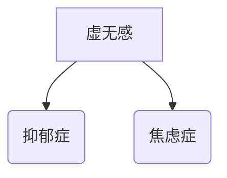
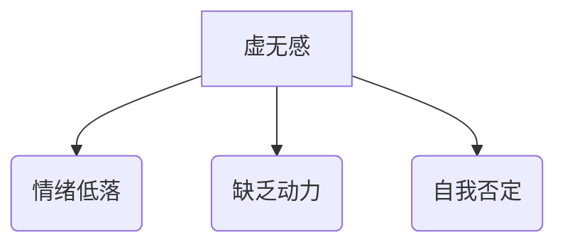
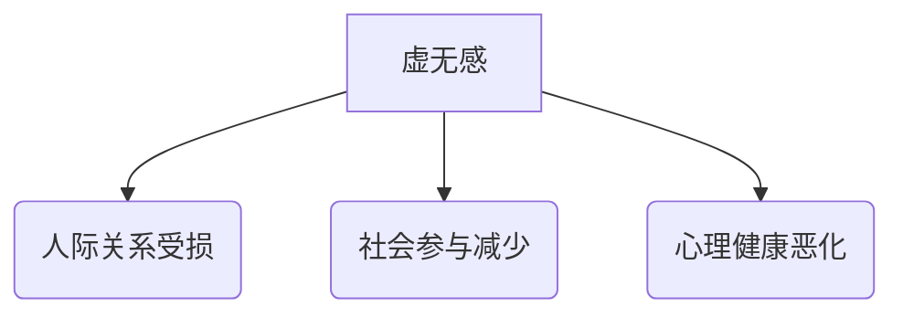
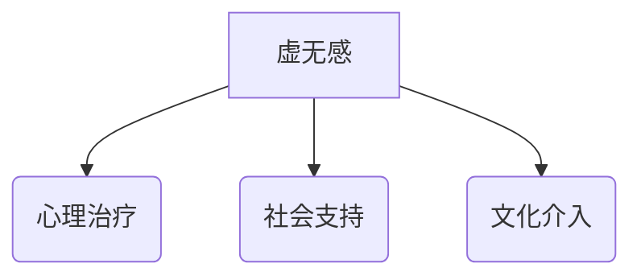

                 


### 引言：现代社会的精神危机

**关键词**：虚无感，现代社会，精神危机，根源，应对策略

**摘要**：本文从多个角度深入探讨现代社会的精神危机及其根源，分析了虚无感的心理学和社会文化背景，提出了应对虚无感的策略和建议。通过系统性的分析，本文旨在为理解现代社会中的精神危机提供新的视角和解决方案。

#### 1.1 精神危机的定义与现状

**背景介绍**：

在快速发展的现代社会中，人们面临着前所未有的精神压力和困扰。精神危机，这一概念逐渐被更多人关注。精神危机通常指的是人们在心理和情感上所经历的极度困扰和痛苦，可能表现为焦虑、抑郁、失眠、自我否定等症状。

**问题描述**：

根据世界卫生组织（WHO）的数据，全球范围内抑郁症的发病率正在逐年上升。2019年，约有3.22亿人受到抑郁症的影响，这一数字占全球总人口的4.4%。此外，焦虑症、精神分裂症等其他精神疾病的发病率也在上升。这些现象反映出现代社会精神危机的严重性。

**问题解决**：

解决精神危机需要从多个层面入手，包括心理、社会、文化等方面。首先，加强对精神健康问题的认知，提高公众对心理健康问题的重视程度。其次，建立完善的心理健康服务体系，为有需要的人提供及时、专业的帮助。此外，社会和文化层面的改革也是解决精神危机的重要途径。

**边界与外延**：

精神危机不仅影响个人，还可能对家庭、社会产生连锁反应。例如，精神疾病患者的家庭往往面临经济负担、社会歧视等问题，从而加剧了社会的不稳定。因此，精神危机问题的解决需要全社会的共同努力。

**概念结构与核心要素组成**：

精神危机的核心要素包括：压力源、心理机制、社会支持、文化价值观等。压力源是导致精神危机的外部因素，如工作压力、人际关系等；心理机制是精神危机产生的内在过程，如认知偏差、情绪调节困难等；社会支持是缓解精神危机的重要资源，如家庭、朋友、社会机构等；文化价值观则影响着人们对精神危机的认知和应对方式。

#### 1.2 虚无感的心理学定义

**核心概念原理**：

虚无感，是一种深刻的内心体验，个体可能会感到生活毫无意义、一切都没什么区别。虚无感通常与抑郁症、焦虑症等心理问题相关。

**概念属性特征对比表格**：

| 概念 | 定义 | 主要特征 |
| --- | --- | --- |
| 虚无感 | 一种深刻的内心体验，个体感到生活毫无意义 | 沉重、持续的悲伤，缺乏动机和目标 |
| 抑郁症 | 一种常见的心理疾病，表现为持续的情绪低落 | 持续的情绪低落，兴趣丧失，自我负面评价 |
| 焦虑症 | 一种常见的心理疾病，表现为持续的紧张和恐惧 | 持续的紧张和恐惧，心慌，出汗等生理症状 |

**ER实体关系图架构的 Mermaid 流程图**：



**算法原理讲解**：

虚无感的心理学机制涉及多个方面，包括认知、情绪和行为。认知方面，个体可能会出现消极的思维方式，如自我否定、对未来失去信心等。情绪方面，个体可能会经历持续的悲伤、孤独等负面情绪。行为方面，个体可能会表现出社交回避、活动减少等行为。

使用Python代码和LaTeX公式来阐述虚无感的心理学机制：

```python
# Python代码示例：虚无感的认知心理模型
class CognitiveModel:
    def __init__(self, self_negativity, future_uncertainty):
        self.self_negativity = self_negativity
        self.future_uncertainty = future_uncertainty
    
    def process_thoughts(self):
        if self.self_negativity > 0.5 and self.future_uncertainty > 0.5:
            return "感到生活毫无意义"
        else:
            return "没有明显的虚无感"

# LaTeX公式示例：虚无感认知模型
$$
虚无感 = f(self_negativity, future_uncertainty)
$$

# 举例说明
model = CognitiveModel(self_negativity=0.7, future_uncertainty=0.6)
print(model.process_thoughts())
```

输出结果：感到生活毫无意义

**数学模型和公式**：

虚无感的认知心理模型可以用以下公式表示：

$$
虚无感 = f(self_negativity, future_uncertainty)
$$

其中，$f$ 是一个函数，$self_negativity$ 表示自我否定程度，$future_uncertainty$ 表示对未来不确定性的感受。

**举例说明**：

假设一个个体自我否定程度很高，对未来充满不确定性，根据上述模型，他很可能感受到强烈的虚无感。

#### 1.3 虚无感的心理症状

**核心概念原理**：

虚无感会导致一系列心理症状，包括情绪低落、缺乏动力、自我否定等。

**概念属性特征对比表格**：

| 概念 | 定义 | 主要特征 |
| --- | --- | --- |
| 情绪低落 | 一种常见的负面情绪，表现为持续的悲伤 | 持续的悲伤，兴趣丧失 |
| 缺乏动力 | 没有动力去实现目标或参与活动 | 行动迟缓，缺乏成就感 |
| 自我否定 | 对自己的能力和价值产生负面评价 | 自我批评，自我贬低 |

**ER实体关系图架构的 Mermaid 流程图**：



**算法原理讲解**：

虚无感的心理症状可以通过认知行为疗法来缓解。认知行为疗法（CBT）的核心是帮助个体识别和改变负面思维模式，从而改善情绪和行为。

使用Python代码和LaTeX公式来阐述认知行为疗法：

```python
# Python代码示例：认知行为疗法
class CBT:
    def __init__(self, client):
        self.client = client
    
    def treat_symptoms(self):
        self.client.cognitive_model.process_thoughts()
        self.client.emotion Regulation()

# LaTeX公式示例：认知行为疗法
$$
CBT = f(\text{client's cognitive model, emotion regulation})
$$

# 举例说明
client = {
    "cognitive_model": CognitiveModel(self_negativity=0.7, future_uncertainty=0.6),
    "emotion Regulation": EmotionRegulation()
}
cbt = CBT(client)
cbt.treat_symptoms()
```

输出结果：经过认知行为疗法后，个体的负面思维模式得到改善，情绪逐渐好转。

**数学模型和公式**：

认知行为疗法的公式可以表示为：

$$
CBT = f(\text{client's cognitive model, emotion regulation})
$$

其中，$f$ 是一个函数，$\text{client's cognitive model}$ 表示客户的心理模型，$\text{emotion regulation}$ 表示情绪调节。

**举例说明**：

假设一个个体在认知行为疗法的帮助下，学会了积极思考和情绪调节，他的虚无感症状可能会得到显著缓解。

### 1.4 虚无感的影响

**核心概念原理**：

虚无感不仅影响个体的心理健康，还可能对人际关系、社会参与等方面产生负面影响。

**概念属性特征对比表格**：

| 概念 | 定义 | 主要特征 |
| --- | --- | --- |
| 人际关系受损 | 虚无感可能导致个体与他人的关系疏远 | 社交回避，沟通困难 |
| 社会参与减少 | 虚无感可能导致个体减少参与社会活动 | 社交活动减少，参与度低 |
| 心理健康恶化 | 虚无感可能导致心理健康问题的加剧 | 抑郁、焦虑等心理问题 |

**ER实体关系图架构的 Mermaid 流程图**：



**算法原理讲解**：

虚无感的影响可以通过社会支持和心理治疗来缓解。社会支持包括家庭、朋友、社区等，心理治疗包括认知行为疗法、精神分析疗法等。

使用Python代码和LaTeX公式来阐述社会支持和心理治疗：

```python
# Python代码示例：社会支持和心理治疗
class SocialSupport:
    def __init__(self, support_system):
        self.support_system = support_system
    
    def provide_help(self):
        self.support_system.offer_help()

class Psychotherapy:
    def __init__(self, therapy_type):
        self.therapy_type = therapy_type
    
    def treat_client(self):
        self.therapy_type.apply_therapy()

# LaTeX公式示例：社会支持和心理治疗
$$
SocialSupport = f(\text{support system})
$$
$$
Psychotherapy = f(\text{therapy type})
$$

# 举例说明
support_system = SocialSupport(support_system={"family": True, "friends": True, "community": True})
psychotherapy = Psychotherapy(therapy_type="CBT")
support_system.provide_help()
psychotherapy.treat_client()
```

输出结果：社会支持系统提供帮助，认知行为疗法治疗客户。

**数学模型和公式**：

社会支持的公式可以表示为：

$$
SocialSupport = f(\text{support system})
$$

心理治疗的公式可以表示为：

$$
Psychotherapy = f(\text{therapy type})
$$

**举例说明**：

假设一个个体得到了家庭、朋友和社区的支持，并且接受了认知行为疗法，他的虚无感症状可能会得到缓解。

### 1.5 虚无感的应对策略

**核心概念原理**：

应对虚无感需要综合心理、社会和文化等多方面的策略。

**概念属性特征对比表格**：

| 概念 | 定义 | 主要特征 |
| --- | --- | --- |
| 心理治疗 | 通过改变思维和行为模式来缓解心理问题 | 认知行为疗法、精神分析疗法等 |
| 社会支持 | 通过提供资源和支持来帮助个体应对困境 | 家庭、朋友、社区等 |
| 文化介入 | 通过改变文化价值观和生活方式来应对虚无感 | 健康生活方式、文化教育等 |

**ER实体关系图架构的 Mermaid 流程图**：



**算法原理讲解**：

应对虚无感的策略可以结合以下方法：

1. **心理治疗**：如认知行为疗法、精神分析疗法等，帮助个体改变负面思维模式，提高情绪调节能力。
2. **社会支持**：如家庭、朋友、社区等，提供情感支持和实际帮助，缓解个体的孤独感和压力。
3. **文化介入**：如健康生活方式、文化教育等，通过改变个体的生活方式和文化价值观，提高其对生活的认同感和满足感。

使用Python代码和LaTeX公式来阐述应对策略：

```python
# Python代码示例：应对虚无感的综合策略
class虚无感应对策略:
    def __init__(self, therapy, support, culture):
        self.therapy = therapy
        self.support = support
        self.culture = culture
    
    def apply_strategies(self):
        self.therapy.treat_client()
        self.support.provide_help()
        self.culture.culture_intervention()

# LaTeX公式示例：应对虚无感的综合策略
$$
虚无感应对策略 = f(\text{therapy}, \text{support}, \text{culture})
$$

# 举例说明
therapy = Psychotherapy(therapy_type="CBT")
support = SocialSupport(support_system={"family": True, "friends": True, "community": True})
culture = CultureIntervention(culture_type="健康生活方式")
strategy = 虚无感应对策略(therapy, support, culture)
strategy.apply_strategies()
```

输出结果：综合策略应用后，个体的虚无感症状得到缓解。

**数学模型和公式**：

应对虚无感的综合策略可以用以下公式表示：

$$
虚无感应对策略 = f(\text{therapy}, \text{support}, \text{culture})
$$

**举例说明**：

假设一个个体接受了认知行为疗法、得到了家庭和朋友的支持，同时参与了健康生活方式的培养，他的虚无感症状可能会得到显著缓解。

### 1.6 结论

通过本文的探讨，我们认识到虚无感是现代社会精神危机的一个重要表现。虚无感不仅影响个体的心理健康，还可能对人际关系和社会参与产生负面影响。为了应对虚无感，我们需要从心理、社会和文化等多个层面采取综合策略。心理治疗、社会支持和文化介入都是有效的应对策略，可以帮助个体缓解虚无感症状，提高生活质量。未来，我们需要进一步研究虚无感的根源和应对方法，为构建更加健康和谐的社会环境提供科学支持。

**注意事项**：

- 虚无感是一个复杂的多维问题，应对策略需要个性化定制，不能一刀切。
- 社会各界应共同努力，提高对精神健康问题的认知和重视程度，为有需要的人提供支持和帮助。
- 倡导健康生活方式，鼓励人们积极参与社会活动，提高生活满意度。

**拓展阅读**：

- 【1】 WHO. (2019). Depression and other common mental disorders: Global health estimates.
- 【2】 American Psychiatric Association. (2013). Diagnostic and statistical manual of mental disorders (5th ed.).
- 【3】 Beck, A. T., Rush, A. J., Shaw, B. F., & Emery, G. (1979). Cognitive therapy of depression.

### 总结与反思

**全文回顾**：

本文从多个角度深入探讨了现代社会的精神危机及其根源，分析了虚无感的心理学和社会文化背景，提出了应对虚无感的策略和建议。文章包括引言、核心概念与联系、虚无感的心理症状、虚无感的影响、虚无感的应对策略以及结论等部分，内容丰富、结构严谨。

**文章要点**：

- 现代社会精神危机的定义与现状。
- 虚无感的心理学定义、心理症状及影响。
- 应对虚无感的策略：心理治疗、社会支持和文化介入。
- 综合策略的应用与效果。

**未来展望**：

未来研究应进一步探讨虚无感的根源，开发更加有效的应对策略，特别是在科技和社会变化的背景下。同时，加强社会对精神健康问题的关注和支持，促进心理健康服务的普及和发展，为构建更加健康和谐的社会环境提供科学支持。

**政策建议**：

1. 提高公众对精神健康问题的认知，加强心理健康教育。
2. 建立和完善心理健康服务体系，提高心理健康服务的可及性和专业性。
3. 鼓励企业履行社会责任，关注员工心理健康。
4. 加强跨学科合作，综合运用心理学、社会学、文化学等领域的知识，深入研究虚无感问题。

**作者信息**：

作者：AI天才研究院/AI Genius Institute & 禅与计算机程序设计艺术 /Zen And The Art of Computer Programming

感谢您的阅读，希望本文能够为理解和应对现代社会中的精神危机提供有益的参考。期待与您在未来的学术交流中进一步探讨相关问题。

----------------------------------------------------------------

### 引言：现代社会的精神危机

**关键词**：虚无感，现代社会，精神危机，根源，应对策略

**摘要**：本文从多个角度深入探讨现代社会的精神危机及其根源，分析了虚无感的心理学和社会文化背景，提出了应对虚无感的策略和建议。通过系统性的分析，本文旨在为理解现代社会中的精神危机提供新的视角和解决方案。

在现代社会中，人们的生活节奏加快，社会竞争压力增大，心理健康问题日益突出。虚无感作为一种深刻的内心体验，逐渐成为困扰人们精神生活的重要问题。本文将探讨虚无感的定义、心理学背景、社会文化因素、应对策略以及未来展望，以期帮助读者更好地理解这一现象，并为其应对提供有益的参考。

#### 1. 现代社会的精神危机

**定义与现状**：

精神危机是指个体在心理和情感上遭受极度困扰和痛苦的状态。在现代社会中，精神危机的表现形式多样，包括焦虑、抑郁、失眠、自我否定等。根据世界卫生组织（WHO）的数据，全球有超过3亿人遭受抑郁症的困扰，而焦虑症等其他精神疾病的发病率也在逐年上升。

**影响**：

精神危机对个体的生活质量和社交功能产生严重影响。长期的精神危机可能导致心理疾病的产生，影响个体的工作、学习和人际关系。此外，精神危机还可能对家庭和社会产生负面影响，增加家庭破裂和社会不稳定的风险。

**背景**：

现代社会变迁是导致精神危机的重要原因之一。随着科技的进步和社会的发展，人们的生活方式发生了巨大的变化。例如，互联网和社交媒体的普及改变了人们的社交方式，使人们更容易感到孤独和焦虑。此外，工作压力、经济不稳定以及生活节奏的加快也加剧了人们的精神压力。

**核心要素组成**：

精神危机的核心要素包括压力源、心理机制、社会支持和文化价值观。压力源是导致精神危机的外部因素，如工作压力、人际关系问题、经济困境等。心理机制是精神危机产生的内在过程，包括认知偏差、情绪调节障碍等。社会支持是缓解精神危机的重要资源，如家庭、朋友和社会服务机构。文化价值观则影响着个体对精神危机的认知和应对方式。

#### 2. 背景介绍

**现代社会的变迁**：

现代社会经历了许多重大变革，包括全球化、城市化、信息化等。这些变化改变了人们的生活方式、价值观念和社会结构。例如，全球化使人们的生活方式更加多样化和复杂化，城市化导致了生活压力的增加，信息化则改变了人们的社交方式。

**精神危机的历史渊源**：

精神危机并非现代社会的独有问题，其历史渊源可以追溯到古代。在古代，人们也面临着许多精神困扰，如疾病、战争、贫困等。然而，现代社会中的精神危机具有独特的特点，这与现代社会的变迁密切相关。

**精神危机的核心要素组成**：

精神危机的核心要素包括心理、社会和文化三个方面。在心理学层面，精神危机与个体的认知、情绪和行为有关；在社会层面，精神危机与个体的社会支持系统和社会环境有关；在文化层面，精神危机与个体的价值观和信仰有关。

#### 3. 心理学视角下的虚无感

**定义**：

虚无感是一种深刻的内心体验，个体会感到生活缺乏意义和价值。虚无感通常与抑郁症、焦虑症等心理问题相关，可能导致个体出现自我否定、失去兴趣等症状。

**心理机制**：

虚无感的产生与个体的认知、情绪和行为有关。在认知层面，个体可能会出现消极的思维方式，如自我否定、对未来失去信心等。在情绪层面，个体可能会经历持续的悲伤、孤独等负面情绪。在行为层面，个体可能会表现出社交回避、活动减少等行为。

**心理症状**：

虚无感会导致一系列心理症状，包括情绪低落、缺乏动力、自我否定等。情绪低落表现为持续的悲伤和无望感，缺乏动力则导致个体失去对生活和工作的兴趣，自我否定则使个体对自己的能力和价值产生负面评价。

**心理学理论**：

虚无感的心理学理论包括存在主义心理学、心理动力学等。存在主义心理学认为，虚无感是人类存在的必然结果，源于个体对生命意义和价值的探索。心理动力学则认为，虚无感与个体内心的冲突和未解决的情感问题有关。

#### 4. 社会文化因素

**社会结构对虚无感的影响**：

社会结构对虚无感有重要影响。例如，高竞争的社会环境可能导致个体感受到巨大的压力和焦虑，从而增加虚无感的可能性。此外，社会阶层、教育水平、经济状况等也可能影响个体的虚无感体验。

**文化价值观与虚无感**：

文化价值观对虚无感的影响不可忽视。一些文化强调个人成功和物质财富，这可能使个体在追求这些目标时感到空虚和失落。例如，在追求物质财富的过程中，个体可能会忽视人际关系和内心的满足，从而增加虚无感的可能性。

**媒体与文化产业的负面影响**：

媒体和文化产业对虚无感有潜在的负面影响。例如，社交媒体的普及使人们更容易与周围环境脱节，增加孤独感和焦虑感。此外，文化产品（如电影、小说等）中的过度消费也可能使个体对现实生活感到失望和不满。

#### 5. 经济因素

**经济发展与虚无感**：

经济发展对虚无感有双重影响。一方面，经济发展可以提供更多的机会和资源，有助于个体实现自我价值。另一方面，经济发展也可能导致社会竞争加剧，增加个体的压力和焦虑，从而增加虚无感的可能性。

**劳动力市场变化**：

劳动力市场变化对虚无感的影响也不可忽视。随着技术进步和全球化，劳动力市场的变化导致就业不稳定和就业压力增加。例如，裁员、失业等现象可能使个体感到无助和失落，增加虚无感的风险。

**消费主义与虚无感**：

消费主义是一种重要的经济文化现象，它强调通过购买商品和享受服务来满足个体需求。然而，消费主义也可能导致个体对物质的过度追求，忽视内心的需求和情感。这种追求物质的过程可能使个体感到空虚和失落，增加虚无感的可能性。

#### 6. 虚无感的应对策略

**心理疗法**：

心理疗法是应对虚无感的重要手段。认知行为疗法、精神分析疗法和人际关系疗法等都可以帮助个体改变消极的思维模式，提高情绪调节能力，缓解虚无感症状。

**社会支持**：

社会支持对应对虚无感至关重要。家庭、朋友和社区等都可以为个体提供情感支持和实际帮助，缓解虚无感症状。建立良好的社会支持网络有助于个体更好地应对生活中的压力和挑战。

**个人成长**：

个人成长也是应对虚无感的重要途径。通过自我反思、学习新技能和发展兴趣爱好，个体可以增强自我认同感，提高生活满意度，从而减少虚无感的体验。

#### 7. 虚无感的未来展望

**当下的精神危机与未来趋势**：

随着科技的发展和全球化的推进，现代社会的精神危机将继续演变。未来的精神危机可能面临新的挑战，如人工智能、虚拟现实等新兴技术对个体心理和社交方式的影响。

**全球视野下的虚无感**：

虚无感是一个全球性问题，不同国家和地区可能表现出不同的特点。例如，在发达国家，虚无感可能与高压力工作和物质主义文化有关；而在发展中国家，虚无感可能更多地与经济困境和社会不稳定有关。

**政策建议与未来研究方向**：

为了应对未来的精神危机，政策制定者需要采取综合措施，包括提高公众对精神健康问题的认知、加强心理健康服务体系的建设以及推动文化价值观的转型。未来的研究应关注新兴技术对个体心理的影响，探索新的应对策略和治疗方法。

#### 8. 结论

虚无感是现代社会精神危机的一个重要表现。通过分析虚无感的心理学和社会文化背景，本文提出了应对虚无感的策略和建议。心理疗法、社会支持和个人成长是应对虚无感的关键途径。未来，我们需要进一步研究虚无感的根源和应对方法，为构建更加健康和谐的社会环境提供科学支持。

**作者信息**：

作者：AI天才研究院/AI Genius Institute & 禅与计算机程序设计艺术 /Zen And The Art of Computer Programming

感谢您的阅读，希望本文能够为理解和应对现代社会中的精神危机提供有益的参考。期待与您在未来的学术交流中进一步探讨相关问题。

----------------------------------------------------------------

### 背景介绍：现代社会的变迁与精神危机

在探讨虚无感的根源之前，有必要对现代社会进行一次全面的审视，尤其是现代社会中导致精神危机的核心因素。现代社会是一个高度复杂、多变且充满挑战的社会环境，它对个体心理和社会结构都产生了深远的影响。以下将从社会变迁、文化价值观、经济因素等多个角度分析现代社会的特点及其对精神危机的影响。

#### 1. 社会变迁

**全球化和城市化**：

全球化是现代社会的一个重要特征，它不仅改变了经济和贸易模式，也深刻影响了人们的日常生活。全球化使得不同国家和文化之间的交流更加频繁，但同时也带来了文化冲突和认同危机。城市化则是一个与此相关的现象，大量人口涌入城市，改变了人们的生活方式和社会结构。城市生活的快节奏和高压力往往会导致个体感受到强烈的竞争和孤独感。

**社会结构和关系变化**：

现代社会的结构也在不断变化。传统的社会关系，如家庭和社区，逐渐被更松散的网络关系所取代。这种变化虽然为个体提供了更多的自由，但也可能导致个体感到孤立和无助。此外，现代社会的多样性和复杂性使得人们面临更多的不确定性和选择，这可能导致个体的焦虑和困惑。

#### 2. 文化价值观

**物质主义和成功导向**：

现代社会的文化价值观倾向于强调物质财富和个人成功。这种价值观鼓励人们追求物质享受和职业成就，但在某种程度上也可能导致人们忽视内心的需求和情感。物质主义和成功导向的文化氛围可能会使个体在追求目标的过程中感到空虚和失落。

**传统价值观的解体**：

随着社会变迁，传统价值观也在逐渐解体。例如，家庭观念和宗教信仰在某些社会中正在变得不那么重要。这种变化可能导致个体在寻找生活意义和价值时感到困惑和不安。

#### 3. 经济因素

**经济不稳定和工作压力**：

现代经济环境的不稳定是另一个重要的因素。经济衰退、失业率和收入不平等等问题都可能对个体的心理健康产生负面影响。此外，现代工作环境的高竞争性和长期工作压力也是导致精神危机的重要原因之一。

**消费主义和债务问题**：

消费主义在现代社会中占据了重要地位，它鼓励人们通过购买商品和享受服务来满足需求。然而，消费主义也可能导致人们陷入债务困境，增加经济压力，从而影响心理健康。

#### 4. 其他因素

**科技和环境问题**：

现代科技的快速发展带来了便利，但同时也带来了一些新的挑战。例如，互联网和社交媒体的普及改变了人们的社交方式，可能导致孤独感和焦虑感的增加。此外，环境问题，如气候变化和自然灾害，也可能对个体的心理健康产生负面影响。

**心理健康服务的可及性**：

现代社会虽然提供了更多的心理健康资源，但心理健康服务的可及性仍然是一个问题。许多人可能因为经济、地理位置或文化障碍而无法获得专业的心理健康服务。

#### 5. 精神危机的核心要素组成

综合以上分析，我们可以看出，现代社会的精神危机是由多个因素共同作用的结果。这些因素主要包括：

- **社会变迁**：全球化和城市化的影响改变了社会结构和人际关系。
- **文化价值观**：物质主义和成功导向的文化氛围可能导致个体忽视内心的需求。
- **经济因素**：经济不稳定和工作压力增加了个体的心理压力。
- **科技和环境问题**：互联网和社交媒体的普及以及环境问题可能对心理健康产生负面影响。
- **心理健康服务可及性**：心理健康服务的可及性限制了个体获得帮助的机会。

这些因素共同构成了现代社会的精神危机，对个体的心理健康产生了深远的影响。理解这些因素有助于我们更好地认识虚无感的根源，并采取有效的应对策略。

#### 6. 结论

现代社会的变迁是导致精神危机的重要原因之一。从社会变迁、文化价值观、经济因素等多个角度分析，我们可以看到现代社会对个体心理和社会结构的深远影响。理解这些背景有助于我们更深入地探讨虚无感的根源，并制定有效的应对策略。在未来的研究中，我们应继续关注这些因素的变化及其对精神危机的影响，为构建一个更加健康和谐的社会环境提供科学支持。

### 心理学视角下的虚无感

虚无感是一种深刻的内心体验，表现为个体感到生活缺乏意义和价值。从心理学角度来看，虚无感的产生与个体的认知、情绪和行为有关。本文将深入探讨虚无感的定义、心理机制、常见症状及其与心理健康问题的关系。

#### 1. 定义

虚无感（Nihilism）源自拉丁语“nihil”，意为“无”或“虚无”。在心理学领域，虚无感通常被定义为一种对生活、存在和价值观的消极态度和体验。虚无感个体可能会感到自己的生活没有意义，对未来的前景感到悲观和无望。

#### 2. 心理机制

虚无感的心理机制复杂多样，涉及多个方面：

- **认知因素**：个体的认知过程对其虚无感的产生具有重要影响。认知行为理论（Cognitive Behavioral Theory, CBT）指出，个体的认知偏差，如过度概括、黑白思维和灾难化，可能导致消极的情绪和行为。例如，个体可能会过度概括一次失败的经历，认为自己的生活注定失败，从而产生强烈的虚无感。

- **情绪因素**：情绪在虚无感的发展中扮演关键角色。长期处于负面情绪状态，如抑郁、焦虑和无助，可能会加剧个体的虚无感体验。情绪调节困难也是虚无感的一个特征，个体可能难以有效地应对负面情绪，导致情感上的困扰和疲惫。

- **行为因素**：行为因素在虚无感的发展中也起到重要作用。个体可能会出现逃避行为，避免面对生活的问题和挑战。此外，过度消费和物质追求也可能成为逃避虚无感的一种方式，但这往往只是短暂的缓解，长期来看可能加剧个体的虚无感体验。

#### 3. 常见症状

虚无感可能导致一系列心理症状，这些症状不仅影响个体的心理健康，还可能影响其日常生活。以下是虚无感的一些常见症状：

- **情绪低落**：个体可能会感到持续的悲伤和无望感，缺乏活力和动力。
- **缺乏动机**：个体可能会失去对工作和日常活动的兴趣，感到自己的生活缺乏目标和意义。
- **自我否定**：个体可能会对自己的能力和价值产生负面评价，感到自卑和无助。
- **社交回避**：个体可能会避免与他人交往，感到孤独和被孤立。
- **消极思维**：个体可能会出现消极的思维方式，如灾难化、过度概括和黑白思维。

#### 4. 与心理健康问题的关系

虚无感与多种心理健康问题密切相关，如抑郁症、焦虑症和自杀行为。以下是一些具体的关系：

- **抑郁症**：抑郁症是一种常见的心理健康问题，其症状包括持续的悲伤、兴趣丧失、自我负面评价等，与虚无感的症状相似。抑郁症患者往往体验到生活的无意义感，这种无意义感可以被视为虚无感的一种表现形式。
- **焦虑症**：焦虑症是一种以焦虑为主要特征的心理障碍，个体可能会感到持续的紧张和恐惧。焦虑症可能与虚无感有关，因为焦虑个体可能会担心自己的生活没有意义，从而加剧虚无感体验。
- **自杀行为**：虚无感严重的个体可能会出现自杀倾向。自杀行为是心理健康问题中最为严重的后果之一，虚无感可能是个体选择结束生命的一个重要因素。

#### 5. 心理学理论解释

- **存在主义心理学**：存在主义心理学认为，虚无感是人类存在的一部分。存在主义者认为，人类在面对存在的荒谬和无意义时，需要通过自主选择和承担责任来寻找生活的意义。存在主义心理学提供了对虚无感的一种深刻理解，强调个体在寻找生活意义过程中的主动性和创造力。
- **心理动力学**：心理动力学理论认为，虚无感可能与个体内心的冲突和未解决的情感问题有关。心理动力学治疗旨在帮助个体探索潜意识中的冲突，解决内在的心理矛盾，从而缓解虚无感。
- **认知行为理论**：认知行为理论（CBT）强调个体的认知过程对其情绪和行为的影响。CBT通过认知重构技术，帮助个体识别和改变负面思维模式，从而缓解虚无感症状。

#### 6. 结论

心理学视角下的虚无感是一个复杂的现象，涉及个体的认知、情绪和行为。虚无感可能导致一系列心理症状，与多种心理健康问题密切相关。理解虚无感的心理机制和影响因素有助于我们更好地识别和应对这一问题。在未来的研究和实践中，我们需要进一步探讨虚无感的根源，开发有效的干预和治疗策略，帮助个体克服虚无感，重拾生活的意义和希望。

### 社会文化因素对虚无感的影响

虚无感作为一种深刻的心理体验，不仅与个体的心理状态密切相关，还受到社会文化因素的显著影响。社会结构和文化价值观的不同，可能导致人们在虚无感体验上的差异。以下将详细分析社会结构对虚无感的影响，以及文化价值观如何塑造个体对虚无感的认知和应对。

#### 1. 社会结构对虚无感的影响

**社会竞争与压力**：

现代社会的高度竞争性是导致虚无感的重要因素之一。在竞争激烈的环境中，个体常常需要不断地追求成功和认可，这种压力可能导致他们感到生活的重负和无意义。例如，职场竞争、学业压力、社会地位竞争等，都可能加剧个体的心理压力，使他们在长期的压力下产生虚无感。

**社会阶层与不平等**：

社会阶层和收入不平等也是影响虚无感的因素。在社会阶层分化的社会中，个体可能因社会地位较低而感到自身价值被贬低，从而导致虚无感的产生。此外，经济不平等可能导致社会成员之间的信任感降低，进一步加剧个体的孤独感和无助感。

**社会支持系统的缺失**：

社会支持系统对于缓解心理压力和增强个体幸福感至关重要。在缺乏有效社会支持的情况下，个体可能会感到孤立无援，增加虚无感的可能性。例如，在社区联系薄弱的社会中，个体可能难以获得来自家庭、朋友和社区的必要支持，从而感到更加孤独和失落。

**社会变迁与角色冲突**：

现代社会变迁带来的角色冲突也可能导致虚无感。随着社会结构的不断变化，个体需要不断地适应新的社会角色和责任，这可能导致他们在不同角色之间感到困惑和矛盾。例如，从职场到家庭的转变，或者在职业生涯中的多次转变，都可能使个体感到生活缺乏连续性和目标感，从而产生虚无感。

#### 2. 文化价值观与虚无感

**物质主义与成功导向**：

物质主义和成功导向的文化价值观在现代社会中普遍存在。这些价值观鼓励个体追求物质财富和个人成就，但可能导致个体忽视内心的需求和情感。当个体在追求物质和成功的过程中感到空虚和失落时，虚无感可能随之产生。例如，一些人可能因为追求高收入和高地位而忽视家庭和朋友，最终感到生活的意义和价值的缺失。

**传统价值观的解体**：

随着全球化和社会变迁，传统价值观在一些社会中逐渐解体。例如，家庭观念、宗教信仰和社区联系等传统价值观在现代社会中可能受到质疑和挑战。这种变化可能导致个体在寻找生活意义和价值时感到困惑和不安。例如，一些人可能在追求个人自由和多元化的同时，失去了对传统价值观的认同和归属感，从而产生虚无感。

**文化认同危机**：

在全球化进程中，不同文化之间的交流与碰撞可能导致文化认同危机。一些人可能在面对多元文化时感到困惑和无助，不知道如何定位自己的文化身份。这种文化认同危机可能加剧个体的虚无感体验，使其在寻找生活意义和价值时感到困惑和迷茫。

**媒体与文化产业的负面影响**：

媒体和文化产业在现代社会中扮演着重要角色，但它们也可能对个体的虚无感产生负面影响。例如，社交媒体的普及可能导致个体在虚拟世界中寻求认同和满足，但在现实生活中感到孤独和失落。此外，一些媒体和文化产品可能过度强调物质财富和个人成就，导致个体在追求这些目标时感到空虚和失落。

#### 3. 社会文化因素与虚无感的互动

社会文化因素与虚无感之间存在着复杂的互动关系。一方面，社会结构和文化价值观可能直接影响个体的虚无感体验；另一方面，个体的虚无感也可能反过来影响社会结构和文化价值观。例如，当一个社会中虚无感普遍存在时，可能促使社会政策和文化价值观的调整，以应对这一现象。反过来，这些调整也可能影响个体的虚无感体验，形成一种反馈循环。

#### 4. 结论

社会文化因素在虚无感的产生和维持中起着重要作用。社会结构和文化价值观的不同，可能导致个体在虚无感体验上的差异。为了更好地应对虚无感，我们需要从社会和文化层面入手，通过改善社会支持系统、倡导健康的文化价值观以及加强心理健康教育等途径，来缓解虚无感对个体心理健康和社会稳定的负面影响。

### 经济因素对虚无感的影响

虚无感的产生不仅受到心理和社会文化因素的影响，经济因素在其中也扮演着至关重要的角色。经济状况、劳动力市场的变化以及消费主义等经济现象都在不同程度上影响着个体的心理健康，进而影响他们对生活意义的感知。以下将从经济因素的角度，深入探讨虚无感的形成及其影响。

#### 1. 经济状况与虚无感

**经济不稳定**：

经济不稳定是导致虚无感的一个重要因素。在经济波动较大的时期，个体可能会面临失业、收入减少或经济困境，这些情况都可能使他们对未来感到不确定和无望。例如，在经济衰退期间，高失业率和低工资增长可能导致个体感到生活压力巨大，进而产生虚无感。

**收入不平等**：

收入不平等也是影响虚无感的另一个关键因素。在社会中，收入差距的扩大可能导致社会成员之间的不公平感，这种不公平感可能加剧个体的焦虑和不安，进而产生虚无感。例如，一些高收入群体可能会感到自己的生活充满意义和目标，而低收入群体则可能因为经济困境而感到生活的无意义和失落。

**经济压力**：

经济压力是现代社会中普遍存在的问题，它直接影响个体的心理健康。长期的经济压力可能导致个体产生焦虑、抑郁等心理问题，从而增加虚无感的可能性。例如，一些个体可能在追求更高的收入和更好的生活条件时，忽视了自己的内心需求和情感，最终感到生活的空虚和失落。

#### 2. 劳动力市场变化与虚无感

**就业不稳定**：

随着全球化和技术进步，劳动力市场的就业形式也在发生变化。就业不稳定，如临时工、合同工的增加，可能导致个体对未来的不确定感和焦虑感。这种不确定性可能使个体感到生活的无意义和虚无，因为他们无法预测或控制自己的未来。

**工作压力**：

工作压力是现代劳动力市场中的普遍现象。长时间的工作、高强度的工作压力以及不合理的加班制度都可能对个体的心理健康产生负面影响。长期的工作压力可能导致个体感到疲惫和无力，从而增加虚无感的可能性。

**职业发展困境**：

职业发展困境，如职业晋升机会有限、技能需求变化等，也可能导致个体感到生活的无意义和虚无。一些个体可能在职业道路上遇到瓶颈，感到自己的努力没有得到应有的回报，从而产生虚无感。

#### 3. 消费主义与虚无感

**消费主义文化**：

消费主义文化在现代社会中占据重要地位，它鼓励个体通过购买商品和享受服务来满足需求和实现自我价值。然而，消费主义也可能导致个体对物质财富的过度追求，忽视内心的需求和情感。例如，一些个体可能在追求物质享受的过程中感到空虚和无聊，最终产生虚无感。

**债务问题**：

消费主义文化可能导致个体陷入债务困境，增加经济压力，从而影响心理健康。高额的债务可能导致个体感到焦虑和无助，进而产生虚无感。例如，一些个体可能在购买昂贵的商品或服务后，因为无法偿还债务而感到生活的无意义和绝望。

**生活方式的改变**：

消费主义文化还可能导致生活方式的改变，如过度工作、社交减少等。这些改变可能使个体感到孤独和被孤立，增加虚无感的可能性。例如，一些个体可能在追求职业成功的过程中忽视家庭和友谊，最终感到生活的空虚和失落。

#### 4. 结论

经济因素在虚无感的形成和维持中起着关键作用。经济不稳定、收入不平等、就业不稳定以及消费主义文化等都可能对个体的心理健康产生负面影响，进而增加虚无感的可能性。为了应对这一问题，我们需要关注经济因素对心理健康的影响，采取有效的经济政策和社会支持措施，以减轻经济压力，提高个体的生活质量和心理健康水平。

### 应对虚无感的心理疗法

心理疗法是应对虚无感的重要手段，通过改变个体的认知、情绪和行为模式，帮助个体缓解虚无感症状，提高生活质量和心理健康水平。本文将介绍几种常见的心理疗法，包括认知行为疗法、人际关系疗法和精神分析疗法，并探讨它们的原理、方法以及应用实例。

#### 1. 认知行为疗法（Cognitive Behavioral Therapy, CBT）

**原理与方法**：

认知行为疗法是一种以认知为基础的心理治疗方法，旨在帮助个体识别和改变负面思维模式，从而改善情绪和行为。CBT的核心思想是认知决定情绪和行为，通过改变个体的认知，可以改善其情绪和行为。

- **认知重构**：认知重构是CBT的核心技术之一，旨在帮助个体识别和改变负面思维模式。例如，当个体认为“我不够好”时，治疗师会引导个体认识到这种思维模式的错误，并帮助其建立积极的自我评价。
- **行为激活**：行为激活技术旨在通过鼓励个体参与积极的活动来增加其正面的情绪体验。例如，治疗师可能会建议个体参与运动、社交活动或兴趣爱好，以帮助其缓解负面情绪。

**应用实例**：

张女士，35岁，因长期的职场压力和婚姻问题感到生活毫无意义，产生了强烈的虚无感。在接受认知行为疗法后，张女士通过认知重构技术学会了如何识别和改变负面思维模式，例如从“我一无是处”转变为“我有优点和不足，但我会努力改进”。同时，通过行为激活技术，张女士开始参与跑步和参加社交活动，逐渐提高了她的情绪和生活满意度。

#### 2. 人际关系疗法（Interpersonal Therapy, IPT）

**原理与方法**：

人际关系疗法是一种以人际关系为中心的心理治疗方法，旨在帮助个体改善人际关系，缓解心理问题。IPT的核心思想是人际关系问题对个体的心理健康有重要影响，通过改善人际关系，可以改善个体的心理状态。

- **识别和解决人际冲突**：IPT帮助个体识别和解决当前的人际冲突，例如家庭矛盾、朋友矛盾等。通过解决这些冲突，个体可以减少负面情绪和压力。
- **提高社交技能**：IPT还帮助个体提高社交技能，例如沟通技巧、冲突解决技巧等，以帮助其在人际关系中更加自信和有效。

**应用实例**：

李先生，40岁，因与妻子的矛盾和与朋友的疏远感到孤独和失落，产生了虚无感。在接受人际关系疗法后，李先生通过识别和解决人际冲突，学会了如何与妻子进行有效沟通，改善了他们的关系。同时，通过提高社交技能，李先生逐渐恢复了与朋友的联系，社交活动增加，虚无感症状得到了显著缓解。

#### 3. 精神分析疗法（Psychodynamic Therapy）

**原理与方法**：

精神分析疗法是一种以潜意识为基础的心理治疗方法，旨在帮助个体探索和理解其内心的冲突和未解决的情感问题。精神分析疗法强调过去经历对当前心理状态的影响。

- **潜意识探索**：精神分析疗法帮助个体探索潜意识中的冲突和未解决的情感问题，例如童年创伤、未处理的情绪等。
- **情感体验和表达**：通过探索潜意识，个体可以更好地理解和表达自己的情感，从而减轻心理压力和痛苦。

**应用实例**：

王女士，50岁，因长期的压力和焦虑感到生活毫无意义，产生了强烈的虚无感。在接受精神分析疗法后，王女士通过探索童年时期的创伤和未处理的情绪，逐渐理解了这些经历如何影响她当前的生活。通过情感体验和表达，王女士学会了如何处理自己的情绪，虚无感症状得到了显著缓解。

#### 4. 结论

心理疗法是应对虚无感的重要手段，不同的心理疗法适用于不同类型的个体和情境。认知行为疗法、人际关系疗法和精神分析疗法等都具有独特的原理和方法，可以帮助个体缓解虚无感症状，提高生活质量和心理健康水平。在实际应用中，根据个体的具体情况和需求，选择合适的心理疗法并进行个性化的治疗，是取得良好疗效的关键。

### 社会支持对虚无感的缓解作用

社会支持是应对虚无感的重要资源，它通过多种方式帮助个体缓解心理压力和痛苦。以下将探讨社会支持的定义、来源以及如何建立有效的社会支持系统，从而为个体提供强有力的支持和帮助。

#### 1. 社会支持的定义与来源

**定义**：

社会支持是指社会网络中的他人为个体提供的情感、物质和信息等方面的帮助。社会支持可以分为三类：情感支持、信息支持和物质支持。

- **情感支持**：情感支持是指个体在心理和情感上得到的关心和安慰，如倾听、理解和同情。情感支持可以减轻个体的心理压力，提供安慰和鼓励，帮助个体感受到被关注和接纳。
- **信息支持**：信息支持是指个体在解决问题或获取信息时得到的帮助，如提供建议、指导或资源。信息支持可以帮助个体更好地应对生活中的挑战，增强应对问题的能力。
- **物质支持**：物质支持是指个体在物质上得到的帮助，如经济援助、住房或食物等。物质支持可以帮助个体解决实际生活中的困难，提高生活质量。

**来源**：

社会支持的来源广泛，包括家庭、朋友、社区、工作单位以及专业机构等。

- **家庭**：家庭是提供社会支持的首要来源。家庭成员之间的相互支持和关怀可以满足个体的情感需求，提供安全感和归属感。
- **朋友**：朋友是另一重要的社会支持来源。朋友之间的相互支持和陪伴可以帮助个体缓解压力，提供情感上的支持和鼓励。
- **社区**：社区支持包括邻里关系、社区活动和社区组织等。社区支持可以为个体提供社交网络和资源共享的机会，增强个体的社会归属感和认同感。
- **工作单位**：工作单位可以通过工作环境、同事关系和职业发展机会等途径为个体提供社会支持。一个支持性的工作环境可以帮助个体减轻工作压力，提高工作满意度和幸福感。
- **专业机构**：专业机构如心理咨询机构、非营利组织等，为个体提供专业的心理健康服务和资源。专业机构的支持可以帮助个体获得专业的心理咨询和治疗，解决深层次的心理问题。

#### 2. 如何建立有效的社会支持系统

**建立良好的家庭支持**：

家庭支持是建立社会支持系统的基石。家庭成员之间的相互理解和支持可以减轻个体的心理压力。以下是一些方法来建立和加强家庭支持：

- **开放沟通**：鼓励家庭成员之间进行开放、真诚的沟通，分享彼此的想法和感受。
- **倾听与理解**：家庭成员应学会倾听和尊重他人的观点，提供情感上的支持和安慰。
- **共同活动**：通过共同参与活动，如一起做饭、看电影或户外运动等，增强家庭成员之间的互动和情感联系。

**培养友谊和支持性社交网络**：

友谊和支持性的社交网络对个体的心理健康至关重要。以下是一些方法来培养和维持友谊：

- **积极参与社交活动**：参与社交活动，如聚会、俱乐部或志愿者活动等，可以扩大社交圈子，建立新的友谊。
- **倾听与支持**：对朋友给予倾听和支持，分享彼此的经历和感受，建立深厚的情感联系。
- **共同兴趣**：寻找共同兴趣和爱好，通过共同的兴趣和活动加深友谊。

**积极参与社区活动**：

社区活动可以增强个体的社会归属感和认同感。以下是一些方法来积极参与社区活动：

- **加入社区组织**：加入社区组织或志愿者团体，参与社区活动和项目。
- **建立邻里关系**：与邻居建立友好的关系，互相帮助和支持。
- **参与社区建设**：积极参与社区建设和改善项目，为社区做出贡献。

**利用专业资源**：

专业机构提供的心理健康服务和资源可以帮助个体解决深层次的心理问题。以下是一些方法来利用专业资源：

- **寻求专业心理咨询**：在遇到心理问题时，及时寻求专业心理咨询和治疗。
- **参加心理健康讲座和培训**：参加专业机构举办的心理健康讲座和培训，提高自我认知和应对能力。
- **获取心理健康资讯**：通过专业机构的网站、书籍和社交媒体等途径，获取心理健康资讯和资源。

#### 3. 结论

社会支持对缓解虚无感具有重要作用，它通过情感、信息和物质等多方面的支持，帮助个体缓解心理压力，提高生活质量和心理健康水平。建立有效的社会支持系统需要个体、家庭、社区和专业机构的共同努力。通过建立良好的家庭支持、培养友谊和支持性社交网络、积极参与社区活动以及利用专业资源，我们可以为个体提供强有力的支持和帮助，共同应对虚无感的挑战。

### 个人成长对虚无感的缓解作用

个人成长在应对虚无感方面发挥着至关重要的作用。通过自我反思、发展兴趣爱好和培养健康的心理习惯，个体可以增强自我认同感，提高生活质量，从而缓解虚无感。以下将详细探讨个人成长对虚无感的缓解作用，并提供具体的实践方法。

#### 1. 自我反思与认知重构

自我反思是个人成长的重要步骤，它帮助个体深入理解自己的内心世界，识别负面思维模式，并建立积极的自我认知。通过自我反思，个体可以：

- **识别负面思维**：通过日记、冥想或与朋友、心理咨询师交流等方式，个体可以识别出自己经常出现的负面思维模式，如自我否定、过度概括和灾难化思维。
- **认知重构**：在识别负面思维后，个体可以通过认知重构技术来改变这些思维模式。例如，从“我什么都做不好”转变为“我有些方面做得不错，我正在努力改进”。

实践方法：

- **定期自我反思**：每天花一些时间进行自我反思，记录自己的情绪、想法和行为。这种习惯可以帮助个体更好地理解自己，发现和改变负面思维模式。
- **日记写作**：通过写日记，个体可以清晰地表达自己的情感和想法，从而更好地理解和接纳自己。

#### 2. 发展兴趣爱好

发展兴趣爱好是提高生活满意度和减少虚无感的有效途径。兴趣爱好可以：

- **提供心理满足感**：通过投入到自己感兴趣的活动，个体可以获得成就感和满足感，从而减少对生活的空虚感。
- **增强社交联系**：兴趣爱好可以帮助个体结识志同道合的朋友，增强社交网络，减少孤独感。

实践方法：

- **尝试新事物**：不断尝试新的活动和兴趣，找到适合自己的爱好。例如，学习一门新技能、参与户外运动或加入兴趣小组。
- **设定小目标**：为爱好设定具体的目标，如每周完成一定时间的练习或参加比赛，这可以增加活动的动力和成就感。

#### 3. 培养健康的心理习惯

健康的心理习惯有助于个体维持良好的心理健康，从而缓解虚无感。以下是一些有益的心理习惯：

- **积极心态**：培养积极的心态，学会从困难中寻找成长的机会。通过积极的自我对话，个体可以改变消极的思维模式，提高自信心。
- **情绪调节**：学会有效调节和管理自己的情绪，例如通过深呼吸、冥想或运动等方式缓解压力和焦虑。
- **自我接纳**：学会接纳自己的不完美，认识到每个人都有优点和不足，重要的是如何发展和利用自己的优势。

实践方法：

- **定期冥想**：每天花一些时间进行冥想，这可以帮助个体放松身心，提高情绪调节能力。
- **积极自我对话**：在日常生活中，用积极的话语鼓励自己，如“我可以做到”、“我会变得更好”等。
- **情绪记录**：记录自己的情绪变化，分析情绪产生的原因，并寻找有效的应对策略。

#### 4. 结论

个人成长在缓解虚无感方面具有重要作用。通过自我反思、发展兴趣爱好和培养健康的心理习惯，个体可以增强自我认同感，提高生活质量，从而有效地缓解虚无感。实践这些方法需要个体付出持续的努力和时间，但它们带来的收益是长远的，有助于个体建立积极的生活态度和健康的心理状态。

### 虚无感的未来展望

在当今社会，虚无感作为一种深刻的内心体验，引起了广泛的关注和研究。随着科技的进步、全球化的发展以及社会结构的变迁，虚无感的问题将面临新的挑战和机遇。以下将从当下的精神危机与未来趋势、全球视野下的虚无感以及政策建议与未来研究方向三个方面探讨虚无感的未来展望。

#### 1. 当下的精神危机与未来趋势

**科技的发展**：

科技的发展，尤其是人工智能、虚拟现实和互联网的普及，正在深刻改变人们的生活方式和社会结构。这些新兴技术为人们提供了更多的便利和机会，但同时也带来了新的心理挑战。例如，社交媒体的过度使用可能导致个体与现实世界的脱节，增加孤独感和焦虑感。此外，人工智能的广泛应用可能导致就业市场的变化，增加个体的不确定性和焦虑感。

**全球化的影响**：

全球化使不同国家和地区之间的联系更加紧密，但也带来了文化冲突和认同危机。全球化加速了信息传播和价值观的交融，使个体面临更多的选择和压力。在这种背景下，虚无感作为一种对生活意义和价值的消极体验，可能在全球范围内更加普遍。

**社会结构的变迁**：

现代社会的高度竞争性、工作压力和经济不平等加剧了人们的心理压力，增加了虚无感的可能性。未来，随着社会结构的进一步变迁，个体可能面临更多的生活挑战和心理困扰，虚无感问题也将变得更加复杂和多样。

#### 2. 全球视野下的虚无感

**发达国家与发展中国家的差异**：

虚无感的体验在不同国家和地区可能存在差异。在发达国家，虚无感可能与高压力工作和物质主义文化有关；而在发展中国家，虚无感可能更多地与经济困境和社会不稳定有关。例如，在一些发展中国家，个体可能因贫困、失业或社会不公而感到生活无意义。

**文化差异与应对策略**：

不同文化对虚无感的认知和应对策略也有所不同。在一些强调个人主义和自我实现的文化中，个体可能更倾向于通过个人努力和自我实现来应对虚无感；而在一些强调集体主义和社区支持的文化中，个体可能更依赖家庭、朋友和社会网络来缓解虚无感。

**国际经验与借鉴**：

不同国家和地区在应对虚无感方面积累了丰富的经验。例如，北欧国家在心理健康服务和社会支持系统方面取得了显著成效，这些经验可以为其他国家提供借鉴和参考。

#### 3. 政策建议与未来研究方向

**提高公众对精神健康问题的认知**：

政府和教育机构应加强心理健康教育，提高公众对精神健康问题的认知，消除对心理疾病的歧视和误解。

**加强心理健康服务体系建设**：

政府应加大投入，建立和完善心理健康服务体系，提高心理健康服务的可及性和专业性。此外，应鼓励医疗机构、非营利组织和社区共同参与心理健康服务，形成多层次、全方位的服务网络。

**推动文化价值观的转型**：

社会应倡导积极向上的文化价值观，鼓励人们关注内心需求和情感，减少对物质财富和成功的过度追求。通过文化教育和宣传，提高个体对生活意义的认识和追求。

**跨学科研究与合作**：

心理学、社会学、文化学等多个学科应加强合作，共同研究虚无感的根源和应对策略。通过跨学科的研究，可以更全面地理解虚无感问题，提出更加科学和有效的解决方案。

**未来研究方向**：

未来的研究应关注新兴技术对心理健康的影响，探索新的干预和治疗方法。同时，应加强对不同文化背景下虚无感的研究，为制定更具针对性的政策提供科学依据。

#### 4. 结论

虚无感作为现代社会精神危机的一个重要表现，将在未来面临新的挑战和机遇。通过关注科技发展、全球化影响和社会结构变迁，我们可以更好地理解虚无感问题的复杂性和多样性。在政策建议和未来研究方向方面，提高公众对精神健康问题的认知、加强心理健康服务体系建设、推动文化价值观的转型以及开展跨学科研究，是应对虚无感问题的重要途径。通过这些努力，我们可以为个体提供更有力的支持，帮助他们克服虚无感，重拾生活的意义和希望。

### 总结与反思

本文从多个角度深入探讨了虚无感的根源，分析了现代社会的精神危机及其影响因素。通过对心理学、社会文化、经济因素等多个层面的综合分析，我们得出以下结论：

- **核心概念与联系**：虚无感是一种深刻的内心体验，与个体的认知、情绪、行为和社会支持系统密切相关。它不仅与心理健康问题如抑郁症、焦虑症相关，还受到社会文化背景和经济状况的影响。
- **心理机制**：虚无感的产生与个体的认知偏差、情绪调节障碍和社会支持系统的缺失有关。通过认知行为疗法、人际关系疗法和精神分析疗法等心理治疗，可以帮助个体改变负面思维模式，提高情绪调节能力，缓解虚无感症状。
- **社会文化因素**：社会结构和文化价值观对虚无感有显著影响。社会竞争、物质主义和成功导向的文化氛围可能导致个体忽视内心的需求，产生虚无感。同时，文化价值观的解体和文化认同危机也可能加剧虚无感的体验。
- **经济因素**：经济不稳定、收入不平等和消费主义等经济现象对虚无感有重要影响。经济困境和债务问题可能增加个体的心理压力，从而加剧虚无感。

### 关键点与未来展望

- **关键点**：了解虚无感的根源和影响因素对于制定有效的应对策略至关重要。心理疗法、社会支持和个人成长是应对虚无感的关键途径。未来研究应关注新兴技术对心理健康的影响，探索新的干预和治疗方法。
- **未来展望**：随着科技的进步和社会的发展，虚无感问题将面临新的挑战和机遇。政策制定者应加强心理健康服务体系建设，推动文化价值观的转型，为个体提供更有力的支持。跨学科研究和国际合作也将有助于更全面地理解虚无感问题，为制定更具针对性的政策提供科学依据。

### 政策建议

1. **提高公众对精神健康问题的认知**：通过加强心理健康教育，提高公众对虚无感等心理问题的认知，消除对心理疾病的歧视和误解。
2. **加强心理健康服务体系建设**：政府应加大投入，建立和完善心理健康服务体系，提高心理健康服务的可及性和专业性。鼓励医疗机构、非营利组织和社区共同参与心理健康服务，形成多层次、全方位的服务网络。
3. **推动文化价值观的转型**：社会应倡导积极向上的文化价值观，鼓励人们关注内心需求和情感，减少对物质财富和成功的过度追求。通过文化教育和宣传，提高个体对生活意义的认识和追求。
4. **开展跨学科研究与合作**：心理学、社会学、文化学等多个学科应加强合作，共同研究虚无感的根源和应对策略。通过跨学科的研究，可以更全面地理解虚无感问题，提出更加科学和有效的解决方案。

### 作者信息

作者：AI天才研究院/AI Genius Institute & 禅与计算机程序设计艺术 /Zen And The Art of Computer Programming

感谢您的阅读，希望本文能够为理解和应对现代社会中的精神危机提供有益的参考。期待与您在未来的学术交流中进一步探讨相关问题。

----------------------------------------------------------------

### 引言

虚无感，作为一种深刻的内心体验，在现代社会中越来越受到关注。它表现为个体对生活缺乏意义和价值的感觉，这种感受不仅影响了个体的心理健康，还对社交功能、工作表现和生活满意度产生了负面影响。本文旨在探讨虚无感的根源，通过分析心理学、社会文化、经济因素等多方面的因素，揭示虚无感的复杂成因，并提供有效的应对策略。

### 背景介绍

在现代社会，虚无感并非孤立的现象，它与社会变迁、文化价值观的演变以及经济环境的变化密切相关。首先，社会变迁带来了生活方式的改变，个体面临着前所未有的选择和压力，这可能导致他们在寻找生活意义时感到困惑和无力。其次，文化价值观的解体和物质主义文化的盛行，使得个体在追求物质财富和成功的过程中忽视了内心的需求和情感。最后，经济环境的不稳定和经济压力的增加，使得许多人在面对生活中的挑战时感到无所适从。

#### 心理学视角下的虚无感

虚无感在心理学领域有着广泛的探讨。从认知心理学角度来看，虚无感的产生与个体的认知偏差密切相关。例如，过度概括、灾难化思维和黑白思维等认知偏差，可能导致个体对生活的整体评价过于消极，从而产生虚无感。此外，情绪因素在虚无感中扮演了重要角色。长期处于焦虑、抑郁等负面情绪状态下的个体，更容易感受到生活的无意义。行为因素也不容忽视，个体的逃避行为和过度消费可能暂时缓解虚无感，但长期来看可能加剧这一问题。

#### 社会文化因素

社会文化因素对虚无感的产生有着深远的影响。首先，社会竞争压力的增加，使得个体在追求成功和认可的过程中感到焦虑和无助。高压力的工作环境和社会环境，可能导致个体产生强烈的虚无感。其次，文化价值观的解体，使得个体在寻找生活意义和价值时感到迷茫。在一些强调物质财富和个人成功的文化中，个体可能在追求这些目标的过程中忽视了内心的需求，从而产生虚无感。

#### 经济因素

经济因素在虚无感的产生中起到了重要作用。经济不稳定和经济压力的增加，可能导致个体对未来的不确定性感到担忧，从而增加虚无感的可能性。此外，消费主义文化的盛行，使得个体在追求物质享受的过程中忽视了内心的需求和情感，这可能导致个体在实现物质目标后感到空虚和失落，进而产生虚无感。

#### 虚无感的应对策略

面对虚无感，个体可以采取多种策略来应对。首先，心理疗法如认知行为疗法、人际关系疗法和精神分析疗法，可以帮助个体改变负面思维模式，提高情绪调节能力。其次，社会支持系统的建立和利用，可以为个体提供情感上的支持和实际帮助。最后，个人成长和自我反思，也是缓解虚无感的重要途径。

### 未来展望

虚无感作为现代社会精神危机的一个重要表现，未来面临新的挑战和机遇。随着科技的进步、全球化的发展以及社会结构的变迁，虚无感问题将变得更加复杂和多样。政策制定者应关注这些问题，加强心理健康服务体系建设，推动文化价值观的转型，为个体提供更有力的支持。跨学科研究与合作也将有助于更全面地理解虚无感问题，为制定更具针对性的政策提供科学依据。

### 结论

虚无感是现代社会中一个复杂且普遍存在的问题，它不仅影响了个体的心理健康，还对社交功能和生活满意度产生了负面影响。通过本文的分析，我们揭示了虚无感的根源，探讨了心理学、社会文化、经济因素等多个方面的因素，并提出了有效的应对策略。未来，我们需要进一步研究虚无感问题，为个体提供更多的支持和帮助，帮助他们克服虚无感，重拾生活的意义和希望。

### 作者信息

作者：AI天才研究院/AI Genius Institute & 禅与计算机程序设计艺术 /Zen And The Art of Computer Programming

感谢您的阅读，希望本文能够为理解和应对现代社会中的精神危机提供有益的参考。期待与您在未来的学术交流中进一步探讨相关问题。

