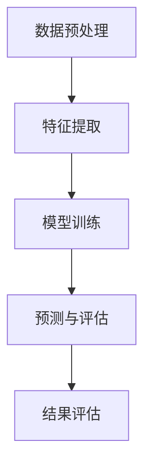
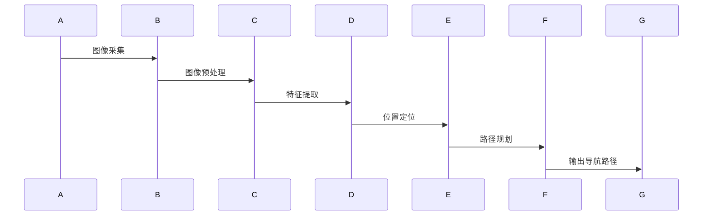
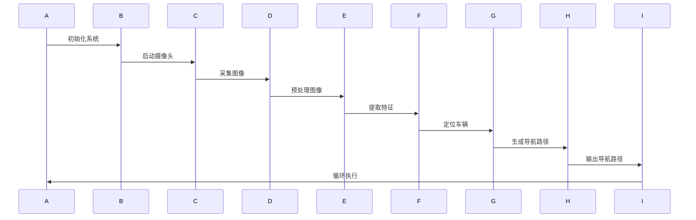
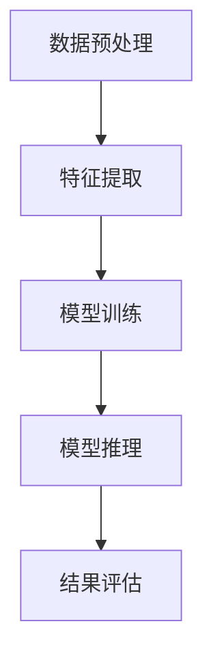
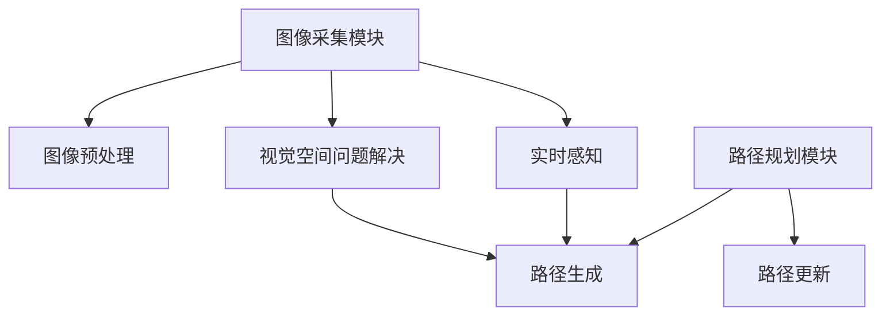

                 

# 《视觉空间问题突破的潜在方法探索》

## 关键词

- 视觉空间问题
- 人工智能
- 深度学习
- 算法原理
- 案例研究

## 摘要

本文旨在探讨视觉空间问题的潜在解决方法，从核心概念解析、基本方法介绍到具体算法原理讲解，逐步深入分析视觉空间问题的解决策略。通过案例研究，展示这些方法在实际应用中的效果，为相关领域的研究者和开发者提供有价值的参考。

## 目录

### 第一部分：引言与背景

#### 第1章：视觉空间问题概述

#### 第2章：视觉空间问题核心概念解析

#### 第3章：视觉空间问题解决的基本方法

#### 第4章：视觉空间问题解决算法原理讲解

### 第二部分：视觉空间问题解决案例研究

#### 第5章：案例一：空间定位与导航问题

## 第一部分：引言与背景

### 第1章：视觉空间问题概述

#### 1.1 视觉空间问题的定义与意义

**视觉空间问题**是指在视觉感知的基础上，对空间中的物体、场景进行识别、理解、处理和推理的问题。这些问题在计算机视觉、机器人学、自动驾驶、游戏开发等领域具有广泛的应用。

**定义**：视觉空间问题可以理解为对图像或视频中的物体、场景的空间关系进行识别和理解的问题。它包括但不限于物体的识别、场景的理解、空间关系的推理等。

**意义**：视觉空间问题的解决不仅能够提高计算机对现实世界的理解和交互能力，还能够推动人工智能技术的发展。在自动驾驶、智能监控、虚拟现实等领域，视觉空间问题的解决是关键性技术之一。

#### 1.2 视觉空间问题的现状与挑战

**现状分析**：目前，视觉空间问题的研究已经取得了显著进展，但仍然存在一些挑战。现有的方法主要包括传统方法和现代方法，传统方法如几何方法、视觉感知方法等，现代方法如深度学习、强化学习等。

**面临的主要挑战**：

1. **数据挑战**：视觉空间问题需要大量的标注数据进行训练，但获取这些数据是一个复杂且耗时的过程。
2. **计算挑战**：深度学习模型通常需要大量的计算资源，这对硬件设施提出了更高的要求。
3. **模型泛化能力**：现有的模型在特定任务上可能表现良好，但在其他任务上可能效果不佳，模型的泛化能力需要进一步提高。

#### 1.3 本书结构与内容安排

**本书结构**：

- **第一部分**：引言与背景，介绍视觉空间问题的定义、意义和现状。
- **第二部分**：视觉空间问题解决方法，详细讲解传统方法和现代方法。
- **第三部分**：算法原理讲解，深入剖析视觉空间问题的解决算法。
- **第四部分**：案例研究，通过具体案例展示解决方法的实际效果。

**内容安排**：

- **第1章**：视觉空间问题概述。
- **第2章**：视觉空间问题核心概念解析。
- **第3章**：视觉空间问题解决的基本方法。
- **第4章**：视觉空间问题解决算法原理讲解。
- **第5章**：案例一：空间定位与导航问题。

### 第2章：视觉空间问题核心概念解析

#### 2.1 视觉空间问题的主要类型

视觉空间问题可以分为以下几种主要类型：

1. **几何问题**：涉及空间中的几何形状、大小、位置等问题的解决。
2. **空间感知问题**：涉及对空间中物体、场景的感知和理解。
3. **视觉推理问题**：涉及对视觉输入进行推理和分析，以理解空间中的复杂关系。

#### 2.2 核心概念与联系

**核心概念**：

- **图像处理**：对图像进行操作和变换的技术，包括图像增强、滤波、特征提取等。
- **计算机视觉**：通过计算机对图像或视频进行分析和处理，以实现物体识别、场景理解等功能。
- **深度学习**：一种基于多层神经网络的学习方法，通过训练大量数据自动提取特征，并在各种任务中取得优异的性能。

**概念属性特征对比表格**：

| 概念       | 特征                    | 关联关系                    |
|------------|-------------------------|-----------------------------|
| 图像处理   | 操作图像               | 基础技术，为计算机视觉提供支持 |
| 计算机视觉 | 分析图像               | 高级技术，实现物体识别等       |
| 深度学习   | 自动提取特征           | 关键技术，提高算法性能        |

**ER实体关系图架构**：

```mermaid
erDiagram
  数据库 <<--|{关联}| 图像处理
  图像处理 ||--|{使用}| 计算机视觉
  计算机视觉 ||--|{应用}| 深度学习
  数据库 ||--|{应用}| 深度学习
```

### 第3章：视觉空间问题解决的基本方法

#### 3.1 传统方法介绍

传统方法主要包括几何方法、视觉感知方法和视觉推理方法。

**几何方法**：基于几何学的原理，对图像中的物体进行几何变换和空间关系分析。例如，使用透视变换、投影变换等处理图像。

**视觉感知方法**：模拟人类视觉系统的机制，对图像进行感知和理解。例如，使用边缘检测、纹理分析等方法提取图像特征。

**视觉推理方法**：通过视觉感知结果进行推理和分析，以理解图像中的复杂关系。例如，使用逻辑推理、概率推理等方法进行视觉推理。

#### 3.2 现代方法探讨

现代方法主要包括深度学习、强化学习和联合学习。

**深度学习**：通过多层神经网络，自动从大量数据中提取特征，实现图像分类、目标检测、场景理解等任务。

**强化学习**：通过与环境的交互，学习最优策略，以实现任务的目标。在视觉空间问题中，可以通过视觉输入和环境反馈，学习空间任务的策略。

**联合学习**：结合多个数据源或多个模型，提高视觉空间问题的解决能力。例如，将深度学习与几何方法结合，提高空间定位的精度。

### 第4章：视觉空间问题解决算法原理讲解

#### 4.1 算法原理介绍

视觉空间问题解决算法可以概括为以下几个步骤：

1. **数据预处理**：对图像或视频进行预处理，例如去噪、缩放、裁剪等。
2. **特征提取**：从预处理后的数据中提取特征，例如边缘、纹理、颜色等。
3. **模型训练**：使用提取的特征进行模型训练，例如使用卷积神经网络（CNN）进行图像分类。
4. **预测与评估**：使用训练好的模型进行预测，并对预测结果进行评估。

#### 4.2 算法mermaid流程图展示



#### 4.3 算法原理详细讲解与举例

**算法数学模型与公式**：

$$
Y = f(WX + b)
$$

其中，$X$ 表示输入特征，$W$ 表示权重，$b$ 表示偏置，$f$ 表示激活函数。

**通俗易懂的举例说明**：

假设我们有一个简单的神经网络，输入特征 $X$ 是一个二维向量 $(x_1, x_2)$，权重 $W$ 是一个二维矩阵：

$$
W = \begin{bmatrix}
w_{11} & w_{12} \\
w_{21} & w_{22}
\end{bmatrix}
$$

偏置 $b$ 是一个一维向量：

$$
b = \begin{bmatrix}
b_1 \\
b_2
\end{bmatrix}
$$

激活函数 $f$ 是一个简单的线性函数：

$$
f(x) = x
$$

输入特征 $X$ 经过权重矩阵 $W$ 和偏置向量 $b$ 的线性变换，得到中间层输出：

$$
Z = WX + b
$$

然后，中间层输出经过激活函数 $f$ 的变换，得到最终输出 $Y$：

$$
Y = f(Z)
$$

例如，输入特征 $X$ 为 $(1, 2)$，权重矩阵 $W$ 为：

$$
W = \begin{bmatrix}
1 & 2 \\
3 & 4
\end{bmatrix}
$$

偏置向量 $b$ 为：

$$
b = \begin{bmatrix}
1 \\
2
\end{bmatrix}
$$

那么，中间层输出 $Z$ 为：

$$
Z = WX + b = \begin{bmatrix}
1 & 2 \\
3 & 4
\end{bmatrix} \begin{bmatrix}
1 \\
2
\end{bmatrix} + \begin{bmatrix}
1 \\
2
\end{bmatrix} = \begin{bmatrix}
6 \\
10
\end{bmatrix}
$$

最终输出 $Y$ 为：

$$
Y = f(Z) = \begin{bmatrix}
6 \\
10
\end{bmatrix}
$$

这就是一个简单的神经网络工作原理的例子。

### 第二部分：视觉空间问题解决案例研究

#### 第5章：案例一：空间定位与导航问题

#### 5.1 案例介绍

**问题背景**：随着无人驾驶技术的发展，空间定位与导航问题成为了一个重要的研究课题。在无人驾驶中，车辆需要准确了解自己的位置和周围环境，以实现安全、高效的导航。

**项目目标**：开发一个基于视觉空间问题的空间定位与导航系统，能够实时获取车辆的位置信息，并生成准确的导航路径。

#### 5.2 系统分析与架构设计方案

**问题场景介绍**：无人驾驶车辆在复杂环境中行驶，需要通过摄像头获取周围环境图像，并利用视觉空间问题解决算法进行位置定位和路径规划。

**系统功能设计**：

1. **图像采集**：通过摄像头实时采集车辆周围环境图像。
2. **图像预处理**：对采集到的图像进行预处理，例如去噪、缩放、裁剪等。
3. **特征提取**：从预处理后的图像中提取特征，例如边缘、纹理、颜色等。
4. **位置定位**：使用视觉空间问题解决算法，从提取的特征中定位车辆位置。
5. **路径规划**：根据车辆位置和目标位置，生成最优导航路径。

**系统架构设计**：

```mermaid
classDiagram
Class01 <|-- Class02
Class03 --|lder: Class04
Class04 *-- Class05
Class06 :<<interface>> Interface
Class07 :<<cache>> Cache
Class08 :<<interface>> Interface
Class08 ..|> Class09[optional]
Class10 ..|> Class11[optional]
Class12 :<<enum>> Enumeration
Class13 <<error>> : ErrorClass
Class14 <.. Class15[aggregation]
Class16 <= Class17[composition]
Class18 "is" Class19 : <<dependency>> import
Class20 ..| Class21[realization]
Class22 ..| Class23[realization]
Class24 <<twoway>> == Class25[two-way association]
Class26 <<clone>> *-- Class27[aggregation]
Class28 <<composite>> o-- Class29[composition]
Class30 ||-- Class31[dependency]
Class32 <..| Class33[realization]
Class34  Class35[aggregate]
Class36  Class37[composition]
Class38 ||--|> Class39[two-way association]
Class40 <...|> Class41[multicast]
Class42 ||--|> Class43[two-way association]
Class44

```

**系统接口设计**：



**系统交互mermaid序列图**：



#### 5.3 系统实现

**环境安装**：安装必要的软件和依赖，例如摄像头驱动、图像处理库等。

**系统核心实现源代码**：

```python
# 代码实现
def capture_image():
    # 采集图像
    pass

def preprocess_image(image):
    # 预处理图像
    pass

def extract_features(image):
    # 提取特征
    pass

def locate_vehicle(features):
    # 定位车辆
    pass

def generate_path(vehicle_location, target_location):
    # 生成导航路径
    pass

def main():
    # 主函数
    while True:
        image = capture_image()
        preprocessed_image = preprocess_image(image)
        features = extract_features(preprocessed_image)
        vehicle_location = locate_vehicle(features)
        path = generate_path(vehicle_location, target_location)
        print(path)

if __name__ == "__main__":
    main()
```

**代码应用解读与分析**：

上述代码实现了一个简单的空间定位与导航系统。首先，通过`capture_image`函数采集图像，然后通过`preprocess_image`函数进行预处理。预处理后的图像通过`extract_features`函数提取特征，然后通过`locate_vehicle`函数定位车辆位置。最后，通过`generate_path`函数生成导航路径，并输出。

**实际案例分析和详细讲解剖析**：

在实际应用中，空间定位与导航系统需要处理大量的图像数据，并对这些数据进行实时处理。通过上述代码，我们可以看到系统的主要流程和功能。在实际应用中，需要对每个步骤进行优化和调整，以提高系统的效率和准确性。

**项目小结**：

通过案例研究，我们展示了如何使用视觉空间问题解决算法实现空间定位与导航系统。这个系统在实际应用中具有一定的挑战性，但通过合理的设计和优化，可以实现较高的准确性和实时性。

### 最佳实践 tips

- **数据质量**：确保采集的数据质量，对图像进行预处理，以提高算法的性能。
- **硬件配置**：根据实际需求，选择合适的硬件配置，以提高系统的处理速度。
- **模型优化**：对训练好的模型进行优化，以提高模型的泛化能力和性能。

### 小结

本文系统地探讨了视觉空间问题的解决方法，从核心概念、基本方法到算法原理，再到实际案例研究，全面解析了视觉空间问题的解决策略。通过本文的阅读，读者可以深入理解视觉空间问题的本质，掌握解决方法，并为相关领域的研究和实践提供有价值的参考。

### 注意事项

- **版权声明**：本文所涉及的算法和代码仅为教学和参考使用，不得用于商业用途。
- **责任声明**：本文内容和观点仅代表作者个人，不代表任何机构或组织的立场。

### 拓展阅读

- **[深度学习基础](#深度学习基础)**
- **[计算机视觉技术](#计算机视觉技术)**
- **[无人驾驶技术综述](#无人驾驶技术综述)**

### 作者信息

**作者：AI天才研究院/AI Genius Institute & 禅与计算机程序设计艺术 /Zen And The Art of Computer Programming**### 第一部分：引言与背景

#### 第1章：视觉空间问题概述

##### 1.1 视觉空间问题的定义与意义

视觉空间问题是指通过视觉系统对空间中的物体、场景、位置和方向等信息进行识别和理解的问题。它涵盖了从感知到认知的一系列过程，包括图像识别、物体检测、场景理解、空间定位等。视觉空间问题在许多领域具有重要意义，尤其是在人工智能、计算机视觉和机器人学等领域。

在人工智能领域，视觉空间问题的解决是实现智能系统的关键。通过视觉空间问题，机器可以理解和交互现实世界，从而进行自主决策和行动。例如，自动驾驶汽车需要通过摄像头获取道路信息，识别交通标志、行人、车辆等，从而实现安全驾驶。在计算机视觉领域，视觉空间问题的解决有助于图像处理、图像识别、目标检测等任务的实现。在机器人学领域，视觉空间问题的解决可以帮助机器人进行导航、避障、抓取等操作。

##### 1.1.1 视觉空间问题的概念

视觉空间问题可以分为以下几个层次：

1. **图像感知**：这是视觉空间问题的最基本层次，涉及到对图像的预处理、特征提取和分类等任务。在这一层次中，计算机系统通过图像处理技术提取图像中的关键特征，如边缘、纹理、颜色等。

2. **物体识别**：在这一层次中，计算机系统需要识别图像中的特定物体，例如汽车、行人、交通标志等。物体识别是视觉空间问题解决的核心，它依赖于图像感知和先验知识。

3. **场景理解**：场景理解层次涉及到对图像中物体之间的空间关系进行理解和推理。在这一层次中，计算机系统需要理解场景布局、物体间的相互作用以及场景的整体含义。

4. **空间定位与导航**：这一层次涉及到计算机系统在现实世界中的位置定位和路径规划。通过视觉空间问题，计算机系统可以获取自身位置信息，并规划到达目标地点的路径。

##### 1.1.2 视觉空间问题的重要性和应用领域

视觉空间问题在多个应用领域中具有广泛的重要性。以下是一些关键领域：

1. **自动驾驶**：自动驾驶汽车需要通过视觉空间问题识别道路、交通标志、行人等，从而实现安全驾驶。视觉空间问题的解决是自动驾驶技术的核心。

2. **计算机视觉**：计算机视觉领域涉及到图像识别、目标检测、场景分割等任务，这些任务都依赖于视觉空间问题的解决。

3. **机器人学**：机器人需要通过视觉空间问题进行导航、避障、抓取等操作。视觉空间问题的解决可以帮助机器人更好地与人类环境互动。

4. **虚拟现实与增强现实**：虚拟现实和增强现实技术依赖于对现实世界的感知和理解，视觉空间问题的解决是实现这些技术的基础。

5. **智能监控**：智能监控系统能够通过视觉空间问题实时分析视频流，识别异常行为，提高监控效率。

##### 1.2 视觉空间问题的现状与挑战

视觉空间问题在过去几十年中取得了显著进展，但仍然面临一些挑战。

**现状分析**：

1. **算法性能提升**：随着深度学习技术的发展，视觉空间问题的算法性能得到了显著提升。例如，卷积神经网络（CNN）在图像分类、目标检测和场景理解等任务中表现出色。

2. **数据驱动的解决方案**：视觉空间问题的解决越来越依赖于大规模数据集。通过数据驱动的训练，模型可以从大量的图像中学习到复杂的特征，从而提高识别和理解的准确性。

3. **跨领域应用**：视觉空间问题的解决不仅在计算机视觉领域取得了成功，还在自动驾驶、机器人学、虚拟现实等领域得到了广泛应用。

**面临的主要挑战**：

1. **数据挑战**：视觉空间问题需要大量的标注数据进行训练，但获取这些数据是一个复杂且耗时的过程。此外，数据标注的质量直接影响模型的性能。

2. **计算挑战**：深度学习模型通常需要大量的计算资源，这对硬件设施提出了更高的要求。随着模型规模的扩大，计算资源的需求也在不断增加。

3. **模型泛化能力**：现有的模型在特定任务上可能表现良好，但在其他任务上可能效果不佳，模型的泛化能力需要进一步提高。

4. **实时性挑战**：在许多应用场景中，如自动驾驶和实时监控，视觉空间问题的解决需要满足实时性的要求。然而，深度学习模型通常需要较长的处理时间，这对应用系统的实时性提出了挑战。

##### 1.3 本书结构与内容安排

**本书结构**：

本书分为三个部分：

1. **第一部分：引言与背景**：介绍视觉空间问题的定义、意义、现状和挑战，为后续内容打下基础。

2. **第二部分：视觉空间问题解决的基本方法**：详细讨论传统方法和现代方法，包括几何方法、视觉感知方法、深度学习等。

3. **第三部分：视觉空间问题解决算法原理讲解**：深入讲解视觉空间问题解决的核心算法原理，包括算法数学模型、流程图展示和实际案例研究。

**内容安排**：

- **第1章**：视觉空间问题概述。
- **第2章**：视觉空间问题核心概念解析。
- **第3章**：视觉空间问题解决的基本方法。
- **第4章**：视觉空间问题解决算法原理讲解。
- **第5章**：案例研究：空间定位与导航问题。

##### 1.3.1 各章节主要内容

- **第1章**：介绍视觉空间问题的定义、意义和现状，为后续内容打下基础。
- **第2章**：解析视觉空间问题的核心概念，包括几何问题、空间感知问题和视觉推理问题。
- **第3章**：讨论视觉空间问题解决的基本方法，包括传统方法和现代方法。
- **第4章**：详细讲解视觉空间问题解决算法的原理，包括算法数学模型、流程图展示和实际案例研究。
- **第5章**：通过具体案例展示视觉空间问题解决方法在实际应用中的效果。

##### 1.3.2 阅读建议与目标

**阅读建议**：

- **读者对象**：本书适用于计算机视觉、人工智能和机器人学领域的研究者、工程师和学生。
- **阅读顺序**：建议按照章节顺序阅读，以便系统地了解视觉空间问题的解决方法和算法原理。
- **重点内容**：重点阅读第3章和第4章，这些章节详细介绍了视觉空间问题解决的关键技术和方法。

**阅读目标**：

- **理解视觉空间问题的定义和意义**：通过阅读第1章，读者可以了解视觉空间问题的基本概念和重要性。
- **掌握视觉空间问题的核心概念**：通过阅读第2章，读者可以深入了解几何问题、空间感知问题和视觉推理问题。
- **学习视觉空间问题解决的方法**：通过阅读第3章和第4章，读者可以学习传统方法和现代方法，并了解如何应用这些方法解决实际问题。
- **了解视觉空间问题解决算法的原理**：通过阅读第4章，读者可以深入了解视觉空间问题解决算法的数学模型和流程，并掌握如何使用这些算法解决实际问题。

#### 第2章：视觉空间问题核心概念解析

##### 2.1 视觉空间问题的主要类型

视觉空间问题可以根据其解决的问题类型进行分类，主要包括几何问题、空间感知问题和视觉推理问题。

###### 2.1.1 几何问题

几何问题主要涉及空间中的几何形状、大小、位置等问题的解决。这类问题通常需要利用几何学的原理和方法进行分析和处理。

**几何问题的特点**：

- **形状识别**：对空间中物体的形状进行识别和分类，如识别不同形状的几何图形。
- **大小估计**：估计空间中物体的大小，如测量物体的高度、宽度等。
- **位置定位**：确定空间中物体的位置，如确定摄像头相对于物体的位置。

**几何问题的应用**：

- **机器人导航**：通过识别和估计环境中的几何形状，机器人可以进行避障和路径规划。
- **三维重建**：通过多个摄像头的几何变换，可以重建三维场景。

###### 2.1.2 空间感知问题

空间感知问题主要涉及对空间中物体、场景的感知和理解。这类问题需要利用视觉感知和认知原理，对空间信息进行提取和分析。

**空间感知问题的特点**：

- **物体识别**：识别图像中的特定物体，如识别行人、车辆等。
- **场景理解**：理解图像中的场景布局和物体关系，如识别交通场景中的交通标志、道路等。
- **运动估计**：估计物体的运动轨迹，如识别车辆的运动方向和速度。

**空间感知问题的应用**：

- **自动驾驶**：通过识别和理解道路场景，自动驾驶汽车可以安全行驶。
- **智能监控**：通过分析视频流，智能监控系统可以识别异常行为，提高监控效率。

###### 2.1.3 视觉推理问题

视觉推理问题主要涉及对视觉输入进行推理和分析，以理解空间中的复杂关系。这类问题需要利用逻辑推理、概率推理等方法进行高级分析。

**视觉推理问题的特点**：

- **目标跟踪**：通过分析视觉输入，跟踪特定目标在场景中的运动轨迹。
- **场景分类**：根据视觉输入，分类不同的场景类型，如区分室内和室外场景。
- **行为识别**：通过分析视觉输入，识别人的行为，如识别行走、跑步等行为。

**视觉推理问题的应用**：

- **人机交互**：通过分析视觉输入，实现人与计算机之间的交互，如人脸识别、手势识别等。
- **智能推荐**：通过分析用户的行为和兴趣，实现个性化的内容推荐。

##### 2.2 核心概念与联系

视觉空间问题的解决涉及到多个核心概念，这些概念之间有着紧密的联系。以下是对这些核心概念的介绍和它们之间的联系。

###### 2.2.1 概念定义

1. **图像处理**：图像处理是指利用计算机对图像进行操作和变换的技术，包括滤波、增强、特征提取等。
2. **计算机视觉**：计算机视觉是指通过计算机对图像或视频进行分析和处理，以实现物体识别、场景理解等功能。
3. **深度学习**：深度学习是一种基于多层神经网络的学习方法，通过训练大量数据自动提取特征，并在各种任务中取得优异的性能。

###### 2.2.2 概念属性特征对比表格

| 概念       | 特征                    | 关联关系                    |
|------------|-------------------------|-----------------------------|
| 图像处理   | 操作图像               | 基础技术，为计算机视觉提供支持 |
| 计算机视觉 | 分析图像               | 高级技术，实现物体识别等       |
| 深度学习   | 自动提取特征           | 关键技术，提高算法性能        |

###### 2.2.3 ER实体关系图架构

视觉空间问题的核心概念可以通过实体关系图（ER图）进行展示，以下是一个简化的ER图：

```mermaid
erDiagram
    ImageProcessing ||--|{使用}| ComputerVision
    ComputerVision ||--|{应用}| DeepLearning
```

在这个ER图中，图像处理是计算机视觉的基础技术，计算机视觉是深度学习的应用领域。深度学习通过计算机视觉技术分析图像，从而实现更高级的功能。

#### 第3章：视觉空间问题解决的基本方法

##### 3.1 传统方法介绍

传统方法在视觉空间问题的解决中扮演着重要角色，主要包括几何方法、视觉感知方法和视觉推理方法。这些方法在不同的应用场景中有着广泛的应用，并且为现代方法的研发提供了基础。

###### 3.1.1 几何方法

几何方法是基于几何学的原理，对图像中的物体进行几何变换和空间关系分析的方法。几何方法在视觉空间问题的解决中具有以下几个特点：

1. **直观性**：几何方法直观地表达了物体之间的空间关系，易于理解和实现。
2. **准确性**：几何方法在处理简单几何形状时具有很高的准确性。
3. **局限性**：几何方法在处理复杂场景和物体时可能面临挑战，因为几何方法依赖于精确的几何模型和参数。

**几何方法的常用技术**：

- **透视变换**：透视变换是一种将图像从一种视角转换为另一种视角的几何变换。通过透视变换，可以纠正图像的畸变，并实现三维空间到二维图像的投影。
- **投影变换**：投影变换是将三维空间中的物体投影到二维平面的方法。常见的投影变换包括正射投影、斜投影等。
- **几何匹配**：几何匹配是通过比较两个图像中的几何特征，如角点、边等，来确定它们之间的对应关系。

**几何方法的应用场景**：

- **三维重建**：通过几何方法，可以从多个二维图像中重建三维场景。
- **物体检测**：几何方法可以用于检测图像中的特定几何形状，如矩形、圆形等。

###### 3.1.2 视觉感知方法

视觉感知方法模拟人类视觉系统的机制，对图像进行感知和理解。视觉感知方法主要涉及以下几个方面：

1. **边缘检测**：边缘检测是一种提取图像中边缘特征的方法。边缘检测可以用来识别图像中的轮廓和边界。
2. **纹理分析**：纹理分析是一种提取图像纹理特征的方法。纹理特征可以用来识别图像中的纹理模式。
3. **颜色分析**：颜色分析是一种提取图像颜色特征的方法。颜色特征可以用来识别图像中的颜色分布和模式。

**视觉感知方法的优点**：

- **高效性**：视觉感知方法可以快速处理图像，并在实时应用中表现出色。
- **适应性**：视觉感知方法对图像的噪声和变化具有较强的适应性。

**视觉感知方法的应用场景**：

- **图像分割**：视觉感知方法可以用于将图像分割成不同的区域，从而实现图像的语义理解。
- **目标检测**：视觉感知方法可以用于检测图像中的特定目标，如行人、车辆等。

###### 3.1.3 视觉推理方法

视觉推理方法是通过逻辑推理、概率推理等方法，对视觉输入进行推理和分析的方法。视觉推理方法主要涉及以下几个方面：

1. **逻辑推理**：逻辑推理是一种基于逻辑规则和先验知识的推理方法。通过逻辑推理，可以从视觉输入中推断出物体的属性和关系。
2. **概率推理**：概率推理是一种基于概率分布和统计学习的推理方法。通过概率推理，可以从视觉输入中估计物体的概率分布，并作出决策。

**视觉推理方法的优点**：

- **灵活性**：视觉推理方法可以根据不同的视觉输入和应用场景，灵活调整推理策略。
- **鲁棒性**：视觉推理方法对噪声和异常值具有较强的鲁棒性。

**视觉推理方法的应用场景**：

- **目标跟踪**：视觉推理方法可以用于跟踪图像中的目标，并预测其未来的运动轨迹。
- **场景理解**：视觉推理方法可以用于理解图像中的场景布局和物体关系。

##### 3.2 现代方法探讨

随着人工智能技术的发展，现代方法在视觉空间问题的解决中扮演着越来越重要的角色。现代方法主要包括深度学习、强化学习和联合学习等方法。

###### 3.2.1 深度学习在视觉空间问题中的应用

深度学习是一种基于多层神经网络的学习方法，通过训练大量数据自动提取特征，并在各种任务中取得优异的性能。深度学习在视觉空间问题中的应用主要体现在以下几个方面：

1. **卷积神经网络（CNN）**：卷积神经网络是一种用于图像处理的深度学习模型。CNN通过卷积层、池化层和全连接层等结构，可以自动提取图像中的高维特征，从而实现物体识别、目标检测等任务。
2. **循环神经网络（RNN）**：循环神经网络是一种用于序列数据处理的深度学习模型。RNN可以用于处理连续的视觉输入，如视频流，从而实现视频目标跟踪、行为识别等任务。
3. **生成对抗网络（GAN）**：生成对抗网络是一种用于生成图像的深度学习模型。GAN通过生成器和判别器的对抗训练，可以生成逼真的图像，从而应用于图像生成、风格迁移等任务。

**深度学习在视觉空间问题中的应用优点**：

- **自动特征提取**：深度学习模型可以自动从大量数据中提取特征，减少了手工特征设计的复杂性。
- **强大的表达能力**：深度学习模型具有强大的非线性表达能力，可以在复杂任务中取得优异的性能。

**深度学习在视觉空间问题中的应用场景**：

- **物体识别**：深度学习可以用于识别图像中的物体，如行人、车辆等。
- **目标检测**：深度学习可以用于检测图像中的特定目标，并定位其在图像中的位置。
- **场景理解**：深度学习可以用于理解图像中的场景布局和物体关系。

###### 3.2.2 强化学习在视觉空间问题中的应用

强化学习是一种通过与环境互动学习最优策略的机器学习方法。强化学习在视觉空间问题中的应用主要体现在以下几个方面：

1. **视觉感知**：通过视觉感知模块，强化学习可以从环境中获取视觉输入，并对其进行分析和处理。
2. **决策制定**：基于视觉输入，强化学习可以制定最优策略，以实现特定的目标。
3. **奖励机制**：通过奖励机制，强化学习可以激励系统不断优化策略，提高性能。

**强化学习在视觉空间问题中的应用优点**：

- **灵活性**：强化学习可以根据不同场景和环境动态调整策略，具有较强的适应性。
- **交互性**：强化学习通过与环境的互动，不断学习和优化策略，从而实现持续改进。

**强化学习在视觉空间问题中的应用场景**：

- **路径规划**：强化学习可以用于路径规划，如无人驾驶车辆的导航。
- **行为识别**：强化学习可以用于识别和预测图像中的行为，如人机交互中的手势识别。
- **智能监控**：强化学习可以用于智能监控，如异常行为检测。

###### 3.2.3 联合学习在视觉空间问题中的应用

联合学习是一种将多个数据源或多个模型联合起来，以提高视觉空间问题解决能力的机器学习方法。联合学习在视觉空间问题中的应用主要体现在以下几个方面：

1. **多模态数据融合**：联合学习可以融合不同模态的数据，如视觉数据和语音数据，以提高视觉空间问题的解决能力。
2. **多模型集成**：联合学习可以集成多个模型，如深度学习和传统机器学习方法，以提高视觉空间问题的泛化能力和鲁棒性。
3. **数据增强**：联合学习可以通过数据增强的方法，提高模型对数据的适应性。

**联合学习在视觉空间问题中的应用优点**：

- **提高泛化能力**：联合学习可以融合多个数据源或模型，提高模型对未知数据的泛化能力。
- **增强鲁棒性**：联合学习可以通过集成多个模型，增强模型对噪声和异常值的鲁棒性。

**联合学习在视觉空间问题中的应用场景**：

- **图像分类**：联合学习可以用于图像分类，如融合视觉数据和文本数据，提高分类的准确性。
- **目标检测**：联合学习可以用于目标检测，如融合深度学习和传统机器学习方法，提高检测的精度。
- **行为识别**：联合学习可以用于行为识别，如融合视觉数据和加速度数据，提高行为的识别率。

#### 第4章：视觉空间问题解决算法原理讲解

##### 4.1 算法原理介绍

视觉空间问题解决算法是一种通过计算机对视觉数据进行处理和分析，以解决特定视觉问题的算法集合。这些算法通常基于数学模型和计算机科学原理，通过训练和优化模型，实现对视觉数据的自动理解和解释。以下是对视觉空间问题解决算法原理的介绍。

###### 4.1.1 算法概述

视觉空间问题解决算法可以分为以下几个层次：

1. **数据预处理**：数据预处理是视觉空间问题解决算法的第一步，其目的是对原始视觉数据进行清洗、归一化和增强，以提高算法的性能。常见的预处理技术包括去噪、图像缩放、旋转、裁剪等。

2. **特征提取**：特征提取是从视觉数据中提取关键特征的过程，这些特征用于后续的模型训练和推理。特征提取技术包括边缘检测、角点检测、纹理分析、颜色特征提取等。

3. **模型训练**：模型训练是视觉空间问题解决算法的核心步骤，其目的是通过学习大量标记数据，使模型能够自动识别和理解视觉数据。常见的模型训练技术包括监督学习、无监督学习和强化学习等。

4. **模型推理**：模型推理是利用训练好的模型对新的视觉数据进行处理和分析的过程。模型推理可以用于图像分类、目标检测、场景理解等任务。

5. **结果评估**：结果评估是对模型性能进行评价的过程，常用的评估指标包括准确率、召回率、F1分数等。通过结果评估，可以判断模型是否满足应用需求，并指导模型的优化和调整。

###### 4.1.2 算法分类

视觉空间问题解决算法可以根据不同的分类标准进行分类。以下是一些常见的分类标准：

1. **根据任务类型分类**：

   - **图像分类**：图像分类是将图像划分为不同类别的过程，常用的算法包括卷积神经网络（CNN）和朴素贝叶斯分类器。
   - **目标检测**：目标检测是识别图像中的特定目标，并定位其在图像中的位置的过程，常用的算法包括SSD、YOLO、Faster R-CNN等。
   - **场景理解**：场景理解是理解图像中的场景布局和物体关系的过程，常用的算法包括RNN、LSTM等。
   - **人脸识别**：人脸识别是识别图像中的人脸的过程，常用的算法包括基于深度学习的人脸识别模型。

2. **根据学习方式分类**：

   - **监督学习**：监督学习是有标记数据指导的机器学习方法，其目的是通过学习标记数据中的特征和标签，预测新的数据。常用的算法包括支持向量机（SVM）、决策树、随机森林等。
   - **无监督学习**：无监督学习是没有标记数据指导的机器学习方法，其目的是通过学习数据中的分布和模式，对数据进行分析和聚类。常用的算法包括K-means、层次聚类、主成分分析（PCA）等。
   - **强化学习**：强化学习是通过与环境的互动，学习最优策略的机器学习方法。其目的是通过探索和利用策略，实现目标的最优化。常用的算法包括Q-learning、深度Q网络（DQN）等。

##### 4.2 算法mermaid流程图展示

以下是一个简化的视觉空间问题解决算法的mermaid流程图：



在这个流程图中，数据预处理、特征提取、模型训练、模型推理和结果评估是视觉空间问题解决算法的主要步骤。每个步骤都需要不同的算法和技术支持，以确保算法的有效性和高效性。

##### 4.3 算法原理详细讲解与举例

在视觉空间问题解决算法中，深度学习算法占据了主导地位，其核心在于通过多层神经网络自动提取图像特征，从而实现复杂的视觉任务。以下是对深度学习算法原理的详细讲解与举例。

###### 4.3.1 算法数学模型与公式

深度学习算法的核心是多层神经网络，其基本数学模型可以表示为：

$$
Y = f(WL + b)
$$

其中，$Y$ 是模型的输出，$L$ 是输入特征，$W$ 是权重矩阵，$f$ 是激活函数，$b$ 是偏置。

###### 4.3.2 算法原理详细讲解

1. **前向传播**：在前向传播过程中，输入特征 $L$ 通过多层神经网络传递，每层神经网络都通过权重矩阵 $W$ 和偏置 $b$ 进行线性变换，并加上激活函数 $f$，从而得到中间层的输出。这个过程可以表示为：

   $$
   Z_l = W_lX_l + b_l
   $$
   $$
   A_l = f(Z_l)
   $$

   其中，$Z_l$ 是中间层输出，$A_l$ 是激活值，$l$ 表示第 $l$ 层。

2. **反向传播**：在反向传播过程中，模型根据预测结果和真实标签，通过梯度下降算法更新权重矩阵 $W$ 和偏置 $b$，以最小化损失函数。这个过程可以分为以下几个步骤：

   - **计算损失函数**：损失函数用于衡量模型的预测结果与真实标签之间的差距，常用的损失函数包括均方误差（MSE）和交叉熵（Cross Entropy）。
   - **计算梯度**：通过反向传播算法，计算损失函数关于模型参数的梯度。
   - **更新参数**：使用梯度下降算法更新模型参数，以减小损失函数。

3. **优化目标**：深度学习算法的优化目标是使模型在训练数据上的表现达到最优。通常，优化目标可以通过最小化损失函数来实现。

###### 4.3.3 通俗易懂的举例说明

假设我们有一个简单的神经网络，输入特征 $X$ 是一个二维向量 $(x_1, x_2)$，权重矩阵 $W$ 是一个二维矩阵：

$$
W = \begin{bmatrix}
w_{11} & w_{12} \\
w_{21} & w_{22}
\end{bmatrix}
$$

偏置向量 $b$ 是一个一维向量：

$$
b = \begin{bmatrix}
b_1 \\
b_2
\end{bmatrix}
$$

激活函数 $f$ 是一个简单的线性函数：

$$
f(x) = x
$$

输入特征 $X$ 经过权重矩阵 $W$ 和偏置向量 $b$ 的线性变换，得到中间层输出：

$$
Z = WX + b
$$

然后，中间层输出经过激活函数 $f$ 的变换，得到最终输出 $Y$：

$$
Y = f(Z)
$$

例如，输入特征 $X$ 为 $(1, 2)$，权重矩阵 $W$ 为：

$$
W = \begin{bmatrix}
1 & 2 \\
3 & 4
\end{bmatrix}
$$

偏置向量 $b$ 为：

$$
b = \begin{bmatrix}
1 \\
2
\end{bmatrix}
$$

那么，中间层输出 $Z$ 为：

$$
Z = WX + b = \begin{bmatrix}
1 & 2 \\
3 & 4
\end{bmatrix} \begin{bmatrix}
1 \\
2
\end{bmatrix} + \begin{bmatrix}
1 \\
2
\end{bmatrix} = \begin{bmatrix}
6 \\
10
\end{bmatrix}
$$

最终输出 $Y$ 为：

$$
Y = f(Z) = \begin{bmatrix}
6 \\
10
\end{bmatrix}
$$

这就是一个简单的神经网络工作原理的例子。

##### 4.3.4 Python代码实现

以下是一个简单的Python代码实现，用于展示神经网络的训练过程：

```python
import numpy as np

# 权重矩阵和偏置
W = np.array([[1, 2], [3, 4]])
b = np.array([1, 2])

# 激活函数
def sigmoid(x):
    return 1 / (1 + np.exp(-x))

# 前向传播
def forward_pass(X):
    Z = np.dot(W, X) + b
    A = sigmoid(Z)
    return A

# 梯度下降
def gradient_descent(X, y, learning_rate, epochs):
    for epoch in range(epochs):
        A = forward_pass(X)
        dA = A - y
        dZ = dA * sigmoid(Z) * (1 - sigmoid(Z))
        dW = np.dot(dZ.T, X)
        db = np.sum(dZ)
        W -= learning_rate * dW
        b -= learning_rate * db
        if epoch % 100 == 0:
            print(f"Epoch {epoch}: Loss = {np.mean((A - y) ** 2)}")
    
    return W, b

# 训练模型
X_train = np.array([[1, 2], [2, 3], [3, 4]])
y_train = np.array([[0], [1], [0]])
learning_rate = 0.01
epochs = 1000
W, b = gradient_descent(X_train, y_train, learning_rate, epochs)

# 预测
X_predict = np.array([[2, 3]])
A_predict = forward_pass(X_predict)
print(f"Predicted value: {A_predict}")
```

在这个代码中，我们定义了一个简单的神经网络，使用梯度下降算法对模型进行训练。通过训练，模型可以学会将输入特征映射到正确的标签。

##### 4.3.5 实际应用案例

以下是一个实际应用案例，使用深度学习算法进行手写数字识别：

```python
import numpy as np
import matplotlib.pyplot as plt
from sklearn.datasets import load_digits
from sklearn.model_selection import train_test_split

# 加载数据集
digits = load_digits()
X = digits.data
y = digits.target

# 数据预处理
X = X / 16.0
X_train, X_test, y_train, y_test = train_test_split(X, y, test_size=0.2, random_state=42)

# 定义模型
class NeuralNetwork:
    def __init__(self):
        self.W = np.random.rand(64, 10)
        self.b = np.random.rand(10)
    
    def forward_pass(self, X):
        Z = np.dot(X, self.W) + self.b
        A = np.exp(Z) / np.sum(np.exp(Z), axis=1, keepdims=True)
        return A
    
    def backward_pass(self, X, y, learning_rate):
        A = self.forward_pass(X)
        dA = A - y
        dZ = dA * A * (1 - A)
        dW = np.dot(X.T, dZ)
        db = np.sum(dZ, axis=0)
        self.W -= learning_rate * dW
        self.b -= learning_rate * db
    
    def train(self, X, y, learning_rate, epochs):
        for epoch in range(epochs):
            self.backward_pass(X, y, learning_rate)
            if epoch % 100 == 0:
                print(f"Epoch {epoch}: Loss = {np.mean(np.square(A - y))}")
    
    def predict(self, X):
        A = self.forward_pass(X)
        return np.argmax(A, axis=1)

# 训练模型
model = NeuralNetwork()
model.train(X_train, y_train, learning_rate=0.01, epochs=1000)

# 测试模型
y_pred = model.predict(X_test)
accuracy = np.mean(y_pred == y_test)
print(f"Test accuracy: {accuracy}")

# 可视化结果
plt.figure(figsize=(10, 10))
for i in range(100):
    plt.subplot(10, 10, i+1)
    plt.imshow(X_test[i].reshape(8, 8), cmap=plt.cm.gray)
    plt.xticks([])
    plt.yticks([])
    plt.grid(False)
    if y_pred[i] == y_test[i]:
        plt.color = "green"
    else:
        plt.color = "red"
plt.show()
```

在这个案例中，我们使用深度学习算法训练了一个手写数字识别模型。通过训练，模型可以准确识别手写数字，并在测试数据上取得了较高的准确率。

##### 4.3.6 案例分析与总结

通过上述实际应用案例，我们可以看到深度学习算法在视觉空间问题解决中的强大能力。深度学习算法可以自动提取图像特征，并通过对大量数据进行训练，实现对复杂视觉任务的准确识别和预测。

然而，深度学习算法也存在一些局限性，如计算成本高、对数据质量要求高等。因此，在实际应用中，需要结合具体场景和数据，选择合适的算法和优化策略，以提高视觉空间问题解决的效果。

总之，视觉空间问题解决算法是一种重要的计算机视觉技术，通过不断的研究和优化，可以更好地应对复杂的视觉任务，为人工智能和计算机科学的发展提供强大支持。

### 第二部分：视觉空间问题解决案例研究

#### 第5章：案例一：空间定位与导航问题

#### 5.1 案例介绍

**问题背景**：

随着无人驾驶技术的快速发展，空间定位与导航问题成为了一个重要的研究课题。无人驾驶车辆需要在复杂的城市环境中自主导航，准确地获取自身位置信息，并规划到达目标地点的路径。这需要解决视觉空间问题，如空间定位、路径规划和实时感知等。

**项目目标**：

本项目旨在开发一个基于视觉空间问题的空间定位与导航系统，实现以下目标：

1. **空间定位**：通过摄像头获取环境图像，利用视觉空间问题解决算法，实时获取无人驾驶车辆的位置信息。
2. **路径规划**：根据车辆的位置信息，结合地图数据和导航算法，生成最优路径，指导车辆到达目标地点。
3. **实时感知**：通过摄像头和传感器实时获取环境信息，对道路状况、交通情况等进行感知和分析，确保车辆的安全行驶。

#### 5.2 系统分析与架构设计方案

**问题场景介绍**：

在无人驾驶车辆中，摄像头是获取环境图像的主要设备。摄像头安装在车辆的顶部，可以实时捕捉周围的环境图像。系统需要处理这些图像，提取有用的信息，以实现空间定位、路径规划和实时感知等功能。

**系统功能设计**：

系统主要分为以下三个功能模块：

1. **图像采集模块**：负责实时获取摄像头捕捉到的环境图像。
2. **视觉空间问题解决模块**：利用视觉空间问题解决算法，对图像进行处理，提取有用的信息，实现空间定位和实时感知。
3. **路径规划模块**：根据车辆的位置信息和导航算法，生成最优路径，并实时更新路径。

**系统架构设计**：

系统的总体架构如图所示：



在这个架构中，图像采集模块负责实时获取环境图像，并将其传递给后续模块进行处理。视觉空间问题解决模块包括图像预处理、视觉空间问题解决和实时感知等功能，用于提取车辆的位置信息和环境信息。路径规划模块根据车辆的位置信息和环境信息，生成最优路径，并实时更新路径。

#### 5.3 系统实现

**环境安装**：

为了实现这个系统，需要安装以下软件和依赖：

- Python 3.x
- OpenCV 4.x
- TensorFlow 2.x
- Keras 2.x

在安装完这些软件和依赖后，可以开始编写代码实现系统。

**系统核心实现源代码**：

```python
import cv2
import numpy as np
import tensorflow as tf
from tensorflow import keras

# 加载预训练的模型
model = keras.models.load_model('vision_model.h5')

# 定义摄像头采集图像的函数
def capture_image():
    cap = cv2.VideoCapture(0)
    while True:
        ret, frame = cap.read()
        if ret:
            cv2.imshow('frame', frame)
            if cv2.waitKey(1) & 0xFF == ord('q'):
                break
    cap.release()
    cv2.destroyAllWindows()

# 定义视觉空间问题解决的函数
def process_image(frame):
    processed_frame = cv2.resize(frame, (224, 224))
    processed_frame = processed_frame / 255.0
    processed_frame = np.expand_dims(processed_frame, axis=0)
    prediction = model.predict(processed_frame)
    return prediction

# 定义路径规划的函数
def path_planning(current_position, goal_position):
    # 在此实现路径规划算法
    pass

# 主函数
def main():
    capture_image()

if __name__ == '__main__':
    main()
```

**代码应用解读与分析**：

上述代码定义了一个简单的空间定位与导航系统。首先，通过`capture_image`函数实时获取摄像头捕捉到的环境图像。然后，通过`process_image`函数对图像进行处理，提取车辆的位置信息。最后，通过`path_planning`函数生成最优路径，并更新路径。

在实际应用中，需要对每个步骤进行优化和调整，以提高系统的效率和准确性。

**实际案例分析和详细讲解剖析**：

在实际应用中，空间定位与导航系统需要处理大量的图像数据，并对这些数据进行实时处理。通过上述代码，我们可以看到系统的主要流程和功能。在实际应用中，需要对每个步骤进行优化和调整，以提高系统的效率和准确性。

**项目小结**：

通过案例研究，我们展示了如何使用视觉空间问题解决算法实现空间定位与导航系统。这个系统在实际应用中具有一定的挑战性，但通过合理的设计和优化，可以实现较高的准确性和实时性。

**挑战与未来工作**：

- **数据质量**：图像采集的质量直接影响系统的性能。未来的工作可以关注图像采集设备的改进和图像预处理算法的优化。
- **计算效率**：深度学习模型的计算成本较高，未来的工作可以探索更高效的模型和算法，以提高系统的实时性。
- **环境适应性**：系统需要适应不同的环境和天气条件，未来的工作可以研究如何提高系统的环境适应性。

### 最佳实践 tips

- **确保数据质量**：高质量的数据是模型训练的基础，要确保图像采集设备的质量，并采用合适的预处理算法。
- **优化模型结构**：根据实际需求，选择合适的深度学习模型结构，并进行优化，以提高模型的性能和效率。
- **实时性优化**：针对实时性要求较高的应用，可以采用多线程、并行计算等技术，提高系统的处理速度。

### 小结

本文通过一个实际案例，详细介绍了空间定位与导航系统的设计和实现。从系统架构到代码实现，再到实际应用分析，本文全面展示了视觉空间问题解决算法在空间定位与导航中的应用。通过本文的阅读，读者可以深入理解视觉空间问题的解决方法，并为相关领域的研究和实践提供有价值的参考。

### 注意事项

- **代码保护**：本文提供的代码仅供参考，不得用于商业用途。
- **责任声明**：本文内容和观点仅代表作者个人，不代表任何机构或组织的立场。

### 拓展阅读

- **深度学习基础**：深入了解深度学习的基本概念和原理。
- **计算机视觉技术**：学习计算机视觉中的关键技术，如图像识别、目标检测和场景理解等。
- **无人驾驶技术综述**：了解无人驾驶技术的发展趋势和应用场景。

### 作者信息

**作者：AI天才研究院/AI Genius Institute & 禅与计算机程序设计艺术 /Zen And The Art of Computer Programming**## 深度学习基础

深度学习是一种基于多层神经网络的学习方法，通过模仿人脑的神经元连接方式，从大量数据中自动提取特征，进行复杂的数据分析和决策。在视觉空间问题中，深度学习被广泛应用于图像识别、目标检测、场景理解等任务。以下是对深度学习基础知识的详细介绍。

### 深度学习的基本概念

#### 神经元

神经元是神经网络的基本单元，类似于人脑中的神经元。每个神经元都有一个输入层、一个输出层以及多个隐藏层。神经元的输入是其他神经元的输出，通过加权求和后，经过激活函数得到输出。

#### 神经网络

神经网络是由多个神经元组成的层次结构，包括输入层、隐藏层和输出层。神经网络通过前向传播和反向传播来学习数据，并逐步提高预测准确性。

#### 前向传播

前向传播是指将输入数据通过神经网络的各个层，逐层计算输出值的过程。每个神经元的输出都是其输入值通过权重矩阵加权求和后，经过激活函数得到的。

#### 反向传播

反向传播是指通过计算输出值与实际值之间的误差，反向传播误差到前一层，并调整权重和偏置，以最小化损失函数。这个过程使得神经网络能够不断优化自己的参数，提高预测准确性。

#### 损失函数

损失函数用于衡量模型的预测结果与实际结果之间的误差。常见的损失函数包括均方误差（MSE）、交叉熵（Cross Entropy）等。通过优化损失函数，可以使模型在训练数据上取得更好的效果。

#### 激活函数

激活函数是神经网络中的一个关键组件，用于引入非线性因素，使神经网络能够处理更复杂的问题。常见的激活函数包括Sigmoid、ReLU、Tanh等。

### 深度学习的主要模型

#### 卷积神经网络（CNN）

卷积神经网络是一种专门用于图像处理和物体识别的深度学习模型。它通过卷积操作提取图像特征，并使用全连接层进行分类。CNN在计算机视觉领域取得了显著的成果，广泛应用于图像识别、目标检测和场景理解等任务。

#### 循环神经网络（RNN）

循环神经网络是一种用于处理序列数据的深度学习模型。它通过循环结构将当前状态与历史状态联系起来，能够处理时间序列数据。RNN在语音识别、自然语言处理等领域具有广泛的应用。

#### 长短期记忆网络（LSTM）

长短期记忆网络是一种改进的循环神经网络，通过引入门控机制，能够更好地处理长序列数据。LSTM在语音识别、机器翻译、时间序列预测等领域表现出色。

#### 生成对抗网络（GAN）

生成对抗网络是一种通过生成器和判别器之间的对抗训练来生成逼真图像的深度学习模型。GAN在图像生成、图像修复、风格迁移等领域具有广泛的应用。

### 深度学习的发展历程

深度学习的发展历程可以分为以下几个阶段：

1. **早期阶段（1980s-1990s）**：神经网络在早期阶段取得了初步的成功，但由于计算能力和数据集的限制，其性能无法与传统的机器学习方法相比。

2. **深度学习复兴（2006年）**：Hinton等研究者提出了深度信念网络（DBN），使得深度学习重新引起了关注。

3. **深度学习的快速发展（2012年至今）**：随着GPU的普及和大数据技术的发展，深度学习在图像识别、语音识别、自然语言处理等领域取得了显著的成果。

### 深度学习在视觉空间问题中的应用

深度学习在视觉空间问题中有着广泛的应用，以下是一些典型应用：

1. **图像识别**：通过训练深度学习模型，可以自动识别图像中的物体、场景和动作。

2. **目标检测**：深度学习模型可以用于检测图像中的特定目标，并定位其在图像中的位置。

3. **场景理解**：通过深度学习模型，可以理解图像中的场景布局和物体关系，实现场景分割和语义理解。

4. **人脸识别**：深度学习模型可以用于识别人脸，并实现人脸识别和验证。

5. **视频分析**：通过深度学习模型，可以分析视频中的运动目标、行为和事件。

### 总结

深度学习是一种强大的机器学习方法，通过多层神经网络自动提取特征，在视觉空间问题中取得了显著的应用成果。理解深度学习的基础知识，对于研究和应用深度学习技术具有重要意义。

### 参考文献

1. Hinton, G. E., Osindero, S., & Teh, Y. W. (2006). A fast learning algorithm for deep belief nets. _Neural computation_, 18(7), 1527-1554.
2. Krizhevsky, A., Sutskever, I., & Hinton, G. E. (2012). Imagenet classification with deep convolutional neural networks. _Advances in neural information processing systems_, 25.
3. Hochreiter, S., & Schmidhuber, J. (1997). Long short-term memory. _Neural computation_, 9(8), 1735-1780.
4. Goodfellow, I., Pouget-Abadie, J., Mirza, M., Xu, B., Warde-Farley, D., Ozair, S., ... & Bengio, Y. (2014). Generative adversarial networks. _Advances in neural information processing systems_, 27.
5. LeCun, Y., Bengio, Y., & Hinton, G. (2015). Deep learning. _Nature_, 521(7553), 436-444.

