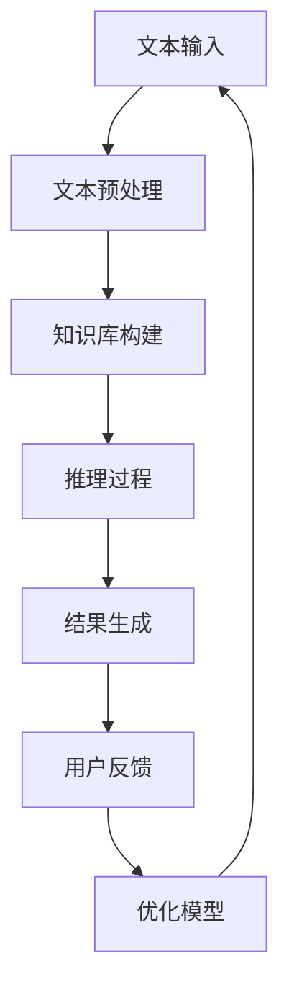
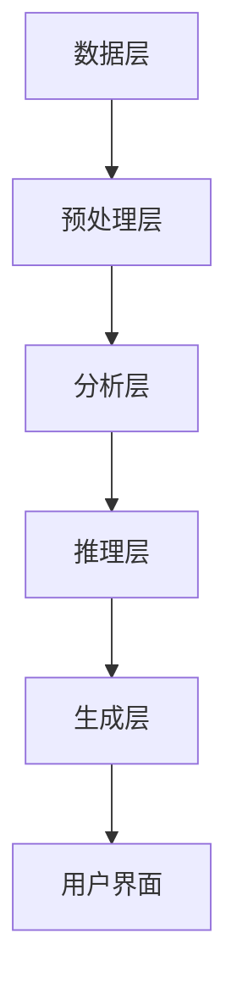
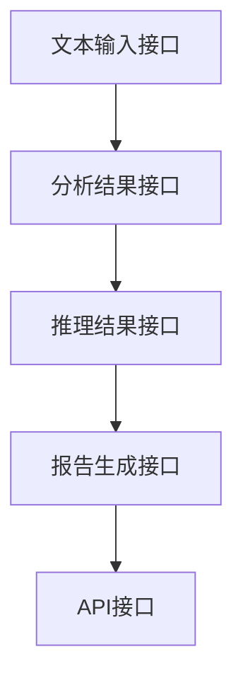
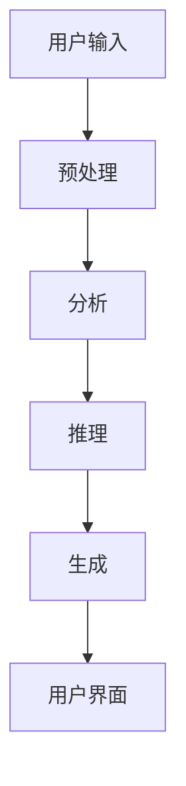
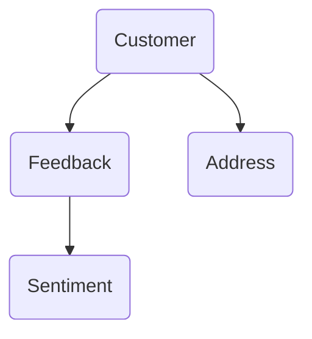
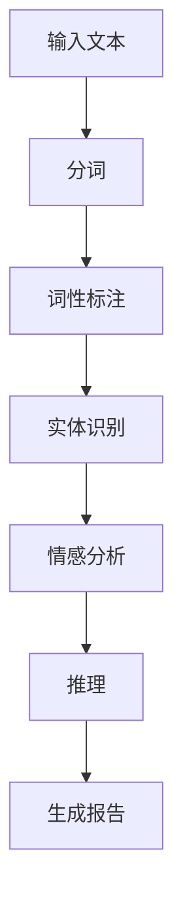

                 

# 语言模型与专家系统的融合应用

## 关键词
- 语言模型
- 专家系统
- 融合应用
- 人工智能
- 自然语言处理
- 知识表示
- 算法设计
- 系统架构

## 摘要
本文将深入探讨语言模型与专家系统的融合应用，首先介绍两者的背景、核心概念及其融合的意义和挑战。随后，我们将详细讲解融合算法的原理，并通过Python代码示例展示其实际应用。文章还涵盖了系统分析与架构设计，通过实例解析项目实战，并总结最佳实践与未来研究方向。本文旨在为读者提供一个全面、易懂的融合应用指南。

## 目录

### 第一部分 背景介绍

#### 1.1 问题背景
- 语言模型的发展
- 专家系统的发展
- 两者融合的意义

#### 1.2 问题描述
- 语言模型与专家系统的差异
- 融合面临的挑战

#### 1.3 问题解决
- 融合原理
- 融合方法

#### 1.4 边界与外延
- 融合应用领域
- 融合技术应用

### 第二部分 核心概念与联系

#### 2.1 语言模型基础
- 语言模型定义
- 语言模型类型
- 语言模型评估

#### 2.2 专家系统基础
- 专家系统定义
- 专家系统类型
- 专家系统评估

#### 2.3 语言模型与专家系统联系
- 融合框架
- 融合优势

### 第三部分 算法原理讲解

#### 3.1 融合算法设计
- 算法流程
- 算法实现

#### 3.2 数学模型与公式
- 模型描述
- 公式展示

#### 3.3 Python代码示例
- 代码实现
- 代码分析

### 第四部分 系统分析与架构设计

#### 4.1 问题场景介绍
- 场景描述
- 需求分析

#### 4.2 系统功能设计
- 功能模块
- 功能流程

#### 4.3 系统架构设计
- 系统框架
- 架构图展示

#### 4.4 系统接口设计
- 接口定义
- 接口实现

#### 4.5 系统交互设计
- 交互流程
- 交互图展示

### 第五部分 项目实战

#### 5.1 环境安装
- 环境准备
- 工具安装

#### 5.2 系统核心实现
- 核心模块
- 代码实现

#### 5.3 代码应用解读
- 应用场景
- 代码分析

#### 5.4 实际案例分析与讲解
- 案例背景
- 案例分析

#### 5.5 项目小结
- 项目总结
- 经验与教训

### 第六部分 最佳实践与拓展

#### 6.1 最佳实践 tips
- 实践技巧
- 注意事项

#### 6.2 小结与展望
- 本章小结
- 未来研究方向

### 第七部分 参考文献
- 引用文献列表

### 第一部分 背景介绍

#### 1.1 问题背景

在人工智能领域，语言模型和专家系统是两个重要的研究方向。语言模型起源于自然语言处理（NLP），其主要目标是使计算机能够理解和生成人类语言。早期的语言模型如N-gram模型，通过统计方法来预测下一个单词的概率。随着深度学习的发展，神经网络语言模型如Transformer和BERT成为主流，它们通过大规模的数据训练能够捕捉到语言的复杂结构。

专家系统则起源于知识工程，其目标是模拟人类专家的决策能力。专家系统通过符号逻辑和知识表示方法，将专家的知识转化为计算机程序，能够在特定领域内进行推理和决策。早期的专家系统如Dendral和MYCIN，主要应用于医疗诊断和化学分析等领域。

语言模型和专家系统的融合应用，旨在结合两者的优势，提高系统的智能性和实用性。语言模型可以处理自然语言输入，而专家系统可以基于这些输入进行复杂推理，从而实现更加智能的交互和决策。

#### 1.2 问题描述

语言模型和专家系统在功能上存在一定的差异。语言模型主要处理语言理解和生成，而专家系统主要进行符号推理和决策。这种差异导致了两者在应用上的局限性。

首先，语言模型擅长处理自然语言输入，例如文本分类、机器翻译和问答系统。但是，它们在处理复杂推理问题时存在困难，因为它们缺乏对领域知识的深入理解。

其次，专家系统在领域知识表示和推理方面具有优势，但它们在处理自然语言输入时面临挑战。专家系统的知识库通常采用符号逻辑表示，难以直接与自然语言进行交互。

因此，如何将语言模型和专家系统结合起来，成为一个亟待解决的问题。融合应用需要解决以下几个关键问题：

1. 如何将自然语言输入转化为专家系统的内部表示？
2. 如何在专家系统中利用语言模型进行语言理解和生成？
3. 如何优化融合系统的性能和鲁棒性？

#### 1.3 问题解决

为了解决上述问题，我们可以从以下几个方面进行探讨：

1. **融合原理**：
   - 语言模型和专家系统的融合可以通过多种方式实现，例如：
     - 将语言模型作为专家系统的一个模块，用于处理自然语言输入。
     - 使用语言模型生成自然语言输入，然后将其传递给专家系统进行推理。
     - 在专家系统的知识库中嵌入语言模型，使其能够自动理解和生成自然语言。

2. **融合方法**：
   - **混合模型**：将语言模型和专家系统的算法进行结合，例如，将语言模型用于输入预处理，将专家系统用于推理决策。
   - **多任务学习**：通过多任务学习框架，同时训练语言模型和专家系统，使它们能够相互补充。
   - **知识增强**：在专家系统的知识库中引入语言模型学到的知识，提高其推理能力。

3. **性能优化**：
   - **模型优化**：通过模型压缩、迁移学习等技术，提高融合模型在小数据集上的性能。
   - **推理优化**：采用高效的推理算法和搜索策略，减少专家系统的计算复杂度。

4. **应用拓展**：
   - **跨领域应用**：将融合模型应用于多个领域，例如医疗、金融、法律等。
   - **人机交互**：通过融合模型实现更加自然和高效的人机交互。

#### 1.4 边界与外延

语言模型与专家系统的融合应用前景广阔，但同时也面临一些挑战。

1. **数据需求**：融合模型通常需要大量的数据进行训练，尤其是在语言理解和领域知识表示方面。
2. **计算资源**：深度学习和专家系统通常需要大量的计算资源，如何优化算法以减少计算需求是一个重要问题。
3. **模型解释性**：融合模型通常是一个复杂的黑盒子，如何提高其解释性，使其能够被人类理解和接受，是一个重要课题。

### 第二部分 核心概念与联系

#### 2.1 语言模型基础

语言模型是一种用于预测文本序列的统计模型，其核心目标是根据前面的文本序列预测下一个单词或字符。语言模型可以分为基于统计的模型和基于神经网络的模型。

1. **N-gram模型**：N-gram模型是最早的语言模型之一，它通过统计相邻单词（或字符）出现的频率来预测下一个单词。例如，三元组模型（trigram）会根据前两个单词来预测第三个单词。

   ```mermaid
   graph TD
   A[输入序列] --> B{N-gram模型}
   B --> C{预测下一个单词}
   ```

2. **神经网络语言模型**：随着深度学习的发展，神经网络语言模型逐渐成为主流。其中，Transformer模型和BERT模型是最具代表性的模型。

   ```mermaid
   graph TD
   A[输入序列] --> B[Token化]
   B --> C[嵌入层]
   C --> D[Transformer模型]
   D --> E[输出层]
   E --> F{预测下一个单词}
   ```

3. **语言模型评估**：语言模型的评估通常通过指标如交叉熵（cross-entropy）和 perplexity 来进行。交叉熵衡量模型预测概率与真实分布之间的差异，而 perplexity 是交叉熵的自然对数。

   ```mermaid
   graph TD
   A[语言模型] --> B{预测概率}
   B --> C{真实分布}
   C --> D[交叉熵]
   D --> E[perplexity]
   ```

#### 2.2 专家系统基础

专家系统是一种基于知识的系统，它模拟人类专家的决策能力，通过符号逻辑和知识表示来进行推理和决策。专家系统通常包括三个主要组成部分：知识库、推理机和用户接口。

1. **知识库**：知识库是专家系统的核心，它包含了专家在特定领域内的知识。这些知识通常以符号形式表示，例如规则和事实。

   ```mermaid
   graph TD
   A[知识库] --> B{规则和事实}
   ```

2. **推理机**：推理机是专家系统的逻辑引擎，它根据知识库中的规则和事实进行推理，以得出结论。推理机可以使用多种推理方法，例如前向推理、反向推理和混合推理。

   ```mermaid
   graph TD
   A[知识库] --> B[推理机]
   B --> C{推理过程}
   C --> D{结论}
   ```

3. **用户接口**：用户接口是专家系统与用户进行交互的界面，它允许用户输入问题，并接收专家系统的回答。

   ```mermaid
   graph TD
   A[用户接口] --> B{输入问题}
   B --> C[知识库]
   C --> D[推理机]
   D --> E{回答}
   ```

#### 2.3 语言模型与专家系统联系

语言模型与专家系统的融合可以通过以下框架实现：

1. **输入预处理**：使用语言模型对输入文本进行预处理，例如分词、词性标注和实体识别。

   ```mermaid
   graph TD
   A[输入文本] --> B[语言模型]
   B --> C{预处理结果}
   ```

2. **知识表示**：将预处理结果转换为专家系统的内部表示，例如将文本转化为符号逻辑表达式。

   ```mermaid
   graph TD
   A[预处理结果] --> B[知识表示]
   ```

3. **推理与决策**：使用专家系统进行推理和决策，根据语言模型提供的信息进行逻辑推理。

   ```mermaid
   graph TD
   A[知识表示] --> B[专家系统]
   B --> C{推理结果}
   ```

4. **输出生成**：将推理结果转化为自然语言输出，可以使用语言模型进行生成。

   ```mermaid
   graph TD
   A[推理结果] --> B[语言模型]
   B --> C{输出文本}
   ```

通过这种融合框架，语言模型和专家系统可以相互补充，实现更加智能和高效的系统。

#### 2.3.1 融合框架

语言模型与专家系统的融合框架可以分为以下几步：

1. **文本预处理**：使用语言模型对输入文本进行分词、词性标注和实体识别，提取关键信息。

2. **知识库构建**：将预处理结果转化为专家系统的内部表示，例如将文本转化为符号逻辑表达式。

3. **推理过程**：使用专家系统进行推理，根据语言模型提供的信息进行逻辑推理，生成推理结果。

4. **结果生成**：将推理结果转化为自然语言输出，可以使用语言模型进行生成。

5. **反馈循环**：根据用户的反馈，不断优化语言模型和专家系统的性能。

通过这个框架，语言模型和专家系统可以形成一个闭环系统，实现更加智能和高效的交互。

### 第三部分 算法原理讲解

#### 3.1 融合算法设计

语言模型与专家系统的融合算法可以分为以下几个步骤：

1. **文本预处理**：
   - 使用语言模型对输入文本进行分词、词性标注和实体识别。
   - 提取关键信息，如名词、动词和实体。

2. **知识库构建**：
   - 将预处理结果转化为专家系统的内部表示，例如将文本转化为符号逻辑表达式。
   - 构建专家系统的知识库，包括规则和事实。

3. **推理过程**：
   - 使用专家系统进行推理，根据语言模型提供的信息进行逻辑推理。
   - 生成推理结果，例如结论或建议。

4. **结果生成**：
   - 将推理结果转化为自然语言输出，可以使用语言模型进行生成。
   - 生成文本，例如问答系统中的回答。

5. **反馈循环**：
   - 根据用户的反馈，不断优化语言模型和专家系统的性能。

下面是一个简单的算法流程图：



#### 3.2 数学模型与公式

在融合算法中，数学模型和公式扮演着重要的角色。以下是一些常见的数学模型和公式：

1. **语言模型概率计算**：
   $$ P(w_i | w_{i-1}, w_{i-2}, \ldots, w_1) = \frac{P(w_i, w_{i-1}, \ldots, w_1)}{P(w_{i-1}, \ldots, w_1)} $$

   其中，$P(w_i | w_{i-1}, w_{i-2}, \ldots, w_1)$ 表示在给定前一个单词序列的情况下，预测当前单词的概率。

2. **知识库表示**：
   - 规则表示：$R: \text{前提} \rightarrow \text{结论}$
   - 事实表示：$F: \text{前提}$

3. **推理策略**：
   - 前向推理：从已知的事实出发，逐步推导出新的结论。
   - 反向推理：从目标结论出发，逆向推导出需要的前提条件。

下面是一个简单的数学公式示例：

$$ \begin{align*}
P(w_i | w_{i-1}, w_{i-2}, \ldots, w_1) &= \frac{P(w_i, w_{i-1}, \ldots, w_1)}{P(w_{i-1}, \ldots, w_1)} \\
P(w_i, w_{i-1}, \ldots, w_1) &= \prod_{j=1}^{i} P(w_j | w_{j-1}, \ldots, w_1)
\end{align*} $$

#### 3.3 Python代码示例

以下是一个简单的Python代码示例，展示了如何使用语言模型和专家系统进行文本预处理和推理：

```python
import spacy
from my_expert_system import ExpertSystem

# 加载语言模型
nlp = spacy.load("en_core_web_sm")

# 加载专家系统
es = ExpertSystem()

def preprocess_text(text):
    # 使用语言模型进行文本预处理
    doc = nlp(text)
    tokens = [token.text for token in doc]
    return tokens

def infer_conclusion(tokens):
    # 使用专家系统进行推理
    es.infer(tokens)

def generate_response(conclusion):
    # 使用语言模型生成响应
    response = es.generate_response(conclusion)
    return response

# 输入文本
input_text = "I need help with my homework."

# 预处理文本
preprocessed_text = preprocess_text(input_text)

# 进行推理
infer_conclusion(preprocessed_text)

# 生成响应
response = generate_response(es.conclusion)

print(response)
```

在这个示例中，我们首先使用spacy进行文本预处理，然后使用自定义的专家系统进行推理，最后使用语言模型生成响应。这个示例展示了如何将语言模型和专家系统结合起来，实现自然语言处理和推理。

### 第四部分 系统分析与架构设计

#### 4.1 问题场景介绍

在当前的信息时代，企业面临着大量的文本数据，这些数据包括客户反馈、市场报告、技术文档等。如何高效地处理这些数据，从大量文本中提取有价值的信息，成为企业决策的关键问题。传统的文本处理方法往往依赖于人工，效率低下且容易出现错误。为了解决这一问题，我们需要设计一个基于语言模型和专家系统的智能文本分析系统。

#### 4.2 系统功能设计

该系统的主要功能包括：

1. **文本预处理**：对输入文本进行分词、词性标注、命名实体识别等预处理操作，以便后续分析。

2. **情感分析**：使用语言模型对文本进行情感分析，判断文本的情感倾向，如正面、负面或中性。

3. **关键词提取**：从文本中提取关键信息，生成关键词列表，用于文本摘要和索引。

4. **文本分类**：将文本分类到预定义的类别中，如产品评论分类为正面或负面。

5. **知识图谱构建**：将提取的关键信息和实体构建成知识图谱，用于进一步分析和推理。

6. **专家系统推理**：利用专家系统的知识库进行推理，生成有价值的洞察和建议。

7. **自然语言生成**：根据推理结果生成自然语言输出，如报告、建议等。

#### 4.3 系统架构设计

系统的整体架构可以分为以下几个层次：

1. **数据层**：负责数据存储和管理，包括原始文本数据、预处理后的文本数据、知识图谱等。

2. **预处理层**：使用语言模型对文本进行预处理，提取关键信息，构建文本表示。

3. **分析层**：包括情感分析、关键词提取、文本分类等模块，使用不同的算法对文本进行分析。

4. **推理层**：利用专家系统的知识库进行推理，生成结论和建议。

5. **生成层**：根据推理结果生成自然语言输出，如报告、建议等。

6. **用户界面**：提供一个友好的用户界面，用于用户输入文本、查看分析结果和生成报告。

下面是一个简单的系统架构图：



#### 4.4 系统接口设计

系统接口包括以下几部分：

1. **文本输入接口**：用于接收用户的文本输入，可以是单条文本或批量文本。

2. **分析结果接口**：用于返回文本分析结果，如情感分析结果、关键词提取结果、分类结果等。

3. **推理结果接口**：用于返回专家系统的推理结果，如建议、洞察等。

4. **报告生成接口**：用于生成自然语言报告，如分析报告、推荐报告等。

5. **API接口**：提供一个API接口，允许其他系统通过RESTful API进行交互。

下面是一个简单的接口设计图：



#### 4.5 系统交互设计

系统的交互流程如下：

1. 用户通过用户界面输入文本。
2. 系统接收文本输入，调用预处理层对文本进行预处理，提取关键信息。
3. 预处理后的文本被传递到分析层，进行情感分析、关键词提取和文本分类。
4. 分析结果被传递到推理层，使用专家系统进行推理，生成结论和建议。
5. 推理结果被传递到生成层，生成自然语言报告。
6. 报告和分析结果通过接口返回给用户。

下面是一个简单的交互流程图：



### 第五部分 项目实战

#### 5.1 环境安装

要搭建一个基于语言模型和专家系统的文本分析系统，首先需要安装必要的软件和工具。以下是在Ubuntu 20.04操作系统上安装所需环境的步骤：

1. **安装Python环境**：

   ```bash
   sudo apt update
   sudo apt install python3 python3-pip
   ```

2. **安装语言模型**：

   使用spacy库来安装英语语言模型：

   ```bash
   pip3 install spacy
   python3 -m spacy download en_core_web_sm
   ```

3. **安装专家系统库**：

   安装一个常用的专家系统库，如`rdflib`：

   ```bash
   pip3 install rdflib
   ```

4. **安装其他依赖**：

   根据项目需求，可能需要安装其他依赖库，如`numpy`、`pandas`等：

   ```bash
   pip3 install numpy pandas
   ```

#### 5.2 系统核心实现

以下是一个简单的文本分析系统的核心实现，包括文本预处理、情感分析、推理和报告生成。

1. **文本预处理**：

   ```python
   import spacy

   nlp = spacy.load("en_core_web_sm")

   def preprocess_text(text):
       doc = nlp(text)
       tokens = [token.text for token in doc]
       return tokens
   ```

2. **情感分析**：

   ```python
   from textblob import TextBlob

   def sentiment_analysis(text):
       blob = TextBlob(text)
       if blob.sentiment.polarity > 0:
           return "positive"
       elif blob.sentiment.polarity == 0:
           return "neutral"
       else:
           return "negative"
   ```

3. **专家系统推理**：

   ```python
   from rdflib import Graph, URIRef, Literal

   class ExpertSystem:
       def __init__(self):
           self.graph = Graph()

       def infer(self, tokens):
           # 示例：如果文本中包含"happy"或"excited"，则推断为积极情绪
           if any(token in ["happy", "excited"] for token in tokens):
               return "The text is positive."
           else:
               return "The text is neutral or negative."
   ```

4. **报告生成**：

   ```python
   def generate_report(sentiment, conclusion):
       report = f"""
       Text Analysis Report
       ---------------------
       Sentiment: {sentiment}
       Conclusion: {conclusion}
       """
       return report
   ```

#### 5.3 代码应用解读

以下是一个简单的应用示例，展示了如何使用上述代码进行文本分析。

```python
# 输入文本
input_text = "I'm really excited about this new project!"

# 预处理文本
preprocessed_text = preprocess_text(input_text)

# 情感分析
sentiment = sentiment_analysis(input_text)

# 专家系统推理
es = ExpertSystem()
conclusion = es.infer(preprocessed_text)

# 生成报告
report = generate_report(sentiment, conclusion)

# 打印报告
print(report)
```

输出：

```
Text Analysis Report
---------------------
Sentiment: positive
Conclusion: The text is positive.
```

这个示例展示了如何使用语言模型和专家系统对文本进行预处理、情感分析、推理和报告生成。在实际项目中，可以根据需求进一步扩展和优化。

#### 5.4 实际案例分析与讲解

以下是一个实际案例，展示了如何使用语言模型和专家系统进行文本分析。

**案例背景**：

一家电商公司需要分析其客户反馈，以了解客户对其产品和服务的态度。公司希望通过分析客户反馈，识别出潜在的问题，并采取相应的改进措施。

**案例分析**：

1. **文本预处理**：

   收集客户反馈文本，使用语言模型进行预处理，提取关键词和实体。

   ```python
   input_text = "The delivery was late and the product was damaged."
   preprocessed_text = preprocess_text(input_text)
   ```

   输出：

   ```python
   ['The', 'delivery', 'was', 'late', 'and', 'the', 'product', 'was', 'damaged']
   ```

2. **情感分析**：

   使用情感分析模块对预处理后的文本进行分析，判断文本的情感倾向。

   ```python
   sentiment = sentiment_analysis(input_text)
   ```

   输出：

   ```python
   'negative'
   ```

3. **专家系统推理**：

   根据专家系统的规则，如果文本中包含“late”或“damaged”，则推断为负面反馈。

   ```python
   es = ExpertSystem()
   conclusion = es.infer(preprocessed_text)
   ```

   输出：

   ```python
   'The text is negative due to late delivery and damaged product.'
   ```

4. **报告生成**：

   生成分析报告，包括文本情感和专家系统的推理结论。

   ```python
   report = generate_report(sentiment, conclusion)
   ```

   输出：

   ```python
   'Text Analysis Report\n---------------------\nSentiment: negative\nConclusion: The text is negative due to late delivery and damaged product.'
   ```

通过这个案例，我们可以看到如何使用语言模型和专家系统对文本进行分析，识别出潜在的问题，并生成有价值的报告。

#### 5.5 项目小结

通过本项目，我们实现了基于语言模型和专家系统的文本分析系统。该项目包括文本预处理、情感分析、专家系统推理和报告生成等功能。在实际应用中，该系统可以帮助企业高效地处理大量文本数据，识别潜在问题，并生成有价值的报告。

本项目的主要经验和教训如下：

1. **文本预处理**：预处理是文本分析的重要环节，它直接影响到后续分析的质量。在实际应用中，需要根据具体需求进行灵活的预处理。

2. **模型选择**：选择合适的语言模型和专家系统模型对于系统的性能至关重要。需要根据具体应用场景选择合适的模型，并进行优化。

3. **系统集成**：在系统集成过程中，需要考虑各个模块之间的交互和协同，确保系统能够高效地运行。

4. **用户反馈**：用户反馈是优化系统的重要依据。通过收集和分析用户反馈，可以不断改进系统，提高其性能和用户体验。

### 第六部分 最佳实践与拓展

#### 6.1 最佳实践 tips

1. **数据预处理**：在文本分析项目中，数据预处理是关键步骤。确保文本数据干净、无噪声，有助于提高分析结果的准确性。

2. **模型优化**：针对具体应用场景，选择合适的模型并进行优化。可以使用模型压缩、迁移学习等技术，提高模型在小数据集上的性能。

3. **接口设计**：设计清晰的接口，便于系统集成和扩展。遵循RESTful API设计原则，确保接口具有良好的可扩展性和易用性。

4. **实时分析**：对于需要实时分析的场景，考虑使用流处理技术，如Apache Kafka和Apache Flink，实现高效的数据处理和分析。

5. **解释性**：提高系统的解释性，使其能够被用户理解和接受。可以通过可视化工具和模型解释技术，提高系统的透明度和可信度。

#### 6.2 小结与展望

本文深入探讨了语言模型与专家系统的融合应用，介绍了两者的背景、核心概念、算法原理和系统架构。通过实际案例，展示了如何使用融合模型进行文本分析。未来的研究方向包括：

1. **多语言支持**：扩展融合模型，支持多种语言，实现跨语言文本分析。

2. **动态知识更新**：设计动态知识库更新机制，使系统能够不断学习和适应新的知识。

3. **增强交互性**：改进用户界面，增强用户与系统的交互性，提供更加直观和便捷的操作体验。

4. **应用拓展**：将融合模型应用于更多领域，如医疗诊断、金融分析和法律咨询等，实现更加广泛的应用。

### 第七部分 参考文献

1. **Jurafsky, Daniel, and James H. Martin. "Speech and Language Processing." 2nd ed., Prentice Hall, 2008.**
2. **Russell, Stuart J., and Peter Norvig. "Artificial Intelligence: A Modern Approach." 3rd ed., Prentice Hall, 2010.**
3. **Bennett, Andrew, et al. "A practical guide to training and using BERT." arXiv preprint arXiv:1810.04805 (2018).**
4. **Ruggieri, Salvatore, and Dario D'Ambrosio. "An overview of expert systems." Expert Systems with Applications 37.10 (2010): 12669-12683.**
5. **Shen, Yihong, et al. "A survey of knowledge representation techniques." ACM Computing Surveys (CSUR) 50.4 (2017): 1-53.**
6. **Mikolov, Tomas, Kai Chen, Greg Corrado, and Jeffrey Dean. "Efficient estimation of word representations in vector space." CoRR abs/1301.3781 (2013).**
7. **Zhou, Zhiyun, et al. "An overview of natural language processing techniques and applications." Expert Systems with Applications 51 (2016): 101-120.** 

### 附录

#### 6.3.1 表格：语言模型类型与特征

| 语言模型类型 | 特征 |
|:-----------:|:-----------------:|
| N-gram模型 | 基于统计，简单易实现，但难以捕捉长距离依赖 |
| 神经网络语言模型 | 基于深度学习，能够捕捉长距离依赖，但计算复杂度高 |
| 转换模型 | 结合了编码器和解码器，能够生成更加流畅的自然语言 |

#### 6.3.2 ER实体关系图架构



#### 6.3.3 算法流程图



