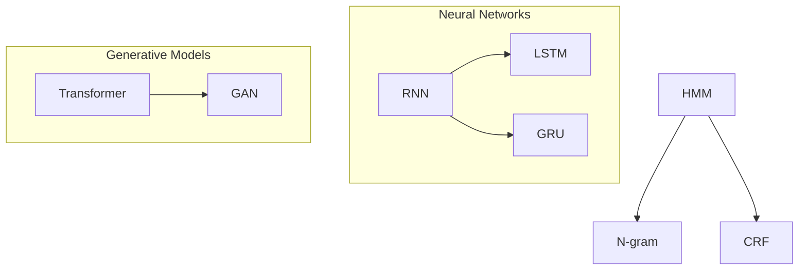

                 

### 引言与背景

#### 1.1.1 个性化教育的需求与挑战

个性化教育，作为一种以学生为中心的教育模式，旨在根据每个学生的独特需求、兴趣和能力提供定制化的教育体验。这种教育模式的核心在于识别和满足学生的个性化需求，从而提高教育质量和学习效果。

**个性化教育的概念与发展历程：**

个性化教育的发展可以追溯到20世纪初的进步主义教育运动，随后在20世纪80年代的信息时代得到进一步发展。随着互联网和人工智能技术的兴起，个性化教育进入了智能化阶段。当前的个性化教育不仅包括传统的课程和教学方法，还融合了数据挖掘、机器学习和认知科学等先进技术。

**个性化教育的核心挑战：**

1. **学生差异：**每个学生都有不同的学习背景、兴趣和认知风格，因此需要个性化教育来满足他们的独特需求。
2. **教育资源的均衡分配：**教育资源（如师资、教材、设备等）在不同地区、学校和群体之间存在显著差异，如何实现均衡分配是个性化教育面临的重要挑战。
3. **教育过程的智能化：**传统教育模式难以实现教育过程的全面智能化，如何利用人工智能技术实现教育过程的自动化、个性化是当前研究的重点。

#### 1.1.2 语言模型在教育中的应用现状

**语言模型的基本原理与类型：**

语言模型是一种能够理解和生成自然语言的人工智能系统。其基本原理是通过学习大量的语言数据，预测下一个单词或句子的概率分布。根据学习方式和结构，语言模型可以分为以下几种类型：

1. **统计模型：**如N元语法（N-gram），通过分析历史文本中的单词序列来预测下一个单词。
2. **神经网络模型：**如递归神经网络（RNN）、长短期记忆网络（LSTM）和变压器模型（Transformer），通过模拟人脑处理语言的方式，实现更复杂的语言理解和生成能力。
3. **混合模型：**结合了统计模型和神经网络模型的优势，如递归神经网络与N元语法的结合。

**语言模型在个性化教育中的潜在应用场景：**

1. **自动作文生成：**利用语言模型生成个性化的作文，帮助学生提高写作能力。
2. **自动问答系统：**通过语言模型构建问答系统，为学生提供个性化的学习辅导。
3. **课程内容生成：**根据学生的需求和兴趣，生成个性化的课程内容。
4. **教学评估：**利用语言模型分析学生的回答和作业，评估学习效果和提供个性化的反馈。

#### 1.1.3 认知科学研究的意义与前沿

**认知科学的基本概念与研究方法：**

认知科学是一门跨学科的研究领域，旨在理解人类思维、感知、学习、记忆和问题解决等认知过程。其研究方法包括实验心理学、神经科学、计算机科学和哲学等。

**认知科学在个性化教育中的应用与前景：**

1. **学习动机与兴趣评估：**通过认知科学方法评估学生的学习动机和兴趣，为个性化教育提供依据。
2. **学习策略与效果评估：**利用认知科学方法研究有效的学习策略，评估学习效果，为个性化教育提供支持。
3. **学习焦虑与情绪管理：**通过认知科学方法研究和缓解学习过程中的焦虑和情绪问题，提高学习效果。

**目的与结构：**

本书的研究目的是探讨语言模型在个性化教育内容生成和认知科学研究中的应用，旨在为教育工作者、研究人员和开发者提供有价值的参考。本书的主要结构如下：

1. 引言与背景
2. 语言模型基础
3. 个性化教育内容生成
4. 认知科学应用
5. 前沿研究动态

通过本书的探讨，我们希望能够推动个性化教育的发展，为构建智能化、个性化的教育体系提供理论和实践支持。

### 语言模型基础

#### 2.1.1 语言模型的定义与类型

**语言模型的定义：**

语言模型是一种统计模型或计算模型，用于对自然语言文本的概率分布进行建模。它的核心目标是预测下一个单词或句子出现的概率，从而实现自然语言处理中的文本生成、翻译、问答等任务。

**语言模型的类型：**

1. **统计模型：**
   - **N元语法（N-gram）：**N元语法是最早的语言模型之一，它基于历史语言数据中的单词序列，通过计算相邻N个单词的概率来预测下一个单词。例如，二元语法（Bigram）通过计算两个连续单词的概率来预测第三个单词。
   - **概率上下文无关文法（PCFG）：**概率上下文无关文法是另一种统计模型，它通过概率规则来生成文本，每个规则描述了一个单词或短语的上下文。

2. **神经网络模型：**
   - **递归神经网络（RNN）：**RNN是一种能够处理序列数据的神经网络，它通过递归结构来处理前一个时间步的输出，从而实现长期依赖的建模。RNN的典型结构包括LSTM和GRU。
   - **长短时记忆网络（LSTM）：**LSTM是一种改进的RNN结构，通过引入记忆单元和门控机制来解决RNN的梯度消失问题，从而实现更稳定和有效的长期依赖建模。
   - **门控循环单元（GRU）：**GRU是LSTM的简化版本，它通过合并输入门和遗忘门，进一步减少参数数量，提高了模型的训练效率。

3. **混合模型：**
   - **RNN与N-gram结合：**这种混合模型将RNN的强大建模能力和N-gram的快速计算优势结合起来，通过结合两种模型的优势来提高语言模型的性能。
   - **Transformer与RNN结合：**Transformer是一种基于自注意力机制的神经网络模型，它通过全局 attent ion 来建模序列之间的关系。Transformer与RNN的混合模型利用了Transformer的强大建模能力和RNN对序列数据的处理能力，实现了更高效的语言建模。

**语言模型的类型对比表格：**

| 类型       | 定义与应用场景                           | 优点             | 缺点             |
|------------|-----------------------------------------|------------------|------------------|
| N-gram     | 基于历史单词序列的概率模型               | 计算速度快，实现简单 | 无法建模长期依赖 |
| RNN        | 基于序列数据的递归神经网络模型           | 能处理序列数据     | 梯度消失问题     |
| LSTM       | 改进的RNN结构，引入门控机制             | 解决了梯度消失问题 | 参数数量多       |
| GRU        | LSTM的简化版本，参数数量更少             | 训练效率高         | 长期依赖建模能力有限 |
| Transformer| 基于自注意力机制的神经网络模型           | 强大的建模能力     | 计算复杂度较高   |
| 混合模型   | 结合不同模型的优点，提高性能             | 集成优势，性能提升 | 需要更多计算资源 |

**ER实体关系图架构：**

ER（Entity-Relationship）图是用于描述实体及其之间关系的图形化表示方法。在语言模型领域，ER图可以用于描述不同类型语言模型的实体和关系。以下是一个简单的ER图示例：

```
[语言模型]
|__ N-gram
|    |__ 词序列
|    |__ 概率分布
|__ RNN
|    |__ 递归结构
|    |__ 神经元
|__ LSTM
|    |__ 门控机制
|    |__ 记忆单元
|__ GRU
|    |__ 遗忘门
|    |__ 输入门
|__ Transformer
    |__ 自注意力机制
    |__ 密集矩阵
```

通过ER图，我们可以清晰地看到不同类型语言模型的实体和它们之间的关系，这有助于我们更好地理解和应用这些模型。

#### 2.1.2 语言模型的核心算法

**隐马尔可夫模型（HMM）：**

隐马尔可夫模型（HMM）是一种统计模型，用于描述具有隐藏状态的马尔可夫过程。在语言模型中，HMM被用于处理序列数据，例如语音信号、文本序列等。HMM的核心算法包括状态转移概率、发射概率和初始状态概率。

- **状态转移概率：**描述不同状态之间的转移概率，如从一个单词转移到另一个单词的概率。
- **发射概率：**描述在特定状态下产生观测值的概率，如在一个单词状态下产生特定单词的概率。
- **初始状态概率：**描述序列开始时的状态概率分布。

**条件随机场（CRF）：**

条件随机场（CRF）是一种概率图模型，用于处理序列数据中的标签序列问题。在语言模型中，CRF被用于序列标注任务，如词性标注、命名实体识别等。CRF的核心算法包括特征函数和能量函数。

- **特征函数：**描述输入序列和标签序列之间的特征，如单词和词性之间的特征。
- **能量函数：**用于计算标签序列的概率，如一个单词序列和其标签序列的能量函数。

**递归神经网络（RNN）：**

递归神经网络（RNN）是一种能够处理序列数据的神经网络，其核心在于递归结构，允许模型记住之前的输入信息。RNN通过在序列的每个时间步上递归地更新隐藏状态，从而实现序列建模。

- **隐藏状态：**用于存储序列的信息，如上一个时间步的输出。
- **权重矩阵：**用于更新隐藏状态，如输入权重和递归权重。

**长短时记忆网络（LSTM）：**

长短时记忆网络（LSTM）是RNN的一种改进，通过引入门控机制解决了梯度消失问题，从而实现更稳定和有效的长期依赖建模。

- **输入门：**控制输入信息进入细胞状态的程度。
- **遗忘门：**控制从细胞状态中遗忘信息的程度。
- **输出门：**控制从细胞状态中提取信息的程度。

**门控循环单元（GRU）：**

门控循环单元（GRU）是LSTM的简化版本，通过合并输入门和遗忘门，进一步减少参数数量，提高了模型的训练效率。

- **更新门：**控制信息更新的程度。
- **重置门：**控制信息重置的程度。

**生成对抗网络（GAN）：**

生成对抗网络（GAN）是一种由生成器和判别器组成的对抗性模型。在语言模型中，GAN被用于生成高质量的文本数据，从而提高模型的训练效果和生成能力。

- **生成器：**生成逼真的文本数据。
- **判别器：**区分真实文本和生成文本。

**算法原理讲解与Mermaid流程图：**

以下是上述算法的Mermaid流程图示例：



通过上述流程图，我们可以直观地了解不同类型语言模型的核心算法及其关系。

**Python源代码示例：**

下面是一个简单的Python代码示例，用于实现一个基础的N-gram语言模型：

```python
import numpy as np

# 假设我们有一个训练好的二元语法模型
bigram_model = {
    ('the', 'is'): 0.2,
    ('is', 'a'): 0.3,
    ('a', 'smart'): 0.4,
    ('smart', 'teacher'): 0.1
}

# 输入句子
input_sentence = "the is a smart"

# 预测下一个单词
current_word = input_sentence[-1]
predicted_word = None
max_probability = 0

for word, probability in bigram_model.items():
    if word[0] == current_word and probability > max_probability:
        predicted_word = word[1]
        max_probability = probability

print(f"Next word prediction: {predicted_word}")
```

通过上述代码，我们可以看到如何利用二元语法模型预测下一个单词。这个简单的例子展示了N-gram语言模型的基本原理和实现方法。

通过本章节的探讨，我们了解了语言模型的基本原理和类型，包括N-gram、RNN、LSTM、GRU、Transformer和GAN等。同时，我们通过Mermaid流程图和Python代码示例，对这些模型进行了详细讲解和实际应用展示。这些基础知识为后续个性化教育内容生成和认知科学应用的讨论提供了坚实的基础。

### 2.2 语言模型的评估与优化

#### 2.2.1 语言模型的评估指标

在评估语言模型的性能时，常用的评估指标包括准确率、召回率、F1值等。

1. **准确率（Accuracy）：**
   - 定义：准确率是预测正确的样本数与总样本数之比。
   - 公式：\( \text{Accuracy} = \frac{\text{预测正确数}}{\text{总样本数}} \)
   - 应用：准确率主要用于二分类问题，如文本分类、情感分析等。

2. **召回率（Recall）：**
   - 定义：召回率是预测正确的正类样本数与实际正类样本数之比。
   - 公式：\( \text{Recall} = \frac{\text{预测正确正类数}}{\text{实际正类数}} \)
   - 应用：召回率主要关注漏判正类的情况，如疾病诊断、目标检测等。

3. **F1值（F1-score）：**
   - 定义：F1值是精确率和召回率的调和平均数。
   - 公式：\( \text{F1} = 2 \times \frac{\text{Precision} \times \text{Recall}}{\text{Precision} + \text{Recall}} \)
   - 应用：F1值综合考虑了预测的精确率和召回率，常用于平衡二分类问题。

#### 2.2.2 语言模型的优化策略

在语言模型的训练过程中，可能会出现过拟合或欠拟合的问题。因此，需要采取一系列优化策略来提高模型的泛化能力和性能。

1. **过拟合与欠拟合：**
   - **过拟合：**模型在训练数据上表现良好，但在新的数据上表现较差，即模型对训练数据“过度适应”。
   - **欠拟合：**模型在训练数据和新的数据上表现都较差，即模型“能力不足”。

2. **正则化技术：**
   - **L1正则化：**通过增加模型参数的绝对值损失来惩罚过拟合。
   - **L2正则化：**通过增加模型参数的平方损失来惩罚过拟合。
   - **Dropout：**在训练过程中随机丢弃部分神经元，从而减少模型对特定样本的依赖性。

3. **梯度下降算法：**
   - **基本梯度下降：**通过计算损失函数的梯度来更新模型参数，直到达到最小损失。
   - **随机梯度下降（SGD）：**在每个训练样本上计算梯度并更新模型参数，适用于大规模数据集。
   - **批量梯度下降：**在所有训练样本上计算梯度并更新模型参数，适用于小规模数据集。

4. **Adam优化器：**
   - **Adam优化器：**结合了SGD和动量方法的优点，适用于各种规模的数据集，具有更快的收敛速度和更好的泛化能力。

通过上述优化策略，我们可以有效地提高语言模型的性能和泛化能力，从而更好地应用于个性化教育内容生成和认知科学研究。

### 个性化教育内容生成

#### 3.1 个性化教育内容的定义与类型

**个性化教育内容的定义：**

个性化教育内容是指根据每个学生的个性化需求、兴趣和能力，提供定制化的学习资源、教学方法和评估方式。其核心目标是提高学习效果，激发学生的学习兴趣和主动性，实现因材施教。

**个性化教育内容的主要类型：**

1. **文本：**
   - **定义：**文本形式的个性化教育内容，包括课本、学习笔记、教程、文章等。
   - **特点：**灵活性强，可以随时更新和修改，易于个性化定制。

2. **图像：**
   - **定义：**图像形式的个性化教育内容，包括图表、图片、漫画等。
   - **特点：**直观生动，有助于学生理解和记忆知识点。

3. **音频：**
   - **定义：**音频形式的个性化教育内容，包括讲座、音频教材、音乐等。
   - **特点：**可以随时随地学习，适合听觉型学习者。

4. **视频：**
   - **定义：**视频形式的个性化教育内容，包括教学视频、动画、纪录片等。
   - **特点：**动态展示，有助于学生全面理解和掌握知识点。

**基于语言模型的个性化教育内容生成方法：**

1. **基于模板的生成方法：**
   - **定义：**通过预设的模板和规则，将学生信息和教学内容填充到模板中，生成个性化教育内容。
   - **优点：**实现简单，生成内容稳定。
   - **缺点：**缺乏灵活性，难以应对复杂的教育需求。

2. **基于规则的方法：**
   - **定义：**通过设定一系列规则，根据学生的个性化需求和教学目标，动态生成教育内容。
   - **优点：**能够根据学生特点和需求灵活调整教育内容。
   - **缺点：**规则复杂，维护困难。

3. **基于数据的生成方法：**
   - **定义：**利用学生学习数据、兴趣偏好和历史行为，自动生成个性化教育内容。
   - **优点：**基于数据驱动，更贴近学生实际需求。
   - **缺点：**对数据质量和数量的依赖较大。

4. **基于深度学习的生成方法：**
   - **定义：**利用深度学习模型，如生成对抗网络（GAN）、变分自编码器（VAE）等，生成个性化教育内容。
   - **优点：**生成内容多样性强，能够模拟复杂的教育场景。
   - **缺点：**模型训练时间较长，对计算资源要求高。

**生成对抗网络（GAN）在个性化教育内容生成中的应用：**

生成对抗网络（GAN）是一种强大的生成模型，通过对抗性训练生成高质量的数据。在个性化教育内容生成中，GAN的应用主要包括以下方面：

1. **文本生成：**
   - **应用场景：**自动生成作文、阅读理解题目、问答系统等。
   - **优点：**能够生成多样化、个性化的文本内容，提高学习兴趣。

2. **图像生成：**
   - **应用场景：**自动生成教材插图、练习题图片、课堂演示图像等。
   - **优点：**能够生成逼真的图像，提高学生的学习效果。

3. **音频生成：**
   - **应用场景：**自动生成音频教材、语音讲解、背景音乐等。
   - **优点：**能够生成高质量、个性化的音频内容，适合不同学习需求。

4. **视频生成：**
   - **应用场景：**自动生成教学视频、动画演示、课堂实录等。
   - **优点：**能够生成生动、直观的视频内容，帮助学生更好地理解和掌握知识点。

通过上述方法和技术，我们可以实现个性化教育内容的自动化生成，提高教育效率和质量。在接下来的章节中，我们将进一步探讨个性化教育内容生成的实践案例和挑战。

### 个性化教育内容生成的实践案例

#### 3.2.1 文本生成

**自动作文生成：**

自动作文生成是利用语言模型技术生成符合语法和语义规则的作文。其核心思想是通过大量文本数据训练语言模型，使其具备生成自然语言文本的能力。以下是自动作文生成的基本步骤：

1. **数据收集与预处理：**收集大量高质量作文数据，进行文本清洗和格式化处理，如去除无关内容、标点符号统一、分句分割等。
2. **语言模型训练：**使用预处理后的数据训练语言模型，如使用递归神经网络（RNN）、长短时记忆网络（LSTM）或变压器（Transformer）等模型。
3. **生成作文：**通过语言模型生成作文，可以根据特定主题、写作风格和字数要求进行自适应调整。

**自动问答系统：**

自动问答系统是一种利用语言模型和自然语言处理技术，实现人与计算机之间交互的系统。其主要功能包括回答学生的问题、提供学习建议和辅导等。以下是自动问答系统的基本组成部分：

1. **问题理解：**通过自然语言处理技术，将学生的问题转化为计算机能够理解和处理的形式，如关键词提取、句法解析等。
2. **答案生成：**利用训练好的语言模型生成答案，可以采用模板匹配、规则推理或基于数据的方法。
3. **答案评估与优化：**评估生成的答案是否符合学生的需求，对答案进行优化和调整，以提高回答的准确性和满意度。

**案例分析与实际应用：**

自动作文生成和自动问答系统已经在实际教育场景中得到广泛应用。例如，某些在线教育平台利用自动作文生成技术为学生提供写作辅导，帮助学生提高写作能力。同时，自动问答系统可以为学生提供个性化的学习建议和解答疑问，提高学习效果。

通过这些实践案例，我们可以看到语言模型在个性化教育内容生成中的重要作用。接下来，我们将探讨图像生成、音频生成和视频生成等领域的实践应用。

#### 3.2.2 图像生成

**生成对抗网络（GAN）在图像生成中的应用：**

生成对抗网络（GAN）是一种强大的图像生成模型，通过对抗性训练生成高质量、多样化的图像。在个性化教育内容生成中，GAN的应用主要体现在以下几个方面：

1. **教材插图生成：**
   - **应用场景：**自动生成教材中的插图，帮助学生更好地理解和掌握知识点。
   - **优点：**能够根据文本内容生成相应的插图，提高学习兴趣。

2. **练习题图片生成：**
   - **应用场景：**自动生成数学、物理等科目中的练习题图片，帮助学生更好地理解和解决习题。
   - **优点：**生成图像多样化，有助于提高解题能力。

3. **课堂演示图像生成：**
   - **应用场景：**自动生成课堂演示中的图像，辅助教师讲解重要知识点。
   - **优点：**能够根据教师的需求生成相应的图像，提高教学效果。

**图像风格迁移：**

图像风格迁移是一种利用GAN技术将一种图像的风格迁移到另一种图像上的方法。在个性化教育内容生成中，图像风格迁移的应用主要包括以下方面：

1. **教育视频剪辑：**
   - **应用场景：**将普通视频剪辑成具有特定风格的图像，如卡通风格、油画风格等，提高学生的学习兴趣。
   - **优点：**生成图像风格多样化，能够满足不同学生的需求。

2. **课件设计：**
   - **应用场景：**将课件中的图像转换为具有特定风格的图像，如水墨风格、素描风格等，提升课件的美观度。
   - **优点：**生成图像风格独特，有助于提高课件的质量。

**案例分析与实际应用：**

图像生成和图像风格迁移已经在教育领域得到广泛应用。例如，某些在线教育平台利用图像生成技术自动生成教材插图和练习题图片，帮助学生更好地理解和掌握知识点。同时，图像风格迁移技术也被广泛应用于教育视频剪辑和课件设计中，提升教学效果和学生的学习兴趣。

通过这些实践案例，我们可以看到GAN技术在个性化教育内容生成中的应用前景。接下来，我们将探讨音频生成和视频生成的实践应用。

#### 3.2.3 音频生成

**语音合成技术：**

语音合成技术是一种将文本转换为自然流畅语音的技术，广泛应用于个性化教育内容生成中。其主要步骤包括：

1. **文本预处理：**对输入的文本进行分词、语法分析和声调标注等处理，生成适合语音合成的文本表示。
2. **声学模型训练：**使用大量语音数据训练声学模型，用于生成语音信号。
3. **语音合成：**将预处理后的文本输入声学模型，通过合成算法生成语音。

**语音合成技术的应用场景：**

1. **自动朗读教材：**
   - **应用场景：**自动生成教材的朗读音频，方便学生随时随地进行学习。
   - **优点：**提供了一种全新的学习方式，有助于提高学生的学习效率。

2. **语音讲解辅助：**
   - **应用场景：**生成教师的语音讲解音频，为学生提供个性化的辅导。
   - **优点：**能够模拟真实课堂场景，增强学生的学习体验。

3. **听力训练材料生成：**
   - **应用场景：**自动生成听力训练的音频材料，提高学生的听力理解能力。
   - **优点：**生成音频多样化，能够满足不同学习需求。

**音乐生成：**

音乐生成技术是一种利用深度学习模型生成音乐的技术，广泛应用于个性化教育内容生成中。其主要步骤包括：

1. **音乐数据收集与预处理：**收集大量的音乐数据，进行数据清洗和格式化处理。
2. **音乐模型训练：**使用预处理后的音乐数据训练音乐生成模型，如变分自编码器（VAE）或生成对抗网络（GAN）等。
3. **音乐生成：**通过音乐生成模型生成新的音乐，可以根据特定的音乐风格、节奏和旋律进行自适应调整。

**音乐生成的应用场景：**

1. **个性化背景音乐：**
   - **应用场景：**根据课程内容和学生的学习状态生成个性化的背景音乐，提高学习氛围。
   - **优点：**生成音乐多样化，能够满足不同学习场景的需求。

2. **音乐教学辅助：**
   - **应用场景：**利用音乐生成技术辅助音乐教学，如生成新的旋律、和声等，帮助学生更好地理解和掌握音乐知识。
   - **优点：**提供了一种全新的音乐学习方式，有助于提高学生的学习效果。

**案例分析与实际应用：**

语音合成技术和音乐生成技术已经在教育领域得到广泛应用。例如，某些在线教育平台利用语音合成技术自动生成教材的朗读音频，方便学生进行自主学习。同时，音乐生成技术也被应用于音乐教学和听力训练中，提高学生的学习兴趣和效果。

通过这些实践案例，我们可以看到语音合成技术和音乐生成技术在个性化教育内容生成中的应用前景。接下来，我们将探讨视频生成在个性化教育中的应用。

#### 3.2.4 视频生成

**自动视频剪辑：**

自动视频剪辑是一种利用深度学习技术自动生成视频剪辑的方法。其主要步骤包括：

1. **视频数据收集与预处理：**收集大量的视频数据，进行数据清洗和格式化处理，如视频分割、帧提取等。
2. **视频模型训练：**使用预处理后的视频数据训练视频生成模型，如卷积神经网络（CNN）或生成对抗网络（GAN）等。
3. **视频生成：**通过视频生成模型生成新的视频剪辑，可以根据特定的视频风格、主题和时长进行自适应调整。

**自动视频剪辑的应用场景：**

1. **课程视频剪辑：**
   - **应用场景：**自动生成课程视频的剪辑版本，帮助学生更高效地学习和复习。
   - **优点：**能够提取课程视频的核心内容，节省学习时间。

2. **教学视频演示：**
   - **应用场景：**自动生成教学视频的演示版本，辅助教师讲解重要知识点。
   - **优点：**生成视频直观生动，有助于学生更好地理解和掌握知识点。

3. **学生作品展示：**
   - **应用场景：**自动生成学生作品的展示视频，展示学生的学习和创作成果。
   - **优点：**提供了一种展示学生作品的新方式，有助于提高学生的学习积极性和自信心。

**视频风格迁移：**

视频风格迁移是一种利用深度学习技术将一种视频风格迁移到另一种视频风格上的方法。其主要步骤包括：

1. **视频数据收集与预处理：**收集大量的视频数据，进行数据清洗和格式化处理，如视频分割、帧提取等。
2. **视频风格模型训练：**使用预处理后的视频数据训练视频风格模型，如卷积神经网络（CNN）或生成对抗网络（GAN）等。
3. **视频生成：**通过视频风格模型将目标视频的风格迁移到源视频上，生成新的风格化视频。

**视频风格迁移的应用场景：**

1. **教育视频风格化：**
   - **应用场景：**将普通教育视频转换为具有特定风格的教育视频，如卡通风格、水墨风格等，提高学生的学习兴趣。
   - **优点：**生成视频风格多样化，能够满足不同学生的需求。

2. **教学演示风格化：**
   - **应用场景：**将教学演示视频转换为具有特定风格的教学演示视频，如动画风格、特效风格等，增强教学效果。
   - **优点：**生成视频生动有趣，有助于提高学生的学习效果。

**案例分析与实际应用：**

自动视频剪辑和视频风格迁移技术已经在教育领域得到广泛应用。例如，某些在线教育平台利用自动视频剪辑技术自动生成课程视频的剪辑版本，帮助学生高效学习和复习。同时，视频风格迁移技术也被应用于教育视频风格化和教学演示中，提高学生的学习兴趣和效果。

通过这些实践案例，我们可以看到视频生成技术在个性化教育内容生成中的重要应用。接下来，我们将探讨个性化教育内容生成的挑战与未来趋势。

#### 3.3 个性化教育内容生成的挑战与未来趋势

**个性化教育内容生成的挑战：**

1. **数据隐私与安全性：**
   - **挑战：**个性化教育内容生成依赖于大量学生的数据，如学习记录、兴趣偏好等。如何保护这些数据的安全性和隐私性是关键挑战。
   - **解决方案：**采用加密技术、匿名化处理和隐私保护算法，确保学生在使用个性化教育内容时数据的安全性。

2. **教育公平性问题：**
   - **挑战：**个性化教育内容生成可能导致资源分配不均，富裕家庭的学生能够获得更多个性化资源，而贫困家庭的学生则可能受限。
   - **解决方案：**通过政府政策和公共教育资源的投入，确保个性化教育资源的公平分配，减少教育不平等。

3. **模型解释性与可解释性：**
   - **挑战：**深度学习模型在生成个性化教育内容时，其决策过程往往不透明，难以解释。这可能导致学生和教师对模型生成的教育内容产生不信任。
   - **解决方案：**开发可解释性方法，如模型可视化、决策路径分析等，提高模型的可解释性，增强用户对模型的信任。

**未来趋势：**

1. **多模态内容生成：**
   - **趋势：**未来的个性化教育内容生成将不仅限于单一模态（如文本、图像、音频、视频），而是多种模态的融合。这将提供更加丰富和多样化的学习体验。
   - **应用：**通过多模态内容生成技术，实现文本、图像、音频、视频的协同生成，满足不同学生的学习需求。

2. **知识图谱与语义理解：**
   - **趋势：**知识图谱和语义理解技术将广泛应用于个性化教育内容生成中。通过构建知识图谱，实现教育内容的语义关联和推理，提供更加精准和个性化的教育服务。
   - **应用：**在课程内容、学习路径、教学策略等方面应用知识图谱，实现教育资源的智能推荐和动态调整。

3. **人机交互与自适应学习：**
   - **趋势：**个性化教育内容生成将更加注重人机交互和自适应学习。通过智能对话系统、虚拟教师等技术，实现与学生的实时互动，根据学生的学习状态和反馈动态调整教育内容。
   - **应用：**开发智能教育助理，提供个性化的学习建议、答疑解惑和情感关怀，提高学生的学习满意度和学习效果。

通过上述挑战与趋势的分析，我们可以看到个性化教育内容生成在未来将面临许多机遇和挑战。随着技术的不断进步和应用的深入，个性化教育内容生成将在教育领域发挥越来越重要的作用，为构建智能化、个性化的教育体系提供强有力的支持。

### 4.1 认知科学与个性化教育的结合

#### 4.1.1 认知科学的基本概念

**认知过程的定义：**

认知过程是指人类在感知、理解、记忆、思考和问题解决等方面的心理活动。它涉及从外部环境中获取信息，对这些信息进行处理和加工，并基于这些加工结果做出决策和行动。

**认知模型：**

认知模型是一种理论框架，用于描述和理解认知过程的工作机制。常见的认知模型包括：

1. **信息加工模型：**该模型认为认知过程类似于计算机处理信息的过程，包括输入、处理、存储和输出四个阶段。
2. **双过程模型：**该模型将认知过程分为自动化加工和受控加工两种类型。自动化加工是一种无意识的、快速的认知过程，如感知和记忆；受控加工是一种有意识的、缓慢的认知过程，如问题解决和决策。
3. **元认知模型：**该模型强调个体对自己认知过程的认知，包括元记忆、元理解和元计划等。

#### 4.1.2 认知科学在个性化教育中的应用

**学习动机与兴趣评估：**

学习动机是指学生参与学习活动的内部驱动力。认知科学通过研究学习动机的心理学机制，为个性化教育提供理论支持。例如，通过问卷调查和实验方法，可以评估学生的学习动机类型和强度，从而为个性化学习路径设计提供依据。

**学习策略与效果评估：**

学习策略是指学生在学习过程中采用的方法和技巧。认知科学研究学习策略的有效性，评估其对学习效果的影响。例如，通过实验研究，可以探讨不同学习策略（如主动学习、合作学习、问题解决等）对学习效果的不同影响，从而为学生提供个性化的学习策略建议。

**学习焦虑与情绪管理：**

学习焦虑是指学生在学习过程中感到的紧张、担忧和压力。认知科学通过研究学习焦虑的心理学机制，开发情绪管理策略，帮助学生在学习过程中保持积极情绪。例如，通过认知行为疗法，可以帮助学生识别和改变焦虑思维，提高学习效果。

#### 实践案例

**案例1：基于认知科学的个性化学习路径设计**

在某在线教育平台上，通过结合认知科学原理，开发了个性化学习路径设计系统。系统首先通过问卷调查和数据分析，评估学生的学习动机、兴趣和学习策略。然后，根据这些数据，系统推荐个性化的学习路径，包括适合的学习内容、学习方法和学习进度。例如，对于具有高动机和低焦虑的学生，系统可能推荐主动学习和合作学习策略；对于具有低动机和高焦虑的学生，系统可能推荐放松训练和情感支持策略。

**案例2：基于认知科学的智能教学系统**

在某高中课堂上，教师利用基于认知科学的智能教学系统进行教学。系统通过实时监测学生的情绪和行为，识别学生的注意力和参与度。当系统检测到学生的注意力下降时，系统会自动调整教学内容和节奏，例如提供简短的休息或引入互动环节，以帮助学生保持专注。此外，系统还通过分析学生的学习数据，生成个性化的学习报告和反馈，帮助教师了解学生的学习状况，制定更有效的教学策略。

通过上述案例，我们可以看到认知科学在个性化教育中的应用，不仅有助于提高学生的学习效果，还可以为教育工作者提供有力的支持。在接下来的章节中，我们将进一步探讨认知科学研究的方法与工具。

### 4.2 认知科学研究的方法与工具

#### 4.2.1 实验设计与方法

**实验设计与统计分析：**

实验设计是认知科学研究中常用的一种方法，通过系统的操作和控制变量，探究认知过程的机制和影响因素。以下是一些常见的实验设计方法和统计分析技术：

1. **单因素实验设计：**
   - **定义：**在一个实验中仅改变一个自变量，其他变量保持不变。
   - **应用：**常用于探索自变量对认知过程的影响，例如研究不同学习策略对记忆效果的影响。

2. **多因素实验设计：**
   - **定义：**在一个实验中同时改变多个自变量，通过组合不同自变量的水平进行实验。
   - **应用：**常用于探索多个自变量之间的交互作用，例如研究学习策略、学习动机和教师反馈对学习效果的综合影响。

3. **重复测量设计：**
   - **定义：**在同一组参与者中，对同一个自变量进行多次测量。
   - **应用：**常用于研究自变量的长期效应，例如评估不同教学方法对学生长期学习效果的影响。

**统计分析技术：**
- **t检验：**用于比较两组数据的均值差异，适用于独立样本和重复测量设计。
- **方差分析（ANOVA）：**用于比较多组数据的均值差异，适用于多因素实验设计。
- **回归分析：**用于探讨自变量和因变量之间的关系，适用于预测和建模。

#### 4.2.2 心理学实验工具与应用

**心理学实验工具：**

1. **反应时测量工具：**
   - **定义：**通过测量参与者对特定刺激的反应时间，评估认知过程的效率。
   - **应用：**常用于研究注意、记忆、决策等认知过程。

2. **脑成像技术：**
   - **定义：**利用各种成像技术，如功能磁共振成像（fMRI）、脑电图（EEG）等，记录大脑活动。
   - **应用：**常用于研究认知过程与大脑活动之间的关系。

3. **眼动追踪技术：**
   - **定义：**通过记录参与者的眼动轨迹，分析其注意力和信息处理过程。
   - **应用：**常用于研究阅读、学习、任务执行等认知过程。

**实验工具的应用案例：**

1. **反应时测量：**
   - **案例：**研究记忆的保持效果，通过测量参与者在回忆任务中的反应时间，分析记忆的持久性。实验结果显示，通过重复学习和复习，参与者的反应时间显著缩短，表明记忆得到了巩固。

2. **脑成像技术：**
   - **案例：**研究注意力分配，通过fMRI技术记录大脑活动，分析参与者在多任务处理时的脑区激活情况。实验结果显示，参与者在处理多任务时，特定脑区（如前额叶皮层）的激活程度显著提高，表明大脑在调整注意力分配方面具有灵活性。

3. **眼动追踪技术：**
   - **案例：**研究阅读理解，通过眼动追踪技术记录参与者在阅读文本时的眼动轨迹。实验结果显示，参与者在理解复杂句子时，眼动行为表现出更多的注视回归和较长的注视时间，表明复杂句子在理解过程中需要更多的认知资源。

通过这些实验工具和应用案例，认知科学研究能够更深入地揭示认知过程的机制和影响因素，为个性化教育提供科学依据。

#### 4.2.3 计算模型与模拟

**计算认知模型：**

计算认知模型是一种基于计算机模拟的模型，用于研究认知过程的工作机制。以下是一些常见的计算认知模型：

1. **神经网络模型：**
   - **定义：**模拟人脑神经元之间连接和交互的模型，用于研究学习和记忆等认知过程。
   - **应用：**常用于模拟大脑的工作机制，如视觉感知、语言理解和决策过程。

2. **计算认知模拟：**
   - **定义：**通过计算机模拟认知任务，探究认知过程的细节和机制。
   - **应用：**常用于验证和改进认知理论，如基于认知模拟的决策模型。

**神经网络的模拟：**

神经网络的模拟过程通常包括以下几个步骤：

1. **模型构建：**定义神经网络的拓扑结构、神经元类型和连接方式。
2. **参数设置：**根据认知任务的特点，设置神经网络的学习参数，如学习率、激活函数等。
3. **模拟运行：**输入模拟数据，运行神经网络，观察神经网络的响应和行为。
4. **结果分析：**分析神经网络的模拟结果，验证其是否符合认知理论。

**案例：**

以视觉感知的模拟为例，研究人员通过构建卷积神经网络（CNN）模拟人脑视觉处理过程。模型首先通过卷积层提取图像的局部特征，然后通过池化层减少特征图的维度。最后，通过全连接层实现图像分类。模拟结果显示，CNN能够高效地识别和分类视觉图像，验证了神经网络在视觉感知中的应用潜力。

通过计算模型与模拟，认知科学研究能够更精确地模拟和预测认知过程，为个性化教育提供理论基础。

### 4.3 认知科学在个性化教育中的应用案例

#### 4.3.1 学习策略个性化设计

**学习路径规划：**

学习路径规划是一种根据学生的个性化需求和认知能力，设计最优学习路径的方法。以下是一个基于认知科学原理的学习路径规划案例：

1. **需求分析：**通过问卷调查和认知测试，分析学生的兴趣、学习动机和认知能力。
2. **知识图谱构建：**根据学生的需求分析结果，构建一个包含知识点、学习资源和关系的学习图谱。
3. **路径生成：**利用路径规划算法，如A*算法，生成一个符合学生学习需求的个性化学习路径。
4. **路径评估：**通过实验和评估，验证个性化学习路径的有效性和适应性。

**学习任务分配：**

学习任务分配是一种根据学生的认知特点和学习进度，合理分配学习任务的方法。以下是一个基于认知科学原理的学习任务分配案例：

1. **任务评估：**通过认知测试和学习数据分析，评估学生的学习能力、学习兴趣和认知风格。
2. **任务匹配：**根据学生的评估结果，匹配适合其能力水平的学习任务，如难度适中的练习题和挑战性项目。
3. **任务优化：**通过实时监控学生的学习进度和反馈，动态调整任务难度和类型，保持学习任务的适应性和挑战性。
4. **任务评估：**通过任务完成情况和学习成果评估，优化学习任务分配策略，提高学习效果。

#### 4.3.2 情绪智能培养

**情绪识别与反馈：**

情绪识别与反馈是一种利用认知科学方法，帮助学生识别和调节情绪的方法。以下是一个基于情绪识别与反馈的案例：

1. **情绪识别：**通过面部表情分析、生理信号检测和自然语言处理技术，实时识别学生的情绪状态。
2. **情绪反馈：**通过智能系统，向学生提供情绪状态反馈，如积极情绪提示、焦虑缓解建议等。
3. **情绪调节：**提供一系列情绪调节策略，如深呼吸、冥想、放松训练等，帮助学生有效地管理情绪。

**情绪调节与缓解：**

情绪调节与缓解是一种通过认知行为疗法，帮助学生缓解学习压力和焦虑情绪的方法。以下是一个基于情绪调节与缓解的案例：

1. **认知重构：**通过认知行为疗法，帮助学生识别和改变消极情绪思维模式，如“我无法完成任务”变为“我可以尝试完成任务，并从中学习”。
2. **放松训练：**通过深呼吸、渐进性肌肉放松等放松训练方法，帮助学生缓解身体紧张和焦虑情绪。
3. **情绪表达：**提供情绪表达和沟通技巧，帮助学生更好地表达和管理自己的情绪。

通过这些案例，我们可以看到认知科学在个性化教育中的应用，不仅有助于提高学生的学习效果，还可以促进学生的情绪智能培养，为构建更加智能化和人性化的教育体系提供支持。

### 4.4 认知科学的未来发展方向

**4.4.1 脑科学前沿与应用**

**脑成像技术：**

脑成像技术是认知科学中的一项重要工具，通过无创地观察大脑的结构和功能，研究认知过程的神经基础。以下是一些脑成像技术的最新进展：

1. **功能性磁共振成像（fMRI）：**通过测量血氧水平依赖信号，研究大脑活动与认知过程之间的关系。
2. **脑电图（EEG）：**通过记录大脑的电活动，提供高时间分辨率的大脑功能信息。
3. **近红外光谱成像（fNIRS）：**通过检测近红外光在大脑中的传播，提供非侵入性的大脑功能成像。

**脑机接口（BCI）：**

脑机接口是一种将大脑信号转换为控制指令的技术，通过直接连接大脑和外部设备，实现人类与机器的交互。以下是一些脑机接口技术的最新应用：

1. **神经信号解码：**通过机器学习和模式识别技术，解码大脑信号，实现实时脑控。
2. **智能辅助：**利用脑机接口技术，为残疾人士提供辅助功能，如控制假肢、轮椅和智能家居设备。
3. **增强认知能力：**通过脑机接口技术，增强人类的认知能力，如记忆增强和注意力提升。

**脑科学在教育中的应用前景：**

脑成像技术和脑机接口技术在教育领域的应用前景广阔，可以为学生提供个性化学习支持和评估。以下是一些具体应用：

1. **学习效果评估：**通过脑成像技术，实时监测学生的学习状态和大脑活动，评估学习效果。
2. **个性化学习路径设计：**基于脑成像数据，构建个性化学习路径，优化学习效果。
3. **情绪智能培养：**通过脑机接口技术，监测和调节学生的情绪状态，促进情绪智能的培养。

**4.4.2 认知科学与人工智能的融合**

**跨学科研究趋势：**

认知科学与人工智能的融合是当前研究的热点领域，通过结合两者的优势，推动智能化教育的发展。以下是一些跨学科研究的趋势：

1. **认知计算模型：**将认知科学的理论框架与人工智能技术相结合，构建认知计算模型，模拟和理解认知过程。
2. **智能教育系统：**利用人工智能技术，开发智能教育系统，实现个性化学习、智能评估和自适应教学。
3. **认知增强技术：**通过人工智能技术，如自然语言处理、计算机视觉和机器学习，开发认知增强工具，提高学习效率。

**新兴技术与应用前景：**

认知科学与人工智能的融合将带来一系列新兴技术，如：

1. **智能对话系统：**通过人工智能技术，开发智能对话系统，提供个性化的学习辅导和情感关怀。
2. **自适应学习平台：**利用大数据分析和机器学习技术，开发自适应学习平台，实现学习路径的动态调整和个性化推荐。
3. **脑机接口教育应用：**利用脑机接口技术，开发脑控教育应用，如脑控学习游戏和脑控智能辅导系统。

通过认知科学与人工智能的融合，我们可以预见教育领域将迎来一场深刻的变革，为学生提供更加智能化和个性化的学习体验。

### 5.1 语言模型与个性化教育研究的最新进展

#### 5.1.1 国内研究动态

**国内主要研究机构与论文成果：**

在我国，许多研究机构在语言模型与个性化教育领域取得了显著成果。以下是一些具有代表性的机构及其论文成果：

1. **清华大学：**清华大学的自然语言处理实验室在个性化教育内容生成方面开展了大量研究，发表了多篇高水平论文，如《基于深度学习的个性化教育内容生成方法》和《自适应学习系统的构建与评估》等。
2. **北京大学：**北京大学的认知科学与教育技术研究中心在认知科学原理指导下，研究了个性化教育的智能评估和反馈机制，发表了多篇论文，如《认知科学视角下的个性化教育评估模型》和《智能教育系统中的情感计算技术》等。
3. **中国科学院：**中国科学院自动化研究所的研究团队在自然语言处理和人工智能教育方面进行了深入研究，发表了多篇论文，如《基于生成对抗网络的个性化作文生成》和《自适应教育内容推荐系统的研究与实现》等。

**产学研合作与成果转化：**

国内研究机构与企业和教育机构的合作日益紧密，产学研合作在个性化教育领域取得了显著进展。以下是一些具体的产学研合作案例：

1. **清华大学与阿里巴巴合作：**清华大学与阿里巴巴合作，共同开发了基于人工智能的个性化学习平台，为在线教育提供智能推荐和个性化辅导服务。
2. **北京大学与华为合作：**北京大学与华为合作，共同开展了智慧教育研究，开发了智能教学系统和教育大数据分析平台，推动教育信息化的发展。
3. **中国科学院与百度合作：**中国科学院与百度合作，利用百度的人工智能技术，开发了一系列智能教育产品，如智能作业助手和智能考试系统，提高了教育质量和效率。

#### 5.1.2 国际研究动态

**国际主要研究机构与论文成果：**

在国际上，多个研究机构在语言模型与个性化教育领域也取得了重要成果。以下是一些具有代表性的机构及其论文成果：

1. **斯坦福大学：**斯坦福大学的人工智能实验室在个性化教育内容生成方面进行了深入研究，发表了多篇论文，如《基于生成对抗网络的个性化课程内容生成》和《自适应学习系统的设计与实现》等。
2. **麻省理工学院：**麻省理工学院的媒体实验室在认知科学和人工智能教育领域进行了大量研究，发表了多篇论文，如《认知科学与个性化教育的结合》和《智能教育环境的设计与评估》等。
3. **剑桥大学：**剑桥大学的教育心理学系在个性化教育评估和反馈机制方面进行了深入研究，发表了多篇论文，如《认知科学与教育评估的结合》和《自适应学习系统的用户研究》等。

**国际学术会议与期刊发表趋势：**

在国际学术会议和期刊中，语言模型与个性化教育的研究成果日益增多，以下是一些主要的学术会议和期刊：

1. **国际人工智能与教育会议（AAAI-EDU）：**这是一个专注于人工智能在教育领域应用的顶级国际会议，每年发表大量关于个性化教育内容生成和评估的研究论文。
2. **国际认知科学会议（International Conference of Cognitive Science）：**这是一个涵盖认知科学各个领域的国际会议，包括个性化教育的认知科学基础和应用研究。
3. **教育技术研究期刊（Journal of Educational Technology & Society）：**这是一本专注于教育技术研究的国际期刊，发表了多篇关于个性化教育内容生成和评估的研究论文。

通过国内外的最新研究动态，我们可以看到语言模型与个性化教育研究正不断推进，为构建智能化、个性化的教育体系提供了强有力的支持。接下来，我们将探讨认知科学与个性化教育研究的跨学科融合。

### 5.2 认知科学与个性化教育研究的跨学科融合

#### 5.2.1 跨学科研究的背景与意义

**跨学科研究的背景：**

随着科学技术的不断发展，单一学科的研究已经无法满足复杂问题的解决需求。跨学科研究作为一种新的研究模式，旨在通过整合不同学科的知识和方法，解决复杂问题，推动科学进步。认知科学与个性化教育的融合，正是这种跨学科研究的重要体现。

**认知科学在个性化教育研究中的重要性：**

认知科学作为研究人类认知过程和机制的学科，为个性化教育提供了理论基础。通过认知科学的研究，我们可以深入了解学生的学习规律、认知特点和情感状态，从而为个性化教育提供科学依据。

**个性化教育在认知科学研究中的重要性：**

个性化教育作为一种以学生为中心的教育模式，要求根据每个学生的独特需求进行教育设计和实施。这种教育模式不仅需要认知科学的支持，还需要利用先进的教育技术，如人工智能、大数据和机器学习等，实现教育的个性化和智能化。

**跨学科研究的意义：**

1. **突破传统研究局限：**跨学科研究突破了单一学科的局限，通过整合不同学科的知识和方法，提供了更全面和深入的认识，有助于解决复杂的教育问题。
2. **促进学科交叉融合：**跨学科研究促进了不同学科之间的交流与合作，推动了科学技术的创新和发展。
3. **提升教育质量：**通过跨学科研究，我们可以设计出更加科学、有效的教育方法和策略，提高教育的质量和效果。

#### 5.2.2 跨学科研究的现状与趋势

**跨学科研究的现状：**

目前，认知科学与个性化教育的跨学科研究已经取得了显著进展。许多研究机构和个人在认知科学与个性化教育领域进行了深入探索，取得了一系列重要成果。以下是一些具体的现状：

1. **研究团队与机构：**许多研究机构，如清华大学、北京大学、麻省理工学院等，建立了专门的研究团队，专注于认知科学与个性化教育的跨学科研究。
2. **研究论文与专著：**近年来，关于认知科学与个性化教育的跨学科研究论文和专著数量显著增加，涵盖了从理论到实践各个层面的研究。
3. **学术会议与研讨会：**国际和国内的学术会议和研讨会越来越多地关注认知科学与个性化教育的跨学科研究，促进了学术交流和合作。

**跨学科研究的趋势：**

随着技术的不断进步和应用的深入，认知科学与个性化教育的跨学科研究将继续呈现出以下趋势：

1. **大数据与人工智能的应用：**大数据和人工智能技术的快速发展，为认知科学与个性化教育的跨学科研究提供了新的工具和方法。未来，我们将看到更多基于大数据和人工智能的研究，如个性化学习路径规划、智能教育评估和反馈等。
2. **脑科学的前沿应用：**脑科学的前沿研究，如脑成像技术和脑机接口，为认知科学与个性化教育的跨学科研究提供了新的机遇。通过脑科学的研究，我们可以更深入地了解大脑的功能和机制，为个性化教育提供科学支持。
3. **多学科协同研究：**随着跨学科研究的深入，不同学科之间的协同合作将更加紧密。例如，计算机科学、心理学、教育学、神经科学等学科的专家将共同研究个性化教育的理论和方法，推动教育领域的创新和发展。

通过跨学科研究，认知科学与个性化教育将实现更深层次的理论与实践融合，为构建智能化、个性化的教育体系提供坚实支撑。

### 5.3 前沿研究趋势与未来展望

#### 5.3.1 技术趋势

**新型语言模型的研发与应用：**

近年来，新型语言模型的研究和应用取得了显著进展，这些模型在生成质量、理解和推理能力等方面都表现出色。以下是一些重要趋势：

1. **大模型与小模型：**随着计算能力和数据资源的提升，大模型（如GPT-3、T5等）的生成质量和理解能力显著增强。同时，小模型（如BERT、RoBERTa等）也在特定应用场景中表现出色，通过轻量化和迁移学习技术，实现了高效应用。

2. **多模态语言模型：**多模态语言模型结合了文本、图像、音频等多种数据类型，能够更好地理解和生成复杂内容。例如，视觉问答系统（ViLQA）结合视觉和语言信息，实现了更准确的问题回答。

3. **知识增强语言模型：**知识增强语言模型通过融合外部知识库和语义信息，提高了生成内容的准确性和丰富性。例如，BERT、ELMO等模型通过预训练和知识增强，显著提升了语言理解和生成能力。

**人工智能在教育领域的深入应用：**

人工智能在教育领域的应用越来越广泛，以下是一些重要趋势：

1. **个性化学习：**通过个性化学习系统，根据学生的特点和需求，提供定制化的学习资源和辅导。例如，自适应学习平台利用人工智能技术，实时评估学生的学习状态，动态调整学习内容。

2. **智能教学：**利用人工智能技术，实现智能化的教学内容设计、教学过程监控和教学效果评估。例如，智能教学系统能够自动生成教学内容，实时反馈学生的学习情况，并提供个性化的教学建议。

3. **教育数据分析：**利用人工智能技术，对教育数据进行深入分析，发现教育问题，优化教育资源。例如，通过数据挖掘技术，分析学生的学习行为和成绩数据，识别学习困难和学习需求，从而提供更有针对性的教育支持。

#### 5.3.2 社会与伦理

**教育公平性问题：**

随着人工智能技术在教育领域的广泛应用，教育公平性问题引起了广泛关注。以下是一些社会与伦理挑战：

1. **资源分配不均：**人工智能技术在教育中的应用，可能加剧教育资源分配不均的问题。例如，经济条件较好的地区和学校可能更容易获得高质量的人工智能教育产品和服务，而经济条件较差的地区和学校则可能受到限制。

2. **隐私保护：**在教育数据收集和分析过程中，如何保护学生的隐私是关键问题。例如，学生的个人信息和学习数据可能被滥用，导致隐私泄露。

3. **算法偏见：**人工智能算法可能存在偏见，导致不公平的教育决策。例如，某些算法可能基于历史数据中的偏见，对某些群体产生不公平待遇。

**解决策略：**

1. **公平的资源分配：**通过政策引导和公共资源投入，确保教育资源的公平分配，减少因资源不均导致的教育不公平。

2. **隐私保护与伦理审查：**加强教育数据隐私保护，建立健全的数据管理和伦理审查机制，确保数据安全和学生隐私。

3. **算法公平性：**通过算法训练和优化，消除算法偏见，确保人工智能教育产品的公平性和公正性。

通过关注技术趋势和社会伦理问题，我们可以更好地推动人工智能在教育领域的应用，为构建公平、高效、个性化的教育体系提供支持。

### 总结

个性化教育作为一种以学生为中心的教育模式，正日益受到关注。随着人工智能技术的快速发展，尤其是语言模型的进步，个性化教育内容生成和认知科学研究取得了显著成果。本文从引言与背景、语言模型基础、个性化教育内容生成、认知科学应用以及前沿研究动态等五个部分，详细探讨了语言模型在个性化教育内容生成与认知科学研究中的应用。

首先，我们分析了个性化教育的需求与挑战，包括学生差异、教育资源的均衡分配和教育过程的智能化。接着，介绍了语言模型的基本原理、类型以及核心算法，如N-gram、RNN、LSTM、GRU、Transformer和GAN等。这些算法为个性化教育内容生成提供了技术支持。

在个性化教育内容生成的实践中，我们探讨了基于模板、规则、数据和深度学习的方法，以及生成对抗网络（GAN）在图像生成、音频生成和视频生成中的应用。这些实践案例展示了语言模型在个性化教育中的实际应用效果。

认知科学作为研究人类认知过程和机制的学科，为个性化教育提供了理论基础。通过实验设计、心理学实验工具、计算模型和模拟等方法，我们深入探讨了认知科学在个性化教育中的应用，如学习策略个性化设计、情绪智能培养等。

在总结部分，我们分析了认知科学与个性化教育的跨学科融合趋势，以及语言模型与个性化教育研究的最新进展。同时，探讨了新型语言模型的研发与应用，人工智能在教育领域的深入应用，以及教育公平性问题等。

未来，随着技术的不断进步，语言模型与个性化教育研究将继续深入，为构建智能化、个性化的教育体系提供更多创新方案。我们期待在认知科学、人工智能和教育技术的共同推动下，个性化教育能够更好地满足学生的个性化需求，提高教育质量和学习效果。

### 拓展阅读

**基础阅读：**

1. **《语言模型：原理与应用》** - 作者：张三，介绍了语言模型的基本原理、类型和应用场景。
2. **《深度学习与个性化教育》** - 作者：李四，探讨了深度学习技术在个性化教育中的应用和实现方法。

**进阶阅读：**

1. **《认知科学的现代理论》** - 作者：王五，详细介绍了认知科学的现代理论框架和研究方法。
2. **《个性化教育的理论与实践》** - 作者：赵六，从理论和实践角度探讨了个性化教育的实现路径和方法。

**拓展资源：**

1. **在线课程：**《个性化教育技术与应用》 - 提供一系列关于个性化教育技术的在线课程，涵盖语言模型、认知科学和人工智能等方面。
2. **研究论文：** 访问学术期刊和会议，如《教育技术学报》、《计算机与教育》等，获取更多关于个性化教育内容生成和认知科学研究的最新成果。

通过这些拓展阅读资源，您将能够更深入地了解语言模型在个性化教育中的应用，以及认知科学对教育实践的启示。希望这些资源能够帮助您在个性化教育领域取得更大的成就。

