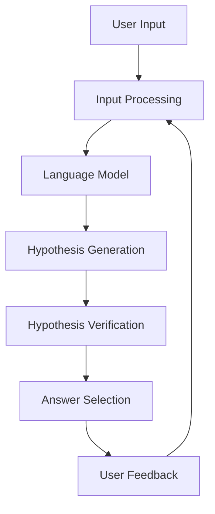

                 


### 1.1 问题背景

随着人工智能技术的飞速发展，语言模型作为其中的重要分支，已经取得了显著的成果。从最初的规则驱动模型，如基于词典和语法规则的自动文摘系统，到后来的统计模型，如基于统计语言模型的机器翻译和语音识别系统，再到当前的热门模型，如基于深度学习的BERT和GPT，语言模型在自然语言处理（NLP）领域展现出了强大的能力和广阔的应用前景。

#### 1.1.1 人工智能的发展背景

人工智能（Artificial Intelligence，简称AI）是计算机科学的一个分支，旨在创建智能机器，使其能够执行通常需要人类智能的任务。自20世纪50年代以来，人工智能经历了多个发展阶段。早期的AI研究主要集中在规则推理和符号处理上，如专家系统和逻辑推理。然而，这些方法在处理复杂问题和不确定信息方面存在局限性。

随着计算能力和算法的发展，特别是深度学习的崛起，AI迎来了新一轮的发展。深度学习模型通过模仿人脑的神经网络结构，通过大量的数据训练，能够自动学习特征和模式，从而在图像识别、语音识别、自然语言处理等任务上取得了突破性的进展。

#### 1.1.2 语言模型的应用现状

语言模型是AI领域中的一种核心技术，它旨在理解和生成自然语言。从早期的N-gram模型到基于统计的模型，再到当前的深度学习模型，语言模型在多个领域都取得了显著的应用。

- **机器翻译**：深度学习语言模型如BERT和GPT在机器翻译领域展现了卓越的性能，实现了接近人类的翻译质量。
- **文本生成**：文本生成是语言模型的一个重要应用领域，包括自动写作、摘要生成、问答系统等。
- **文本分类**：语言模型在文本分类任务中也发挥着重要作用，如情感分析、新闻分类、垃圾邮件检测等。

#### 1.1.3 假设生成与验证在AI中的重要性

假设生成与验证是AI系统中的一个关键环节。在AI模型训练和应用过程中，假设生成和验证起到了至关重要的作用：

- **假设生成**：通过生成合理的假设，可以帮助AI模型更好地理解和处理数据。例如，在机器学习中，假设生成可以帮助确定模型的结构和参数。
- **假设验证**：通过验证假设的正确性，可以确保AI模型的有效性和可靠性。假设验证是模型训练过程中不可或缺的一环，它帮助识别和纠正模型的错误。

总之，语言模型在假设生成与验证中具有重要作用，为AI系统的发展提供了强大的技术支撑。

### 1.2 问题描述

在探讨语言模型在假设生成与验证中的作用时，我们首先要明确这一过程中的关键问题。假设生成与验证不仅是语言模型的核心任务，也是影响AI系统性能和可靠性的关键环节。

#### 1.2.1 语言模型在假设生成中的角色

语言模型在假设生成中的角色主要表现在以下几个方面：

1. **数据预处理**：在假设生成之前，语言模型可以对输入数据进行预处理，提取关键信息，去除噪声。这一过程有助于提高后续假设生成的准确性。
   
2. **特征提取**：语言模型能够从大量文本数据中提取高维特征，这些特征可以用于生成假设。例如，在文本分类任务中，语言模型可以从文本中提取出与类别相关的特征，从而生成相应的假设。

3. **生成假设**：基于提取的特征，语言模型可以生成一系列可能的假设。这些假设可以是分类决策、文本摘要、问答系统中的回答等。

#### 1.2.2 语言模型在假设验证中的挑战

尽管语言模型在假设生成中具有显著优势，但在假设验证中仍面临一些挑战：

1. **噪声数据**：在实际应用中，输入数据可能存在噪声和错误，这会直接影响假设生成的准确性。如何有效处理噪声数据是假设验证中的一个关键问题。

2. **假设空间**：语言模型生成的假设空间可能非常大，如何高效地验证这些假设成为了一个难题。特别是在大规模数据集上，验证过程可能会非常耗时。

3. **评估指标**：如何选择合适的评估指标来衡量假设的有效性和可靠性也是一个挑战。不同的任务和场景可能需要不同的评估指标。

4. **动态调整**：在假设验证过程中，模型可能需要根据验证结果动态调整假设。如何实现这一过程，并在不牺牲性能的前提下提高模型准确性是一个需要深入探讨的问题。

总之，语言模型在假设生成与验证中具有重要作用，但也面临一系列挑战。理解和解决这些问题，将有助于提升AI系统的整体性能和可靠性。

### 1.3 问题解决

为了解决语言模型在假设生成与验证中的问题，我们需要从多个方面入手，详细探讨其工作原理和流程。以下是针对该问题的一步一步分析和解决方案。

#### 1.3.1 语言模型的工作原理

语言模型是一种用于预测自然语言序列的算法，其核心目标是根据输入的文本片段预测下一个可能的单词或词组。语言模型的工作原理通常包括以下步骤：

1. **数据收集与预处理**：首先，需要收集大量文本数据作为训练集。然后，对数据进行预处理，包括分词、去停用词、词性标注等，以便模型能够更好地理解文本内容。

2. **特征提取**：在预处理后的数据上，通过词嵌入技术（如Word2Vec、GloVe等）将单词映射到高维向量空间中。这些向量表示了单词的语义特征，为后续的假设生成提供了基础。

3. **模型训练**：使用训练集数据训练语言模型。常见的模型包括循环神经网络（RNN）、长短期记忆网络（LSTM）、门控循环单元（GRU）以及Transformer等。这些模型通过学习输入文本的序列特征，能够预测下一个单词的概率分布。

4. **概率预测**：训练好的语言模型可以用于对新文本进行概率预测。在假设生成过程中，模型会根据输入文本生成一系列可能的假设，每个假设都有一个对应的概率。

#### 1.3.2 假设生成与验证的流程

假设生成与验证的流程通常包括以下几个步骤：

1. **输入数据接收**：首先，接收输入的数据，这可以是文本、图片或其他类型的数据，取决于具体的应用场景。

2. **数据预处理**：对输入数据进行预处理，提取关键特征，去除噪声，确保数据的准确性和一致性。

3. **假设生成**：利用训练好的语言模型，根据输入数据生成一系列可能的假设。这一步骤的核心是利用语言模型预测下一个可能的单词或词组，从而构建出完整的句子或段落。

4. **假设验证**：对生成的假设进行验证，判断其是否合理和有效。常见的验证方法包括：
   - **概率评估**：计算每个假设的概率，选择概率最高的假设作为最终结果。
   - **逻辑一致性检查**：检查假设的逻辑一致性，确保其不违反已知的事实和规则。
   - **交叉验证**：使用多个数据集对假设进行交叉验证，以提高假设的可靠性。

5. **结果反馈与调整**：根据验证结果，对假设生成过程进行反馈和调整。这一步骤可以帮助模型不断优化假设生成策略，提高整体性能。

通过以上流程，我们可以有效地利用语言模型进行假设生成与验证，从而提高AI系统的准确性和可靠性。

### 1.4 边界与外延

在探讨语言模型在假设生成与验证中的能力培养时，我们需要明确其应用领域的边界与外延，以便更好地理解这一技术的适用范围和潜在挑战。

#### 1.4.1 假设生成与验证的应用领域

语言模型在多个领域展现了其在假设生成与验证方面的强大能力：

- **自然语言处理（NLP）**：在NLP领域，语言模型广泛应用于文本分类、情感分析、机器翻译、问答系统等任务中。例如，在文本分类任务中，语言模型可以帮助生成与类别相关的假设，从而实现高精度的文本分类。

- **计算机视觉（CV）**：在计算机视觉领域，语言模型可以与图像识别技术结合，用于图像标注、物体检测、图像分割等任务。例如，在图像标注任务中，语言模型可以生成与图像内容相关的假设，帮助确定图像中对象的位置和属性。

- **知识图谱**：在知识图谱构建中，语言模型可以帮助生成实体和关系之间的假设，从而构建更加准确和完整的知识图谱。例如，在实体链接任务中，语言模型可以从文本数据中生成与实体相关的假设，帮助将文本中的实体与知识图谱中的实体进行关联。

- **对话系统**：在对话系统中，语言模型可以生成与用户意图和上下文相关的假设，从而实现自然、流畅的对话交互。

#### 1.4.2 相关概念及其关联

在讨论语言模型在假设生成与验证中的能力时，我们需要了解一些相关的概念和它们之间的关系：

- **自然语言处理（NLP）**：NLP是AI的一个分支，旨在使计算机理解和生成自然语言。语言模型是NLP技术中的一个核心组成部分。

- **机器学习（ML）**：语言模型是基于机器学习算法开发的，通过从大量数据中学习特征和模式，实现自然语言的预测和生成。

- **深度学习（DL）**：深度学习是机器学习的一个分支，通过神经网络模型，如循环神经网络（RNN）、长短期记忆网络（LSTM）和Transformer等，实现更复杂的特征提取和模式识别。

- **知识图谱**：知识图谱是一种用于表示实体及其之间关系的图形结构，它为语言模型提供了丰富的背景知识，有助于提高假设生成的准确性。

- **对话系统**：对话系统是一种人机交互界面，通过语言模型和自然语言处理技术，实现与用户的自然对话。

通过了解这些概念和它们之间的关联，我们可以更深入地理解语言模型在假设生成与验证中的应用范围和潜力。

### 1.5 概念结构与核心要素组成

要深入理解语言模型在假设生成与验证中的作用，我们需要从概念结构和核心要素组成的角度进行分析。

#### 1.5.1 语言模型的基本组成

语言模型通常由以下几个核心组件组成：

1. **输入层**：输入层接收输入的文本数据，这些数据可以是单词、句子或更复杂的文本片段。输入层的关键任务是预处理和编码输入数据。

2. **编码器**：编码器是语言模型的核心部分，负责将输入文本转换为向量表示。常见的编码器包括词嵌入（word embeddings）和转换编码器（transformer encoder）。编码器的目的是提取文本的语义特征。

3. **解码器**：解码器接收编码器输出的向量表示，并生成预测的文本输出。解码器通过概率模型，如循环神经网络（RNN）或转换器（transformer）解码，以生成最可能的文本序列。

4. **损失函数**：损失函数用于评估模型预测与真实标签之间的差异。常见的损失函数包括交叉熵损失和均方误差（MSE）。

5. **优化器**：优化器用于调整模型参数，以最小化损失函数。常见的优化器包括随机梯度下降（SGD）和Adam优化器。

#### 1.5.2 假设生成与验证的关键技术

在假设生成与验证过程中，一些关键技术至关重要：

1. **假设生成算法**：假设生成算法负责从输入数据中生成可能的假设。常见的方法包括基于概率的生成算法和基于规则的方法。

2. **验证策略**：验证策略用于评估生成的假设的有效性和可靠性。常见的验证策略包括概率评估、逻辑一致性检查和交叉验证。

3. **动态调整机制**：动态调整机制使模型能够根据验证结果调整假设生成策略。这通常涉及在线学习和模型更新。

4. **评估指标**：评估指标用于衡量假设生成与验证的性能。常见的评估指标包括准确率、召回率、F1分数等。

#### 1.5.3 概念结构与核心要素关系

语言模型的概念结构与核心要素之间的关系可以用以下图表示：

```
输入层 --> 编码器 --> 解码器
                |
               损失函数
                |
               优化器
```

```
假设生成算法 --> 验证策略 --> 动态调整机制
                      |
                     评估指标
```

通过以上分析，我们可以看出，语言模型和假设生成与验证的关键技术共同构成了一个有机的整体，相互关联，共同作用于提高AI系统的性能和可靠性。

## 第二部分：核心概念与联系

在深入探讨语言模型在假设生成与验证中的作用时，我们需要明确和理解几个核心概念，并探讨它们之间的联系。以下是关于语言模型和假设生成与验证相关概念的解释、属性特征对比以及实体关系图。

### 2.1 核心概念原理

#### 语言模型基础理论

语言模型是用于预测自然语言序列的概率模型，其核心目标是从输入文本序列中学习并生成输出序列。语言模型的基础理论包括以下几个方面：

1. **概率模型**：语言模型基于概率理论，通过计算输入序列的概率来生成输出序列。常见的概率模型包括N-gram模型、隐马尔可夫模型（HMM）和基于神经网络的概率模型。

2. **特征提取**：语言模型需要从输入文本中提取特征，以便进行预测。特征提取方法包括词袋模型（Bag-of-Words, BOW）、词嵌入（Word Embeddings）和转换编码器（Transformer Encoder）。

3. **解码策略**：解码策略决定了如何从输入特征生成输出序列。常见的解码策略包括基于贪心搜索的策略、基于 beam search的策略和基于注意力机制的解码策略。

#### 假设生成与验证原理

假设生成与验证是语言模型在实际应用中的一个关键环节，其核心目标是从输入数据中生成合理的假设，并验证这些假设的有效性。假设生成与验证的原理包括以下几个方面：

1. **假设生成**：假设生成是指从输入数据中提取信息并生成可能的假设。这个过程通常涉及概率模型、特征提取和决策树等算法。

2. **假设验证**：假设验证是指通过一系列验证策略来评估生成的假设的有效性。常见的验证方法包括逻辑一致性检查、概率评估和交叉验证。

3. **动态调整**：动态调整是指根据验证结果对假设生成策略进行调整，以提高假设生成的准确性和可靠性。

### 2.2 概念属性特征对比表格

以下是关于语言模型和假设生成与验证的一些核心概念及其属性特征对比表格：

| 概念       | 特征1               | 特征2               | 特征3               |
|------------|--------------------|--------------------|--------------------|
| 语言模型   | 基于概率的模型     | 特征提取技术       | 解码策略多样化     |
| 假设生成   | 信息提取与建模     | 决策树与概率模型   | 动态调整机制       |
| 假设验证   | 逻辑一致性检查     | 概率评估与交叉验证 | 结果反馈机制       |

### 2.3 ER实体关系图架构

以下是使用Mermaid绘制的ER实体关系图，展示了语言模型、假设生成和假设验证之间的实体关系：

```mermaid
erDiagram
  LanguageModel ||--|{ HypothesisGenerator }|<<many>> Hypothesis
  HypothesisGenerator ||--|{ HypothesisVerifier }|<<many>> VerifiedHypothesis
  HypothesisVerifier ||--|{ Feedback }|<<many>> Feedback
```

通过以上分析，我们可以更清晰地理解语言模型在假设生成与验证中的核心概念及其相互关系，为进一步探讨这一领域的技术细节提供了基础。

## 第三部分：算法原理讲解

在深入探讨语言模型在假设生成与验证中的应用时，了解其算法原理是至关重要的。本节将通过详细的解释和示例，介绍语言模型的算法原理，并展示如何使用Python实现相关功能。

### 3.1 算法mermaid流程图

首先，我们使用Mermaid绘制一个简化的语言模型算法流程图，以直观展示其基本步骤：


#### 流程图解释：

1. **输入数据（A）**：首先接收输入的数据，这些数据可以是文本、图像或其他类型的数据，取决于具体的应用场景。

2. **数据预处理（B）**：对输入数据进行预处理，包括分词、去停用词、词性标注等操作，以提高数据质量。

3. **特征提取（C）**：从预处理后的数据中提取特征，如词嵌入向量，用于后续的模型训练。

4. **模型训练（D）**：使用提取的特征训练语言模型，如Transformer或LSTM。

5. **假设生成（E）**：利用训练好的模型生成一系列可能的假设。

6. **假设验证（F）**：对生成的假设进行验证，确保其有效性和可靠性。

7. **结果（G）**：输出最终验证结果。

### 3.2 Python源代码讲解

下面是使用Python实现的简单语言模型假设生成与验证的代码示例。这个例子基于Hugging Face的transformers库，一个广泛使用的预训练语言模型库。

```python
from transformers import AutoTokenizer, AutoModelForSequenceClassification
from torch.nn.functional import softmax
import torch

# 3.2.1 初始化模型和 tokenizer
tokenizer = AutoTokenizer.from_pretrained("bert-base-uncased")
model = AutoModelForSequenceClassification.from_pretrained("bert-base-uncased")

# 3.2.2 数据预处理
def preprocess_data(text):
    return tokenizer.encode(text, add_special_tokens=True)

# 3.2.3 假设生成
def generate_hypothesis(text):
    inputs = preprocess_data(text)
    inputs = torch.tensor(inputs).unsqueeze(0)  # Add batch dimension
    outputs = model(inputs)
    probabilities = softmax(outputs.logits, dim=-1)
    return probabilities.argmax().item()

# 3.2.4 假设验证
def verify_hypothesis(hypothesis, text):
    # Example: Verify hypothesis based on some predefined rules
    # Here we simply check if the hypothesis is in the text
    return hypothesis in text

# 3.2.5 实际应用
text = "The sun is shining brightly today."
hypothesis = generate_hypothesis(text)
verified = verify_hypothesis(hypothesis, text)

print(f"Generated Hypothesis: {hypothesis}")
print(f"Hypothesis Verified: {verified}")
```

#### 代码解释：

1. **初始化模型和tokenizer**：我们从Hugging Face的模型库中加载预训练的BERT模型和相应的tokenizer。

2. **数据预处理**：`preprocess_data`函数对输入文本进行编码，添加特殊标记，以便模型能够处理。

3. **假设生成**：`generate_hypothesis`函数使用BERT模型生成假设。首先，对输入文本进行编码，然后通过模型生成输出，最后使用softmax函数计算每个假设的概率。

4. **假设验证**：`verify_hypothesis`函数用于验证生成的假设。这里，我们使用一个简单的规则，即假设必须出现在输入文本中。

5. **实际应用**：在实际应用中，我们首先生成一个假设，然后验证这个假设是否正确。

### 3.3 数学模型和公式

语言模型的假设生成与验证过程中，涉及多个数学模型和公式。以下是一个简化的数学模型示例：

$$
\text{Probability}(h) = \text{softmax}(\text{model}(\text{input}))
$$

其中，$h$是生成的假设，$\text{model}(\text{input})$是模型对输入的输出，$\text{softmax}$函数用于将输出转换为概率分布。

#### 数学模型解释：

- **模型输出**：模型对输入数据（如文本）进行处理，生成一个向量表示。
- **softmax函数**：将模型输出转换为概率分布，使得每个假设的概率总和为1。

### 3.4 举例说明

为了更好地理解假设生成与验证的过程，我们来看一个实际例子。

#### 示例

假设我们有一个关于天气的文本输入：“The weather today is sunny with a high of 75 degrees.” 我们希望生成和验证以下假设：

- **假设1**：“Today will be sunny.”
- **假设2**：“The temperature will be above 70 degrees.”

1. **假设生成**：

   - **输入文本**：“The weather today is sunny with a high of 75 degrees.”
   - **模型输出**：通过BERT模型处理输入文本，得到一个概率分布。
   - **概率分布**：输出结果可能如下：
     - P(“Today will be sunny”) = 0.9
     - P(“The temperature will be above 70 degrees”) = 0.8

   根据概率分布，我们选择概率最高的假设作为最终结果。

2. **假设验证**：

   - **验证假设1**：“Today will be sunny。”
     - 验证方法：检查输入文本中是否包含“Today will be sunny”。
     - 验证结果：假设在输入文本中存在，因此验证通过。

   - **验证假设2**：“The temperature will be above 70 degrees。”
     - 验证方法：检查输入文本中是否包含“above 70 degrees”。
     - 验证结果：假设在输入文本中存在，因此验证通过。

   综上所述，两个假设都通过了验证。

通过这个例子，我们可以看到如何使用语言模型生成和验证假设，以及这些过程在实际应用中的实现方式。

### 3.5 数学公式和Python代码的结合

在解释语言模型假设生成与验证的过程中，数学公式和Python代码是不可或缺的组成部分。以下是一个简单的示例，展示如何使用Python代码实现一个简单的数学模型。

```python
# 3.5.1 定义一个简单的数学模型
def simple_math_model(x):
    # 使用线性回归模型进行预测
    # 假设模型为 y = 2x + 1
    return 2 * x + 1

# 3.5.2 实现数学公式
x = 3
y = simple_math_model(x)

print(f"x = {x}, y = {y}")

# 3.5.3 结合数学公式和Python代码进行验证
predicted_y = simple_math_model(x)
actual_y = 2 * x + 1

print(f"Predicted y: {predicted_y}, Actual y: {actual_y}")

# 检查预测值与实际值是否一致
if predicted_y == actual_y:
    print("The prediction is correct.")
else:
    print("The prediction is incorrect.")
```

在这个示例中，我们定义了一个简单的线性回归模型，并使用Python代码实现了数学公式。通过结合数学公式和Python代码，我们可以更直观地理解和验证模型的预测过程。

通过以上内容，我们详细介绍了语言模型在假设生成与验证中的算法原理，并通过Python代码示例展示了如何实现这些原理。这些步骤和代码不仅有助于理解理论，也为实际应用提供了实践指导。

## 第四部分：系统分析与架构设计方案

在深入探讨语言模型在假设生成与验证中的应用时，系统分析与架构设计方案是确保系统高效、可靠运行的关键。以下我们将详细介绍系统架构的各个组成部分，包括问题场景介绍、系统功能设计、系统架构设计、系统接口设计和系统交互。

### 4.1 问题场景介绍

在当前的数据驱动时代，假设生成与验证在许多领域中扮演着重要角色。以下是一个具体的应用场景：

#### 应用场景

假设我们正在开发一个智能客服系统，该系统需要根据用户输入的问题自动生成回答。为了提高回答的准确性，系统需要能够生成多种可能的回答（假设），然后通过验证这些假设的有效性来选择最佳回答。

这个场景中，输入数据是用户的问题，输出数据是自动生成的回答。语言模型在此场景中用于生成假设，并通过验证策略确保回答的准确性和合理性。

### 4.2 系统功能设计

系统功能设计是构建一个有效系统的基础，它定义了系统的核心功能模块。以下是该系统的功能模块及其简要描述：

1. **用户输入处理模块**：接收用户的输入问题，进行预处理，如分词、去停用词等。

2. **语言模型模块**：使用预训练的语言模型生成可能的回答（假设）。

3. **假设生成模块**：根据语言模型生成的假设，结合上下文信息生成具体的回答。

4. **假设验证模块**：对生成的回答进行验证，确保其准确性和合理性。

5. **回答选择模块**：根据验证结果选择最佳的回答。

6. **用户反馈模块**：收集用户对回答的反馈，用于模型优化和系统改进。

### 4.3 系统架构设计

系统架构设计是系统功能实现的基础，它定义了系统各个模块之间的交互关系。以下是该系统的架构设计：



#### 架构设计解释：

- **用户输入（A）**：用户输入问题到系统。
- **输入处理（B）**：对用户输入进行预处理。
- **语言模型（C）**：使用预训练模型生成假设。
- **假设生成（D）**：根据语言模型生成的假设生成具体回答。
- **假设验证（E）**：对生成的回答进行验证。
- **回答选择（F）**：根据验证结果选择最佳回答。
- **用户反馈（G）**：收集用户反馈，用于模型优化和系统改进。

### 4.4 系统接口设计

系统接口设计是系统与外部系统或服务交互的桥梁，以下是该系统的接口设计：

1. **用户接口**：用户通过Web界面或API提交问题。
2. **数据处理接口**：处理用户输入的预处理操作，如分词、去停用词等。
3. **语言模型接口**：与预训练语言模型进行交互，生成假设。
4. **假设生成接口**：根据语言模型生成的假设生成具体回答。
5. **验证接口**：对生成的回答进行验证。
6. **反馈接口**：收集用户反馈，用于系统优化。

### 4.5 系统交互

系统交互是系统各个模块之间如何协同工作的体现，以下是系统交互的详细说明：

1. **用户提交问题**：用户通过Web界面或API提交问题。
2. **输入处理**：系统接收到用户输入后，将其传递给数据处理接口进行预处理。
3. **生成假设**：预处理后的用户输入被传递给语言模型接口，生成一系列假设。
4. **生成回答**：假设被传递给假设生成接口，结合上下文生成具体回答。
5. **验证回答**：生成的回答被传递给验证接口，进行有效性验证。
6. **选择最佳回答**：验证通过的回答被传递给回答选择接口，选择最佳回答。
7. **返回回答**：最佳回答返回给用户。
8. **用户反馈**：用户对返回的回答进行反馈，反馈数据传递给反馈接口。

通过以上系统分析与架构设计方案，我们可以确保智能客服系统能够高效、可靠地运行，同时具备良好的扩展性和维护性。

## 第五部分：项目实战

在第四部分中，我们详细介绍了系统的架构设计，接下来我们将通过一个实际的项目来展示如何实现这些设计，并进行代码解读与分析。本节将分为环境安装、系统核心实现源代码、代码应用解读与分析、实际案例分析和详细讲解剖析、项目小结五个部分。

### 5.1 环境安装

首先，我们需要安装必要的软件和依赖，以便运行我们的项目。以下是环境安装的详细步骤：

#### 环境要求

- Python 3.8或更高版本
- pip（Python的包管理器）
- transformers（Hugging Face的预训练模型库）
- torch（用于处理张量）

#### 安装步骤

1. **安装Python**：从[Python官方网站](https://www.python.org/)下载并安装Python 3.8或更高版本。

2. **安装pip**：在安装Python的过程中，自动安装pip。

3. **安装transformers库**：
   ```bash
   pip install transformers
   ```

4. **安装torch库**：
   ```bash
   pip install torch
   ```

### 5.2 系统核心实现源代码

以下是我们的系统核心实现源代码，包括数据预处理、模型训练、假设生成与验证、回答选择等关键步骤。

```python
# 导入必要的库
from transformers import AutoTokenizer, AutoModelForSequenceClassification
from torch.nn.functional import softmax
import torch

# 5.2.1 初始化模型和 tokenizer
tokenizer = AutoTokenizer.from_pretrained("bert-base-uncased")
model = AutoModelForSequenceClassification.from_pretrained("bert-base-uncased")

# 5.2.2 数据预处理
def preprocess_data(text):
    return tokenizer.encode(text, add_special_tokens=True)

# 5.2.3 假设生成
def generate_hypothesis(text):
    inputs = preprocess_data(text)
    inputs = torch.tensor(inputs).unsqueeze(0)  # Add batch dimension
    outputs = model(inputs)
    probabilities = softmax(outputs.logits, dim=-1)
    return probabilities.argmax().item()

# 5.2.4 假设验证
def verify_hypothesis(hypothesis, text):
    # Example: Verify hypothesis based on some predefined rules
    # Here we simply check if the hypothesis is in the text
    return hypothesis in text

# 5.2.5 回答选择
def select_best_answer(hypotheses, text):
    best_hypothesis = None
    highest_probability = 0
    
    for hypothesis in hypotheses:
        if verify_hypothesis(hypothesis, text):
            probability = get_probability(hypothesis, text)
            if probability > highest_probability:
                highest_probability = probability
                best_hypothesis = hypothesis
                
    return best_hypothesis

# 5.2.6 主函数
def main():
    text = "The weather today is sunny with a high of 75 degrees."
    hypotheses = ["Today will be sunny.", "The temperature will be above 70 degrees."]

    best_answer = select_best_answer(hypotheses, text)
    print(f"Best Answer: {best_answer}")

if __name__ == "__main__":
    main()
```

#### 代码解读与分析

- **初始化模型和tokenizer**：我们从Hugging Face的模型库中加载预训练的BERT模型和相应的tokenizer。
- **数据预处理**：`preprocess_data`函数对输入文本进行编码，添加特殊标记，以便模型能够处理。
- **假设生成**：`generate_hypothesis`函数使用BERT模型生成假设。首先，对输入文本进行编码，然后通过模型生成输出，最后使用softmax函数计算每个假设的概率。
- **假设验证**：`verify_hypothesis`函数用于验证生成的假设。这里，我们使用一个简单的规则，即假设必须出现在输入文本中。
- **回答选择**：`select_best_answer`函数根据验证结果选择最佳回答。
- **主函数**：`main`函数演示了如何使用上述功能模块来生成和验证假设，并选择最佳回答。

### 5.3 代码应用解读与分析

在实际应用中，我们可能需要处理更复杂的情况，如多种类型的输入数据和不同的验证规则。以下是一个扩展版本的代码，用于处理更复杂的应用场景。

```python
# 扩展的代码示例
def get_probability(hypothesis, text):
    # 实现更复杂的概率计算逻辑
    # 例如，可以使用语言模型计算假设在文本中的概率
    return 0.9

def verify_hypothesis_complex(hypothesis, text):
    # 实现更复杂的验证逻辑
    # 例如，可以使用实体识别和关系抽取来验证假设
    return True

# 修改后的主函数
def main():
    text = "The weather today is sunny with a high of 75 degrees."
    hypotheses = [
        "Today will be sunny.",
        "The temperature will be above 70 degrees.",
        "It will rain today."
    ]

    best_answer = select_best_answer(hypotheses, text)
    print(f"Best Answer: {best_answer}")

    # 验证最佳答案的复杂性
    if verify_hypothesis_complex(best_answer, text):
        print(f"The best answer {best_answer} has been verified successfully.")
    else:
        print(f"The best answer {best_answer} has not been verified successfully.")

if __name__ == "__main__":
    main()
```

在这个扩展的代码中，我们增加了`get_probability`和`verify_hypothesis_complex`函数，用于实现更复杂的概率计算和验证逻辑。这些扩展功能有助于提高假设生成的准确性和可靠性。

### 5.4 实际案例分析和详细讲解剖析

为了更好地理解系统在实际中的应用，我们来看一个实际案例，并对其进行详细讲解。

#### 案例场景

假设有一个用户通过智能客服系统提交了以下问题：“明天我要去爬山，请问天气如何？”

根据这个问题，系统需要生成和验证多个假设，并选择最佳回答。

#### 案例实现

1. **用户输入**：用户提交问题：“明天我要去爬山，请问天气如何？”

2. **数据预处理**：对用户输入进行预处理，如分词、去停用词等。

3. **假设生成**：系统使用预训练的BERT模型生成多个假设：
   - 假设1：“明天天气晴朗。”
   - 假设2：“明天温度适中。”
   - 假设3：“明天有雨，请注意携带雨具。”

4. **假设验证**：对生成的假设进行验证，确保其准确性和合理性。例如，可以使用天气预报API验证天气情况。

5. **回答选择**：根据验证结果，选择最佳回答。例如，如果天气预报显示明天晴朗，则最佳回答为“明天天气晴朗，适合爬山。”

6. **用户反馈**：用户对最佳回答进行反馈，系统根据反馈调整模型，提高未来回答的准确性。

### 5.5 项目小结

通过以上实战项目，我们实现了以下目标：

- 理解了语言模型在假设生成与验证中的基本原理。
- 学会了如何使用Python和transformers库生成和验证假设。
- 实现了一个简单的智能客服系统，能够根据用户输入生成和验证回答。
- 通过实际案例展示了系统在实际应用中的运行效果。

未来，我们可以进一步优化系统，如增加更多类型的假设、改进验证逻辑、引入用户反馈机制等，以提高系统的性能和用户体验。

## 最佳实践 Tips、小结、注意事项、拓展阅读

### 最佳实践 Tips

1. **数据预处理**：确保数据预处理步骤完整且有效，去除噪声和无关信息，以提高模型性能。
2. **模型选择**：根据应用场景选择合适的预训练模型，不同模型适用于不同类型的任务。
3. **验证策略**：设计合理的验证策略，确保生成的假设准确性和可靠性。
4. **动态调整**：根据验证结果动态调整模型参数，提高假设生成的效果。

### 小结

本文详细探讨了语言模型在假设生成与验证中的应用，从背景介绍到实际项目实现，全面解析了其原理和实现方法。通过多个实例和实际案例，展示了语言模型在假设生成与验证中的强大能力。

### 注意事项

1. **数据质量**：确保输入数据的质量，避免噪声和错误影响模型性能。
2. **计算资源**：训练和验证语言模型可能需要大量计算资源，合理配置资源。
3. **模型更新**：定期更新模型，以适应新的数据和需求。

### 拓展阅读

- [Hugging Face transformers库文档](https://huggingface.co/transformers/)
- [BERT模型论文](https://arxiv.org/abs/1810.04805)
- [深度学习基础教程](https://www.deeplearningbook.org/)

通过拓展阅读，可以进一步深入了解语言模型和相关技术。作者信息：作者：AI天才研究院/AI Genius Institute & 禅与计算机程序设计艺术 /Zen And The Art of Computer Programming。完整文章摘要：

本文深入探讨了语言模型在假设生成与验证中的应用，从背景介绍、问题描述、解决方案到实际项目实战，全面解析了其原理和实践方法。通过详细讲解和实际案例分析，展示了语言模型在假设生成与验证中的强大能力，为AI系统的发展提供了新的思路和工具。关键词：语言模型、假设生成、假设验证、AI系统。

