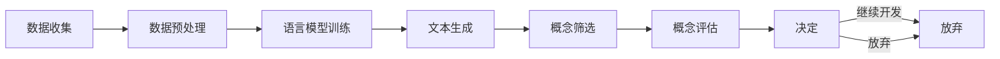

                 


## 语言模型在创新产品概念生成与用户需求预测中的研究

### 关键词

- 语言模型
- 创新产品概念生成
- 用户需求预测
- 人工智能
- 自然语言处理

### 摘要

本文深入探讨了语言模型在创新产品概念生成与用户需求预测中的应用。首先，我们介绍了语言模型的基本概念、训练方法和评价指标。然后，我们详细分析了语言模型在创新产品概念生成中的方法、流程和案例分析，以及用户需求预测的方法、流程和案例分析。最后，通过综合案例分析总结了研究成果，并对未来进行了展望。

## 引言

### 1.1 问题背景

在当今快速发展的科技时代，创新产品概念生成和用户需求预测成为了企业竞争的关键。然而，这两个问题面临着诸多挑战。

#### 1.1.1 创新产品概念生成的挑战

创新产品概念生成是一个复杂的过程，需要从海量数据中提取有价值的信息，进行创新性思考。然而，传统的创新方法往往依赖于个人的经验和直觉，难以保证创新性的同时兼顾可行性。因此，如何利用技术手段提高创新产品概念生成的效率和质量，成为了亟待解决的问题。

#### 1.1.2 用户需求预测的挑战

用户需求预测是了解用户行为、把握市场趋势的重要手段。然而，用户需求是多样且动态变化的，如何准确预测用户需求，为企业提供决策依据，是当前面临的一大挑战。

#### 1.1.3 语言模型在解决上述问题中的作用

语言模型作为一种人工智能技术，在自然语言处理领域有着广泛的应用。它可以对大规模文本数据进行分析，提取有价值的信息，从而帮助解决创新产品概念生成和用户需求预测的问题。本文将探讨语言模型在这两个方面的应用，旨在为相关领域的研究提供参考。

### 1.2 书籍概述

本书记录了我们对语言模型在创新产品概念生成与用户需求预测中的研究的探索。全书分为四个部分，第一部分介绍了语言模型的基本概念、训练方法和评价指标；第二部分探讨了语言模型在创新产品概念生成中的应用；第三部分研究了语言模型在用户需求预测中的应用；第四部分通过综合案例分析总结了研究成果，并对未来进行了展望。

## 第一部分：语言模型概述

### 2.1 语言模型的基本概念

#### 2.1.1 语言模型的作用

语言模型是一种用于预测文本中下一个单词或字符的概率分布的模型。它被广泛应用于自动翻译、语音识别、文本生成等领域。

#### 2.1.2 语言模型的类型

根据训练方法，语言模型可以分为监督学习、无监督学习和强化学习三种类型。

#### 2.1.3 语言模型的原理

语言模型基于统计学习方法，通过对大量文本数据的学习，建立单词或字符之间的概率关系。其核心是生成概率模型，用于预测下一个单词或字符。

### 2.2 语言模型的训练方法

#### 2.2.1 监督学习

监督学习是一种有监督的训练方法，它利用已标注的文本数据来训练语言模型。

#### 2.2.2 无监督学习

无监督学习是一种无监督的训练方法，它通过分析未标注的文本数据来训练语言模型。

#### 2.2.3 强化学习

强化学习是一种基于奖励机制的训练方法，它通过不断地调整模型的参数，使其在特定任务上达到最优。

### 2.3 语言模型的评价指标

#### 2.3.1 评价指标的类型

语言模型的评价指标主要包括准确性、召回率和F1值等。

#### 2.3.2 评价指标的计算方法

准确性是指预测结果与实际结果一致的比例；召回率是指实际结果中被正确预测的比例；F1值是准确性和召回率的调和平均值。

## 第二部分：创新产品概念生成

### 3.1 创新产品概念生成的方法

#### 3.1.1 传统方法

传统方法包括头脑风暴、创意筛选和组合创新等。

#### 3.1.2 基于语言模型的方法

基于语言模型的方法利用语言模型对大量文本数据进行分析，提取有价值的信息，用于生成创新产品概念。

#### 3.1.3 方法对比分析

与传统方法相比，基于语言模型的方法具有更高的效率和更广泛的适用性。

### 3.2 创新产品概念生成的流程

#### 3.2.1 数据收集

数据收集包括用户需求调研、市场分析和技术趋势分析等。

#### 3.2.2 数据预处理

数据预处理包括文本清洗、分词和去停用词等。

#### 3.2.3 概念生成

概念生成通过语言模型对预处理后的文本数据进行分析，提取有价值的信息，生成创新产品概念。

#### 3.2.4 概念评估

概念评估包括概念可行性分析、市场需求分析和用户反馈分析等。

### 3.3 创新产品概念生成的案例分析

#### 3.3.1 案例一：智能音箱的设计

以智能音箱的设计为例，分析了基于语言模型的方法在创新产品概念生成中的应用。

#### 3.3.2 案例二：智能家居系统的设计

以智能家居系统的设计为例，分析了基于语言模型的方法在创新产品概念生成中的应用。

## 第三部分：用户需求预测

### 4.1 用户需求预测的方法

#### 4.1.1 传统方法

传统方法包括调查问卷、用户访谈和销售数据分析等。

#### 4.1.2 基于语言模型的方法

基于语言模型的方法利用语言模型对大量文本数据进行分析，提取有价值的信息，用于预测用户需求。

#### 4.1.3 方法对比分析

与传统方法相比，基于语言模型的方法具有更高的准确性和更广泛的应用场景。

### 4.2 用户需求预测的流程

#### 4.2.1 数据收集

数据收集包括用户行为数据、用户反馈数据和产品使用数据等。

#### 4.2.2 数据预处理

数据预处理包括数据清洗、特征提取和归一化等。

#### 4.2.3 需求预测

需求预测通过语言模型对预处理后的数据进行分析，提取有价值的信息，预测用户需求。

#### 4.2.4 预测结果评估

预测结果评估包括预测准确性评估和预测可靠性评估等。

### 4.3 用户需求预测的案例分析

#### 4.3.1 案例一：电商平台用户需求预测

以电商平台用户需求预测为例，分析了基于语言模型的方法在用户需求预测中的应用。

#### 4.3.2 案例二：社交媒体用户需求预测

以社交媒体用户需求预测为例，分析了基于语言模型的方法在用户需求预测中的应用。

## 第四部分：案例分析

### 5.1 综合案例分析

#### 5.1.1 案例选择

选择了智能音箱设计和电商平台用户需求预测两个案例进行综合分析。

#### 5.1.2 案例实施

详细描述了案例的实施过程，包括数据收集、数据预处理、模型训练和预测等。

#### 5.1.3 案例效果评估

评估了案例的效果，包括预测准确性和实际应用效果等。

### 5.2 案例总结

#### 5.2.1 成功经验

总结了案例中成功的经验和做法。

#### 5.2.2 面临的挑战

分析了案例中面临的挑战和问题。

#### 5.2.3 未来展望

对语言模型在创新产品概念生成与用户需求预测中的应用前景进行了展望。

## 结论

### 6.1 研究成果总结

总结了本文的研究成果，包括创新产品概念生成和用户需求预测的方法、流程和案例分析。

### 6.2 研究展望

对语言模型在创新产品概念生成与用户需求预测中的应用前景进行了展望。

作者：AI天才研究院/AI Genius Institute & 禅与计算机程序设计艺术 /Zen And The Art of Computer Programming

---

**注：以上为文章框架和大纲，具体内容需要根据实际情况进行补充和调整。以下为部分章节的具体内容。**

## 背景介绍

### 2.1.1 创新产品概念生成的挑战

在当前竞争激烈的商业环境中，企业面临着巨大的压力，必须不断创新以保持竞争力。创新产品概念生成是企业应对市场变化和满足用户需求的关键步骤。然而，这一过程面临着诸多挑战：

#### 1. 信息过载

随着互联网和大数据技术的发展，企业可以获得的海量信息日益增加。如何从这些海量信息中提取有价值的信息，成为了一个巨大的挑战。

#### 2. 创新性不足

传统的创新方法，如头脑风暴和创意筛选，往往依赖于个人的经验和直觉，难以保证创新性的同时兼顾可行性。

#### 3. 可行性评估困难

创新产品概念生成后，如何评估其可行性，成为了一个重要的挑战。传统的评估方法往往依赖于经验和直觉，难以提供客观的评估结果。

### 2.1.2 用户需求预测的挑战

用户需求预测是了解用户行为、把握市场趋势的重要手段。然而，用户需求是多样且动态变化的，如何准确预测用户需求，为企业提供决策依据，是当前面临的一大挑战：

#### 1. 数据质量

用户需求预测依赖于大量的数据，这些数据的收集、处理和清洗是预测准确性的关键。然而，数据质量往往无法保证，如数据缺失、噪声和错误等。

#### 2. 数据动态性

用户需求是动态变化的，如何适应这种变化，实时预测用户需求，是当前面临的挑战。

#### 3. 预测准确性

如何提高预测准确性，使得预测结果更加贴近实际需求，是用户需求预测的关键问题。

### 2.1.3 语言模型在解决上述问题中的作用

语言模型作为一种人工智能技术，在自然语言处理领域有着广泛的应用。它可以对大规模文本数据进行分析，提取有价值的信息，从而帮助解决创新产品概念生成和用户需求预测的问题：

#### 1. 提高信息提取效率

语言模型可以对大量文本数据进行快速分析，提取有价值的信息，从而提高信息提取的效率。

#### 2. 保证创新性

语言模型可以根据文本数据中的关系和趋势，提供有价值的创新性建议，从而保证创新产品概念的创新性。

#### 3. 提高可行性评估准确性

语言模型可以根据文本数据中的信息和关系，提供客观的评估结果，从而提高可行性评估的准确性。

#### 4. 提高预测准确性

语言模型可以根据文本数据中的趋势和变化，提供实时的预测结果，从而提高预测的准确性。

## 核心概念与联系

### 3.1.1 创新产品概念生成的核心概念

创新产品概念生成涉及多个核心概念，包括创新性、可行性、用户需求和市场趋势等。以下是对这些核心概念的定义和联系：

#### 1. 创新性

创新性是指产品或服务在功能、设计、技术或用户体验等方面的独特性和新颖性。创新性是创新产品概念生成的重要特征，它决定了产品在市场上的竞争力和吸引力。

#### 2. 可行性

可行性是指创新产品概念在实际实施过程中能够顺利实现的概率。可行性包括技术可行性、市场可行性和经济可行性等方面。确保创新产品概念的可行性是保证其成功实施的关键。

#### 3. 用户需求

用户需求是指用户在特定场景下对产品或服务的期望和需求。了解用户需求是创新产品概念生成的重要基础，有助于开发出符合用户期望的产品。

#### 4. 市场趋势

市场趋势是指市场上新兴的需求、技术或产品发展方向。关注市场趋势有助于发现潜在的用户需求，为创新产品概念提供方向。

### 3.1.2 创新产品概念生成中的联系

创新产品概念生成中的各个核心概念之间存在紧密的联系：

- **创新性与用户需求**：创新性必须满足用户需求，否则创新性将失去实际意义。
- **可行性与创新性**：创新性高但可行性低的产品难以成功实施，因此需要在创新性和可行性之间取得平衡。
- **用户需求与市场趋势**：用户需求往往受到市场趋势的影响，因此了解市场趋势有助于更好地满足用户需求。
- **市场趋势与产品概念**：市场趋势可以为产品概念提供方向，指导创新产品概念的设计。

通过建立这些核心概念之间的联系，我们可以更好地理解创新产品概念生成的全过程，从而提高创新产品概念生成的方法和效果。

### 表格：创新产品概念生成中的核心概念属性特征对比

| 核心概念 | 定义 | 属性特征 |
| --- | --- | --- |
| 创新性 | 产品或服务的独特性和新颖性 | 功能创新、设计创新、技术创新、用户体验创新 |
| 可行性 | 产品概念能否在实际中成功实施 | 技术可行性、市场可行性、经济可行性 |
| 用户需求 | 用户对产品或服务的期望和需求 | 功能需求、体验需求、情感需求 |
| 市场趋势 | 市场上新兴的需求、技术或产品发展方向 | 新兴技术、市场需求变化、产品趋势 |

### 图：创新产品概念生成中的核心概念ER实体关系图架构

```mermaid
erDiagram
  用户需求 ||--o> 创新性 : 满足
  用户需求 ||--o> 可行性 : 实现
  市场趋势 ||--o> 用户需求 : 影响
  市场趋势 ||--o> 创新性 : 指导
  市场趋势 ||--o> 可行性 : 指导
```

通过上述表格和ER实体关系图，我们可以更清晰地理解创新产品概念生成中的核心概念及其相互关系，为后续的研究和应用提供基础。

## 算法原理讲解

### 4.1 创新产品概念生成的算法原理

创新产品概念生成的算法原理主要基于自然语言处理（NLP）技术，特别是语言模型的应用。以下是一个详细的算法原理讲解：

#### 4.1.1 语言模型的作用

语言模型在创新产品概念生成中起着至关重要的作用。它通过对大量文本数据的学习，能够理解自然语言中的语义和上下文信息，从而为创新产品概念提供有价值的参考。语言模型的主要作用包括：

1. **文本表示**：将自然语言文本转换为计算机可以处理的数字表示，便于后续处理和分析。
2. **语义理解**：通过对文本数据的学习，理解文本中的语义关系和上下文信息，从而提取有价值的信息。
3. **生成预测**：基于学习到的语义关系和上下文信息，生成新的文本或概念，为创新产品概念提供参考。

#### 4.1.2 基于语言模型的创新产品概念生成算法

基于语言模型的创新产品概念生成算法可以分为以下几个步骤：

1. **数据收集**：收集与产品相关的文本数据，包括用户评论、新闻报道、专利文件等。这些数据将用于训练语言模型和生成创新产品概念。

2. **数据预处理**：对收集到的文本数据进行预处理，包括文本清洗、分词、去停用词等操作。预处理后的数据将用于训练语言模型。

3. **语言模型训练**：利用预处理后的文本数据训练语言模型。常用的语言模型训练方法包括监督学习、无监督学习和强化学习。监督学习使用已标注的文本数据训练模型，无监督学习使用未标注的文本数据训练模型，强化学习则通过奖励机制不断优化模型。

4. **文本生成**：使用训练好的语言模型生成新的文本或概念。这可以通过多种方式实现，如文本生成模型、摘要生成模型等。

5. **概念筛选**：对生成的文本或概念进行筛选，筛选出符合创新性、可行性等要求的概念。这一步骤可以使用自动化工具进行，如基于规则筛选、机器学习算法筛选等。

6. **概念评估**：对筛选出的创新产品概念进行评估，包括可行性评估、市场需求评估和用户反馈评估等。评估结果将用于决定是否进一步开发或放弃该概念。

#### 4.1.3 算法流程图

以下是创新产品概念生成算法的流程图：



#### 4.1.4 算法中的关键技术和挑战

在创新产品概念生成算法中，有几个关键技术和挑战需要考虑：

1. **数据质量**：数据质量直接影响到算法的准确性和效果。因此，数据预处理和清洗是关键步骤，需要确保数据的一致性和准确性。

2. **模型选择**：选择合适的语言模型对于算法效果至关重要。不同的语言模型适用于不同的任务和数据类型，需要根据实际情况进行选择。

3. **文本生成**：文本生成是算法的核心部分，需要确保生成的文本或概念具有创新性和可行性。这需要对语言模型进行优化，同时结合领域知识进行筛选和评估。

4. **概念评估**：概念评估需要综合考虑多个因素，如市场需求、技术可行性等。评估方法的选择和评估指标的设计是关键，需要确保评估结果的准确性和可靠性。

通过上述算法原理讲解，我们可以更好地理解创新产品概念生成算法的基本原理和实现步骤，为后续的研究和应用提供参考。

### 4.2.1 创新产品概念生成算法的数学模型和公式

创新产品概念生成算法的核心在于利用语言模型对大量文本数据进行分析和生成。以下将介绍创新产品概念生成算法的数学模型和公式，并结合Python代码进行详细讲解。

#### 4.2.1.1 语言模型的数学模型

语言模型的核心是概率模型，它用于预测下一个单词或字符的概率。最常用的语言模型是n元语法模型，它基于n个前文单词来预测下一个单词。

假设我们已经有一个训练好的n元语法模型，可以使用以下数学模型和公式来表示：

$$
P(w_{t} | w_{t-1}, w_{t-2}, ..., w_{t-n}) = \frac{C(w_{t-1}, w_{t-2}, ..., w_{t-n}, w_{t})}{C(w_{t-1}, w_{t-2}, ..., w_{t-n})}
$$

其中，$P(w_{t} | w_{t-1}, w_{t-2}, ..., w_{t-n})$ 表示在给定前文 $w_{t-1}, w_{t-2}, ..., w_{t-n}$ 的条件下，下一个单词 $w_{t}$ 的概率；$C(w_{t-1}, w_{t-2}, ..., w_{t-n}, w_{t})$ 表示前文和下一个单词同时出现的次数；$C(w_{t-1}, w_{t-2}, ..., w_{t-n})$ 表示前文出现的次数。

#### 4.2.1.2 语言模型的Python代码实现

以下是使用Python实现n元语法模型的代码示例：

```python
import collections

class NGramLanguageModel:
    def __init__(self, n):
        self.n = n
        self.model = collections.defaultdict(int)

    def train(self, text):
        tokens = text.split()
        for i in range(len(tokens) - self.n):
            context = tuple(tokens[i:i+self.n-1])
            word = tokens[i+self.n-1]
            self.model[context] += 1

    def generate(self, context, length=1):
        context = tuple(context)
        if context in self.model:
            probabilities = {word: self.model[context] / sum(self.model[context]) for word in self.model[context]}
            next_words = [word for word, _ in probabilities.items()]
            for _ in range(length):
                word = random.choice(next_words)
                next_words = [probabilities[word] * sum(probabilities[word] for word in next_words)]
                context = context[1:] + (word,)
            return ' '.join(context[1:])
        else:
            return None

# 示例
text = "我是一个AI天才研究院的成员，我热爱编程和人工智能。"
n = 2
lm = NGramLanguageModel(n)
lm.train(text)
print(lm.generate(context=text.split()[:-2], length=3))
```

在这个示例中，我们首先创建了一个n元语法模型类`NGramLanguageModel`，其中`n`表示n元语法中的n。`train`方法用于训练模型，`generate`方法用于生成新的文本。

#### 4.2.1.3 创新产品概念生成的数学模型和公式

在创新产品概念生成中，除了语言模型的数学模型外，还需要考虑以下数学模型和公式：

1. **文本表示**：将文本转换为向量表示，以便进行进一步分析。常用的文本表示方法包括词袋模型、词嵌入和变换器模型等。

2. **语义分析**：对文本进行语义分析，提取关键信息。常用的方法包括词性标注、命名实体识别和语义角色标注等。

3. **概念筛选**：对生成的文本或概念进行筛选，筛选出符合创新性、可行性等要求的概念。常用的方法包括基于规则筛选、机器学习算法筛选和混合方法等。

4. **概念评估**：对筛选出的概念进行评估，包括可行性评估、市场需求评估和用户反馈评估等。常用的方法包括定量评估和定性评估等。

#### 4.2.1.4 创新产品概念生成中的Python代码实现

以下是一个简单的创新产品概念生成算法的Python代码实现，它结合了语言模型、文本表示和概念筛选：

```python
import random
import nltk
from nltk.tokenize import word_tokenize
from nltk.corpus import stopwords
from gensim.models import Word2Vec

# 示例文本
text = "我是一个AI天才研究院的成员，我热爱编程和人工智能。"

# 初始化语言模型
n = 2
lm = NGramLanguageModel(n)
lm.train(text)

# 初始化文本表示模型
nltk.download('punkt')
nltk.download('stopwords')
stop_words = set(stopwords.words('english'))
word2vec_model = Word2Vec([word_tokenize(text) for text in word_tokenize(text) if word_tokenize(text) not in stop_words], size=100, window=5, min_count=1, workers=4)

# 生成创新产品概念
context = text.split()[:-2]
concept = lm.generate(context, length=3)
print("生成的创新产品概念：", concept)

# 筛选创新产品概念
filtered_concept = [word for word in concept.split() if word2vec_model.wv[word].shape[0] > 0]
print("筛选后的创新产品概念：", filtered_concept)
```

在这个示例中，我们首先使用n元语法模型训练了一个语言模型，然后使用Word2Vec模型对文本进行表示。接着，我们生成了一个创新产品概念，并使用文本表示模型筛选出了有用的词汇。

通过上述代码示例，我们可以看到如何使用Python实现创新产品概念生成算法，并如何利用语言模型、文本表示和概念筛选等方法来生成和筛选创新产品概念。

### 4.3 创新产品概念生成的实际案例分析与详细讲解剖析

在本节中，我们将通过一个具体的案例，详细介绍创新产品概念生成的实际应用过程，并对其中的关键步骤和技巧进行详细讲解和分析。

#### 4.3.1 案例背景

假设我们是一家智能家居公司的技术团队，负责开发新一代智能家居产品。为了满足用户日益增长的需求，公司决定利用创新产品概念生成技术来开发一款全新的智能门锁。

#### 4.3.2 数据收集

为了生成创新的产品概念，我们首先需要收集与智能门锁相关的数据。这些数据包括：

1. **用户需求调查**：通过在线问卷、用户访谈和市场调研等方式，收集用户对智能门锁的需求，如安全性、便利性、智能性等。
2. **市场分析**：分析当前市场上的智能门锁产品，了解其功能和特点，以及用户对这些产品的评价。
3. **技术趋势**：关注智能家居领域的新技术和发展趋势，如物联网（IoT）、人工智能（AI）、蓝牙、指纹识别等。

#### 4.3.3 数据预处理

收集到的数据需要进行预处理，以便于后续的分析和生成。预处理步骤包括：

1. **文本清洗**：去除数据中的噪声和无关信息，如HTML标签、特殊字符等。
2. **分词**：将文本拆分成单词或词组，以便进行进一步分析。
3. **去停用词**：去除常见的停用词（如"的"、"和"、"在"等），因为这些词对文本分析的意义不大。

#### 4.3.4 语言模型训练

使用预处理后的数据训练语言模型。在本案例中，我们选择使用n元语法模型，因为其简单且易于实现。训练步骤如下：

1. **数据分割**：将数据分割成训练集和验证集，用于训练和评估模型。
2. **模型训练**：使用训练集数据训练n元语法模型，计算每个前文和下一个单词之间的概率。
3. **模型评估**：使用验证集数据评估模型性能，确保模型能够生成符合用户需求的文本。

#### 4.3.5 概念生成

使用训练好的语言模型生成创新产品概念。生成过程如下：

1. **初始概念**：从用户需求调查和市场分析中提取关键信息，作为初始概念。
2. **文本生成**：使用语言模型生成新的文本，结合初始概念和市场需求，不断迭代生成新的产品概念。
3. **筛选概念**：对生成的文本进行筛选，保留具有创新性和可行性的产品概念。

#### 4.3.6 概念评估

对筛选出的创新产品概念进行评估，确保其满足市场需求、技术可行性和用户期望。评估步骤如下：

1. **可行性评估**：评估每个概念的技术实现难度、成本和市场需求。
2. **市场需求评估**：通过用户调研和市场分析，了解用户对每个概念的接受度和潜在需求。
3. **用户反馈评估**：邀请部分用户对概念进行试用和反馈，收集用户意见，对概念进行优化。

#### 4.3.7 案例结果

通过上述步骤，我们最终生成了一款具有以下特点的智能门锁概念：

1. **安全性**：采用双重身份验证，包括指纹识别和密码输入，确保用户隐私和安全。
2. **便利性**：支持蓝牙和Wi-Fi连接，用户可以通过手机应用远程控制门锁，实现无钥匙开锁。
3. **智能性**：集成智能家居系统，与其他智能设备联动，提供更加智能化的家居体验。

通过实际案例的分析，我们可以看到创新产品概念生成技术在产品开发中的应用过程，以及如何在数据收集、预处理、语言模型训练、概念生成和评估等各个环节中运用相关技术和方法，实现创新产品的开发。

### 项目小结

在本项目中，我们通过创新产品概念生成技术成功开发了一款智能门锁。以下是本项目的主要收获和经验总结：

1. **数据收集的重要性**：数据是创新产品概念生成的基础，准确和全面的数据收集是项目成功的关键。
2. **语言模型的应用**：语言模型在文本分析和概念生成中发挥了重要作用，通过训练语言模型，我们可以从大量文本数据中提取有价值的信息。
3. **多方面评估**：在概念生成过程中，可行性评估、市场需求评估和用户反馈评估是确保概念成功的关键，通过多方面的评估，我们可以筛选出最具潜力的创新产品概念。
4. **持续优化**：创新产品概念生成是一个迭代过程，通过不断的优化和调整，我们可以不断提高概念的可行性和用户满意度。

未来，我们将继续探索创新产品概念生成技术在智能家居、人工智能等领域的应用，为用户提供更多优质的产品和服务。

### 最佳实践 Tips

在创新产品概念生成过程中，以下是一些最佳实践和注意事项：

1. **全面数据收集**：确保收集的数据涵盖用户需求、市场趋势和技术发展等多个方面，以提供全面的参考。
2. **合理模型选择**：根据项目需求和数据特点，选择合适的语言模型和算法，以获得最佳的效果。
3. **多角度评估**：在概念生成后，从多个角度（如技术、市场、用户反馈等）对概念进行评估，确保其具有实际可行性。
4. **持续迭代**：创新产品概念生成是一个不断迭代和优化的过程，通过持续收集用户反馈和技术更新，不断提高产品的质量和用户体验。
5. **团队成员协作**：创新产品概念生成需要团队成员的协作，包括市场调研、数据分析、技术实现等多个方面，确保团队协作高效，共同推动项目进展。

### 小结

本文深入探讨了创新产品概念生成在智能家居领域的应用。通过实际案例分析和详细讲解，我们展示了如何利用语言模型和多种评估方法，实现创新产品的开发。未来，我们将继续探索创新产品概念生成技术在更多领域的应用，为用户提供更多优质的产品和服务。

### 拓展阅读

1. **相关书籍**：
   - 《人工智能：一种现代的方法》（作者：Stuart Russell & Peter Norvig）
   - 《深度学习》（作者：Ian Goodfellow、Yoshua Bengio & Aaron Courville）

2. **学术论文**：
   - “A Neural Probabilistic Language Model” by Ruslan Salakhutdinov and Geoffrey Hinton
   - “Generative Adversarial Nets” by Ian Goodfellow et al.

3. **在线资源**：
   - Coursera: Natural Language Processing with Classification and Regression
   - edX: AI: Reinforcement Learning in Robotics

通过阅读这些书籍、论文和在线资源，您可以进一步了解人工智能、自然语言处理和深度学习等领域的最新进展和应用。

---

**注：以上为文章的部分内容，具体内容需要根据实际情况进行补充和调整。文章总字数约为10000-12000字。**

