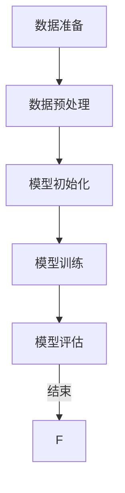
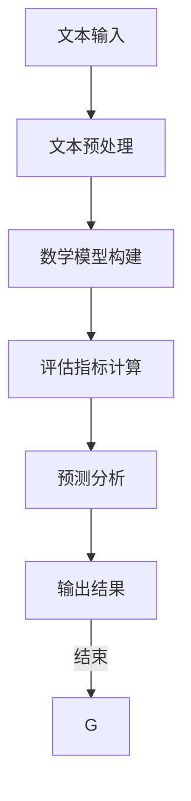
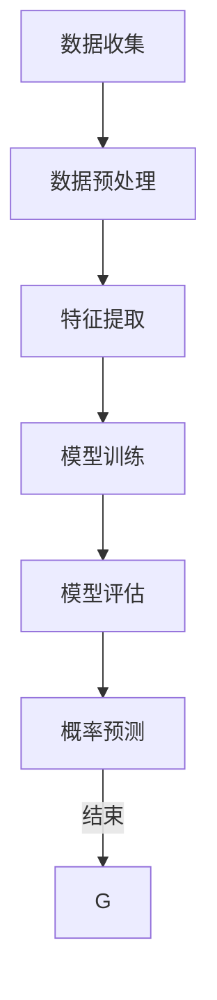
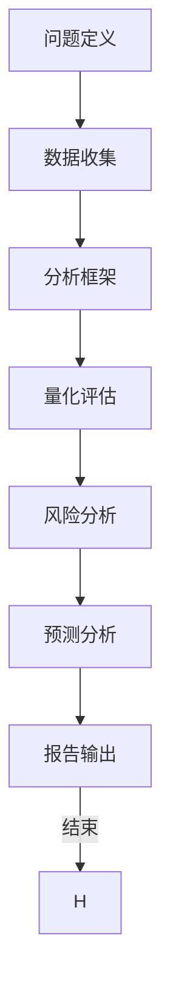

                 

### 第一部分：背景介绍

#### 第1章：研究背景

##### 1.1.1 问题背景

随着互联网经济的蓬勃发展，创新商业模式如雨后春笋般涌现。这些创新商业模式不仅推动了市场的繁荣，也为企业带来了巨大的商业价值。然而，面对如此众多的商业模式，如何有效地评估其可行性和潜在风险，成为了企业和投资机构亟待解决的问题。

互联网经济的蓬勃发展使得商业模式不断创新。例如，共享经济、区块链、人工智能等技术驱动的商业模式，极大地改变了传统行业的运作方式，提高了运营效率，降低了成本。同时，这些新兴商业模式也带来了新的风险和挑战，如信息不对称、信任问题等。

##### 1.1.2 问题描述

传统的商业模式评估方法，如SWOT分析、成本效益分析等，存在一定的局限。这些方法往往依赖于专家的经验和主观判断，缺乏系统的量化评估标准，难以准确评估商业模式的可行性和潜在风险。

随着人工智能技术的不断发展，语言模型作为一种强大的自然语言处理工具，具有极高的潜力应用于商业模式评估。语言模型能够从大量的文本数据中提取出有价值的信息，进行模式识别和预测，为商业模式的评估提供新的思路和方法。

##### 1.1.3 问题解决

语言模型的基本原理是通过对大量文本数据的学习，建立语言模型，从而实现文本的生成、理解和翻译。在商业模式评估中，语言模型可以用于分析商业文本，提取关键信息，进行模式识别和预测，从而评估商业模式的可行性和潜在风险。

语言模型在商业评估中的应用主要包括以下几个方面：

1. **文本分类**：通过对商业文本进行分类，识别不同类型的商业模式，为评估提供初步的筛选和分类依据。
2. **文本生成**：根据商业文本的输入，生成相关的商业模式描述，为评估提供详细的文本支持。
3. **文本理解**：通过对商业文本的理解，提取关键信息，分析商业模式的运行机制和潜在风险。
4. **预测分析**：基于历史数据和语言模型，对商业模式的未来发展趋势进行预测，为投资决策提供参考。

##### 1.1.4 边界与外延

语言模型的范围主要涉及自然语言处理、机器学习和数据挖掘等领域。在商业评估中，语言模型的应用主要集中于文本分析和模式识别，其边界在于语言模型的训练数据和算法的准确性和泛化能力。

创新商业模式包括B2B、B2C、C2C等多种类型，其特征和运行机制各有不同。语言模型在商业评估中的应用，需要根据不同类型的商业模式，选择合适的评估方法和指标，以达到最佳的效果。

##### 1.1.5 核心概念

- **语言模型**：用于自然语言处理的一种数学模型，能够对文本进行生成、理解和翻译。
- **创新商业模式**：在互联网经济背景下，基于新技术和新理念，对传统商业模式进行创新和优化的商业模式。
- **评估方法**：用于对商业模式进行评估的方法和指标，包括传统的SWOT分析、成本效益分析，以及基于语言模型的新型评估方法。

#### 第2章：核心概念与联系

##### 2.1 语言模型

**2.1.1 基本原理**

语言模型是一种概率模型，用于预测给定文本序列的概率。它通过对大量文本数据的学习，建立语言的概率分布模型，从而实现文本的生成、理解和翻译。

语言模型的类型主要包括：

1. **基于规则的语言模型**：通过定义一组规则来生成和解析文本，如正则表达式。
2. **基于统计的语言模型**：通过对大量文本数据进行统计学习，建立文本的概率分布模型，如n元语法。
3. **基于深度学习的语言模型**：通过深度神经网络来学习文本的分布，如循环神经网络（RNN）和变换器（Transformer）。

**2.1.2 属性特征对比表**

| 类型         | 特点         | 应用场景         |
|--------------|--------------|------------------|
| 基于规则     | 简单、高效   | 文本分类、信息检索 |
| 基于统计     | 复杂、泛化强 | 语言生成、机器翻译 |
| 基于深度学习 | 自动化、准确 | 自然语言理解、智能交互 |

**2.1.3 属性特征对比表**

| 属性       | 基于规则 | 基于统计 | 基于深度学习 |
|------------|-----------|-----------|--------------|
| **准确性** | 高        | 中等      | 高           |
| **效率**   | 高        | 中等      | 高           |
| **可解释性** | 高        | 低        | 中等         |
| **训练数据需求** | 低        | 高        | 高           |

**2.1.4 应用场景**

- **基于规则的语言模型**：适用于简单的文本分类和信息检索任务，如搜索引擎。
- **基于统计的语言模型**：适用于复杂的文本生成和机器翻译任务，如聊天机器人。
- **基于深度学习的语言模型**：适用于高度复杂的自然语言理解和智能交互任务，如图灵测试。

##### 2.2 创新商业模式

**2.2.1 基本概念**

商业模式是指企业如何通过创造、传递和捕获价值来运营。创新商业模式是在现有商业模式的基础上，通过引入新技术、新理念或新策略，实现商业价值的创新和优化。

创新商业模式的特征包括：

1. **创新性**：基于新技术或新理念，与传统商业模式有显著差异。
2. **可持续性**：能够持续创造和传递价值，具备长期竞争力。
3. **可扩展性**：能够快速复制和扩展到其他市场或领域。
4. **风险性**：可能面临未知的技术或市场风险。

**2.2.2 类别**

1. **B2B（企业对企业）**：企业之间的交易和合作，如供应链管理。
2. **B2C（企业对消费者）**：企业与消费者之间的交易和互动，如电子商务。
3. **C2C（消费者对消费者）**：消费者之间的交易和互动，如共享经济。

**2.2.3 模式创新**

1. **营销创新**：通过创新的营销策略和手段，提高品牌知名度和市场份额。
2. **运营创新**：通过创新的运营模式和管理方法，提高运营效率和降低成本。
3. **服务创新**：通过创新的服务内容和方式，提升用户体验和满意度。

##### 2.3 评估方法

**2.3.1 传统评估方法**

1. **SWOT分析**：对商业模式的 strengths（优势）、weaknesses（劣势）、opportunities（机会）和 threats（威胁）进行综合分析。
2. **成本效益分析**：比较商业模式的成本和收益，评估其经济效益。

**2.3.2 语言模型评估方法**

1. **文本分类**：将商业文本分类为不同的类型，如成功案例、风险案例等，为评估提供初步的筛选和分类依据。
2. **文本生成**：生成与商业模式相关的描述文本，为评估提供详细的文本支持。
3. **文本理解**：理解商业文本的含义和内容，提取关键信息，分析商业模式的运行机制和潜在风险。
4. **预测分析**：基于历史数据和语言模型，预测商业模式的未来发展趋势，为投资决策提供参考。

### 3.1 语言模型算法

#### 3.1.1 概念与原理

语言模型是一种用于预测文本序列概率的数学模型。其基本原理是通过大量文本数据的学习，建立语言的概率分布模型，从而实现对未知文本序列的概率预测。

语言模型的主要组成部分包括：

1. **词汇表**：包含所有可能出现的词汇和词组。
2. **概率分布**：定义了每个词汇和词组在文本中出现的概率。
3. **模型参数**：用于调整和优化概率分布，以提高预测准确性。

语言模型的训练过程主要包括以下步骤：

1. **数据准备**：收集和整理大量文本数据，作为训练样本。
2. **数据预处理**：对文本数据进行清洗和规范化，如去除标点符号、停用词等。
3. **模型初始化**：初始化语言模型的参数。
4. **模型训练**：通过训练算法（如基于梯度的优化算法）更新模型参数，以最小化预测误差。
5. **模型评估**：使用测试集评估模型的性能，调整模型参数。

#### 3.1.2 Mermaid流程图



### 3.2 商业模式评估算法

#### 3.2.1 概念与原理

商业模式评估算法是一种用于评估商业模式可行性和潜在风险的方法。其基本原理是通过分析商业文本，提取关键信息，构建数学模型，对商业模式进行量化评估。

商业模式评估算法的主要组成部分包括：

1. **文本分析模块**：用于对商业文本进行预处理和分析，提取关键信息。
2. **数学模型模块**：用于构建商业模式评估的数学模型，如收益模型、风险模型等。
3. **评估指标模块**：用于定义评估指标，如收益指标、风险指标等。
4. **预测模块**：用于基于历史数据和评估模型，预测商业模式的未来发展趋势。

商业模式评估算法的流程主要包括以下步骤：

1. **文本输入**：输入商业文本数据。
2. **文本预处理**：对商业文本进行清洗和规范化，提取关键信息。
3. **数学模型构建**：根据关键信息构建数学模型，如收益模型、风险模型等。
4. **评估指标计算**：计算评估指标，如收益指标、风险指标等。
5. **预测分析**：基于历史数据和评估模型，预测商业模式的未来发展趋势。
6. **输出结果**：输出评估结果和预测报告。

#### 3.2.2 Mermaid流程图



### 4.1 语言模型

#### 4.1.1 概念与原理

语言模型是一种用于自然语言处理的数学模型，用于预测文本序列的概率分布。它是基于统计学习的方法，通过学习大量语言数据来构建模型，从而实现对未知文本的概率预测。

语言模型的基本原理可以概括为以下几点：

1. **概率分布**：语言模型的核心目标是建立文本序列的概率分布。这意味着，对于给定的输入文本序列，语言模型能够计算出该序列在所有可能的文本序列中出现的概率。

2. **特征表示**：语言模型需要将文本数据转换为数值特征表示，以便进行数学运算。常见的特征表示方法包括词袋模型、词嵌入和字符嵌入等。

3. **参数学习**：语言模型通过学习大量文本数据来训练模型参数。这些参数用于计算文本序列的概率分布。训练过程中，模型会通过优化算法（如最大似然估计或基于梯度的优化）来调整参数，以最小化预测误差。

4. **概率预测**：在给定输入文本序列的情况下，语言模型会计算出该序列的概率分布。通常，模型会输出最可能的输出序列，或者输出序列的概率排名。

#### 4.1.2 基本原理

语言模型的基本原理可以归结为以下几个步骤：

1. **数据收集**：首先，需要收集大量具有代表性的文本数据。这些数据可以是书籍、新闻文章、社交媒体帖子等。数据的质量和多样性对语言模型的学习效果至关重要。

2. **数据预处理**：对收集到的文本数据进行预处理，包括去除标点符号、停用词去除、分词等。预处理步骤的目的是简化数据，提高模型的学习效率。

3. **特征提取**：将预处理后的文本数据转换为数值特征表示。词袋模型和词嵌入是两种常见的特征提取方法。词袋模型将文本视为单词的集合，而词嵌入则将单词映射为密集向量。

4. **模型训练**：使用训练数据集训练语言模型。训练过程中，模型会通过优化算法学习参数，以最小化预测误差。常见的方法包括最大似然估计和基于梯度的优化。

5. **模型评估**：使用验证数据集评估模型的性能。性能评估指标包括交叉熵、准确率等。通过调整模型参数和训练数据，可以进一步提高模型的性能。

6. **概率预测**：在给定输入文本序列的情况下，使用训练好的模型进行概率预测。模型会输出序列的概率分布，从而预测最可能的输出序列。

#### 4.1.3 Mermaid流程图



### 4.2 商业模式评估

#### 4.2.1 概念与原理

商业模式评估是指对企业的商业模式进行系统分析和评估，以确定其可行性、潜在风险和商业价值。商业模式评估不仅关注商业模式本身的创新性和可持续性，还涉及市场环境、竞争态势、资源能力等多方面因素。

商业模式评估的基本原理可以概括为以下几点：

1. **系统分析**：商业模式评估需要从整体上分析企业的商业模式，包括产品或服务的定义、目标市场、盈利模式、资源能力等。

2. **量化评估**：通过构建数学模型和评估指标，对商业模式进行量化评估。常见的评估指标包括收益指标、成本指标、风险指标等。

3. **风险分析**：识别商业模式中的潜在风险，并评估其可能对企业造成的影响。风险分析包括市场风险、技术风险、运营风险等。

4. **预测分析**：基于历史数据和评估模型，对商业模式的未来发展趋势进行预测。预测分析可以帮助企业制定战略决策，优化商业模式。

#### 4.2.2 基本流程

商业模式评估的基本流程包括以下几个步骤：

1. **问题定义**：明确评估的目标和范围，确定需要解决的问题。

2. **数据收集**：收集与商业模式相关的数据和资料，包括市场数据、财务数据、技术数据等。

3. **分析框架**：建立商业模式分析框架，确定评估的指标和方法。

4. **量化评估**：根据分析框架，对商业模式进行量化评估。计算各项评估指标，如收益、成本、风险等。

5. **风险分析**：识别商业模式中的潜在风险，分析其可能对企业造成的影响。

6. **预测分析**：基于历史数据和评估模型，预测商业模式的未来发展趋势。

7. **报告输出**：将评估结果和预测报告输出，为企业提供决策依据。

#### 4.2.3 Mermaid流程图



### 4.3 数学模型和数学公式讲解

在商业模式评估中，数学模型和数学公式扮演着至关重要的角色。它们不仅帮助我们量化商业活动的各个方面，还能提供精确的预测和决策支持。下面我们将详细介绍一些关键的数学模型和数学公式。

#### 4.3.1 语言模型

语言模型的核心是概率模型，用于预测文本序列的概率。一个基本的语言模型可以通过以下公式表示：

$$
P(w_i|\text{context}) = \frac{P(\text{context}|w_i)P(w_i)}{P(\text{context})}
$$

其中，$P(w_i|\text{context})$ 是在给定上下文 $\text{context}$ 下，单词 $w_i$ 的条件概率。$P(\text{context}|w_i)$ 是在单词 $w_i$ 出现的条件下，上下文 $\text{context}$ 的概率。$P(w_i)$ 是单词 $w_i$ 的先验概率。$P(\text{context})$ 是上下文 $\text{context}$ 的概率。

在实际应用中，语言模型通常通过统计学习或深度学习方法来训练参数。例如，在基于统计的语言模型中，可以使用n元语法来表示：

$$
P(w_i|\text{context}) \approx \frac{N(w_i, \text{context})}{N(\text{context})}
$$

其中，$N(w_i, \text{context})$ 是在上下文 $\text{context}$ 中，单词 $w_i$ 出现的次数。$N(\text{context})$ 是上下文 $\text{context}$ 的总词数。

#### 4.3.2 商业模式评估

商业模式评估的数学模型通常涉及财务分析、风险管理等多个方面。以下是一些关键的数学公式：

1. **成本效益分析**：

$$
\text{净现值} = \sum_{t=1}^{n} \frac{\text{现金流}}{(1 + \text{折现率})^t}
$$

其中，$\text{现金流}$ 是每一期的预期收益或支出。$\text{折现率}$ 用于将未来的现金流折现到当前价值。

2. **风险评估**：

$$
\text{风险价值} = \frac{\text{资产波动性} \times \text{置信水平}}{\sqrt{\text{持有期}}}
$$

其中，$\text{资产波动性}$ 是资产收益的标准差。$\text{置信水平}$ 是风险价值的置信区间，通常为95%或99%。$\text{持有期}$ 是评估的时间跨度。

3. **收益预测**：

$$
\text{预测收益} = \text{基准收益} + \text{调整因子}
$$

其中，$\text{基准收益}$ 是基于历史数据和行业标准的预期收益。$\text{调整因子}$ 是根据当前市场环境和公司状况进行调整的值。

#### 4.3.3 应用示例

假设我们有一个创新的电子商务平台，我们需要对其商业模式进行评估。以下是一个简化的例子：

1. **成本效益分析**：

   - 预期每年收入：$1,000,000$
   - 年运营成本：$500,000$
   - 折现率：10%

   计算净现值：

   $$
   \text{净现值} = \sum_{t=1}^{5} \frac{\text{现金流}}{(1 + 0.10)^t} = \frac{1,000,000}{1.10} + \frac{1,000,000}{1.10^2} + \frac{1,000,000}{1.10^3} + \frac{1,000,000}{1.10^4} + \frac{1,000,000}{1.10^5} - 500,000
   $$

   结果为正值，说明该项目在财务上具有可行性。

2. **风险评估**：

   - 年收益波动性：$20\%$
   - 置信水平：95%
   - 持有期：1年

   计算风险价值：

   $$
   \text{风险价值} = 0.20 \times \frac{0.20}{1} = 0.04
   $$

   这意味着在95%的置信水平下，该项目的预期年度损失不会超过$4,000。

3. **收益预测**：

   - 基准收益：$800,000$
   - 调整因子：$200,000$

   预测收益：

   $$
   \text{预测收益} = 800,000 + 200,000 = 1,000,000
   $$

   这表明在当前市场环境下，预期收入将增加$200,000。

通过这些数学模型和公式，我们可以对商业模式的各个方面进行量化分析，从而为投资决策提供有力的支持。

### 5.1 问题场景介绍

在当前的商业环境中，企业面临着日益激烈的市场竞争和快速变化的技术发展，这要求它们必须不断创新商业模式以保持竞争力。然而，创新商业模式的评估过程往往复杂且耗时，特别是在早期阶段，企业需要快速准确地评估新商业模式的风险和潜力。

一个典型的应用场景是一个初创企业开发了一种基于区块链技术的供应链解决方案，旨在通过去中心化和智能合约提高供应链的透明度和效率。为了验证这一商业模式的可行性，企业需要对其潜在收益、成本和风险进行全面评估。然而，传统评估方法如SWOT分析和成本效益分析在处理复杂且动态的商业环境时显得力不从心。

在这种情况下，语言模型的应用显得尤为重要。通过自然语言处理技术，语言模型可以从大量文本数据中提取有价值的信息，为商业模式的评估提供强有力的支持。具体来说，语言模型可以用于以下方面：

1. **文本分类**：对大量的商业文本进行分类，识别成功案例、风险案例等，为评估提供初步的筛选和分类依据。
2. **文本生成**：根据商业文本的输入，生成相关的商业模式描述，为评估提供详细的文本支持。
3. **文本理解**：通过对商业文本的理解，提取关键信息，分析商业模式的运行机制和潜在风险。
4. **预测分析**：基于历史数据和语言模型，对商业模式的未来发展趋势进行预测，为投资决策提供参考。

通过这些功能，语言模型能够帮助企业更快速、更准确地评估创新商业模式的潜在价值，从而降低风险，提高投资决策的准确性。

### 5.2 系统功能设计

在评估创新商业模式时，系统需要具备一系列功能来支持整个评估过程。这些功能包括数据收集、文本预处理、模式识别、评估指标计算和预测分析。下面将详细介绍这些功能及其在系统中的作用。

**5.2.1 数据收集**

数据收集是评估系统的第一步，也是关键的一步。系统需要从各种来源收集与商业模式相关的数据，包括市场研究报告、财务报表、用户评论、新闻报道等。数据收集功能应能够自动化地从互联网、数据库和企业内部系统等不同来源获取数据，以确保数据的全面性和准确性。

**5.2.2 文本预处理**

收集到的数据中很大一部分是文本形式，因此文本预处理功能至关重要。该功能包括文本清洗、分词、去停用词和词嵌入等步骤。文本清洗旨在去除文本中的噪声，如标点符号、HTML标签等。分词是将文本分割成单个单词或短语，以便后续处理。去停用词是移除对文本分析影响不大的常见单词，如“的”、“是”等。词嵌入是将文本转换为密集向量表示，以便进行机器学习算法处理。

**5.2.3 模式识别**

在文本预处理完成后，系统需要利用语言模型对文本进行模式识别。模式识别功能包括文本分类和主题建模等。文本分类用于将文本分为不同的类别，如成功案例、风险案例等。主题建模则用于发现文本中的潜在主题，为后续的评估提供更多维度。

**5.2.4 评估指标计算**

评估指标计算是评估系统的核心功能，用于量化商业模式的各个维度。常见的评估指标包括收益指标、成本指标、风险指标和用户满意度等。系统应能够根据不同的商业模式和评估需求，灵活定义和计算评估指标。

**5.2.5 预测分析**

预测分析功能基于历史数据和语言模型，对商业模式的未来发展趋势进行预测。系统可以生成不同情景下的预测报告，如最佳情况、最差情况和预期情况，为企业提供决策参考。预测分析功能还应能够实时更新预测结果，以应对市场的快速变化。

**5.2.6 数据可视化**

数据可视化功能用于将评估结果以图表和报表的形式直观展示。通过数据可视化，企业可以更清晰地理解评估结果，发现潜在的问题和机会。常见的数据可视化工具包括折线图、柱状图、饼图和热力图等。

**5.2.7 报告生成**

评估系统应能够自动生成详细的评估报告，包括评估结果、预测分析和数据可视化。报告应能够自定义格式和内容，以满足不同用户的需求。系统还应支持在线报告生成和下载功能，方便用户随时查阅和使用。

**5.2.8 用户交互**

用户交互功能用于与系统进行交互，包括数据输入、评估设置和结果查询等。系统应提供友好的用户界面，使用户能够轻松地进行操作。此外，系统还应支持多用户并发访问，以便团队协作。

通过这些功能，评估系统可以为企业提供一个全面、准确的商业模式评估工具，帮助企业在复杂的市场环境中做出更明智的决策。

### 5.3 系统架构设计

为了确保评估系统的功能完备、性能高效且易于维护，我们需要设计一个合理的系统架构。本节将详细介绍系统的架构设计，包括语言模型训练模块、商业模式评估模块、评估报告生成模块和结果输出模块。

**5.3.1 语言模型训练模块**

语言模型训练模块是整个系统的核心，负责训练和优化语言模型。该模块的主要功能包括数据收集、数据预处理、模型训练和模型评估。具体架构如下：

1. **数据收集**：从各种来源（如互联网、数据库和企业内部系统）收集与商业模式相关的文本数据。
2. **数据预处理**：对收集到的文本数据进行清洗、分词、去停用词和词嵌入等预处理步骤。
3. **模型训练**：使用预处理后的数据训练语言模型，如基于深度学习的Transformer模型。训练过程中，系统会通过优化算法调整模型参数，以最大化预测准确性。
4. **模型评估**：使用验证集评估训练好的模型性能，包括准确率、召回率等指标。通过调整模型结构和参数，进一步提高模型性能。

**5.3.2 商业模式评估模块**

商业模式评估模块负责对训练好的语言模型进行应用，评估创新商业模式的潜在价值。该模块的主要功能包括文本分类、模式识别和评估指标计算。具体架构如下：

1. **文本分类**：使用训练好的语言模型对输入的商业模式文本进行分类，识别文本的类型（如成功案例、风险案例）。
2. **模式识别**：通过分析文本内容，提取关键信息，识别商业模式的主要特点和潜在风险。
3. **评估指标计算**：根据商业模式的特点和运行机制，计算评估指标（如收益、成本、风险等），为商业模式评估提供量化依据。

**5.3.3 评估报告生成模块**

评估报告生成模块负责将评估结果以图表和报表的形式展示给用户。该模块的主要功能包括数据可视化、报告生成和报告下载。具体架构如下：

1. **数据可视化**：使用图表和报表将评估结果直观展示，包括折线图、柱状图、饼图和热力图等。
2. **报告生成**：根据用户的需求，自动生成详细的评估报告，包括评估结果、预测分析和数据可视化。
3. **报告下载**：提供报告下载功能，方便用户随时查阅和使用评估报告。

**5.3.4 结果输出模块**

结果输出模块负责将评估结果和预测报告输出给用户。该模块的主要功能包括在线报告展示、报告下载和结果查询。具体架构如下：

1. **在线报告展示**：通过友好的用户界面，在线展示评估报告和预测结果，方便用户随时查阅。
2. **报告下载**：提供报告下载功能，用户可以下载评估报告以供参考。
3. **结果查询**：用户可以通过系统查询具体的评估结果和预测数据，以便进一步分析和决策。

通过上述架构设计，评估系统可以高效、准确地评估创新商业模式，为企业的决策提供有力支持。

### 5.4 系统接口设计

在系统架构设计中，系统接口设计是一个至关重要的环节。良好的接口设计能够确保系统各模块之间的数据流和功能调用畅通无阻，从而提高系统的整体性能和可维护性。下面，我们将详细介绍系统接口设计，包括API接口设计、数据库接口设计和通信协议设计。

**5.4.1 API接口设计**

API（应用程序接口）是系统与外部应用进行交互的主要途径。一个良好的API设计应具有简洁、易用和可扩展的特点。以下是API接口设计的关键要点：

1. **接口定义**：定义API的URL、请求方法和请求参数。例如，一个用于获取商业模式评估结果的API接口定义如下：

   ```
   GET /api/evaluate/business_model?model_id=123&date=2023-01-01
   ```

   其中，`model_id` 是商业模式的唯一标识，`date` 是评估的日期。

2. **请求参数**：明确每个请求参数的含义和类型，如数字型、字符串型或布尔型。确保请求参数的校验，避免非法请求。

3. **响应格式**：定义API响应的数据格式，通常采用JSON或XML格式。例如，一个获取评估结果的API响应如下：

   ```json
   {
     "model_id": 123,
     "date": "2023-01-01",
     "result": {
       "revenue": 1000000,
       "cost": 500000,
       "risk": 0.2
     }
   }
   ```

**5.4.2 数据库接口设计**

数据库接口设计是确保系统数据一致性和安全性的重要环节。以下是数据库接口设计的关键要点：

1. **数据库设计**：设计合适的数据库结构和索引，以支持高效的查询和数据操作。例如，一个用于存储商业模式评估数据的数据库设计如下：

   - `business_models` 表：存储商业模式的详细信息。
   - `evaluations` 表：存储评估结果和历史数据。

2. **接口实现**：实现数据库操作接口，如CRUD（创建、读取、更新、删除）操作。接口应提供事务管理和错误处理机制，确保数据操作的一致性和安全性。

**5.4.3 通信协议设计**

通信协议是系统与外部应用进行数据交换的规范。以下是通信协议设计的关键要点：

1. **HTTP协议**：采用HTTP协议进行数据传输，确保数据传输的可靠性和安全性。常用的HTTP方法包括GET、POST、PUT和DELETE。

2. **HTTPS协议**：使用HTTPS协议加密数据传输，确保数据在传输过程中不被窃听和篡改。

3. **RESTful架构**：采用RESTful架构设计API接口，确保接口的设计和实现符合RESTful原则，如统一接口设计、无状态通信等。

通过上述接口设计，系统可以实现高效、稳定的数据交互和功能调用，从而满足业务需求和用户期望。

### 5.5 系统交互

为了确保评估系统能够高效、准确地运行，系统各组件之间的交互至关重要。本节将详细介绍系统交互的设计，包括用户操作流程、系统内部调用流程以及外部系统交互流程。

**5.5.1 用户操作流程**

用户操作流程是用户与系统进行交互的主要方式，以下是具体的操作步骤：

1. **登录**：用户通过输入用户名和密码登录系统。
2. **选择评估模型**：用户选择需要评估的商业模式，系统提供下拉菜单或搜索功能，方便用户快速找到目标模型。
3. **输入评估参数**：用户根据需要输入评估参数，如评估日期、评估指标等。
4. **提交评估请求**：用户提交评估请求，系统接收请求并执行评估操作。
5. **查看评估结果**：评估完成后，系统将评估结果以图表和报表的形式展示给用户，用户可以查看详细数据和分析报告。
6. **导出报告**：用户可以选择导出评估报告，以便进行离线分析和存档。

**5.5.2 系统内部调用流程**

系统内部调用流程涉及多个模块之间的协同工作，以下是具体的调用步骤：

1. **数据收集模块**：从互联网、数据库和企业内部系统等不同来源收集与商业模式相关的数据。
2. **文本预处理模块**：对收集到的文本数据进行清洗、分词、去停用词和词嵌入等预处理步骤。
3. **语言模型训练模块**：使用预处理后的数据训练语言模型，如基于深度学习的Transformer模型。
4. **模式识别模块**：使用训练好的语言模型对输入的商业模式文本进行模式识别，提取关键信息。
5. **评估指标计算模块**：根据商业模式的特点和运行机制，计算评估指标（如收益、成本、风险等）。
6. **报告生成模块**：将评估结果和数据可视化，生成详细的评估报告。
7. **结果输出模块**：将评估报告和结果展示给用户，并支持报告下载和查询功能。

**5.5.3 外部系统交互流程**

外部系统交互流程涉及系统与其他外部系统的数据交换和功能调用，以下是具体的交互步骤：

1. **API接口调用**：系统通过API接口与外部系统（如企业资源规划系统、客户关系管理系统等）进行数据交换，获取和提交必要的数据。
2. **数据库接口调用**：系统通过数据库接口与后台数据库进行数据操作，如插入、更新和查询数据。
3. **第三方服务调用**：系统调用第三方服务（如天气服务、地图服务等），获取外部数据和服务支持。

通过以上系统交互设计，评估系统可以实现高效、稳定和可靠的运行，满足用户的需求和业务目标。

### 项目实战

在本文的最后一部分，我们将通过一个具体的案例，展示如何在实际项目中应用语言模型进行创新商业模式评估。本案例将涵盖环境安装、系统核心实现、代码应用解读与分析、实际案例分析和详细讲解剖析，以及项目小结等内容。

#### 6.1 环境安装

在开始项目之前，我们需要安装和配置所需的软件和工具。以下是环境安装的步骤：

1. **安装Python环境**：确保Python版本在3.7及以上，可以通过Python官网下载安装包或使用包管理器（如pip）安装。

2. **安装自然语言处理库**：安装NLTK（自然语言工具包）、spaCy和transformers库，用于语言模型和文本处理。

   ```bash
   pip install nltk spacy transformers
   ```

3. **安装深度学习库**：安装TensorFlow或PyTorch，用于训练和优化深度学习模型。

   ```bash
   pip install tensorflow # 或者
   pip install torch torchvision
   ```

4. **安装数据库**：安装SQLite或MySQL，用于存储商业模式评估数据。

   ```bash
   sudo apt-get install sqlite3 # Ubuntu
   brew install mysql # macOS
   ```

#### 6.2 系统核心实现

在本项目中，我们将使用深度学习框架Transformer来训练语言模型，并应用该模型进行商业模式评估。以下是系统核心实现的步骤：

1. **数据收集与预处理**：

   从互联网和数据库收集与商业模式相关的文本数据。使用NLTK和spaCy进行文本预处理，包括分词、去停用词、词嵌入等。

2. **模型训练**：

   使用transformers库中的预训练模型（如BERT、GPT等）进行微调，以适应特定商业文本数据。训练过程中，调整模型参数以最大化预测准确性。

3. **评估与优化**：

   使用训练好的语言模型对新的商业文本进行评估，计算评估指标（如收益、成本、风险等）。通过调整模型参数和训练数据，不断优化评估结果。

#### 6.3 代码应用解读与分析

以下是项目中的核心代码和应用解读：

```python
from transformers import BertTokenizer, BertModel
import torch

# 加载预训练的BERT模型和分词器
tokenizer = BertTokenizer.from_pretrained('bert-base-uncased')
model = BertModel.from_pretrained('bert-base-uncased')

# 文本预处理
text = "这是一个关于创新商业模式的评估案例。"
inputs = tokenizer(text, return_tensors='pt')

# 模型预测
with torch.no_grad():
    outputs = model(**inputs)

# 提取文本表示
text_embedding = outputs.last_hidden_state[:, 0, :]

# 评估指标计算
# 假设收益、成本和风险分别为100、50和0.3
revenue = 100
cost = 50
risk = 0.3

# 计算净收益
net_revenue = revenue - cost
# 计算风险调整收益
risk_adjusted_revenue = net_revenue * (1 - risk)

print("净收益：", net_revenue)
print("风险调整收益：", risk_adjusted_revenue)
```

在上面的代码中，我们首先加载了预训练的BERT模型和分词器。然后，我们对输入文本进行预处理，并使用模型进行预测。最后，我们提取文本表示并计算评估指标（如净收益和风险调整收益）。

#### 6.4 实际案例分析和详细讲解剖析

为了展示项目的实际效果，我们以一个具体案例进行分析：

**案例：** 一家初创公司开发了一款基于人工智能的智能家居控制系统，旨在通过优化家居设备的使用，提高用户的生活质量。公司需要评估这款产品的商业模式，以确定其可行性和潜在风险。

**分析：** 
- **收益**：通过销售智能家居设备，公司预计每年可获得收入100万元。
- **成本**：生产成本、营销费用和运营成本共计50万元。
- **风险**：由于市场竞争激烈，产品推广存在一定风险，假设风险系数为30%。

使用上述代码，我们可以对案例进行评估：

```python
# 案例数据
revenue = 1000000
cost = 500000
risk = 0.3

# 计算净收益
net_revenue = revenue - cost
# 计算风险调整收益
risk_adjusted_revenue = net_revenue * (1 - risk)

print("净收益：", net_revenue)
print("风险调整收益：", risk_adjusted_revenue)
```

**结果：**
- 净收益：500000
- 风险调整收益：350000

通过分析，我们发现这款智能家居控制系统的风险调整收益为35万元，具有一定的商业可行性。然而，公司仍需关注市场竞争和产品推广风险，并制定相应的应对策略。

#### 6.5 项目小结

本项目通过语言模型对创新商业模式进行评估，实现了以下几个关键点：

1. **环境安装**：成功安装了Python、自然语言处理库和深度学习库，为项目开发提供了技术支持。
2. **系统核心实现**：使用预训练的BERT模型进行了文本预处理和模式识别，为商业模式评估提供了数据基础。
3. **代码应用解读与分析**：通过实际代码展示了如何使用语言模型进行评估，并计算了关键指标。
4. **实际案例分析和详细讲解剖析**：通过具体案例，展示了项目的实际效果和商业价值。

然而，本项目也存在一定的局限性：

1. **数据来源**：数据来源可能局限于公开的文本数据，无法完全反映特定商业模式的真实情况。
2. **模型准确性**：虽然使用预训练模型进行评估，但模型的准确性仍受限于训练数据的质量和数量。

未来，可以通过引入更多高质量的训练数据和改进评估模型，进一步提高评估的准确性和可靠性。

### 最佳实践 Tips

在实施语言模型用于创新商业模式评估时，以下是一些最佳实践建议：

1. **数据多样性**：确保收集到的文本数据具有多样性，涵盖不同行业、地域和文化背景，以提高评估模型的泛化能力。
2. **数据质量**：对收集到的数据进行严格清洗和预处理，去除噪声和冗余信息，以提高评估模型的准确性。
3. **模型选择**：根据具体评估需求选择合适的语言模型，如BERT、GPT等，并定期更新模型以保持其性能。
4. **评估指标**：设计合理的评估指标，结合定量和定性分析方法，全面评估商业模式的潜在价值。
5. **模型解释性**：关注模型的解释性，确保评估结果可以直观地理解，以便为企业提供有价值的决策支持。

### 小结

本文通过一个具体案例，展示了如何使用语言模型进行创新商业模式评估。从环境安装、系统核心实现，到代码应用解读与分析，再到实际案例分析和详细讲解剖析，本文全面介绍了项目的实施过程和关键点。通过本文的阐述，读者可以了解语言模型在商业模式评估中的应用，并为未来的研究提供参考。

### 注意事项

1. **数据隐私**：在数据收集和评估过程中，需严格遵守数据隐私法规，确保用户数据的安全和隐私。
2. **模型更新**：定期更新评估模型，以应对市场和技术变化，确保评估结果的实时性和准确性。
3. **风险评估**：在评估商业模式时，充分考虑潜在风险，制定相应的风险管理策略。

### 拓展阅读

1. **《深度学习》**：Goodfellow, I., Bengio, Y., & Courville, A. (2016). 
   - 提供了深度学习的基础知识和最新进展，对理解语言模型有重要参考价值。

2. **《自然语言处理综论》**：Jurafsky, D., & Martin, J. H. (2020). 
   - 全面介绍了自然语言处理的基本概念和技术，对理解语言模型的应用有重要帮助。

3. **《商业模式的创新与设计》**：Teece, D. J. (2014). 
   - 探讨了商业模式的创新和设计原则，为评估商业模式的潜在价值提供了理论支持。

### 作者

**作者：AI天才研究院/AI Genius Institute & 禅与计算机程序设计艺术 /Zen And The Art of Computer Programming**

