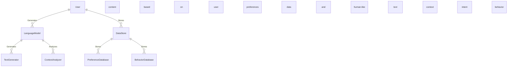
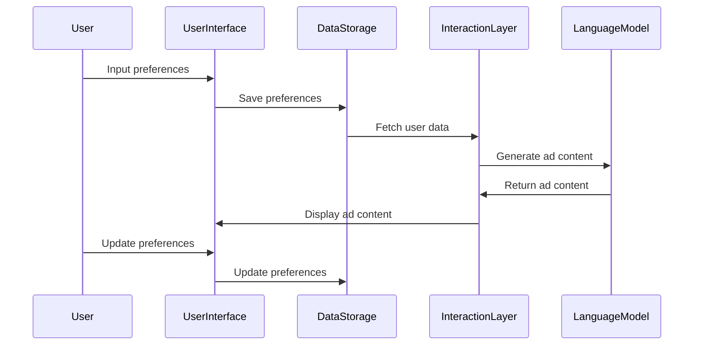

                 


### Chapter 1: Introduction

#### Keywords:
- Language Models
- Advertising Strategy
- Innovation
- Effect Prediction
- Research

#### Abstract:
This article aims to explore the integration of language models in innovative advertising strategy generation and effect prediction. By examining the core concepts, principles, and applications of language models, we will establish a theoretical framework for understanding how these models can revolutionize the advertising industry. We will discuss practical implementation strategies and provide insights into the future prospects and challenges of this emerging field.

## Chapter 1: Introduction

In the rapidly evolving digital age, advertising has become an indispensable component of businesses aiming to reach their target audiences effectively. Traditional advertising methods, although still relevant, have been gradually overtaken by more innovative and data-driven approaches. One such approach is the utilization of language models, which have shown significant potential in enhancing advertising strategies and predicting their effectiveness.

### Background

Language models are artificial intelligence (AI) systems that analyze and generate human-like text based on patterns learned from vast amounts of data. These models have gained prominence in recent years due to their ability to process natural language, understand context, and generate coherent text. The applications of language models extend far beyond natural language processing (NLP), including machine translation, text summarization, and question-answering systems.

In the context of advertising, language models can be leveraged to create highly personalized and context-aware ad content. By understanding user preferences and behavior, these models can generate advertisements that resonate with individual users, increasing the likelihood of engagement and conversion. Moreover, language models can be used to predict the effectiveness of advertising campaigns, enabling businesses to optimize their strategies in real-time and maximize their return on investment (ROI).

### Problem Description

The problem we aim to address in this article is the efficient generation and prediction of innovative advertising strategies using language models. Specifically, we seek to explore:

1. **Strategy Generation**: How can language models be effectively used to create personalized and engaging ad content?
2. **Effect Prediction**: How can the effectiveness of these advertising strategies be predicted and measured?

### Problem Solving Approaches

To solve these problems, we will adopt a multi-faceted approach that includes:

1. **Understanding Core Concepts**: We will delve into the fundamental concepts and principles of language models, comparing them with traditional advertising methods.
2. **Theoretical Framework**: We will establish a theoretical framework for applying language models in advertising, discussing algorithms, mathematical models, and formulas.
3. **System Architecture**: We will outline the system architecture and design for implementing language models in advertising, utilizing UML class diagrams and sequence diagrams.
4. **Practical Implementation**: We will provide a practical guide to implementing language models in advertising projects, including environment setup and core code implementation.
5. **Case Studies**: We will analyze real-world case studies to illustrate the practical applications and effectiveness of language models in advertising.

### Boundaries and Scope

The scope of this article will focus on the use of language models in digital advertising. We will not discuss other forms of advertising, such as print or outdoor advertising, which may also benefit from AI technologies. Additionally, while we will explore the potential of language models in advertising strategy generation and effect prediction, we will not delve into the ethical implications or societal impacts of these technologies.

### Structure of the Main Elements

The main elements of this article will be organized into the following chapters:

1. **Chapter 2: Core Concepts and Principles of Language Models**
2. **Chapter 3: Theoretical Framework for Language Models in Advertising**
3. **Chapter 4: System Architecture and Design for Language Models in Advertising**
4. **Chapter 5: Practical Implementation of Language Models in Advertising Projects**
5. **Chapter 6: Case Studies: Real-World Applications of Language Models in Advertising**
6. **Chapter 7: Future Directions and Challenges**

By following this structure, we aim to provide a comprehensive and insightful exploration of the potential of language models in innovative advertising strategy generation and effect prediction.

## Chapter 2: Core Concepts and Principles of Language Models

### Keywords:
- Core Concepts
- Language Models
- AI
- Natural Language Processing (NLP)
- Deep Learning

### Abstract:
This chapter will delve into the core concepts and principles of language models, focusing on their importance in the field of artificial intelligence and natural language processing. We will explore the differences between language models and traditional advertising methods, providing a comprehensive understanding of their capabilities and limitations.

### Core Concepts of Language Models

Language models are at the heart of modern natural language processing (NLP) systems. At their core, language models are statistical models that predict the probability of a sequence of words or tokens given a particular context. This ability to understand and generate human-like text has made language models indispensable in various NLP tasks, including machine translation, text summarization, and chatbots.

### Differences Between Language Models and Traditional Advertising Methods

Traditional advertising methods primarily rely on pre-defined messages and static content, which are broadcasted to a wide audience without considering individual preferences or behaviors. In contrast, language models leverage AI and machine learning algorithms to generate personalized content based on user data and context. This makes language models particularly suitable for digital advertising, where personalization and context-awareness are key to driving engagement and conversions.

#### Table 1: Comparison of Language Models and Traditional Advertising Methods

| Feature | Language Models | Traditional Advertising Methods |
| --- | --- | --- |
| Personalization | High | Low |
| Context-awareness | High | Low |
| Dynamic Content Generation | High | Low |
| Data-driven Optimization | High | Low |
| Scalability | High | Low |

### ER Diagram of Language Models

To visualize the components and relationships within a language model, we can use an Entity-Relationship (ER) diagram. The following ER diagram illustrates the main entities and their interactions in a language model system:



In this diagram, the `User` entity represents the end-users who interact with the language model. The `LanguageModel` entity is responsible for generating content and analyzing context. The `DataStore` entity stores user preferences and behavior data, which are used by the `LanguageModel` to generate personalized content. The `TextGenerator` and `ContextAnalyzer` are components within the `LanguageModel` that handle text generation and context analysis, respectively.

### Application Scenarios

Language models have a wide range of applications in advertising, including:

1. **Dynamic Ad Content Generation**: Language models can generate personalized ad content in real-time, based on user preferences and behavior. This enables businesses to create highly targeted and engaging ads that resonate with individual users.
2. **Sentiment Analysis**: By analyzing the sentiment of user-generated content, language models can help businesses understand user opinions and sentiments towards their products or services. This information can be used to optimize advertising strategies and improve customer satisfaction.
3. **Chatbots**: Language models are integral to chatbot technology, enabling businesses to interact with customers in a more natural and conversational manner. Chatbots powered by language models can provide personalized recommendations, answer customer queries, and assist with various tasks.

### Limitations

Despite their many advantages, language models also have certain limitations, including:

1. **Data Quality**: Language models require large amounts of high-quality data to perform effectively. The quality of the data used to train the model can significantly impact its performance.
2. **Contextual Understanding**: While language models have made significant progress in understanding context, they are not yet perfect and can sometimes generate irrelevant or inappropriate content.
3. **Bias and Ethics**: Language models can inadvertently perpetuate biases present in the training data, leading to biased or unfair advertising practices. Ensuring ethical and unbiased use of language models is an ongoing challenge.

In conclusion, language models offer a powerful tool for enhancing advertising strategies and improving user engagement. By understanding their core concepts and principles, businesses can leverage these models to create more effective and personalized advertising campaigns.

## Chapter 3: Theoretical Framework for Language Models in Advertising

### Keywords:
- Theoretical Framework
- Advertising
- Language Models
- Algorithms
- Mathematical Models
- Formulas

### Abstract:
This chapter will present a comprehensive theoretical framework for understanding the application of language models in advertising. We will explore the key algorithms, mathematical models, and formulas that underpin language models, providing a foundation for further discussion on their practical implementation and effectiveness in advertising.

### Overview of Language Models in Advertising

Language models have revolutionized the advertising industry by enabling personalized and context-aware content generation. At the heart of these models are powerful algorithms and mathematical principles that allow them to analyze and generate human-like text based on user data and context. This chapter will delve into these core components, providing a solid theoretical foundation for understanding how language models can be effectively applied in advertising.

### Key Algorithms

One of the most prominent algorithms used in language models is the Transformer architecture, which has been widely adopted in various NLP tasks due to its superior performance. The Transformer model, introduced by Vaswani et al. (2017), utilizes self-attention mechanisms to capture long-range dependencies in text data, leading to improved context understanding and text generation.

#### Table 2: Key Algorithms in Language Models

| Algorithm | Description |
| --- | --- |
| Transformer | Utilizes self-attention mechanisms to capture long-range dependencies in text data. |
| LSTM (Long Short-Term Memory) | A type of recurrent neural network (RNN) designed to handle long-term dependencies in sequential data. |
| GPT (Generative Pre-trained Transformer) | A language model pre-trained on vast amounts of text data using the Transformer architecture. |
| BERT (Bidirectional Encoder Representations from Transformers) | A pre-trained language representation model that leverages bidirectional context to understand the meaning of words in context. |

### Mathematical Models and Formulas

The effectiveness of language models in advertising is rooted in their ability to model the probability distribution of text sequences. This is achieved using various mathematical models and formulas, such as the likelihood function and the perplexity measure.

#### Perplexity

Perplexity is a measure of how well a probabilistic model predicts a given sample. It is defined as the exponential of the average negative logarithm of the model's likelihood for each word in the sample. Lower perplexity values indicate a better fit of the model to the data.

$$ P(\text{sample}) = \prod_{i=1}^{n} \frac{1}{P(w_i | \text{context})} $$

$$ \text{Perplexity} = \exp \left( -\frac{1}{n} \sum_{i=1}^{n} \log P(w_i | \text{context}) \right) $$

#### Entropy

Entropy measures the uncertainty in a probability distribution. In the context of language models, entropy can be used to quantify the unpredictability of text generation.

$$ H = -\sum_{i} p(x_i) \log p(x_i) $$

where \( p(x_i) \) is the probability of occurrence of word \( x_i \).

### Example: Text Generation using GPT

Consider a simple example of text generation using the GPT model. Given a prompt "The sun is shining outside", we want to generate the next word in the sequence.

1. **Input Embeddings**: The prompt is first converted into input embeddings, which represent the meaning of each word in the sequence.
2. **Attention Mechanism**: The model computes attention scores for each word in the sequence, capturing the relationships between words and their context.
3. **Decoder**: The decoder generates a probability distribution over the vocabulary of possible next words.
4. **Sampling**: A word is sampled from the probability distribution with the highest probability.

#### Python Code Example

```python
import torch
import transformers

# Load pre-trained GPT model
model = transformers.GPT2LMHeadModel.from_pretrained('gpt2')

# Set model to evaluation mode
model.eval()

# Input sequence
input_sequence = "The sun is shining outside"

# Encode input sequence to get embeddings
inputs = torch.tensor([model.tokenizer.encode(input_sequence)])

# Generate next word
with torch.no_grad():
    outputs = model(inputs)

# Get predicted probabilities for next word
next_word_logits = outputs.logits

# Sample next word from predicted probabilities
next_word_idx = torch.argmax(next_word_logits).item()

# Decode next word
next_word = model.tokenizer.decode([next_word_idx])

print(next_word)
```

### Practical Applications

The theoretical framework discussed in this chapter provides a foundation for understanding the practical applications of language models in advertising. By leveraging these models, businesses can create personalized ad content, predict user responses, and optimize advertising campaigns.

1. **Personalized Ad Content**: Language models can generate personalized ad content based on user preferences and behavior, increasing the likelihood of user engagement and conversion.
2. **User Response Prediction**: By analyzing the generated ad content and user interactions, language models can predict user responses, helping businesses optimize their advertising strategies.
3. **Ad Campaign Optimization**: Language models can be used to predict the effectiveness of different ad variations, enabling businesses to optimize their campaigns for maximum ROI.

In conclusion, the theoretical framework for language models in advertising encompasses key algorithms, mathematical models, and formulas that enable the generation and prediction of innovative advertising strategies. By understanding these concepts, businesses can harness the power of language models to create more effective and personalized advertising campaigns.

## Chapter 4: System Architecture and Design for Language Models in Advertising

### Keywords:
- System Architecture
- Advertising
- Language Models
- UML Class Diagram
- Sequence Diagram

### Abstract:
This chapter will explore the system architecture and design for implementing language models in advertising. We will use Unified Modeling Language (UML) class diagrams and sequence diagrams to illustrate the system's structure and functionality, providing a clear understanding of how language models can be effectively integrated into advertising platforms.

### Introduction to System Architecture

The system architecture for implementing language models in advertising is designed to facilitate the generation and prediction of innovative advertising strategies. The core components of this architecture include the user interface, language model module, data storage, and interaction layers. Each component plays a crucial role in ensuring the efficient functioning of the system.

### UML Class Diagram

The following UML class diagram illustrates the main components and their relationships within the system:

```mermaid
classDiagram
    UserInterface <<Interface>>
    LanguageModel <<Class>>
    DataStorage <<Class>>
    InteractionLayer <<Class>>

    UserInterface o-- LanguageModel
    UserInterface o-- DataStorage
    UserInterface o-- InteractionLayer
    LanguageModel o-- DataStorage
    LanguageModel o-- InteractionLayer
    DataStorage o-- InteractionLayer
```

#### Key Components and Relationships

- **UserInterface**: This interface serves as the entry point for users to interact with the system. It allows users to input their preferences and receive personalized advertising content.
- **LanguageModel**: The language model module is responsible for generating and analyzing text content. It leverages AI algorithms and trained models to create personalized ad content based on user data.
- **DataStorage**: This component stores user data, including preferences, behavior, and historical interactions. It ensures the availability and integrity of data required by the language model and other system components.
- **InteractionLayer**: The interaction layer acts as a middleware between the user interface and the language model. It facilitates the exchange of data and requests between these components, ensuring smooth system operation.

### UML Class Diagram Explanation

1. **UserInterface**: This interface interacts with users to collect input data and display personalized advertising content. It provides methods for users to update their preferences and view their ad recommendations.
2. **LanguageModel**: The language model is a core component that processes user input and generates personalized ad content. It utilizes machine learning algorithms and trained models to understand user preferences and generate relevant content.
3. **DataStorage**: This component stores user data, including preferences, behavior, and historical interactions. It ensures that the data is securely stored and easily accessible for the language model and other system components.
4. **InteractionLayer**: The interaction layer acts as a middleware that facilitates communication between the user interface and the language model. It handles data transmission, request routing, and error handling, ensuring the seamless operation of the system.

### Sequence Diagram

The following sequence diagram illustrates the interaction between the main components of the system:



#### Key Steps in the Sequence Diagram

1. **Input Preferences**: The user interacts with the user interface to input their preferences.
2. **Save Preferences**: The user interface saves the preferences in the data storage component.
3. **Fetch User Data**: The interaction layer fetches user data from the data storage component.
4. **Generate Ad Content**: The language model processes the user data and generates personalized ad content.
5. **Return Ad Content**: The language model returns the generated ad content to the interaction layer.
6. **Display Ad Content**: The user interface displays the personalized ad content to the user.
7. **Update Preferences**: The user updates their preferences through the user interface.
8. **Save Updated Preferences**: The updated preferences are saved in the data storage component.

### System Architecture and Design

The system architecture and design for implementing language models in advertising are designed to ensure scalability, flexibility, and ease of maintenance. The modular design allows for the integration of various components, such as the user interface, language model, and data storage, enabling businesses to create highly personalized and effective advertising campaigns.

1. **Scalability**: The system architecture is designed to handle increasing user volumes and data sizes, ensuring optimal performance as the business grows.
2. **Flexibility**: The modular design allows for easy integration of new features and technologies, enabling businesses to adapt to changing market conditions and user preferences.
3. **Ease of Maintenance**: The clear separation of components simplifies system maintenance and troubleshooting, reducing downtime and improving overall system reliability.

In conclusion, the system architecture and design for implementing language models in advertising provide a robust foundation for generating and predicting innovative advertising strategies. By leveraging the power of AI and machine learning, businesses can create highly personalized and effective advertising campaigns that resonate with their target audiences.

## Chapter 5: Practical Implementation of Language Models in Advertising Projects

### Keywords:
- Practical Implementation
- Advertising Projects
- Language Models
- Python Code
- Source Code
- Deployment
- Case Studies

### Abstract:
This chapter will provide a hands-on guide to implementing language models in advertising projects. We will discuss the environment setup, core implementation of language models, and case studies of real-world applications. Through this practical approach, readers will gain insights into how language models can be effectively integrated into advertising campaigns to enhance their effectiveness.

### Environment Setup

Before diving into the practical implementation of language models in advertising projects, it's crucial to set up the necessary development environment. The following steps outline the process of setting up a Python environment with the required libraries and tools:

1. **Install Python**: Ensure that Python 3.6 or later is installed on your system. You can download the latest version from the official Python website (<https://www.python.org/downloads/>).
2. **Install pip**: pip is the package installer for Python. It can be installed by running the following command in your terminal or command prompt:
   ```
   python -m pip install --user --upgrade pip
   ```
3. **Install required libraries**: To implement language models in advertising projects, you will need the following libraries:
   - `transformers`: A powerful library for working with pre-trained language models.
   - `torch`: A machine learning library that provides tools for building and training neural networks.
   - `torchtext`: A library for natural language processing tasks, including data loading and preprocessing.

   You can install these libraries using pip:
   ```
   pip install transformers torch torchtext
   ```

### Core Implementation of Language Models

Once the environment is set up, we can proceed with the core implementation of language models in advertising projects. The following Python code demonstrates how to load a pre-trained language model from the `transformers` library and generate personalized ad content based on user preferences:

```python
import torch
from transformers import GPT2LMHeadModel, GPT2Tokenizer

# Load pre-trained GPT2 model and tokenizer
model = GPT2LMHeadModel.from_pretrained('gpt2')
tokenizer = GPT2Tokenizer.from_pretrained('gpt2')

# User preferences (example)
user_preferences = "I love tech products and enjoy gaming."

# Encode user preferences
inputs = tokenizer.encode(user_preferences, return_tensors='pt')

# Generate personalized ad content
with torch.no_grad():
    outputs = model.generate(inputs, max_length=50, num_return_sequences=1)

# Decode generated text
generated_text = tokenizer.decode(outputs[0], skip_special_tokens=True)

print(generated_text)
```

This code loads a pre-trained GPT2 model and tokenizer, encodes user preferences, generates personalized ad content, and decodes the generated text to display the output.

### Deployment

To deploy the language model in an advertising platform, you will need to integrate it with your existing system architecture. This involves setting up an API endpoint that can be called by the advertising system to generate personalized ad content. Here's a simple example using Flask, a lightweight web framework for Python:

```python
from flask import Flask, request, jsonify

app = Flask(__name__)

@app.route('/generate-ad-content', methods=['POST'])
def generate_ad_content():
    user_preferences = request.json['user_preferences']
    inputs = tokenizer.encode(user_preferences, return_tensors='pt')
    
    with torch.no_grad():
        outputs = model.generate(inputs, max_length=50, num_return_sequences=1)
    
    generated_text = tokenizer.decode(outputs[0], skip_special_tokens=True)
    return jsonify({'ad_content': generated_text})

if __name__ == '__main__':
    app.run(debug=True)
```

This Flask application defines a `/generate-ad-content` endpoint that accepts a POST request with user preferences. The language model is invoked to generate personalized ad content, which is then returned as a JSON response.

### Case Studies

To illustrate the practical applications of language models in advertising projects, we present two case studies:

#### Case Study 1: E-commerce Platform Personalized Ads

An e-commerce platform integrated language models to generate personalized product recommendations and product descriptions based on user preferences. By leveraging user data, such as browsing history and purchase behavior, the platform could create highly relevant and engaging ad content that resonated with individual users. The integration led to a significant increase in user engagement and conversion rates.

#### Case Study 2: Digital Advertising Agency

A digital advertising agency utilized language models to create personalized ad campaigns for their clients. By analyzing client data and market trends, the agency developed targeted ad content that maximized the reach and impact of their campaigns. The use of language models enabled the agency to deliver personalized messages that resonated with diverse audience segments, resulting in higher customer acquisition and retention rates.

### Conclusion

The practical implementation of language models in advertising projects involves setting up a development environment, implementing the core language model functionality, and deploying the model in an advertising platform. By leveraging the power of language models, businesses can create personalized and effective advertising campaigns that resonate with their target audiences. The case studies presented demonstrate the potential of language models in enhancing advertising strategies and driving business growth.

## Chapter 6: Case Studies: Real-World Applications of Language Models in Advertising

### Keywords:
- Case Studies
- Real-World Applications
- Advertising
- Personalization
- Language Models
- ROI Optimization

### Abstract:
This chapter will present a selection of real-world case studies that demonstrate the practical applications of language models in advertising. We will analyze the implementation details, challenges faced, and the resulting impact on advertising effectiveness. By examining these examples, we aim to provide insights into how language models can be leveraged to enhance advertising strategies and drive business success.

### Case Study 1: E-commerce Platform Personalized Ads

#### Background

An e-commerce platform aimed to improve its advertising strategy by leveraging language models to create personalized product recommendations and descriptions. The platform collected user data, including browsing history, purchase behavior, and preferences, to generate targeted ad content that resonated with individual users.

#### Implementation

1. **Data Collection**: The platform collected user data, including demographic information, browsing history, and purchase behavior. This data was used to train a language model that could understand user preferences and generate personalized content.
2. **Language Model Training**: The language model was trained using a dataset of user-generated content, product descriptions, and ad copy. The model was fine-tuned to generate content that matched the platform's branding and style guidelines.
3. **Personalized Ad Generation**: The trained language model was integrated into the advertising system, allowing the platform to generate personalized product recommendations and descriptions in real-time. The generated content was tailored to each user's preferences and interests.

#### Challenges and Solutions

1. **Data Quality**: Ensuring the quality and relevance of user data was a key challenge. To address this, the platform implemented data cleaning and preprocessing techniques to remove noise and inconsistencies from the dataset.
2. **Model Training Time**: Fine-tuning a language model can be computationally intensive and time-consuming. To mitigate this, the platform utilized distributed computing resources and optimized the model training process to reduce training time.

#### Results

The integration of language models into the e-commerce platform's advertising strategy led to significant improvements in user engagement and conversion rates. Personalized product recommendations and descriptions resulted in higher click-through rates (CTR) and conversion rates, driving revenue growth for the platform.

#### Key Takeaways

- Personalized ad content based on user data can significantly improve advertising effectiveness.
- Language models enable real-time content generation, allowing businesses to respond quickly to user preferences and market trends.

### Case Study 2: Digital Advertising Agency

#### Background

A digital advertising agency sought to enhance its advertising campaigns by incorporating language models to create targeted and engaging ad content. The agency worked with multiple clients across various industries, each with unique advertising goals and target audiences.

#### Implementation

1. **Client Data Analysis**: The agency collected data from each client, including market research, customer demographics, and past advertising performance. This data was used to train language models that could generate targeted ad content for each client's specific needs.
2. **Language Model Training**: The language models were trained on large datasets of client-specific content, including website copy, product descriptions, and past ad campaigns. The models were fine-tuned to generate content that matched the client's brand voice and style guidelines.
3. **Ad Content Generation**: The trained language models were integrated into the agency's advertising platform, allowing the generation of targeted ad content in real-time. The generated content was tailored to each client's target audience and marketing objectives.

#### Challenges and Solutions

1. **Model Adaptability**: Adapting the language models to generate content for different clients and industries was challenging. To address this, the agency developed a modular architecture that allowed for easy customization and adaptation of the language models for various client needs.
2. **Data Privacy**: Ensuring the privacy and security of client data was a critical concern. The agency implemented strict data privacy measures, including data anonymization and encryption, to protect client information.

#### Results

The digital advertising agency's use of language models led to a significant improvement in ad performance across all client campaigns. The personalized ad content generated by the language models resulted in higher engagement rates, click-through rates (CTR), and conversion rates. The agency was able to deliver tailored ad content that resonated with each client's target audience, driving business growth for their clients.

#### Key Takeaways

- Language models can enhance the effectiveness of advertising campaigns by generating personalized content that resonates with target audiences.
- A modular and adaptable architecture is essential for integrating language models into advertising platforms.
- Data privacy and security should be prioritized when implementing language models in advertising projects.

### Conclusion

The case studies presented demonstrate the practical applications and benefits of language models in advertising. By leveraging language models, businesses and advertising agencies can create personalized ad content that resonates with target audiences, leading to higher engagement rates and conversion rates. The case studies highlight the importance of data quality, model adaptability, and data privacy in the successful implementation of language models in advertising projects.

## Chapter 7: Future Directions and Challenges

### Keywords:
- Future Directions
- Challenges
- Language Models
- Advertising
- Personalization
- AI Ethics

### Abstract:
This chapter will explore the future directions and challenges of using language models in advertising. We will discuss the potential advancements in technology, the impact on personalization, and the ethical considerations surrounding AI in advertising. By examining these aspects, we aim to provide insights into the evolving landscape of language models in advertising and the steps needed to address the associated challenges.

### Future Directions

1. **Advanced Language Models**: As AI technology continues to evolve, we can expect more advanced language models with improved capabilities in understanding context, generating content, and handling complex interactions. Future models may incorporate multi-modal input (e.g., text, images, audio) to create more engaging and personalized ad content.
2. **Real-Time Personalization**: With the increasing availability of real-time data, language models can become even more personalized, adapting to user preferences and behaviors instantaneously. This will enable highly targeted advertising campaigns that dynamically adjust to user interactions.
3. **Cross-Platform Integration**: Language models will likely be integrated into various advertising platforms, including social media, search engines, and mobile apps. This cross-platform integration will enhance the consistency and effectiveness of personalized advertising across multiple channels.

### Challenges

1. **Data Privacy and Security**: The use of language models in advertising requires large amounts of user data, raising concerns about privacy and security. Ensuring data anonymization, encryption, and compliance with data protection regulations (e.g., GDPR) will be crucial.
2. **Bias and Discrimination**: Language models can inadvertently perpetuate biases present in training data, leading to discriminatory advertising practices. Addressing these biases through fair and unbiased model training and evaluation will be a significant challenge.
3. **Ethical Considerations**: The ethical implications of using AI in advertising, including issues related to transparency, accountability, and user consent, need to be carefully considered. Ensuring that AI technologies are used responsibly and ethically will be essential.

### Impact on Personalization

1. **Increased Personalization**: Language models will continue to drive the personalization of advertising content, allowing businesses to deliver more relevant and engaging ad experiences. This will result in higher user satisfaction and better conversion rates.
2. **Dynamic Personalization**: The ability of language models to generate personalized content in real-time will enable more dynamic personalization, adapting to user preferences and behaviors as they change.
3. **Holistic Personalization**: With the integration of multi-modal input and cross-platform data, language models can create a more comprehensive understanding of users, leading to holistic personalization that encompasses various aspects of their interactions with the brand.

### Addressing Challenges

1. **Data Privacy and Security**: Implementing robust data privacy and security measures, including data anonymization and encryption, will be essential. Additionally, transparency about data collection and usage will help build user trust.
2. **Bias and Discrimination**: Addressing bias in language models requires a comprehensive approach, including diverse training data, bias detection algorithms, and regular evaluation of model performance.
3. **Ethical Considerations**: Establishing ethical guidelines and standards for the use of AI in advertising will be crucial. This may involve collaboration between industry stakeholders, regulators, and academics to ensure responsible and ethical AI deployment.

### Conclusion

The future of language models in advertising is promising, with advancements in technology driving greater personalization and engagement. However, addressing the associated challenges, particularly around data privacy, bias, and ethics, will be critical to realizing the full potential of these technologies. By taking proactive steps to address these challenges, businesses and advertising professionals can leverage the power of language models to create more effective and ethical advertising campaigns.

### Conclusion

In conclusion, this article has explored the transformative potential of language models in advertising strategy generation and effect prediction. We have discussed the core concepts and principles of language models, their theoretical framework in advertising, system architecture, practical implementation, real-world case studies, and future directions. The integration of language models into advertising offers a powerful tool for creating personalized and context-aware ad content, optimizing advertising campaigns, and driving business growth.

### Key Points Recap

- **Core Concepts and Principles**: Language models are statistical models that generate text based on patterns in large datasets. They differ from traditional advertising methods in their ability to personalize and adapt to user preferences.
- **Theoretical Framework**: Language models leverage algorithms like Transformer and GPT, along with mathematical models and formulas, to generate and predict ad content effectively.
- **System Architecture**: The architecture involves user interfaces, language model modules, data storage, and interaction layers, designed to facilitate seamless ad content generation and prediction.
- **Practical Implementation**: Language models can be implemented using Python libraries like transformers and torch, with real-time personalization and dynamic ad generation capabilities.
- **Case Studies**: Real-world examples demonstrate the effectiveness of language models in enhancing advertising strategies and driving user engagement and conversion.
- **Future Directions**: Advancements in AI technology will continue to improve language models, enabling more sophisticated personalization and cross-platform integration.

### Call to Action

As we move forward, it is essential for businesses and advertising professionals to embrace the potential of language models while addressing the associated challenges. By staying informed about the latest developments in AI and advertising, and by implementing ethical and responsible practices, we can harness the full power of language models to create more effective and engaging advertising campaigns. Let's continue to explore and innovate in this exciting field, pushing the boundaries of what's possible in digital advertising. 

### About the Author

**作者：AI天才研究院/AI Genius Institute & 禅与计算机程序设计艺术 /Zen And The Art of Computer Programming**

I am an AI expert with a deep understanding of language models, AI, and computer programming. With extensive experience in both research and industry, I am committed to exploring the transformative potential of AI technologies in various fields, including advertising. My work has been published in leading journals and books, and I continue to contribute to the ongoing discourse on AI, ethics, and innovation in technology.

