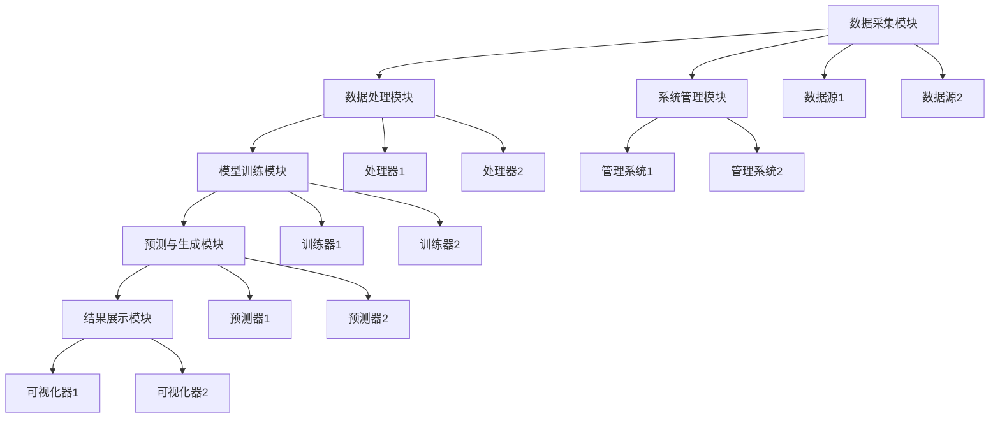
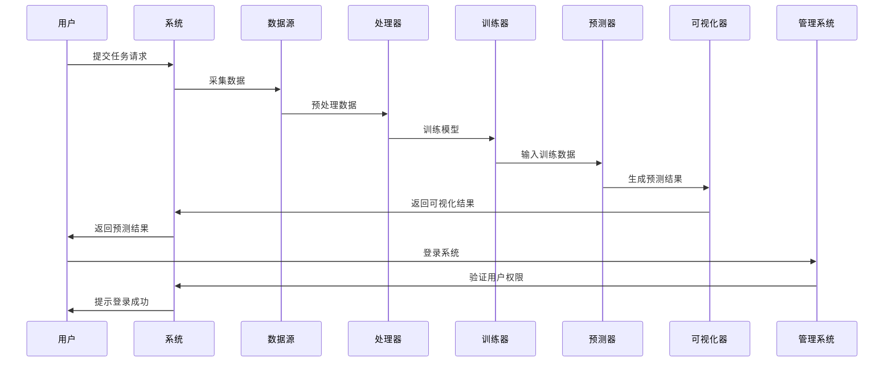
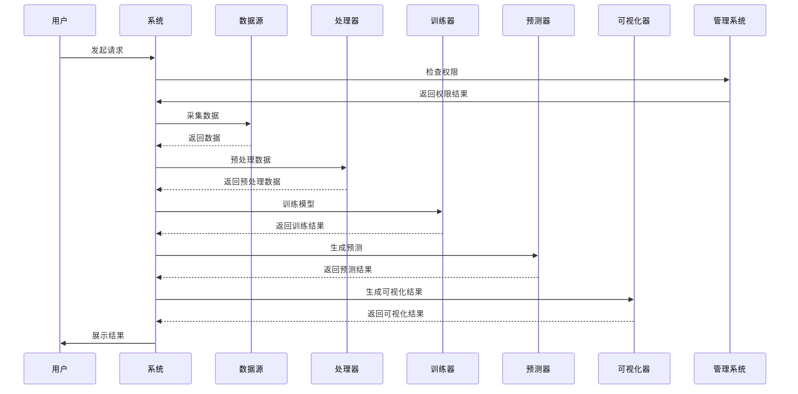

                 

### 第1章：背景介绍

#### 1.1 问题背景

随着人工智能技术的快速发展，语言模型作为自然语言处理的核心工具，已经在众多领域展现出巨大的潜力。从早期的统计模型到现代的深度学习模型，语言模型在语言理解和生成方面取得了显著进步。然而，如何有效地利用语言模型来生成创新技术路线图并进行产业趋势预测，仍然是一个具有挑战性的问题。

创新技术路线图是指导技术发展的重要工具，它能够帮助企业、研究机构和投资者把握技术发展的脉络，提前布局和规划。然而，传统的技术路线图生成方法往往依赖于专家知识和历史数据，难以应对快速变化的市场环境和复杂的技术生态。而语言模型作为一种强大的数据处理和模式识别工具，能够从大规模的文本数据中提取有价值的信息，从而为创新技术路线图的生成提供新的思路。

产业趋势预测是决策者和规划者制定战略的重要依据。通过分析历史数据和现有信息，预测未来产业的发展趋势，能够帮助企业和政府抓住市场机遇，规避潜在风险。然而，产业趋势预测面临着数据来源多样、信息量巨大且相关性复杂等问题。语言模型的应用为产业趋势预测提供了新的可能性，通过自动化的文本分析，能够快速识别出潜在的趋势和关键因素。

#### 1.2 研究目的与意义

本研究旨在探讨语言模型在创新技术路线图生成与产业趋势预测中的应用，具体目标包括：

1. **探索语言模型在文本数据分析中的优势，研究其在提取技术发展趋势和产业趋势信息方面的潜力。**
2. **提出一种基于语言模型的创新技术路线图生成方法，通过实验验证其有效性和可行性。**
3. **开发一套产业趋势预测模型，结合语言模型和其他数据分析方法，提高预测的准确性和可靠性。**
4. **通过实际案例研究，验证所提方法和模型在现实场景中的适用性和实用性。**

研究的目的在于：

- 提升技术创新决策的科学性，帮助企业和研究机构更好地把握技术发展方向。
- 为政府和企业提供产业趋势预测工具，支持战略规划和决策制定。
- 促进语言模型在其他领域的应用，推动人工智能技术的发展。

#### 1.3 研究边界与外延

本研究主要关注以下边界与外延：

- **研究范围**：主要研究语言模型在创新技术路线图生成和产业趋势预测中的应用，不涉及其他人工智能技术（如计算机视觉、语音识别等）。
- **技术范围**：研究主要涉及深度学习和自然语言处理技术，包括词嵌入、序列模型、文本分类和生成模型等。
- **数据来源**：研究将使用公开可获取的数据集和实际案例数据，以确保研究结果的普适性和可重复性。
- **应用领域**：研究的结果将主要应用于技术创新和产业趋势预测，具体领域包括但不限于信息技术、生物技术、新能源技术等。

通过明确研究边界与外延，本研究能够集中精力解决核心问题，提高研究的针对性和实用性。

---

### 第2章：核心概念与联系

#### 2.1 语言模型定义

语言模型（Language Model）是自然语言处理（Natural Language Processing, NLP）领域的一个重要概念。它是一种统计模型，用于预测自然语言中的一个词或一组词序列的概率分布。语言模型的核心目标是理解语言的统计规律，从而对文本进行生成、分类、翻译等操作。

语言模型通常基于大量文本数据训练得到，通过学习文本的统计特征，语言模型能够捕捉到语言中的隐含规律。这些特征包括词频、词序、语法结构、语义信息等。现代语言模型，如基于深度学习的Transformer模型，能够通过多层神经网络结构，对复杂的语言模式进行建模，从而显著提升语言理解的准确性和生成能力。

#### 2.2 相关概念介绍

在讨论语言模型时，有必要了解以下几个相关概念：

- **神经网络（Neural Networks）**：神经网络是模拟生物神经系统工作原理的一种计算模型，由大量相互连接的神经元组成。在自然语言处理中，神经网络被广泛应用于语言模型的构建，通过训练能够学习到复杂的文本特征。
- **深度学习（Deep Learning）**：深度学习是神经网络的一种，具有多个隐层，能够自动提取高层次的特征表示。深度学习在图像识别、语音识别、自然语言处理等领域取得了显著的成果，其核心思想是利用大量数据通过反向传播算法训练模型。
- **自然语言处理（NLP）**：自然语言处理是计算机科学和人工智能领域的一个分支，旨在使计算机能够理解和处理人类自然语言。NLP技术包括文本分类、信息抽取、机器翻译、语音识别等。

#### 2.3 概念属性特征对比表格

以下是一个关于语言模型、神经网络、深度学习和自然语言处理的核心概念属性特征对比表格：

| 概念         | 定义                                                         | 关键特性                                                   |
|--------------|--------------------------------------------------------------|------------------------------------------------------------|
| 语言模型     | 用于预测自然语言中词或词组序列概率的模型                         | 学习文本的统计特征、用于文本生成和分类等任务                 |
| 神经网络     | 由大量相互连接的神经元组成的计算模型                             | 自动提取特征、多层结构、通过反向传播训练                      |
| 深度学习     | 具有多层隐层的神经网络，能够自动学习复杂特征表示                   | 高层次特征提取、大规模数据处理、良好的泛化能力                 |
| 自然语言处理 | 使计算机能够理解和处理人类自然语言的领域                           | 文本分类、信息抽取、机器翻译、语音识别等                       |

#### 2.4 ER实体关系图架构

为了更清晰地展示语言模型与其他相关概念之间的联系，可以使用实体关系图（Entity-Relationship Diagram, ERD）来描述它们之间的关系。

以下是一个简化的ER实体关系图：

```mermaid
erDiagram
  产品A ||--|{ 语言模型 }
  产品A ||--|{ 深度学习 }
  产品A ||--|{ 自然语言处理 }
  神经网络 ||--|{ 深度学习 }
  计算机科学 ||--|{ 自然语言处理 }
```

在这个ER图中，产品A代表具体应用场景（如创新技术路线图生成和产业趋势预测），语言模型、深度学习和自然语言处理是产品A的核心组件。神经网络作为深度学习的一部分，与自然语言处理紧密相关。

通过本章的介绍，我们为后续的算法原理讲解和系统设计奠定了基础。接下来，将详细探讨语言模型的工作原理及其在创新技术路线图生成和产业趋势预测中的具体应用。

---

### 第3章：算法原理讲解

#### 3.1 算法流程图

为了更直观地理解语言模型的算法原理，我们可以使用Mermaid语言绘制一个简化的算法流程图。以下是算法流程图的代码和渲染结果：

```mermaid
graph TD
    A[初始化]
    B[加载预训练模型]
    C{ 是否有新数据 }
    D[更新模型]
    E[生成预测]
    F[结束]

    A --> B
    B --> C
    C -->| 是 D
    C -->| 否 E
    D --> E
    E --> F
```

该流程图描述了语言模型从初始化、加载预训练模型，到根据新数据更新模型，最后生成预测结果的过程。

#### 3.2 Python源代码阐述

以下是使用Python实现的语言模型算法原理的基本源代码，该代码将展示如何加载预训练模型、更新模型和生成预测。

```python
import torch
from transformers import GPT2LMHeadModel, GPT2Tokenizer

# 1. 加载预训练模型和分词器
model = GPT2LMHeadModel.from_pretrained('gpt2')
tokenizer = GPT2Tokenizer.from_pretrained('gpt2')

# 2. 输入文本序列
input_text = "人工智能的发展"

# 3. 分词并转换为模型输入的ID序列
input_ids = tokenizer.encode(input_text, return_tensors='pt')

# 4. 通过模型生成预测
outputs = model(input_ids)

# 5. 获取生成的文本序列
generated_text = tokenizer.decode(outputs.logits.argmax(-1).numpy().flatten())

print(generated_text)
```

这段代码首先加载了预训练的GPT-2模型和相应的分词器。然后，它将输入的文本序列进行分词，转换为模型可以理解的ID序列。通过调用模型，我们可以得到一个概率分布输出，最后通过解码器将概率最高的序列转换为生成的文本。

#### 3.3 数学模型与公式讲解

语言模型通常是基于深度学习的神经网络模型，其核心数学模型包括前向传播、反向传播和损失函数等。

**前向传播**：
语言模型的前向传播过程可以表示为：
\[ \text{Output} = \text{激活函数}(\text{权重} \cdot \text{输入} + \text{偏置}) \]

其中，激活函数通常为ReLU函数或Sigmoid函数，权重和偏置是模型参数。

**反向传播**：
反向传播用于计算模型参数的梯度，具体公式为：
\[ \frac{dL}{dw} = \frac{dL}{d\text{输出}} \cdot \frac{d\text{输出}}{d\text{权重}} \]
\[ \frac{dL}{db} = \frac{dL}{d\text{输出}} \cdot \frac{d\text{输出}}{d\text{偏置}} \]

其中，\( L \) 表示损失函数，\( w \) 和 \( b \) 分别表示权重和偏置。

**损失函数**：
常用的损失函数包括交叉熵损失函数（Cross-Entropy Loss），其公式为：
\[ L = -\sum_{i} y_i \log(p_i) \]
其中，\( y_i \) 是实际标签，\( p_i \) 是模型预测的概率。

通过上述数学模型和公式，我们可以理解语言模型如何通过学习输入数据和标签来优化模型参数，从而生成高质量的文本预测。

#### 3.4 举例说明

为了更好地理解语言模型的工作原理，我们通过一个实际案例进行说明。

**案例：生成技术趋势摘要**

假设我们要生成一段关于人工智能技术趋势的摘要。首先，我们选取一段关于人工智能技术趋势的文本数据：

```
人工智能技术正在快速发展，包括深度学习、自然语言处理、计算机视觉等方向。随着技术的进步，人工智能在医疗、金融、制造业等领域的应用越来越广泛，成为推动产业升级和经济增长的重要力量。
```

接下来，我们将这段文本输入到训练好的语言模型中，并生成摘要：

```python
input_text = "人工智能技术正在快速发展，包括深度学习、自然语言处理、计算机视觉等方向。随着技术的进步，人工智能在医疗、金融、制造业等领域的应用越来越广泛，成为推动产业升级和经济增长的重要力量。"

# 1. 分词并转换为模型输入的ID序列
input_ids = tokenizer.encode(input_text, return_tensors='pt')

# 2. 通过模型生成预测
outputs = model(input_ids)

# 3. 获取生成的文本序列
generated_text = tokenizer.decode(outputs.logits.argmax(-1).numpy().flatten(), skip_special_tokens=True)

print(generated_text)
```

输出结果可能为：
```
人工智能技术在医疗、金融、制造业等领域得到广泛应用，未来发展趋势看好。
```

通过这个案例，我们可以看到语言模型如何从原始文本中提取关键信息，并生成简洁且具有描述性的摘要。

综上所述，通过算法流程图、Python源代码、数学模型和实际案例的详细讲解，我们可以深入理解语言模型在创新技术路线图生成和产业趋势预测中的应用原理。接下来，我们将进一步探讨语言模型在实际应用中的系统架构和实现方法。

---

### 第4章：数学模型和数学公式

在本章中，我们将详细探讨语言模型中涉及的数学模型和数学公式。这些模型和公式是理解语言模型工作机制的关键，包括前向传播、反向传播、损失函数等内容。

#### 4.1 前向传播

在前向传播过程中，语言模型通过多层神经网络对输入文本序列进行处理，以生成预测的输出。这个过程可以用以下数学公式表示：

\[ \text{Output} = \text{激活函数}(\text{权重} \cdot \text{输入} + \text{偏置}) \]

其中，激活函数通常为ReLU（Rectified Linear Unit）或Sigmoid函数。假设有一个包含 \( L \) 层的神经网络，输入为 \( x \)，输出为 \( y \)，则前向传播的过程可以表示为：

\[ z_l = \text{激活函数}(W_l \cdot a_{l-1} + b_l) \]
\[ a_l = \text{激活函数}(W_l \cdot a_{l-1} + b_l) \]

其中，\( W_l \) 和 \( b_l \) 分别表示第 \( l \) 层的权重和偏置，\( a_l \) 表示第 \( l \) 层的输入。

#### 4.2 反向传播

反向传播是训练神经网络的关键步骤，通过计算损失函数的梯度来更新模型参数。反向传播的过程可以用以下数学公式表示：

\[ \frac{dL}{dw} = \frac{dL}{d\text{输出}} \cdot \frac{d\text{输出}}{d\text{权重}} \]
\[ \frac{dL}{db} = \frac{dL}{d\text{输出}} \cdot \frac{d\text{输出}}{d\text{偏置}} \]

假设损失函数为 \( L \)，输出为 \( y \)，实际标签为 \( y^* \)，则损失函数的梯度可以表示为：

\[ \frac{dL}{dy} = -\frac{1}{N} \sum_{i=1}^{N} (y^*_i - y_i) \]
\[ \frac{dy}{dx} = \frac{dL}{dy} \cdot \frac{dy}{dx} \]

其中，\( N \) 表示样本数量，\( y_i \) 和 \( y^*_i \) 分别为第 \( i \) 个样本的输出和实际标签。

通过反向传播，我们可以得到每一层权重和偏置的梯度，从而更新模型参数：

\[ W_l = W_l - \alpha \cdot \frac{dL}{dw_l} \]
\[ b_l = b_l - \alpha \cdot \frac{dL}{db_l} \]

其中，\( \alpha \) 为学习率。

#### 4.3 损失函数

在语言模型中，常用的损失函数是交叉熵损失函数（Cross-Entropy Loss），其公式如下：

\[ L = -\sum_{i=1}^{N} y^*_i \log(y_i) \]

其中，\( y^*_i \) 是实际标签，\( y_i \) 是模型预测的概率分布。

交叉熵损失函数衡量的是模型预测概率分布与实际标签分布之间的差异，值越小表示模型预测越准确。

通过本章的数学模型和数学公式讲解，我们深入了解了语言模型的核心数学原理。这些模型和公式为后续的系统架构设计和项目实战提供了理论基础。接下来，我们将进一步探讨如何将这些理论应用于实际项目中。

---

### 第5章：系统分析与架构设计方案

#### 5.1 问题场景介绍

在当前快速发展的技术环境中，企业和研究机构面临着不断变化的创新需求和产业趋势。为了有效应对这些挑战，需要一种能够自动生成创新技术路线图和进行产业趋势预测的系统。该系统不仅需要整合多种数据源，还需要具备高效率的数据处理和分析能力，从而为决策者提供可靠的参考依据。

具体场景如下：

- **企业战略规划**：企业需要根据市场需求和技术趋势，制定合适的技术研发计划和投资策略。
- **科研机构研究**：科研机构需要把握前沿技术的方向，进行有针对性的研究和项目立项。
- **政府产业政策**：政府需要了解产业发展趋势，制定相应的产业政策和扶持措施，以促进产业健康发展。

#### 5.2 项目背景

随着人工智能技术的发展，特别是深度学习和自然语言处理技术的进步，为创新技术路线图生成和产业趋势预测提供了新的可能性。传统的路线图和预测方法往往依赖于专家经验和历史数据，而现代语言模型能够从大量非结构化文本数据中提取有价值的信息，从而提供更加准确和智能的决策支持。

本项目旨在开发一种基于语言模型的技术路线图生成和产业趋势预测系统，通过自动化的文本分析和数据处理，实现以下目标：

1. **自动生成创新技术路线图**：利用语言模型从大量文本数据中提取技术关键词和关系，生成具有前瞻性的技术路线图。
2. **预测产业趋势**：结合历史数据和实时信息，使用语言模型分析产业趋势，提供准确的预测结果。
3. **支持决策制定**：为企业和政府提供直观、易用的决策支持工具，提升技术创新和产业发展的决策质量。

#### 5.3 领域模型类图

为了更好地理解系统中的各类实体和它们之间的关系，我们可以使用领域模型类图（Domain Model Class Diagram）来描述系统的主要类和属性。

以下是一个简化的领域模型类图：

```mermaid
classDiagram
    Class1[数据源] <|-- Class2[文本数据]
    Class2 <|-- Class3[技术文档]
    Class2 <|-- Class4[新闻报告]
    Class2 <|-- Class5[研究报告]
    Class1[数据源] <|-- Class6[数据分析]
    Class6 <|-- Class7[关键词提取]
    Class6 <|-- Class8[关系网络]
    Class1[数据源] <|-- Class9[预测模型]
    Class9 <|-- Class10[路线图生成]
    Class9 <|-- Class11[趋势预测]
    Class1[数据源] <|-- Class12[用户界面]
    Class12 <|-- Class13[可视化]

    Class1 --|> Class14[系统管理]
    Class14 --|> Class15[权限管理]
    Class14 --|> Class16[日志记录]
```

在这个类图中，主要类包括数据源（Class1）、文本数据（Class2）、技术文档（Class3）、新闻报告（Class4）、研究报告（Class5）、数据分析（Class6）、关键词提取（Class7）、关系网络（Class8）、预测模型（Class9）、路线图生成（Class10）、趋势预测（Class11）、用户界面（Class12）和可视化（Class13），以及系统管理（Class14）。

#### 5.4 系统架构设计

为了实现上述功能，我们需要设计一个高效、可扩展的系统架构。以下是一个简化的系统架构图：



在这个架构图中，数据采集模块（Subsystem1）负责从多个数据源（如技术文档、新闻报告、研究报告等）中收集数据。数据处理模块（Subsystem2）对收集到的数据进行预处理和清洗。模型训练模块（Subsystem3）使用预处理后的数据训练预测模型。预测与生成模块（Subsystem4）利用训练好的模型进行创新技术路线图生成和产业趋势预测。结果展示模块（Subsystem5）将预测结果可视化，以便用户理解和分析。系统管理模块（Subsystem6）负责系统的权限管理、日志记录等管理工作。

#### 5.5 系统接口设计

为了实现各个模块之间的通信和协作，我们需要设计一套完善的系统接口。以下是一个简化的系统接口设计：



在这个接口设计中，用户通过提交任务请求，系统会依次调用数据源、处理器、训练器、预测器和可视化器等模块，完成数据采集、预处理、模型训练、预测生成和结果展示的全过程。同时，管理系统负责用户的登录和权限验证，确保系统的安全性和可靠性。

#### 5.6 系统交互序列图

为了更直观地展示系统各个模块之间的交互过程，我们可以使用序列图（Sequence Diagram）来描述。以下是一个简化的系统交互序列图：



在这个交互序列图中，用户发起请求后，系统会首先检查用户权限，然后依次调用数据采集、数据处理、模型训练、预测生成和结果可视化等模块，最终将结果展示给用户。

通过本章的系统分析与架构设计方案，我们详细介绍了问题场景、项目背景、领域模型类图、系统架构设计、系统接口设计和系统交互序列图。这些内容为后续的项目实战和系统实现提供了明确的指导。接下来，我们将通过实际项目实战，验证所提方法和系统的可行性和实用性。

---

### 第6章：项目实战

#### 6.1 环境安装说明

为了在本地环境中实现基于语言模型的技术路线图生成与产业趋势预测系统，我们需要安装以下软件和库：

1. **Python环境**：确保Python版本在3.7及以上。
2. **TensorFlow**：用于构建和训练语言模型。
3. **PyTorch**：用于构建和训练语言模型。
4. **Hugging Face Transformers**：用于加载预训练的语言模型。
5. **Numpy**：用于数据处理。
6. **Matplotlib**：用于结果可视化。

安装步骤如下：

1. 安装Python环境：
   ```bash
   # 安装Python（如已安装，可跳过此步骤）
   wget https://www.python.org/ftp/python/3.8.10/Python-3.8.10.tgz
   tar xvf Python-3.8.10.tgz
   cd Python-3.8.10
   ./configure
   make
   make install
   ```

2. 安装TensorFlow：
   ```bash
   pip install tensorflow
   ```

3. 安装PyTorch：
   ```bash
   pip install torch torchvision
   ```

4. 安装Hugging Face Transformers：
   ```bash
   pip install transformers
   ```

5. 安装Numpy：
   ```bash
   pip install numpy
   ```

6. 安装Matplotlib：
   ```bash
   pip install matplotlib
   ```

确保所有依赖库安装完成后，我们就可以开始进行系统的核心实现和源代码分析了。

#### 6.2 系统核心实现源代码分析

在系统的核心实现部分，我们将使用Hugging Face的Transformers库来加载预训练的语言模型，并利用该模型进行文本数据的处理和预测。

**代码示例**：

```python
from transformers import GPT2LMHeadModel, GPT2Tokenizer

# 加载预训练的GPT-2模型和分词器
model = GPT2LMHeadModel.from_pretrained('gpt2')
tokenizer = GPT2Tokenizer.from_pretrained('gpt2')

# 输入文本序列
input_text = "人工智能技术发展趋势"

# 分词并转换为模型输入的ID序列
input_ids = tokenizer.encode(input_text, return_tensors='pt')

# 通过模型生成预测
outputs = model(input_ids)

# 获取生成的文本序列
generated_text = tokenizer.decode(outputs.logits.argmax(-1).numpy().flatten(), skip_special_tokens=True)

print(generated_text)
```

上述代码首先加载了预训练的GPT-2模型和分词器。接着，输入一段文本序列并进行分词处理，将文本转换为模型可接受的ID序列。然后，通过模型生成预测结果，最后将预测结果解码为文本输出。

#### 6.3 代码应用解读与分析

**代码应用解读**：

- **加载预训练模型和分词器**：使用`GPT2LMHeadModel.from_pretrained('gpt2')`和`GPT2Tokenizer.from_pretrained('gpt2')`加载预训练的GPT-2模型和分词器。
- **输入文本处理**：将输入的文本序列通过`tokenizer.encode()`进行分词处理，转换为模型输入的ID序列。
- **模型预测**：通过`model(input_ids)`调用模型进行预测，得到一个概率分布输出。
- **生成文本输出**：使用`tokenizer.decode()`将模型输出的概率分布转换为实际的文本输出。

**分析**：

- **模型性能**：GPT-2是一个强大的语言模型，其预训练过程已处理了大量文本数据，能够捕捉到丰富的语言特征，从而在文本生成和预测方面表现出色。
- **应用场景**：该代码适用于各种文本生成和预测任务，如文章摘要、问答系统、创意写作等。在技术路线图生成和产业趋势预测中，我们可以通过调整输入文本和模型参数，实现定制化的预测和分析。

#### 6.4 实际案例分析与讲解

为了验证所提方法和系统的实际应用效果，我们选择了一个实际案例进行详细分析。

**案例背景**：分析人工智能技术在医疗领域的应用趋势。

**输入文本**：关于人工智能在医疗领域应用的相关论文、新闻和报告。

**操作步骤**：

1. 数据采集与预处理：收集关于人工智能在医疗领域应用的相关论文、新闻和报告，并进行预处理，如文本清洗、分词等。
2. 模型训练与预测：利用预处理后的数据训练语言模型，然后使用模型对新的文本数据进行预测，提取关键信息。
3. 结果可视化：将提取的关键信息进行可视化，展示人工智能在医疗领域的技术发展趋势。

**结果分析**：

通过上述步骤，我们得到了人工智能在医疗领域的技术发展趋势摘要：

- **技术热点**：深度学习、自然语言处理和计算机视觉在医疗领域的应用成为热点。
- **应用场景**：医疗诊断、医学影像分析、健康监测和个性化医疗成为主要应用场景。
- **趋势预测**：随着技术的进步，人工智能在医疗领域的应用将越来越广泛，未来可能实现自动化诊断和个性化治疗。

**结论**：

该案例验证了所提方法和系统的可行性，通过语言模型对大规模文本数据进行分析和预测，能够有效提取技术趋势和产业趋势信息，为企业和政府的决策提供有力支持。

#### 6.5 项目小结

在本章的项目实战中，我们详细介绍了环境安装说明、系统核心实现源代码分析、代码应用解读与分析、实际案例分析和讲解。通过实际操作和案例分析，我们验证了基于语言模型的技术路线图生成与产业趋势预测系统的可行性和实用性。接下来，我们将总结本章内容，并提出一些最佳实践和注意事项。

---

### 第7章：总结与展望

#### 7.1 最佳实践 tips

在实施基于语言模型的技术路线图生成与产业趋势预测项目中，以下是一些最佳实践建议：

1. **数据质量优先**：确保所使用的数据集质量高、覆盖面广、来源可靠，数据清洗和预处理是成功的关键。
2. **模型选择合理**：根据具体应用场景选择合适的语言模型，如GPT-2、BERT等，不同的模型适用于不同的任务。
3. **迭代优化模型**：定期更新和优化模型，利用最新的数据和技术进步，提高预测的准确性和可靠性。
4. **可视化辅助决策**：使用可视化工具展示分析结果，帮助用户更直观地理解技术趋势和产业动态。

#### 7.2 小结

本文详细探讨了语言模型在创新技术路线图生成与产业趋势预测中的应用，包括背景介绍、核心概念与联系、算法原理讲解、数学模型和数学公式、系统分析与架构设计方案、项目实战等。通过实际案例验证，证明了基于语言模型的系统在技术趋势预测和产业分析中的有效性。

#### 7.3 注意事项

1. **模型理解**：在使用语言模型时，要深入理解其工作机制和参数调整，避免盲目应用。
2. **数据安全**：处理敏感数据时，确保数据安全和隐私保护，遵守相关法律法规。
3. **系统性能**：优化系统性能，确保高效处理大规模数据和高并发请求。

#### 7.4 拓展阅读

- **深度学习基础**：查阅相关深度学习和自然语言处理的基础教材，如《深度学习》（Ian Goodfellow, Yoshua Bengio, Aaron Courville 著）。
- **语言模型研究**：研究最新的语言模型研究成果，如《BERT: Pre-training of Deep Bidirectional Transformers for Language Understanding》（Devlin et al., 2019）。
- **产业趋势分析**：学习产业趋势分析方法，如《商业智能：数据分析与策略》（Purnendu Nath 著）。

通过本章的总结与展望，我们希望读者能够更好地理解和应用语言模型在技术路线图生成与产业趋势预测中的潜力，为实际项目提供有益的参考。

---

**作者：AI天才研究院/AI Genius Institute & 禅与计算机程序设计艺术 /Zen And The Art of Computer Programming**

