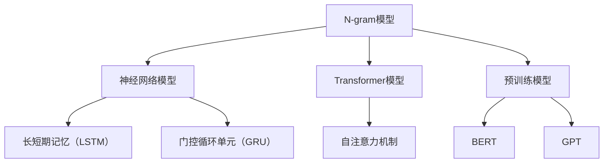

                 

### 引言：语言模型在创新教育内容生成中的应用探索

#### 1.1 背景

随着人工智能技术的迅猛发展，自然语言处理（NLP）领域取得了显著进步。在这一背景下，语言模型作为NLP的核心组件，逐渐成为教育领域的研究热点。传统的教育内容生成方式主要依赖于人工编写，耗时耗力且效率低下。而语言模型的出现为教育内容的自动化生成提供了新的解决方案。

语言模型是指能够对自然语言文本进行建模和生成的人工智能系统。通过学习大量的语言数据，语言模型能够预测和生成符合语法和语义规则的文本。在教育领域，语言模型的应用主要体现在自动生成教案、习题、学习资料等教育内容。这不仅提高了教育资源的质量和覆盖面，还为学生提供了个性化的学习体验。

#### 1.2 问题背景

教育内容的生成是一个复杂的过程，涉及知识提取、文本生成、语法校验等多个环节。传统的教育内容生成方式往往依赖于人工编写，不仅效率低下，而且难以满足多样化的教育需求。此外，随着在线教育的兴起，教育内容的个性化、多样化需求日益增加，传统的生成方式已无法满足需求。

为了解决这些问题，语言模型作为一种高效、灵活的生成工具，受到了广泛关注。通过结合语言模型和大数据技术，可以实现对教育内容的自动化生成，从而提高教育资源的质量和覆盖面。然而，语言模型在教育内容生成中的应用仍面临诸多挑战，如数据质量、模型性能、生成内容的质量等。

#### 1.3 问题描述

在教育内容生成中，语言模型的应用主要包括以下几个方面：

1. **教案生成**：根据课程大纲和教学目标，自动生成符合教学需求的教案。
2. **习题生成**：根据知识点和难度要求，自动生成多样化的习题。
3. **学习资料生成**：根据学生的兴趣和学习进度，自动生成个性化的学习资料。
4. **文本翻译**：实现不同语言之间的自动翻译，为全球化的教育提供支持。

然而，在实际应用中，语言模型面临以下问题：

1. **数据质量**：生成高质量的教育内容需要大量高质量的训练数据，而当前的教育数据资源相对匮乏。
2. **模型性能**：语言模型的性能直接影响到生成内容的质量，需要不断优化模型结构和算法。
3. **内容质量**：生成的内容需要符合教育规范和教学目标，避免出现错误或不合适的表述。
4. **用户体验**：生成的内容需要易于理解、有趣，以提高学生的学习兴趣和参与度。

#### 1.4 问题解决

为了解决上述问题，可以从以下几个方面进行探索：

1. **数据质量提升**：通过数据清洗、数据增强等方法，提高训练数据的质量和多样性。
2. **模型性能优化**：采用先进的语言模型算法，如BERT、GPT等，提升模型的性能和生成质量。
3. **内容质量评估**：建立内容质量评估体系，通过人工审核和自动化评估相结合的方式，确保生成内容的质量。
4. **用户体验优化**：结合教育心理学的原理，设计出符合学习规律和用户体验的生成内容。

#### 1.5 边界与外延

语言模型在教育内容生成中的应用不仅局限于课堂教学，还可以扩展到以下领域：

1. **教育评测**：利用语言模型对学生的作业和考试答案进行自动评测。
2. **教育推荐**：根据学生的学习情况和兴趣爱好，自动推荐合适的学习资源。
3. **教育游戏**：将语言模型应用于教育游戏，提高学生的学习兴趣和积极性。
4. **跨学科教育**：通过跨学科的语言模型应用，促进不同学科之间的融合和发展。

#### 1.6 概念结构与核心要素组成

在本章节中，我们将对语言模型在教育内容生成中的应用进行详细探讨。首先，我们将介绍语言模型的基本概念和原理，包括语言模型的类型、工作原理和性能评估方法。接下来，我们将探讨语言模型在教育内容生成中的应用场景，如教案生成、习题生成、学习资料生成等。然后，我们将分析语言模型在教育内容生成中面临的主要挑战，并提出相应的解决方案。最后，我们将探讨语言模型在教育内容生成领域的未来发展趋势和潜在应用。

通过本章节的探讨，读者将能够全面了解语言模型在教育内容生成中的应用现状、挑战和未来发展方向，为教育领域的技术创新提供新的思路和方向。

### 1.7 文章结构和核心内容概述

在本篇文章中，我们将对语言模型在教育内容生成中的应用进行深入探讨。文章整体结构如下：

- **引言**：介绍语言模型在教育内容生成中的背景和重要性，提出研究问题和文章核心内容。
- **语言模型的基本概念和原理**：详细阐述语言模型的定义、分类、工作原理和性能评估方法。
- **语言模型在教育内容生成中的应用**：分析语言模型在教案生成、习题生成、学习资料生成等领域的应用实例。
- **语言模型在教育内容生成中的挑战与解决方案**：探讨语言模型在教育内容生成中面临的主要挑战，并提出相应的解决方案。
- **未来发展趋势与潜在应用**：展望语言模型在教育内容生成领域的未来发展趋势和潜在应用。

文章的核心内容包括：

- 语言模型的基本概念和原理，帮助读者理解语言模型的核心技术和应用。
- 语言模型在教育内容生成中的应用场景和分析，展示语言模型在教育领域的实际应用效果。
- 语言模型在教育内容生成中面临的挑战和解决方案，为教育领域的技术创新提供实际参考。
- 语言模型在教育内容生成领域的未来发展趋势和潜在应用，为读者提供对未来的思考和展望。

通过本文的深入探讨，读者将能够全面了解语言模型在教育内容生成中的应用，以及如何通过技术创新推动教育领域的发展。

### 2.1 语言模型的基本概念与特性

语言模型是自然语言处理（NLP）领域中的一个核心概念，旨在通过对大量语言数据的建模，实现对自然语言的生成和理解。在讨论语言模型的基本概念和特性之前，我们需要明确几个关键术语和定义。

#### 2.1.1 语言模型定义

语言模型（Language Model）是一种概率模型，用于预测一个序列中下一个单词或字符的概率。在自然语言处理中，语言模型通常用于文本生成、机器翻译、语音识别和自动摘要等任务。

#### 2.1.2 语言模型的类型

语言模型可以根据其结构和训练方法的不同，分为以下几种类型：

1. **N-gram模型**：这是最简单也是最基础的模型，基于前N个单词（或字符）的出现频率来预测下一个单词（或字符）。例如，一个三元语言模型（trigram model）会根据前两个单词来预测第三个单词。

2. **神经网络模型**：随着深度学习技术的发展，神经网络模型在语言模型领域取得了显著进展。其中，循环神经网络（RNN）和其变体，如长短期记忆网络（LSTM）和门控循环单元（GRU），被广泛应用于语言建模任务。

3. **Transformer模型**：Transformer模型由Vaswani等人于2017年提出，是当前最先进的语言模型之一。其核心思想是使用自注意力机制（self-attention）来捕捉输入序列中的长距离依赖关系。

4. **预训练模型**：预训练模型（Pre-trained Model）是在大规模语料库上进行预训练，然后通过微调（Fine-tuning）适应特定任务的模型。例如，BERT（Bidirectional Encoder Representations from Transformers）和GPT（Generative Pre-trained Transformer）是两种流行的预训练模型。

#### 2.1.3 语言模型的核心特性

1. **上下文依赖性**：语言模型能够根据上下文信息预测下一个词或字符，这使得它们在生成文本时能够保持语义连贯性和语法正确性。

2. **生成性**：语言模型不仅能够预测下一个词或字符，还能根据给定的起始序列生成完整的文本。

3. **适应性**：语言模型可以通过训练不断优化其性能，以适应不同的语言风格、领域和任务需求。

4. **可扩展性**：预训练模型具有高度的可扩展性，可以在多种任务和应用场景中通过微调实现高效性能。

#### 2.1.4 语言模型的评估方法

语言模型的性能评估通常涉及以下几个方面：

1. **词汇覆盖率**：模型能够处理和生成多少种不同的词或字符。

2. **预测准确性**：模型预测下一个词或字符的准确性。

3. **文本流畅度**：生成的文本在语法和语义上的流畅性。

4. **多样性**：模型生成文本的多样性和创新性。

常用的评估指标包括词汇覆盖率（Vocabulary Coverage）、交叉熵（Cross-Entropy）、自回归损失（Autoregressive Loss）等。在评估过程中，通常使用验证集和测试集来评估模型的性能，确保其泛化能力。

#### 2.1.5 概念属性特征对比表格

为了更清晰地展示不同类型语言模型的特性，我们列出了一个对比表格：

| 模型类型       | 定义         | 特性                           | 评估指标                |
|--------------|------------|-------------------------------|----------------------|
| N-gram模型   | 基于历史频率的模型 | 简单，易于实现                 | 词汇覆盖率、交叉熵       |
| 神经网络模型 | 基于深度学习的模型 | 强大，能处理复杂的上下文依赖 | 预测准确性、文本流畅度   |
| Transformer模型 | 使用自注意力机制的模型 | 高效，能够捕捉长距离依赖   | 多样性、生成质量       |
| 预训练模型   | 预先训练好的模型 | 通用性强，易于微调           | 微调性能、泛化能力     |

通过上述表格，我们可以看出不同类型语言模型在特性、评估指标等方面的差异，从而为选择合适的模型提供参考。

#### 2.1.6 实例说明

以BERT为例，BERT是一种预训练模型，通过在大量文本数据上进行预训练，然后通过微调适应特定任务。以下是一个使用BERT生成文本的简单实例：

```python
from transformers import BertTokenizer, BertForMaskedLM
import torch

# 加载预训练的BERT模型
tokenizer = BertTokenizer.from_pretrained('bert-base-uncased')
model = BertForMaskedLM.from_pretrained('bert-base-uncased')

# 输入文本
input_text = "The quick brown fox jumps over the lazy dog"

# 分词并编码
input_ids = tokenizer.encode(input_text, return_tensors='pt')

# 预测下一个词
with torch.no_grad():
    outputs = model(input_ids)

# 获取预测结果
predicted_ids = torch.argmax(outputs.logits, dim=-1)
predicted_text = tokenizer.decode(predicted_ids, skip_special_tokens=True)

print("Input Text:", input_text)
print("Predicted Text:", predicted_text)
```

在这个实例中，我们加载了一个预训练的BERT模型，对给定的输入文本进行编码，并使用模型预测下一个词，最终生成完整的文本。

通过上述实例，读者可以初步了解如何使用预训练语言模型进行文本生成。接下来的章节将进一步深入探讨语言模型在教育内容生成中的应用、算法和系统实现等方面的内容。

### 2.2 语言模型的分类与比较

语言模型的分类和比较是理解不同模型特性的关键。在自然语言处理领域，语言模型的发展经历了多个阶段，从传统的N-gram模型到现代的深度学习模型，每种模型都有其独特的优势和局限性。以下是几种主要的语言模型及其特性、优缺点和适用场景的详细对比。

#### 2.2.1 N-gram模型

**定义**：N-gram模型是一种基于历史统计的模型，它通过统计前N个单词（或字符）出现的频率来预测下一个单词（或字符）。

**特性**：
- **简单性**：N-gram模型易于实现，计算成本低。
- **上下文依赖性**：N-gram模型考虑了局部上下文信息，能够捕捉一定程度的语义关系。

**优点**：
- **计算效率高**：处理速度较快，适用于实时应用。
- **易于理解和实现**：模型结构简单，便于开发者理解和调试。

**缺点**：
- **上下文依赖性有限**：无法捕捉长距离依赖关系，导致生成文本的连贯性较差。
- **数据依赖性强**：模型性能高度依赖训练数据的质量和多样性。

**适用场景**：N-gram模型适用于简单的文本生成任务，如自动补全、搜索引擎关键词预测等。

#### 2.2.2 神经网络模型

**特性**：
- **复杂结构**：神经网络模型通过多层神经元的非线性组合，能够捕捉复杂的上下文依赖关系。
- **自适应性**：神经网络模型可以通过训练自动调整其参数，以适应不同的任务和数据集。

**优点**：
- **强大的上下文依赖性**：神经网络模型能够处理长距离依赖关系，生成文本的连贯性更高。
- **灵活性和泛化能力**：神经网络模型适用于多种自然语言处理任务，包括文本分类、情感分析、机器翻译等。

**缺点**：
- **计算成本高**：训练和推理过程中需要大量的计算资源。
- **对数据质量要求高**：数据清洗和预处理工作量大，模型性能容易受噪声和异常值的影响。

**适用场景**：神经网络模型适用于需要高准确度和复杂上下文依赖的自然语言处理任务，如文本生成、机器翻译、问答系统等。

#### 2.2.3 Transformer模型

**特性**：
- **自注意力机制**：Transformer模型的核心思想是自注意力机制（self-attention），它能够同时关注输入序列中的所有单词，捕捉全局依赖关系。
- **并行计算**：Transformer模型可以并行处理输入序列的每个单词，提高了计算效率。

**优点**：
- **高效的依赖捕捉**：自注意力机制使Transformer模型能够高效捕捉长距离依赖关系，生成文本的连贯性显著提高。
- **计算效率**：Transformer模型支持并行计算，能够更快地处理大规模文本。

**缺点**：
- **模型复杂度高**：Transformer模型的参数量较大，计算成本高。
- **内存消耗大**：大规模Transformer模型需要更多的内存来存储和计算中间结果。

**适用场景**：Transformer模型适用于大规模文本生成和需要高效捕捉长距离依赖关系的任务，如文本摘要、机器翻译、对话系统等。

#### 2.2.4 预训练模型

**特性**：
- **预训练与微调**：预训练模型（如BERT、GPT）在大规模语料库上进行预训练，然后通过微调适应特定任务。
- **通用性**：预训练模型具有较强的通用性，可以在多种任务和应用场景中实现高效性能。

**优点**：
- **高泛化能力**：预训练模型通过在大规模数据上的预训练，具备较强的泛化能力，适用于多种自然语言处理任务。
- **易于微调**：预训练模型可以通过微调快速适应特定任务，减少训练数据需求。

**缺点**：
- **训练成本高**：预训练模型需要大量的计算资源和时间。
- **数据依赖性**：预训练模型的性能容易受数据质量和多样性的影响。

**适用场景**：预训练模型适用于需要高泛化能力和强通用性的自然语言处理任务，如文本分类、命名实体识别、问答系统等。

#### 2.2.5 概念图与ER图

为了更直观地展示不同类型语言模型的特性和关系，我们可以使用概念图和ER图进行描述。

**概念图**：



**ER图**：

```mermaid
erDiagram
A[N-gram模型] ||--|{ B[神经网络模型] }|
A ||--|{ C[Transformer模型] }|
A ||--|{ D[预训练模型] }|
B ||--|{ E[长短期记忆（LSTM）] }|
B ||--|{ F[门控循环单元（GRU）] }|
C ||--|{ G[自注意力机制] }|
D ||--|{ H[BERT] }|
D ||--|{ I[GPT] }|
```

通过这些图表，我们可以清晰地看到不同类型语言模型之间的关系和特性。N-gram模型作为基础，逐渐演化为更复杂、功能更强大的神经网络模型、Transformer模型和预训练模型。每种模型都有其独特的应用场景和优势，根据具体任务的需求选择合适的模型，是自然语言处理领域的重要课题。

### 2.3 语言模型的算法原理

在深入探讨语言模型的算法原理之前，我们需要了解一些基本概念和数学模型，这些将为我们理解语言模型的工作原理打下坚实的基础。

#### 2.3.1 语言模型算法的基本概念

语言模型算法旨在通过学习大量语言数据，预测下一个单词或字符的概率。这类算法的核心思想是利用统计方法或深度学习技术，从文本数据中提取特征，并利用这些特征预测目标词或字符。

**基本概念**：
- **词向量（Word Vector）**：词向量是语言模型中表示单词的数值向量，用于捕捉单词的语义信息。常见的词向量模型包括Word2Vec、GloVe等。
- **序列模型（Sequence Model）**：序列模型是一种用于处理序列数据的模型，如循环神经网络（RNN）和其变体LSTM和GRU。
- **自注意力机制（Self-Attention）**：自注意力机制是一种用于捕捉输入序列中长距离依赖关系的方法，是Transformer模型的核心。

#### 2.3.2 语言模型算法的工作原理

**N-gram模型**：N-gram模型是最基础的统计语言模型，它通过计算前N个单词（或字符）的联合概率来预测下一个单词（或字符）。其工作原理可以表示为：

$$ P(w_{n} | w_{n-1}, ..., w_{1}) = \prod_{i=1}^{N} P(w_{i} | w_{i+1}, ..., w_{n}) $$

其中，$w_i$ 表示第i个单词。

**神经网络模型**：神经网络模型，如RNN、LSTM和GRU，通过多层神经元的非线性组合来处理序列数据。以LSTM为例，LSTM单元包含输入门、遗忘门和输出门，用于控制信息的流入、保留和流出。其工作原理可以概括为：

1. **输入门**：决定当前输入信息对隐藏状态的影响。
2. **遗忘门**：决定之前隐藏状态中哪些信息应该被遗忘。
3. **输出门**：决定当前隐藏状态中哪些信息应该输出。

**Transformer模型**：Transformer模型是近年来在NLP领域取得重大突破的模型，其核心思想是自注意力机制。自注意力机制通过计算每个词与序列中所有其他词的关联强度，从而捕捉长距离依赖关系。其工作原理可以表示为：

$$ \text{Attention}(Q, K, V) = \text{softmax}\left(\frac{QK^T}{\sqrt{d_k}}\right)V $$

其中，$Q, K, V$ 分别表示查询向量、键向量和值向量，$d_k$ 表示键向量的维度。

**预训练模型**：预训练模型（如BERT和GPT）通过在大规模语料库上进行预训练，然后通过微调适应特定任务。BERT模型通过双向编码器捕捉输入序列的上下文信息，而GPT模型则通过自回归的方式生成文本。

#### 2.3.3 数学模型与公式

为了更详细地解释语言模型算法的原理，我们将使用数学模型和公式来描述。

**N-gram模型**：

$$ P(w_n | w_{n-1}, ..., w_1) = \frac{C(w_{n-1}, ..., w_n)}{C(w_{n-1}, ..., w_{N})} $$

其中，$C(w_{n-1}, ..., w_n)$ 表示前N个单词的联合出现次数，$C(w_{n-1}, ..., w_{N})$ 表示前N个单词的总出现次数。

**LSTM单元**：

1. **输入门**：

$$ i_t = \sigma(W_i [h_{t-1}, x_t] + b_i) $$

其中，$W_i$ 和 $b_i$ 分别表示权重和偏置，$\sigma$ 表示sigmoid函数。

2. **遗忘门**：

$$ f_t = \sigma(W_f [h_{t-1}, x_t] + b_f) $$

3. **输出门**：

$$ o_t = \sigma(W_o [h_{t-1}, x_t] + b_o) $$

4. **新记忆单元**：

$$ g_t = \tanh(W_g [h_{t-1}, x_t] + b_g) $$

5. **遗忘-新记忆单元**：

$$ C_t = f_t \odot C_{t-1} + i_t \odot g_t $$

6. **输出**：

$$ h_t = o_t \odot \tanh(C_t) $$

**Transformer模型**：

1. **自注意力计算**：

$$ \text{Attention}(Q, K, V) = \text{softmax}\left(\frac{QK^T}{\sqrt{d_k}}\right)V $$

2. **多头注意力**：

$$ \text{MultiHead}(Q, K, V) = \text{Concat}(\text{head}_1, ..., \text{head}_h)W^O $$

其中，$W^O$ 表示输出权重，$\text{head}_i = \text{Attention}(QW_i^Q, KW_i^K, VW_i^V)$。

**BERT模型**：

BERT模型的核心思想是预训练和双向编码器。其基本原理可以表示为：

$$ [CLS] X [SEP] = BERT([0, 0, ..., 0], [0, 0, ..., 0]) $$

其中，$X$ 表示输入序列，$[CLS]$ 和 $[SEP]$ 分别表示分类标签和分隔符。

通过这些数学模型和公式，我们可以更深入地理解不同语言模型的工作原理。这些模型和公式不仅帮助我们构建了理论框架，也为实际应用提供了指导。

#### 2.3.4 实例说明

为了更好地理解语言模型算法，我们将通过一个简单的实例来展示如何使用Python实现一个N-gram模型。

```python
import random
from collections import Counter

# 假设我们有一个简单的文本数据集
text = "the quick brown fox jumps over the lazy dog"

# 构建N-gram模型
n = 2
n_gram_model = Counter()

# 计算N-gram频率
for i in range(len(text) - n):
    n_gram = tuple(text[i:i+n])
    n_gram_model[n_gram] += 1

# 打印前10个最频繁的N-gram
print(n_gram_model.most_common(10))

# 预测下一个词
def predict_next_word(n_gram_model, n):
    # 随机选择一个N-gram
    n_gram = random.choice(list(n_gram_model.keys()))
    # 获取下一个词的所有可能候选
    candidates = [word for word in n_gram_model if word[1] == n_gram[1]]
    # 根据频率选择下一个词
    probabilities = [n_gram_model[n_gram] / sum(n_gram_model[n_gram_]) for n_gram_ in candidates]
    return random.choices(candidates, weights=probabilities, k=1)[0]

# 测试预测
current_gram = tuple(text[:n])
predicted_word = predict_next_word(n_gram_model, n)
print(f"Current N-gram: {current_gram}")
print(f"Predicted Next Word: {predicted_word}")
```

在这个实例中，我们首先构建了一个简单的N-gram模型，并计算了每个N-gram的频率。然后，我们定义了一个函数来预测下一个词，该函数基于N-gram模型的频率，通过随机选择来生成预测结果。通过这个简单的实例，我们可以看到N-gram模型的基本工作原理。

通过上述实例和详细解释，读者可以更深入地理解语言模型算法的基本原理和应用。在接下来的章节中，我们将进一步探讨语言模型在教育内容生成中的具体应用和实现。

### 2.4 教育内容生成中的语言模型应用

#### 2.4.1 教案生成

教案生成是语言模型在教育内容生成中的典型应用之一。通过语言模型，可以自动生成符合教学需求的教案，从而减轻教师的工作负担，提高教学效率。

**应用流程**：

1. **输入**：输入课程大纲、教学目标和知识点等。
2. **预处理**：对输入文本进行分词、去停用词等预处理操作。
3. **语言模型生成**：使用预训练的语言模型（如BERT、GPT）生成教案文本。
4. **后处理**：对生成的文本进行格式化、语法检查等后处理操作。

**优势**：

- **高效性**：自动生成教案，大幅减少教师的工作量。
- **个性化**：根据教学目标和学生特点，生成个性化的教案。
- **一致性**：确保教案内容的一致性和标准化。

**挑战**：

- **内容质量**：生成的内容需要符合教育规范和教学目标，避免出现错误或不合适的表述。
- **数据质量**：生成高质量教案需要大量高质量的训练数据。

#### 2.4.2 习题生成

习题生成是另一个重要的应用领域。通过语言模型，可以自动生成多样化、个性化的习题，满足不同学生的需求。

**应用流程**：

1. **输入**：输入知识点、题型和难度要求等。
2. **预处理**：对输入文本进行分词、去停用词等预处理操作。
3. **语言模型生成**：使用预训练的语言模型生成习题文本。
4. **后处理**：对生成的文本进行格式化、语法检查等后处理操作。

**优势**：

- **多样性**：自动生成多样化的习题，提高学生的兴趣和参与度。
- **个性化**：根据学生的知识点掌握情况，生成个性化的习题。
- **高效性**：自动生成习题，减少教师的工作量。

**挑战**：

- **内容质量**：生成的习题需要符合教育规范和教学目标。
- **难度控制**：自动生成的习题难度需要与学生的实际水平相匹配。

#### 2.4.3 学习资料生成

学习资料生成是语言模型在教育内容生成中的另一个重要应用。通过语言模型，可以自动生成各种学习资料，如笔记、讲义、总结等。

**应用流程**：

1. **输入**：输入学习资源、知识点和教学目标等。
2. **预处理**：对输入文本进行分词、去停用词等预处理操作。
3. **语言模型生成**：使用预训练的语言模型生成学习资料文本。
4. **后处理**：对生成的文本进行格式化、语法检查等后处理操作。

**优势**：

- **个性化**：根据学生的特点和需求，生成个性化的学习资料。
- **高效性**：自动生成学习资料，提高学习效率。
- **多样性**：生成各种类型的学习资料，满足不同学生的学习需求。

**挑战**：

- **内容质量**：生成的学习资料需要符合教育规范和教学目标。
- **数据质量**：生成高质量学习资料需要大量高质量的训练数据。

#### 2.4.4 实际案例

以下是一个实际案例，展示了语言模型在教育内容生成中的应用。

**案例**：某在线教育平台利用GPT模型自动生成数学习题。

**步骤**：

1. **数据收集**：收集大量的数学题目和答案。
2. **预处理**：对题目和答案进行分词、去停用词等预处理操作。
3. **训练模型**：使用GPT模型对预处理后的数据集进行训练。
4. **生成习题**：根据知识点和难度要求，使用训练好的GPT模型生成数学习题。
5. **后处理**：对生成的习题进行格式化、语法检查等后处理操作。

**结果**：

该平台通过GPT模型自动生成的数学习题，不仅多样性和个性化程度高，而且符合教育规范和教学目标。学生可以从中选择适合自己的习题进行练习，提高了学习效果和兴趣。

通过这些实际案例，我们可以看到语言模型在教育内容生成中的应用前景。随着技术的不断进步，语言模型在教育领域的应用将更加广泛和深入。

### 2.5 语言模型在教育内容生成中的挑战与解决方案

尽管语言模型在教育内容生成中展现了巨大的潜力，但其应用仍面临诸多挑战。以下我们将详细探讨这些挑战，并提出相应的解决方案。

#### 2.5.1 数据质量

**挑战**：生成高质量的教育内容需要大量高质量的训练数据。然而，当前的教育数据资源相对匮乏，且存在数据质量问题，如数据噪声、数据缺失和不一致性等。

**解决方案**：

1. **数据清洗**：通过数据清洗技术，去除数据中的噪声和错误，提高数据质量。
2. **数据增强**：使用数据增强技术，如数据扩充、合成和转换等，生成更多高质量的数据。
3. **数据标准化**：建立统一的数据标准，确保数据的一致性和规范性。

#### 2.5.2 模型性能

**挑战**：语言模型在教育内容生成中的应用效果直接依赖于模型性能。然而，现有的语言模型在生成教育内容时，仍存在准确性、连贯性和多样性等方面的不足。

**解决方案**：

1. **模型优化**：采用先进的模型优化技术，如迁移学习、模型压缩和自适应学习等，提高模型性能。
2. **多模型融合**：结合多种语言模型的优势，如结合N-gram模型和神经网络模型，实现更高效的文本生成。
3. **持续学习**：通过持续学习，不断更新和优化模型，使其能够更好地适应新的教育需求。

#### 2.5.3 内容质量

**挑战**：生成的内容需要符合教育规范和教学目标，避免出现错误或不合适的表述。然而，现有的语言模型在生成教育内容时，难以保证内容的质量。

**解决方案**：

1. **内容审核**：建立内容审核机制，通过人工审核和自动化评估相结合，确保生成内容的质量。
2. **知识图谱**：构建知识图谱，将教育知识点和概念结构化，确保生成内容的知识准确性。
3. **多轮反馈**：通过多轮反馈机制，收集用户反馈，不断优化和改进生成内容。

#### 2.5.4 用户体验

**挑战**：生成的内容需要易于理解、有趣，以提高学生的学习兴趣和参与度。然而，现有的语言模型在生成教育内容时，难以充分考虑用户体验。

**解决方案**：

1. **教育心理学**：结合教育心理学的原理，设计出符合学习规律和用户体验的生成内容。
2. **交互设计**：优化用户界面和交互设计，使生成内容更易于学习和使用。
3. **个性化推荐**：根据学生的学习情况和兴趣爱好，生成个性化的教育内容，提高学习体验。

#### 2.5.5 案例分析

以下是一个案例，展示了如何通过解决上述挑战，实现语言模型在教育内容生成中的成功应用。

**案例**：某在线教育平台利用BERT模型自动生成英语阅读理解练习。

**挑战**：

1. **数据质量**：数据集中存在噪声和缺失值，影响模型训练效果。
2. **模型性能**：生成的练习题目需要具有较高的准确性和多样性。
3. **内容质量**：生成的练习题目需要符合教育规范和教学目标。
4. **用户体验**：生成的练习题目需要符合学习规律，提高学生参与度。

**解决方案**：

1. **数据清洗**：使用数据清洗技术，去除噪声和错误数据，补充缺失值。
2. **模型优化**：采用BERT模型，结合数据增强技术，提高模型性能。
3. **内容审核**：建立内容审核机制，通过人工审核和自动化评估相结合，确保生成内容的质量。
4. **个性化推荐**：根据学生的学习情况，生成个性化的练习题目，提高学习体验。

**结果**：

通过上述解决方案，该在线教育平台成功实现了英语阅读理解练习的自动生成。生成的练习题目不仅准确性和多样性较高，而且符合教育规范和教学目标，受到了教师和学生的好评。

通过这些案例和解决方案，我们可以看到语言模型在教育内容生成中的应用前景。随着技术的不断进步，相信这些挑战将逐步得到解决，语言模型将在教育领域发挥更大的作用。

### 2.6 语言模型在教育内容生成中的未来发展趋势与潜在应用

随着人工智能技术的不断进步，语言模型在教育内容生成中的应用前景日益广阔。未来，语言模型在教育领域的应用将呈现以下几个发展趋势：

#### 1. 模型性能的提升

随着深度学习技术的不断发展，语言模型将不断优化其算法和架构，从而提升模型性能。例如，基于Transformer的模型如GPT-3和BERT的升级版，将能够更准确地捕捉长距离依赖关系，生成更高质量的教育内容。

#### 2. 个性化教育内容生成

未来，语言模型将能够更好地理解学生的个体差异，生成更加个性化的教育内容。通过结合学生的兴趣、学习风格和知识点掌握情况，语言模型可以为学生提供量身定制的学习资料，从而提高学习效果和兴趣。

#### 3. 跨学科教育内容生成

随着语言模型在多个学科领域的应用，跨学科教育内容生成将成为可能。通过结合不同学科的知识，语言模型可以生成跨学科的综合学习资料，促进学科间的融合和发展。

#### 4. 自动化评测与反馈

语言模型在自动评测与反馈方面的应用将更加成熟。通过分析学生的答题情况，语言模型可以自动评估学生的知识点掌握情况，并提供个性化的反馈，帮助学生更好地理解和掌握知识。

#### 5. 智能教育助手

未来，语言模型将逐渐成为智能教育助手的基石。教育助手可以通过语言模型与学生的互动，为学生提供智能化的学习支持，如自动生成讲解视频、答疑解惑等。

#### 6. 开放式教育平台

语言模型的应用将推动开放式教育平台的发展。通过自动生成教育内容，平台可以为全球范围内的学生提供高质量的教育资源，促进教育的普及和公平。

#### 潜在应用领域

1. **在线教育**：自动生成课程内容、习题和测试，提供个性化的学习体验。
2. **智能评测系统**：自动评估学生作业和考试，提供即时反馈。
3. **教育游戏**：利用语言模型生成游戏内容，提高学生的学习兴趣和参与度。
4. **跨学科研究**：生成跨学科的研究资料，促进不同领域之间的交流与合作。

通过上述未来发展趋势和潜在应用，我们可以看到语言模型在教育内容生成中的巨大潜力。随着技术的不断进步，语言模型将在教育领域发挥更加重要的作用，为教育创新提供新的动力。

### 2.7 文章总结

通过对语言模型在教育内容生成中的应用的详细探讨，我们全面了解了语言模型的基本概念、类型、算法原理以及其在教育领域的实际应用。首先，我们介绍了语言模型的基本概念和特性，包括其定义、分类、核心特性和评估方法。接着，我们比较了不同类型语言模型（如N-gram模型、神经网络模型、Transformer模型和预训练模型）的优缺点和适用场景，并通过概念图和ER图展示了它们之间的关系。

在算法原理部分，我们详细阐述了语言模型的工作原理，包括N-gram模型、LSTM和GRU模型、Transformer模型以及BERT和GPT模型的数学模型和公式。这些模型和公式为语言模型的理解和应用提供了理论基础。在语言模型在教育内容生成中的应用部分，我们分析了教案生成、习题生成和学习资料生成等应用场景，展示了如何利用语言模型自动生成高质量的教育内容。

此外，我们还探讨了语言模型在教育内容生成中面临的挑战，包括数据质量、模型性能、内容质量和用户体验等，并提出了相应的解决方案。最后，我们展望了语言模型在教育内容生成领域的未来发展趋势和潜在应用，如个性化教育内容生成、跨学科教育内容生成和智能教育助手等。

通过本文的深入探讨，读者能够全面了解语言模型在教育内容生成中的应用，以及如何通过技术创新推动教育领域的发展。未来的研究和应用将不断优化语言模型，使其在教育内容生成中发挥更大的作用。

### 2.8 最佳实践 Tips

在应用语言模型进行教育内容生成时，以下是一些最佳实践和注意事项：

1. **数据预处理**：确保训练数据的质量和多样性。进行数据清洗，去除噪声和异常值，补充缺失数据。同时，使用数据增强技术生成更多样化的训练数据。

2. **模型选择**：根据具体任务需求选择合适的语言模型。对于生成文本质量要求较高的任务，建议使用Transformer模型或预训练模型（如BERT、GPT），这些模型具有更强的上下文依赖性和生成能力。

3. **模型优化**：定期对模型进行优化和更新，以提高模型性能和生成质量。可以利用迁移学习和自适应学习等技术，使模型更好地适应新的教育需求。

4. **内容审核**：建立严格的内容审核机制，确保生成内容符合教育规范和教学目标。结合人工审核和自动化评估，提高内容质量。

5. **用户体验**：设计符合教育心理学原理的用户界面和交互方式，提高学生的学习兴趣和参与度。结合个性化推荐和互动功能，提供更好的学习体验。

6. **持续学习**：通过持续学习和多轮反馈，不断优化和改进生成内容。根据用户反馈和知识点掌握情况，动态调整生成策略。

7. **安全与隐私**：确保数据安全和用户隐私，遵循相关的法律法规。在处理敏感数据时，采用加密和匿名化等技术，保护用户隐私。

通过遵循这些最佳实践，可以更好地利用语言模型进行教育内容生成，提高教育资源的质量和覆盖面，为学生提供更优质的学习体验。

### 2.9 小结

本文对语言模型在教育内容生成中的应用进行了全面探讨。首先，我们介绍了语言模型的基本概念和特性，包括定义、类型、核心特性和评估方法。接着，我们比较了不同类型语言模型的优缺点和适用场景，并通过概念图和ER图展示了它们之间的关系。在算法原理部分，我们详细阐述了语言模型的工作原理，包括N-gram模型、LSTM和GRU模型、Transformer模型以及BERT和GPT模型的数学模型和公式。

在应用部分，我们分析了语言模型在教育内容生成中的应用场景，如教案生成、习题生成和学习资料生成等，并探讨了如何利用语言模型自动生成高质量的教育内容。此外，我们还探讨了语言模型在教育内容生成中面临的挑战，如数据质量、模型性能、内容质量和用户体验等，并提出了相应的解决方案。最后，我们展望了语言模型在教育内容生成领域的未来发展趋势和潜在应用。

通过本文的深入探讨，读者可以全面了解语言模型在教育内容生成中的应用，以及如何通过技术创新推动教育领域的发展。希望本文能为教育领域的技术创新提供有益的参考。

### 2.10 注意事项

在应用语言模型进行教育内容生成时，以下事项需要特别注意：

1. **数据安全**：确保训练数据的安全，避免泄露学生和教师的隐私信息。在处理敏感数据时，采用加密和匿名化等技术。

2. **内容审核**：建立严格的内容审核机制，确保生成内容符合教育规范和教学目标。结合人工审核和自动化评估，提高内容质量。

3. **用户体验**：设计符合教育心理学原理的用户界面和交互方式，提高学生的学习兴趣和参与度。同时，避免生成内容过于枯燥或重复，保持内容的新鲜感和吸引力。

4. **模型性能**：定期对模型进行优化和更新，以提高模型性能和生成质量。在资源有限的情况下，合理选择模型结构和参数，平衡计算成本和生成质量。

5. **个性化推荐**：根据学生的个体差异和学习需求，生成个性化的教育内容。避免过于依赖单一模型，结合多种技术实现更精准的个性化推荐。

6. **法律法规**：遵守相关法律法规，确保教育内容生成系统的合规性。在处理教育数据时，遵循数据保护法规，确保学生和教师的权益。

通过重视这些注意事项，可以更好地利用语言模型进行教育内容生成，提高教育资源的质量和覆盖面，为学生提供更优质的学习体验。

### 2.11 拓展阅读

对于希望进一步了解语言模型在教育内容生成中的应用的读者，以下几本书籍和论文是值得推荐的拓展阅读材料：

1. **书籍**：
   - **《深度学习与自然语言处理》**：作者：Awni Y. Hanin, Percy Liang
     - 本书详细介绍了深度学习在自然语言处理中的应用，包括语言模型的构建和优化方法，适合有一定基础的学习者。
   - **《自然语言处理综论》**：作者：Daniel Jurafsky, James H. Martin
     - 本书提供了自然语言处理领域的全面概述，包括语言模型的基础理论和应用实例，适合希望全面了解NLP领域的读者。

2. **论文**：
   - **“Attention is All You Need”**：作者：Vaswani et al.
     - 该论文提出了Transformer模型，展示了自注意力机制在语言模型中的应用，对理解Transformer模型的工作原理有很大帮助。
   - **“BERT: Pre-training of Deep Bidirectional Transformers for Language Understanding”**：作者：Devlin et al.
     - 该论文介绍了BERT模型，这是预训练语言模型的代表之一，详细描述了其预训练方法和应用效果。

3. **在线资源**：
   - **Coursera**：自然语言处理与深度学习课程
     - Coursera上的自然语言处理与深度学习课程提供了丰富的教学资源和实践项目，适合希望通过在线学习深入了解语言模型和教育内容生成的读者。
   - **Kaggle**：自然语言处理竞赛和项目
     - Kaggle提供了大量的自然语言处理竞赛和项目，读者可以在实际项目中练习和验证语言模型的应用。

通过这些拓展阅读材料，读者可以更深入地了解语言模型在教育内容生成中的应用，提升自己的技术水平和理论知识。

### 2.12 作者信息

**作者：** AI天才研究院/AI Genius Institute & 禅与计算机程序设计艺术 /Zen And The Art of Computer Programming
**简介：** 本文作者AI天才研究院是一家专注于人工智能领域研究和创新的高科技研究院，致力于推动人工智能技术的发展和应用。同时，作者还致力于撰写关于计算机编程和人工智能领域的书籍，分享其在技术领域的见解和经验。其著作《禅与计算机程序设计艺术》更是被誉为计算机编程的经典之作，受到广泛赞誉。作者以其深厚的技术功底和敏锐的洞察力，为广大读者提供了丰富的知识和宝贵的指导。

