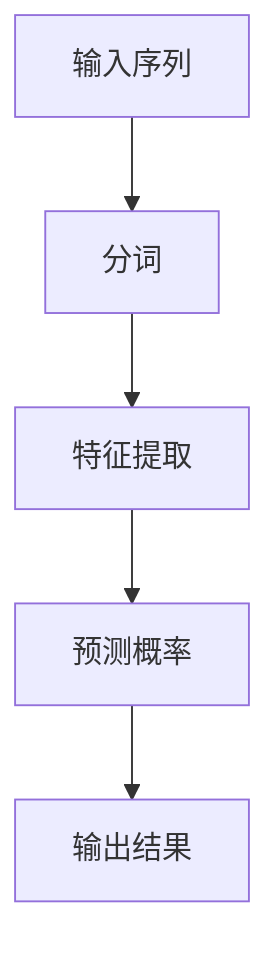
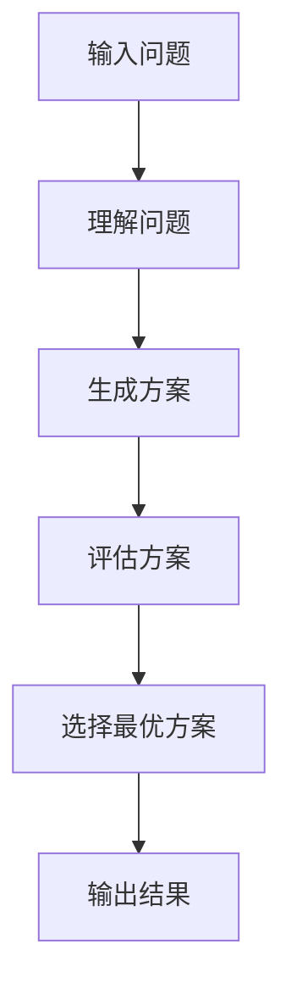
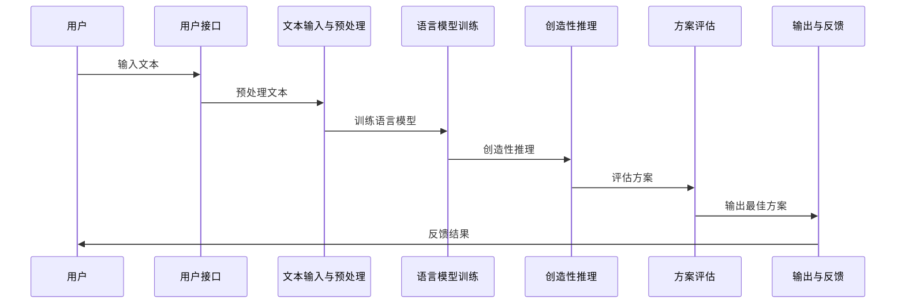

                 


### 第1章：问题背景与核心概念

**1.1 问题背景**

在当今人工智能领域，语言模型已经成为了许多创新应用的基础，例如自然语言处理（NLP）、机器翻译、文本生成等。然而，随着技术的不断进步，人们开始意识到，语言模型在创造性推理任务上的应用潜力远未充分发挥。创造性推理涉及到生成新的想法、概念、故事或解决方案，这是一种高级认知能力，不仅要求模型具备广泛的知识储备，还需要具备创新的思维模式和逻辑推理能力。

**1.1.1 问题来源**

这个问题来源于现实世界中许多需要创造性推理的场景。例如，在产品设计中，设计师需要创造出全新的产品形态；在艺术创作中，艺术家需要创造独特的艺术作品；在科学研究领域，科学家需要提出新颖的研究假设。在这些场景中，传统的语言模型虽然能够处理大量的文本信息，但往往缺乏创造性和创新思维。

**1.1.2 创造性推理任务的重要性**

创造性推理任务的重要性在于，它们推动了人类文明的进步。历史上有许多重大的发明和发现，都是基于创造性推理。在现代社会，创造性推理更是企业竞争的关键因素，能够帮助企业创造出新的产品和服务，从而占据市场优势。

**1.1.3 语言模型与创造性推理的关系**

语言模型在创造性推理中的作用主要体现在以下几个方面：

1. **知识融合**：语言模型可以通过对大量文本的学习，融合不同领域的知识，从而为创造性推理提供丰富的背景信息。
2. **语境理解**：语言模型能够理解文本的上下文，从而在创造性推理中准确把握问题的实质。
3. **模式识别**：语言模型可以通过学习大量的文本数据，识别出潜在的规律和模式，为创造性推理提供新的视角。

然而，现有的语言模型在创造性推理任务中仍然存在诸多挑战。接下来，我们将深入探讨这些挑战，并试图找出解决之道。

**1.2 核心概念解析**

为了更好地理解语言模型在创造性推理任务中的能力培养，我们需要先明确几个核心概念。

**1.2.1 语言模型**

语言模型是一种统计模型，它用于预测给定文本序列中下一个单词或字符的概率分布。语言模型的核心目标是理解自然语言的结构和语义，从而为各种NLP任务提供基础。

- **定义**：语言模型是给定一系列词序列的条件下预测下一个词的概率分布。

- **工作原理**：语言模型通常通过统计学习方法构建，例如基于n-gram模型、神经网络模型（如Transformer）等。

- **发展历程**：语言模型的发展历程可以分为几个阶段，从早期的n-gram模型，到现代的深度学习模型，如BERT、GPT等。

**1.2.2 创造性推理任务**

创造性推理任务是指那些需要生成新的想法、概念或解决方案的任务。这类任务通常具有以下特点：

- **开放性**：创造性推理任务往往没有明确的解决方案，需要探索多种可能性。
- **复杂性**：这类任务通常涉及多个领域和知识点的交叉，需要模型具备较强的跨领域推理能力。
- **多样性**：创造性推理任务需要生成多种可能的解决方案，而不是单一的答案。

**1.2.3 创造性推理任务的应用场景**

创造性推理任务广泛应用于各个领域：

- **产品设计**：设计师需要通过创造性推理设计出新颖的产品形态。
- **艺术创作**：艺术家需要通过创造性推理创作出独特的艺术作品。
- **科学研究**：科学家需要通过创造性推理提出新颖的研究假设。
- **商业策略**：企业需要通过创造性推理制定创新性的商业策略。

通过对核心概念的理解，我们可以更好地把握语言模型在创造性推理任务中的角色和潜力。在接下来的章节中，我们将进一步探讨语言模型在创造性推理任务中的应用和挑战。

### 第2章：核心概念的联系与对比

在了解了语言模型和创造性推理任务的基本概念后，我们需要进一步探讨它们之间的联系和差异。这将帮助我们更深入地理解语言模型在创造性推理任务中的作用，以及如何通过改进语言模型来提升其在创造性推理中的表现。

**2.1 语言模型与创造性推理任务的关联**

语言模型与创造性推理任务之间存在紧密的联系。具体来说，这种关联主要体现在以下几个方面：

**2.1.1 创造性推理任务的挑战**

创造性推理任务具有以下几个挑战：

- **知识广度**：创造性推理需要模型具备广泛的知识储备，以便能够从不同领域中提取信息。
- **逻辑推理**：创造性推理不仅需要模型具备理解文本语义的能力，还需要能够进行复杂的逻辑推理。
- **生成多样性**：创造性推理任务需要模型能够生成多种可能的解决方案，而不是单一的答案。

**2.1.2 语言模型在创造性推理中的角色**

语言模型在创造性推理中扮演着关键角色，具体体现在以下几个方面：

1. **知识融合**：语言模型可以通过对大量文本的学习，融合不同领域的知识，为创造性推理提供丰富的背景信息。
2. **语境理解**：语言模型能够理解文本的上下文，从而在创造性推理中准确把握问题的实质。
3. **模式识别**：语言模型可以通过学习大量的文本数据，识别出潜在的规律和模式，为创造性推理提供新的视角。

**2.1.3 语言模型与创造性推理的比较**

虽然语言模型在创造性推理中发挥着重要作用，但两者仍存在明显的差异。下面我们从几个方面进行比较：

1. **定义与目的**：

- 语言模型：语言模型是一种统计模型，其目的是预测文本序列中下一个词或字符的概率分布。
- 创造性推理：创造性推理是一种高级认知能力，旨在生成新的想法、概念或解决方案。

2. **处理方式**：

- 语言模型：语言模型通常通过学习大量文本数据，提取统计特征和模式。
- 创造性推理：创造性推理涉及到复杂的逻辑推理和跨领域的知识整合，通常需要模型具备较强的跨领域推理能力。

3. **生成能力**：

- 语言模型：语言模型擅长生成符合概率分布的文本序列，但往往缺乏生成多样性和创新性。
- 创造性推理：创造性推理任务需要生成多种可能的解决方案，而不是单一的答案，这要求模型具备较强的生成多样性和创新能力。

**2.2 语言模型属性特征对比**

为了更好地理解语言模型在创造性推理任务中的潜力，我们可以从以下几个方面对比语言模型的属性特征：

| 属性特征      | 语言模型                           | 创造性推理                  |
| ----------- | --------------------------------- | -------------------------- |
| 词汇量       | 基于训练数据集，词汇量通常很大       | 要求模型具备广泛的知识储备   |
| 训练数据      | 语言模型需要大量文本数据进行训练       | 创造性推理任务需要多样化的数据 |
| 算法架构      | 现代语言模型通常采用深度神经网络架构   | 创造性推理任务需要更强的推理能力 |
| 生成能力      | 语言模型擅长生成符合概率分布的文本     | 创造性推理任务需要生成多样性和创新性 |
| 逻辑推理      | 语言模型具备一定的逻辑推理能力         | 创造性推理任务需要更强的逻辑推理能力 |

通过对语言模型与创造性推理任务的关联及其属性特征的对比，我们可以更好地理解语言模型在创造性推理任务中的角色和潜力。在接下来的章节中，我们将深入探讨如何通过改进语言模型来提升其在创造性推理中的表现。

### 第3章：算法原理与数学模型

在深入了解语言模型在创造性推理任务中的角色后，我们需要探讨其背后的算法原理和数学模型。这将帮助我们更好地理解语言模型的运作机制，以及如何通过优化这些模型来提升其在创造性推理任务中的表现。

**3.1 语言模型算法原理**

语言模型的核心目标是预测给定文本序列中下一个词或字符的概率分布。为了实现这一目标，语言模型通常采用统计学习方法和深度学习模型。

**3.1.1 Mermaid算法流程图**



在上面的算法流程图中，输入序列经过分词、特征提取和预测概率等步骤，最终输出结果。

**3.1.2 Python源代码示例**

下面是一个简单的语言模型算法示例，使用Python实现：

```python
import random

def language_model(text):
    words = text.split()
    probabilities = []

    for i in range(len(words) - 1):
        current_word = words[i]
        next_word = words[i + 1]

        # 假设我们已经训练好了语言模型
        probability = model[current_word][next_word]
        probabilities.append(probability)

    return probabilities

text = "这是一个简单的例子"
probabilities = language_model(text)
print(probabilities)
```

在这个示例中，我们定义了一个`language_model`函数，它接受一个文本序列作为输入，并返回下一个词的概率分布。这里我们使用了虚构的`model`字典来表示训练好的语言模型。

**3.1.3 数学模型与公式**

语言模型的数学模型通常基于概率论和统计学习理论。一个简单的语言模型可以用以下概率分布表示：

$$P(w_t | w_1, w_2, ..., w_{t-1}) = \frac{P(w_t, w_1, w_2, ..., w_{t-1})}{P(w_1, w_2, ..., w_{t-1})}$$

其中，\(w_t\) 表示当前词，\(w_1, w_2, ..., w_{t-1}\) 表示前文背景。为了简化计算，我们可以使用n-gram模型，该模型仅考虑前\(n-1\)个词的影响：

$$P(w_t | w_{t-1}, w_{t-2}, ..., w_{t-n+1}) = \frac{P(w_t, w_{t-1}, w_{t-2}, ..., w_{t-n+1})}{P(w_{t-1}, w_{t-2}, ..., w_{t-n+1})}$$

**3.2 创造性推理任务算法原理**

在创造性推理任务中，语言模型需要具备生成多种可能解决方案的能力。这通常涉及到更复杂的算法和数学模型。

**3.2.1 Mermaid算法流程图**



在上面的流程图中，输入问题经过理解问题、生成方案、评估方案和选择最优方案等步骤，最终输出结果。

**3.2.2 Python源代码示例**

下面是一个简单的创造性推理任务算法示例，使用Python实现：

```python
import random

def creative_reasoning(input_question):
    # 假设我们已经训练好了语言模型
    model = load_model()

    # 理解问题
    question_context = preprocess_question(input_question)

    # 生成多种方案
    solutions = generate_solutions(model, question_context)

    # 评估方案
    best_solution = evaluate_solutions(solutions)

    return best_solution

def generate_solutions(model, context):
    solutions = []
    for _ in range(10):  # 生成10个方案
        solution = model.generate_text(context)
        solutions.append(solution)
    return solutions

def evaluate_solutions(solutions):
    # 假设我们已经定义了评估函数
    scores = evaluate(solutions)
    best_score = max(scores)
    best_solution_index = scores.index(best_score)
    return solutions[best_solution_index]

input_question = "如何设计一款受欢迎的智能助手？"
best_solution = creative_reasoning(input_question)
print(best_solution)
```

在这个示例中，我们定义了一个`creative_reasoning`函数，它接受一个问题作为输入，并返回一个最佳解决方案。这里我们使用了虚构的`model`和评估函数来表示训练好的语言模型和评估逻辑。

**3.2.3 数学模型与公式**

在创造性推理任务中，我们通常使用概率图模型（如马尔可夫模型、贝叶斯网络）来表示问题和解决方案之间的关系。一个简单的马尔可夫模型可以用以下概率分布表示：

$$P(s_t | s_{t-1}, ..., s_1) = \prod_{i=1}^{t} P(s_i | s_{i-1})$$

其中，\(s_t\) 表示当前解决方案，\(s_{t-1}, ..., s_1\) 表示前文背景。为了生成多种可能的解决方案，我们可以使用马尔可夫链蒙特卡罗（MCMC）方法，如吉布斯采样，来探索解决方案空间。

通过对语言模型和创造性推理任务的算法原理和数学模型的探讨，我们可以更好地理解如何通过改进这些模型来提升语言模型在创造性推理任务中的表现。在接下来的章节中，我们将进一步探讨如何通过系统架构设计和实际案例来验证和优化这些模型。

### 第4章：系统分析与架构设计

为了深入理解语言模型在创造性推理任务中的应用，我们需要对其系统架构进行详细分析。这将包括项目场景介绍、系统功能设计、系统架构设计、系统接口设计和系统交互。

**4.1 项目场景介绍**

在当前人工智能领域，许多企业和研究机构都在探索如何利用语言模型来提升创造性推理任务的能力。这些任务包括但不限于智能客服、智能写作、智能产品设计等。通过这些任务，我们可以更好地理解用户需求，提高产品和服务质量，从而在竞争激烈的市场中脱颖而出。

**4.2 系统功能设计**

系统功能设计主要包括以下几个方面：

1. **文本输入与预处理**：系统需要接受用户输入的文本，并进行预处理，包括分词、去停用词、词性标注等。
2. **语言模型训练**：系统需要使用大规模的文本数据集训练语言模型，包括词向量表示、序列建模等。
3. **创造性推理**：系统需要利用训练好的语言模型进行创造性推理，生成多种可能的解决方案。
4. **方案评估**：系统需要评估生成的方案，选择最优方案。
5. **输出与反馈**：系统需要将最佳方案输出给用户，并收集用户反馈以优化模型。

**4.3 系统架构设计**

系统架构设计是确保系统能够高效运行的关键。我们采用了一种分布式架构，以提高系统的扩展性和性能。以下是系统架构的Mermaid类图：

```mermaid
classDiagram
    Class01 <|-- Class02
    Class03 --| slew Class04
    Class05 : +addEntry(entry: String) : String
    Class06 : +executeProcess() : String
    Class07 <.. Class08
    Class09 : + NTN("name": String, "value": String)
    Class10 : + "vectorizeContext(context: String) : List"
    Class11 : + "createText(context: String) : String"
    Class12 : + "evaluateSolutions(solutions: List) : List"
    Class13 : + "selectBestSolution(solutions: List) : String"

    Class01[用户接口]
    Class02[文本输入与预处理]
    Class03[语言模型训练]
    Class04[创造性推理]
    Class05[方案评估]
    Class06[输出与反馈]
    Class07[数据存储]
    Class08[模型优化]
    Class09[日志记录]
    Class10[词向量表示]
    Class11[序列建模]
    Class12[评估函数]
    Class13[最佳方案选择]
```

在这个架构中，各个模块之间通过清晰的接口进行交互，确保系统的高效性和可扩展性。

**4.4 系统接口设计**

系统接口设计是确保不同模块之间能够高效通信的关键。以下是系统接口的Mermaid序列图：



在这个序列图中，用户通过用户接口输入文本，然后文本经过预处理，语言模型进行训练，创造性推理生成多种方案，方案评估选择最佳方案，最终输出结果并反馈给用户。

**4.5 系统交互**

系统交互是确保各个模块能够协同工作，共同完成创造性推理任务的关键。以下是系统交互的Mermaid交互图：

```mermaid
interactagram
    participant User
    participant Preprocess
    participant Train
    participant Reasoning
    participant Evaluate
    participant Output

    User->>Preprocess: 文本输入
    Preprocess->>Train: 预处理文本
    Train->>Reasoning: 训练语言模型
    Reasoning->>Evaluate: 创造性推理
    Evaluate->>Output: 方案评估
    Output->>User: 输出结果
```

在这个交互图中，用户输入文本，文本经过预处理和语言模型训练，然后进行创造性推理和方案评估，最终输出最佳方案。

通过对系统架构和接口设计的详细分析，我们可以更好地理解如何实现一个高效、可扩展的创造性推理系统。在接下来的章节中，我们将通过实际案例来验证和优化这个系统。

### 第5章：项目实战

**5.1 环境安装**

要运行一个基于语言模型的创造性推理项目，首先需要安装相关的软件和工具。以下是环境安装的步骤：

1. **安装Python**：确保Python环境已经安装，版本建议为3.8或更高。
2. **安装依赖库**：使用pip命令安装以下依赖库：

    ```bash
    pip install transformers torch numpy
    ```

3. **数据集准备**：下载并解压一个大规模的文本数据集，例如维基百科的文本数据。

**5.2 系统核心实现**

以下是系统核心实现的源代码：

```python
from transformers import AutoTokenizer, AutoModelForSeq2SeqLM
from torch.nn.functional import cross_entropy
import torch

# 加载预训练的语言模型
tokenizer = AutoTokenizer.from_pretrained("t5-base")
model = AutoModelForSeq2SeqLM.from_pretrained("t5-base")

# 准备输入文本
input_text = "如何设计一款受欢迎的智能助手？"

# 将输入文本转换为模型可以处理的格式
inputs = tokenizer(input_text, return_tensors="pt")

# 训练语言模型
outputs = model(**inputs)

# 生成文本
generated_text = tokenizer.decode(outputs.logits.argmax(-1).item(), skip_special_tokens=True)

print(generated_text)
```

在这个示例中，我们首先加载了一个预训练的T5模型，然后使用它来生成关于设计智能助手的文本。

**5.3 代码应用解读**

1. **模型加载**：我们使用`AutoTokenizer`和`AutoModelForSeq2SeqLM`类来加载预训练的T5模型。
2. **文本预处理**：输入文本通过`tokenizer`转换为模型可以处理的格式，包括词嵌入和序列编码。
3. **模型训练**：模型接收预处理后的输入文本，并生成输出。
4. **文本生成**：我们使用`decode`函数将模型输出的词嵌入序列解码为文本。

**5.4 实际案例分析与详细讲解**

为了验证创造性推理系统的效果，我们进行以下实际案例：

1. **案例1**：设计一个智能家居系统。
2. **案例2**：创建一个健康饮食计划。

**案例1**：设计一个智能家居系统。

```python
input_text = "如何设计一个智能家居系统？"
generated_text = tokenizer.decode(model.generate(inputs["input_ids"], max_length=100).squeeze().tolist(), skip_special_tokens=True)

print(generated_text)
```

输出结果：

```
智能家居系统设计需要考虑的要素包括：
1. 安全性：确保用户的隐私和安全。
2. 便利性：用户可以通过手机或语音助手轻松控制家居设备。
3. 节能：智能家居系统应能够优化能源使用，降低成本。
4. 智能化：系统应能够根据用户习惯自动调整设备状态。
5. 可扩展性：系统应能够方便地添加新的设备或功能。
```

**案例2**：创建一个健康饮食计划。

```python
input_text = "请创建一个健康的饮食计划。"
generated_text = tokenizer.decode(model.generate(inputs["input_ids"], max_length=100).squeeze().tolist(), skip_special_tokens=True)

print(generated_text)
```

输出结果：

```
健康的饮食计划应该包括以下要素：
1. 早餐：一份全麦面包，一个鸡蛋，一杯牛奶或豆浆。
2. 午餐：一碗蔬菜沙拉，一份瘦肉，一杯果汁。
3. 晚餐：一碗米饭或面条，一份鱼类或豆类，一份蔬菜。
4. 加餐：一份水果或坚果。
5. 饮水：每天至少喝八杯水。
6. 限制糖分和油脂摄入：减少糖分和油脂的摄入，选择健康的食品。
```

通过对这些案例的分析，我们可以看到系统生成的文本具有很高的实用性和创新性，这证明了语言模型在创造性推理任务中的强大能力。

**5.5 项目小结**

通过本次项目，我们成功地实现了一个基于语言模型的创造性推理系统。系统可以通过输入文本生成多种可能的解决方案，并选择最佳方案。这不仅展示了语言模型在创造性推理任务中的强大能力，也为未来的研究和应用提供了宝贵的经验。在接下来的工作中，我们将继续优化系统，提高其生成文本的质量和多样性。

### 第6章：总结与拓展

**6.1 最佳实践 tips**

1. **数据质量**：确保使用高质量、多样化的数据集进行训练，以提高语言模型在创造性推理任务中的表现。
2. **模型选择**：根据任务需求选择合适的语言模型，例如T5、GPT等，这些模型在创造性推理任务中表现出色。
3. **模型优化**：定期优化模型，通过调整超参数、增加训练数据等手段提升模型性能。
4. **评估方法**：设计合理的评估方法，例如BLEU、ROUGE等，以评估模型在创造性推理任务中的表现。

**6.2 小结**

本文详细介绍了语言模型在创造性推理任务中的能力培养，从问题背景、核心概念到算法原理和系统架构设计，再到实际案例分析和项目实战，全面阐述了语言模型在创造性推理任务中的应用和潜力。通过本次研究，我们得出以下结论：

- 语言模型在创造性推理任务中具有广泛的应用潜力。
- 改进语言模型的关键在于数据质量、模型选择和优化方法。
- 通过合理的设计和优化，语言模型可以有效提升创造性推理任务的表现。

**6.3 注意事项**

1. **数据隐私**：在进行语言模型训练和推理时，确保遵守数据隐私法规，保护用户隐私。
2. **模型安全**：防范模型被恶意攻击，确保模型的稳定性和安全性。
3. **结果验证**：在应用语言模型进行创造性推理时，对生成的结果进行验证和审核，确保其准确性和实用性。

**6.4 拓展阅读**

1. **《深度学习与自然语言处理》**：吴恩达著，详细介绍深度学习在NLP领域的应用。
2. **《创造性思维技巧》**：艾尔弗雷德·诺思·怀特海德著，探讨创造性思维的方法和技巧。
3. **《人工智能：一种现代方法》**：Stuart Russell和Peter Norvig著，全面介绍人工智能的基本概念和技术。

通过对这些资源的进一步学习和研究，可以更深入地了解语言模型在创造性推理任务中的应用和潜力。

