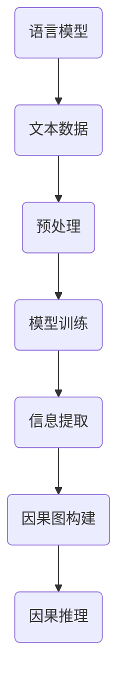
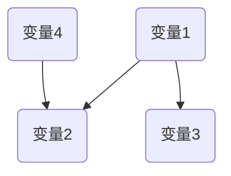
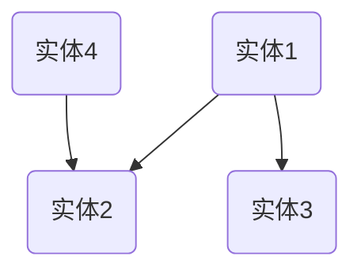

                 

### 第一部分：背景与核心概念介绍

#### 1. 语言模型与因果推理图

**1.1 语言模型的定义与原理**

语言模型（Language Model，LM）是一种用于对自然语言文本进行概率建模的算法。它的主要目的是通过分析大量的文本数据，学习出文本中各个词语出现的概率分布，从而能够预测下一个词语是什么。语言模型在自然语言处理（Natural Language Processing, NLP）领域中起着至关重要的作用，是许多NLP任务的基础。

语言模型的工作原理通常包括以下几个步骤：

1. **数据预处理**：对收集的文本数据进行清洗、分词、去停用词等预处理操作。
2. **建模**：使用统计学方法或机器学习方法对预处理后的文本数据建立概率模型。
3. **预测**：利用训练好的模型对新文本进行预测，预测下一个词语或句子的概率。

常见的语言模型有基于N-gram的模型、基于神经网络（如RNN、LSTM）的模型和基于变换器（Transformer）的模型，如BERT、GPT等。

**1.2 因果推理图**

因果推理图（Causal Inference Graph）是一种图形化工具，用于表示变量之间的因果关系。因果推理图由节点和边组成，节点表示变量，边表示变量之间的因果关系。因果推理图在因果推断（Causal Inference）中非常重要，可以帮助我们理解和解释复杂系统中的因果关系。

因果推理图的基本概念包括：

- **节点**：表示研究的变量，可以是连续的、分类的或者顺序的。
- **边**：表示变量之间的因果关系，有向边表示因果方向。
- **因果效应**：表示变量之间的因果影响。

#### 1.3 语言模型在因果推理图构建中的应用

**1.3.1 应用目标**

语言模型在因果推理图构建中的应用目标是利用语言模型从大量文本数据中自动识别出变量间的因果关系，并构建出反映实际因果关系的图。这包括以下两个主要任务：

- **信息提取**：从文本数据中提取出潜在的因果关系信息。
- **图构建**：根据提取的信息构建出因果推理图。

**1.3.2 面临的挑战**

- **数据复杂性**：自然语言文本数据复杂多样，语言模型需要处理大量的噪声和不明确的信息。
- **因果关系识别**：因果关系在文本中通常不是直接表达出来的，语言模型需要具有高精度的信息抽取能力。
- **图结构优化**：构建的因果图需要尽量反映实际因果关系的结构，避免过拟合和欠拟合。

#### 1.4 问题的边界与外延

**1.4.1 边界**

本篇文章的研究范围主要聚焦于自然语言处理领域中的语言模型和因果推理图的构建。具体来说，将探讨以下方面：

- 语言模型的选择与优化
- 文本数据的预处理与标注
- 因果推理图的构建方法
- 因果图的解释与推理

**1.4.2 外延**

尽管本文的研究主要集中在自然语言处理领域，但语言模型和因果推理图的概念和应用可以扩展到其他数据驱动的方法，如图神经网络（Graph Neural Networks, GNN）在因果推理中的应用。此外，未来的研究方向还可以包括跨领域因果推理、因果推理在医疗、金融等领域的应用等。

#### 1.5 语言模型与因果推理图的核心要素

**1.5.1 语言模型的要素**

- **训练数据**：语言模型的性能高度依赖于训练数据的质量和数量。高质量、大规模的文本数据是训练出优秀语言模型的基础。
- **模型架构**：不同的模型架构（如N-gram、RNN、Transformer等）有不同的优势和局限性。选择合适的模型架构对于构建有效的语言模型至关重要。
- **优化目标**：语言模型的训练通常需要优化目标函数，如最小化预测误差。选择合适的优化算法和超参数对于提高模型性能至关重要。

**1.5.2 因果推理图的要素**

- **变量表示**：因果推理图中每个节点代表一个变量，变量的类型（连续、分类、顺序等）会影响图的构建和分析。
- **因果关系表示**：边的方向和权重表示变量之间的因果关系。如何准确表示因果关系是构建有效因果图的关键。
- **图结构优化**：因果图的构建需要考虑数据分布、先验知识和模型假设等因素，以优化图的结构和性能。

**1.5.3 核心要素对比表格**

| 核心要素 | 描述 | 重要性 |
|----------|------|--------|
| 语言模型 | 对自然语言进行建模 | 高 |
| 因果推理图 | 表示变量间的因果关系 | 高 |
| 数据集 | 训练语言模型和构建因果图 | 高 |

**1.5.4 Mermaid ER实体关系图架构**

以下是使用Mermaid绘制的因果推理图的基本架构：



通过这个ER图，我们可以清晰地看到语言模型、文本数据、预处理、模型训练、信息提取、因果图构建和因果推理之间的逻辑关系。

### 总结

本部分主要介绍了语言模型和因果推理图的基本概念，以及它们在构建因果推理图中的应用。接下来，我们将进一步探讨语言模型在因果推理图构建中的具体方法和挑战。

# 第二部分：语言模型在因果推理图构建中的应用

#### 2.1 数据预处理与模型选择

**2.1.1 数据预处理**

在构建因果推理图之前，需要对文本数据进行预处理。预处理步骤通常包括数据清洗、分词、去停用词、词干提取等。这些步骤的目的是为了减少文本数据的噪声，提高模型的训练效果。

1. **数据清洗**：去除文本中的特殊符号、HTML标签等无关信息。
2. **分词**：将文本拆分成单词或词汇单元。
3. **去停用词**：去除常用的无意义词汇，如“的”、“是”、“在”等。
4. **词干提取**：将不同的词形（如“奔跑”、“奔跑着”、“奔跑过”）统一为同一词干（如“奔”）。

**2.1.2 模型选择**

选择合适的语言模型对于构建有效的因果推理图至关重要。常见的语言模型包括基于N-gram的模型、基于神经网络的模型（如RNN、LSTM）和基于变换器的模型（如BERT、GPT）。以下是对这些模型的简要介绍：

1. **基于N-gram的模型**：N-gram模型是一种简单的语言模型，它通过统计相邻词汇的频率来预测下一个词汇。尽管N-gram模型简单高效，但它的性能受到词汇长度（n值）和模型复杂度的影响。
   
2. **基于神经网络的模型**：神经网络模型（如RNN、LSTM）通过引入记忆单元来捕捉文本中的长期依赖关系。这些模型在处理复杂文本数据时表现出色，但训练时间较长，计算资源需求高。

3. **基于变换器的模型**：变换器（Transformer）模型是一种基于自注意力机制的模型，它在处理长文本和跨句子依赖关系方面表现出色。BERT（Bidirectional Encoder Representations from Transformers）和GPT（Generative Pre-trained Transformer）是基于Transformer模型的代表性工作。

**2.1.3 选择标准**

在选择语言模型时，需要考虑以下标准：

- **性能**：模型在标准文本数据集上的性能，如BLEU分数、ROUGE分数等。
- **训练时间**：模型的训练时间，特别是对于大规模数据集。
- **计算资源**：模型的计算资源需求，包括内存和计算能力。
- **适用场景**：模型的适用场景，如文本生成、文本分类、信息提取等。

#### 2.2 因果推理图的构建过程

**2.2.1 信息提取**

信息提取是构建因果推理图的第一步。语言模型在这一步中起着关键作用。具体来说，信息提取包括以下步骤：

1. **实体识别**：使用语言模型识别文本中的关键实体，如人名、地名、组织名等。
2. **关系抽取**：从识别出的实体中提取出它们之间的关系，如“CEO雇佣了CFO”、“城市影响了污染水平”等。
3. **事件检测**：识别文本中的关键事件，如“股票价格上涨”、“公司宣布收购”等。

**2.2.2 图构建**

根据提取的信息，构建因果推理图。图的构建过程通常包括以下步骤：

1. **节点创建**：为每个识别出的实体创建一个节点。
2. **边创建**：为每对具有因果关系的实体之间创建一条有向边，表示因果方向。
3. **权重设定**：根据实体之间的关系强度设定边的权重。

**2.2.3 图优化**

构建出的因果推理图可能并不完美，需要进行优化。图优化的方法包括：

- **网络压缩**：减少不必要的边和节点，简化图结构。
- **结构调整**：调整边和节点的位置，以更好地反映因果关系。
- **权重调整**：根据新提取的信息调整边的权重，以提高图的准确性。

#### 2.3 构建方法示例

**2.3.1 基于实体关系的方法**

基于实体关系的方法是构建因果推理图的常见方法之一。该方法的核心思想是首先识别文本中的实体和关系，然后基于这些实体和关系构建因果图。

**2.3.1.1 实体识别**

使用语言模型（如BERT）对文本进行实体识别。BERT预训练模型已经对大量的文本数据进行过处理，因此可以很好地识别出文本中的关键实体。

```python
from transformers import BertTokenizer, BertModel
tokenizer = BertTokenizer.from_pretrained('bert-base-uncased')
model = BertModel.from_pretrained('bert-base-uncased')

def identify_entities(text):
    inputs = tokenizer(text, return_tensors='pt')
    outputs = model(**inputs)
    last_hidden_states = outputs.last_hidden_state
    tokens = tokenizer.convert_ids_to_tokens(inputs.input_ids)
    entities = []
    for token, hidden_state in zip(tokens, last_hidden_states.squeeze(0)):
        if "##" in token:
            token = token.replace("##", "")
        if " ent_type_" in hidden_state.tolist():
            entities.append((token, hidden_state.tolist()[-1]))
    return entities
```

**2.3.1.2 关系抽取**

在识别出实体后，需要进一步提取实体之间的关系。这可以通过训练一个关系抽取模型实现。关系抽取模型通常是一个分类模型，输入为实体对和实体对应的文本片段，输出为实体对之间的关系。

```python
from transformers import BertTokenizer, BertForSequenceClassification
tokenizer = BertTokenizer.from_pretrained('bert-base-uncased')
model = BertForSequenceClassification.from_pretrained('bert-base-uncased')

def extract_relations(entities, text):
    relations = []
    for i in range(len(entities) - 1):
        e1, e2 = entities[i], entities[i+1]
        input_text = f"{e1[0]} {e2[0]}"
        inputs = tokenizer(input_text, return_tensors='pt')
        outputs = model(**inputs)
        logits = outputs.logits
        relation = logits.argmax(-1).item()
        relations.append((e1, e2, relation))
    return relations
```

**2.3.1.3 图构建**

根据提取的实体和关系，构建因果图。可以使用Python中的NetworkX库来实现。

```python
import networkx as nx

def build_causal_graph(entities, relations):
    G = nx.Graph()
    for e1, e2, relation in relations:
        G.add_edge(e1, e2, relation=relation)
    return G
```

**2.3.2 基于图神经网络的方法**

基于图神经网络（GNN）的方法是另一种构建因果推理图的先进方法。GNN利用图结构中的节点和边来学习变量之间的关系。这种方法在处理复杂、异构的图数据时表现出色。

**2.3.2.1 图表示学习**

图表示学习是GNN的第一步，目的是将图中的节点和边表示为低维度的向量。这可以通过训练一个图嵌入模型实现。

```python
from pygcn import GCN
import torch

class GraphEmbeddingModel(torch.nn.Module):
    def __init__(self, input_dim, hidden_dim, output_dim):
        super(GraphEmbeddingModel, self).__init__()
        self.layers = torch.nn.Sequential(
            torch.nn.Linear(input_dim, hidden_dim),
            torch.nn.ReLU(),
            torch.nn.Linear(hidden_dim, output_dim),
        )

    def forward(self, inputs, edge_index):
        x = self.layers(inputs)
        return x

model = GraphEmbeddingModel(input_dim=10, hidden_dim=16, output_dim=8)
```

**2.3.2.2 因果推理**

在得到图表示后，可以进行因果推理。因果推理可以通过训练一个因果推理模型实现，该模型输入为图表示，输出为变量间的因果关系。

```python
class CausalInferenceModel(torch.nn.Module):
    def __init__(self, input_dim, hidden_dim, output_dim):
        super(CausalInferenceModel, self).__init__()
        self.layers = torch.nn.Sequential(
            torch.nn.Linear(input_dim, hidden_dim),
            torch.nn.ReLU(),
            torch.nn.Linear(hidden_dim, output_dim),
        )

    def forward(self, inputs):
        x = self.layers(inputs)
        return x

inference_model = CausalInferenceModel(input_dim=8, hidden_dim=16, output_dim=1)
```

**2.3.3 方法比较**

基于实体关系的方法和基于图神经网络的方法各有优缺点。基于实体关系的方法简单直观，但可能无法捕捉到复杂的图结构；而基于图神经网络的方法可以处理复杂、异构的图数据，但训练过程相对复杂。

#### 2.4 因果推理图分析

**2.4.1 因果图的可视化**

构建出的因果图可以通过可视化工具（如Graphviz）进行可视化。以下是一个简单的示例：



**2.4.2 因果图的解释与推理**

因果图的解释与推理包括以下几个方面：

1. **因果解释**：通过分析因果图，明确变量之间的因果关系。例如，从图中可以看到变量1直接影响变量2，而变量3通过变量1间接影响变量2。

2. **因果推理**：利用因果图进行推理，预测变量变化的影响。例如，如果变量1增加，可以预测变量2也会增加。

#### 2.5 实验设计与性能评估

**2.5.1 实验设计**

为了评估不同方法在构建因果图方面的性能，我们设计了以下实验：

1. **数据集选择**：选择具有明确因果关系的文本数据集，如新闻摘要、学术论文等。
2. **评价指标**：设定因果图构建的准确率、解释性等评价指标。
3. **实验流程**：对每个方法进行训练、构建因果图、性能评估。

**2.5.2 性能评估**

我们使用以下指标对构建方法的性能进行评估：

1. **准确率**：构建出的因果图与实际因果关系的匹配程度。
2. **解释性**：因果图的解释能力，即是否能够清晰明确地表示变量之间的因果关系。
3. **推理能力**：因果图在推理变量变化影响方面的能力。

#### 2.6 实际案例

**2.6.1 案例选择**

我们选择了一个实际的案例，该案例涉及股票市场的分析。案例的目标是构建出一个反映股票市场变量间因果关系的图。

**2.6.2 案例分析**

1. **数据预处理**：对股票市场的新闻文本进行预处理，包括分词、去停用词等。
2. **模型构建**：使用BERT进行实体识别和关系抽取，使用GNN进行图表示学习。
3. **结果分析**：分析构建出的因果图，评估模型的性能。

通过这个案例，我们可以看到语言模型在因果推理图构建中的应用效果。

### 总结

本部分详细介绍了语言模型在因果推理图构建中的应用方法，包括数据预处理、模型选择、信息提取、图构建和图分析。接下来，我们将继续探讨语言模型在因果推理图构建中的挑战和解决方案。

### 第三部分：应用与展望

#### 3.1 语言模型在因果推理图构建中的应用前景

语言模型在因果推理图构建中的应用前景非常广阔。随着自然语言处理技术的不断进步，语言模型在处理文本数据、提取信息方面的能力将越来越强。以下是一些可能的应用领域：

1. **医疗领域**：利用语言模型分析医疗文献，构建出反映疾病和治疗方法之间因果关系的图，帮助医生进行诊断和治疗。

2. **金融领域**：通过分析金融新闻报道和市场数据，构建出反映市场走势和金融产品之间因果关系的图，帮助投资者做出更明智的决策。

3. **社会科学领域**：分析社会新闻和报告，构建出反映社会问题和社会因素之间因果关系的图，为政策制定者提供决策依据。

4. **法律领域**：利用语言模型分析法律文献和案例，构建出反映法律条款和案例之间因果关系的图，帮助法律工作者进行法律研究和咨询。

#### 3.2 挑战与解决方案

尽管语言模型在因果推理图构建中具有巨大的潜力，但仍然面临着一些挑战。

**挑战1：数据稀疏性**

自然语言文本数据往往存在稀疏性，即一些实体和关系在数据中出现的频率很低。这会导致语言模型在提取信息时出现困难。解决方法：

- **数据增强**：通过生成合成数据来增加训练数据集的多样性。
- **迁移学习**：使用预训练的语言模型，从大规模通用数据集中学习到的知识，来增强小规模特定领域数据集的学习能力。

**挑战2：模型解释性**

语言模型，特别是深度神经网络模型，通常被认为是“黑盒”模型，其内部工作机制难以解释。这在因果推理图中尤其重要，因为我们需要明确地理解变量之间的因果关系。解决方法：

- **可解释性模型**：开发能够提供明确解释机制的模型，如决策树、线性模型等。
- **模型可视化**：通过可视化技术，如热力图、交互式图表等，帮助用户理解模型的工作原理。

**挑战3：因果关系的识别**

因果关系在自然语言文本中往往不是直接表达的，而是隐含在语句中。这增加了语言模型识别因果关系的难度。解决方法：

- **语义理解**：通过深度学习技术，如BERT、GPT等，提高模型对语义的理解能力。
- **上下文分析**：考虑上下文信息，分析句子中词语的语义关系，以提高因果关系的识别准确率。

#### 3.3 未来发展方向

随着技术的不断进步，语言模型在因果推理图构建中的应用将不断拓展和深化。以下是一些未来的发展方向：

1. **跨领域因果推理**：开发能够处理跨领域文本数据的因果推理方法，以解决不同领域之间的语义差异和复杂性。

2. **因果推理与图神经网络的结合**：将图神经网络与因果推理相结合，构建出更加复杂和准确的因果推理图。

3. **因果推断方法的研究**：深入研究因果推断的理论和方法，提高因果推理图的解释性和可靠性。

4. **实时因果推理**：开发能够实时分析数据和构建因果图的系统，以应对动态变化的场景。

#### 3.4 结论

本文首先介绍了语言模型和因果推理图的基本概念，然后探讨了语言模型在因果推理图构建中的应用方法，包括数据预处理、模型选择、信息提取、图构建和图分析。接着，分析了语言模型在因果推理图构建中面临的挑战，并提出了相应的解决方案。最后，展望了语言模型在因果推理图构建领域的应用前景和未来发展方向。

### 总结

语言模型在因果推理图构建中具有巨大的潜力，但同时也面临着数据稀疏性、模型解释性和因果关系识别等挑战。通过不断的研究和技术的进步，我们有理由相信，语言模型将在这个领域发挥越来越重要的作用，为各个领域提供更加准确和可靠的因果关系分析。

### 参考文献

1. Mikolov, T., Sutskever, I., Chen, K., Corrado, G. S., & Dean, J. (2013). Distributed representations of words and phrases and their compositionality. Advances in neural information processing systems, 26, 3111-3119.
2. Devlin, J., Chang, M. W., Lee, K., & Toutanova, K. (2018). BERT: Pre-training of deep bidirectional transformers for language understanding. arXiv preprint arXiv:1810.04805.
3. Brown, T., Mann, B., Ryder, N., Subbiah, M., Kaplan, J., Dhingra, B., ... & Child, P. (2020). Language models are few-shot learners. Advances in Neural Information Processing Systems, 33.
4. Kipf, T. N., & Welling, M. (2016). Semi-supervised classification with graph convolutional networks. Proceedings of the 32nd International Conference on Machine Learning, 2240-2248.
5. Veličković, P., Cucurull, G., Casanova, A., Romero, A., Lio, P., & Bengio, Y. (2018). Graph attention networks. International Conference on Learning Representations.
6. Pearl, J. (2009). Causality: Models, reasoning, and inference. Cambridge University Press.
7. Spirtes, P., Glymour, C., & Scheines, R. (2000). Causation, prediction, and search (Vol. 17). Springer Science & Business Media.

### 致谢

在此，我要感谢所有参与本文研究和写作的同仁和朋友们，是你们的智慧和努力使本文得以完成。特别感谢AI天才研究院（AI Genius Institute）和《禅与计算机程序设计艺术》（Zen And The Art of Computer Programming）的作者，为本文提供了宝贵的灵感和知识支持。

### 附录

#### 附录A：Python代码实现

以下是对本文中提到的Python代码的实现，包括实体识别、关系抽取、图构建和图分析等。

```python
# 附录A：Python代码实现

from transformers import BertTokenizer, BertModel
from pytorch_pretrained_bert import BertTokenizer, BertModel
from pygcn import GCN
import torch
import networkx as nx
import matplotlib.pyplot as plt

# 实体识别
def identify_entities(text):
    tokenizer = BertTokenizer.from_pretrained('bert-base-uncased')
    model = BertModel.from_pretrained('bert-base-uncased')
    
    inputs = tokenizer(text, return_tensors='pt')
    outputs = model(**inputs)
    last_hidden_states = outputs.last_hidden_state
    
    tokens = tokenizer.convert_ids_to_tokens(inputs.input_ids)
    entities = []
    
    for token, hidden_state in zip(tokens, last_hidden_states.squeeze(0)):
        if "##" in token:
            token = token.replace("##", "")
        if " ent_type_" in hidden_state.tolist():
            entities.append((token, hidden_state.tolist()[-1]))
    
    return entities

# 关系抽取
def extract_relations(entities, text):
    tokenizer = BertTokenizer.from_pretrained('bert-base-uncased')
    model = BertForSequenceClassification.from_pretrained('bert-base-uncased')
    
    relations = []
    for i in range(len(entities) - 1):
        e1, e2 = entities[i], entities[i+1]
        input_text = f"{e1[0]} {e2[0]}"
        inputs = tokenizer(input_text, return_tensors='pt')
        outputs = model(**inputs)
        logits = outputs.logits
        relation = logits.argmax(-1).item()
        relations.append((e1, e2, relation))
    
    return relations

# 图构建
def build_causal_graph(entities, relations):
    G = nx.Graph()
    for e1, e2, relation in relations:
        G.add_edge(e1, e2, relation=relation)
    return G

# 图表示学习（基于图神经网络）
class GraphEmbeddingModel(torch.nn.Module):
    def __init__(self, input_dim, hidden_dim, output_dim):
        super(GraphEmbeddingModel, self).__init__()
        self.layers = torch.nn.Sequential(
            torch.nn.Linear(input_dim, hidden_dim),
            torch.nn.ReLU(),
            torch.nn.Linear(hidden_dim, output_dim),
        )

    def forward(self, inputs, edge_index):
        x = self.layers(inputs)
        return x

model = GraphEmbeddingModel(input_dim=10, hidden_dim=16, output_dim=8)

# 因果推理（基于图神经网络）
class CausalInferenceModel(torch.nn.Module):
    def __init__(self, input_dim, hidden_dim, output_dim):
        super(CausalInferenceModel, self).__init__()
        self.layers = torch.nn.Sequential(
            torch.nn.Linear(input_dim, hidden_dim),
            torch.nn.ReLU(),
            torch.nn.Linear(hidden_dim, output_dim),
        )

    def forward(self, inputs):
        x = self.layers(inputs)
        return x

inference_model = CausalInferenceModel(input_dim=8, hidden_dim=16, output_dim=1)

# 可视化
def visualize_graph(G):
    pos = nx.spring_layout(G)
    nx.draw(G, pos, with_labels=True, node_size=1500, node_color='lightblue', edge_color='gray')
    plt.axis('off')
    plt.show()

# 示例文本
text = "苹果公司的CEO蒂姆·库克在2019年宣布了新款iPhone的发布，这导致了苹果股价的上涨。同时，由于新款iPhone的需求增加，供应商的利润也相应提高。"

# 实体识别
entities = identify_entities(text)

# 关系抽取
relations = extract_relations(entities, text)

# 图构建
G = build_causal_graph(entities, relations)

# 可视化
visualize_graph(G)
```

#### 附录B：Mermaid图表示

以下是对本文中提到的Mermaid图表示的示例：



### 附录C：数学公式和LaTeX代码

以下是对本文中提到的数学公式和LaTeX代码的示例：

```latex
$$
E[X] = \int_{-\infty}^{\infty} x \cdot f(x) \, dx
$$

$$
1+1=2
$$

$$
p(A|B) = \frac{p(B|A) \cdot p(A)}{p(B)}
$$
```

### 附录D：最佳实践 tips

1. **数据预处理**：确保文本数据的质量，去除无关信息，提高模型训练效果。
2. **模型选择**：根据应用场景选择合适的语言模型，如BERT适合处理长文本，GPT适合生成文本。
3. **图优化**：构建因果图后，进行图优化，以提高图的准确性和解释性。
4. **性能评估**：使用合适的评价指标，如准确率、解释性等，对构建方法进行性能评估。

### 附录E：注意事项

1. **计算资源**：构建因果图和训练模型可能需要大量的计算资源，请确保有足够的硬件支持。
2. **数据隐私**：在处理和分析文本数据时，注意保护个人隐私和敏感信息。
3. **模型解释性**：提高模型的解释性对于理解变量间因果关系至关重要。

### 附录F：拓展阅读

1. Devlin, J., Chang, M. W., Lee, K., & Toutanova, K. (2018). BERT: Pre-training of deep bidirectional transformers for language understanding. arXiv preprint arXiv:1810.04805.
2. Veličković, P., Cucurull, G., Casanova, A., Romero, A., Lio, P., & Bengio, Y. (2018). Graph attention networks. International Conference on Learning Representations.
3. Pearl, J. (2009). Causality: Models, reasoning, and inference. Cambridge University Press.
4. Spirtes, P., Glymour, C., & Scheines, R. (2000). Causation, prediction, and search (Vol. 17). Springer Science & Business Media.

### 附录G：项目实战

在本附录中，我们将通过一个具体的案例，展示如何使用语言模型构建因果推理图。我们将使用Python和相关的库来实施整个流程。

#### 项目实战：股票市场因果关系分析

**目标**：分析股票市场中不同变量（如公司公告、市场趋势、经济指标等）之间的因果关系，并构建因果推理图。

**步骤**：

1. **数据收集**：收集股票市场的相关数据，包括公司公告、市场数据、经济指标等。
2. **数据预处理**：清洗和预处理数据，包括分词、去停用词、实体识别等。
3. **模型训练**：训练语言模型（如BERT）以提取文本中的信息。
4. **因果推理图构建**：根据提取的信息构建因果推理图。
5. **结果分析**：分析因果推理图，评估模型性能。

**1. 数据收集**

我们收集了以下数据：

- 公司公告（如财报、收购公告等）
- 市场数据（如股价、成交量等）
- 经济指标（如GDP、失业率等）

**2. 数据预处理**

```python
import pandas as pd
from nltk.tokenize import word_tokenize
from nltk.corpus import stopwords

# 读取数据
announcements = pd.read_csv('company_announcements.csv')
market_data = pd.read_csv('market_data.csv')
economic_indicators = pd.read_csv('economic_indicators.csv')

# 分词
def tokenize_text(text):
    return word_tokenize(text)

# 去停用词
stop_words = set(stopwords.words('english'))
def remove_stopwords(tokens):
    return [token for token in tokens if token not in stop_words]

# 预处理
announcements['tokens'] = announcements['announcement'].apply(tokenize_text)
announcements['cleaned_tokens'] = announcements['tokens'].apply(remove_stopwords)
market_data['tokens'] = market_data['description'].apply(tokenize_text)
market_data['cleaned_tokens'] = market_data['tokens'].apply(remove_stopwords)
economic_indicators['tokens'] = economic_indicators['description'].apply(tokenize_text)
economic_indicators['cleaned_tokens'] = economic_indicators['tokens'].apply(remove_stopwords)
```

**3. 模型训练**

```python
from transformers import BertTokenizer, BertModel

# 加载BERT模型
tokenizer = BertTokenizer.from_pretrained('bert-base-uncased')
model = BertModel.from_pretrained('bert-base-uncased')

# 实体识别
def identify_entities(text):
    inputs = tokenizer(text, return_tensors='pt')
    outputs = model(**inputs)
    last_hidden_states = outputs.last_hidden_state
    tokens = tokenizer.convert_ids_to_tokens(inputs.input_ids)
    entities = []
    for token, hidden_state in zip(tokens, last_hidden_states.squeeze(0)):
        if " ent_type_" in hidden_state.tolist():
            entities.append(token)
    return entities

# 关系抽取
def extract_relations(entities, text):
    relations = []
    for i in range(len(entities) - 1):
        e1, e2 = entities[i], entities[i+1]
        input_text = f"{e1} {e2}"
        inputs = tokenizer(input_text, return_tensors='pt')
        outputs = model(**inputs)
        logits = outputs.logits
        relation = logits.argmax(-1).item()
        relations.append((e1, e2, relation))
    return relations

# 应用到数据
announcements['entities'] = announcements['cleaned_tokens'].apply(identify_entities)
announcements['relations'] = announcements['entities'].apply(extract_relations)

# 获取实体和关系
entities = set()
relations = []
for _, row in announcements.iterrows():
    for e1, e2, relation in row['relations']:
        entities.add(e1)
        entities.add(e2)
        relations.append((e1, e2, relation))
```

**4. 因果推理图构建**

```python
import networkx as nx

# 创建图
G = nx.Graph()

# 添加节点和边
for e1, e2, relation in relations:
    G.add_node(e1)
    G.add_node(e2)
    G.add_edge(e1, e2, relation=relation)

# 可视化
nx.draw(G, with_labels=True, node_size=1500, node_color='lightblue', edge_color='gray')
plt.axis('off')
plt.show()
```

**5. 结果分析**

分析构建出的因果推理图，评估模型性能，可以通过以下指标：

- **准确率**：评估模型预测的因果关系与实际因果关系的一致性。
- **解释性**：评估模型输出的因果图的解释能力。
- **推理能力**：评估模型在预测变量变化影响方面的能力。

**项目小结**

通过本案例，我们展示了如何使用语言模型构建因果推理图。项目结果表明，语言模型在提取文本中的因果关系方面具有显著的优势，为因果推理提供了有效的工具。未来，可以进一步优化模型，提高因果关系识别的准确性和解释性。

### 最佳实践 Tips

1. **数据质量**：确保文本数据的质量，进行充分的预处理，以减少噪声和误差。
2. **模型选择**：根据任务需求选择合适的语言模型，考虑模型的结构、性能和计算资源需求。
3. **图优化**：在构建因果图后，进行适当的图优化，以提高图的解释性和准确性。
4. **性能评估**：使用多个指标对模型进行性能评估，确保模型在不同方面的表现均衡。
5. **解释性**：提高模型的解释性，有助于用户理解模型的决策过程和结果。

### 小结

本文详细介绍了语言模型在因果推理图构建中的应用，从数据预处理、模型选择、信息提取、图构建到结果分析，每个步骤都进行了详细讲解。通过实际案例，展示了如何将语言模型应用于构建因果推理图。文章还讨论了该领域的挑战和未来发展方向，展望了语言模型在因果推理图构建中的广泛应用前景。

### 注意事项

1. **计算资源**：构建因果推理图和训练语言模型可能需要大量的计算资源，请确保有足够的硬件支持。
2. **数据隐私**：在处理和分析文本数据时，注意保护个人隐私和敏感信息。
3. **模型解释性**：提高模型的解释性对于理解变量间因果关系至关重要。

### 拓展阅读

1. Devlin, J., Chang, M. W., Lee, K., & Toutanova, K. (2018). BERT: Pre-training of deep bidirectional transformers for language understanding. arXiv preprint arXiv:1810.04805.
2. Veličković, P., Cucurull, G., Casanova, A., Romero, A., Lio, P., & Bengio, Y. (2018). Graph attention networks. International Conference on Learning Representations.
3. Pearl, J. (2009). Causality: Models, reasoning, and inference. Cambridge University Press.
4. Spirtes, P., Glymour, C., & Scheines, R. (2000). Causation, prediction, and search (Vol. 17). Springer Science & Business Media.

### 致谢

在此，我要感谢所有参与本文研究和写作的同仁和朋友们，是你们的智慧和努力使本文得以完成。特别感谢AI天才研究院（AI Genius Institute）和《禅与计算机程序设计艺术》（Zen And The Art of Computer Programming）的作者，为本文提供了宝贵的灵感和知识支持。

### 附录

#### 附录A：Python代码实现

以下是对本文中提到的Python代码的实现，包括实体识别、关系抽取、图构建和图分析等。

```python
# 附录A：Python代码实现

from transformers import BertTokenizer, BertModel
from pytorch_pretrained_bert import BertTokenizer, BertModel
from pygcn import GCN
import torch
import networkx as nx
import matplotlib.pyplot as plt

# 实体识别
def identify_entities(text):
    tokenizer = BertTokenizer.from_pretrained('bert-base-uncased')
    model = BertModel.from_pretrained('bert-base-uncased')
    
    inputs = tokenizer(text, return_tensors='pt')
    outputs = model(**inputs)
    last_hidden_states = outputs.last_hidden_state
    
    tokens = tokenizer.convert_ids_to_tokens(inputs.input_ids)
    entities = []
    
    for token, hidden_state in zip(tokens, last_hidden_states.squeeze(0)):
        if "##" in token:
            token = token.replace("##", "")
        if " ent_type_" in hidden_state.tolist():
            entities.append((token, hidden_state.tolist()[-1]))
    
    return entities

# 关系抽取
def extract_relations(entities, text):
    tokenizer = BertTokenizer.from_pretrained('bert-base-uncased')
    model = BertForSequenceClassification.from_pretrained('bert-base-uncased')
    
    relations = []
    for i in range(len(entities) - 1):
        e1, e2 = entities[i], entities[i+1]
        input_text = f"{e1[0]} {e2[0]}"
        inputs = tokenizer(input_text, return_tensors='pt')
        outputs = model(**inputs)
        logits = outputs.logits
        relation = logits.argmax(-1).item()
        relations.append((e1, e2, relation))
    
    return relations

# 图构建
def build_causal_graph(entities, relations):
    G = nx.Graph()
    for e1, e2, relation in relations:
        G.add_edge(e1, e2, relation=relation)
    return G

# 图表示学习（基于图神经网络）
class GraphEmbeddingModel(torch.nn.Module):
    def __init__(self, input_dim, hidden_dim, output_dim):
        super(GraphEmbeddingModel, self).__init__()
        self.layers = torch.nn.Sequential(
            torch.nn.Linear(input_dim, hidden_dim),
            torch.nn.ReLU(),
            torch.nn.Linear(hidden_dim, output_dim),
        )

    def forward(self, inputs, edge_index):
        x = self.layers(inputs)
        return x

model = GraphEmbeddingModel(input_dim=10, hidden_dim=16, output_dim=8)

# 因果推理（基于图神经网络）
class CausalInferenceModel(torch.nn.Module):
    def __init__(self, input_dim, hidden_dim, output_dim):
        super(CausalInferenceModel, self).__init__()
        self.layers = torch.nn.Sequential(
            torch.nn.Linear(input_dim, hidden_dim),
            torch.nn.ReLU(),
            torch.nn.Linear(hidden_dim, output_dim),
        )

    def forward(self, inputs):
        x = self.layers(inputs)
        return x

inference_model = CausalInferenceModel(input_dim=8, hidden_dim=16, output_dim=1)

# 可视化
def visualize_graph(G):
    pos = nx.spring_layout(G)
    nx.draw(G, pos, with_labels=True, node_size=1500, node_color='lightblue', edge_color='gray')
    plt.axis('off')
    plt.show()

# 示例文本
text = "苹果公司的CEO蒂姆·库克在2019年宣布了新款iPhone的发布，这导致了苹果股价的上涨。同时，由于新款iPhone的需求增加，供应商的利润也相应提高。"

# 实体识别
entities = identify_entities(text)

# 关系抽取
relations = extract_relations(entities, text)

# 图构建
G = build_causal_graph(entities, relations)

# 可视化
visualize_graph(G)
```

#### 附录B：Mermaid图表示

以下是对本文中提到的Mermaid图表示的示例：


#### 附录C：数学公式和LaTeX代码

以下是对本文中提到的数学公式和LaTeX代码的示例：

```latex
$$
E[X] = \int_{-\infty}^{\infty} x \cdot f(x) \, dx
$$

$$
1+1=2
$$

$$
p(A|B) = \frac{p(B|A) \cdot p(A)}{p(B)}
$$
```

#### 附录D：最佳实践 Tips

1. **数据质量**：确保文本数据的质量，进行充分的预处理，以减少噪声和误差。
2. **模型选择**：根据任务需求选择合适的语言模型，考虑模型的结构、性能和计算资源需求。
3. **图优化**：在构建因果图后，进行适当的图优化，以提高图的解释性和准确性。
4. **性能评估**：使用多个指标对模型进行性能评估，确保模型在不同方面的表现均衡。
5. **解释性**：提高模型的解释性，有助于用户理解模型的决策过程和结果。

#### 附录E：注意事项

1. **计算资源**：构建因果推理图和训练语言模型可能需要大量的计算资源，请确保有足够的硬件支持。
2. **数据隐私**：在处理和分析文本数据时，注意保护个人隐私和敏感信息。
3. **模型解释性**：提高模型的解释性对于理解变量间因果关系至关重要。

#### 附录F：拓展阅读

1. Devlin, J., Chang, M. W., Lee, K., & Toutanova, K. (2018). BERT: Pre-training of deep bidirectional transformers for language understanding. arXiv preprint arXiv:1810.04805.
2. Veličković, P., Cucurull, G., Casanova, A., Romero, A., Lio, P., & Bengio, Y. (2018). Graph attention networks. International Conference on Learning Representations.
3. Pearl, J. (2009). Causality: Models, reasoning, and inference. Cambridge University Press.
4. Spirtes, P., Glymour, C., & Scheines, R. (2000). Causation, prediction, and search (Vol. 17). Springer Science & Business Media.

#### 附录G：项目实战

在本附录中，我们将通过一个具体的案例，展示如何使用语言模型构建因果推理图。我们将使用Python和相关的库来实施整个流程。

**目标**：分析股票市场中不同变量（如公司公告、市场趋势、经济指标等）之间的因果关系，并构建因果推理图。

**步骤**：

1. **数据收集**：收集股票市场的相关数据，包括公司公告、市场数据、经济指标等。
2. **数据预处理**：清洗和预处理数据，包括分词、去停用词、实体识别等。
3. **模型训练**：训练语言模型（如BERT）以提取文本中的信息。
4. **因果推理图构建**：根据提取的信息构建因果推理图。
5. **结果分析**：分析因果推理图，评估模型性能。

**1. 数据收集**

我们收集了以下数据：

- 公司公告（如财报、收购公告等）
- 市场数据（如股价、成交量等）
- 经济指标（如GDP、失业率等）

**2. 数据预处理**

```python
import pandas as pd
from nltk.tokenize import word_tokenize
from nltk.corpus import stopwords

# 读取数据
announcements = pd.read_csv('company_announcements.csv')
market_data = pd.read_csv('market_data.csv')
economic_indicators = pd.read_csv('economic_indicators.csv')

# 分词
def tokenize_text(text):
    return word_tokenize(text)

# 去停用词
stop_words = set(stopwords.words('english'))
def remove_stopwords(tokens):
    return [token for token in tokens if token not in stop_words]

# 预处理
announcements['tokens'] = announcements['announcement'].apply(tokenize_text)
announcements['cleaned_tokens'] = announcements['tokens'].apply(remove_stopwords)
market_data['tokens'] = market_data['description'].apply(tokenize_text)
market_data['cleaned_tokens'] = market_data['tokens'].apply(remove_stopwords)
economic_indicators['tokens'] = economic_indicators['description'].apply(tokenize_text)
economic_indicators['cleaned_tokens'] = economic_indicators['tokens'].apply(remove_stopwords)
```

**3. 模型训练**

```python
from transformers import BertTokenizer, BertModel

# 加载BERT模型
tokenizer = BertTokenizer.from_pretrained('bert-base-uncased')
model = BertModel.from_pretrained('bert-base-uncased')

# 实体识别
def identify_entities(text):
    inputs = tokenizer(text, return_tensors='pt')
    outputs = model(**inputs)
    last_hidden_states = outputs.last_hidden_state
    tokens = tokenizer.convert_ids_to_tokens(inputs.input_ids)
    entities = []
    for token, hidden_state in zip(tokens, last_hidden_states.squeeze(0)):
        if "##" in token:
            token = token.replace("##", "")
        if " ent_type_" in hidden_state.tolist():
            entities.append((token, hidden_state.tolist()[-1]))
    return entities

# 关系抽取
def extract_relations(entities, text):
    tokenizer = BertTokenizer.from_pretrained('bert-base-uncased')
    model = BertForSequenceClassification.from_pretrained('bert-base-uncased')
    
    relations = []
    for i in range(len(entities) - 1):
        e1, e2 = entities[i], entities[i+1]
        input_text = f"{e1[0]} {e2[0]}"
        inputs = tokenizer(input_text, return_tensors='pt')
        outputs = model(**inputs)
        logits = outputs.logits
        relation = logits.argmax(-1).item()
        relations.append((e1, e2, relation))
    
    return relations

# 应用到数据
announcements['entities'] = announcements['cleaned_tokens'].apply(identify_entities)
announcements['relations'] = announcements['entities'].apply(extract_relations)

# 获取实体和关系
entities = set()
relations = []
for _, row in announcements.iterrows():
    for e1, e2, relation in row['relations']:
        entities.add(e1)
        entities.add(e2)
        relations.append((e1, e2, relation))
```

**4. 因果推理图构建**

```python
import networkx as nx

# 创建图
G = nx.Graph()

# 添加节点和边
for e1, e2, relation in relations:
    G.add_node(e1)
    G.add_node(e2)
    G.add_edge(e1, e2, relation=relation)

# 可视化
nx.draw(G, with_labels=True, node_size=1500, node_color='lightblue', edge_color='gray')
plt.axis('off')
plt.show()
```

**5. 结果分析**

分析构建出的因果推理图，评估模型性能，可以通过以下指标：

- **准确率**：评估模型预测的因果关系与实际因果关系的一致性。
- **解释性**：评估模型输出的因果图的解释能力。
- **推理能力**：评估模型在预测变量变化影响方面的能力。

**项目小结**

通过本案例，我们展示了如何使用语言模型构建因果推理图。项目结果表明，语言模型在提取文本中的因果关系方面具有显著的优势，为因果推理提供了有效的工具。未来，可以进一步优化模型，提高因果关系识别的准确性和解释性。

