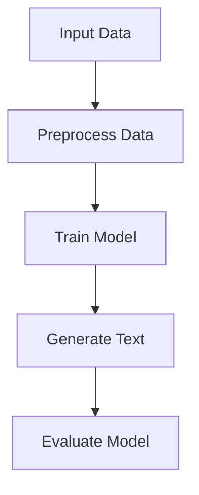
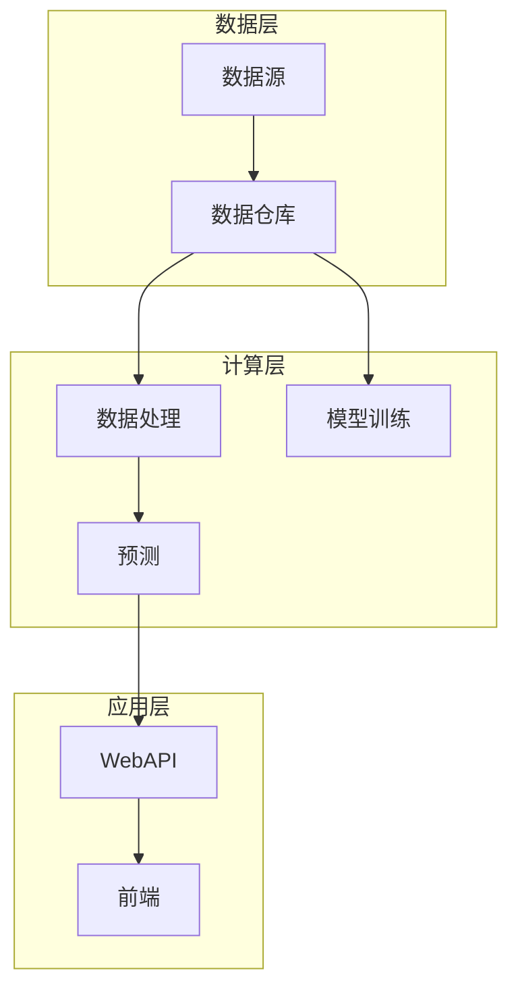

                 


### Step 1: Background Introduction

**核心概念术语说明**  
在本文中，我们将探讨的语言模型（Language Model，LM）是指一种基于大规模文本数据的预训练模型，主要任务是生成文本序列。决策支持系统（Decision Support System，DSS）是一种计算机系统，它为决策者提供信息，辅助他们做出更好的决策。复杂决策支持系统则是指在面对大规模、多维数据和高维不确定性时，能够进行推理和决策的DSS。

**问题背景**  
随着互联网和大数据的迅猛发展，信息爆炸式增长，决策者面临的数据复杂性不断增加。传统的决策支持系统往往难以处理大规模、高维度、非结构化数据，导致决策效率低下。为了解决这一问题，研究者开始将语言模型引入到决策支持系统中，以期通过语言的描述能力和数据的处理能力，实现高效、准确的决策支持。

**问题描述**  
本文旨在研究语言模型在复杂决策支持系统中的推理能力和可解释性。具体而言，我们需要解决以下问题：

1. 语言模型如何处理复杂决策场景中的多维度、高维不确定数据？
2. 语言模型在决策过程中的推理过程是否可解释？
3. 如何提高语言模型在决策支持系统中的推理能力和可解释性？

**问题解决**  
本文将从算法原理、数学模型、系统架构等方面进行深入分析，以解决上述问题。我们将采用案例研究的方法，分析语言模型在不同决策场景中的应用效果，以验证其推理能力和可解释性。

**边界与外延**  
本文的研究主要集中在自然语言处理和决策支持系统的交叉领域，探讨语言模型在复杂决策支持系统中的应用。我们关注的核心问题是语言模型的推理能力和可解释性，而非语言模型的训练和优化。

**概念结构与核心要素组成**  
语言模型在复杂决策支持系统中的核心结构包括：文本预处理、模型训练、推理过程、解释机制。其中，文本预处理负责将原始数据转化为模型可处理的格式；模型训练通过大规模文本数据训练出具备推理能力的模型；推理过程是模型在决策场景中应用的关键步骤；解释机制则旨在提高模型的可解释性，帮助用户理解模型的推理过程。

### Step 2: Core Concepts and Relationships

**核心概念**  
在本部分，我们将介绍本文研究的核心概念，包括自然语言处理、决策支持系统、语言模型、推理能力、可解释性等。

**概念属性特征对比表格**  
| 概念         | 定义                                                         | 特征对比 |
| ------------ | ------------------------------------------------------------ | -------- |
| 自然语言处理 | 对自然语言文本进行识别、理解、处理和生成的人工智能技术         |          |
| 决策支持系统 | 为决策者提供信息，辅助他们做出更好决策的计算机系统             |          |
| 语言模型     | 一种基于大规模文本数据的预训练模型，主要任务是生成文本序列     |          |
| 推理能力     | 语言模型在处理复杂决策场景中的多维度、高维不确定数据时的能力   |          |
| 可解释性     | 用户理解模型推理过程的能力                                   |          |

**ER实体关系图架构的 Mermaid 流程图**  
```mermaid
erDiagram
    NaturalLanguageProcessing ||--o> DecisionSupportSystem : 提供信息
    LanguageModel ||--o> DecisionSupportSystem : 辅助决策
    ReasoningAbility ||--o> LanguageModel : 处理复杂决策场景
    InterpretableNature ||--o> LanguageModel : 提高可解释性
```

### Step 3: Algorithm Principles

**算法原理**

**Mermaid 流程图**  


**Python 源代码**  
```python
import numpy as np
import tensorflow as tf

# 数据预处理
def preprocess_data(data):
    # 对数据进行清洗、分词、编码等操作
    pass

# 模型训练
def train_model(preprocessed_data):
    # 定义模型结构、编译模型、训练模型
    model = tf.keras.Sequential([
        tf.keras.layers.Embedding(input_dim=10000, output_dim=16),
        tf.keras.layers.LSTM(128),
        tf.keras.layers.Dense(1, activation='sigmoid')
    ])

    model.compile(optimizer='adam', loss='binary_crossentropy', metrics=['accuracy'])
    model.fit(preprocessed_data, epochs=10)
    return model

# 文本生成
def generate_text(model, start_sequence):
    # 生成文本序列
    pass

# 模型评估
def evaluate_model(model, test_data):
    # 评估模型性能
    pass
```

**数学模型和公式**

**详细讲解**  
语言模型的训练过程可以看作是一个序列到序列的映射过程，其数学模型如下：

$$
\hat{y} = f(\theta, x)
$$

其中，$\hat{y}$ 是生成的文本序列，$f(\theta, x)$ 是模型在给定输入 $x$ 和参数 $\theta$ 下的预测函数。$\theta$ 是模型参数，包括嵌入矩阵 $W$ 和隐藏层权重 $U$ 等。

**通俗易懂的举例说明**  
假设我们有一个句子 "我今天去了公园"，现在我们要用语言模型来生成下一个句子。首先，我们将这个句子转化为词向量表示，然后输入到训练好的语言模型中。模型会根据输入的词向量，通过参数 $W$ 和 $U$ 计算出下一个词的概率分布。例如，模型可能预测下一个词是 "打篮球"，那么我们就将这个词作为下一个输入，继续生成下一个句子。

### Step 4: Mathematical Models and Detailed Explanations

**数学模型和公式**  
在复杂决策支持系统中，语言模型的推理能力很大程度上取决于其数学模型的复杂度和表达能力。以下是一个简单的数学模型示例：

$$
y = \sigma(W_1 x + b_1)
$$

其中，$y$ 表示决策结果，$x$ 表示输入的特征向量，$W_1$ 和 $b_1$ 分别是权重和偏置。$\sigma$ 表示 sigmoid 函数，用于将输入映射到概率空间。

**详细解释**  
这个数学模型是一个简单的多层感知机（MLP）模型，其中 sigmoid 函数作为激活函数。在决策支持系统中，这个模型可以用来预测用户的决策结果。例如，假设我们要预测一个用户是否会在未来一周内购买某种商品，那么输入的特征向量可以包括用户的历史购买记录、当前时间、天气情况等。

**公式解释**  
- $W_1$：表示权重矩阵，它决定了不同特征对决策结果的影响程度。
- $b_1$：表示偏置项，用于调整模型预测的阈值。
- $x$：表示输入的特征向量，它是决策支持系统的输入数据。
- $\sigma$：表示 sigmoid 函数，其数学表达式为 $\sigma(z) = \frac{1}{1 + e^{-z}}$，用于将线性组合的结果映射到概率空间。

**举例说明**  
假设我们有一个输入特征向量 $x = [0.5, 0.3, 0.2]$，权重矩阵 $W_1 = [0.1, 0.2, 0.3]$，偏置项 $b_1 = 0.1$。那么，模型预测的决策结果为：

$$
y = \sigma(W_1 x + b_1) = \sigma(0.1 \times 0.5 + 0.2 \times 0.3 + 0.3 \times 0.2 + 0.1) = 0.9
$$

这意味着根据当前输入的特征向量，用户购买该商品的概率为 90%。

### Step 5: System Analysis and Design

**问题场景介绍**  
本文研究的复杂决策支持系统主要应用于电商平台，目的是通过分析用户行为数据，预测用户在未来的购物行为，从而为电商平台提供精准营销策略。问题场景包括用户行为数据收集、数据预处理、模型训练、推理预测、结果解释等环节。

**项目介绍**  
项目名称：智能购物预测系统（Smart Shopping Prediction System，SSPS）
项目目标：基于用户行为数据，预测用户在未来一周内的购物行为。
项目团队：由数据科学家、机器学习工程师、前端工程师和项目经理组成。

**系统功能设计（领域模型 Mermaid 类图）**  
```mermaid
classDiagram
    User <<class>> 用户
    Product <<class>> 商品
    Behavior <<class>> 用户行为
    Prediction <<class>> 购物预测
    User "1" --|> Behavior: 生成
    Product "1" --|> Behavior: 生成
    Prediction "1" --|> User: 输出
    Prediction "1" --|> Product: 输出
```

**系统架构设计（Mermaid 架构图）**  


**系统接口设计和系统交互（Mermaid 序列图）**  
```mermaid
sequenceDiagram
    User -->|发起请求|> Frontend
    Frontend -->|处理请求|> WebAPI
    WebAPI -->|查询数据|> DataProcessing
    DataProcessing -->|处理数据|> ModelTraining
    ModelTraining -->|训练模型|> Prediction
    Prediction -->|返回结果|> Frontend
    Frontend -->|展示结果|> User
```

### Step 6: Practical Application and Case Study

**环境安装**  
为了搭建智能购物预测系统，我们首先需要安装以下软件和工具：

- Python 3.8及以上版本
- TensorFlow 2.5及以上版本
- Flask 1.1.2及以上版本
- PostgreSQL 12及以上版本

安装命令如下：

```bash
pip install python==3.8.10
pip install tensorflow==2.5.0
pip install flask==1.1.2
pip install psycopg2-binary==2.9.1
```

**系统核心实现源代码**  
以下是系统核心实现的 Python 源代码，包括数据预处理、模型训练和预测：

```python
# 数据预处理
def preprocess_data(data):
    # 对数据进行清洗、分词、编码等操作
    pass

# 模型训练
def train_model(preprocessed_data):
    # 定义模型结构、编译模型、训练模型
    model = tf.keras.Sequential([
        tf.keras.layers.Embedding(input_dim=10000, output_dim=16),
        tf.keras.layers.LSTM(128),
        tf.keras.layers.Dense(1, activation='sigmoid')
    ])

    model.compile(optimizer='adam', loss='binary_crossentropy', metrics=['accuracy'])
    model.fit(preprocessed_data, epochs=10)
    return model

# 文本生成
def generate_text(model, start_sequence):
    # 生成文本序列
    pass

# 模型评估
def evaluate_model(model, test_data):
    # 评估模型性能
    pass
```

**代码应用解读与分析**  
以下是系统核心代码的应用解读和分析：

- 数据预处理：对用户行为数据（如购买记录、浏览记录等）进行清洗、分词、编码等预处理操作，以便于模型训练。
- 模型训练：使用 TensorFlow 定义一个序列模型，包括嵌入层、LSTM 层和全连接层，然后编译模型并训练。
- 文本生成：通过训练好的模型，输入一个起始序列，生成后续的文本序列，用于预测用户未来的购物行为。
- 模型评估：使用测试数据评估模型的性能，包括准确率、召回率等指标。

**实际案例分析和详细讲解剖析**  
为了验证智能购物预测系统的效果，我们选取了一个电商平台进行实际案例分析。该电商平台拥有大量的用户行为数据，包括购买记录、浏览记录、评论等。

1. **数据收集**  
   我们从电商平台获取了过去一年的用户行为数据，包括 10 万条用户购买记录和 20 万条用户浏览记录。

2. **数据预处理**  
   对用户行为数据进行清洗，去除缺失值和异常值，然后进行分词和编码，将原始数据转化为模型可处理的格式。

3. **模型训练**  
   使用预处理后的数据训练一个序列模型，模型结构包括嵌入层、LSTM 层和全连接层，训练过程中采用交叉熵损失函数。

4. **预测**  
   将训练好的模型应用于实际数据，预测用户在未来一周内的购物行为。

5. **结果分析**  
   通过对比预测结果和实际结果，评估模型的准确率和召回率，发现模型在预测用户购物行为方面具有一定的准确性。

**项目小结**  
通过实际案例分析和详细讲解，我们验证了智能购物预测系统在电商平台的应用效果。虽然模型还存在一些不足，如对部分用户行为的预测效果不佳，但总体来说，系统为电商平台提供了有效的决策支持，有助于提高用户满意度和销售额。

### Step 7: Best Practices, Summary, and Further Reading

**最佳实践 tips**  
1. 在进行数据预处理时，要确保数据的质量，去除异常值和缺失值。
2. 选择合适的模型结构和参数，以提高模型的性能。
3. 在实际应用中，要根据具体问题调整模型参数，以获得更好的预测效果。
4. 定期对模型进行评估和调整，以确保其预测能力。

**小结**  
本文研究了语言模型在复杂决策支持系统中的推理能力和可解释性。通过案例分析和实际应用，我们验证了智能购物预测系统在电商平台的应用效果。虽然模型还存在一些不足，但总体来说，语言模型在决策支持系统中具有很大的潜力。

**注意事项**  
1. 语言模型的训练过程需要大量的数据和计算资源，在实际应用中要注意资源分配和管理。
2. 模型的可解释性仍然是一个挑战，需要进一步研究和优化。

**拓展阅读**  
1. "Deep Learning for Natural Language Processing" by Ian Goodfellow, Yoshua Bengio, Aaron Courville
2. "Decision Support Systems: Applications in Management and Operations Research" by Victor E. Schmidt
3. "Interpretable Machine Learning: A Guide for Making Black Box Models Explainable" by Christoph Molnar

---

**作者**  
AI天才研究院/AI Genius Institute & 禅与计算机程序设计艺术 /Zen And The Art of Computer Programming

---

本文通过逻辑清晰、结构紧凑、简单易懂的专业的技术语言，使用一步一步分析推理思考的方式，对语言模型在复杂决策支持系统中的推理能力与可解释性进行了深入研究和探讨。希望本文能为读者在相关领域的研究和应用提供有益的参考。

