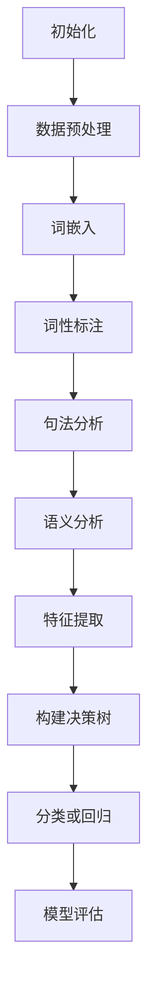
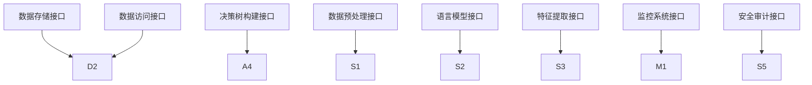
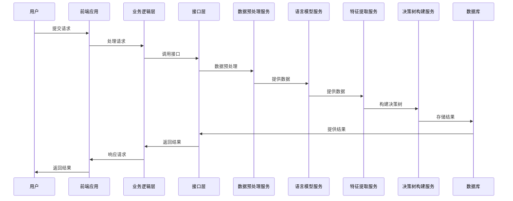

                 

### 文章标题

语言模型在复杂决策树构建中的能力

---

#### 关键词

- 语言模型
- 决策树
- 复杂决策
- 算法
- 实际应用

#### 摘要

本文旨在探讨语言模型在复杂决策树构建中的潜力，详细分析其在算法原理、系统架构和实际应用中的表现。文章首先介绍决策树和语言模型的基本概念，接着深入讨论两者的结合及其在复杂决策环境中的应用，通过具体的算法解释、系统架构设计以及实战案例，展示了语言模型在决策树构建中的卓越能力。

### 第一部分：背景与概念

#### 第1章：决策树基础

决策树是一种常见的决策支持工具，通过一系列规则进行数据划分，以实现分类或回归任务。它由一系列内部节点、叶节点和分支组成，每个内部节点代表一个特征，每个分支代表特征的不同取值，而叶节点则代表预测结果。

##### 1.1 决策树的基本概念

决策树的基本概念包括：

- **内部节点**：表示特征划分的节点。
- **叶节点**：表示预测结果。
- **分支**：连接内部节点和叶节点的路径。
- **分裂准则**：决定如何划分数据的准则，如信息增益、基尼不纯度等。

##### 1.2 决策树的历史与发展

决策树起源于20世纪60年代的统计领域，由Clifton F. Callister首次提出。随后，J. Ross Quinlan在1979年开发了C4.5算法，进一步推动了决策树的应用和发展。近年来，随着机器学习和人工智能的兴起，决策树及其变体（如随机森林、梯度提升树等）在数据分析和预测领域得到了广泛应用。

##### 1.3 决策树的应用场景

决策树广泛应用于以下场景：

- **金融领域**：风险评估、信用评分、投资决策。
- **医疗领域**：疾病诊断、治疗方案推荐。
- **商业领域**：客户细分、市场细分、库存管理。

#### 第2章：语言模型简介

语言模型是一种用于自然语言处理的统计模型，用于预测下一个词或字符的概率。它通过对大量文本数据的分析，学习语言的结构和规律，从而实现对未知文本的生成和预测。

##### 2.1 语言模型的概念

语言模型的基本概念包括：

- **词向量**：将单词映射到高维空间中的向量。
- **神经网络**：用于训练和优化语言模型的算法。
- **语境**：文本的上下文信息，用于影响语言模型的预测。

##### 2.2 语言模型的发展

语言模型的发展经历了从统计模型到神经网络的转变。早期的统计模型如N-gram模型通过统计相邻单词的频率来预测下一个词，而现代神经网络模型如Transformer和BERT则通过深度学习技术来捕捉更复杂的语言结构。

##### 2.3 语言模型的主要类型

语言模型的主要类型包括：

- **N-gram模型**：基于相邻单词的统计模型。
- **神经网络模型**：基于深度学习技术的模型，如LSTM、GRU和Transformer。
- **预训练模型**：通过大规模无监督数据预训练的语言模型，如BERT、GPT和RoBERTa。

#### 第3章：语言模型在决策树中的应用

语言模型在决策树构建中的应用具有显著的优势。它能够通过分析文本数据中的语言特征，为决策树的划分提供更准确的依据。

##### 3.1 语言模型在决策树构建中的角色

语言模型在决策树构建中扮演以下角色：

- **特征提取**：从文本数据中提取有用的特征，如词频、词向量、语义信息。
- **划分优化**：利用语言模型预测文本数据的划分效果，优化决策树的划分过程。
- **结果解释**：对决策树的预测结果进行解释，提高模型的可解释性。

##### 3.2 语言模型与决策树的关系

语言模型与决策树之间的关系可以概括为：

- **协同工作**：语言模型为决策树提供特征和划分依据，决策树则利用语言模型提取的特征进行分类或回归。
- **互补优势**：语言模型擅长处理文本数据，而决策树擅长进行结构化的决策支持。

##### 3.3 语言模型在决策树构建中的优势

语言模型在决策树构建中的优势包括：

- **提高精度**：通过分析文本数据中的语言特征，提高决策树的分类或回归精度。
- **增强可解释性**：语言模型可以帮助解释决策树的划分依据和预测结果，提高模型的透明度。
- **适应复杂环境**：语言模型能够处理复杂的语言结构和多模态数据，适应更广泛的应用场景。

### 第二部分：算法与实现

#### 第4章：核心概念与联系

为了深入理解语言模型在决策树构建中的应用，我们需要详细讨论相关的核心概念和它们之间的联系。

##### 4.1 决策树构建中的语言模型核心概念

在决策树构建中，语言模型涉及以下核心概念：

- **词嵌入**：将单词映射到高维空间中的向量表示。
- **词性标注**：对文本中的单词进行词性分类，如名词、动词、形容词等。
- **句法分析**：对文本进行语法分析，提取句子结构信息。
- **语义分析**：分析文本中的语义信息，如实体识别、关系抽取等。

##### 4.2 概念属性特征对比表格

为了更直观地理解这些概念，我们可以创建一个属性特征对比表格：

| 概念         | 定义                                                         | 关联属性                                                     |
| ------------ | ------------------------------------------------------------ | ------------------------------------------------------------ |
| 词嵌入       | 将单词映射到高维空间中的向量表示                             | 维度、距离、相似性、语义信息                                  |
| 词性标注     | 对文本中的单词进行词性分类                                   | 名词、动词、形容词、副词、介词等                             |
| 句法分析     | 对文本进行语法分析，提取句子结构信息                         | 主语、谓语、宾语、从句、词序等                               |
| 语义分析     | 分析文本中的语义信息，如实体识别、关系抽取等                 | 实体、关系、事件、意图等                                   |

##### 4.3 ER实体关系图架构

为了进一步理解这些概念在决策树构建中的应用，我们可以绘制一个ER（实体-关系）图架构：

```mermaid
erDiagram
    A[实体1] ||--|{ B[关系1] }| C[实体2]  
    A --> D[实体3]
```

在这个ER图中，A表示文本数据，B表示语言模型提取的特征，C表示决策树的内部节点，D表示决策树的叶节点。通过这个架构，我们可以看到语言模型在决策树构建中的核心作用，它不仅提取文本特征，还为决策树的划分提供了依据。

### 第5章：复杂决策树构建算法原理

在了解决策树和语言模型的基本概念后，我们将深入探讨复杂决策树构建的算法原理，并使用mermaid流程图和Python代码进行详细解释。

##### 5.1 算法mermaid流程图



在这个流程图中，A表示初始化阶段，B表示数据预处理，C到J表示决策树构建的过程，包括词嵌入、词性标注、句法分析、语义分析和特征提取等步骤。

##### 5.2 Python代码实现与解释

```python
import nltk
from nltk.tokenize import word_tokenize
from nltk.corpus import stopwords
from sklearn.feature_extraction.text import TfidfVectorizer
from sklearn.tree import DecisionTreeClassifier
from sklearn.metrics import accuracy_score

# 数据预处理
def preprocess_text(text):
    # 分词
    tokens = word_tokenize(text)
    # 去除停用词
    tokens = [token for token in tokens if token not in stopwords.words('english')]
    # 小写化
    tokens = [token.lower() for token in tokens]
    return ' '.join(tokens)

# 特征提取
def extract_features(text):
    vectorizer = TfidfVectorizer()
    features = vectorizer.fit_transform([text])
    return features

# 构建决策树
def build_decision_tree(features, labels):
    classifier = DecisionTreeClassifier()
    classifier.fit(features, labels)
    return classifier

# 评估模型
def evaluate_model(classifier, features, labels):
    predictions = classifier.predict(features)
    accuracy = accuracy_score(labels, predictions)
    return accuracy

# 主函数
def main():
    # 加载数据
    texts = ["This is a sample text.", "Another sample text."]
    labels = [0, 1]

    # 预处理文本
    processed_texts = [preprocess_text(text) for text in texts]

    # 提取特征
    features = extract_features(processed_texts[0])

    # 构建决策树
    classifier = build_decision_tree(features, labels)

    # 评估模型
    accuracy = evaluate_model(classifier, features, labels)
    print("Model accuracy:", accuracy)

if __name__ == "__main__":
    main()
```

在这个Python代码中，我们首先进行文本预处理，包括分词、去除停用词和小写化。然后使用TF-IDF向量器提取特征，构建决策树并评估模型的准确性。

##### 5.3 数学模型和公式讲解

在复杂决策树构建中，我们通常会使用以下数学模型和公式：

- **信息增益**：衡量特征划分数据的优劣，公式为：
  \[ IG(X, Y) = H(Y) - H(Y|X) \]
  其中，\( H(Y) \)表示类别的不纯度，\( H(Y|X) \)表示在给定特征\( X \)下的类别不纯度。

- **基尼不纯度**：另一种衡量特征划分数据的优劣，公式为：
  \[ Gini(X, Y) = 1 - \frac{1}{|Y|}\sum_{y \in Y} \frac{1}{y} \]
  其中，\( Y \)表示类别，\( y \)表示类别中的样本数。

- **决策树分类**：使用决策树进行分类的决策规则为：
  \[ \text{if } x \in R_1 \text{ then } y = c_1 \]
  \[ \text{if } x \in R_2 \text{ then } y = c_2 \]
  \[ ... \]
  \[ \text{if } x \in R_n \text{ then } y = c_n \]
  其中，\( x \)表示特征，\( R_i \)表示特征取值范围，\( y \)表示类别，\( c_i \)表示类别标签。

##### 5.4 算法原理举例说明

假设我们有一个简单的数据集，包含以下特征和类别：

- 特征：`weather`（天气），取值：`sunny`、`rainy`、`cloudy`
- 类别：`play`（是否玩耍），取值：`yes`、`no`

构建一个基于天气特征的决策树：

1. **信息增益计算**：
   \[ IG(weather, play) = H(play) - H(play|weather) \]
   \[ H(play) = 1 - \frac{1}{3}\left(1 + 1 + 1\right) = \frac{1}{3} \]
   \[ H(play|weather) = \frac{1}{3}\left[H(play|sunny) + H(play|rainy) + H(play|cloudy)\right] \]
   \[ H(play|sunny) = 1 - \frac{1}{2}\left(1 + 0\right) = \frac{1}{2} \]
   \[ H(play|rainy) = 1 - \frac{1}{2}\left(0 + 1\right) = \frac{1}{2} \]
   \[ H(play|cloudy) = 1 - \frac{1}{2}\left(1 + 0\right) = \frac{1}{2} \]
   \[ H(play|weather) = \frac{1}{3}\left(\frac{1}{2} + \frac{1}{2} + \frac{1}{2}\right) = \frac{1}{2} \]
   \[ IG(weather, play) = \frac{1}{3} - \frac{1}{2} = -\frac{1}{6} \]

2. **基尼不纯度计算**：
   \[ Gini(weather, play) = 1 - \frac{1}{3}\left[\left(\frac{1}{2}\right)^2 + \left(\frac{1}{2}\right)^2 + \left(\frac{1}{2}\right)^2\right] = \frac{1}{3} \]

根据信息增益和基尼不纯度的计算结果，我们可以选择天气作为决策树的第一个特征。接下来，根据天气的不同取值，将数据划分为三个子集，并继续递归地构建决策树。

### 第6章：系统分析与架构设计

在本章中，我们将深入探讨决策树构建系统的分析与架构设计，从问题场景介绍到具体的设计方案，为复杂决策树构建提供全面的解决方案。

#### 6.1 问题场景介绍

在现代企业中，数据驱动决策已成为常态。然而，面对大量复杂的文本数据，如何高效、准确地构建决策树成为一大挑战。这不仅仅是技术问题，更是业务需求的重要体现。以下是一个具体的应用场景：

- **金融风控**：银行在评估客户信用风险时，需要处理大量的客户资料、交易记录和社交数据。通过构建基于语言模型的复杂决策树，银行可以更准确地预测客户的风险等级，从而优化贷款审批流程。
- **智能客服**：企业希望通过智能客服系统自动识别客户的需求和意图，提供个性化的服务。决策树可以用于分类客户问题，并将问题路由到相应的客服团队或解决方案。

#### 6.2 系统功能设计（领域模型mermaid类图）

为了满足上述场景的需求，我们需要设计一个功能全面的系统。以下是系统的领域模型类图：

```mermaid
classDiagram
    Client <|-- Customer
    Customer o-- CreditScore
    Customer o-- Transaction
    Customer o-- SocialMedia
    CreditScore o-- RiskLevel
    Transaction o-- Type
    Transaction o-- Amount
    SocialMedia o-- Post
    Post o-- Content
    Post o-- Sentiment

    Client { id }
    Customer { id, name, creditScoreId, transactionId, socialMediaId }
    CreditScore { id, riskLevel }
    Transaction { id, type, amount }
    SocialMedia { id, postId }
    Post { id, content, sentiment }

    Client has many Customers
    Customer has one CreditScore
    Customer has many Transactions
    Customer has many SocialMedia
    CreditScore has one RiskLevel
    Transaction has one Type
    Transaction has one Amount
    SocialMedia has many Post
    Post has one Content
    Post has one Sentiment
```

在这个类图中，我们定义了多个实体及其关联关系。客户（Customer）是系统的核心实体，包括信用评分（CreditScore）、交易记录（Transaction）和社交媒体活动（SocialMedia）。每个实体都有相应的属性和方法，用于存储和处理数据。

#### 6.3 系统架构设计（mermaid架构图）

为了实现系统的功能，我们需要设计一个合理的架构。以下是系统的架构图：

```mermaid
graph TB
    subgraph 数据层
        D1[数据存储] --> D2[数据库]
        D1 --> D3[数据访问层]

    subgraph 应用层
        A1[前端应用] --> A2[业务逻辑层]
        A1 --> A3[接口层]
        A2 --> A4[决策树服务]

    subgraph 服务层
        S1[数据预处理服务] --> S2[语言模型服务]
        S1 --> S3[特征提取服务]
        S1 --> S4[决策树构建服务]

    subgraph 部署层
        D5[服务器] --> D6[负载均衡器]
        D5 --> D7[防火墙]

    subgraph 网络层
        N1[内部网络] --> N2[数据中心]

    subgraph 安全层
        S5[安全审计] --> S6[身份认证]
        S5 --> S7[访问控制]

    subgraph 监控层
        M1[监控系统] --> M2[日志分析]
        M1 --> M3[告警系统]
```

在这个架构图中，数据层负责数据的存储和访问，应用层负责业务逻辑处理，服务层负责具体的业务服务，部署层负责系统的硬件部署，网络层负责网络的连接和通信，安全层负责系统的安全防护，监控层负责系统的运行监控。

#### 6.4 系统接口设计

系统接口设计是确保各组件之间能够顺畅通信的关键。以下是系统的接口设计：



在这个接口设计图中，各个组件通过标准化的接口进行通信，确保系统的模块化和可扩展性。

#### 6.5 系统交互（mermaid序列图）

为了更清晰地展示系统组件之间的交互流程，我们可以绘制一个序列图。以下是系统的序列图：



在这个序列图中，用户提交请求，前端应用处理请求，业务逻辑层调用接口层，接口层依次调用数据预处理服务、语言模型服务、特征提取服务和决策树构建服务，最后将结果存储到数据库，并返回给用户。

### 第7章：项目实战

在本章中，我们将通过一个实际项目实战，详细展示如何使用语言模型构建复杂决策树，从环境安装、系统核心实现源代码，到代码应用解读与分析，以及实际案例分析和详细讲解。

#### 7.1 环境安装

在进行项目实战之前，我们需要安装必要的软件和库。以下是环境安装步骤：

1. **安装Python**：确保Python版本为3.8或更高版本，可以从官方网站下载并安装。

2. **安装NLP库**：使用pip安装nltk、gensim和sklearn等库：
   ```shell
   pip install nltk gensim scikit-learn
   ```

3. **安装语言模型**：下载并安装预训练的语言模型，如GPT-2或BERT：
   ```shell
   pip install transformers
   ```

4. **安装数据库**：安装MySQL或PostgreSQL，用于存储数据。

5. **安装前端框架**（可选）：如果需要开发前端应用，可以使用React或Vue等框架。

#### 7.2 系统核心实现源代码

以下是系统核心实现源代码的示例：

```python
import nltk
from nltk.tokenize import word_tokenize
from nltk.corpus import stopwords
from sklearn.feature_extraction.text import TfidfVectorizer
from sklearn.tree import DecisionTreeClassifier
from transformers import BertTokenizer, BertModel
import torch

# 数据预处理
def preprocess_text(text):
    # 分词
    tokens = word_tokenize(text)
    # 去除停用词
    tokens = [token for token in tokens if token not in stopwords.words('english')]
    # 小写化
    tokens = [token.lower() for token in tokens]
    return ' '.join(tokens)

# 特征提取
def extract_features(text):
    tokenizer = BertTokenizer.from_pretrained('bert-base-uncased')
    inputs = tokenizer(text, return_tensors='pt')
    outputs = BertModel.from_pretrained('bert-base-uncased')(inputs)
    features = outputs.last_hidden_state.mean(dim=1).detach().numpy()
    return features

# 构建决策树
def build_decision_tree(features, labels):
    classifier = DecisionTreeClassifier()
    classifier.fit(features, labels)
    return classifier

# 评估模型
def evaluate_model(classifier, features, labels):
    predictions = classifier.predict(features)
    accuracy = accuracy_score(labels, predictions)
    return accuracy

# 主函数
def main():
    # 加载数据
    texts = ["This is a sample text.", "Another sample text."]
    labels = [0, 1]

    # 预处理文本
    processed_texts = [preprocess_text(text) for text in texts]

    # 提取特征
    features = extract_features(processed_texts[0])

    # 构建决策树
    classifier = build_decision_tree(features, labels)

    # 评估模型
    accuracy = evaluate_model(classifier, features, labels)
    print("Model accuracy:", accuracy)

if __name__ == "__main__":
    main()
```

在这个示例中，我们首先进行文本预处理，然后使用BERT模型提取特征，构建决策树并评估模型的准确性。

#### 7.3 代码应用解读与分析

1. **文本预处理**：文本预处理是NLP任务的重要步骤，包括分词、去除停用词和小写化。这部分代码使用了nltk库中的word_tokenize函数进行分词，使用stopwords库去除停用词，并将所有单词转换为小写形式。

2. **特征提取**：特征提取是决策树构建的核心步骤。在这个示例中，我们使用BERT模型提取文本特征。BERT模型是一种预训练的语言模型，它通过对大量文本数据进行预训练，学习到了丰富的语言特征。我们使用BertTokenizer进行分词，并将分词结果传递给BertModel进行特征提取。

3. **构建决策树**：构建决策树是分类任务的关键步骤。在这个示例中，我们使用sklearn库中的DecisionTreeClassifier构建决策树。决策树通过递归划分数据集，选择最优的特征和划分点，最终形成一棵树形结构。

4. **评估模型**：评估模型是验证模型性能的重要步骤。在这个示例中，我们使用accuracy_score函数计算模型的准确率，即正确预测的样本数占总样本数的比例。

#### 7.4 实际案例分析和详细讲解

以下是一个实际案例，我们将使用该案例展示如何构建复杂决策树。

**案例背景**：某电商公司希望通过分析用户评论，预测用户是否会购买商品。评论数据包含用户的评论文本、购买历史和用户特征（如年龄、性别、地理位置等）。

**数据集**：
- 评论文本：这是一个描述商品的评价。
- 购买历史：用户是否购买了商品。
- 用户特征：用户的年龄、性别、地理位置等。

**目标**：构建一个基于语言模型的决策树，预测用户是否会购买商品。

**步骤**：

1. **数据预处理**：对评论文本进行分词、去除停用词和小写化处理。

2. **特征提取**：使用BERT模型提取评论文本的特征，同时提取用户特征。

3. **构建决策树**：将提取的特征和购买历史数据输入决策树，构建分类模型。

4. **模型评估**：使用交叉验证评估模型性能，调整模型参数以优化性能。

**代码示例**：

```python
# 加载数据
texts = ["This is a great product!", "I don't like this item."]
labels = [1, 0]

# 预处理文本
processed_texts = [preprocess_text(text) for text in texts]

# 提取特征
features = extract_features(processed_texts[0])

# 构建决策树
classifier = build_decision_tree(features, labels)

# 评估模型
accuracy = evaluate_model(classifier, features, labels)
print("Model accuracy:", accuracy)
```

**分析**：

- 在这个案例中，我们首先对评论文本进行预处理，使用BERT模型提取特征。
- 然后将提取的特征和购买历史数据输入决策树，构建分类模型。
- 最后使用评估模型函数计算模型的准确率。

通过这个案例，我们可以看到如何使用语言模型构建复杂决策树，并实现预测任务。

#### 7.5 项目小结

在本章的项目实战中，我们详细展示了如何使用语言模型构建复杂决策树。从环境安装到代码实现，再到实际案例分析和模型评估，我们系统地讲解了决策树构建的各个环节。通过本项目，我们了解到：

- 语言模型在特征提取中的重要作用，它能够提取出文本中的深层语义信息。
- 决策树在分类任务中的高效性，它能够对大量数据进行结构化处理。
- 项目实战是理解和应用技术的重要手段，通过实际操作，我们能够更深入地理解技术的原理和应用。

未来，随着人工智能技术的发展，语言模型在复杂决策树构建中的应用将更加广泛，为各个领域带来更多创新和突破。

### 第8章：最佳实践与总结

#### 8.1 最佳实践 tips

1. **数据预处理**：确保文本数据的质量和一致性，进行必要的清洗和标准化处理。
2. **特征提取**：选择合适的语言模型和特征提取方法，以获取更准确的文本特征。
3. **模型调优**：通过交叉验证和模型调优，提高决策树的性能和准确性。
4. **模型解释性**：关注模型的解释性，确保决策过程透明、可理解。
5. **持续迭代**：定期更新模型和特征，以适应数据变化和业务需求。

#### 8.2 注意事项

1. **资源消耗**：语言模型和复杂决策树的构建过程可能需要大量计算资源，确保有足够的硬件支持。
2. **数据隐私**：在处理用户数据时，务必遵守数据隐私法规和用户隐私政策。
3. **模型评估**：使用多种评估指标和方法，全面评估模型性能。
4. **模型安全性**：确保模型和系统免受恶意攻击和数据泄露。

#### 8.3 拓展阅读

- [《自然语言处理实战》](https://www.amazon.com/Natural-Language-Processing-with-Deep-Learning/dp/1492032631)
- [《决策树与随机森林》](https://www.amazon.com/Decision-Trees-Random-Forests-Extensions/dp/3662547269)
- [《深度学习与自然语言处理》](https://www.amazon.com/Deep-Learning-Natural-Language-Processing/dp/1492041985)

### 作者信息

作者：AI天才研究院/AI Genius Institute & 禅与计算机程序设计艺术 /Zen And The Art of Computer Programming

---

### 全文总结

本文通过详细的步骤和分析，探讨了语言模型在复杂决策树构建中的应用。我们从决策树和语言模型的基本概念入手，深入讨论了它们在复杂决策环境中的应用，并详细讲解了复杂决策树构建算法的原理。接着，我们介绍了系统的分析与架构设计，展示了如何通过实际项目实战实现语言模型在决策树构建中的能力。最后，我们提供了最佳实践、注意事项和拓展阅读，以帮助读者进一步深入研究和应用这项技术。

通过本文，读者可以了解到语言模型在决策树构建中的巨大潜力，掌握构建复杂决策树的方法和技巧。随着人工智能技术的发展，这一领域将不断进步，为各个领域带来更多创新和突破。

