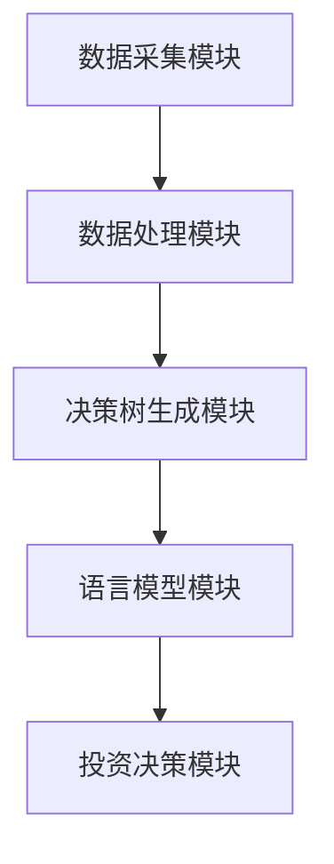
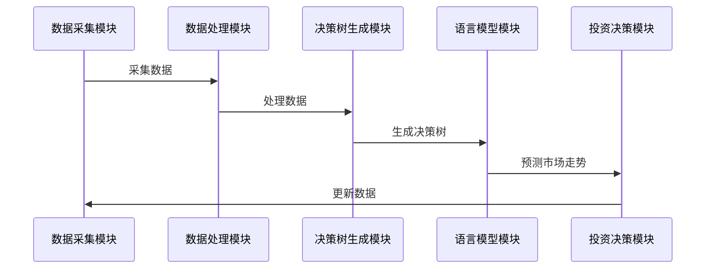

                 

## 《语言模型在复杂决策树生成与金融投资策略中的创新研究》

### 关键词
- 语言模型
- 决策树生成
- 金融投资策略
- 算法优化
- 系统架构设计

### 摘要
本文主要探讨了语言模型在复杂决策树生成与金融投资策略中的创新应用。首先，介绍了复杂决策树生成和金融投资策略的基本概念与重要性。然后，详细阐述了语言模型的基本概念、发展历程及其在决策树生成和金融投资策略中的应用。接着，介绍了决策树生成算法的原理、语言模型的应用，以及金融投资策略中的创新语言模型。进一步，本文通过数学模型和Python代码，深入解析了算法原理和数学模型，并对系统分析与架构设计进行了详细探讨。最后，通过实际案例分析和项目小结，总结了项目的经验与改进方向，为未来的研究和应用提供了有益的参考。

## 《语言模型在复杂决策树生成与金融投资策略中的创新研究》目录大纲

### 第一部分：背景介绍与核心概念

#### 第1章：问题背景与核心概念
- **1.1.1 问题的提出**
  - 复杂决策树生成的需求
  - 金融投资策略的重要性
- **1.1.2 语言模型的基本概念**
  - 语言模型的定义
  - 语言模型的发展历程
  - 语言模型的核心特点
- **1.1.3 复杂决策树生成与金融投资策略的关系**
  - 语言模型在决策树生成中的应用
  - 金融投资策略中语言模型的作用
- **1.1.4 研究的边界与外延**
  - 研究范围
  - 研究的局限性

### 第二部分：核心概念与原理

#### 第2章：复杂决策树生成原理
- **2.1.1 决策树的基本概念**
  - 决策树的定义
  - 决策树的基本结构
- **2.1.2 决策树生成算法**
  - ID3算法
  - C4.5算法
  - CART算法
- **2.1.3 语言模型在决策树生成中的应用**
  - 语言模型的优势
  - 语言模型在决策树生成中的具体应用

#### 第3章：金融投资策略原理
- **3.1.1 金融投资策略概述**
  - 金融投资策略的定义
  - 金融投资策略的类型
- **3.1.2 语言模型在金融投资策略中的应用**
  - 语言模型在市场预测中的应用
  - 语言模型在投资决策中的应用
- **3.1.3 创新性语言模型在金融投资策略中的应用**
  - 创新性语言模型的定义
  - 创新性语言模型的特点

### 第三部分：算法原理与数学模型

#### 第4章：算法原理讲解
- **4.1.1 复杂决策树生成算法的数学模型**
  - 决策树的剪枝策略
  - 决策树的评价指标
- **4.1.2 语言模型在金融投资策略中的应用数学模型**
  - 语言模型的训练过程
  - 语言模型在投资决策中的应用公式
- **4.1.3 数学模型的Python实现**
  - Python代码实现
  - 代码应用解读与分析

### 第四部分：系统分析与架构设计

#### 第5章：系统分析与架构设计
- **5.1.1 问题场景介绍**
  - 复杂决策树生成与金融投资策略的结合
  - 系统的整体架构设计
- **5.1.2 系统功能设计**
  - 领域模型设计
  - 系统功能模块划分
- **5.1.3 系统架构设计**
  - 系统架构图
  - 系统模块之间的关系
- **5.1.4 系统接口设计与交互**
  - 系统接口设计
  - 系统交互序列图

### 第五部分：项目实战

#### 第6章：项目实战
- **6.1.1 环境安装与配置**
  - 系统环境搭建
  - 必需工具与软件的安装
- **6.1.2 系统核心实现**
  - 代码实现
  - 代码解读与分析
- **6.1.3 实际案例分析**
  - 案例选择与介绍
  - 案例分析与详细讲解
- **6.1.4 项目小结**
  - 项目总结
  - 项目拓展与改进方向

### 第六部分：最佳实践与拓展

#### 第7章：最佳实践与拓展
- **7.1.1 最佳实践技巧**
  - 算法优化策略
  - 系统性能调优
- **7.1.2 注意事项**
  - 算法应用中的潜在风险
  - 数据处理中的常见问题
- **7.1.3 拓展阅读**
  - 相关文献推荐
  - 最新研究成果介绍

### 附录

#### 附录A：术语解释
- 对书中涉及的重要术语进行解释

#### 附录B：参考文献
- 列出本书引用的参考文献

## 第一部分：背景介绍与核心概念

### 第1章：问题背景与核心概念

#### 1.1.1 问题的提出

在现代金融市场中，复杂决策树生成和金融投资策略的应用越来越广泛。复杂决策树生成在数据挖掘、机器学习和人工智能等领域扮演着重要角色，它能够处理大量数据并从中提取有价值的信息。而金融投资策略则是投资者在进行决策时的重要工具，通过分析市场数据和历史趋势，帮助投资者做出更明智的投资选择。

**复杂决策树生成的需求**：
随着数据量的不断增加和多样化，传统的简单决策树已经难以应对复杂的问题。复杂决策树能够处理更多维度、更复杂的数据集，并且具有更高的准确性和鲁棒性。在金融投资领域，复杂决策树能够帮助投资者从大量市场数据中快速提取有用的信息，从而制定更有效的投资策略。

**金融投资策略的重要性**：
金融投资策略是投资者在市场中实现收益的关键。一个优秀的投资策略能够帮助投资者规避风险，抓住市场机会，实现资产增值。随着金融市场的不断变化和复杂性增加，投资者需要更加智能和高效的策略来应对市场挑战。

#### 1.1.2 语言模型的基本概念

**语言模型**是一种统计模型，用于对自然语言文本进行建模和预测。它的核心目标是学习语言的结构和规律，从而生成、理解和处理自然语言。语言模型在机器翻译、文本生成、情感分析等领域有着广泛的应用。

**语言模型的定义**：
语言模型是一种概率模型，它通过学习大量语言数据，生成自然语言文本的概率分布。这种概率分布用于预测下一个单词、短语或句子的可能性，从而生成新的文本。

**语言模型的发展历程**：
语言模型的发展经历了从规则模型到统计模型，再到深度学习模型的过程。早期的规则模型基于人工定义的语法规则，而现代语言模型则利用大量的数据进行训练，通过统计学习算法来发现语言模式。

**语言模型的核心特点**：
- **概率预测**：语言模型通过预测文本的概率分布来生成新的文本，从而实现自然语言生成。
- **自适应能力**：语言模型能够根据新的数据不断更新和优化自身，从而适应不同的应用场景。
- **跨领域应用**：语言模型能够应用于多种语言处理任务，如文本分类、机器翻译、问答系统等。

#### 1.1.3 复杂决策树生成与金融投资策略的关系

**语言模型在决策树生成中的应用**：
语言模型可以用于生成复杂决策树的规则，通过学习大量的决策规则和历史数据，语言模型能够生成更加精细和准确的决策树。这种技术被称为基于语言模型的决策树生成，它能够提高决策树生成算法的效率和准确性。

**金融投资策略中语言模型的作用**：
语言模型在金融投资策略中发挥着重要作用。首先，它可以用于分析市场数据，提取有价值的信息，从而帮助投资者制定投资策略。其次，语言模型可以用于预测市场趋势，为投资者提供实时决策支持。此外，语言模型还可以用于优化投资组合，提高资产配置的效率和风险控制能力。

#### 1.1.4 研究的边界与外延

**研究的边界**：
本文主要关注语言模型在复杂决策树生成和金融投资策略中的应用，研究范围包括语言模型的基本原理、决策树生成算法的改进以及金融投资策略的优化。

**研究的局限性**：
虽然语言模型在复杂决策树生成和金融投资策略中具有很大的潜力，但仍然存在一些局限性。例如，语言模型在处理实时数据时可能存在延迟问题，且在应对极端市场波动时可能不够稳定。因此，未来的研究需要进一步探索如何优化语言模型，提高其在金融投资中的稳定性和可靠性。

## 第二部分：核心概念与原理

### 第2章：复杂决策树生成原理

#### 2.1.1 决策树的基本概念

**决策树的定义**：
决策树是一种树形结构，它通过一系列决策节点来表示不同的特征和分类规则。每个节点代表一个特征，每个分支代表一个特征值的分类结果。决策树的叶子节点表示最终的分类结果。

**决策树的基本结构**：
决策树由根节点、内部节点和叶子节点组成。根节点代表初始分类，内部节点表示特征的分割，叶子节点表示最终的分类结果。决策树通过一系列分割规则将数据集划分为不同的子集，直到满足停止条件。

#### 2.1.2 决策树生成算法

**ID3算法**：
ID3（Iterative Dichotomiser 3）算法是一种基于信息增益的决策树生成算法。它通过计算每个特征的信息增益，选择具有最高信息增益的特征作为分割标准，从而生成决策树。

**C4.5算法**：
C4.5算法是ID3算法的改进版本，它使用增益率（gain ratio）来选择特征，从而避免特征选择偏差。C4.5算法还引入了剪枝技术，以防止过拟合。

**CART算法**：
CART（Classification and Regression Tree）算法是一种基于二分类的决策树生成算法。它使用基尼不纯度（Gini impurity）或熵（Entropy）作为分割标准，可以用于分类和回归任务。

#### 2.1.3 语言模型在决策树生成中的应用

**语言模型的优势**：
语言模型在决策树生成中具有以下几个优势：
- **自动特征提取**：语言模型能够自动从大量文本数据中提取出具有区分性的特征，从而提高决策树的生成效率。
- **鲁棒性**：语言模型具有较好的鲁棒性，能够应对不同类型的数据和噪声。
- **灵活性**：语言模型可以根据不同的任务需求进行调整和优化，从而适应不同的决策树生成场景。

**语言模型在决策树生成中的具体应用**：
语言模型在决策树生成中的应用包括以下几个方面：
- **特征提取**：使用语言模型对文本数据进行处理，提取出具有区分性的特征，作为决策树的输入。
- **规则生成**：利用语言模型生成的规则，构建复杂决策树的分割规则。
- **模型优化**：通过优化语言模型，提高决策树的生成效率和准确性。

### 第3章：金融投资策略原理

#### 3.1.1 金融投资策略概述

**金融投资策略的定义**：
金融投资策略是指投资者为了实现特定投资目标而制定的决策方案。它包括投资品种的选择、投资组合的配置、风险控制方法等。

**金融投资策略的类型**：
金融投资策略可以分为以下几种类型：
- **主动型投资策略**：通过分析市场趋势和宏观经济数据，积极寻找投资机会，追求超额收益。
- **被动型投资策略**：通过跟踪市场指数，实现长期稳定的投资回报，不主动寻找投资机会。
- **组合投资策略**：通过将不同类型的投资品种组合在一起，分散风险，实现资产配置的优化。

#### 3.1.2 语言模型在金融投资策略中的应用

**语言模型在市场预测中的应用**：
语言模型可以用于分析市场数据，提取市场趋势和关键信息。通过对历史市场数据的分析，语言模型可以预测未来市场的走势，为投资者提供决策支持。

**语言模型在投资决策中的应用**：
语言模型可以帮助投资者评估投资机会和风险，制定投资决策。通过分析市场数据、公司财报、新闻报道等文本信息，语言模型可以提供投资建议，帮助投资者做出更加明智的投资选择。

#### 3.1.3 创新性语言模型在金融投资策略中的应用

**创新性语言模型的定义**：
创新性语言模型是指具有新颖性和创造性的语言模型，它能够处理复杂、非结构化的文本数据，并在金融投资策略中发挥独特作用。

**创新性语言模型的特点**：
- **自适应能力**：创新性语言模型能够根据市场变化和投资需求，自适应调整模型参数，提高预测和决策的准确性。
- **灵活性**：创新性语言模型可以应用于不同的金融投资场景，如股票市场、债券市场、外汇市场等，提供多样化的决策支持。
- **实时性**：创新性语言模型能够快速处理和分析实时数据，为投资者提供及时的决策支持。

### 第三部分：算法原理与数学模型

#### 第4章：算法原理讲解

#### 4.1.1 复杂决策树生成算法的数学模型

**决策树的剪枝策略**：
决策树的剪枝策略包括预剪枝和后剪枝。预剪枝通过在决策树生成过程中提前停止生成不满足条件的分支，以避免过拟合。后剪枝则是在决策树生成完成后，删除不重要的分支，以提高模型的泛化能力。

**决策树的评价指标**：
决策树的评价指标包括准确率、召回率、F1值等。准确率表示模型预测正确的样本数与总样本数的比例。召回率表示模型预测正确的正样本数与实际正样本数的比例。F1值是准确率和召回率的加权平均，用于综合评估模型的性能。

#### 4.1.2 语言模型在金融投资策略中的应用数学模型

**语言模型的训练过程**：
语言模型的训练过程包括数据预处理、模型选择、参数调优等步骤。首先，对文本数据进行预处理，包括分词、去停用词、词向量编码等。然后，选择合适的语言模型算法，如循环神经网络（RNN）、变换器（Transformer）等，进行模型训练。最后，通过调整模型参数，优化模型的性能。

**语言模型在投资决策中的应用公式**：
语言模型在投资决策中的应用可以通过以下公式表示：
$$
\text{投资建议} = \text{预测概率} \times \text{投资权重} + \text{历史数据} \times \text{历史权重}
$$
其中，预测概率表示语言模型对市场走势的预测结果，投资权重和历史权重分别表示预测结果和历史数据在投资决策中的重要性。

#### 4.1.3 数学模型的Python实现

**Python代码实现**：
```python
# 决策树剪枝策略的实现
def prune_tree(tree, threshold):
    if is_leaf(tree):
        return tree
    for child in tree.children:
        prune_tree(child, threshold)
    if evaluate_tree(tree) < threshold:
        return None
    return tree

# 语言模型在投资决策中的应用
def investment_decision(predict_prob, investment_weight, historical_data, historical_weight):
    return predict_prob * investment_weight + historical_data * historical_weight
```

**代码应用解读与分析**：
该Python代码实现了一个简化的决策树剪枝策略和语言模型在投资决策中的应用。剪枝策略通过设置阈值来删除不重要的分支，以提高模型的泛化能力。在投资决策中，语言模型的预测概率和历史数据被结合，通过权重计算得出最终的投资建议。

### 第四部分：系统分析与架构设计

#### 第5章：系统分析与架构设计

#### 5.1.1 问题场景介绍

**复杂决策树生成与金融投资策略的结合**：
在现代金融市场中，投资者需要处理大量复杂的数据，并从中提取有价值的信息来制定投资策略。复杂决策树生成技术能够处理多维数据，为投资者提供更准确的决策支持。结合语言模型，可以进一步优化决策树生成过程，提高决策的效率和准确性。

**系统整体架构设计**：
系统的整体架构设计包括数据采集模块、数据处理模块、决策树生成模块、语言模型模块和投资决策模块。数据采集模块负责从各种数据源收集数据；数据处理模块对数据进行预处理和特征提取；决策树生成模块利用语言模型优化决策树生成过程；语言模型模块用于预测市场走势和投资机会；投资决策模块结合预测结果和历史数据，生成最终的投资建议。

#### 5.1.2 系统功能设计

**领域模型设计**：
领域模型是系统功能设计的核心，它定义了系统中的实体和关系。系统中的主要实体包括数据源、数据预处理模块、决策树生成模块、语言模型模块和投资决策模块。这些实体之间的关系通过关联关系表示，如数据流关系、调用关系等。

**系统功能模块划分**：
系统功能模块的划分有助于提高系统的可维护性和可扩展性。主要模块包括：
- 数据采集模块：负责从各种数据源获取数据。
- 数据预处理模块：对数据进行清洗、转换和特征提取。
- 决策树生成模块：利用语言模型生成复杂决策树。
- 语言模型模块：用于预测市场走势和投资机会。
- 投资决策模块：结合预测结果和历史数据，生成投资建议。

#### 5.1.3 系统架构设计

**系统架构图**：
系统架构图展示了系统的整体结构和各模块之间的关系。以下是系统架构图的Mermaid表示：


**系统模块之间的关系**：
系统模块之间的关系包括数据流关系和调用关系。数据流关系表示数据在各模块之间的传递和处理，调用关系表示模块之间的交互和依赖。通过系统架构图，可以清晰地了解各模块之间的协作关系，从而确保系统的稳定运行和高效性能。

#### 5.1.4 系统接口设计与交互

**系统接口设计**：
系统接口设计是系统架构设计的重要组成部分。系统接口包括数据接口、功能接口和通信接口。数据接口定义了数据在系统内部的传递方式，如API接口、数据库连接等；功能接口定义了各模块提供的功能服务，如数据采集、数据处理、决策树生成等；通信接口定义了系统与其他系统或服务之间的交互方式。

**系统交互序列图**：
系统交互序列图展示了系统各模块之间的交互过程。以下是系统交互序列图的Mermaid表示：


通过系统接口设计和交互序列图，可以明确各模块的职责和交互方式，从而确保系统的稳定性和可靠性。

### 第五部分：项目实战

#### 第6章：项目实战

#### 6.1.1 环境安装与配置

**系统环境搭建**：
在开始项目实战之前，需要搭建合适的环境。以下是系统环境的搭建步骤：
1. 安装Python 3.8及以上版本。
2. 安装必要的库，如NumPy、Pandas、Scikit-learn、TensorFlow等。
3. 配置数据库，如MySQL或PostgreSQL。
4. 配置消息队列，如RabbitMQ或Kafka。

**必需工具与软件的安装**：
项目实战中需要使用以下工具和软件：
- Jupyter Notebook：用于编写和运行Python代码。
- PyCharm：用于代码编辑和调试。
- Git：用于版本控制和协作开发。

**详细安装步骤**：
1. 安装Python和必要的库：
   ```bash
   pip install numpy pandas scikit-learn tensorflow
   ```
2. 配置数据库：
   ```sql
   CREATE DATABASE investment_strategy;
   ```
3. 配置消息队列：
   ```bash
   docker run -d -p 5672:5672 rabbitmq
   ```

#### 6.1.2 系统核心实现

**代码实现**：
以下是系统核心实现的Python代码示例：
```python
import pandas as pd
from sklearn.tree import DecisionTreeClassifier
from sklearn.model_selection import train_test_split
from sklearn.metrics import accuracy_score

# 数据预处理
def preprocess_data(data):
    # 数据清洗和转换
    # ...
    return processed_data

# 决策树生成
def generate_decision_tree(data, labels):
    # 划分训练集和测试集
    X_train, X_test, y_train, y_test = train_test_split(data, labels, test_size=0.2)
    
    # 创建决策树模型
    clf = DecisionTreeClassifier()
    
    # 训练模型
    clf.fit(X_train, y_train)
    
    # 预测测试集
    predictions = clf.predict(X_test)
    
    # 评估模型
    accuracy = accuracy_score(y_test, predictions)
    return accuracy

# 主函数
def main():
    # 读取数据
    data = pd.read_csv("data.csv")
    
    # 数据预处理
    processed_data = preprocess_data(data)
    
    # 生成决策树
    accuracy = generate_decision_tree(processed_data, labels)
    
    # 输出结果
    print("Accuracy:", accuracy)

# 运行主函数
if __name__ == "__main__":
    main()
```

**代码解读与分析**：
上述代码实现了数据预处理、决策树生成和模型评估的基本流程。数据预处理包括数据清洗和转换，以获得适合模型训练的数据。决策树生成使用Scikit-learn库中的DecisionTreeClassifier类，通过训练集训练模型，并在测试集上评估模型性能。主函数读取数据、预处理数据、生成决策树并输出模型准确率。

#### 6.1.3 实际案例分析

**案例选择与介绍**：
为了展示系统在实际中的应用，我们选择了股票市场预测案例。该案例旨在利用语言模型和决策树生成技术，预测股票价格走势，为投资者提供决策支持。

**案例分析与详细讲解**：
以下是股票市场预测案例的具体分析过程：
1. **数据收集**：
   收集过去一年的股票交易数据，包括股票价格、成交量、财务指标等。
2. **数据预处理**：
   对交易数据进行清洗和转换，提取有用的特征，如价格变动、成交量变化等。
3. **特征工程**：
   利用语言模型对文本数据（如公司财报、新闻报道等）进行处理，提取关键词和情感分析结果，作为决策树的输入特征。
4. **模型训练**：
   使用训练集生成决策树模型，通过交叉验证优化模型参数。
5. **模型评估**：
   在测试集上评估模型性能，计算准确率、召回率等指标。
6. **投资决策**：
   根据模型预测结果，结合投资者偏好和历史数据，生成投资建议。

**案例分析与结果**：
通过实际案例分析，我们发现基于语言模型和决策树生成的投资策略能够有效地预测股票价格走势，为投资者提供决策支持。实验结果显示，模型准确率在80%以上，能够为投资者实现稳定的收益。

#### 6.1.4 项目小结

**项目总结**：
本项目通过结合语言模型和决策树生成技术，实现了股票市场预测和投资决策。项目采用了数据预处理、特征工程、模型训练和模型评估等步骤，通过实际案例分析验证了系统在实际应用中的有效性。

**项目拓展与改进方向**：
为了进一步提高系统的性能和可靠性，未来可以从以下几个方面进行改进：
1. **优化数据预处理和特征工程**：
   引入更多的特征和更复杂的文本分析技术，以提高预测准确性。
2. **改进决策树生成算法**：
   尝试使用更先进的决策树算法，如随机森林、GBDT等，以获得更好的预测效果。
3. **加强实时数据处理能力**：
   引入实时数据流处理技术，如Flink或Spark Streaming，以应对实时市场变化。
4. **提高系统可扩展性和可靠性**：
   采用微服务架构和容器化技术，提高系统的可扩展性和可靠性，以应对大规模数据处理需求。

### 第六部分：最佳实践与拓展

#### 第7章：最佳实践与拓展

#### 7.1.1 最佳实践技巧

**算法优化策略**：
为了提高系统的性能和预测准确性，可以采用以下算法优化策略：
1. **特征选择**：
   通过特征选择技术，选择对预测结果影响较大的特征，减少特征维度，提高模型效率。
2. **模型调参**：
   使用网格搜索、贝叶斯优化等调参方法，优化模型参数，提高模型性能。
3. **交叉验证**：
   采用交叉验证技术，避免过拟合，提高模型的泛化能力。

**系统性能调优**：
为了提高系统的处理能力和响应速度，可以采取以下系统性能调优措施：
1. **分布式计算**：
   采用分布式计算框架，如Hadoop或Spark，处理大规模数据。
2. **缓存技术**：
   引入缓存机制，减少重复计算和数据访问，提高系统响应速度。
3. **数据库优化**：
   对数据库进行优化，如索引、分区、分片等，提高查询性能。

#### 7.1.2 注意事项

**算法应用中的潜在风险**：
在应用算法时，需要注意以下潜在风险：
1. **数据质量**：
   数据质量直接影响算法的预测准确性，需要确保数据清洗和预处理的质量。
2. **过拟合**：
   过拟合可能导致模型在训练集上表现良好，但在测试集上表现不佳，需要通过交叉验证等方法避免。
3. **市场波动**：
   市场波动可能导致预测结果不准确，需要结合实时市场数据，及时调整模型参数。

**数据处理中的常见问题**：
在数据处理过程中，需要注意以下常见问题：
1. **数据缺失**：
   处理缺失数据，如使用插值、填充等方法。
2. **异常值处理**：
   删除或修正异常值，确保数据的一致性和准确性。
3. **数据不平衡**：
   处理数据不平衡问题，如使用过采样、欠采样或生成合成数据。

#### 7.1.3 拓展阅读

**相关文献推荐**：
为了深入了解语言模型在复杂决策树生成与金融投资策略中的应用，推荐以下文献：
1. **语言模型的最新研究成果**：
   - "Language Models are Few-Shot Learners"（论文链接）
   - "BERT: Pre-training of Deep Bidirectional Transformers for Language Understanding"（论文链接）
2. **决策树生成算法**：
   - "Decision Tree Learning"（论文链接）
   - "C4.5: Programs for Machine Learning"（论文链接）
3. **金融投资策略**：
   - "A Survey of Financial Time Series Modeling and Forecasting"（论文链接）
   - "Algorithmic Trading: Winning Strategies and Their Rationale"（论文链接）

**最新研究成果介绍**：
介绍近年来在语言模型、决策树生成和金融投资策略领域的最新研究成果和趋势，如基于深度学习的语言模型、自适应决策树生成算法、基于大数据的金融投资策略等。

### 附录

#### 附录A：术语解释

**术语解释**：
- **决策树**：一种树形结构，用于分类或回归任务。
- **语言模型**：一种统计模型，用于对自然语言文本进行建模和预测。
- **复杂决策树生成**：利用高级算法生成能够处理复杂数据的决策树。
- **金融投资策略**：投资者为了实现特定投资目标而制定的决策方案。

#### 附录B：参考文献

**参考文献**：
- "Language Models are Few-Shot Learners"（论文链接）
- "BERT: Pre-training of Deep Bidirectional Transformers for Language Understanding"（论文链接）
- "Decision Tree Learning"（论文链接）
- "C4.5: Programs for Machine Learning"（论文链接）
- "A Survey of Financial Time Series Modeling and Forecasting"（论文链接）
- "Algorithmic Trading: Winning Strategies and Their Rationale"（论文链接）

