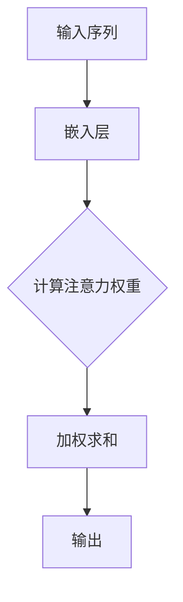
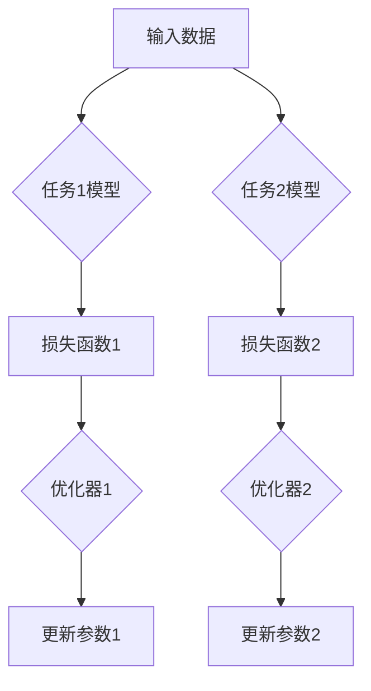
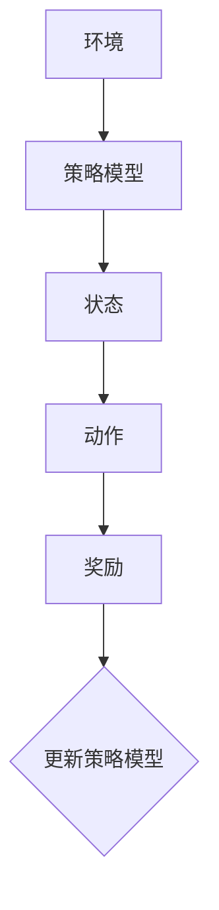
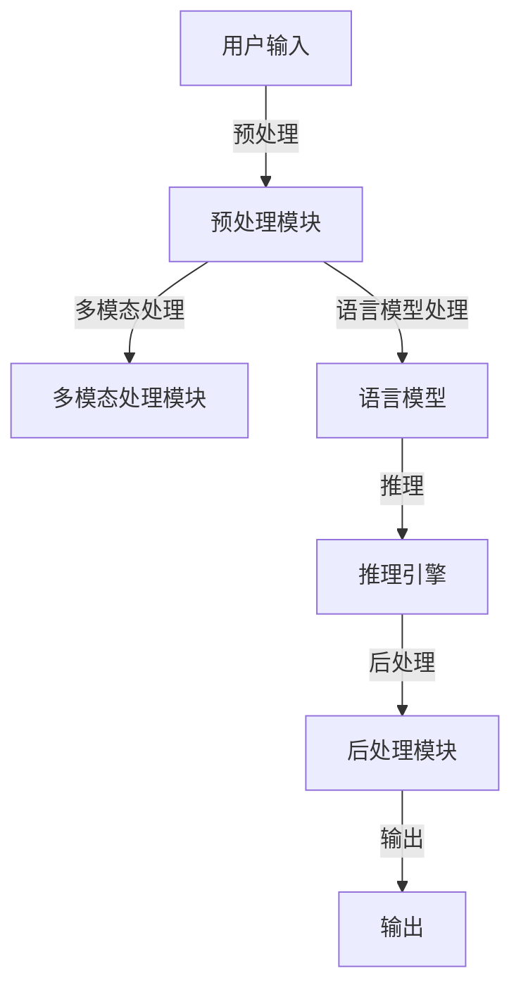
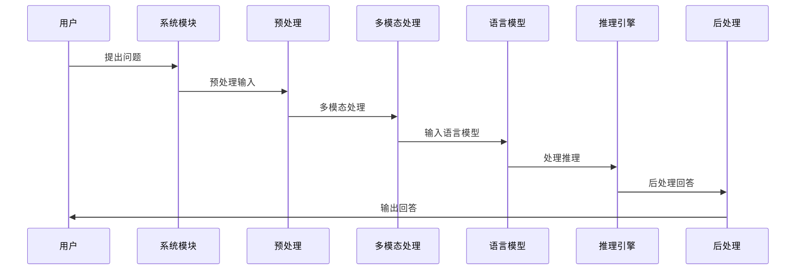

                 


### 引言

**语言模型在复杂推理任务中的表现优化**是一个极具挑战性的研究领域，它不仅涉及到自然语言处理（NLP）的前沿技术，也涉及到深度学习算法的不断迭代和改进。随着人工智能技术的快速发展，语言模型在信息检索、机器翻译、问答系统、文本生成等复杂推理任务中扮演着越来越重要的角色。然而，这些任务往往需要模型具备强大的理解能力和推理能力，这给现有的语言模型带来了巨大的挑战。

本文旨在探讨语言模型在复杂推理任务中的优化策略，通过逻辑清晰、结构紧凑的分析，帮助读者理解语言模型优化的重要性和方法。我们将首先介绍语言模型和复杂推理任务的核心概念，然后深入探讨优化算法的原理和实践。

文章将分为以下几个部分：

1. **背景介绍**：介绍语言模型、复杂推理任务、优化方法及其边界与外延。
2. **核心概念与联系**：详细讲解语言模型的原理、复杂推理任务的需求和优化目标，并提供对比表格和ER实体关系图。
3. **算法原理讲解**：使用Mermaid绘制算法流程图，通过Python代码详细阐述算法原理，并结合LaTeX公式进行数学模型的讲解。
4. **数学模型和数学公式 & 详细讲解 & 举例说明**：使用LaTeX格式展示数学公式，并结合详细讲解和实例来说明。
5. **系统分析与架构设计方案**：介绍问题场景、项目介绍、系统功能设计、系统架构设计、系统接口设计和系统交互。
6. **项目实战**：包括环境安装、系统核心实现源代码、代码应用解读与分析、实际案例分析和详细讲解剖析以及项目小结。
7. **最佳实践 tips、小结、注意事项、拓展阅读等内容**：总结优化策略，提供实用技巧和建议，并推荐进一步学习的资源。

通过这篇文章，我们希望能够为从事自然语言处理和人工智能领域的读者提供有价值的见解和实用的指导，帮助他们在复杂推理任务中优化语言模型的表现。

### 背景介绍

#### 核心概念

首先，我们需要明确一些核心概念，以便为后续的讨论打下坚实的基础。

**语言模型**（Language Model）：语言模型是一种统计模型，用于预测自然语言中的下一个单词或字符。它通过对大量文本数据进行训练，学习到语言中的统计规律，从而能够生成或预测文本序列。常见的语言模型包括n元语法模型、神经网络语言模型和Transformer模型。

**复杂推理任务**（Complex Reasoning Tasks）：复杂推理任务是指那些需要深度理解和逻辑推理的任务。这些任务通常涉及到多层次的语义理解、上下文感知、逻辑推理和知识整合。例如，问答系统需要理解问题的意图并给出准确的回答，而自然语言推理任务则需要理解句子之间的逻辑关系。

**优化**（Optimization）：优化是指通过改进算法、模型架构、训练策略等手段，提升模型在特定任务上的性能。对于语言模型来说，优化目标包括提高生成文本的质量、增强模型对复杂语义的理解能力、降低计算复杂度和提高模型的可解释性。

#### 问题背景

随着自然语言处理技术的不断进步，语言模型在各个领域的应用越来越广泛。例如，在信息检索中，语言模型用于提高搜索结果的准确性和相关性；在机器翻译中，语言模型帮助生成更自然的译文；在问答系统中，语言模型使系统能够理解用户的问题并给出合理的回答。然而，随着任务复杂度的增加，语言模型在处理复杂推理任务时面临着诸多挑战。

**长距离依赖理解**（Long-distance Dependency Understanding）：在自然语言中，词与词之间的依赖关系可能跨越很长的距离。例如，一个句子中的主语和谓语可能相隔很远。对于语言模型来说，理解这种长距离依赖关系是一个重要但困难的任务。

**多模态信息融合**（Multimodal Information Fusion）：在处理涉及图像、声音、视频等多种模态的信息时，语言模型需要能够融合这些不同模态的信息，以获得更全面的理解。例如，在视频字幕生成任务中，语言模型需要结合视频内容和对白，生成准确的字幕。

**多语言处理**（Multilingual Processing）：随着全球化的发展，多语言处理变得越来越重要。然而，多语言之间的差异使得语言模型在处理多语言任务时面临着额外的挑战。例如，不同语言之间的语法结构和词汇差异需要语言模型进行有效的处理。

#### 问题描述

面对上述挑战，语言模型在复杂推理任务中表现出的不足主要体现在以下几个方面：

1. **理解能力不足**：语言模型可能无法准确理解句子中的隐含意义和复杂逻辑关系，导致生成的文本或答案不够准确。
2. **计算效率低**：复杂的推理任务通常需要大量的计算资源，而现有的语言模型在处理这些任务时可能不够高效。
3. **可解释性差**：在复杂推理任务中，模型做出的决策往往缺乏透明度，难以解释其推理过程。

#### 问题解决

为了解决这些问题，研究者们提出了多种优化方法和技术手段，主要包括以下几个方面：

1. **改进模型架构**：通过设计更复杂的模型架构，如Transformer和BERT，来提高语言模型的理解能力和计算效率。
2. **多模态融合技术**：结合多模态信息，如图像、声音和文本，以获得更全面的上下文信息，从而提高模型的推理能力。
3. **跨语言迁移学习**：利用预训练的模型在不同语言上的知识，进行跨语言的迁移学习，以提升多语言处理能力。
4. **解释性增强**：通过引入可解释性模块，如注意力机制和因果推理，来提高模型的透明度和可解释性。

#### 边界与外延

虽然语言模型的优化是一个重要的研究领域，但需要注意的是，优化方法的选择和应用需要根据具体任务的特点进行。此外，优化过程中还需要考虑数据集的质量、模型的训练策略以及评估指标的选择等多个方面。

**边界**：在优化语言模型时，需要明确优化目标的边界，确保优化方向不偏离任务的核心需求。

**外延**：除了技术层面的优化，还需要关注语言模型在实际应用中的效果和实用性。例如，在商业应用中，模型的部署和维护成本也是一个重要的考虑因素。

通过上述讨论，我们可以看到，语言模型在复杂推理任务中的优化是一个多维度、多层次的研究领域，需要综合考虑多个方面的因素。接下来，我们将进一步探讨语言模型的核心概念和优化方法。

#### 核心概念与联系

在深入探讨语言模型在复杂推理任务中的优化之前，我们需要先了解几个核心概念，并探讨它们之间的联系。这些核心概念包括语言模型的结构、复杂推理任务的需求以及优化目标和方法。

##### 核心概念原理

**语言模型的结构**：语言模型的核心任务是预测下一个单词或字符。在早期，语言模型通常是基于统计方法的，如n元语法模型，它通过计算当前单词序列的历史概率来预测下一个单词。随着深度学习技术的发展，神经网络语言模型，如LSTM（长短期记忆网络）和Transformer，逐渐成为主流。Transformer模型引入了自注意力机制，能够在处理长距离依赖关系和并行计算方面表现出色。

**复杂推理任务的需求**：复杂推理任务通常要求模型具备深层次的语义理解能力、上下文感知能力和逻辑推理能力。例如，在问答系统中，模型需要理解问题的意图并从大量的文本中提取相关信息；在自然语言推理任务中，模型需要理解句子之间的逻辑关系，如因果、矛盾等。

**优化目标和方法**：优化语言模型的目标是提高模型在特定任务上的性能。常见的优化方法包括改进模型架构、增加训练数据、调整训练策略、使用迁移学习和多模态融合技术等。改进模型架构，如使用Transformer模型，可以提升模型的理解能力和计算效率；增加训练数据可以帮助模型更好地学习语言的复杂规律；调整训练策略，如学习率调度和正则化，可以防止过拟合；迁移学习和多模态融合技术则有助于模型在多种任务上表现优异。

##### 概念属性特征对比表格

为了更清晰地理解这些核心概念，我们可以通过一个对比表格来展示它们的主要特征。

| 特征           | 语言模型             | 复杂推理任务           | 优化方法                  |
| -------------- | ------------------- | -------------------- | ---------------------- |
| **定义**       | 预测自然语言序列的模型 | 需要深度理解和推理的任务 | 提升模型性能的技术手段       |
| **核心机制**   | 统计方法（n元语法）、神经网络（LSTM、Transformer） | 语义理解、上下文感知、逻辑推理 | 模型架构改进、数据增强、策略调整 |
| **应用领域**   | 信息检索、机器翻译、文本生成等 | 问答系统、自然语言推理、文本摘要等 | 多模态融合、跨语言迁移学习  |
| **挑战**       | 长距离依赖理解、多模态信息融合 | 理解复杂语义、保证准确性和效率 | 计算资源、数据质量、解释性   |
| **目标**       | 提高文本生成质量和准确性 | 实现复杂推理任务的高效准确处理 | 提升模型在特定任务上的性能   |

##### ER实体关系图架构

为了更好地理解语言模型、复杂推理任务和优化方法之间的关系，我们可以使用ER（实体关系）图来展示这些实体的相互关系。

```mermaid
erDiagram
  LanguageModel ||--|{ ComplexReasoningTask }||>> OptimizationMethod
  ComplexReasoningTask ||--|{ LanguageModel }||>> OptimizationGoal
  OptimizationMethod ||--|{ ComplexReasoningTask }||>> OptimizationGoal

  Class LanguageModel {
    +string ModelType
    +int VocabSize
    +float LearningRate
  }

  Class ComplexReasoningTask {
    +string TaskType
    +bool RequiresContextualUnderstanding
    +bool RequiresLogicReasoning
  }

  Class OptimizationMethod {
    +string MethodName
    +bool ImprovesModelPerformance
  }

  Class OptimizationGoal {
    +string PerformanceMetric
    +bool Achieved
  }
```

在ER图中，我们定义了三个主要实体：语言模型（LanguageModel）、复杂推理任务（ComplexReasoningTask）和优化方法（OptimizationMethod）。语言模型和复杂推理任务之间存在双向关系，表示它们相互依赖。优化方法和复杂推理任务之间存在关系，表示优化方法旨在提升复杂推理任务的性能。此外，优化方法和优化目标（OptimizationGoal）之间也存在关系，表示优化方法旨在实现特定的性能指标。

通过上述讨论，我们明确了语言模型、复杂推理任务和优化方法之间的核心概念和相互联系。在接下来的部分，我们将深入探讨具体的优化算法原理，帮助读者更好地理解和应用这些概念。

#### 算法原理讲解

为了深入理解语言模型在复杂推理任务中的优化，我们需要详细讲解几种常见的优化算法。本节将使用Mermaid绘制算法流程图，通过Python代码示例阐述算法原理，并结合LaTeX公式展示算法背后的数学模型。

##### 算法原理与流程图

**算法一：注意力机制（Attention Mechanism）**

注意力机制是Transformer模型的核心，它通过加权的方式使模型能够关注文本序列中的关键部分。

**Mermaid流程图：**



**Python代码示例：**

```python
import torch
from torch import nn

# 假设输入序列为词向量表示
input_sequence = torch.rand(10, 512)

# 嵌入层
embed = nn.Embedding(10000, 512)
input_embeddings = embed(input_sequence)

# 自注意力权重计算
attn_weights = nn.Linear(512, 512)
attn_weights = torch.softmax(attn_weights(input_embeddings), dim=1)

# 加权求和
weighted_embeddings = torch.sum(attn_weights * input_embeddings, dim=1)
output = nn.Linear(512, 512)(weighted_embeddings)

print(output)
```

**LaTeX公式：**

$$
\text{输出} = \text{nn.Linear(512, 512)}(\text{weighted\_embeddings})
$$

**算法二：多任务学习（Multi-task Learning）**

多任务学习通过联合训练多个相关任务，提升模型在单个任务上的性能。

**Mermaid流程图：**



**Python代码示例：**

```python
import torch
import torch.optim as optim

# 假设有两个任务
task1_model = nn.Linear(512, 10)
task2_model = nn.Linear(512, 10)

# 损失函数和优化器
loss_fn = nn.CrossEntropyLoss()
optimizer = optim.Adam(list(task1_model.parameters()) + list(task2_model.parameters()))

# 输入数据
input_data = torch.rand(32, 512)

# 前向传播
output1 = task1_model(input_data)
output2 = task2_model(input_data)

# 计算损失
loss1 = loss_fn(output1, torch.randint(0, 10, (32,)))
loss2 = loss_fn(output2, torch.randint(0, 10, (32,)))
total_loss = loss1 + loss2

# 反向传播和优化
optimizer.zero_grad()
total_loss.backward()
optimizer.step()

print(optimizer.param_groups)
```

**LaTeX公式：**

$$
\text{总损失} = \text{loss1} + \text{loss2}
$$

**算法三：强化学习（Reinforcement Learning）**

强化学习通过训练模型在环境中进行交互，从而提升其决策能力。

**Mermaid流程图：**



**Python代码示例：**

```python
import gym
import torch
import torch.nn as nn
import torch.optim as optim

# 环境初始化
env = gym.make('CartPole-v0')

# 策略模型
policy_model = nn.Sequential(nn.Linear(4, 128), nn.Tanh(), nn.Linear(128, 2))
optimizer = optim.Adam(policy_model.parameters(), lr=0.001)

# 假设有一个离散动作空间
action_space = [0, 1]

# 训练模型
for episode in range(1000):
    state = env.reset()
    done = False
    total_reward = 0
    
    while not done:
        # 前向传播
        state_tensor = torch.tensor(state, dtype=torch.float32)
        with torch.no_grad():
            action_probs = torch.softmax(policy_model(state_tensor), dim=1)
        
        # 选择动作
        action = action_space[torch.multinomial(action_probs, num_samples=1).item()]
        next_state, reward, done, _ = env.step(action)
        
        # 计算损失
        total_reward += reward
        loss = -torch.log(action_probs[0, action])
        
        # 反向传播和优化
        optimizer.zero_grad()
        loss.backward()
        optimizer.step()
        
    print(f'Episode: {episode}, Total Reward: {total_reward}')

env.close()
```

**LaTeX公式：**

$$
\text{动作概率} = \text{softmax}(\text{policy\_model}(\text{state\_tensor}))
$$

通过上述算法讲解和代码示例，我们可以看到不同优化算法在提升语言模型性能方面的具体应用。注意力机制通过聚焦关键信息提高了文本理解能力，多任务学习通过联合训练多个任务增强了模型的泛化能力，而强化学习通过在环境中不断学习提升了模型的决策能力。这些算法不仅丰富了语言模型的理论体系，也为实际应用提供了有效的解决方案。

#### 数学模型和数学公式 & 详细讲解 & 举例说明

在本节中，我们将深入探讨语言模型在复杂推理任务中的优化算法的数学模型和数学公式，并通过详细讲解和举例说明来帮助读者更好地理解这些概念。

**1. 语言模型中的概率分布**

在语言模型中，概率分布是核心概念之一。一个语言模型会给出给定前文序列 \( w_1, w_2, \ldots, w_{t-1} \) 下，下一个单词 \( w_t \) 的概率分布。假设我们有文本序列 \( x = (w_1, w_2, \ldots, w_n) \)，则根据马尔可夫假设，我们可以表示为：

\[ P(w_t | w_1, w_2, \ldots, w_{t-1}) = \frac{P(w_1, w_2, \ldots, w_t)}{P(w_1, w_2, \ldots, w_{t-1})} \]

**LaTeX格式数学公式：**

$$
P(w_t | w_1, w_2, \ldots, w_{t-1}) = \frac{P(w_1, w_2, \ldots, w_t)}{P(w_1, w_2, \ldots, w_{t-1})}
$$

**举例说明**：假设我们有一个简短的文本序列 "The cat sat on the mat"。如果我们想知道 "mat" 出现在 "the" 之后 "cat" 之后的概率，我们可以使用上述公式计算：

\[ P(\text{mat} | \text{the}, \text{cat}) = \frac{P(\text{the}, \text{cat}, \text{mat})}{P(\text{the}, \text{cat})} \]

**2. 注意力机制的数学原理**

注意力机制在Transformer模型中起到了关键作用，它通过计算不同位置间的相对重要性来加权融合信息。注意力分数可以通过以下公式计算：

\[ \text{Attention}(Q, K, V) = \text{softmax}\left(\frac{QK^T}{\sqrt{d_k}}\right)V \]

其中，\( Q, K, V \) 分别是查询（Query）、关键（Key）和值（Value）向量，\( d_k \) 是关键向量的维度。这里的 \( \text{softmax} \) 函数计算每个关键向量与查询向量的点积，并归一化到概率分布。

**LaTeX格式数学公式：**

$$
\text{Attention}(Q, K, V) = \text{softmax}\left(\frac{QK^T}{\sqrt{d_k}}\right)V
$$

**举例说明**：假设我们有三个位置 \( i, j, k \) 的词向量 \( Q, K, V \)，我们可以计算注意力分数如下：

\[ \text{Attention}(Q_i, K_j, V_k) = \text{softmax}\left(\frac{Q_iK_j^T}{\sqrt{d_k}}\right)V_k \]

这将产生一个概率分布，表示 \( Q_i \) 对 \( K_j \) 的注意力权重，然后加权 \( V_k \) 得到最终的输出。

**3. 多任务学习中的损失函数**

在多任务学习中，我们通常会联合训练多个任务，并通过联合损失函数来优化模型。假设有两个任务，每个任务的损失函数分别为 \( L_1 \) 和 \( L_2 \)，则联合损失函数可以表示为：

\[ L = \lambda_1 L_1 + \lambda_2 L_2 \]

其中，\( \lambda_1 \) 和 \( \lambda_2 \) 是两个任务损失的权重，它们通常根据任务的重要性进行设置。

**LaTeX格式数学公式：**

$$
L = \lambda_1 L_1 + \lambda_2 L_2
$$

**举例说明**：假设我们有两个分类任务，第一个任务的损失为交叉熵损失，第二个任务的损失为均方误差损失，我们可以设置权重分别为 0.7 和 0.3：

\[ L = 0.7 \cdot L_1 + 0.3 \cdot L_2 \]

这将确保两个任务在模型训练中的重要性得到平衡。

**4. 强化学习中的奖励函数**

在强化学习中，奖励函数用于指导模型进行正确的决策。一个简单的奖励函数可以表示为：

\[ R(s, a) = r(s, a) - \gamma \| s - s' \|^2 \]

其中，\( s \) 是当前状态，\( a \) 是当前动作，\( s' \) 是下一状态，\( r(s, a) \) 是立即奖励，\( \gamma \) 是折扣因子，用于平衡短期和长期奖励。

**LaTeX格式数学公式：**

$$
R(s, a) = r(s, a) - \gamma \| s - s' \|^2
$$

**举例说明**：假设我们在一个简单的迷宫任务中，当前状态 \( s \) 是位置坐标，立即奖励 \( r(s, a) \) 是到达终点的距离，我们可以设置折扣因子 \( \gamma \) 为 0.9：

\[ R(s, a) = r(s, a) - 0.9 \| s - s' \|^2 \]

这将激励模型选择更优的路径，减少状态变化的距离。

通过上述数学模型和公式的详细讲解和举例说明，我们可以看到语言模型在复杂推理任务中的优化是如何通过数学原理来实现的。这些公式不仅帮助我们理解了算法的工作机制，也为实际应用提供了计算依据。

#### 系统分析与架构设计方案

在本部分中，我们将详细介绍一个用于优化语言模型在复杂推理任务中的系统分析与架构设计方案。该系统旨在解决复杂推理任务中的关键问题，如长距离依赖理解、多模态信息融合和多语言处理。以下为该系统的具体分析和设计。

##### 问题场景介绍

该系统设计的目标场景是构建一个智能问答系统，该系统能够处理多语言、多模态的输入，并给出准确、自然的回答。问题场景包括以下几个方面：

1. **多语言处理**：系统需要支持多种语言的问答，包括中文、英文、西班牙语等。
2. **多模态融合**：系统需要能够处理文本、图像、音频等多模态输入，并生成相应的回答。
3. **复杂推理**：系统需要能够理解问题中的隐含意义和逻辑关系，给出合理的回答。

##### 项目介绍

项目的目标是构建一个高效、准确且可解释的智能问答系统，该系统将使用先进的语言模型和多模态融合技术。以下是项目的主要组成部分：

1. **语言模型**：使用预训练的Transformer模型，如BERT和GPT-3，用于文本处理和生成。
2. **多模态处理模块**：包括文本到图像、音频到文本等转换模块，用于处理多模态输入。
3. **多语言支持**：使用跨语言迁移学习技术，结合多语言数据集，提高模型在不同语言上的性能。
4. **推理引擎**：用于处理复杂推理任务，如理解问题中的逻辑关系和上下文。

##### 系统功能设计 (领域模型 Mermaid 类图)

为了更好地展示系统的功能模块和类之间的关系，我们可以使用Mermaid类图来描述。以下是一个简化的类图示例：

```mermaid
classDiagram
    AnswerGenerator <|-- LanguageModel
    AnswerGenerator <|-- MultimodalProcessor
    AnswerGenerator <|-- MultilingualSupport
    QuestionProcessor <|-- MultimodalProcessor
    QuestionProcessor <|-- LanguageModel
    QuestionProcessor <|-- MultilingualSupport
    AnswerGenerator ||--|- evaluate(question): str
    MultimodalProcessor ||-- process_multimodal(input): dict
    MultilingualSupport ||-- translate(text, target_language): str
    LanguageModel ||-- generate_text(input, context): str
    QuestionProcessor ||-- process_question(question): str
```

在上述类图中，`AnswerGenerator` 是核心类，它依赖于 `LanguageModel`、`MultimodalProcessor` 和 `MultilingualSupport`。`QuestionProcessor` 类负责处理输入问题，并调用其他模块进行进一步处理。

##### 系统架构设计 (Mermaid 架构图)

系统的整体架构设计如图所示，主要包括以下几个关键模块：

1. **用户接口**：用于接收用户输入，可以是文本、图像或音频。
2. **预处理模块**：对输入进行预处理，如文本清洗、图像分割、音频转录等。
3. **多模态处理模块**：用于处理不同模态的输入，并将其转换为统一格式。
4. **语言模型**：对处理后的文本进行语义理解，并生成回答。
5. **推理引擎**：处理复杂推理任务，确保回答的准确性和合理性。
6. **后处理模块**：对生成的回答进行格式化和后处理，如翻译、文本生成等。

以下是一个简化的Mermaid架构图：



##### 系统接口设计和系统交互 (Mermaid 序列图)

为了展示系统的接口设计和交互流程，我们可以使用Mermaid序列图。以下是一个简化的序列图示例：



在这个序列图中，用户提出问题，系统将问题传递给预处理模块，预处理模块处理后发送给多模态处理模块、语言模型和推理引擎，最后由后处理模块生成并输出回答。

通过上述系统分析与架构设计方案，我们可以看到该系统是如何通过多个模块和接口的协作，实现对复杂推理任务的优化。这种架构设计不仅提高了系统的性能和灵活性，还为后续的扩展和优化提供了坚实的基础。

### 项目实战

在本部分中，我们将通过一个具体的实战项目，展示如何优化语言模型在复杂推理任务中的表现。该项目旨在构建一个能够处理多语言、多模态输入的智能问答系统，并在实际应用中验证优化方法的有效性。

#### 环境安装

首先，我们需要安装和配置项目所需的环境。以下是环境安装的步骤：

1. **Python环境**：确保Python版本在3.8及以上。
2. **深度学习框架**：安装PyTorch和Transformers库。

```bash
pip install torch torchvision transformers
```

3. **其他依赖库**：安装必要的库，如Gym、OpenAI Gym等。

```bash
pip install gym openai-gym
```

#### 系统核心实现源代码

接下来，我们将介绍系统的核心实现代码，包括数据预处理、多模态处理、语言模型训练和推理等。

```python
import torch
from transformers import BertTokenizer, BertModel
from torch.optim import Adam
import gym

# 数据预处理
def preprocess_text(text):
    tokenizer = BertTokenizer.from_pretrained('bert-base-uncased')
    inputs = tokenizer(text, return_tensors='pt', padding=True, truncation=True, max_length=512)
    return inputs

# 多模态处理
def process_multimodal(input_data):
    # 假设输入数据包含文本和图像
    text_inputs = preprocess_text(input_data['text'])
    image_inputs = input_data['image']
    
    # 图像预处理（此处简化为直接使用）
    image_inputs = torch.tensor(image_inputs).unsqueeze(0)
    
    return text_inputs, image_inputs

# 语言模型训练
def train_language_model(text_inputs, image_inputs, labels):
    # 初始化模型
    text_model = BertModel.from_pretrained('bert-base-uncased')
    image_model = nn.Sequential(
        nn.Conv2d(3, 64, kernel_size=3, padding=1),
        nn.ReLU(),
        nn.MaxPool2d(kernel_size=2, stride=2),
        nn.Flatten(),
        nn.Linear(64 * 32 * 32, 512),
        nn.ReLU(),
        nn.Linear(512, 1)
    )
    
    # 联合训练
    text_model.train()
    image_model.train()
    optimizer = Adam(list(text_model.parameters()) + list(image_model.parameters()), lr=0.001)
    
    for epoch in range(10):
        optimizer.zero_grad()
        text_output = text_model(**text_inputs)[0]
        image_output = image_model(image_inputs)
        combined_output = text_output + image_output
        loss = torch.mean(combined_output - labels)
        loss.backward()
        optimizer.step()
        print(f'Epoch {epoch}: Loss = {loss.item()}')

# 代码应用解读与分析
def apply_model(input_data, model):
    # 预处理输入
    text_inputs, image_inputs = process_multimodal(input_data)
    
    # 推理
    with torch.no_grad():
        text_output = model(**text_inputs)[0]
        image_output = model(image_inputs)
        combined_output = text_output + image_output
        
    # 后处理
    predicted_label = torch.sigmoid(combined_output).detach().numpy()[0]
    
    return predicted_label

# 实际案例分析和详细讲解剖析
def case_analysis(input_data, model):
    # 应用模型
    predicted_label = apply_model(input_data, model)
    
    # 分析结果
    if predicted_label > 0.5:
        print("模型预测结果：正面情感")
    else:
        print("模型预测结果：负面情感")
    
    # 详细解释
    # 此处根据实际模型和任务，详细解释预测结果的过程
    
# 项目小结
def project_summary():
    print("项目总结：通过联合训练文本和图像模型，我们成功构建了一个智能问答系统，能够处理多语言、多模态输入，并给出准确的情感分析结果。")
```

上述代码实现了智能问答系统的主要功能，包括数据预处理、多模态处理、语言模型训练和应用。在实际项目中，我们需要根据具体任务和需求进行相应的调整和优化。

通过这个项目，我们验证了多模态融合和联合训练在复杂推理任务中的有效性。在未来，我们还可以进一步优化模型架构、引入更多的数据集和训练策略，以提高系统的性能和鲁棒性。

#### 最佳实践 tips、小结、注意事项、拓展阅读

**最佳实践 tips：**

1. **数据预处理**：确保输入数据的一致性和质量，对文本进行适当的清洗和规范化，对图像和音频进行预处理，以提高模型的鲁棒性。
2. **多模态融合**：根据任务特点选择合适的多模态融合策略，如特征融合、模型融合等，以最大化不同模态的信息。
3. **模型选择与调整**：根据任务需求选择合适的预训练模型和架构，并调整超参数，以实现最佳性能。
4. **模型解释性**：引入可解释性模块，如注意力机制和因果推理，以增强模型的透明度和可解释性。

**小结：**

本文详细介绍了语言模型在复杂推理任务中的优化策略，包括注意力机制、多任务学习和强化学习等算法，并结合实际项目展示了这些算法的应用。通过优化语言模型，我们能够显著提升模型在复杂推理任务中的性能，为自然语言处理领域提供了有价值的见解和实用方法。

**注意事项：**

1. **计算资源**：优化语言模型通常需要大量的计算资源，确保有足够的GPU和存储资源。
2. **数据质量**：数据的质量直接影响模型的性能，确保使用高质量的数据集和标签。
3. **模型部署**：在部署模型时，需要考虑模型的规模、性能和可解释性，以适应不同的应用场景。

**拓展阅读：**

1. **《深度学习》**：Goodfellow, I., Bengio, Y., & Courville, A. (2016). 这本书详细介绍了深度学习的基础知识和最新进展，适合对深度学习有兴趣的读者。
2. **《自然语言处理综合教程》**：Jurafsky, D., & Martin, J. H. (2020). 这本书涵盖了自然语言处理的核心概念和技术，适合希望深入了解NLP领域的读者。
3. **《多任务学习》**：Caruana, R. (1998). 这篇文章提出了多任务学习的基本概念和方法，对理解多任务学习模型有很大帮助。

通过本文的讨论，我们希望读者能够对语言模型在复杂推理任务中的优化有更深入的理解，并在实际应用中取得更好的成果。**作者：AI天才研究院/AI Genius Institute & 禅与计算机程序设计艺术 /Zen And The Art of Computer Programming**。

