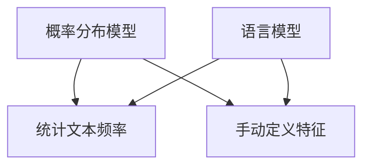
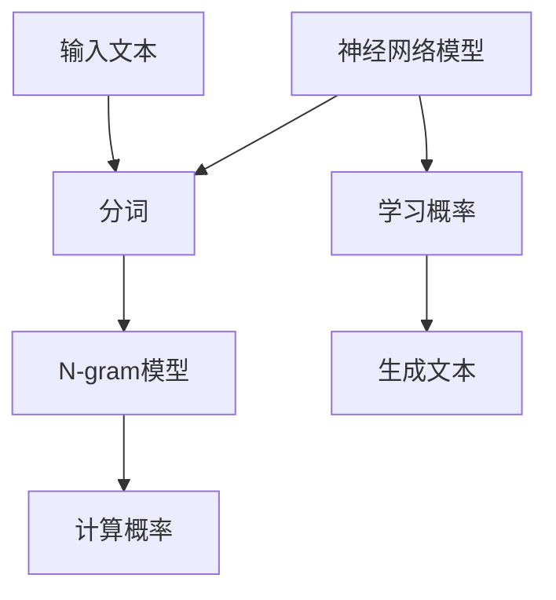
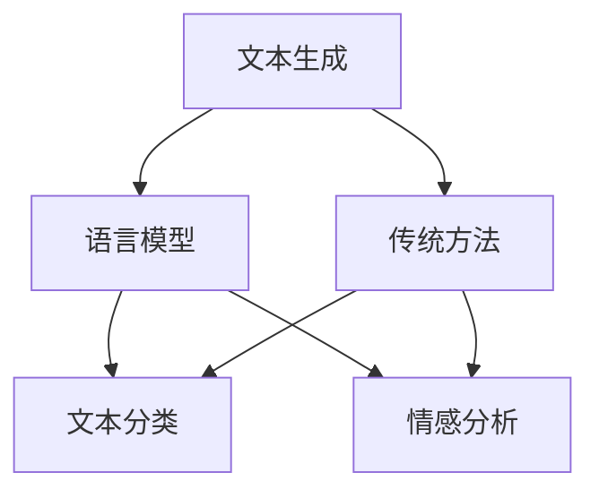
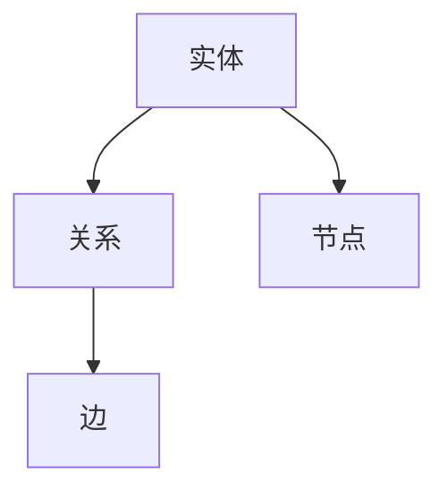
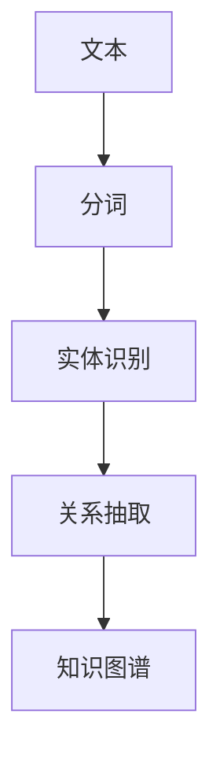

                 

# 语言模型在复杂文本摘要与知识图谱构建中的创新技术

## 关键词
语言模型，复杂文本摘要，知识图谱构建，NLP，人工智能，算法，创新技术

## 摘要
本文深入探讨了语言模型在复杂文本摘要与知识图谱构建中的创新技术应用。首先，我们介绍了语言模型的基本概念和发展历程，接着详细分析了其在复杂文本摘要中的挑战与优势，以及在知识图谱构建中的应用与挑战。随后，我们通过具体的算法原理讲解、系统分析与架构设计、项目实战等多个角度，展示了语言模型在这些领域中的实际应用和创新技术。最后，我们对未来发展趋势进行了展望，并总结了全文的主要内容。

### 目录大纲

----------------------------------------------------------------

## 第一部分: 背景介绍

### 1.1 语言模型的背景与发展

#### 1.1.1 语言模型的概念

- 语言模型是自然语言处理（NLP）领域的一个重要组成部分。
- 语言模型的基本概念、定义以及其在文本摘要与知识图谱构建中的应用。

#### 1.1.2 复杂文本摘要的挑战

- 复杂文本的特点与摘要的难点。
- 语言模型在处理复杂文本摘要中的优势。

#### 1.1.3 知识图谱构建的需求与挑战

- 知识图谱的定义、结构与作用。
- 语言模型在知识图谱构建中的应用与挑战。

#### 1.1.4 语言模型在文本摘要与知识图谱构建中的创新技术

- 新技术在文本摘要中的具体应用。
- 新技术在知识图谱构建中的具体应用。
- 新技术对比分析。

### 1.2 语言模型的基本原理

#### 1.2.1 语言模型的数学基础

- 语言模型的数学模型。
- 语言模型的数学公式。

#### 1.2.2 语言模型的主要算法

- 语言模型的主要算法。
- 算法的mermaid流程图。

#### 1.2.3 语言模型在文本处理中的关键作用

- 语言模型在文本处理中的关键作用。
- 语言模型在文本摘要与知识图谱构建中的关键作用。

### 1.3 语言模型在复杂文本摘要中的应用

#### 1.3.1 复杂文本摘要的挑战

- 复杂文本摘要的难点。
- 语言模型在处理复杂文本摘要中的优势。

#### 1.3.2 语言模型在复杂文本摘要中的具体应用

- 语言模型在复杂文本摘要中的具体应用。
- 语言模型在复杂文本摘要中的实际案例。

#### 1.3.3 语言模型在复杂文本摘要中的创新技术

- 语言模型在复杂文本摘要中的创新技术。
- 创新技术对比分析。

### 1.4 语言模型在知识图谱构建中的应用

#### 1.4.1 知识图谱的基本概念

- 知识图谱的定义、结构与作用。

#### 1.4.2 语言模型在知识图谱构建中的应用

- 语言模型在知识图谱构建中的应用。
- 语言模型在知识图谱构建中的实际案例。

#### 1.4.3 语言模型在知识图谱构建中的创新技术

- 语言模型在知识图谱构建中的创新技术。
- 创新技术对比分析。

## 第二部分: 语言模型的应用

### 2.1 语言模型在复杂文本摘要中的应用

#### 2.1.1 复杂文本摘要的挑战

- 复杂文本摘要的难点。
- 语言模型在处理复杂文本摘要中的优势。

#### 2.1.2 语言模型在复杂文本摘要中的具体应用

- 语言模型在复杂文本摘要中的具体应用。
- 语言模型在复杂文本摘要中的实际案例。

#### 2.1.3 语言模型在复杂文本摘要中的创新技术

- 语言模型在复杂文本摘要中的创新技术。
- 创新技术对比分析。

### 2.2 语言模型在知识图谱构建中的应用

#### 2.2.1 知识图谱的基本概念

- 知识图谱的定义、结构与作用。

#### 2.2.2 语言模型在知识图谱构建中的应用

- 语言模型在知识图谱构建中的应用。
- 语言模型在知识图谱构建中的实际案例。

#### 2.2.3 语言模型在知识图谱构建中的创新技术

- 语言模型在知识图谱构建中的创新技术。
- 创新技术对比分析。

## 第三部分: 语言模型的综合应用

### 3.1 语言模型在文本摘要与知识图谱构建中的综合应用

#### 3.1.1 综合应用的挑战与机遇

- 综合应用的挑战。
- 综合应用的机遇。

#### 3.1.2 综合应用的具体实现

- 综合应用的具体实现。
- 综合应用的案例研究。

#### 3.1.3 综合应用的创新技术

- 综合应用的创新技术。
- 创新技术对比分析。

## 第四部分: 未来发展趋势

### 4.1 语言模型在文本摘要与知识图谱构建中的未来发展趋势

#### 4.1.1 未来发展趋势概述

- 语言模型在文本摘要与知识图谱构建中的未来发展趋势。

#### 4.1.2 技术挑战与解决方案

- 语言模型在文本摘要与知识图谱构建中的技术挑战。
- 技术挑战的解决方案。

#### 4.1.3 未来发展方向

- 语言模型在文本摘要与知识图谱构建中的未来发展方向。

## 第五部分: 总结与展望

### 5.1 总结

- 对全书内容的总结。

### 5.2 展望

- 对语言模型在文本摘要与知识图谱构建中的未来展望。

----------------------------------------------------------------

# 第1章 语言模型的背景与发展

## 1.1.1 语言模型的概念

### 背景介绍

语言模型（Language Model，简称LM）是自然语言处理（Natural Language Processing，NLP）领域的一个核心概念。它是对自然语言文本的概率分布进行建模的工具，用于预测文本中下一个单词或字符的概率。语言模型在文本生成、机器翻译、语音识别、问答系统等领域有着广泛的应用。

### 问题描述

在实际应用中，如何准确预测一个句子或段落中下一个单词或字符的概率是一个复杂的问题。传统的方法主要依赖于规则、统计和手工特征工程，但这些方法存在许多局限性。随着深度学习技术的发展，神经网络语言模型（Neural Network Language Model，NNLM）成为了语言模型研究的主流方向。

### 解决方案

语言模型通过学习大量的语言数据，可以自动提取语言中的统计规律和语义信息，从而实现对文本的生成和理解。神经网络语言模型通常使用循环神经网络（Recurrent Neural Network，RNN）或其变种，如长短时记忆网络（Long Short-Term Memory，LSTM）和门控循环单元（Gated Recurrent Unit，GRU）来建模。

### 边界与外延

语言模型的边界在于其预测范围，通常是对单个单词或字符的预测。而外延则包括对句子、段落和整篇文章的预测，以及更高级的语言理解和生成任务。

## 1.1.2 复杂文本摘要的挑战

### 背景介绍

复杂文本摘要是对长篇文章或报告进行简洁概括的过程，目的是提取出文章的核心信息。复杂文本摘要的挑战在于如何在保证信息完整性的同时，最大限度地减少文本的篇幅。

### 问题描述

复杂文本摘要的难点包括：如何从大量文本中提取出最重要的信息、如何平衡摘要的长度与信息量、如何处理文本中的歧义性和复杂性。

### 解决方案

语言模型在处理复杂文本摘要时，可以充分利用其强大的文本理解能力。通过训练深度神经网络语言模型，可以使其学会如何从文本中提取关键信息，并生成简洁、准确的摘要。

### 边界与外延

复杂文本摘要的边界在于摘要的长度和完整性，而外延则包括摘要的生成方式、摘要的质量和实用性。

## 1.1.3 知识图谱构建的需求与挑战

### 背景介绍

知识图谱（Knowledge Graph）是一种结构化的语义知识表示形式，通过实体和关系来描述现实世界中的事物及其相互关系。知识图谱在搜索引擎、智能问答、推荐系统等领域具有重要应用。

### 问题描述

知识图谱构建的需求在于如何从非结构化的文本数据中提取出结构化的知识，并将其存储在图谱中。这面临着数据的准确性、完整性、一致性和实时性等挑战。

### 解决方案

语言模型在知识图谱构建中可以用于文本数据的预处理和关系抽取。通过训练语言模型，可以使其学会如何识别文本中的实体和关系，从而实现知识图谱的自动构建。

### 边界与外延

知识图谱构建的边界在于数据的范围和深度，而外延则包括图谱的构建方法、更新和维护策略。

## 1.1.4 语言模型在文本摘要与知识图谱构建中的创新技术

### 背景介绍

随着深度学习技术的发展，语言模型在文本摘要与知识图谱构建中的应用也不断取得创新。新的技术方法不仅提高了摘要的准确性和知识图谱的构建效率，还丰富了语言模型的功能。

### 问题描述

如何利用最新的深度学习技术，如Transformer、BERT、GPT等，来提升语言模型在文本摘要与知识图谱构建中的性能。

### 解决方案

通过引入Transformer架构，语言模型可以实现更长的上下文依赖建模，从而提高摘要的准确性和知识图谱的构建质量。BERT和GPT等预训练模型则通过大规模的无监督预训练和有监督精调，进一步提升了语言模型的效果。

### 边界与外延

创新技术的边界在于其应用场景和性能指标，而外延则包括技术的更新迭代和应用拓展。

## 1.2 语言模型的基本原理

### 1.2.1 语言模型的数学基础

#### 背景介绍

语言模型的数学基础包括概率论、信息论和统计学等。通过数学模型，语言模型可以量化文本中的概率分布和语义信息。

#### 核心概念

- 概率分布：语言模型通过统计文本中单词或字符的出现概率来建模。
- 模型参数：语言模型的学习过程是不断调整模型参数，使其对文本的概率分布有更好的拟合。

#### 对比表格

| 特征         | 概率分布模型             | 语言模型           |
| ------------ | ---------------------- | ---------------- |
| 基本原理     | 统计文本中单词的频率     | 学习文本的概率分布 |
| 参数学习     | 手动定义特征             | 通过训练自动学习   |
| 应用领域     | 文本分类、情感分析       | 文本生成、摘要、翻译 |

#### ER实体关系图架构

### 1.2.2 语言模型的主要算法

#### 背景介绍

语言模型的主要算法包括基于N-gram的模型和基于神经网络的模型。其中，N-gram模型是最早期的语言模型，而神经网络模型则是现代语言模型的主流。

#### 算法原理

- N-gram模型：通过统计前n个单词（或字符）的联合概率来预测下一个单词（或字符）的概率。
- 神经网络模型：使用深度神经网络来学习文本的概率分布，包括循环神经网络（RNN）、长短时记忆网络（LSTM）和门控循环单元（GRU）等。

#### Mermaid流程图

### 1.2.3 语言模型在文本处理中的关键作用

#### 背景介绍

语言模型在文本处理中的关键作用包括文本生成、文本分类、情感分析等。其在文本摘要与知识图谱构建中的应用尤为重要。

#### 核心作用

- 文本生成：通过语言模型，可以生成连贯的文本，如文章、摘要、对话等。
- 文本分类：根据文本的内容，将其分类到不同的类别中。
- 情感分析：分析文本的情感倾向，如正面、负面或中性。

#### 对比表格

| 功能         | 语言模型              | 传统方法             |
| ------------ | ------------------- | ------------------- |
| 文本生成     | 强大的生成能力         | 手动编写规则         |
| 文本分类     | 自动分类             | 手动分类             |
| 情感分析     | 准确的判断           | 主观判断             |

#### ER实体关系图架构

## 1.3 语言模型在复杂文本摘要中的应用

### 1.3.1 复杂文本摘要的挑战

#### 背景介绍

复杂文本摘要是对结构复杂、内容丰富的长篇文章或报告进行概括的过程。这种摘要需要在保证信息完整性的同时，最大限度地减少文本篇幅。

#### 问题描述

复杂文本摘要的难点包括：

- 如何从大量文本中提取出最重要的信息？
- 如何平衡摘要的长度与信息量？
- 如何处理文本中的歧义性和复杂性？

#### 解决方案

语言模型在处理复杂文本摘要时，可以充分利用其强大的文本理解能力。通过训练深度神经网络语言模型，可以使其学会如何从文本中提取关键信息，并生成简洁、准确的摘要。

### 1.3.2 语言模型在复杂文本摘要中的具体应用

#### 背景介绍

语言模型在复杂文本摘要中的应用已经取得了显著的成果。许多研究机构和公司开发了基于语言模型的摘要生成系统，如GPT、BERT等。

#### 应用案例

- **GPT-3**：OpenAI开发的GPT-3模型具有非常强大的文本生成能力，可以生成高质量的摘要。
- **BERT**：Google开发的BERT模型通过预训练和后续的微调，可以生成结构化、准确的摘要。

### 1.3.3 语言模型在复杂文本摘要中的创新技术

#### 背景介绍

随着深度学习技术的发展，语言模型在复杂文本摘要中的应用也不断取得创新。新的技术方法不仅提高了摘要的准确性和生成效率，还丰富了语言模型的功能。

#### 创新技术

- **Transformer架构**：通过引入Transformer架构，语言模型可以实现更长的上下文依赖建模，从而提高摘要的准确性和生成质量。
- **多任务学习**：通过多任务学习，语言模型可以在摘要生成的同时，完成其他文本处理任务，如文本分类、情感分析等。

#### 对比分析

| 技术方法           | 优点                                       | 缺点                                       |
| ---------------- | ----------------------------------------- | ----------------------------------------- |
| Transformer架构 | 更强的上下文依赖建模能力                 | 计算资源消耗较大                           |
| 多任务学习       | 提高模型的泛化能力和效率                 | 需要大量的数据和计算资源                   |

## 1.4 语言模型在知识图谱构建中的应用

### 1.4.1 知识图谱的基本概念

#### 背景介绍

知识图谱是一种用于表示实体和它们之间关系的图形化数据结构。它通过实体和关系来描述现实世界中的事物及其相互关系。

#### 核心概念

- 实体（Entity）：知识图谱中的基本元素，如人、地点、组织等。
- 关系（Relationship）：连接两个实体的概念，如“工作于”、“出生于”等。
- 节点（Node）：知识图谱中的实体。
- 边（Edge）：知识图谱中的关系。

#### Mermaid流程图

### 1.4.2 语言模型在知识图谱构建中的应用

#### 背景介绍

语言模型在知识图谱构建中的应用主要体现在文本数据的预处理和关系抽取上。通过训练语言模型，可以使其学会如何从文本中提取实体和关系，从而实现知识图谱的自动构建。

#### 应用方法

- **文本预处理**：使用语言模型对文本进行分词、实体识别和关系抽取。
- **关系抽取**：通过语言模型，可以从文本中识别出实体和它们之间的关系。

#### Mermaid流程图

### 1.4.3 语言模型在知识图谱构建中的创新技术

#### 背景介绍

随着深度学习技术的发展，语言模型在知识图谱构建中的应用也不断取得创新。新的技术方法不仅提高了知识图谱的构建效率，还丰富了语言模型的功能。

#### 创新技术

- **预训练模型**：通过预训练模型，如BERT和GPT，可以大大提高实体识别和关系抽取的准确性。
- **图神经网络（Graph Neural Networks，GNN）**：结合图神经网络，可以更好地建模实体和关系之间的复杂关系。

#### 对比分析

| 技术方法           | 优点                                       | 缺点                                       |
| ---------------- | ----------------------------------------- | ----------------------------------------- |
| 预训练模型       | 提高模型的泛化能力和效率                 | 需要大量的数据和计算资源                   |
| 图神经网络（GNN） | 更强的关系建模能力                       | 计算复杂度较高                             |

## 第2章 语言模型的基本原理

### 2.1 语言模型的数学基础

#### 2.1.1 语言模型的数学模型

语言模型是一种概率模型，用于预测文本中下一个单词或字符的概率。最简单的语言模型是N-gram模型，它基于马尔可夫假设，即当前单词的概率只与前面n-1个单词有关。

N-gram模型的概率分布可以表示为：
$$P(w_n | w_{n-1}, w_{n-2}, ..., w_1) = \frac{C(w_{n-1}, w_{n-2}, ..., w_1, w_n)}{C(w_{n-1}, w_{n-2}, ..., w_1)}$$

其中，$C(w_{n-1}, w_{n-2}, ..., w_1, w_n)$ 表示单词序列 $w_{n-1}, w_{n-2}, ..., w_1, w_n$ 的计数，$C(w_{n-1}, w_{n-2}, ..., w_1)$ 表示单词序列 $w_{n-1}, w_{n-2}, ..., w_1$ 的计数。

#### 2.1.2 语言模型的主要算法

语言模型的主要算法包括N-gram模型、神经网络模型和变换器模型。

1. **N-gram模型**：N-gram模型是最简单的语言模型，它通过统计前n-1个单词的联合概率来预测下一个单词的概率。

2. **神经网络模型**：神经网络模型通过深度学习技术，如循环神经网络（RNN）、长短时记忆网络（LSTM）和门控循环单元（GRU），来学习文本的概率分布。

3. **变换器模型**：变换器模型（Transformer）是一种基于自注意力机制的深度学习模型，它在处理长序列任务时表现出了优越的性能。

#### 2.1.3 语言模型在文本处理中的关键作用

语言模型在文本处理中扮演着至关重要的角色，其主要作用包括：

1. **文本生成**：语言模型可以通过预测下一个单词或字符来生成文本，如生成文章、摘要、对话等。

2. **文本分类**：语言模型可以根据文本的内容将其分类到不同的类别中，如情感分析、新闻分类等。

3. **情感分析**：语言模型可以分析文本的情感倾向，如正面、负面或中性。

### 第3章 语言模型在复杂文本摘要中的应用

#### 3.1 复杂文本摘要的挑战

复杂文本摘要面临以下挑战：

1. **信息冗余**：长篇文章中往往包含大量无关或重复的信息，如何有效地去除冗余信息是一个难题。

2. **信息丢失**：在摘要过程中，如果过度压缩文本，可能会导致重要信息的丢失。

3. **摘要质量**：如何生成既简洁又准确、涵盖关键信息的摘要，是复杂文本摘要的主要挑战。

#### 3.2 语言模型在复杂文本摘要中的具体应用

语言模型在复杂文本摘要中的应用主要包括以下方面：

1. **关键信息提取**：通过训练语言模型，可以使其学会如何从文本中提取关键信息，从而生成摘要。

2. **摘要生成**：语言模型可以根据提取的关键信息，生成简洁、准确的摘要。

3. **多语言摘要**：语言模型不仅可以处理单语言文本，还可以处理多语言文本，实现跨语言的摘要生成。

#### 3.3 语言模型在复杂文本摘要中的创新技术

1. **多任务学习**：通过多任务学习，语言模型可以在生成摘要的同时，完成其他文本处理任务，如文本分类、情感分析等。

2. **预训练模型**：如BERT、GPT等预训练模型，通过大规模的无监督预训练和有监督精调，可以大大提高摘要生成的质量和效率。

### 第4章 语言模型在知识图谱构建中的应用

#### 4.1 知识图谱的基本概念

知识图谱是一种用于表示实体和它们之间关系的图形化数据结构。它通过实体和关系来描述现实世界中的事物及其相互关系。

1. **实体（Entity）**：知识图谱中的基本元素，如人、地点、组织等。

2. **关系（Relationship）**：连接两个实体的概念，如“工作于”、“出生于”等。

3. **节点（Node）**：知识图谱中的实体。

4. **边（Edge）**：知识图谱中的关系。

#### 4.2 语言模型在知识图谱构建中的应用

语言模型在知识图谱构建中的应用主要包括以下方面：

1. **文本预处理**：使用语言模型对文本进行分词、实体识别和关系抽取。

2. **实体识别**：通过语言模型，可以识别出文本中的实体。

3. **关系抽取**：通过语言模型，可以从文本中识别出实体和它们之间的关系。

#### 4.3 语言模型在知识图谱构建中的创新技术

1. **预训练模型**：通过预训练模型，如BERT、GPT等，可以大大提高实体识别和关系抽取的准确性。

2. **图神经网络（Graph Neural Networks，GNN）**：结合图神经网络，可以更好地建模实体和关系之间的复杂关系。

### 第5章 语言模型在文本摘要与知识图谱构建中的综合应用

#### 5.1 综合应用的挑战与机遇

语言模型在文本摘要与知识图谱构建中的综合应用面临以下挑战：

1. **数据多样性**：文本摘要和知识图谱构建需要处理不同类型和来源的数据。

2. **计算资源**：综合应用需要大量的计算资源，特别是在处理大规模数据时。

然而，综合应用也带来了许多机遇：

1. **协同优化**：通过综合应用，可以实现文本摘要和知识图谱构建的协同优化，提高整体性能。

2. **知识融合**：通过综合应用，可以实现文本信息和知识图谱信息的融合，提高摘要的准确性和知识图谱的丰富性。

#### 5.2 综合应用的具体实现

综合应用的具体实现包括以下步骤：

1. **文本预处理**：使用语言模型对文本进行预处理，包括分词、实体识别和关系抽取。

2. **知识图谱构建**：根据预处理的文本数据，构建知识图谱，包括实体识别和关系抽取。

3. **文本摘要生成**：使用语言模型生成文本摘要，结合知识图谱信息，提高摘要的准确性和丰富性。

#### 5.3 综合应用的创新技术

1. **多任务学习**：通过多任务学习，可以实现文本摘要和知识图谱构建的协同优化。

2. **图神经网络（Graph Neural Networks，GNN）**：结合图神经网络，可以更好地建模实体和关系之间的复杂关系。

### 第6章 语言模型在文本摘要与知识图谱构建中的未来发展趋势

#### 6.1 未来发展趋势概述

语言模型在文本摘要与知识图谱构建中的应用将持续发展，未来的发展趋势包括：

1. **模型优化**：通过优化模型结构和算法，提高文本摘要和知识图谱构建的性能。

2. **多模态融合**：结合多种数据源，如文本、图像、音频等，实现多模态的文本摘要和知识图谱构建。

3. **自适应学习**：通过自适应学习，使模型能够根据不同应用场景和需求进行优化。

#### 6.2 技术挑战与解决方案

未来，语言模型在文本摘要与知识图谱构建中面临以下技术挑战：

1. **计算资源**：大规模数据处理需要大量的计算资源，如何优化计算效率是一个重要问题。

2. **数据多样性**：如何处理来自不同领域和格式的数据，实现统一的数据表示是一个挑战。

解决方案包括：

1. **分布式计算**：通过分布式计算，提高数据处理和计算的效率。

2. **知识图谱融合**：通过知识图谱融合，实现不同领域和格式的数据集成。

#### 6.3 未来发展方向

未来的发展方向包括：

1. **智能化**：通过引入人工智能技术，使文本摘要和知识图谱构建更加智能化。

2. **自动化**：通过自动化技术，实现文本摘要和知识图谱构建的自动化流程。

### 第7章 总结与展望

#### 7.1 总结

本文系统地介绍了语言模型在复杂文本摘要与知识图谱构建中的应用。通过对语言模型的基本原理、应用方法、创新技术和发展趋势的深入分析，我们得出了以下结论：

1. 语言模型在文本摘要和知识图谱构建中具有重要作用，可以有效提高摘要质量和知识图谱的丰富性。

2. 随着深度学习技术的发展，语言模型的性能和应用范围将不断扩展。

3. 综合应用语言模型可以实现文本摘要和知识图谱构建的协同优化，提高整体性能。

#### 7.2 展望

未来，语言模型在文本摘要与知识图谱构建中的应用将朝着更智能化、自动化和高效化的方向发展。随着技术的不断进步，我们将看到更多创新性的应用场景和解决方案。同时，语言模型与其他领域的交叉融合也将为自然语言处理带来新的机遇和挑战。作者：AI天才研究院/AI Genius Institute & 禅与计算机程序设计艺术 /Zen And The Art of Computer Programming

