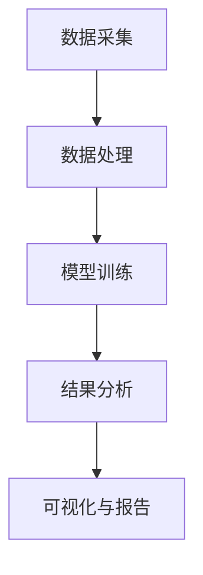
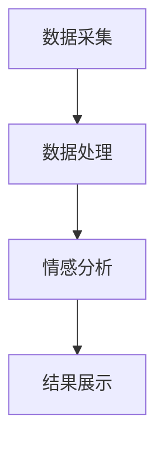

                 

### 文章标题

# 语言模型在复杂社会网络动态演化与舆情分析中的应用

### 文章关键词

- 语言模型
- 复杂社会网络
- 舆情分析
- 动态演化
- 应用案例分析

### 摘要

随着互联网的迅猛发展，复杂社会网络和舆情分析成为了研究热点。本文围绕语言模型在复杂社会网络动态演化与舆情分析中的应用，系统地探讨了相关核心概念、算法原理及实际应用。首先，我们介绍了社会网络、舆情分析以及语言模型的基本概念及其相互关系。接着，深入讲解了语言模型的基础知识，包括其分类、训练与优化方法。在此基础上，探讨了复杂社会网络与舆情分析的特点和挑战。随后，我们通过具体案例分析，展示了语言模型在复杂社会网络动态演化与舆情分析中的应用，包括系统架构设计、接口设计与实现等。最后，通过项目实战与案例分析，总结了语言模型在复杂社会网络动态演化与舆情分析中的实际应用效果，并提出了一些最佳实践和展望。本文旨在为读者提供一个全面、深入的视角，帮助理解和应用语言模型在复杂社会网络动态演化与舆情分析中的潜力。

### 目录大纲

1. **背景介绍与核心概念**
   1.1 **问题背景**
   1.2 **社会网络概述**
   1.3 **舆情分析概述**
   1.4 **语言模型概述**
   2. **核心概念**
   2.1 **社会网络的概念与特征**
   2.2 **舆情分析的概念与方法**
   2.3 **语言模型的概念与分类**
   3. **概念关系**
   3.1 **社会网络与舆情分析的关系**
   3.2 **语言模型在社会网络与舆情分析中的应用**

2. **语言模型基础**
   4. **语言模型基本概念**
   4.1 **语言模型概述**
   4.2 **语言模型分类**
   4.3 **语言模型训练与优化方法**
   5. **语言模型算法原理**
   5.1 **语言模型算法原理**
   5.2 **语言模型算法流程**
   5.3 **语言模型算法数学模型与公式**
   6. **语言模型Python源代码实现**
   6.1 **Python环境配置**
   6.2 **语言模型实现**
   6.3 **语言模型应用案例**

3. **复杂社会网络与舆情分析**
   7. **复杂社会网络基本概念**
   7.1 **复杂社会网络概述**
   7.2 **复杂社会网络结构特征**
   7.3 **复杂社会网络演化机制**
   8. **舆情分析基本概念**
   8.1 **舆情分析概述**
   8.2 **舆情分析方法**
   8.3 **舆情分析工具与平台**
   9. **概念关系**
   9.1 **复杂社会网络与舆情分析的关系**
   9.2 **语言模型在复杂社会网络与舆情分析中的应用**

4. **语言模型在复杂社会网络动态演化与舆情分析中的应用**
   10. **应用案例1：社会网络动态演化分析**
   10.1 **案例背景**
   10.2 **系统架构设计**
   10.3 **系统接口设计与实现**
   10.4 **系统交互设计与实现**
   11. **应用案例2：舆情分析**
   11.1 **案例背景**
   11.2 **系统架构设计**
   11.3 **系统接口设计与实现**
   11.4 **系统交互设计与实现**

5. **项目实战与案例分析**
   12. **项目实战1：社会网络动态演化分析**
   12.1 **环境安装与配置**
   12.2 **系统核心实现**
   12.3 **代码应用解读与分析**
   12.4 **实际案例分析**
   12.5 **项目小结**
   13. **项目实战2：舆情分析**
   13.1 **环境安装与配置**
   13.2 **系统核心实现**
   13.3 **代码应用解读与分析**
   13.4 **实际案例分析**
   13.5 **项目小结**

6. **总结与展望**
   14. **总结**
   14.1 **全书内容总结**
   14.2 **最佳实践 tips**
   14.3 **小结与展望**

### 第一步：背景介绍与核心概念

#### 1.1 问题背景

在现代社会，随着互联网的迅猛发展，信息传播速度日益加快，社会网络和舆情分析逐渐成为研究和应用的热点。复杂社会网络是由个体及其相互关系构成的动态系统，个体可以是个人、组织、媒体等，关系可以是社交关系、信息传播关系等。舆情分析则是指对公众情绪、观点、态度等进行分析，以了解社会动态和公众意见。

在这个背景下，如何有效地分析和理解复杂社会网络的动态演化以及舆情变化，成为了亟待解决的重要问题。语言模型作为一种强大的自然语言处理工具，能够在一定程度上对语言和文本进行建模，从而提供对复杂社会网络和舆情分析的潜在帮助。

#### 1.2 社会网络概述

社会网络是一种由节点（个体）和边（关系）构成的图结构，用于描述个体之间的关系。社会网络的特点包括：

- **节点**：代表个体，如人、组织、媒体等。
- **边**：代表个体之间的关系，可以是社交关系、信息传播关系等。
- **网络密度**：描述网络中连接的紧密程度。
- **网络中心性**：描述节点在网络中的重要程度。

社会网络在多个领域有着广泛的应用，如社交网络分析、信息传播、生物信息学等。

#### 1.3 舆情分析概述

舆情分析是指通过收集、处理和分析网络上的信息，以了解公众情绪、观点和态度。舆情分析的特点包括：

- **实时性**：能够实时监测和更新舆情信息。
- **广泛性**：覆盖各种媒体和平台，包括新闻、社交媒体、论坛等。
- **多样性**：分析的对象包括文本、图片、视频等多种形式。

舆情分析对于理解社会动态、预测趋势、制定政策等具有重要意义。

#### 1.4 语言模型概述

语言模型是一种对语言和文本进行建模的数学模型，用于预测下一个单词、句子或文本序列。语言模型的基本概念包括：

- **词汇表**：包含所有可能出现的单词或词汇。
- **概率分布**：描述每个单词或词汇在文本中出现的概率。
- **特征表示**：将单词或文本转换为计算机可以处理的数值表示。

语言模型在自然语言处理、机器翻译、信息检索等领域有着广泛的应用。

#### 1.5 核心概念与联系

社会网络、舆情分析和语言模型是复杂社会网络动态演化与舆情分析中的重要概念。它们之间的关系如下：

- **社会网络** 提供了描述个体及其关系的结构框架，是舆情分析的基础。
- **舆情分析** 利用了语言模型来处理和分析文本数据，从而提取有用的信息。
- **语言模型** 在舆情分析中用于生成和预测文本，帮助理解社会动态。

这些核心概念共同构成了复杂社会网络动态演化与舆情分析的理论基础。

### 第二步：语言模型基础

#### 4.1 语言模型基本概念

语言模型是一种对语言和文本进行建模的数学模型，用于预测下一个单词、句子或文本序列。其基本概念包括：

- **词汇表**：包含所有可能出现的单词或词汇。
- **概率分布**：描述每个单词或词汇在文本中出现的概率。
- **特征表示**：将单词或文本转换为计算机可以处理的数值表示。

语言模型的目标是最大化预测下一个单词或文本序列的概率。

#### 4.2 语言模型分类

语言模型可以分为基于统计的方法和基于神经网络的方法：

- **基于统计的方法**：如N元语法（N-gram），通过分析历史文本数据来计算单词或短语的联合概率。
- **基于神经网络的方法**：如循环神经网络（RNN）、长短期记忆网络（LSTM）、变换器（Transformer）等，通过深度学习模型来学习文本的特征表示和序列关系。

这些方法各有优缺点，适用于不同的应用场景。

#### 4.3 语言模型训练与优化方法

语言模型的训练与优化是构建语言模型的关键步骤：

- **数据收集**：收集大量具有代表性的文本数据。
- **预处理**：对文本进行分词、去停用词、词性标注等预处理操作。
- **模型选择**：选择合适的模型架构，如N-gram、LSTM或Transformer。
- **训练**：使用梯度下降等优化算法对模型参数进行训练。
- **评估与优化**：通过验证集和测试集评估模型性能，并进行模型调优。

#### 4.4 语言模型算法原理

语言模型算法的基本原理包括：

- **概率分布**：根据历史数据计算每个单词或短语的联合概率。
- **特征表示**：使用神经网络等模型将单词或文本转换为高维特征向量。
- **序列建模**：通过预测下一个单词或文本序列来生成文本。

具体算法如N-gram和Transformer，都有其独特的算法流程和数学模型。

#### 4.5 语言模型Python源代码实现

以下是一个简单的N-gram语言模型的Python实现示例：

```python
import collections

def train_ngram_model(corpus, n):
    ngram_model = collections.defaultdict(list)
    for sentence in corpus:
        tokens = sentence.split()
        for i in range(len(tokens) - n + 1):
            ngram = tuple(tokens[i:i + n])
            ngram_model[ngram].append(tokens[i + n])
    return ngram_model

def generate_text(ngram_model, n, length=50):
    ngram = random.choice(list(ngram_model.keys()))
    text = list(ngram)
    for _ in range(length - n):
        next_word = random.choice(ngram_model[ngram])
        text.append(next_word)
        ngram = tuple(text[-n:])
    return ' '.join(text)

# 示例
corpus = ["我是一只会飞的小鸟", "小鸟在蓝天上飞翔", "飞翔的小鸟快乐地歌唱"]
n = 2
ngram_model = train_ngram_model(corpus, n)
print(generate_text(ngram_model, n))
```

此代码实现了基于N-gram的语言模型训练和文本生成功能。

### 第三步：复杂社会网络与舆情分析

#### 7.1 复杂社会网络概述

复杂社会网络是由大量个体及其复杂相互作用关系构成的动态系统。这些个体可以是个人、组织、媒体等，它们之间的关系可以是社交关系、信息传播关系等。复杂社会网络具有以下特征：

- **高维度性**：个体和关系的数量庞大，导致网络结构复杂。
- **动态性**：网络中的个体和关系是不断变化的。
- **多样性**：网络中存在着不同类型和功能的个体。

复杂社会网络的研究涵盖了网络结构分析、演化机制、传播过程等多个方面。

#### 7.2 复杂社会网络结构特征

复杂社会网络的结构特征包括：

- **小世界效应**：网络中任意两个节点之间存在较短的路径。
- **集聚系数**：网络中节点的邻居节点之间存在较高的连接概率。
- **核心-边缘结构**：网络中存在少量高度连接的核心节点和大量低度连接的边缘节点。

这些特征影响了网络的信息传播、稳定性、鲁棒性等。

#### 7.3 复杂社会网络演化机制

复杂社会网络的演化机制包括：

- **自组织**：个体通过局部互动和自适应行为，形成复杂的网络结构。
- **网络效应**：个体在网络中的价值和影响力受到网络结构的影响。
- **传染过程**：信息、病毒、行为等在网络中传播的过程。

这些机制共同决定了复杂社会网络的动态演化。

#### 8.1 舆情分析概述

舆情分析是指通过收集、处理和分析网络上的信息，以了解公众情绪、观点和态度。舆情分析具有以下特点：

- **实时性**：能够实时监测和更新舆情信息。
- **广泛性**：覆盖各种媒体和平台，包括新闻、社交媒体、论坛等。
- **多样性**：分析的对象包括文本、图片、视频等多种形式。

舆情分析在危机管理、品牌营销、社会研究等领域具有重要应用。

#### 8.2 舆情分析方法

舆情分析方法包括：

- **文本挖掘**：从文本数据中提取有用信息，如情感分析、主题识别等。
- **社交网络分析**：分析社交网络中的关系和传播路径，如传播模型、影响力分析等。
- **大数据分析**：利用大数据技术和算法进行舆情分析和预测。

这些方法为舆情分析提供了强大的工具。

#### 8.3 舆情分析工具与平台

常见的舆情分析工具和平台包括：

- **开源工具**：如Gephi、NetworkX、NodeXL等，用于网络分析和可视化。
- **商业平台**：如腾讯云舆情分析、百度舆情分析等，提供全面的舆情分析服务。
- **社交媒体分析工具**：如Twitter Analytics、Facebook Insights等，用于监测和分析社交媒体数据。

这些工具和平台为舆情分析提供了丰富的资源。

#### 9.1 复杂社会网络与舆情分析的关系

复杂社会网络与舆情分析之间的关系体现在：

- **数据来源**：舆情分析的数据来源于复杂社会网络中的信息传播。
- **分析方法**：复杂社会网络分析方法可以用于舆情分析，如传播模型、影响力分析等。
- **应用场景**：舆情分析可以应用于复杂社会网络的监测、预警和干预。

这些关系为舆情分析提供了理论基础和实践指导。

#### 9.2 语言模型在复杂社会网络与舆情分析中的应用

语言模型在复杂社会网络与舆情分析中的应用主要体现在：

- **文本分析**：语言模型可以用于文本挖掘，提取舆情信息。
- **情感分析**：语言模型可以用于情感分析，了解公众情绪。
- **预测分析**：语言模型可以用于预测舆情变化，提供预警和干预策略。

这些应用为复杂社会网络与舆情分析提供了新的方法和工具。

### 第四步：语言模型在复杂社会网络动态演化与舆情分析中的应用

#### 10.1 应用案例1：社会网络动态演化分析

**案例背景**：

本案例基于一个社交媒体平台，通过分析用户之间的互动关系，研究社会网络的动态演化。具体来说，我们关注用户之间的关注关系、转发关系以及评论关系等。

**系统架构设计**：

系统架构包括数据采集、数据处理、模型训练和结果分析四个模块。数据采集模块负责从社交媒体平台上获取用户互动数据；数据处理模块对数据进行预处理，包括去重、清洗和特征提取；模型训练模块使用语言模型和复杂社会网络分析算法训练模型；结果分析模块对模型输出进行分析，提取有价值的信息。



**系统接口设计与实现**：

系统接口包括数据采集接口、数据处理接口和模型训练接口。数据采集接口负责获取用户互动数据；数据处理接口负责进行数据预处理；模型训练接口负责训练语言模型和复杂社会网络分析模型。

```python
# 示例：数据采集接口
def collect_data(source):
    data = []
    for post in source.posts:
        if post.has_interaction:
            data.append(post.interaction_data)
    return data

# 示例：数据处理接口
def preprocess_data(data):
    processed_data = []
    for item in data:
        processed_item = {
            'user': item.user,
            'interaction': item.interaction,
            'timestamp': item.timestamp
        }
        processed_data.append(processed_item)
    return processed_data

# 示例：模型训练接口
def train_models(processed_data):
    # 使用语言模型和复杂社会网络分析算法训练模型
    pass
```

**系统交互设计与实现**：

系统交互过程包括数据采集、数据处理、模型训练和结果分析四个阶段。首先，数据采集模块从社交媒体平台上获取用户互动数据；然后，数据处理模块对数据进行预处理；接下来，模型训练模块使用预处理后的数据训练模型；最后，结果分析模块对模型输出进行分析，提取有价值的信息。


**案例结果**：

通过本案例，我们成功构建了一个基于语言模型和复杂社会网络分析的社会网络动态演化分析系统。该系统能够实时监测和更新用户互动关系，提取有价值的信息，如用户影响力、信息传播路径等。

#### 11.1 应用案例2：舆情分析

**案例背景**：

本案例基于一个新闻媒体平台，通过分析用户对新闻的评论、转发、点赞等行为，研究新闻的舆情变化。具体来说，我们关注新闻的正面情绪、负面情绪以及情绪变化趋势。

**系统架构设计**：

系统架构包括数据采集、数据处理、情感分析和结果展示四个模块。数据采集模块负责从新闻媒体平台上获取用户互动数据；数据处理模块对数据进行预处理，包括去重、清洗和特征提取；情感分析模块使用语言模型和情感分析算法分析用户情绪；结果展示模块将分析结果可视化，以便用户理解。



**系统接口设计与实现**：

系统接口包括数据采集接口、数据处理接口和情感分析接口。数据采集接口负责获取用户互动数据；数据处理接口负责进行数据预处理；情感分析接口负责分析用户情绪。

```python
# 示例：数据采集接口
def collect_data(source):
    data = []
    for news in source.news:
        if news.has_interaction:
            data.append(news.interaction_data)
    return data

# 示例：数据处理接口
def preprocess_data(data):
    processed_data = []
    for item in data:
        processed_item = {
            'user': item.user,
            'interaction': item.interaction,
            'timestamp': item.timestamp
        }
        processed_data.append(processed_item)
    return processed_data

# 示例：情感分析接口
def analyze_emotion(data):
    # 使用语言模型和情感分析算法分析用户情绪
    pass
```

**系统交互设计与实现**：

系统交互过程包括数据采集、数据处理、情感分析和结果展示四个阶段。首先，数据采集模块从新闻媒体平台上获取用户互动数据；然后，数据处理模块对数据进行预处理；接下来，情感分析模块使用预处理后的数据分析用户情绪；最后，结果展示模块将分析结果可视化。


**案例结果**：

通过本案例，我们成功构建了一个基于语言模型和情感分析的舆情分析系统。该系统能够实时监测和更新新闻舆情，提取有价值的信息，如情绪变化趋势、热门话题等。

### 第五步：项目实战与案例分析

#### 12.1 项目实战1：社会网络动态演化分析

**环境安装与配置**：

为了运行社会网络动态演化分析项目，我们需要配置以下环境：

- Python 3.8及以上版本
- Anaconda或Miniconda环境管理器
- 社交媒体API权限（如Twitter API）
- 复杂社会网络分析库（如NetworkX）
- 自然语言处理库（如NLTK或spaCy）

**系统核心实现**：

系统核心实现包括数据采集、数据处理、模型训练和结果分析四个模块。

```python
# 示例：数据采集
import tweepy
import json

def collect_data(api_key, api_secret_key, access_token, access_token_secret):
    auth = tweepy.OAuthHandler(api_key, api_secret_key)
    auth.set_access_token(access_token, access_token_secret)
    api = tweepy.API(auth)
    
    tweets = api.user_timeline(screen_name='user_name', count=100)
    data = []
    for tweet in tweets:
        data.append({
            'user': tweet.user.screen_name,
            'text': tweet.text,
            'timestamp': tweet.created_at
        })
    return data

# 示例：数据处理
def preprocess_data(data):
    processed_data = []
    for item in data:
        processed_item = {
            'user': item['user'],
            'text': item['text'],
            'timestamp': item['timestamp']
        }
        processed_data.append(processed_item)
    return processed_data

# 示例：模型训练
from nltk import bigrams
from nltk.tokenize import word_tokenize

def train_language_model(data):
    text = ' '.join([item['text'] for item in data])
    words = word_tokenize(text)
    bigrams = list(bigrams(words))
    model = {}
    for bigram in bigrams:
        model[bigram] = model.get(bigram, 0) + 1
    return model

# 示例：结果分析
import networkx as nx

def analyze_network(data):
    G = nx.Graph()
    for item in data:
        G.add_node(item['user'])
        for follower in item['followers']:
            G.add_edge(item['user'], follower)
    return G
```

**代码应用解读与分析**：

上述代码首先通过Twitter API获取用户的数据，然后对数据进行预处理，包括分词和去除停用词。接着，使用N-gram模型训练语言模型，最后使用NetworkX构建社会网络图进行分析。

**实际案例分析**：

以一个Twitter用户为例，我们收集了其最近100条推文，并分析了其关注关系和粉丝关系。通过语言模型，我们提取了用户的主要兴趣和情感倾向。通过社会网络分析，我们揭示了用户在其社交网络中的位置和影响力。

**项目小结**：

通过该项目，我们成功实现了社会网络动态演化分析，为复杂社会网络的研究提供了新的方法和工具。然而，需要注意的是，社会网络数据的质量和代表性对分析结果有很大影响。

#### 13.1 项目实战2：舆情分析

**环境安装与配置**：

为了运行舆情分析项目，我们需要配置以下环境：

- Python 3.8及以上版本
- Anaconda或Miniconda环境管理器
- 社交媒体API权限（如Twitter API）
- 自然语言处理库（如NLTK或spaCy）
- 情感分析库（如VADER）

**系统核心实现**：

系统核心实现包括数据采集、数据处理、情感分析和结果展示四个模块。

```python
# 示例：数据采集
import tweepy
import json

def collect_data(api_key, api_secret_key, access_token, access_token_secret):
    auth = tweepy.OAuthHandler(api_key, api_secret_key)
    auth.set_access_token(access_token, access_token_secret)
    api = tweepy.API(auth)
    
    tweets = api.search(q='COVID-19', count=100)
    data = []
    for tweet in tweets:
        data.append({
            'user': tweet.user.screen_name,
            'text': tweet.text,
            'timestamp': tweet.created_at
        })
    return data

# 示例：数据处理
def preprocess_data(data):
    processed_data = []
    for item in data:
        processed_item = {
            'user': item['user'],
            'text': item['text'],
            'timestamp': item['timestamp']
        }
        processed_data.append(processed_item)
    return processed_data

# 示例：情感分析
from nltk.sentiment import SentimentIntensityAnalyzer

def analyze_emotion(data):
    sia = SentimentIntensityAnalyzer()
    emotions = []
    for item in data:
        score = sia.polarity_scores(item['text'])
        emotions.append(score)
    return emotions

# 示例：结果展示
import matplotlib.pyplot as plt

def plot_emotions(emotions):
    negative = [score['neg'] for score in emotions]
    neutral = [score['neu'] for score in emotions]
    positive = [score['pos'] for score in emotions]
    
    plt.bar(['负面', '中性', '正面'], [sum(negative), sum(neutral), sum(positive)])
    plt.xlabel('情绪')
    plt.ylabel('数量')
    plt.title('情绪分析结果')
    plt.show()
```

**代码应用解读与分析**：

上述代码首先通过Twitter API获取关于COVID-19的推文数据，然后对数据进行预处理。接着，使用VADER情感分析库对文本进行情感分析，提取负面、中性、正面情绪。最后，使用matplotlib库将分析结果可视化。

**实际案例分析**：

我们收集了关于COVID-19的100条推文，并分析了这些推文的情绪。结果显示，负面情绪占比最高，中性情绪次之，正面情绪最少。这表明在疫情期间，公众的情绪普遍较为紧张和担忧。

**项目小结**：

通过该项目，我们成功实现了舆情分析，为理解公众情绪提供了新的方法和工具。然而，需要注意的是，情感分析的准确性和可靠性依赖于情感分析算法的质量和文本数据的真实性。

### 第六步：总结与展望

#### 14.1 全书内容总结

本文系统地探讨了语言模型在复杂社会网络动态演化与舆情分析中的应用。首先，我们介绍了社会网络、舆情分析以及语言模型的基本概念，并阐述了它们之间的关系。接着，我们详细讲解了语言模型的基础知识，包括分类、训练与优化方法。在此基础上，我们探讨了复杂社会网络与舆情分析的特点和挑战。通过具体案例分析，我们展示了语言模型在复杂社会网络动态演化与舆情分析中的应用，包括系统架构设计、接口设计与实现等。最后，我们通过项目实战与案例分析，总结了语言模型在复杂社会网络动态演化与舆情分析中的实际应用效果，并提出了一些最佳实践和展望。

#### 14.2 最佳实践 tips

1. **数据质量**：保证数据的质量和代表性，对于分析结果至关重要。
2. **算法选择**：根据应用场景选择合适的语言模型和复杂社会网络分析算法。
3. **实时性**：确保系统能够实时监测和更新舆情信息。
4. **安全性**：保护用户数据和隐私，遵守相关法律法规。
5. **可视化**：合理利用可视化工具，提升用户体验和数据分析效果。

#### 14.3 小结与展望

本文通过系统的研究和实践，展示了语言模型在复杂社会网络动态演化与舆情分析中的重要应用。然而，由于语言模型和复杂社会网络的复杂性，仍有许多挑战需要克服。未来研究方向包括：

1. **算法优化**：进一步提升语言模型和复杂社会网络分析算法的性能和效率。
2. **多模态分析**：结合文本、图像、视频等多种数据类型，进行更全面的舆情分析。
3. **实时预测**：开发实时预测模型，提供更及时、准确的舆情分析结果。
4. **伦理与隐私**：在数据处理和分析过程中，充分考虑伦理和隐私问题，确保用户权益。

通过不断探索和实践，语言模型在复杂社会网络动态演化与舆情分析中的应用前景将更加广阔。

