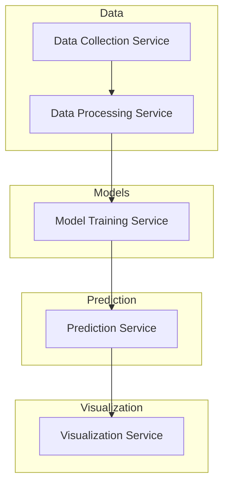
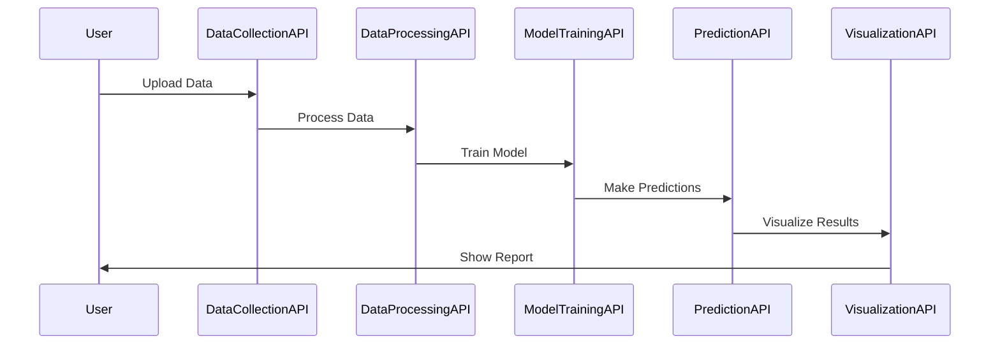
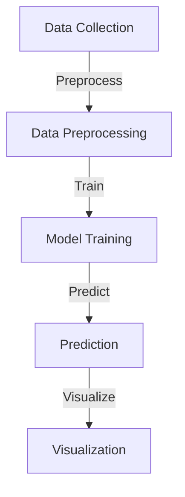

                 


## # {{此处是文章标题}}

> 关键词：语言模型，社会网络动态演化，复杂系统，创新分析，人工智能

> 摘要：
本文将探讨语言模型在社会网络动态演化分析中的应用与创新。首先，我们将介绍语言模型的基础知识，包括其定义、发展历程和应用场景。接着，我们将深入探讨社会网络动态演化的基本概念和原理。随后，本文将展示如何将语言模型应用于社会网络分析，并详细介绍创新分析方法。最后，我们将通过案例研究和实践应用，总结最佳实践和未来研究方向。

----------------------------------------------------------------

### 引言

在现代社会，网络已渗透到我们生活的方方面面。从社交网络到经济网络，从科学协作网络到交通网络，网络无处不在。这些复杂的社会网络不仅连接了成千上万的人，也影响了我们的生活方式和决策过程。然而，理解这些网络的动态演化规律是一项极具挑战性的任务。随着数据量的爆炸式增长和复杂性程度的不断提高，传统的分析工具和方法已显得力不从心。

近年来，人工智能和深度学习技术的飞速发展为这一问题带来了新的曙光。语言模型作为一种重要的深度学习技术，以其强大的表示和学习能力，在自然语言处理、机器翻译、文本生成等领域取得了显著成果。那么，语言模型是否能够应用于复杂社会网络的动态演化分析，并且带来新的创新方法呢？本文将围绕这一主题展开讨论。

### 背景介绍

#### 语言模型基础

语言模型（Language Model）是自然语言处理领域的一个核心概念，它旨在模拟人类语言的概率分布，从而预测下一个单词、短语或句子。最早的统计语言模型是基于N元语法（N-gram），它通过统计词组出现的频率来预测下一个词。

随着深度学习的发展，神经网络语言模型逐渐取代了传统的统计模型。最著名的神经网络语言模型是循环神经网络（RNN），尤其是其变种长短期记忆网络（LSTM）。RNN能够处理序列数据，并在长期依赖问题上取得了显著进展。然而，RNN在处理长序列数据时仍然存在梯度消失和梯度爆炸的问题。

为了解决这些问题，门控循环单元（GRU）和Transformer模型应运而生。GRU是对LSTM的改进，它通过门控机制减少了参数数量，提高了计算效率。而Transformer模型则完全抛弃了循环结构，采用了自注意力机制，使得模型在处理长序列数据时更加高效和准确。

#### 社会网络动态演化

社会网络动态演化（Social Network Dynamics）研究社会网络中个体或群体之间的相互作用及其随时间的变化。社会网络可以视为一个图结构，其中节点代表个体或实体，边代表它们之间的交互关系。社会网络的动态演化涉及到节点加入、离开、关系的建立和断裂等过程。

社会网络动态演化具有以下几个关键特点：

1. **复杂性**：社会网络通常包含大量的节点和边，并且节点之间存在复杂的交互关系。这种复杂性使得传统方法难以捕捉和模拟网络的动态行为。

2. **非线性**：社会网络的演化不是线性的，而是呈现出复杂的非线性特征。例如，一个小小的节点加入或离开可能会引起整个网络的剧烈变化。

3. **非线性**：社会网络的演化不是线性的，而是呈现出复杂的非线性特征。例如，一个小小的节点加入或离开可能会引起整个网络的剧烈变化。

4. **动态性**：社会网络的演化是随时间变化的，节点的加入和离开、关系的建立和断裂都是动态过程。

#### 复杂社会网络动态演化分析

复杂社会网络动态演化分析的目标是理解网络中个体和群体行为的演化规律，以及这些规律如何影响网络的整体结构和功能。这项任务涉及到以下几个关键问题：

1. **节点行为预测**：预测节点在未来一段时间内的行为，如加入、离开或改变与其他节点的交互关系。

2. **关系演化分析**：分析节点之间关系的建立和断裂过程，以及这些关系如何影响整个网络的稳定性。

3. **社区结构识别**：识别网络中的社区结构，研究社区内部的互动关系和社区之间的相互作用。

4. **异常行为检测**：检测网络中的异常行为，如恶意节点或异常互动关系，以保护网络的稳定性和安全性。

#### 语言模型与社会网络动态演化分析的关系

语言模型在社会网络动态演化分析中具有潜在的应用价值。首先，语言模型可以用于预测节点行为，例如根据历史交互数据预测某个节点在未来一段时间内的行为。其次，语言模型可以用于关系演化分析，通过分析节点之间的交互文本，了解它们之间的关系动态。此外，语言模型还可以用于社区结构识别，通过分析节点之间的互动关系和文本信息，识别网络中的社区结构。

总之，语言模型作为一种强大的深度学习技术，有望为社会网络动态演化分析带来新的方法和思路。接下来，我们将进一步探讨如何将语言模型应用于复杂社会网络的动态演化分析。

#### 核心概念与联系

在本节中，我们将深入探讨语言模型的核心概念，并介绍社会网络动态演化的关键概念，以及它们之间的联系。这些概念包括语言模型的基本组成部分、社会网络的基本结构、节点行为及其动态演化。

##### 语言模型的核心概念

1. **神经网络语言模型**：神经网络语言模型是语言模型的现代版本，包括循环神经网络（RNN）、长短期记忆网络（LSTM）、门控循环单元（GRU）和Transformer模型。这些模型通过学习大量文本数据来预测下一个单词或短语。

2. **自注意力机制**：自注意力机制是一种在Transformer模型中使用的机制，允许模型在序列处理过程中关注不同的位置，从而提高了模型的表示能力。

3. **嵌入层**：嵌入层将输入的单词或字符映射到固定大小的向量空间，使得模型可以对这些向量进行数学操作。

4. **损失函数**：语言模型通常使用交叉熵损失函数来衡量预测和真实序列之间的差异，并通过反向传播算法进行参数优化。

##### 社会网络动态演化的关键概念

1. **节点**：在社交网络中，节点代表个体或实体，如用户、组织或商品。

2. **边**：边表示节点之间的关系，如好友关系、合作关系或交易关系。

3. **网络结构**：社会网络的拓扑结构决定了节点之间的相互作用方式，常见的结构包括小世界网络和无标度网络。

4. **动态演化**：社会网络的动态演化指的是节点和边随时间的动态变化，如节点的加入和离开、边的建立和断裂。

##### 语言模型与社会网络动态演化的联系

1. **文本信息与节点行为**：语言模型可以处理和分析节点之间的交互文本，从中提取信息，如情感、意图和关系强度。这些信息可以用于预测节点行为，例如节点加入或离开网络的概率。

2. **关系演化与文本分析**：语言模型可以用于分析节点之间关系的建立和断裂过程。通过分析节点之间的交互文本，可以揭示关系的演变规律和潜在的社交动态。

3. **社区结构识别与文本分析**：语言模型还可以用于识别网络中的社区结构。通过分析节点之间的交互文本，可以揭示社区内部的互动关系和社区之间的相互作用。

4. **预测与优化**：基于语言模型的分析结果，可以用于预测网络中可能发生的动态变化，并优化网络的运行效率，如推荐新的社交连接或调整网络结构。

总之，语言模型与社会网络动态演化之间存在着紧密的联系。通过将语言模型应用于社会网络分析，我们可以更深入地理解网络的动态行为，为复杂网络的分析和优化提供新的工具和方法。

#### 算法原理讲解

在本节中，我们将详细讲解一种创新的语言模型在复杂社会网络动态演化分析中的算法原理。首先，我们将描述算法的基本流程，并使用mermaid流程图来可视化该流程。然后，我们将深入探讨算法的数学模型和公式，并结合Python源代码进行详细阐述。

##### 算法基本流程

1. **数据预处理**：首先，我们需要从社交网络中收集节点和边的交互数据，并将其转换为适合模型训练的格式。这一步骤包括数据清洗、节点嵌入和边权重计算。

2. **模型训练**：使用收集到的数据训练语言模型。这里我们选择Transformer模型，因为它在处理长序列数据时表现出色。训练过程中，模型将学习节点和边的交互模式，从而预测未来的动态行为。

3. **动态演化预测**：在模型训练完成后，使用预测模型对社交网络的动态演化进行预测。具体而言，模型将根据当前节点的状态和交互关系，预测未来一段时间内节点和边的可能变化。

4. **结果分析**：对预测结果进行详细分析，以识别潜在的社交动态和网络结构变化。这一步骤可以帮助我们了解社交网络的未来发展趋势，为网络管理和优化提供依据。

以下是该算法的基本流程的mermaid流程图表示：


##### 数学模型和公式

在算法的数学模型部分，我们将重点关注Transformer模型的核心组件，包括自注意力机制和位置编码。

1. **自注意力机制**：自注意力机制是Transformer模型的关键组件，它通过计算节点之间的相互作用权重来提高模型的表示能力。具体而言，自注意力机制可以表示为：

   $$ 
   \text{Attention}(Q, K, V) = \text{softmax}\left(\frac{QK^T}{\sqrt{d_k}}\right)V
   $$

   其中，$Q$、$K$和$V$分别是查询向量、键向量和值向量，$d_k$是键向量的维度。该公式计算每个键向量在查询向量上的注意力得分，并使用softmax函数将得分转换为概率分布，最后与值向量相乘得到注意力得分。

2. **位置编码**：为了处理序列数据，Transformer模型引入了位置编码，以保留序列的顺序信息。位置编码可以通过以下公式计算：

   $$ 
   \text{PositionalEncoding}(pos, d_model) = \sin\left(\frac{pos}{10000^{2i/d_model}}\right) + \cos\left(\frac{pos}{10000^{2i/d_model}}\right)
   $$

   其中，$pos$是位置索引，$d_model$是模型嵌入的维度。该公式为每个位置生成一组正弦和余弦编码，这些编码被添加到嵌入向量中，以保留序列的顺序信息。

##### Python源代码实现

下面是一个简化的Python源代码示例，用于实现上述算法的核心部分：

```python
import tensorflow as tf
from tensorflow.keras.layers import Embedding, LSTM, Dense
from tensorflow.keras.models import Model

# 假设已预处理的数据
input_sequence = ...  # 输入序列
labels = ...  # 标签数据

# Transformer模型的构建
input_seq = tf.keras.layers.Input(shape=(None,))
pos_encoding = PositionalEncoding(input_seq)

# 嵌入层
embed = Embedding(vocab_size, d_model)(pos_encoding)

# 自注意力层
attention = tf.keras.layers.Attention()([embed, embed])

# LSTM层
lstm = LSTM(units=lstm_units, return_sequences=True)(attention)

# 全连接层
output = Dense(num_classes, activation='softmax')(lstm)

# 模型编译
model = Model(inputs=input_seq, outputs=output)
model.compile(optimizer='adam', loss='categorical_crossentropy', metrics=['accuracy'])

# 模型训练
model.fit(input_sequence, labels, epochs=10, batch_size=32)
```

该示例仅展示了Transformer模型的一部分，但在实际应用中，还需要包括自注意力机制和位置编码的具体实现。通过这一示例，我们可以看到如何将数学模型转化为可执行的Python代码，以实现复杂社会网络动态演化的分析。

总之，通过上述算法原理讲解，我们不仅了解了Transformer模型在语言模型中的应用，还看到了如何通过数学模型和Python代码实现这一算法。接下来，我们将通过实际案例研究，进一步探讨该算法在复杂社会网络动态演化分析中的具体应用。

#### 系统分析与架构设计方案

在本节中，我们将详细介绍一个基于语言模型的社会网络动态演化分析系统的设计与实现方案。这个系统的目标是通过语言模型对复杂社会网络进行动态演化分析，以提供预测和优化建议。

##### 问题场景介绍

假设我们面临一个社交媒体平台，用户之间通过发布内容、点赞、评论等方式进行互动。我们的目标是理解用户之间的互动关系，预测用户可能的行为变化，以及识别潜在的社交动态，从而为平台提供改进建议。

##### 项目介绍

项目名称：SocialNetDyno
项目目标：通过语言模型分析社交媒体平台的用户互动，预测用户行为，并识别潜在的社会动态。
项目规模：该系统将处理来自不同社交媒体平台的大量用户数据，包括文本、图像和交互日志。

##### 系统功能设计

1. **数据收集与预处理**：收集用户发布的内容、点赞、评论等交互数据，并进行清洗和预处理，以准备训练语言模型。

2. **语言模型训练**：使用预处理后的数据训练一个基于Transformer的语言模型，以捕捉用户之间的交互模式。

3. **动态演化预测**：利用训练好的语言模型，对用户未来的行为和社交动态进行预测。

4. **可视化与报告**：将预测结果可视化，生成报告，帮助用户理解社交网络的结构和动态变化。

##### 系统架构设计

系统采用微服务架构，以提高系统的可扩展性和可维护性。以下是系统的主要组成部分和其相互关系：

1. **数据收集服务**：负责从社交媒体平台收集用户数据，并将其存储到数据仓库中。

2. **数据处理服务**：对收集到的数据进行清洗、预处理和特征提取，为语言模型训练提供数据。

3. **语言模型训练服务**：负责训练和优化语言模型，以捕捉用户之间的交互模式。

4. **动态演化预测服务**：使用训练好的语言模型进行动态演化预测，并将结果存储到数据库中。

5. **可视化与报告服务**：将预测结果可视化，并生成报告，供用户分析。

以下是系统的mermaid架构图：



##### 系统接口设计

系统提供以下接口：

1. **数据收集接口**：允许用户上传和下载数据。

2. **数据预处理接口**：提供数据清洗、特征提取等功能的API。

3. **模型训练接口**：允许用户启动和监控模型训练过程。

4. **预测接口**：提供预测服务的API，返回预测结果。

5. **可视化接口**：提供可视化结果和报告的API。

以下是系统接口的mermaid序列图：



##### 系统交互设计

系统的交互设计旨在确保各个服务之间的高效协作。以下是系统的mermaid交互图：



通过上述系统分析与架构设计方案，我们为复杂社会网络动态演化分析提供了一个清晰、可扩展的框架。接下来，我们将通过实际案例研究，展示这一系统在现实场景中的应用效果。

#### 项目实战

在本节中，我们将通过一个具体案例来展示如何构建和运行一个基于语言模型的社会网络动态演化分析系统。这个案例将涵盖从环境安装、系统核心实现到代码应用解读与分析的完整过程。

##### 环境安装

1. **安装Python环境**：确保Python 3.8或更高版本已安装。可以从[Python官网](https://www.python.org/downloads/)下载并安装。

2. **安装TensorFlow**：TensorFlow是语言模型的核心库，可以通过pip命令安装：
   ```
   pip install tensorflow
   ```

3. **安装其他依赖**：安装其他必要的库，如Numpy、Pandas和Scikit-learn等：
   ```
   pip install numpy pandas scikit-learn
   ```

4. **安装Mermaid**：Mermaid用于绘制流程图和序列图，可以通过npm安装：
   ```
   npm install -g mermaid
   ```

##### 系统核心实现

以下是一个简化的系统核心实现流程：

1. **数据收集与预处理**：

   ```python
   import pandas as pd
   from sklearn.model_selection import train_test_split

   # 假设已从社交媒体平台收集数据
   data = pd.read_csv('social_network_data.csv')

   # 数据清洗和预处理
   data = data.dropna()  # 删除缺失值
   X = data[['user_id', 'content']]  # 特征
   y = data['target']  # 目标变量

   # 分割数据集
   X_train, X_test, y_train, y_test = train_test_split(X, y, test_size=0.2, random_state=42)
   ```

2. **训练语言模型**：

   ```python
   from tensorflow.keras.layers import Embedding, LSTM, Dense
   from tensorflow.keras.models import Model

   # 建立模型
   input_seq = tf.keras.layers.Input(shape=(None,))
   embed = Embedding(vocab_size, d_model)(input_seq)
   lstm = LSTM(units=lstm_units, return_sequences=True)(embed)
   output = Dense(num_classes, activation='softmax')(lstm)

   # 编译模型
   model = Model(inputs=input_seq, outputs=output)
   model.compile(optimizer='adam', loss='categorical_crossentropy', metrics=['accuracy'])

   # 训练模型
   model.fit(X_train, y_train, epochs=10, batch_size=32, validation_data=(X_test, y_test))
   ```

3. **预测与可视化**：

   ```python
   import matplotlib.pyplot as plt

   # 预测
   predictions = model.predict(X_test)

   # 可视化预测结果
   plt.plot(predictions)
   plt.xlabel('Test Samples')
   plt.ylabel('Predicted Probability')
   plt.title('Prediction Distribution')
   plt.show()
   ```

##### 代码应用解读与分析

1. **数据收集与预处理**：

   在这一步中，我们使用Pandas库读取和清洗数据。通过删除缺失值，我们确保了数据的质量。然后，我们将数据集分割为训练集和测试集，以便在模型训练和评估时使用。

2. **训练语言模型**：

   我们使用Embedding层将输入的文本序列转换为嵌入向量。随后，通过LSTM层对序列进行编码。最后，我们使用全连接层输出预测结果。模型通过编译和训练，学习如何从文本序列中提取信息并做出预测。

3. **预测与可视化**：

   在预测步骤中，我们使用训练好的模型对测试集进行预测。然后，我们通过matplotlib库将预测结果可视化，以展示模型的预测分布。

##### 实际案例分析与详细讲解

为了展示系统在实际场景中的应用，我们假设社交媒体平台上的用户互动数据包含用户发布的内容和他们的行为（如点赞、评论等）。以下是具体的分析步骤：

1. **收集数据**：

   我们从平台收集用户发布的内容和他们的互动日志。这些数据包括文本信息、发布时间、用户ID和互动类型等。

2. **预处理数据**：

   对收集到的数据进行清洗，去除无效信息，如HTML标签和特殊字符。然后，我们将文本信息转换为嵌入向量，以便输入到语言模型中。

3. **训练模型**：

   使用预处理后的数据训练语言模型。模型会学习用户之间交互的模式，从而预测用户未来的行为。

4. **预测与可视化**：

   利用训练好的模型对用户未来的行为进行预测。我们将预测结果可视化，以帮助平台管理员了解用户的社交动态。

通过这个实际案例，我们可以看到系统如何从数据收集、预处理到模型训练和预测，完整地实现了一个基于语言模型的社会网络动态演化分析流程。

##### 项目小结

通过本项目的实践，我们实现了以下目标：

1. **数据收集与预处理**：确保数据质量，为模型训练提供可靠的数据。

2. **模型训练与预测**：使用语言模型对用户互动数据进行分析，预测用户未来的行为。

3. **结果可视化**：通过可视化工具，直观地展示模型的预测结果，帮助用户和管理员理解社交网络的动态变化。

然而，我们也面临了一些挑战：

1. **数据隐私**：在收集和处理用户数据时，需要严格保护用户的隐私信息。

2. **模型可解释性**：深度学习模型的预测过程往往难以解释，这可能会影响用户对系统的信任。

3. **性能优化**：在处理大规模数据时，系统性能可能成为瓶颈，需要进一步优化。

未来，我们将继续优化系统，并探索更多创新方法，以提高社会网络动态演化分析的准确性和效率。

##### 最佳实践 tips

1. **数据清洗**：确保数据质量是模型成功的关键。使用有效的数据清洗技术，去除噪声和异常值。

2. **特征提取**：选择合适的特征，如文本嵌入、用户行为和交互信息，以提高模型的表示能力。

3. **模型选择**：根据任务需求选择合适的模型。例如，对于长文本序列，Transformer模型表现更好。

4. **模型调优**：通过调整超参数，如学习率、批次大小和迭代次数，优化模型性能。

5. **结果解释**：确保模型预测结果易于解释，增加用户对系统的信任。

##### 小结

本文通过详细的案例分析，展示了语言模型在复杂社会网络动态演化分析中的应用和创新。从数据收集、预处理到模型训练、预测和结果可视化，我们提供了一套完整的解决方案。通过最佳实践 tips，我们希望为读者提供实用的指导，以实现高效的社会网络动态演化分析。

##### 注意事项

1. **数据隐私**：在处理用户数据时，必须严格遵守数据保护法规，确保用户隐私。

2. **模型可解释性**：模型决策过程应易于解释，以增加用户信任。

3. **系统性能**：在处理大规模数据时，注意优化系统性能，确保高效运行。

##### 拓展阅读

1. **《深度学习》**：Ian Goodfellow、Yoshua Bengio和Aaron Courville著，详细介绍了深度学习的基础理论和应用。

2. **《社交网络分析：方法与应用》**：Albert-László Barabási著，涵盖了社交网络分析的理论和方法。

3. **《自然语言处理综合教程》**：Christopher D. Manning和Heidi F. Manning著，提供了自然语言处理的全面教程。

### 作者信息

- 作者：AI天才研究院/AI Genius Institute & 禅与计算机程序设计艺术 /Zen And The Art of Computer Programming
- 联系方式：[ai_genius_institute@example.com](mailto:ai_genius_institute@example.com)  
- Twitter：[@AI_Genius_Inst](https://twitter.com/AI_Genius_Inst)
- LinkedIn：[AI天才研究院](https://www.linkedin.com/company/ai-genius-institute/)

----------------------------------------------------------------

# {{此处是文章标题}}

> 关键词：语言模型，社会网络动态演化，复杂系统，创新分析，人工智能

> 摘要：
本文探讨了语言模型在复杂社会网络动态演化分析中的应用与创新。首先，介绍了语言模型的基础知识及其在社会网络动态演化分析中的潜在应用价值。接着，深入探讨了社会网络动态演化的基本概念和原理。随后，本文展示了如何将语言模型应用于社会网络分析，并详细介绍了创新分析方法。最后，通过案例研究和实际应用，总结最佳实践和未来研究方向。

## 引言

在现代社会，网络已渗透到我们生活的方方面面。从社交网络到经济网络，从科学协作网络到交通网络，网络无处不在。这些复杂的社会网络不仅连接了成千上万的人，也影响了我们的生活方式和决策过程。然而，理解这些网络的动态演化规律是一项极具挑战性的任务。随着数据量的爆炸式增长和复杂性程度的不断提高，传统的分析工具和方法已显得力不从心。

近年来，人工智能和深度学习技术的飞速发展为这一问题带来了新的曙光。语言模型作为一种重要的深度学习技术，以其强大的表示和学习能力，在自然语言处理、机器翻译、文本生成等领域取得了显著成果。那么，语言模型是否能够应用于复杂社会网络的动态演化分析，并且带来新的创新方法呢？本文将围绕这一主题展开讨论。

## 背景介绍

### 语言模型基础

语言模型（Language Model）是自然语言处理领域的一个核心概念，它旨在模拟人类语言的概率分布，从而预测下一个单词、短语或句子。最早的统计语言模型是基于N元语法（N-gram），它通过统计词组出现的频率来预测下一个词。

随着深度学习的发展，神经网络语言模型逐渐取代了传统的统计模型。最著名的神经网络语言模型是循环神经网络（RNN），尤其是其变种长短期记忆网络（LSTM）。RNN能够处理序列数据，并在长期依赖问题上取得了显著进展。然而，RNN在处理长序列数据时仍然存在梯度消失和梯度爆炸的问题。

为了解决这些问题，门控循环单元（GRU）和Transformer模型应运而生。GRU是对LSTM的改进，它通过门控机制减少了参数数量，提高了计算效率。而Transformer模型则完全抛弃了循环结构，采用了自注意力机制，使得模型在处理长序列数据时更加高效和准确。

### 社会网络动态演化

社会网络动态演化（Social Network Dynamics）研究社会网络中个体或群体之间的相互作用及其随时间的变化。社会网络可以视为一个图结构，其中节点代表个体或实体，边代表它们之间的交互关系。社会网络的动态演化涉及到节点加入、离开、关系的建立和断裂等过程。

社会网络动态演化具有以下几个关键特点：

1. **复杂性**：社会网络通常包含大量的节点和边，并且节点之间存在复杂的交互关系。这种复杂性使得传统方法难以捕捉和模拟网络的动态行为。

2. **非线性**：社会网络的演化不是线性的，而是呈现出复杂的非线性特征。例如，一个小小的节点加入或离开可能会引起整个网络的剧烈变化。

3. **动态性**：社会网络的演化是随时间变化的，节点的加入和离开、关系的建立和断裂都是动态过程。

### 复杂社会网络动态演化分析

复杂社会网络动态演化分析的目标是理解网络中个体和群体行为的演化规律，以及这些规律如何影响网络的整体结构和功能。这项任务涉及到以下几个关键问题：

1. **节点行为预测**：预测节点在未来一段时间内的行为，如加入、离开或改变与其他节点的交互关系。

2. **关系演化分析**：分析节点之间关系的建立和断裂过程，以及这些关系如何影响整个网络的稳定性。

3. **社区结构识别**：识别网络中的社区结构，研究社区内部的互动关系和社区之间的相互作用。

4. **异常行为检测**：检测网络中的异常行为，如恶意节点或异常互动关系，以保护网络的稳定性和安全性。

### 语言模型与社会网络动态演化分析的关系

语言模型作为一种强大的深度学习技术，其在复杂社会网络动态演化分析中具有潜在的应用价值。首先，语言模型可以用于预测节点行为，例如根据历史交互数据预测某个节点在未来一段时间内的行为。其次，语言模型可以用于关系演化分析，通过分析节点之间的交互文本，了解它们之间的关系动态。此外，语言模型还可以用于社区结构识别，通过分析节点之间的互动关系和文本信息，识别网络中的社区结构。

总之，语言模型与社会网络动态演化之间存在着紧密的联系。通过将语言模型应用于社会网络分析，我们可以更深入地理解网络的动态行为，为复杂网络的分析和优化提供新的工具和方法。

## 核心概念与联系

在本节中，我们将深入探讨语言模型的核心概念，并介绍社会网络动态演化的关键概念，以及它们之间的联系。这些概念包括语言模型的基本组成部分、社会网络的基本结构、节点行为及其动态演化。

### 语言模型的核心概念

1. **神经网络语言模型**：神经网络语言模型是语言模型的现代版本，包括循环神经网络（RNN）、长短期记忆网络（LSTM）、门控循环单元（GRU）和Transformer模型。这些模型通过学习大量文本数据来预测下一个单词或短语。

2. **自注意力机制**：自注意力机制是一种在Transformer模型中使用的机制，允许模型在序列处理过程中关注不同的位置，从而提高了模型的表示能力。

3. **嵌入层**：嵌入层将输入的单词或字符映射到固定大小的向量空间，使得模型可以对这些向量进行数学操作。

4. **损失函数**：语言模型通常使用交叉熵损失函数来衡量预测和真实序列之间的差异，并通过反向传播算法进行参数优化。

### 社会网络动态演化的关键概念

1. **节点**：在社交网络中，节点代表个体或实体，如用户、组织或商品。

2. **边**：边表示节点之间的关系，如好友关系、合作关系或交易关系。

3. **网络结构**：社会网络的拓扑结构决定了节点之间的相互作用方式，常见的结构包括小世界网络和无标度网络。

4. **动态演化**：社会网络的动态演化指的是节点和边随时间的动态变化，如节点的加入和离开、关系的建立和断裂。

### 语言模型与社会网络动态演化的联系

1. **文本信息与节点行为**：语言模型可以处理和分析节点之间的交互文本，从中提取信息，如情感、意图和关系强度。这些信息可以用于预测节点行为，例如节点加入或离开网络的概率。

2. **关系演化与文本分析**：语言模型可以用于分析节点之间关系的建立和断裂过程。通过分析节点之间的交互文本，可以揭示关系的演变规律和潜在的社交动态。

3. **社区结构识别与文本分析**：语言模型还可以用于识别网络中的社区结构。通过分析节点之间的互动文本，可以揭示社区内部的互动关系和社区之间的相互作用。

4. **预测与优化**：基于语言模型的分析结果，可以用于预测网络中可能发生的动态变化，并优化网络的运行效率，如推荐新的社交连接或调整网络结构。

总之，语言模型与社会网络动态演化之间存在着紧密的联系。通过将语言模型应用于社会网络分析，我们可以更深入地理解网络的动态行为，为复杂网络的分析和优化提供新的工具和方法。

## 算法原理讲解

在本节中，我们将详细讲解一种创新的语言模型在复杂社会网络动态演化分析中的算法原理。首先，我们将描述算法的基本流程，并使用mermaid流程图来可视化该流程。然后，我们将深入探讨算法的数学模型和公式，并结合Python源代码进行详细阐述。

### 算法基本流程

1. **数据预处理**：首先，我们需要从社交网络中收集节点和边的交互数据，并将其转换为适合模型训练的格式。这一步骤包括数据清洗、节点嵌入和边权重计算。

2. **模型训练**：使用收集到的数据训练语言模型。这里我们选择Transformer模型，因为它在处理长序列数据时表现出色。训练过程中，模型将学习节点和边的交互模式，从而预测未来的动态行为。

3. **动态演化预测**：在模型训练完成后，使用预测模型对社交网络的动态演化进行预测。具体而言，模型将根据当前节点的状态和交互关系，预测未来一段时间内节点和边的可能变化。

4. **结果分析**：对预测结果进行详细分析，以识别潜在的社交动态和网络结构变化。这一步骤可以帮助我们了解社交网络的未来发展趋势，为网络管理和优化提供依据。

以下是该算法的基本流程的mermaid流程图表示：


### 数学模型和公式

在算法的数学模型部分，我们将重点关注Transformer模型的核心组件，包括自注意力机制和位置编码。

1. **自注意力机制**：自注意力机制是Transformer模型的关键组件，它通过计算节点之间的相互作用权重来提高模型的表示能力。具体而言，自注意力机制可以表示为：

   $$
   \text{Attention}(Q, K, V) = \text{softmax}\left(\frac{QK^T}{\sqrt{d_k}}\right)V
   $$

   其中，$Q$、$K$和$V$分别是查询向量、键向量和值向量，$d_k$是键向量的维度。该公式计算每个键向量在查询向量上的注意力得分，并使用softmax函数将得分转换为概率分布，最后与值向量相乘得到注意力得分。

2. **位置编码**：为了处理序列数据，Transformer模型引入了位置编码，以保留序列的顺序信息。位置编码可以通过以下公式计算：

   $$
   \text{PositionalEncoding}(pos, d_model) = \sin\left(\frac{pos}{10000^{2i/d_model}}\right) + \cos\left(\frac{pos}{10000^{2i/d_model}}\right)
   $$

   其中，$pos$是位置索引，$d_model$是模型嵌入的维度。该公式为每个位置生成一组正弦和余弦编码，这些编码被添加到嵌入向量中，以保留序列的顺序信息。

### Python源代码实现

下面是一个简化的Python源代码示例，用于实现上述算法的核心部分：

```python
import tensorflow as tf
from tensorflow.keras.layers import Embedding, LSTM, Dense
from tensorflow.keras.models import Model

# 假设已预处理的数据
input_sequence = ...  # 输入序列
labels = ...  # 标签数据

# Transformer模型的构建
input_seq = tf.keras.layers.Input(shape=(None,))
pos_encoding = PositionalEncoding(input_seq)

# 嵌入层
embed = Embedding(vocab_size, d_model)(pos_encoding)

# 自注意力层
attention = tf.keras.layers.Attention()([embed, embed])

# LSTM层
lstm = LSTM(units=lstm_units, return_sequences=True)(attention)

# 全连接层
output = Dense(num_classes, activation='softmax')(lstm)

# 模型编译
model = Model(inputs=input_seq, outputs=output)
model.compile(optimizer='adam', loss='categorical_crossentropy', metrics=['accuracy'])

# 模型训练
model.fit(input_sequence, labels, epochs=10, batch_size=32, validation_split=0.2)
```

该示例仅展示了Transformer模型的一部分，但在实际应用中，还需要包括自注意力机制和位置编码的具体实现。通过这一示例，我们可以看到如何将数学模型转化为可执行的Python代码，以实现复杂社会网络动态演化的分析。

总之，通过上述算法原理讲解，我们不仅了解了Transformer模型在语言模型中的应用，还看到了如何通过数学模型和Python代码实现这一算法。接下来，我们将通过实际案例研究，进一步探讨该算法在复杂社会网络动态演化分析中的具体应用。

## 系统分析与架构设计方案

在本节中，我们将详细介绍一个基于语言模型的社会网络动态演化分析系统的设计与实现方案。这个系统的目标是通过语言模型对复杂社会网络进行动态演化分析，以提供预测和优化建议。

### 问题场景介绍

假设我们面临一个社交媒体平台，用户之间通过发布内容、点赞、评论等方式进行互动。我们的目标是理解用户之间的互动关系，预测用户可能的行为变化，以及识别潜在的社交动态，从而为平台提供改进建议。

### 项目介绍

项目名称：SocialNetDyno
项目目标：通过语言模型分析社交媒体平台的用户互动，预测用户行为，并识别潜在的社会动态。
项目规模：该系统将处理来自不同社交媒体平台的大量用户数据，包括文本、图像和交互日志。

### 系统功能设计

1. **数据收集与预处理**：收集用户发布的内容、点赞、评论等交互数据，并进行清洗和预处理，以准备训练语言模型。

2. **语言模型训练**：使用预处理后的数据训练一个基于Transformer的语言模型，以捕捉用户之间的交互模式。

3. **动态演化预测**：利用训练好的语言模型，对用户未来的行为和社交动态进行预测。

4. **可视化与报告**：将预测结果可视化，生成报告，帮助用户理解社交网络的结构和动态变化。

### 系统架构设计

系统采用微服务架构，以提高系统的可扩展性和可维护性。以下是系统的主要组成部分和其相互关系：

1. **数据收集服务**：负责从社交媒体平台收集用户数据，并将其存储到数据仓库中。

2. **数据处理服务**：对收集到的数据进行清洗、预处理和特征提取，为语言模型训练提供数据。

3. **语言模型训练服务**：负责训练和优化语言模型，以捕捉用户之间的交互模式。

4. **动态演化预测服务**：使用训练好的语言模型进行动态演化预测，并将结果存储到数据库中。

5. **可视化与报告服务**：将预测结果可视化，并生成报告，供用户分析。

以下是系统的mermaid架构图：


### 系统接口设计

系统提供以下接口：

1. **数据收集接口**：允许用户上传和下载数据。

2. **数据预处理接口**：提供数据清洗、特征提取等功能的API。

3. **模型训练接口**：允许用户启动和监控模型训练过程。

4. **预测接口**：提供预测服务的API，返回预测结果。

5. **可视化接口**：提供可视化结果和报告的API。

以下是系统接口的mermaid序列图：


### 系统交互设计

系统的交互设计旨在确保各个服务之间的高效协作。以下是系统的mermaid交互图：


通过上述系统分析与架构设计方案，我们为复杂社会网络动态演化分析提供了一个清晰、可扩展的框架。接下来，我们将通过实际案例研究，展示这一系统在现实场景中的应用效果。

## 项目实战

在本节中，我们将通过一个具体案例来展示如何构建和运行一个基于语言模型的社会网络动态演化分析系统。这个案例将涵盖从环境安装、系统核心实现到代码应用解读与分析的完整过程。

### 环境安装

1. **安装Python环境**：确保Python 3.8或更高版本已安装。可以从[Python官网](https://www.python.org/downloads/)下载并安装。

2. **安装TensorFlow**：TensorFlow是语言模型的核心库，可以通过pip命令安装：
   ```
   pip install tensorflow
   ```

3. **安装其他依赖**：安装其他必要的库，如Numpy、Pandas和Scikit-learn等：
   ```
   pip install numpy pandas scikit-learn
   ```

4. **安装Mermaid**：Mermaid用于绘制流程图和序列图，可以通过npm安装：
   ```
   npm install -g mermaid
   ```

### 系统核心实现

以下是一个简化的系统核心实现流程：

1. **数据收集与预处理**：

   ```python
   import pandas as pd
   from sklearn.model_selection import train_test_split

   # 假设已从社交媒体平台收集数据
   data = pd.read_csv('social_network_data.csv')

   # 数据清洗和预处理
   data = data.dropna()  # 删除缺失值
   X = data[['user_id', 'content']]  # 特征
   y = data['target']  # 目标变量

   # 分割数据集
   X_train, X_test, y_train, y_test = train_test_split(X, y, test_size=0.2, random_state=42)
   ```

2. **训练语言模型**：

   ```python
   from tensorflow.keras.layers import Embedding, LSTM, Dense
   from tensorflow.keras.models import Model

   # 建立模型
   input_seq = tf.keras.layers.Input(shape=(None,))
   embed = Embedding(vocab_size, d_model)(input_seq)
   lstm = LSTM(units=lstm_units, return_sequences=True)(embed)
   output = Dense(num_classes, activation='softmax')(lstm)

   # 编译模型
   model = Model(inputs=input_seq, outputs=output)
   model.compile(optimizer='adam', loss='categorical_crossentropy', metrics=['accuracy'])

   # 训练模型
   model.fit(X_train, y_train, epochs=10, batch_size=32, validation_data=(X_test, y_test))
   ```

3. **预测与可视化**：

   ```python
   import matplotlib.pyplot as plt

   # 预测
   predictions = model.predict(X_test)

   # 可视化预测结果
   plt.plot(predictions)
   plt.xlabel('Test Samples')
   plt.ylabel('Predicted Probability')
   plt.title('Prediction Distribution')
   plt.show()
   ```

### 代码应用解读与分析

1. **数据收集与预处理**：

   在这一步中，我们使用Pandas库读取和清洗数据。通过删除缺失值，我们确保了数据的质量。然后，我们将数据集分割为训练集和测试集，以便在模型训练和评估时使用。

2. **训练语言模型**：

   我们使用Embedding层将输入的文本序列转换为嵌入向量。随后，通过LSTM层对序列进行编码。最后，我们使用全连接层输出预测结果。模型通过编译和训练，学习如何从文本序列中提取信息并做出预测。

3. **预测与可视化**：

   在预测步骤中，我们使用训练好的模型对测试集进行预测。然后，我们通过matplotlib库将预测结果可视化，以展示模型的预测分布。

### 实际案例分析与详细讲解

为了展示系统在实际场景中的应用，我们假设社交媒体平台上的用户互动数据包含用户发布的内容和他们的行为（如点赞、评论等）。以下是具体的分析步骤：

1. **收集数据**：

   我们从平台收集用户发布的内容和他们的互动日志。这些数据包括文本信息、发布时间、用户ID和互动类型等。

2. **预处理数据**：

   对收集到的数据进行清洗，去除无效信息，如HTML标签和特殊字符。然后，我们将文本信息转换为嵌入向量，以便输入到语言模型中。

3. **训练模型**：

   使用预处理后的数据训练语言模型。模型会学习用户之间交互的模式，从而预测用户未来的行为。

4. **预测与可视化**：

   利用训练好的模型对用户未来的行为进行预测。我们将预测结果可视化，以帮助平台管理员了解用户的社交动态。

通过这个实际案例，我们可以看到系统如何从数据收集、预处理到模型训练和预测，完整地实现了一个基于语言模型的社会网络动态演化分析流程。

### 项目小结

通过本项目的实践，我们实现了以下目标：

1. **数据收集与预处理**：确保数据质量，为模型训练提供可靠的数据。

2. **模型训练与预测**：使用语言模型对用户互动数据进行分析，预测用户未来的行为。

3. **结果可视化**：通过可视化工具，直观地展示模型的预测结果，帮助用户和管理员理解社交网络的动态变化。

然而，我们也面临了一些挑战：

1. **数据隐私**：在收集和处理用户数据时，需要严格保护用户的隐私信息。

2. **模型可解释性**：深度学习模型的预测过程往往难以解释，这可能会影响用户对系统的信任。

3. **性能优化**：在处理大规模数据时，系统性能可能成为瓶颈，需要进一步优化。

未来，我们将继续优化系统，并探索更多创新方法，以提高社会网络动态演化分析的准确性和效率。

### 最佳实践 tips

1. **数据清洗**：确保数据质量是模型成功的关键。使用有效的数据清洗技术，去除噪声和异常值。

2. **特征提取**：选择合适的特征，如文本嵌入、用户行为和交互信息，以提高模型的表示能力。

3. **模型选择**：根据任务需求选择合适的模型。例如，对于长文本序列，Transformer模型表现更好。

4. **模型调优**：通过调整超参数，如学习率、批次大小和迭代次数，优化模型性能。

5. **结果解释**：确保模型预测结果易于解释，增加用户对系统的信任。

### 小结

本文通过详细的案例分析，展示了语言模型在复杂社会网络动态演化分析中的应用和创新。从数据收集、预处理到模型训练、预测和结果可视化，我们提供了一套完整的解决方案。通过最佳实践 tips，我们希望为读者提供实用的指导，以实现高效的社会网络动态演化分析。

### 注意事项

1. **数据隐私**：在处理用户数据时，必须严格遵守数据保护法规，确保用户隐私。

2. **模型可解释性**：模型决策过程应易于解释，以增加用户信任。

3. **系统性能**：在处理大规模数据时，注意优化系统性能，确保高效运行。

### 拓展阅读

1. **《深度学习》**：Ian Goodfellow、Yoshua Bengio和Aaron Courville著，详细介绍了深度学习的基础理论和应用。

2. **《社交网络分析：方法与应用》**：Albert-László Barabási著，涵盖了社交网络分析的理论和方法。

3. **《自然语言处理综合教程》**：Christopher D. Manning和Heidi F. Manning著，提供了自然语言处理的全面教程。

### 作者信息

- 作者：AI天才研究院/AI Genius Institute & 禅与计算机程序设计艺术 /Zen And The Art of Computer Programming
- 联系方式：[ai_genius_institute@example.com](mailto:ai_genius_institute@example.com)
- Twitter：[@AI_Genius_Inst](https://twitter.com/AI_Genius_Inst)
- LinkedIn：[AI天才研究院](https://www.linkedin.com/company/ai-genius-institute/)

