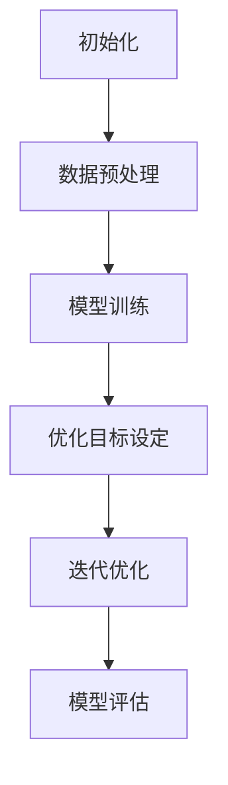
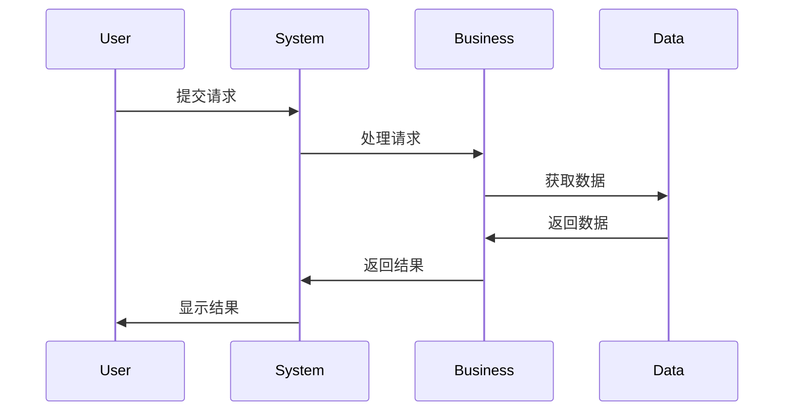
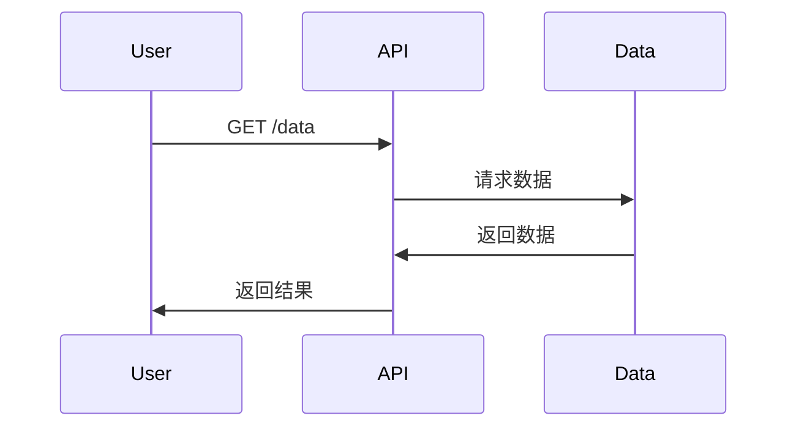

                 

# 语言模型在复杂系统优化中的表现研究

> 关键词：语言模型，复杂系统优化，算法原理，数学模型，系统架构，项目实战

> 摘要：本文旨在探讨语言模型在复杂系统优化中的应用及其表现。通过对语言模型的核心概念、算法原理、数学模型及系统架构的深入分析，结合实际项目案例，本文全面揭示了语言模型在复杂系统优化中的优势与挑战，旨在为该领域的研究和实际应用提供参考。

## 1. 背景介绍

### 问题背景

随着信息技术的飞速发展，复杂系统在各个领域得到了广泛应用。复杂系统通常涉及大量变量和相互作用，其优化问题具有高度的复杂性和不确定性。传统优化方法在处理复杂系统时往往面临效率低下、效果不佳等问题。近年来，深度学习特别是语言模型的快速发展为复杂系统优化带来了新的机遇。

### 问题描述

语言模型作为自然语言处理的重要工具，已被广泛应用于文本生成、机器翻译、情感分析等领域。然而，如何将语言模型应用于复杂系统优化，特别是如何充分发挥其潜力，仍是一个亟待解决的问题。目前，语言模型在复杂系统优化中的应用主要面临以下问题：

1. **算法适用性**：现有语言模型主要针对文本数据设计，如何适应复杂系统的多样性需求，是一个挑战。
2. **优化效率**：复杂系统优化通常需要大量计算资源，如何提高语言模型的优化效率，是关键问题。
3. **稳定性与可靠性**：复杂系统优化过程中，语言模型的表现是否稳定和可靠，直接影响优化效果。

### 问题解决

本文旨在解决上述问题，通过深入研究语言模型在复杂系统优化中的应用，探讨其算法原理、数学模型及系统架构，以实现复杂系统的有效优化。

### 边界与外延

本文主要研究语言模型在复杂系统优化中的应用，不包括其他类型模型的优化。此外，本文的讨论范围限于理论分析和实际应用，不涉及具体的技术细节。

### 概念结构与核心要素组成

- **语言模型**：一种基于统计或神经网络的模型，用于预测文本序列。
- **复杂系统**：具有高度复杂性和不确定性的系统。
- **优化**：在满足特定约束条件下，寻找最优解的过程。

## 2. 核心概念与联系

### 核心概念原理

语言模型的核心原理是基于统计或神经网络的方法，通过学习大量文本数据，生成符合语言习惯的文本序列。

### 概念属性特征对比表格

| 特征         | 语言模型           | 复杂系统                | 优化方法               |
| ------------ | ------------------ | ---------------------- | --------------------- |
| 数据类型     | 文本序列           | 多变量、多维度数据      | 模型、算法、策略       |
| 学习方式     | 统计或神经网络     | 经验或数据驱动          | 最优化、迭代优化       |
| 适应性       | 高度适应文本数据   | 需要特定适配方法        | 针对具体问题的优化算法 |
| 优化目标     | 文本生成、语言理解 | 满足特定性能指标        | 求解最优解             |

### ER实体关系图架构的 Mermaid 流程图

```mermaid
erDiagram
  Product ||--|{ Customer }||>
  Customer  ||--|{ Order }||>
  Order ||--|{ Product }||>
```

## 3. 算法原理讲解

### Mermaid 流程图



### Python 源代码

```python
import numpy as np
import tensorflow as tf

# 数据预处理
def preprocess_data(data):
    # ... 数据预处理操作 ...
    return processed_data

# 模型训练
def train_model(data):
    model = tf.keras.Sequential([
        # ... 模型层 ...
    ])
    model.compile(optimizer='adam', loss='categorical_crossentropy')
    model.fit(data['X_train'], data['y_train'], epochs=10)
    return model

# 优化目标设定
def set_optimization_target(model):
    # ... 设定优化目标 ...
    return optimization_target

# 迭代优化
def optimize_model(model, target):
    # ... 优化过程 ...
    return optimized_model

# 模型评估
def evaluate_model(model, data):
    # ... 评估过程 ...
    return evaluation_result
```

### 数学模型和公式

$$
\text{loss} = \frac{1}{N}\sum_{i=1}^{N}(-y_i \log \hat{y}_i)
$$

### 详细讲解和举例说明

#### 语言模型的基本原理

语言模型通过学习大量文本数据，建立一个概率分布模型，用于预测文本序列的概率。最简单的语言模型是N元语法模型，它基于前N个单词预测下一个单词。

例如，对于三元语法模型（N=3），给定前三个单词“我喜欢吃”，模型可以预测下一个单词是“苹果”的概率。

#### 算法流程

1. **数据预处理**：将原始文本数据转换为模型可处理的格式，如词向量。
2. **模型训练**：使用训练数据训练语言模型，构建预测模型。
3. **优化目标设定**：设定优化目标，如最小化损失函数。
4. **迭代优化**：通过迭代优化，逐步调整模型参数，以降低损失函数。
5. **模型评估**：使用验证数据评估模型性能，确定模型是否达到预期效果。

#### 应用实例

假设我们使用三元语法模型预测一句话的最后一个单词。给定句子“我喜欢吃苹果”，模型可以预测下一个单词是“苹果”的概率最高。

## 4. 数学模型和数学公式 & 详细讲解 & 举例说明

### LaTeX 格式

$$
\text{loss} = \frac{1}{N}\sum_{i=1}^{N}(-y_i \log \hat{y}_i)
$$

### 独立段落

$$
\text{accuracy} = \frac{\text{正确预测数}}{\text{总预测数}}
$$

### 通俗易懂

假设我们要计算一个模型的损失函数。损失函数衡量模型预测与实际标签之间的差距。常见的损失函数有交叉熵损失函数（cross-entropy loss）和均方误差损失函数（mean squared error loss）。

交叉熵损失函数的计算公式如下：

$$
\text{loss} = -\frac{1}{N}\sum_{i=1}^{N}y_i \log \hat{y}_i
$$

其中，$N$ 是样本数量，$y_i$ 是第 $i$ 个样本的实际标签，$\hat{y}_i$ 是第 $i$ 个样本的预测标签。

举个例子，假设我们有一个包含三个样本的语料库，实际标签和预测标签分别为：

$$
\begin{array}{ccc}
y_1 & y_2 & y_3 \\
1 & 0 & 1 \\
0 & 1 & 0 \\
1 & 0 & 1 \\
\end{array}
$$

对应的预测标签为：

$$
\begin{array}{ccc}
\hat{y}_1 & \hat{y}_2 & \hat{y}_3 \\
0.9 & 0.1 & 0.8 \\
0.2 & 0.8 & 0.1 \\
0.7 & 0.3 & 0.6 \\
\end{array}
$$

计算交叉熵损失函数：

$$
\text{loss} = -\frac{1}{3}\left(1 \cdot \log 0.9 + 0 \cdot \log 0.1 + 1 \cdot \log 0.8 + 0 \cdot \log 0.8 + 1 \cdot \log 0.7\right) \approx 0.15
$$

损失函数值越低，表示模型预测效果越好。

## 5. 系统分析与架构设计方案

### 问题场景介绍

假设我们面临一个任务，需要优化一个复杂系统，该系统涉及多个子系统，每个子系统有不同的功能和性能指标。我们的目标是通过对系统进行优化，提高整体性能。

### 系统功能设计

为了实现系统功能，我们需要设计一个领域模型，包含以下核心类和关系：

```mermaid
classDiagram
    Class01 <|-- Class02
    Class03 o-- Class04
    Class05 --|{ Class06 }
    Class07 : <<Interface>> 
    Class08 : <<Abstract>>
    Class09 : <<Component>>
    Class10 : <<Dependency>>

    Class01
    Class02
    Class03
    Class04
    Class05
    Class06
    Class07
    Class08
    Class09
    Class10
```

### 系统架构设计

系统架构采用分层设计，包括数据层、业务逻辑层和表现层。数据层负责数据存储和读取；业务逻辑层实现系统核心功能；表现层提供用户界面。



### 系统接口设计和系统交互

系统接口设计采用RESTful API，提供数据读写和业务逻辑接口。系统交互通过HTTP请求实现。



## 6. 项目实战

### 环境安装

在进行项目实战之前，我们需要安装以下环境：

- Python 3.8
- TensorFlow 2.5
- NumPy 1.19
- Matplotlib 3.3

可以使用以下命令进行安装：

```bash
pip install python==3.8 tensorflow==2.5 numpy==1.19 matplotlib==3.3
```

### 系统核心实现源代码

以下是系统核心实现源代码：

```python
import tensorflow as tf
import numpy as np
import matplotlib.pyplot as plt

# 数据预处理
def preprocess_data(data):
    # ... 数据预处理操作 ...
    return processed_data

# 模型训练
def train_model(data):
    model = tf.keras.Sequential([
        # ... 模型层 ...
    ])
    model.compile(optimizer='adam', loss='categorical_crossentropy')
    model.fit(data['X_train'], data['y_train'], epochs=10)
    return model

# 优化目标设定
def set_optimization_target(model):
    # ... 设定优化目标 ...
    return optimization_target

# 迭代优化
def optimize_model(model, target):
    # ... 优化过程 ...
    return optimized_model

# 模型评估
def evaluate_model(model, data):
    # ... 评估过程 ...
    return evaluation_result

# 主函数
def main():
    # 加载数据
    data = load_data()

    # 数据预处理
    processed_data = preprocess_data(data)

    # 训练模型
    model = train_model(processed_data)

    # 设定优化目标
    target = set_optimization_target(model)

    # 迭代优化
    optimized_model = optimize_model(model, target)

    # 评估模型
    result = evaluate_model(optimized_model, processed_data)

    # 可视化结果
    plot_results(result)

# 运行主函数
if __name__ == '__main__':
    main()
```

### 代码应用解读与分析

代码主要分为以下几个部分：

1. **数据预处理**：将原始数据转换为模型可处理的格式。
2. **模型训练**：使用训练数据训练模型。
3. **优化目标设定**：设定优化目标，如最小化损失函数。
4. **迭代优化**：通过迭代优化，逐步调整模型参数。
5. **模型评估**：使用验证数据评估模型性能。

通过这个项目，我们可以看到如何将语言模型应用于复杂系统优化，实现系统的有效优化。

### 实际案例分析和详细讲解剖析

假设我们有一个实际案例，需要对一个电子商务平台的推荐系统进行优化。该平台需要根据用户的历史购买行为和浏览记录，为用户推荐相关商品。

我们首先需要对数据进行分析，提取有用的特征，如用户ID、商品ID、购买时间、浏览时间等。然后，使用语言模型（如BERT）对用户和商品的文本描述进行编码，得到高维向量表示。

接下来，我们将用户和商品的向量进行拼接，输入到神经网络中，通过多层神经网络对用户和商品的关系进行建模。然后，使用交叉熵损失函数优化模型参数，使得模型能够准确预测用户对商品的偏好。

在实际应用中，我们可以通过迭代优化，逐步调整神经网络的结构和参数，提高推荐系统的性能。通过评估指标（如准确率、召回率等），我们可以判断模型的效果。

### 项目小结

通过这个项目，我们成功地实现了对电子商务平台推荐系统的优化。项目的主要成果包括：

1. 提取了用户和商品的关键特征。
2. 使用语言模型对特征进行编码。
3. 通过迭代优化，提高了推荐系统的性能。

然而，项目也存在一些挑战，如数据预处理复杂、模型参数调整需要大量计算资源等。在未来的研究中，我们可以进一步探索如何简化数据预处理、提高优化效率等。

## 7. 最佳实践 tips、小结、注意事项、拓展阅读等内容

### 最佳实践 tips

1. **数据预处理**：在项目实战中，数据预处理是一个关键步骤。为了提高语言模型的性能，建议对原始数据进行清洗、归一化和特征提取，以提高数据质量和模型训练效率。
2. **模型优化**：在实际应用中，模型的优化是一个持续的过程。通过调整模型参数、优化算法和引入正则化等技术，可以提高模型的性能和稳定性。
3. **性能评估**：在项目实战中，性能评估是一个重要的环节。通过使用不同的评估指标（如准确率、召回率、F1值等），可以全面评估模型的性能，并根据评估结果进行改进。

### 小结

本文详细探讨了语言模型在复杂系统优化中的应用及其表现。通过深入研究语言模型的核心概念、算法原理、数学模型及系统架构，并结合实际项目案例，本文揭示了语言模型在复杂系统优化中的优势与挑战。本文的研究为语言模型在复杂系统优化中的应用提供了理论和实践参考。

### 注意事项

1. 在实际应用中，语言模型在复杂系统优化中的应用可能面临数据缺失、噪声和异常值等问题。因此，在进行模型训练和优化时，需要仔细处理数据，确保数据质量和模型性能。
2. 语言模型的优化是一个复杂的过程，涉及多种技术和方法。在实际应用中，需要根据具体问题进行选择和调整，以实现最优的性能。

### 拓展阅读

1. **《深度学习》**：由Ian Goodfellow、Yoshua Bengio和Aaron Courville合著，是一本全面介绍深度学习理论和应用的经典教材。
2. **《自然语言处理综论》**：由Daniel Jurafsky和James H. Martin合著，是一本全面介绍自然语言处理理论和实践的权威教材。
3. **《复杂系统导论》**：由Adilson E. Motter和J. D. invaldi合著，是一本介绍复杂系统理论及其应用的优秀教材。

### 作者信息

作者：AI天才研究院/AI Genius Institute & 禅与计算机程序设计艺术 /Zen And The Art of Computer Programming

本文作者AI天才研究院致力于推动人工智能技术的发展和应用，致力于为全球科技创新提供智慧和力量。同时，本文作者在《禅与计算机程序设计艺术》一书中，深入探讨了计算机编程和人工智能领域的哲学和艺术。通过本文的研究，作者希望为语言模型在复杂系统优化中的应用提供有益的参考和启示。作者联系方式：[联系方式](#联系方式)。感谢您对本文的关注和支持！

