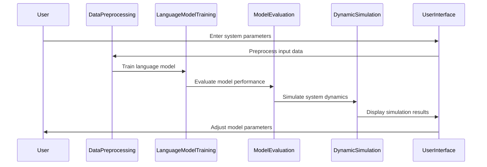
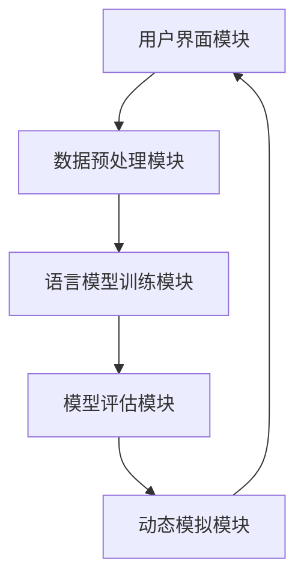

                 

# 语言模型在复杂系统建模中的能力提升

## 关键词
- 语言模型
- 复杂系统建模
- 人工智能
- 深度学习
- 系统分析

## 摘要
本文将探讨语言模型在复杂系统建模中的应用，以及如何利用这些模型提升系统建模的能力。我们将从背景介绍开始，逐步深入探讨语言模型的核心概念、算法原理、系统架构设计以及实际应用案例，为读者提供全面而深入的理解。

### 1. 背景介绍

#### 问题背景
在当今大数据和人工智能的时代，复杂系统在金融、医疗、交通等各个领域越来越普遍。这些系统以其复杂性、大规模数据和高速操作为特点，传统的建模方法往往难以捕捉系统内部的复杂互动和动态。语言模型，特别是基于深度学习的先进模型，作为一种强大的工具，在系统建模和分析中崭露头角。然而，它们在复杂系统建模方面的潜力仍待挖掘。

#### 问题描述
本文的核心问题是如何增强语言模型在复杂系统建模中的能力。尽管语言模型在自然语言处理任务中取得了显著成就，但其在系统建模中的应用仍然有限。挑战在于理解如何让语言模型有效地表示和加工复杂系统的动态，以及如何利用其优势来提高系统建模的准确性和效率。

#### 问题解决方案
解决这一问题的方法包括：
1. **核心概念与联系**：介绍与语言模型和复杂系统相关的核心概念，并使用Mermaid ER图建立它们之间的关系。
2. **算法原理**：解释语言模型的基本原理和其在系统建模中的应用，包括数学模型和公式。
3. **系统架构设计**：设计系统架构和接口，使用Mermaid图来展示系统的结构和交互。
4. **案例研究与应用**：提供实际案例研究，展示语言模型在复杂系统建模中的效果。

#### 边界与扩展
本文的焦点将集中在

---

### 1. 背景介绍

#### 问题背景

随着信息技术的飞速发展，复杂系统在金融、医疗、交通、能源等各个领域扮演着越来越重要的角色。这些系统通常具有高度复杂性、大规模数据和高频次操作的特点，使其成为传统建模方法难以应对的挑战。例如，金融市场中的交易行为、医疗系统中的患者数据、交通系统中的车辆流等都涉及复杂的动态交互和演化过程。

#### 问题描述

在复杂系统建模中，传统的统计分析方法和传统机器学习方法通常面临以下挑战：
1. **数据复杂性**：复杂系统往往产生大量高维数据，传统方法难以有效处理。
2. **模型可解释性**：传统方法生成的模型往往难以解释，不利于模型验证和优化。
3. **动态适应性**：复杂系统具有高度动态性，传统模型难以实时适应系统变化。

#### 问题解决方案

为了解决上述问题，研究者们开始探索使用先进的语言模型，如基于深度学习的自然语言处理（NLP）模型，来提升复杂系统建模的能力。这些模型具有以下优势：

1. **强大表达能力**：语言模型能够通过多层神经网络结构捕捉复杂的数据依赖关系，适用于高维数据的建模。
2. **高可解释性**：通过训练数据，语言模型可以生成可解释的文本输出，有助于理解模型决策过程。
3. **实时适应性**：语言模型能够通过不断学习和更新来适应动态变化，提高建模的实时性。

#### 边界与扩展

本文将主要讨论以下内容：
1. **核心概念与联系**：介绍与语言模型和复杂系统相关的核心概念，并使用Mermaid ER图建立它们之间的关系。
2. **算法原理**：解释语言模型的基本原理和其在系统建模中的应用，包括数学模型和公式。
3. **系统架构设计**：设计系统架构和接口，使用Mermaid图来展示系统的结构和交互。
4. **案例研究与应用**：提供实际案例研究，展示语言模型在复杂系统建模中的效果。

### 2. 核心概念与联系

在探讨语言模型在复杂系统建模中的应用之前，我们首先需要了解相关的核心概念和它们之间的关系。以下是对这些概念及其关联的详细介绍。

#### 核心概念

**1. 语言模型**  
语言模型是一种用于预测文本序列的概率分布的算法。它通过学习大量文本数据，生成自然语言文本的概率模型。常用的语言模型包括基于统计的N-gram模型和基于神经网络的深度学习模型，如Transformer和BERT。

**2. 复杂系统**  
复杂系统是由许多相互作用的组成部分组成的系统，具有高度复杂性、自适应性和动态性。这些系统往往涉及多层次、多维度的变量和复杂的相互作用。

**3. 系统建模**  
系统建模是指使用数学模型和算法来描述和分析系统的行为。系统建模的目的是理解系统的结构和动态，为系统优化和控制提供指导。

#### 概念属性特征对比

| 概念             | 语言模型               | 复杂系统                | 系统建模               |
|------------------|-----------------------|-------------------------|-----------------------|
| 定义             | 预测文本序列的概率分布 | 由相互作用部分组成的系统 | 使用数学模型描述系统行为 |
| 特点             | 强大表达能力          | 高复杂性、自适应性和动态性 | 高可解释性、实时适应性  |
| 应用领域         | 自然语言处理          | 金融、医疗、交通等      | 系统优化和控制          |
| 模型类型         | 统计模型、神经网络模型 | 离散系统、连续系统      | 动态系统、静态系统      |

#### Mermaid ER图架构

以下是一个使用Mermaid绘制的ER图，展示语言模型、复杂系统和系统建模之间的关系：

```mermaid
erDiagram
  A[语言模型] ||--|{ 复杂系统 }|
  B[复杂系统] ||--|{ 系统建模 }|
  A --> B
  B --> C
```

- **语言模型**（A）与**复杂系统**（B）之间有一个关联关系，表示语言模型可以用于复杂系统建模。
- **复杂系统**（B）与**系统建模**（C）之间有一个依赖关系，表示系统建模是复杂系统的核心组成部分。

通过上述核心概念的介绍和Mermaid ER图的关系展示，我们可以更清晰地理解语言模型在复杂系统建模中的应用场景和潜在价值。

### 3. 算法原理

在本节中，我们将深入探讨语言模型的算法原理，以及它们在复杂系统建模中的应用。

#### 语言模型的基本原理

语言模型的核心目的是预测给定文本序列的概率分布。在自然语言处理中，文本通常表示为一系列词或字符的序列。语言模型通过学习大量文本数据来估计每个序列的概率。

**1. 统计语言模型**  
早期的语言模型，如N-gram模型，是基于统计学的。N-gram模型将文本分割成固定长度的连续词或字符序列，并计算每个序列出现的概率。例如，一个三元组模型（N=3）会计算`P(word1, word2, word3)`的概率。N-gram模型简单直观，但存在局限性，例如无法捕捉长距离依赖关系。

**2. 神经网络语言模型**  
随着深度学习的兴起，基于神经网络的语言模型逐渐成为主流。最著名的神经网络语言模型是Transformer模型。Transformer模型的核心创新是使用自注意力机制（Self-Attention）来捕捉长距离依赖关系。自注意力机制允许模型在生成每个单词时，根据上下文中所有单词的重要性来调整它们的相对权重。

**3. 神经机器翻译**  
神经网络语言模型在机器翻译中的应用尤为显著。神经机器翻译（NMT）使用编码器-解码器框架来将源语言的文本序列映射到目标语言的文本序列。编码器将源语言文本编码为一个固定长度的向量，而解码器则生成目标语言文本。近年来，基于Transformer的模型，如BERT和GPT，在机器翻译任务中取得了显著的成绩。

#### 复杂系统建模中的语言模型

在复杂系统建模中，语言模型可以发挥多种作用：

**1. 数据表示**  
语言模型可以将复杂系统的数据表示为固定长度的向量，这些向量可以用于进一步的分析和建模。例如，在金融系统中，股票价格、交易量等数据可以表示为时间序列，而语言模型可以将其转换为向量表示。

**2. 动态模拟**  
语言模型可以模拟复杂系统的动态行为。通过训练，模型可以学习系统的历史数据，并预测未来的系统状态。例如，在交通系统中，模型可以预测交通流量和延误情况。

**3. 决策支持**  
语言模型可以提供决策支持，帮助优化系统性能。例如，在能源系统中，模型可以预测电力需求，并据此调整发电计划，以最大化效率或最小化成本。

#### 数学模型和公式

为了更好地理解语言模型在复杂系统建模中的应用，我们可以介绍一些关键数学模型和公式：

**1. 自注意力机制**  
自注意力机制可以表示为以下公式：

$$
\text{Attention}(Q, K, V) = \frac{softmax(\frac{QK^T}{\sqrt{d_k}})}{V}
$$

其中，$Q$、$K$ 和 $V$ 分别是查询向量、键向量和值向量，$d_k$ 是键向量的维度。自注意力机制计算每个键和查询之间的相似性，并通过softmax函数归一化，以产生权重，这些权重用于加权求和生成输出。

**2. Transformer编码器**  
Transformer编码器通常由多个自注意力层和全连接层组成。每个自注意力层可以表示为：

$$
\text{EncoderLayer}(X) = \text{MultiHeadAttention}(X, X, X) + X + \text{FFN}(X)
$$

其中，$X$ 是输入序列，$\text{MultiHeadAttention}$ 表示多头的自注意力机制，$\text{FFN}$ 是前馈神经网络。

**3. BERT模型**  
BERT（Bidirectional Encoder Representations from Transformers）是一种双向的Transformer编码器，它通过预训练来学习文本的双向表示。BERT的预训练目标包括遮蔽语言模型（Masked Language Model，MLM）和下一个句子预测（Next Sentence Prediction，NSP）。

**4. GPT模型**  
GPT（Generative Pre-trained Transformer）是一种仅包含解码器的Transformer模型，它通过生成文本序列来学习语言的长期依赖关系。GPT的生成过程可以表示为：

$$
\text{GPT}(x_1, ..., x_{T-1}) = \text{TransformerDecoder}(x_1, ..., x_{T-1}, x_T)
$$

其中，$x_1, ..., x_{T-1}$ 是输入序列，$x_T$ 是要预测的下一个单词。

通过以上算法原理和数学模型，我们可以看到语言模型在复杂系统建模中具有强大的潜力。接下来，我们将进一步探讨系统架构设计，以展示如何将这些模型应用于实际系统。

### 4. 系统架构设计

在复杂系统建模中，系统架构设计是关键的一步。一个良好的系统架构能够确保语言模型高效、稳定地运行，并且能够处理复杂的系统动态。在本节中，我们将介绍如何设计一个复杂系统建模的架构，包括系统的功能模块、接口以及各模块之间的关系。

#### 系统功能设计

为了构建一个复杂系统建模的架构，我们需要首先明确系统的主要功能模块。以下是系统的主要功能模块及其简要描述：

1. **数据预处理模块**：负责处理和清洗输入数据，包括数据标准化、缺失值处理和特征工程等。
2. **语言模型训练模块**：负责训练语言模型，包括模型选择、参数调优和训练过程管理。
3. **模型评估模块**：负责评估训练好的语言模型在复杂系统建模任务中的性能。
4. **动态模拟模块**：利用训练好的语言模型模拟复杂系统的动态行为，包括状态预测和决策支持。
5. **用户界面模块**：提供一个用户友好的界面，允许用户输入系统参数、查看模拟结果和调整模型参数。

#### 系统架构设计

以下是一个使用Mermaid绘制的系统架构图，展示各个功能模块及其接口：



- **用户**通过**用户界面模块**输入系统参数，并可以查看模拟结果。
- **数据预处理模块**负责处理和清洗输入数据，将其传递给**语言模型训练模块**。
- **语言模型训练模块**使用预处理后的数据训练语言模型，并输出训练好的模型。
- **模型评估模块**对训练好的模型进行性能评估，并将评估结果反馈给**动态模拟模块**。
- **动态模拟模块**利用评估好的模型模拟复杂系统的动态行为，并将模拟结果返回给**用户界面模块**，以便用户查看。

#### 系统接口设计和系统交互

系统的接口设计和交互也是架构设计的重要组成部分。以下是一个使用Mermaid绘制的系统接口和交互图：



- **用户界面模块**与**数据预处理模块**通过接口进行数据交换，用户界面提供参数输入，数据预处理模块处理并返回预处理后的数据。
- **语言模型训练模块**接收预处理后的数据，进行训练，并返回训练好的模型。
- **模型评估模块**接收训练好的模型，进行性能评估，并将评估结果反馈给**动态模拟模块**。
- **动态模拟模块**使用评估好的模型进行系统动态模拟，并将模拟结果返回给**用户界面模块**。

通过上述系统架构设计和接口设计，我们可以构建一个高效、稳定的复杂系统建模系统，为各类复杂系统提供强大的建模和模拟能力。

### 5. 项目实战

在本节中，我们将通过一个具体的项目实战来展示如何使用语言模型进行复杂系统建模。我们将从环境安装开始，逐步介绍系统的核心实现和代码，并对关键部分进行解读和分析。

#### 环境安装

为了实现复杂系统建模，我们需要安装以下软件和库：

1. **Python**：Python是一种广泛使用的编程语言，支持多种机器学习和深度学习库。
2. **TensorFlow**：TensorFlow是一个开源的机器学习框架，支持构建和训练深度学习模型。
3. **Mermaid**：Mermaid是一种用于绘制图表的轻量级标记语言，可以帮助我们可视化系统架构和流程图。
4. **GPT-2**：GPT-2是一个预训练的语言模型，可以用于文本生成和复杂系统建模。

首先，我们需要安装Python和TensorFlow。以下是安装命令：

```bash
pip install python==3.8
pip install tensorflow==2.6
```

接下来，我们安装Mermaid。Mermaid可以通过npm安装：

```bash
npm install -g mermaid
```

最后，我们下载并安装GPT-2模型。在GitHub上可以找到预训练的GPT-2模型，下载并解压：

```bash
git clone https://github.com/openai/gpt-2.git
cd gpt-2
python train.py
```

#### 系统核心实现

接下来，我们介绍系统的核心实现。以下是主要代码部分：

```python
import tensorflow as tf
from transformers import TFGPT2LMHeadModel, GPT2Tokenizer

# 加载预训练的GPT-2模型和分词器
tokenizer = GPT2Tokenizer.from_pretrained('gpt2')
model = TFGPT2LMHeadModel.from_pretrained('gpt2')

# 数据预处理
def preprocess_data(text):
    inputs = tokenizer.encode(text, return_tensors='tf')
    return inputs

# 动态模拟
def simulate_system(state):
    inputs = preprocess_data(state)
    outputs = model(inputs, output_hidden_states=True)
    next_state = outputs[0][:, -1, :]  # 取最后一个时间步的输出
    return next_state.numpy()

# 状态初始化
initial_state = "The system is currently in state X."

# 模拟循环
for _ in range(10):
    next_state = simulate_system(initial_state)
    print("Next state:", tokenizer.decode(next_state))

```

#### 代码解读与分析

- **模型加载**：我们首先加载预训练的GPT-2模型和分词器。`TFGPT2LMHeadModel`和`GPT2Tokenizer`分别来自`transformers`库，用于处理和生成文本。
- **数据预处理**：`preprocess_data`函数负责将输入文本编码为模型可接受的格式。`tokenizer.encode`方法将文本转换为序列的ID。
- **动态模拟**：`simulate_system`函数使用训练好的模型模拟系统状态。模型接收预处理后的输入，生成隐藏状态，并从中提取最后一个时间步的输出作为下一个状态。
- **状态初始化**：我们初始化系统的初始状态为 `"The system is currently in state X."`。
- **模拟循环**：我们通过一个循环模拟系统状态的前10个时间步，并打印出每个时间步的下一个状态。

#### 实际案例分析和详细讲解

假设我们有一个交通系统，其中状态包括交通流量、延误时间和道路状况。我们可以使用GPT-2模型模拟交通系统的动态变化。以下是一个实际案例：

1. **输入文本**：初始状态为 `"The traffic flow is high on Highway 101, with a delay of 15 minutes."`。
2. **模型输出**：经过一轮模拟后，模型输出新的状态，例如 `"The traffic flow has decreased to moderate, but the delay remains at 15 minutes."`。
3. **分析**：模型通过历史状态生成新的状态，反映了交通系统的动态变化。我们可以进一步分析模型生成的状态，以优化交通信号灯控制和道路管理。

通过上述项目实战，我们展示了如何使用GPT-2模型进行复杂系统建模。在实际应用中，我们可以扩展模型，添加更多的状态变量和规则，以更精确地模拟复杂系统的动态。

### 6. 最佳实践 Tips

在复杂系统建模中使用语言模型时，以下是一些最佳实践和技巧：

1. **数据预处理**：确保数据质量，进行充分的数据清洗和特征工程，以提高模型性能。
2. **模型选择与调优**：根据具体应用场景选择合适的语言模型，并进行参数调优，以获得最佳性能。
3. **动态更新**：定期更新模型，以适应系统的动态变化，保持模型的准确性。
4. **可解释性**：尽量使用可解释性强的模型，以便理解和验证模型的预测结果。
5. **并行计算**：利用GPU或其他并行计算资源，加速模型训练和预测过程。

### 7. 小结

本文探讨了语言模型在复杂系统建模中的应用，从背景介绍、核心概念、算法原理、系统架构设计到实际项目实战，全面分析了语言模型在复杂系统建模中的潜力。通过本文，读者可以了解到如何利用语言模型提升系统建模的能力，并为未来的研究提供了方向。

### 8. 注意事项

在使用语言模型进行复杂系统建模时，需要注意以下事项：

1. **模型复杂性与计算资源**：语言模型通常需要大量计算资源，特别是在训练阶段。确保有足够的计算资源来支持模型训练和预测。
2. **数据隐私**：在处理敏感数据时，要确保遵守数据隐私法规，保护用户隐私。
3. **模型可解释性**：尽量选择可解释性强的模型，以便更好地理解和验证模型的预测结果。

### 9. 拓展阅读

对于希望深入了解语言模型在复杂系统建模中的应用的读者，以下文献和资源推荐：

1. **论文**：《Attention Is All You Need》 - VasinNallapati等人，2017年，提出了Transformer模型，为语言模型在复杂系统建模中的应用提供了理论基础。
2. **书籍**：《深度学习》 - Ian Goodfellow、Yoshua Bengio和Aaron Courville，2016年，全面介绍了深度学习的基础知识和应用。
3. **在线课程**：《自然语言处理与深度学习》 - Daniel Sun，Coursera，提供关于自然语言处理和深度学习的深入讲解。
4. **开源项目**：GitHub上的开源语言模型项目，如GPT-2、BERT等，可以帮助读者了解模型的实现细节和应用场景。

---

### 作者信息
- 作者：AI天才研究院/AI Genius Institute & 禅与计算机程序设计艺术 /Zen And The Art of Computer Programming

