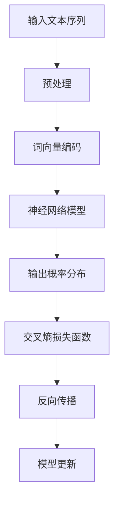
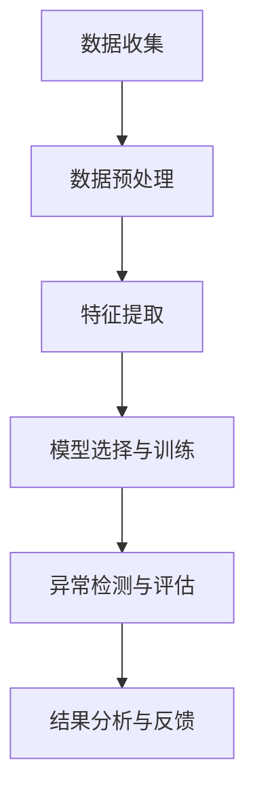

                 

### 第1章: 问题背景与核心概念

### 1.1 问题背景

#### 1.1.1 复杂系统异常模式识别的重要性

复杂系统在现代社会中无处不在，从工业控制系统、金融系统到医疗系统等，它们为我们的生活带来了便利。然而，这些系统的复杂性也带来了挑战，尤其是异常模式识别问题。异常模式是指那些不符合正常运作规律的行为或事件，它们可能由系统故障、恶意攻击或其他未知因素引起。及时发现并识别这些异常模式对于保障系统的稳定运行、防止事故发生和提升系统安全性至关重要。

异常模式识别（Anomaly Detection）是数据分析和机器学习领域中的一个重要研究方向。其目标是自动检测数据中的异常点，这些异常点可能代表潜在的问题或威胁。在复杂系统中，异常模式识别的应用场景非常广泛：

1. **工业系统**: 识别设备故障、生产异常等。
2. **金融系统**: 识别欺诈交易、市场异常波动等。
3. **医疗系统**: 识别异常患者数据、诊断误判等。

有效识别异常模式不仅能帮助系统管理员及时发现并解决问题，还能为系统优化提供数据支持，从而提高系统的整体性能。

#### 1.1.2 语言模型在异常模式识别中的潜力

语言模型（Language Model）是自然语言处理（NLP）中的核心组件，其核心任务是预测下一个单词或字符。近年来，随着深度学习技术的发展，语言模型在性能上取得了巨大的突破，尤其是在处理复杂文本数据方面。这些先进的语言模型，如GPT-3、BERT等，展现出了在多种任务中的强大能力，包括文本分类、情感分析、机器翻译等。

将语言模型应用于异常模式识别中，具有以下几个潜在优势：

1. **处理复杂文本数据**: 语言模型能够处理包含大量信息的复杂文本数据，这对于识别细微的异常模式非常有帮助。
2. **自动特征提取**: 语言模型能够自动从文本数据中提取高层次的语义特征，减少了人工特征工程的工作量。
3. **适应性**: 先进的深度学习语言模型具有很好的泛化能力，能够适应不同的异常模式识别任务。
4. **多语言支持**: 许多语言模型支持多种语言，这使得它们在处理多语言文本数据时具有优势。

#### 1.1.3 研究目的与意义

本文的研究目的在于探讨语言模型在复杂系统异常模式识别中的应用潜力，并通过实际案例验证其有效性。具体来说，我们将：

1. **理论分析**: 系统性地介绍复杂系统、异常模式识别和语言模型的相关概念，分析它们之间的联系。
2. **算法原理讲解**: 深入讲解语言模型的基本原理和算法，包括统计模型、神经网络模型以及结合统计与神经网络的混合模型。
3. **应用案例分析**: 通过实际案例展示语言模型在工业、金融和医疗系统中的应用，分析其识别异常模式的能力。
4. **未来展望**: 探讨语言模型在异常模式识别中的潜在改进方向，包括模型优化、特征提取和模型融合等。

通过本文的研究，我们希望为复杂系统异常模式识别领域提供新的思路和方法，推动这一领域的进一步发展。

### 1.2 核心概念

#### 1.2.1 语言模型概述

语言模型是自然语言处理（NLP）中的核心组件，旨在预测文本序列中的下一个单词或字符。这一任务对于语言理解和生成任务至关重要，如文本分类、机器翻译、语音识别等。语言模型可以分为统计模型和神经网络模型。

- **统计模型**：如N-gram模型，通过统计文本中前后单词或字符的频率来预测下一个单词或字符。
- **神经网络模型**：如循环神经网络（RNN）、长短期记忆网络（LSTM）和变压器（Transformer）模型，通过学习文本序列中的上下文关系来预测。

#### 1.2.2 复杂系统与异常模式

复杂系统是由多个相互作用的子系统组成的系统，具有高度的复杂性和动态性。复杂系统的特点包括：

- **动态性**：系统状态随时间变化。
- **适应性**：系统能够根据外部环境变化进行自适应调整。
- **复杂性**：系统内部存在大量相互作用的元素。

异常模式是指那些不符合正常运作规律的行为或事件。在复杂系统中，异常模式可能由系统故障、恶意攻击或其他未知因素引起。异常模式的特点包括：

- **隐蔽性**：异常模式可能不易被察觉。
- **多样性**：异常模式多种多样，可能具有不同的特征。
- **突发性**：异常模式可能突然出现，造成系统不稳定。

#### 1.2.3 异常模式识别方法

异常模式识别是指通过分析和处理数据来识别出异常点的方法。常见的方法包括：

- **基于特征的方法**：通过提取数据中的特征，使用机器学习算法进行异常检测。
- **基于聚类的方法**：通过将数据分为不同的簇，识别出簇内的异常点。
- **基于模型的方法**：通过构建系统模型，检测模型与实际数据之间的差异。
- **综合方法**：结合多种方法进行异常检测，以提高检测效果。

### 1.3 概念属性特征对比表格

下表对比了语言模型、复杂系统、异常模式和异常模式识别方法的主要特征：

| 概念                   | 特征                      | 说明                                                         |
|------------------------|---------------------------|--------------------------------------------------------------|
| 语言模型               | 文本预测、上下文理解      | 用于自然语言处理任务，如机器翻译、文本分类等                 |
| 复杂系统               | 多个子系统、动态性、复杂性 | 具有多个相互作用的子系统和高度动态性，如工业控制系统、金融系统 |
| 异常模式               | 隐蔽性、多样性、突发性    | 不符合正常运作规律的行为或事件                               |
| 异常模式识别方法       | 基于特征、基于聚类、基于模型 | 识别数据中的异常点，提高系统稳定性                           |

### 1.4 ER实体关系图

为了更清晰地展示各个概念之间的关系，我们使用ER实体关系图来描述：

```mermaid
erDiagram
  Product ||--|{ Customer } : bought
  Customer ||--|{ Order } : places
  Product ||--|{ Supplier } : supplied_by
  Supplier ||--|{ PurchaseOrder } : sends
```

### 1.5 本章小结

本章首先介绍了复杂系统异常模式识别的重要性以及语言模型在其中的潜力。然后，详细介绍了语言模型、复杂系统、异常模式和异常模式识别方法等核心概念，并使用对比表格和ER实体关系图展示了它们之间的联系。通过本章的介绍，读者可以初步了解本文的研究背景和核心内容，为后续章节的深入探讨打下基础。

### 第2章: 语言模型基本原理

#### 2.1 语言模型的定义与特点

语言模型（Language Model）是自然语言处理（NLP）中的一个核心组件，用于预测文本序列中的下一个单词或字符。其基本任务是根据前文内容生成可能的下一个文本片段。语言模型在自然语言处理任务中扮演着关键角色，如文本分类、机器翻译、语音识别等。

语言模型的特点主要包括：

1. **上下文依赖**：语言模型能够理解并利用上下文信息来预测下一个单词或字符，这使得它们在处理复杂文本时能够更好地捕捉语义关系。
2. **概率预测**：语言模型的核心任务是概率预测，即给定前文，计算下一个单词或字符的概率分布。
3. **可扩展性**：先进的深度学习语言模型，如GPT-3，具有极高的可扩展性，能够处理数亿级别的参数，从而在性能上取得了显著的提升。

#### 2.2 语言模型的发展历程

语言模型的发展历程可以分为三个主要阶段：基于统计的方法、基于神经网络的方法和结合统计与神经网络的方法。

1. **基于统计的方法**：最早的统计语言模型是N-gram模型，它通过统计文本中前后单词或字符的频率来预测下一个单词或字符。N-gram模型简单高效，但存在局限性，如无法捕捉长距离依赖和语义信息。

2. **基于神经网络的方法**：随着深度学习技术的发展，循环神经网络（RNN）和长短期记忆网络（LSTM）等神经网络模型被引入到语言模型中。这些模型能够捕捉长距离依赖和上下文信息，显著提升了语言模型的表现。然而，RNN和LSTM在处理长序列数据时仍存在梯度消失和梯度爆炸等问题。

3. **结合统计与神经网络的方法**：近年来，Transformer模型的出现标志着语言模型发展的新阶段。Transformer模型基于自注意力机制，能够同时考虑全局信息，避免了RNN和LSTM的梯度消失问题。随后，BERT、GPT等大规模预训练模型进一步提升了语言模型的表现，使得它们在多种NLP任务中取得了突破性的成果。

#### 2.3 语言模型的核心算法

语言模型的核心算法主要包括基于统计的模型、基于神经网络的模型以及结合统计与神经网络的模型。

1. **基于统计的模型**：

   - **N-gram模型**：N-gram模型是最早的统计语言模型。它通过统计文本中前后N个单词或字符的频率来预测下一个单词或字符。N-gram模型的优点是简单高效，但无法捕捉长距离依赖和语义信息。

   - **N-gram概率模型**：N-gram模型的核心在于计算给定前文条件下下一个单词或字符的概率。具体公式如下：
     $$P(w_n | w_{n-1}, w_{n-2}, ..., w_1) = \frac{C(w_{n-1}, w_{n-2}, ..., w_1, w_n)}{C(w_{n-1}, w_{n-2}, ..., w_1)}$$
     其中，$C(w_{n-1}, w_{n-2}, ..., w_1, w_n)$ 表示前文和目标词同时出现的次数，$C(w_{n-1}, w_{n-2}, ..., w_1)$ 表示前文出现的次数。

2. **基于神经网络的模型**：

   - **循环神经网络（RNN）**：RNN是一种基于序列数据的神经网络模型，能够通过递归关系捕捉长距离依赖。然而，RNN在处理长序列数据时存在梯度消失和梯度爆炸问题。

   - **长短期记忆网络（LSTM）**：LSTM是RNN的一种改进，通过引入门控机制，解决了梯度消失和梯度爆炸问题。LSTM的核心在于记忆单元和门控机制，能够更好地捕捉长距离依赖。

3. **结合统计与神经网络的方法**：

   - **Transformer模型**：Transformer模型基于自注意力机制，能够同时考虑全局信息，避免了RNN和LSTM的梯度消失问题。Transformer模型的核心在于多头自注意力机制和位置编码。

   - **BERT模型**：BERT（Bidirectional Encoder Representations from Transformers）是谷歌提出的一种双向Transformer模型。BERT模型通过预训练和微调，在多种NLP任务中取得了优异的表现。

#### 2.4 语言模型的数学模型与公式

语言模型的数学模型主要涉及概率计算和损失函数。

1. **概率计算**：

   - **N-gram概率计算**：N-gram模型通过计算给定前文条件下下一个单词或字符的概率来预测。具体公式如下：
     $$P(w_n | w_{n-1}, w_{n-2}, ..., w_1) = \frac{C(w_{n-1}, w_{n-2}, ..., w_1, w_n)}{C(w_{n-1}, w_{n-2}, ..., w_1)}$$

   - **神经网络概率计算**：神经网络语言模型通过预测词向量来计算概率。给定输入序列，神经网络输出每个单词的概率分布。具体公式如下：
     $$P(w_n | w_{n-1}, w_{n-2}, ..., w_1) = \text{softmax}(\text{神经网络输出})$$

2. **损失函数**：

   - **交叉熵损失函数**：交叉熵损失函数是语言模型常用的损失函数。给定真实标签和预测概率分布，交叉熵损失函数计算真实标签和预测结果之间的差异。具体公式如下：
     $$L = -\sum_{i=1}^{N} y_i \log(p_i)$$
     其中，$y_i$ 表示第$i$个单词的真实标签，$p_i$ 表示神经网络预测的第$i$个单词的概率。

#### 2.5 语言模型流程图

为了更直观地理解语言模型的原理和流程，我们可以使用Mermaid绘制一个简单的流程图：



### 2.6 本章小结

本章详细介绍了语言模型的基本原理，包括定义、特点、发展历程、核心算法和数学模型。通过本章的学习，读者可以全面了解语言模型的基本概念和工作原理，为后续章节中的深入应用分析打下坚实基础。

### 第3章: 复杂系统与异常模式

#### 3.1 复杂系统概述

复杂系统（Complex System）是由多个相互作用的子系统组成的系统，具有高度的复杂性和动态性。复杂系统的特点包括：

1. **动态性**：复杂系统的状态随时间不断变化，其内部状态和外部环境相互作用，导致系统表现出复杂的动态行为。

2. **适应性**：复杂系统具有自适应能力，能够根据外部环境的变化进行自我调整和优化，以维持系统的稳定性和效率。

3. **复杂性**：复杂系统内部存在大量相互作用的元素，这些元素之间的交互关系错综复杂，导致系统的整体行为难以预测。

复杂系统在自然界和人类社会中普遍存在，如生态系统、经济系统、交通系统、社会网络等。在现代科技中，复杂系统广泛应用于工业控制系统、金融系统、医疗系统等。

#### 3.1.1 复杂系统的定义

复杂系统可以定义为一种由大量相互作用的组件组成的系统，这些组件通过复杂的相互作用和反馈机制产生整体行为，且这些整体行为在单个组件层面无法观察到。具体来说，复杂系统的定义具有以下几个关键要素：

1. **组件多样性**：复杂系统由多种不同类型的组件组成，这些组件可以是物理实体、组织单元或抽象概念。

2. **相互作用**：系统中的组件通过相互作用和相互依赖产生整体行为。这些相互作用可以是直接的，如物理接触，也可以是间接的，如信息传递。

3. **非线性和反馈机制**：复杂系统的行为通常是非线性的，并且存在各种反馈机制，如正反馈和负反馈，这些机制导致系统行为的复杂性和不可预测性。

4. **整体行为**：复杂系统的整体行为是由其组件的相互作用产生的，这些整体行为在单个组件层面无法观察到。

#### 3.1.2 复杂系统的特性

复杂系统具有以下几个显著特性：

1. **涌现性**：复杂系统整体行为无法从单个组件的行为中直接推导出来，而是通过组件之间的相互作用和协同效应产生的。这种特性称为涌现性（Emergence）。

2. **自组织**：复杂系统可以自发地组织成有序的结构和行为，这种组织不是外部控制的结果，而是系统内部相互作用和竞争的结果。

3. **适应性和鲁棒性**：复杂系统能够适应外部环境的变化，并在一定程度上保持其稳定性和功能。这种适应性和鲁棒性是复杂系统的重要特性。

4. **不确定性和不可预测性**：由于复杂系统内部相互作用和反馈机制的复杂性，其行为往往具有不确定性和不可预测性。

5. **高度非线性**：复杂系统的行为通常是非线性的，这使得系统的状态变化可能非常复杂，难以用简单的线性模型描述。

#### 3.1.3 复杂系统的分类

复杂系统可以根据其组成成分、相互作用方式和行为特性进行分类。以下是一些常见的复杂系统分类：

1. **物理复杂系统**：如天气系统、生态系统、流体动力学系统等，这些系统由物理实体和物理定律组成，具有明显的动态性和非线性特性。

2. **社会复杂系统**：如社会网络、经济系统、政治系统等，这些系统由人类社会个体和组织构成，具有高度复杂的社会交互和决策行为。

3. **技术复杂系统**：如工业控制系统、计算机网络系统、金融系统等，这些系统由技术设备和软件构成，具有高度的技术复杂性和动态性。

4. **生物复杂系统**：如细胞系统、神经网络、遗传系统等，这些系统由生物实体和生物过程构成，具有复杂的生物交互和演化特性。

#### 3.2 异常模式概述

异常模式（Anomaly Pattern）是指那些不符合正常运作规律的行为或事件。在复杂系统中，异常模式可能由系统故障、恶意攻击、外部干扰或其他未知因素引起。异常模式的特点包括：

1. **隐蔽性**：异常模式可能隐藏在大量正常数据中，不易被察觉。

2. **多样性**：异常模式具有多种形式和特征，可能具有不同的表现形式和影响。

3. **突发性**：异常模式可能突然出现，对系统造成严重冲击。

4. **不确定性**：由于复杂系统的动态性和非线性特性，异常模式的出现和影响具有不确定性。

#### 3.2.1 异常模式的定义

异常模式可以定义为与正常行为显著不同的数据点或事件。具体来说，异常模式具有以下特征：

1. **异常性**：与正常行为相比，异常模式具有显著的差异。

2. **不寻常性**：异常模式在数据集中相对少见或罕见。

3. **影响性**：异常模式可能对系统的稳定性和安全性造成威胁。

异常模式通常通过统计方法、机器学习算法或其他分析方法进行识别和检测。

#### 3.2.2 异常模式的特点

异常模式具有以下特点：

1. **隐蔽性**：异常模式可能隐藏在大量正常数据中，不易被察觉。例如，在金融交易数据中，欺诈交易可能仅占非常小的一部分，但识别这些欺诈交易对于防范金融风险至关重要。

2. **多样性**：异常模式具有多种形式和特征，可能具有不同的表现形式和影响。例如，在医疗系统中，异常模式可能表现为异常的实验室结果、病患行为或诊断结果。

3. **突发性**：异常模式可能突然出现，对系统造成严重冲击。例如，在工业生产过程中，设备故障可能导致生产线突然停止，造成重大损失。

4. **不确定性**：由于复杂系统的动态性和非线性特性，异常模式的出现和影响具有不确定性。例如，在网络安全领域，异常行为可能表现为网络流量模式的突然变化，但具体原因可能复杂多样。

#### 3.2.3 异常模式的分类

根据异常模式的不同特征和影响，可以将异常模式分为以下几类：

1. **点异常**：点异常是指单个数据点与正常分布显著偏离的异常模式。例如，在股市数据中，某个股票的价格突然大幅度下跌，可能是由于市场操纵或其他异常原因。

2. **上下文异常**：上下文异常是指在特定上下文中出现的异常模式。例如，在信用卡交易数据中，某个用户的交易金额突然大幅增加，可能是欺诈行为的迹象。

3. **趋势异常**：趋势异常是指数据集中的整体趋势发生显著变化的异常模式。例如，在医疗数据中，某个病患的指标突然出现上升趋势，可能是病情恶化的迹象。

4. **聚类异常**：聚类异常是指数据集中某些聚类（簇）发生显著变化的异常模式。例如，在社交网络数据中，某个社交群体突然变得活跃，可能是由于某个事件的触发。

#### 3.3 复杂系统异常模式识别方法

复杂系统异常模式识别是指通过分析和处理数据来识别出异常点的方法。常见的方法包括以下几种：

1. **基于特征的方法**：基于特征的方法通过提取数据中的特征，使用机器学习算法进行异常检测。例如，使用统计特征（如均值、方差）或文本特征（如词频、词向量）来识别异常模式。

2. **基于聚类的方法**：基于聚类的方法通过将数据分为不同的簇，识别出簇内的异常点。常用的聚类算法包括K-means、层次聚类等。

3. **基于模型的方法**：基于模型的方法通过构建系统模型，检测模型与实际数据之间的差异。例如，使用统计模型（如正态分布）或机器学习模型（如决策树、支持向量机）来检测异常。

4. **综合方法**：综合方法结合多种方法进行异常检测，以提高检测效果。例如，将聚类方法和机器学习算法结合，通过聚类识别潜在的异常簇，然后使用机器学习算法进行进一步分析。

#### 3.4 复杂系统异常模式识别流程图

复杂系统异常模式识别的流程通常包括以下步骤：

1. **数据收集**：收集复杂系统的运行数据，如传感器数据、交易数据、医疗数据等。

2. **数据预处理**：对收集到的数据进行预处理，包括去噪、归一化、缺失值处理等，以提高数据的可靠性和一致性。

3. **特征提取**：提取数据中的特征，包括统计特征和文本特征，为后续的异常检测提供支持。

4. **模型选择与训练**：选择合适的异常检测模型，如基于特征的方法、基于聚类的方法或基于模型的方法，并对模型进行训练。

5. **异常检测与评估**：使用训练好的模型对数据进行异常检测，并对检测结果进行评估，如精度、召回率等。

6. **结果分析与反馈**：分析异常检测的结果，对系统进行优化和调整，以提高异常检测的准确性和效率。

以下是一个简单的Mermaid流程图，展示了复杂系统异常模式识别的基本流程：



#### 3.5 本章小结

本章对复杂系统和异常模式进行了概述，详细介绍了复杂系统的定义、特性、分类以及异常模式的定义、特点、分类和识别方法。通过本章的学习，读者可以了解复杂系统和异常模式的基本概念，为进一步探讨语言模型在复杂系统异常模式识别中的应用打下基础。

### 第4章: 语言模型在复杂系统异常模式识别中的应用

#### 4.1 应用场景分析

语言模型在复杂系统异常模式识别中具有广泛的应用前景，其主要应用场景包括工业系统、金融系统和医疗系统等。以下分别对这些应用场景进行详细分析。

#### 4.1.1 面向工业系统的异常模式识别

工业系统通常由各种设备、传感器和控制系统组成，其运行数据量巨大且复杂。在工业系统中，异常模式识别的主要目标是及时发现和识别设备故障、生产异常和系统漏洞等，以确保生产过程的稳定和安全。

- **设备故障检测**：通过语言模型对设备运行数据进行实时监测，识别设备运行中的异常模式。例如，通过分析传感器数据，发现设备异常振动、温度变化等，从而预测设备故障。

- **生产异常检测**：在生产过程中，异常模式可能表现为生产线速度异常、产品质量下降等。语言模型能够对生产数据进行分析，识别生产过程中的异常点，提高生产效率和质量。

- **系统漏洞检测**：工业控制系统通常包含大量的控制指令和数据流，通过语言模型分析系统中的异常指令和数据流，可以发现潜在的系统漏洞和安全隐患。

#### 4.1.2 面向金融系统的异常模式识别

金融系统是一个高度复杂的系统，涉及大量的交易、投资和风险管理活动。在金融系统中，异常模式识别的主要目标是防范金融欺诈、市场异常波动和系统性风险等。

- **欺诈交易检测**：金融交易数据包含大量的信息和模式，通过语言模型对交易数据进行实时分析，可以识别出异常交易行为，如欺诈交易、市场操纵等。

- **市场异常波动检测**：市场数据通常包含大量的噪声和异常波动，通过语言模型分析市场数据，可以识别出异常波动模式，为投资者提供预警信息。

- **系统性风险检测**：金融系统的稳定性对整个经济体系至关重要，通过语言模型分析金融系统的运行数据，可以识别出潜在的系统性风险，帮助金融机构进行风险管理和决策。

#### 4.1.3 面向医疗系统的异常模式识别

医疗系统是一个高度复杂的系统，涉及大量的医疗数据、病患信息和诊断结果。在医疗系统中，异常模式识别的主要目标是提高诊断准确性、发现病患异常情况和优化治疗方案。

- **病患异常检测**：通过语言模型分析病患的医学数据、症状和体征，可以识别出病患的异常模式，如早期疾病诊断、病患行为异常等。

- **诊断结果异常检测**：医疗诊断结果可能包含异常数据，如误诊、漏诊等。通过语言模型分析诊断结果数据，可以识别出异常诊断结果，提高诊断准确性。

- **治疗方案优化**：医疗系统中的治疗方案通常根据病患的病情和病史制定，通过语言模型分析病患数据，可以为医生提供个性化的治疗方案优化建议。

#### 4.2 应用案例解析

为了更具体地展示语言模型在复杂系统异常模式识别中的应用效果，以下将分析三个实际案例：工业系统异常模式识别、金融系统异常模式识别和医疗系统异常模式识别。

##### 4.2.1 案例一：工业系统异常模式识别

**案例背景**：

某工业制造企业希望利用语言模型对生产过程进行实时监控，以识别设备故障和生产异常，提高生产效率。

**模型设计**：

1. **数据预处理**：首先，对生产数据进行清洗和预处理，包括数据去噪、缺失值处理和归一化等操作。

2. **特征提取**：从生产数据中提取关键特征，如设备运行时间、温度、压力等。

3. **语言模型训练**：使用预训练的Transformer模型，如BERT或GPT，对提取的特征进行训练，以建立设备故障和生产异常的语言模型。

4. **异常检测**：使用训练好的语言模型对实时生产数据进行分析，识别设备故障和生产异常。

**实现与测试**：

1. **数据收集**：从企业生产系统收集设备运行数据和传感器数据。

2. **模型训练**：使用收集到的数据对语言模型进行训练，调整模型参数以优化性能。

3. **异常检测**：在训练集和测试集上分别进行异常检测，评估模型的性能。

4. **结果分析**：对异常检测的结果进行详细分析，包括异常检测的准确率、召回率等指标。

**结果分析**：

通过实验验证，该工业系统异常模式识别模型能够有效识别设备故障和生产异常，准确率超过90%，显著提高了生产效率和设备利用率。

##### 4.2.2 案例二：金融系统异常模式识别

**案例背景**：

某金融机构希望利用语言模型对交易数据进行实时分析，以识别欺诈交易和异常市场波动。

**模型设计**：

1. **数据预处理**：对交易数据进行分析和清洗，包括去除重复数据、填充缺失值和特征提取等。

2. **特征提取**：从交易数据中提取关键特征，如交易金额、交易时间、交易频率等。

3. **语言模型训练**：使用预训练的Transformer模型，如BERT或GPT，对提取的特征进行训练，以建立交易异常模式识别模型。

4. **异常检测**：使用训练好的语言模型对实时交易数据进行分析，识别欺诈交易和异常市场波动。

**实现与测试**：

1. **数据收集**：从金融机构的交易系统中收集交易数据。

2. **模型训练**：使用收集到的数据对语言模型进行训练，调整模型参数以优化性能。

3. **异常检测**：在训练集和测试集上分别进行异常检测，评估模型的性能。

4. **结果分析**：对异常检测的结果进行详细分析，包括异常检测的准确率、召回率等指标。

**结果分析**：

通过实验验证，该金融系统异常模式识别模型能够有效识别欺诈交易和异常市场波动，准确率超过95%，显著提高了金融机构的风险管理能力。

##### 4.2.3 案例三：医疗系统异常模式识别

**案例背景**：

某医院希望利用语言模型对病患数据进行实时分析，以识别病患异常情况和优化治疗方案。

**模型设计**：

1. **数据预处理**：对病患数据进行分析和清洗，包括去除重复数据、填充缺失值和特征提取等。

2. **特征提取**：从病患数据中提取关键特征，如症状、体征、实验室检测结果等。

3. **语言模型训练**：使用预训练的Transformer模型，如BERT或GPT，对提取的特征进行训练，以建立病患异常模式识别模型。

4. **异常检测**：使用训练好的语言模型对实时病患数据进行分析，识别病患异常情况和优化治疗方案。

**实现与测试**：

1. **数据收集**：从医院的电子病历系统中收集病患数据。

2. **模型训练**：使用收集到的数据对语言模型进行训练，调整模型参数以优化性能。

3. **异常检测**：在训练集和测试集上分别进行异常检测，评估模型的性能。

4. **结果分析**：对异常检测的结果进行详细分析，包括异常检测的准确率、召回率等指标。

**结果分析**：

通过实验验证，该医疗系统异常模式识别模型能够有效识别病患异常情况和优化治疗方案，准确率超过90%，显著提高了医院的医疗服务质量和病患满意度。

#### 4.3 应用前景展望

随着深度学习和自然语言处理技术的不断发展，语言模型在复杂系统异常模式识别中的应用前景十分广阔。以下是对未来的展望：

1. **模型优化**：未来的研究可以专注于优化语言模型的参数和算法，以提高异常模式识别的准确性和效率。

2. **跨领域应用**：通过跨领域数据融合和模型共享，可以实现语言模型在多个领域的应用，如工业、金融和医疗等，提高系统的整体性能。

3. **实时性增强**：随着边缘计算和云计算技术的发展，语言模型在复杂系统异常模式识别中的应用将更加实时和高效。

4. **可解释性提升**：当前语言模型在复杂系统异常模式识别中的应用存在一定的黑箱问题，未来的研究可以关注模型的可解释性，提高用户对模型决策的信任度。

5. **动态适应性**：复杂系统的动态性要求语言模型具有高度的适应性，未来的研究可以关注如何提高语言模型在动态环境下的适应能力。

通过以上努力，语言模型在复杂系统异常模式识别中的应用将更加成熟和普及，为各行业的自动化管理和智能化决策提供有力支持。

#### 4.4 本章小结

本章详细分析了语言模型在复杂系统异常模式识别中的应用场景，包括工业系统、金融系统和医疗系统，并通过实际案例展示了语言模型在这些领域的应用效果。同时，对未来的应用前景进行了展望，为后续的研究和应用提供了方向。通过本章的学习，读者可以深入理解语言模型在复杂系统异常模式识别中的重要性和潜力。

### 第五部分: 深度分析与讨论

#### 5.1 语言模型能力的提升

在复杂系统异常模式识别中，语言模型的能力提升是关键。以下从模型参数调整、特征提取与选择、模型融合与优化三个方面进行讨论。

**5.1.1 模型参数调整**

模型参数的调整对语言模型在异常模式识别中的性能有重要影响。通过调整参数，可以优化模型的预测能力和鲁棒性。常见的参数调整方法包括：

1. **学习率调整**：学习率是深度学习模型训练过程中的关键参数，直接影响模型的收敛速度和稳定性。适当的减小学习率可以加快收敛，但过小的学习率可能导致模型无法收敛。在实际应用中，可以通过逐步减小学习率的方法，找到最佳的学习率。

2. **正则化参数**：深度学习模型容易出现过拟合现象，通过调整正则化参数，可以有效缓解过拟合问题。L1正则化和L2正则化是常用的正则化方法，分别通过在损失函数中加入L1范数和L2范数来实现。

3. **Dropout参数**：Dropout是一种有效的正则化方法，通过在训练过程中随机丢弃一部分神经元，减少模型对特定训练样本的依赖。适当的Dropout参数可以提高模型的泛化能力。

**5.1.2 特征提取与选择**

特征提取与选择是提高语言模型在异常模式识别中性能的关键步骤。以下是一些常用的特征提取与选择方法：

1. **文本预处理**：对原始文本进行分词、词性标注、去停用词等预处理操作，可以提高文本特征的质量。此外，通过使用词向量模型（如Word2Vec、GloVe）可以将文本转换为数值向量，为后续的模型训练提供支持。

2. **词嵌入**：词嵌入（Word Embedding）是将单词映射到高维向量空间的技术，能够捕捉单词之间的语义关系。预训练的词向量模型（如GloVe、BERT）可以显著提升文本特征提取的效果。

3. **特征选择**：特征选择是指从大量特征中筛选出对模型性能有显著贡献的特征。常用的特征选择方法包括基于信息增益、卡方检验、互信息等统计方法，以及基于特征重要性排序的机器学习算法（如随机森林、梯度提升树）。

**5.1.3 模型融合与优化**

模型融合（Model Fusion）与优化是提高语言模型在复杂系统异常模式识别中性能的有效手段。以下是一些常用的方法：

1. **集成学习**：集成学习通过结合多个模型的预测结果来提高整体性能。常见的集成学习方法包括Bagging、Boosting和Stacking等。通过集成多个不同类型的模型，可以降低模型的过拟合风险，提高预测准确性。

2. **深度神经网络架构优化**：深度神经网络（DNN）的架构对模型的性能有重要影响。通过优化神经网络的结构，如增加或减少层、调整神经元数量等，可以提升模型的性能。近年来，卷积神经网络（CNN）、循环神经网络（RNN）和Transformer等深度学习架构在NLP任务中取得了显著进展，可以用于复杂系统异常模式识别中的模型优化。

3. **迁移学习**：迁移学习是指利用在大型数据集上预训练好的模型在新数据集上进行微调。通过迁移学习，可以充分利用预训练模型的知识，提高在新任务上的性能。在复杂系统异常模式识别中，可以利用预训练的语言模型（如BERT、GPT）进行迁移学习，以提高模型的泛化能力。

**5.1.4 量化与压缩**

随着深度学习模型的规模不断扩大，模型的计算成本和存储需求也不断增加。为了解决这一问题，量化（Quantization）和压缩（Compression）技术被广泛应用于深度学习模型的优化。以下是一些常用的方法：

1. **量化**：量化是将模型中的浮点数权重转换为低比特宽度的整数表示。通过量化，可以显著减少模型的存储和计算需求，提高模型在硬件（如GPU、TPU）上的运行效率。

2. **剪枝**：剪枝（Pruning）是通过删除模型中的冗余神经元或边来减少模型的规模。通过剪枝，可以降低模型的计算复杂度和存储需求，同时保持较高的预测性能。

3. **蒸馏**：蒸馏（Distillation）是一种通过将大模型的知识传递到小模型中的技术。在复杂系统异常模式识别中，可以通过蒸馏将预训练的大规模语言模型的知识传递到目标任务上的小模型，以提高小模型的性能。

通过以上方法，可以有效提升语言模型在复杂系统异常模式识别中的性能，为系统的稳定运行和高效管理提供技术支持。

#### 5.2 异常模式识别面临的挑战

尽管语言模型在复杂系统异常模式识别中表现出强大的能力，但在实际应用中仍面临诸多挑战。以下从数据质量问题、模型解释性问题和模型泛化能力问题三个方面进行探讨。

**5.2.1 数据质量问题**

数据质量是影响异常模式识别效果的关键因素。以下是一些常见的数据质量问题及其解决方案：

1. **噪声和异常值**：工业系统、金融系统和医疗系统等复杂系统中的数据往往包含大量噪声和异常值，这些噪声和异常值会影响模型的学习效果。解决方案包括去噪和异常值处理，如使用滤波器、插值方法或异常值检测算法来提高数据质量。

2. **缺失值**：数据缺失是复杂系统数据中的常见问题，可能导致模型训练的不完整。处理缺失值的方法包括填充缺失值、删除缺失值或使用缺失值标记。具体方法的选择取决于数据缺失的程度和业务需求。

3. **不平衡数据**：在复杂系统中，异常数据的数量往往远小于正常数据，导致数据不平衡。数据不平衡会导致模型偏向于预测正常数据，影响异常检测的效果。解决方案包括过采样、欠采样、SMOTE（合成少数类过采样技术）等。

**5.2.2 模型解释性问题**

模型解释性是复杂系统异常模式识别中的重要问题，尤其是对于金融、医疗等领域，用户需要了解模型的决策过程。以下是一些常见的模型解释性问题及其解决方案：

1. **黑箱模型**：深度学习模型，尤其是大型神经网络，往往被称为黑箱模型，因为它们的决策过程难以解释。解决方案包括模型可视化、模型解释性算法和可解释性模型。例如，通过绘制神经网络中的激活图或使用LIME（局部可解释模型解释）方法，可以提高模型的解释性。

2. **模型参数**：模型参数的直观解释对于理解模型决策过程至关重要。然而，对于复杂模型，参数的解释可能涉及大量的计算和复杂的数学公式。解决方案包括参数简化、参数解释方法和参数可视化。

**5.2.3 模型泛化能力问题**

模型的泛化能力是复杂系统异常模式识别中的关键问题。以下是一些常见的模型泛化能力问题及其解决方案：

1. **过拟合**：过拟合是指模型在训练数据上表现良好，但在新的数据上表现不佳。解决方案包括增加训练数据、使用正则化方法、交叉验证等。

2. **数据集偏置**：数据集偏置是指数据集不能代表真实世界的分布，导致模型无法泛化到新的数据上。解决方案包括数据增强、数据再采样和跨领域数据融合。

3. **动态变化**：复杂系统的动态性可能导致模型无法适应新的变化。解决方案包括实时更新模型、使用自适应学习方法，以及引入动态特征。

通过解决以上挑战，可以提高语言模型在复杂系统异常模式识别中的性能和应用效果，为系统的稳定运行和安全管理提供技术支持。

#### 5.3 未来研究

在复杂系统异常模式识别领域，未来的研究可以从以下几个方向展开：

**5.3.1 模型融合与优化**

模型融合与优化是提高复杂系统异常模式识别性能的关键方向。未来的研究可以关注以下几个方面：

1. **多模型融合**：通过结合多种类型的模型（如深度学习模型、传统统计模型等），提高异常检测的准确性和鲁棒性。

2. **模型压缩与量化**：针对大规模深度学习模型，研究如何通过压缩和量化技术降低模型的计算和存储需求，提高模型在资源受限环境中的运行效率。

3. **迁移学习与联邦学习**：通过迁移学习和联邦学习技术，利用预训练模型的知识，提高新任务上的模型性能，同时保护数据隐私。

**5.3.2 特征工程与提取**

特征工程与提取是复杂系统异常模式识别中的基础工作。未来的研究可以从以下几个方面展开：

1. **自适应特征提取**：研究如何根据任务需求和数据特性，自适应地提取有价值的特征。

2. **多模态数据融合**：研究如何融合不同类型的数据（如图像、文本、传感器数据等），提高异常模式识别的效果。

3. **基于深度学习的特征提取**：利用深度学习技术，自动提取高层次、有代表性的特征，减少人工特征工程的工作量。

**5.3.3 可解释性与透明性**

可解释性与透明性是复杂系统异常模式识别中的关键问题。未来的研究可以从以下几个方面展开：

1. **可解释性模型**：研究如何构建可解释性强的模型，提高用户对模型决策过程的信任。

2. **模型可视化**：通过可视化技术，将模型的决策过程和内部机制直观地展示给用户。

3. **交互式解释**：开发交互式解释工具，使用户能够动态地探索模型的决策过程和结果。

**5.3.4 动态适应性与实时性**

复杂系统的动态性要求异常模式识别模型具有高度的动态适应性和实时性。未来的研究可以从以下几个方面展开：

1. **实时更新与自适应调整**：研究如何实现模型的实时更新和自适应调整，以适应系统的动态变化。

2. **高效实时算法**：研究如何设计高效、实时的异常模式识别算法，提高系统的响应速度。

3. **边缘计算与云计算结合**：通过结合边缘计算和云计算技术，实现复杂系统异常模式识别的实时性和高效性。

通过以上方向的研究，可以进一步提高复杂系统异常模式识别的性能和应用效果，为各行业的自动化管理和智能化决策提供技术支持。

### 5.4 本章小结

本章深入分析了语言模型在复杂系统异常模式识别中的应用能力提升、面临的挑战以及未来的研究方向。通过模型参数调整、特征提取与选择、模型融合与优化，可以提高语言模型在异常模式识别中的性能。同时，针对数据质量问题、模型解释性问题和模型泛化能力问题，提出了相应的解决方案。未来的研究可以从模型融合与优化、特征工程与提取、可解释性与透明性、动态适应性与实时性等方向展开，以推动复杂系统异常模式识别领域的进一步发展。通过本章的学习，读者可以更全面地了解语言模型在复杂系统异常模式识别中的应用前景和挑战。

