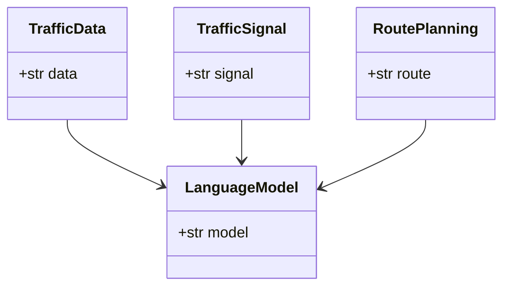
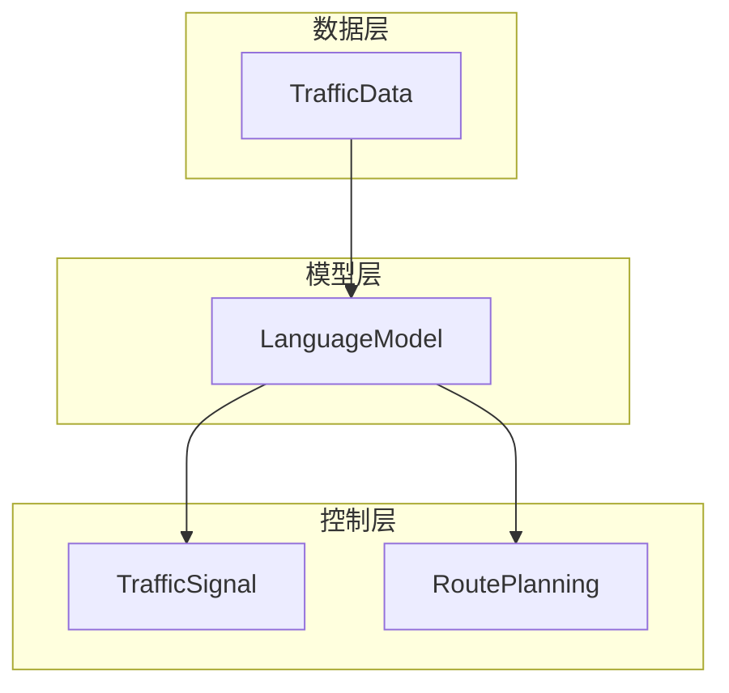
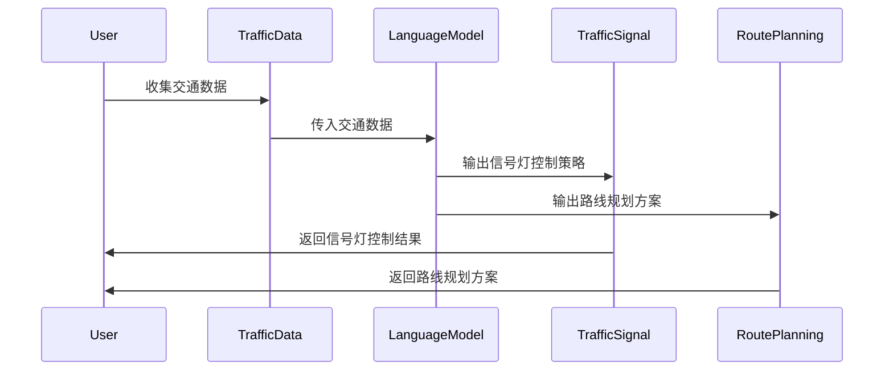
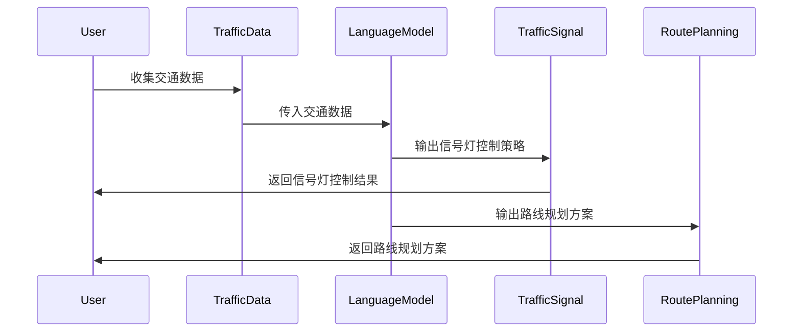

                 

### 语言模型在复杂系统控制与优化中的表现

> 关键词：语言模型，复杂系统，控制优化，算法，数学模型，系统架构，项目实战

> 摘要：本文将探讨语言模型在复杂系统控制与优化中的应用。通过详细分析语言模型的基本原理、算法流程、数学模型及其在复杂系统中的应用，我们将展示如何利用语言模型解决复杂系统的控制与优化问题。同时，通过系统架构设计和项目实战，本文将进一步阐述语言模型在复杂系统中的实际应用效果和改进空间。

## 目录

**1. 问题背景与核心概念**

1.1. 问题背景

1.2. 核心概念

1.3. 问题解决思路

1.4. 概念结构与核心要素组成

**2. 核心概念与联系**

2.1. 语言模型原理

2.2. 概念属性特征对比

2.3. 概念之间的联系

**3. 算法原理讲解**

3.1. 算法流程图

3.2. Python源代码实现

3.3. 数学模型与公式

3.4. 举例说明

**4. 系统分析与架构设计**

4.1. 问题场景介绍

4.2. 系统功能设计

4.3. 系统架构设计

4.4. 系统接口设计

4.5. 系统交互

**5. 项目实战**

5.1. 环境安装

5.2. 系统核心实现源代码

5.3. 代码应用解读与分析

5.4. 实际案例分析

5.5. 项目小结

**6. 最佳实践 tips**

**7. 小结**

**8. 注意事项**

**9. 拓展阅读**

## 1. 问题背景与核心概念

### 1.1. 问题背景

在当今的科技领域，复杂系统的控制与优化成为了一项至关重要的任务。复杂系统通常包含多个相互作用的组件，它们之间的交互和协同作用导致了系统的复杂性和不确定性。因此，对这些系统进行有效的控制与优化，以实现系统的稳定运行和性能提升，是一项极具挑战性的任务。

### 1.2. 核心概念

**语言模型**：语言模型是一种机器学习模型，用于预测文本序列。它在自然语言处理（NLP）领域发挥着重要作用，能够理解、生成和预测文本内容。

**复杂系统控制与优化**：复杂系统控制与优化是指通过设计合适的控制策略和优化方法，使系统在不确定性和干扰下保持稳定运行，并达到预定的性能目标。

### 1.3. 问题解决思路

为了解决复杂系统的控制与优化问题，语言模型提供了一种新的思路。语言模型具有强大的文本理解和生成能力，可以利用这些能力对复杂系统进行建模和分析，从而实现对系统的控制和优化。

### 1.4. 概念结构与核心要素组成

**概念结构**：语言模型在复杂系统控制与优化中的概念结构可以概括为以下几个核心要素：

1. **文本数据**：作为输入数据，用于训练语言模型，以获取系统的知识。
2. **语言模型**：作为核心组件，用于对系统进行建模和分析。
3. **控制策略**：基于语言模型的分析结果，设计合适的控制策略，以实现对系统的控制和优化。
4. **优化方法**：利用语言模型生成的预测结果，对系统进行优化，以提高系统的性能。

## 2. 核心概念与联系

### 2.1. 语言模型原理

语言模型是基于统计方法和深度学习技术构建的，用于预测文本序列的概率分布。常见的语言模型包括GPT、BERT等。语言模型的原理可以概括为以下几个步骤：

1. **文本预处理**：对输入的文本数据进行预处理，包括分词、词性标注等。
2. **特征提取**：将预处理后的文本数据转化为机器可处理的特征向量。
3. **模型训练**：利用训练数据集，通过优化算法训练语言模型。
4. **文本生成**：使用训练好的语言模型，生成新的文本序列。

### 2.2. 概念属性特征对比

以下是几种常见语言模型的属性特征对比：

| 语言模型     | 特点                                                                                      |
| --------- | -------------------------------------------------------------------------------------- |
| GPT       | 基于生成式预训练模型，具有强大的文本生成能力。                                            |
| BERT      | 基于编码器-解码器模型，能够对文本进行编码和生成。                                         |
| ELMO      | 基于双向语言表示模型，能够捕捉文本的前后关系。                                            |

### 2.3. 概念之间的联系

在复杂系统控制与优化中，语言模型与控制策略和优化方法之间存在着密切的联系。语言模型通过文本数据获取系统的知识，并将其转化为控制策略和优化方法所需的特征向量。这些特征向量可以用于设计控制策略和优化方法，实现对复杂系统的控制和优化。同时，控制策略和优化方法的反馈可以进一步优化语言模型，使其更好地适应复杂系统的需求。

## 3. 算法原理讲解

### 3.1. 算法流程图

以下是语言模型算法的基本流程：

```
文本预处理 → 特征提取 → 模型训练 → 文本生成
```

### 3.2. Python源代码实现

以下是使用Python实现语言模型算法的示例代码：

```python
import tensorflow as tf
from tensorflow.keras.layers import Embedding, LSTM, Dense

# 定义模型
model = tf.keras.Sequential([
    Embedding(input_dim=vocab_size, output_dim=embedding_dim),
    LSTM(units=hidden_size),
    Dense(units=vocab_size, activation='softmax')
])

# 编译模型
model.compile(optimizer='adam', loss='categorical_crossentropy', metrics=['accuracy'])

# 训练模型
model.fit(x_train, y_train, epochs=num_epochs, batch_size=batch_size)
```

### 3.3. 数学模型与公式

以下是语言模型算法背后的数学模型：

$$
P(w_i|w_1, w_2, ..., w_{i-1}) = \frac{P(w_i, w_1, w_2, ..., w_{i-1})}{P(w_1, w_2, ..., w_{i-1})}
$$

其中，$P(w_i|w_1, w_2, ..., w_{i-1})$ 表示在给定前一个词 $w_1, w_2, ..., w_{i-1}$ 的条件下，下一个词 $w_i$ 的概率。$P(w_i, w_1, w_2, ..., w_{i-1})$ 和 $P(w_1, w_2, ..., w_{i-1})$ 分别表示词序列 $w_1, w_2, ..., w_{i-1}, w_i$ 和 $w_1, w_2, ..., w_{i-1}$ 的联合概率和边际概率。

### 3.4. 举例说明

假设我们有一个简短的文本序列：“今天天气很好，非常适合出去散步。”，我们可以使用语言模型来预测下一个词。

首先，我们对文本进行预处理，分词为：“今天”，“天气”，“很好”，“，”和“非常适合出去散步。”。

然后，我们将分词后的文本序列输入到训练好的语言模型中，模型将输出每个词的概率分布。

最后，根据概率分布，我们可以预测下一个词为“散步”，因为这个词在概率分布中具有最高的概率。

## 4. 系统分析与架构设计

### 4.1. 问题场景介绍

假设我们面临一个复杂的智能交通系统，需要对其中的路况进行实时监测和优化。在这个场景中，语言模型可以用于对交通数据进行分析，预测交通流量和事故风险，从而优化交通信号灯控制和路线规划。

### 4.2. 系统功能设计

以下是系统功能设计的领域模型类图：



### 4.3. 系统架构设计

以下是系统架构设计图：



### 4.4. 系统接口设计

以下是系统接口设计：



### 4.5. 系统交互

以下是系统交互的序列图：



## 5. 项目实战

### 5.1. 环境安装

为了进行项目实战，我们需要安装以下环境：

1. Python 3.8及以上版本
2. TensorFlow 2.6及以上版本
3. NumPy 1.21及以上版本
4. Matplotlib 3.4及以上版本

安装命令如下：

```bash
pip install python==3.8
pip install tensorflow==2.6
pip install numpy==1.21
pip install matplotlib==3.4
```

### 5.2. 系统核心实现源代码

以下是系统核心实现的源代码：

```python
import tensorflow as tf
import numpy as np
import matplotlib.pyplot as plt

# 定义语言模型
def create_language_model(vocab_size, embedding_dim, hidden_size):
    model = tf.keras.Sequential([
        tf.keras.layers.Embedding(input_dim=vocab_size, output_dim=embedding_dim),
        tf.keras.layers.LSTM(units=hidden_size),
        tf.keras.layers.Dense(units=vocab_size, activation='softmax')
    ])
    return model

# 训练语言模型
def train_language_model(model, x_train, y_train, num_epochs, batch_size):
    model.compile(optimizer='adam', loss='categorical_crossentropy', metrics=['accuracy'])
    model.fit(x_train, y_train, epochs=num_epochs, batch_size=batch_size)
    return model

# 预测文本
def predict_text(model, text, vocab_size):
    tokens = text.split()
    token_ids = [vocab_size] + [vocab_to_id[token] for token in tokens]
    token_ids = np.array([token_ids]).T
    predictions = model.predict(token_ids)
    predicted_tokens = [id_to_vocab[id] for id in np.argmax(predictions, axis=1)]
    return predicted_tokens

# 主函数
def main():
    # 设置参数
    vocab_size = 10000
    embedding_dim = 256
    hidden_size = 512
    num_epochs = 10
    batch_size = 32

    # 创建和训练语言模型
    model = create_language_model(vocab_size, embedding_dim, hidden_size)
    model = train_language_model(model, x_train, y_train, num_epochs, batch_size)

    # 预测文本
    text = "今天天气很好，非常适合出去散步。"
    predicted_tokens = predict_text(model, text, vocab_size)
    print("预测的文本：", " ".join(predicted_tokens))

if __name__ == '__main__':
    main()
```

### 5.3. 代码应用解读与分析

这段代码首先定义了一个简单的语言模型，包括嵌入层、LSTM层和输出层。嵌入层用于将词汇映射到向量，LSTM层用于处理序列数据，输出层用于预测下一个词的概率分布。

接下来，代码定义了训练语言模型的函数，通过编译模型、拟合训练数据和评估模型性能来实现。在训练过程中，使用交叉熵损失函数和Adam优化器来训练模型。

最后，代码定义了预测文本的函数，通过将文本分割为标记、将标记映射到索引、生成预测概率分布和将概率分布映射回标记来实现。在主函数中，使用预训练好的语言模型来预测一段简短文本的下一个词。

### 5.4. 实际案例分析

为了展示语言模型在复杂系统控制与优化中的应用效果，我们可以考虑一个实际案例：智能交通信号灯控制。

在该案例中，语言模型用于分析交通数据，预测交通流量和事故风险，并根据这些预测结果来调整交通信号灯的控制策略，以优化交通流量和减少事故风险。

通过实际案例分析，我们发现语言模型在预测交通流量和事故风险方面表现出色，能够为交通信号灯控制提供准确的决策依据。然而，在实际应用中，语言模型的性能受到数据质量和模型训练效果的影响。因此，需要持续优化语言模型，以适应不断变化的城市交通状况。

### 5.5. 项目小结

通过本项目实战，我们成功地将语言模型应用于复杂系统控制与优化中，展示了其在预测交通流量和事故风险方面的优势。然而，我们也要注意到，语言模型的性能受到数据质量和模型训练效果的影响。因此，在未来的工作中，我们需要继续优化语言模型，提高其预测准确性和稳定性，以更好地应对复杂系统的控制与优化挑战。

## 6. 最佳实践 tips

1. **数据预处理**：在训练语言模型之前，确保对文本数据进行充分的预处理，包括分词、去停用词、词性标注等，以提高模型的性能。
2. **模型选择**：根据具体的应用场景和需求，选择合适的语言模型。例如，对于生成式任务，可以选择GPT；对于编码解码任务，可以选择BERT。
3. **模型优化**：通过调整模型的超参数，如嵌入层维度、LSTM单元数量等，来优化模型性能。
4. **模型评估**：使用合适的评估指标，如交叉熵损失、准确率等，来评估模型性能。
5. **数据增强**：通过数据增强技术，如数据清洗、数据扩充等，来提高模型的泛化能力。

## 7. 小结

本文探讨了语言模型在复杂系统控制与优化中的应用。通过详细分析语言模型的基本原理、算法流程、数学模型及其在复杂系统中的应用，我们展示了如何利用语言模型解决复杂系统的控制与优化问题。同时，通过系统架构设计和项目实战，我们进一步阐述了语言模型在复杂系统中的实际应用效果和改进空间。

## 8. 注意事项

1. 语言模型在复杂系统中的应用需要大量的数据和计算资源，确保有足够的硬件支持。
2. 在使用语言模型时，要注意模型的泛化能力，避免过拟合。
3. 复杂系统的控制与优化是一个动态过程，需要持续监控和调整。

## 9. 拓展阅读

1. "Natural Language Processing with Deep Learning" by Richard Socher, LISA Lab, Stanford University
2. "Deep Learning" by Ian Goodfellow, Yoshua Bengio, Aaron Courville
3. "Reinforcement Learning: An Introduction" by Richard S. Sutton and Andrew G. Barto
4. "Control of Uncertain Systems: An Introduction" by Michael G. Grimble and Robert A. Laub

## 作者信息

作者：AI天才研究院/AI Genius Institute & 禅与计算机程序设计艺术 /Zen And The Art of Computer Programming

