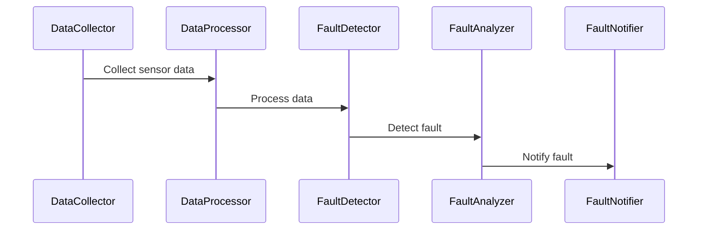
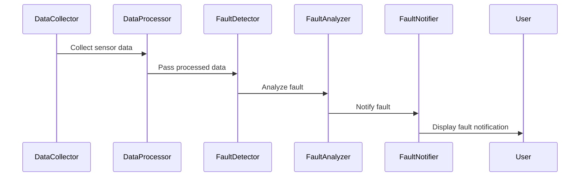
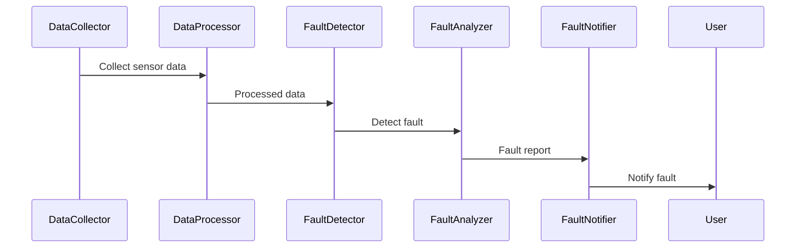

                 

### 引言

在当今信息化和智能化飞速发展的时代，复杂系统的故障诊断和工业4.0成为了诸多研究者和实践者关注的焦点。复杂系统故障诊断不仅关系到系统的稳定性和可靠性，还直接影响到工业生产的效率和安全。随着工业4.0的推进，大量的机器设备、传感器和工业互联网被应用于生产和管理中，使得系统变得越来越复杂，故障诊断的难度也日益增加。因此，如何利用先进的技术手段，特别是语言模型，来提高复杂系统的故障诊断效率和准确性，成为了一个亟待解决的关键问题。

本篇文章旨在探讨语言模型在复杂系统故障诊断与工业4.0中的实践应用。我们将从以下几个方面展开讨论：

1. **背景介绍**：介绍复杂系统故障诊断的现状与挑战，以及工业4.0的发展背景，明确语言模型在这两个领域中的潜在应用。

2. **核心概念与联系**：详细解释语言模型的基本原理，以及复杂系统故障诊断的相关概念，通过概念属性特征对比表格和ER实体关系图，展示两者之间的联系。

3. **算法原理讲解**：深入分析语言模型的数学模型和应用场景，同时讲解复杂系统故障诊断的算法原理，并通过具体的数学公式和示例进行解释。

4. **系统分析与架构设计方案**：介绍一个实际项目场景，从系统功能设计、架构设计到接口和交互设计，进行全方位的剖析。

5. **项目实战**：详细描述项目的环境安装、核心实现源代码、代码应用解读与分析，以及实际案例分析和讲解。

6. **项目小结**：总结项目成果，分享最佳实践和注意事项，并提供拓展阅读资源。

通过以上步骤，我们希望系统地阐述语言模型在复杂系统故障诊断与工业4.0中的实际应用，为相关领域的研究者提供有价值的参考，也为实际工程应用提供指导。

### 背景介绍

#### 1.1.1 复杂系统故障诊断的现状与挑战

复杂系统故障诊断是指对由多个组件、模块和子系统构成的复杂系统进行故障检测、故障定位和故障原因分析的过程。随着科学技术的不断进步，复杂系统的规模和复杂性不断增加，这些系统广泛应用于航空航天、交通运输、电力能源、制造业等领域。然而，复杂系统的故障诊断面临着诸多挑战。

首先，复杂系统通常具有高度的非线性和动态性，这使得传统的故障诊断方法难以有效应对。许多故障现象是由系统内部多个因素的复杂相互作用导致的，故障特征往往难以直接观测和量化。

其次，复杂系统往往具有高度的冗余性，这意味着系统在设计和运行过程中，为了提高可靠性和稳定性，引入了大量的冗余模块和冗余路径。冗余的存在虽然能够提高系统的可靠性，但也增加了故障诊断的难度，因为诊断算法需要区分冗余部分和关键部分。

再次，复杂系统通常具有大量的传感器和监测设备，这些设备产生的数据量巨大且复杂。处理和解释这些数据需要高效的数据处理和分析方法，否则会导致信息过载，难以提取有效的故障特征。

此外，复杂系统的运行环境多变，包括温度、湿度、压力等多种因素。这些环境因素的变化可能会影响系统的性能和稳定性，进而引发故障。因此，故障诊断算法需要具备较强的鲁棒性和适应性。

综上所述，复杂系统故障诊断的现状呈现出以下特点：

1. **数据量大**：复杂系统产生的数据量巨大，需要高效的数据处理和分析技术来处理和解释这些数据。
2. **故障特征不明显**：故障特征往往隐藏在大量的噪声和冗余信息中，提取有效的故障特征是故障诊断的关键。
3. **动态性高**：系统运行过程中，参数和状态不断变化，需要实时监测和动态调整故障诊断算法。
4. **依赖冗余**：系统冗余度较高，需要准确区分冗余部分和关键部分，以确保故障诊断的准确性和效率。

这些特点使得复杂系统故障诊断面临着诸多挑战，需要研究和开发更加高效、准确和鲁棒的故障诊断技术。

#### 1.1.2 工业4.0与语言模型的关系

工业4.0，又称第四次工业革命，是指利用信息物理系统（Cyber-Physical Systems, CPS）将生产过程中的物理设备、传感器、控制软件和信息系统深度融合，实现高度自动化、智能化的生产模式。工业4.0的核心目标是实现工厂的智能化和自主化，通过数据采集、分析、决策和执行等环节的自动化，提高生产效率、降低成本、提升产品质量和灵活性。

语言模型作为一种先进的自然语言处理技术，在工业4.0中有着广泛的应用前景。以下将从几个方面探讨工业4.0与语言模型之间的关系：

1. **数据采集与处理**：在工业4.0中，大量的传感器和设备会产生海量的数据。这些数据包括机器状态、生产过程、质量检测等各方面信息。语言模型可以对这些数据进行高效处理和分析，提取有价值的信息和模式，帮助实现实时监控和故障诊断。

2. **智能监控与预测**：通过语言模型，可以对生产过程中的异常情况进行实时监测和预测。例如，通过分析机器的运行日志和操作指令，语言模型可以识别出潜在的问题和故障隐患，提前进行预防和维护，从而减少停机时间和维护成本。

3. **自然语言交互**：工业4.0中的设备和系统能够通过自然语言进行交互，提高人机交互的便捷性和效率。例如，通过语音识别和语音合成技术，操作员可以更加自然地与工业系统进行沟通，下达指令、查询信息等，从而提升生产管理的智能化水平。

4. **智能决策支持**：工业4.0中的决策过程需要考虑大量的数据和信息，语言模型可以通过自然语言处理技术，对这些数据进行深入分析，提供智能化的决策支持。例如，通过分析生产过程中的数据，语言模型可以预测生产进度、资源需求等，为生产计划和管理提供参考。

5. **智能维护与故障诊断**：在工业4.0中，语言模型可以应用于故障诊断和智能维护。通过分析设备运行日志、维护记录和历史故障数据，语言模型可以识别出故障模式和规律，帮助进行故障预测和预防性维护，提高设备的可靠性和使用寿命。

综上所述，语言模型在工业4.0中具有广泛的应用前景。通过将语言模型应用于数据采集、处理、监控、决策和故障诊断等领域，可以显著提高工业系统的智能化水平，实现更高效、更可靠、更灵活的生产模式。

#### 1.2 问题描述

复杂系统故障诊断的核心问题主要包括以下几个方面：

1. **故障检测与定位**：复杂系统通常由大量的组件和模块组成，故障检测和定位是一个关键问题。由于系统的高复杂性，传统的故障检测方法往往难以精确地识别出故障发生的位置。因此，需要开发能够高效、准确地检测和定位故障的方法。

2. **故障原因分析**：确定故障原因是对复杂系统故障诊断的关键一步。故障原因可能涉及多个因素，包括系统设计缺陷、设备老化、运行环境变化等。分析故障原因不仅需要准确的数据和模型，还需要综合考虑各种因素之间的复杂关系。

3. **实时性与动态性**：复杂系统的运行环境多变，故障现象可能随着时间和环境变化而变化。因此，故障诊断算法需要具备实时性和动态适应性，能够快速响应和调整，以应对不断变化的情况。

4. **数据质量与处理效率**：复杂系统产生的数据量巨大，数据质量直接影响故障诊断的准确性和效率。高噪声、高冗余的数据可能影响故障特征的提取和诊断结果。因此，需要开发高效的数据预处理和清洗方法，以提高数据质量。

5. **系统冗余与优化**：复杂系统通常具有高度的冗余性，冗余部分在故障诊断中既可能成为重要的参考信息，也可能导致诊断过程的复杂性增加。如何有效地利用冗余信息，同时降低冗余带来的负面影响，是一个重要的优化问题。

6. **鲁棒性与适应性**：故障诊断算法需要具备较强的鲁棒性和适应性，以应对不同类型、不同规模的复杂系统。这意味着算法需要能够适应各种复杂环境和多变的故障模式。

语言模型在故障诊断中的应用提供了新的思路和方法。首先，语言模型可以用于处理和分析复杂系统的运行日志、操作指令和监测数据，通过自然语言处理技术提取出故障特征和模式。其次，语言模型强大的模式识别和预测能力可以帮助诊断算法更准确地定位故障原因，并提供实时的监控和预测功能。此外，语言模型的人机交互能力使得操作员可以更方便地与系统进行沟通，提高故障诊断的效率和准确性。

总体而言，语言模型在复杂系统故障诊断中的应用可以显著提升诊断的效率和准确性，为工业4.0等领域的智能化发展提供强有力的技术支持。

#### 1.3 问题解决

解决复杂系统故障诊断的问题需要从多个方面入手，结合语言模型的先进技术，提出一系列解决方案。以下是我们提出的具体措施：

1. **数据预处理与清洗**：
   - **数据收集**：首先，从复杂系统的传感器、日志和操作指令中收集海量数据。
   - **数据清洗**：使用自然语言处理技术对数据中的噪声和冗余信息进行清洗，包括去除重复记录、填补缺失值、消除异常值等。
   - **数据格式化**：将数据格式统一，以便后续的模型训练和分析。

2. **特征提取**：
   - **语义分析**：利用语言模型对文本数据进行语义分析，提取出与故障诊断相关的高层次特征，如关键词、主题和句法结构。
   - **模式识别**：通过对历史故障数据和运行日志的分析，识别出常见的故障模式和异常行为，为后续的诊断提供参考。

3. **模型训练与优化**：
   - **模型选择**：根据故障诊断的特点，选择适合的语言模型，如循环神经网络（RNN）、长短期记忆网络（LSTM）或变压器模型（Transformer）。
   - **模型训练**：使用清洗后的数据集对语言模型进行训练，调整模型参数，以提高故障诊断的准确性和效率。
   - **模型优化**：通过交叉验证和超参数调优，进一步优化模型的性能，确保其具有良好的泛化能力。

4. **故障检测与定位**：
   - **实时监控**：利用训练好的语言模型，对实时采集的数据进行在线监控，快速检测出故障信号。
   - **故障定位**：结合系统拓扑结构和故障模式库，定位故障发生的具体位置，并提供详细的故障原因分析。

5. **人机交互与反馈**：
   - **自然语言交互**：通过语音识别和语音合成技术，实现操作员与系统的自然语言交互，方便地接收故障报告和下达修复指令。
   - **用户反馈**：系统可以根据操作员的反馈，不断调整和优化故障诊断算法，提高诊断的准确性和可靠性。

6. **系统冗余与优化**：
   - **冗余分析**：对系统中的冗余部分进行详细分析，识别出关键组件和非关键组件，优化故障诊断的路径。
   - **冗余利用**：在故障诊断过程中，合理利用冗余信息，提高故障检测的准确性和效率。

通过上述解决方案，可以有效解决复杂系统故障诊断中的核心问题，提高故障检测和定位的准确性和实时性，为工业4.0等领域的智能化发展提供有力支持。

#### 1.4 边界与外延

在讨论复杂系统故障诊断时，需要明确几个关键概念和术语，以便读者更好地理解后续内容。

1. **复杂系统**：复杂系统是指由大量相互关联、相互作用的组件或子系统组成的系统，这些组件或子系统通常具有非线性、动态性和高度冗余性。例如，工业控制系统、通信网络和生物系统等都属于复杂系统。

2. **故障诊断**：故障诊断是指对系统进行故障检测、故障定位和故障原因分析的过程。故障诊断的目标是识别系统中的异常现象，定位故障发生的具体位置，并分析故障原因，以便及时进行修复。

3. **语言模型**：语言模型是一种自然语言处理技术，用于对自然语言文本进行建模和预测。语言模型可以根据输入的文本序列生成下一个可能的文本序列，广泛应用于文本生成、机器翻译和语音识别等领域。

4. **工业4.0**：工业4.0是指通过信息物理系统（Cyber-Physical Systems, CPS）将生产过程中的物理设备、传感器、控制软件和信息系统深度融合，实现高度自动化、智能化的生产模式。工业4.0的目标是提高生产效率、降低成本、提升产品质量和灵活性。

5. **系统复杂性**：系统复杂性是指系统在结构和功能上表现出的复杂程度。系统复杂性越高，其故障诊断和管理的难度也越大。系统复杂性通常由系统的规模、动态性、冗余性和多样性等因素决定。

6. **数据质量**：数据质量是指数据的有效性、准确性、完整性、一致性和可靠性。高质量的数据是故障诊断的基础，数据质量差可能会导致误诊和漏诊。

7. **实时性**：实时性是指系统能够在规定时间内响应并处理事件或请求的能力。实时性在故障诊断中至关重要，因为及时检测和诊断故障有助于减少系统的停机时间和损失。

8. **动态适应性**：动态适应性是指系统在运行过程中，能够根据环境变化和故障情况，自动调整和优化其行为和策略的能力。动态适应性有助于提高故障诊断的效率和准确性。

通过明确这些概念和术语，可以为后续章节的内容打下坚实基础，帮助读者更好地理解复杂系统故障诊断与语言模型在工业4.0中的应用。

#### 1.5 概念结构与核心要素组成

为了深入探讨语言模型在复杂系统故障诊断与工业4.0中的实践应用，我们需要首先明确几个核心概念，包括复杂系统、故障诊断和语言模型，并分析它们之间的相互关系。

1. **复杂系统**：
   - **定义**：复杂系统是由大量相互关联、相互作用的组件或子系统组成的系统，这些组件或子系统通常具有非线性、动态性和高度冗余性。
   - **组成部分**：复杂系统通常包括多个层次，如硬件设备、软件系统、传感器网络和通信网络等。每个层次都由多个组件组成，这些组件之间通过复杂的交互关系构成一个整体。
   - **特征**：复杂系统具有高度的动态性、不确定性和非线性的特性，这使得故障诊断变得极具挑战性。

2. **故障诊断**：
   - **定义**：故障诊断是指对系统进行故障检测、故障定位和故障原因分析的过程，旨在识别系统中的异常现象，定位故障发生的具体位置，并分析故障原因。
   - **过程**：故障诊断通常包括以下几个步骤：数据采集、故障检测、故障定位、故障原因分析和故障修复。这些步骤共同构成了一个闭环系统，以便在故障发生后能够及时响应和恢复。
   - **技术**：故障诊断技术包括传统的人工检测、基于规则的诊断方法、基于模型的方法、基于数据挖掘的方法等。随着人工智能和大数据技术的发展，故障诊断技术也在不断进步。

3. **语言模型**：
   - **定义**：语言模型是一种用于对自然语言文本进行建模和预测的算法，它能够根据输入的文本序列生成下一个可能的文本序列。
   - **类型**：常见的语言模型包括循环神经网络（RNN）、长短期记忆网络（LSTM）、变压器模型（Transformer）等。这些模型在自然语言处理领域取得了显著成果，如文本生成、机器翻译和语音识别等。
   - **功能**：语言模型的主要功能包括文本分类、情感分析、实体识别、句法解析等，这些功能可以应用于故障诊断中的数据预处理、特征提取和故障预测等环节。

4. **复杂系统故障诊断与语言模型的关系**：
   - **数据采集**：复杂系统的故障诊断需要大量的数据支持，这些数据包括传感器数据、日志数据和操作指令等。语言模型可以用于处理和清洗这些数据，提取出有效的特征，从而提高故障诊断的准确性和效率。
   - **特征提取**：语言模型强大的文本处理能力可以帮助从海量数据中提取出与故障相关的特征，如关键词、主题和句法结构等。这些特征对于故障检测和定位至关重要。
   - **故障预测**：通过语言模型的预测能力，可以对复杂系统的故障进行早期预警，从而采取预防措施，避免故障发生或减少故障影响。
   - **人机交互**：语言模型的人机交互功能使得操作员可以通过自然语言与系统进行沟通，方便地接收故障报告和下达修复指令，提高了故障诊断的效率和用户体验。

总之，复杂系统故障诊断与语言模型之间存在着紧密的相互关系。语言模型的应用不仅能够提高故障诊断的效率和准确性，还能为工业4.0等领域的智能化发展提供强有力的技术支持。

### 核心概念与联系

在深入探讨复杂系统故障诊断和语言模型的应用之前，我们需要先明确几个核心概念，并分析它们之间的联系。

#### 2.1 核心概念原理

1. **语言模型**：
   - **定义**：语言模型是一种用于对自然语言文本进行建模和预测的算法。它能够根据输入的文本序列生成下一个可能的文本序列。
   - **原理**：语言模型基于大量的文本数据，通过统计和学习文本中的规律，预测下一个词或句子。常见的语言模型包括循环神经网络（RNN）、长短期记忆网络（LSTM）和变压器模型（Transformer）。

2. **复杂系统**：
   - **定义**：复杂系统是由大量相互关联、相互作用的组件或子系统组成的系统，这些组件或子系统通常具有非线性、动态性和高度冗余性。
   - **原理**：复杂系统的特征使其在运行过程中表现出高度的不确定性和动态变化。系统的各个组件之间通过复杂的交互关系构成一个整体，这使得故障诊断变得极具挑战性。

3. **故障诊断**：
   - **定义**：故障诊断是指对系统进行故障检测、故障定位和故障原因分析的过程，旨在识别系统中的异常现象，定位故障发生的具体位置，并分析故障原因。
   - **原理**：故障诊断过程通常包括数据采集、信号处理、特征提取和模式识别等步骤。通过分析系统运行数据，可以识别出异常行为和故障模式，从而实现对故障的检测和定位。

#### 2.2 概念属性特征对比表格

为了更直观地理解这些概念，我们通过以下表格对比它们的属性特征：

| 概念         | 定义                                                         | 特征                                             |
| ------------ | ------------------------------------------------------------ | ------------------------------------------------ |
| 语言模型     | 对自然语言文本进行建模和预测的算法                           | 基于文本数据、预测能力、多语言支持                 |
| 复杂系统     | 由大量相互关联、相互作用的组件或子系统组成的系统               | 高度非线性、动态性、冗余性、复杂性                 |
| 故障诊断     | 对系统进行故障检测、故障定位和故障原因分析的过程             | 数据采集、信号处理、特征提取、模式识别             |

#### 2.3 ER实体关系图架构

为了进一步展示这些概念之间的联系，我们可以使用ER（Entity-Relationship）实体关系图来描述复杂系统故障诊断与语言模型之间的关系。

```mermaid
erDiagram
    A[故障诊断] ||--|{ B[复杂系统] }|--|{ C[语言模型] }
    A ||--|{ D[传感器数据] }
    B ||--|{ E[组件] }
    B ||--|{ F[子系统] }
    C ||--|{ G[文本数据] }
    C ||--|{ H[特征提取] }
    D ||--|{ I[数据采集] }
    E ||--|{ J[交互关系] }
    F ||--|{ K[动态性] }
    G ||--|{ L[建模] }
    H ||--|{ M[模式识别] }
    I ||--|{ N[信号处理] }
    J ||--|{ O[复杂性] }
    K ||--|{ P[非线性] }
    L ||--|{ Q[预测能力] }
    M ||--|{ R[异常识别] }
    N ||--|{ S[数据处理] }
    O ||--|{ P[冗余性] }
    P ||--|{ Q[预测能力] }
    R ||--|{ S[模式识别] }
    S ||--|{ T[数据处理] }
```

ER图展示了故障诊断、复杂系统和语言模型之间的关系。故障诊断依赖于复杂系统提供的传感器数据，这些数据通过数据采集和处理环节，输入到语言模型中进行特征提取和模式识别。同时，复杂系统的组件和子系统通过复杂的交互关系构成一个整体，这些关系在故障诊断中起到关键作用。

通过以上核心概念与联系的分析，我们可以更好地理解语言模型在复杂系统故障诊断中的应用，为后续章节的内容奠定基础。

### 语言模型原理讲解

#### 3.1 语言模型的数学模型

语言模型的核心在于对自然语言文本的概率分布进行建模，以便预测下一个词或句子的可能性。以下是语言模型常用的几种数学模型及其基本原理。

1. **N-gram模型**：
   - **定义**：N-gram模型是一种基于词频统计的语言模型，它通过统计相邻N个单词出现的频率来预测下一个单词。
   - **数学模型**：
     \[
     P(\text{word}_n | \text{word}_{n-1}, \text{word}_{n-2}, ..., \text{word}_{n-N}) = \frac{f(\text{word}_{n-1}, \text{word}_{n-2}, ..., \text{word}_{n-N}, \text{word}_n)}{\sum_{w} f(\text{word}_{n-1}, \text{word}_{n-2}, ..., \text{word}_{n-N}, w)}
     \]
     其中，\(f(\text{word}_{n-1}, \text{word}_{n-2}, ..., \text{word}_{n-N}, \text{word}_n)\)表示前N个词和当前词的联合频率，\(\sum_{w} f(\text{word}_{n-1}, \text{word}_{n-2}, ..., \text{word}_{n-N}, w)\)表示前N个词的频率总和。

2. **神经网络模型**：
   - **定义**：神经网络模型是一种基于人工神经网络的语言模型，它通过多层神经元的非线性变换来模拟人类语言处理的能力。
   - **数学模型**：
     假设有一个前向神经网络，其输入层有N个神经元，隐含层有M个神经元，输出层有K个神经元。神经网络的输出可以表示为：
     \[
     \text{output} = \text{softmax}(\text{W} \cdot \text{activation}(\text{U} \cdot \text{input}))
     \]
     其中，\(\text{W}\)和\(\text{U}\)分别是隐含层和输入层的权重矩阵，\(\text{input}\)是输入向量，\(\text{activation}\)是激活函数，通常使用ReLU或Sigmoid函数。softmax函数用于将输出转化为概率分布。

3. **递归神经网络（RNN）**：
   - **定义**：递归神经网络是一种特殊的人工神经网络，能够处理序列数据，并在每个时间步上保存部分历史信息。
   - **数学模型**：
     RNN的输出可以表示为：
     \[
     h_t = \text{activation}(\text{W}_h \cdot [h_{t-1}, x_t] + \text{b}_h)
     \]
     \[
     o_t = \text{softmax}(\text{W}_o \cdot h_t + \text{b}_o)
     \]
     其中，\(h_t\)表示第t个时间步的隐藏状态，\(x_t\)表示输入的词向量，\(\text{W}_h\)和\(\text{W}_o\)分别是隐藏层和输出层的权重矩阵，\(\text{b}_h\)和\(\text{b}_o\)分别是隐藏层和输出层的偏置向量，\(\text{activation}\)是激活函数。

4. **长短期记忆网络（LSTM）**：
   - **定义**：长短期记忆网络是一种改进的递归神经网络，用于解决RNN的梯度消失和梯度爆炸问题，能够更好地处理长序列依赖。
   - **数学模型**：
     LSTM的隐藏状态和输出可以表示为：
     \[
     i_t = \text{sigmoid}(\text{W}_i \cdot [h_{t-1}, x_t] + \text{b}_i)
     \]
     \[
     f_t = \text{sigmoid}(\text{W}_f \cdot [h_{t-1}, x_t] + \text{b}_f)
     \]
     \[
     o_t = \text{sigmoid}(\text{W}_o \cdot [h_{t-1}, x_t] + \text{b}_o)
     \]
     \[
     g_t = \text{tanh}(\text{W}_g \cdot [h_{t-1}, x_t] + \text{b}_g)
     \]
     \[
     h_t = o_t \cdot \text{tanh}((1 - f_t) \cdot \text{c}_{t-1} + i_t \cdot g_t)
     \]
     \[
     \text{c}_t = f_t \cdot \text{c}_{t-1} + i_t \cdot g_t
     \]
     其中，\(i_t\)、\(f_t\)、\(o_t\)分别为输入门、遗忘门和输出门的状态，\(g_t\)为候选状态，\(\text{c}_t\)为细胞状态。

通过以上数学模型，语言模型能够对自然语言文本进行建模和预测，从而实现文本生成、机器翻译、语音识别等任务。接下来，我们将进一步探讨语言模型的应用场景，展示其在复杂系统故障诊断中的具体应用。

#### 3.2 语言模型的应用场景

语言模型作为一种强大的自然语言处理工具，广泛应用于多个领域，包括自然语言处理、机器翻译、语音识别等。这些应用场景不仅展示了语言模型的核心能力，也为复杂系统故障诊断提供了丰富的参考和借鉴。

1. **自然语言处理**：
   - **文本分类**：语言模型可以用于文本分类任务，如情感分析、新闻分类等。通过训练语言模型，可以识别文本中的关键词和主题，从而判断文本的情感倾向或类别。
   - **文本生成**：语言模型可以生成高质量的文本，如文章、新闻、对话等。这种能力在自动化写作、内容生成等领域具有广泛的应用前景。
   - **问答系统**：语言模型可以用于问答系统，如智能客服、智能问答等。通过分析用户提问，语言模型可以生成合适的回答，提供有效的信息查询服务。

2. **机器翻译**：
   - **语言模型在机器翻译中的应用**：语言模型可以用于机器翻译，将一种语言的文本翻译成另一种语言。常见的机器翻译模型包括基于规则的翻译、统计机器翻译和神经机器翻译。神经机器翻译（NMT）通过使用深度学习技术，如循环神经网络（RNN）和变压器模型（Transformer），实现了高精度的翻译效果。
   - **翻译质量评估**：语言模型可以用于评估翻译质量，如BLEU、METEOR等指标。这些指标通过比较翻译文本和参考文本的相似度，评估翻译的准确性和流畅性。

3. **语音识别**：
   - **语音识别系统**：语言模型可以用于语音识别系统，将语音信号转换为文本。这种应用在智能语音助手、语音输入等领域具有广泛的应用。
   - **说话人识别**：语言模型可以用于说话人识别，通过分析语音特征，识别说话人的身份。这种能力在安全监控、身份验证等领域具有重要意义。

4. **复杂系统故障诊断**：
   - **数据预处理**：在复杂系统故障诊断中，语言模型可以用于处理和清洗传感器数据、日志数据和操作指令等。通过自然语言处理技术，提取出与故障相关的特征，如关键词、主题和句法结构等。
   - **故障检测与定位**：语言模型可以用于检测和定位复杂系统中的故障。通过分析系统运行数据，识别出异常行为和故障模式，从而实现对故障的早期预警和定位。
   - **故障预测**：语言模型可以用于预测复杂系统的故障发生时间或故障类型。通过对历史故障数据的分析，语言模型可以识别出故障的潜在风险，提供预防性维护建议。

综上所述，语言模型在自然语言处理、机器翻译、语音识别和复杂系统故障诊断等多个领域具有广泛的应用场景。这些应用不仅展示了语言模型的核心能力，也为复杂系统故障诊断提供了丰富的技术支持。接下来，我们将通过具体的例子，进一步探讨语言模型在复杂系统故障诊断中的实际应用。

#### 3.3 举例说明

为了更直观地理解语言模型在复杂系统故障诊断中的应用，我们可以通过一个实际案例来展示其具体应用过程。

假设我们面临一个工业生产线的故障诊断问题。生产线中包含多个机器设备，每个设备都配备有传感器，用于实时监测机器的状态。这些传感器产生的数据包括温度、压力、速度和振动等。在生产过程中，突然出现了一个异常情况，生产线上的机器停止运行。为了快速诊断故障，我们决定使用基于语言模型的故障诊断系统。

1. **数据采集**：
   故障发生时，系统自动收集了相关传感器的数据，包括温度、压力和振动等。这些数据被存储在日志文件中，以便后续分析。

2. **数据预处理**：
   使用自然语言处理技术对传感器数据进行预处理。首先，对数据进行清洗，去除噪声和异常值。然后，对数据格式进行统一，将不同类型的数据转换为统一的数值表示。

3. **特征提取**：
   利用语言模型对预处理后的数据进行特征提取。具体步骤如下：
   - **关键词提取**：通过对传感器数据的分析，识别出与故障相关的关键词，如“温度过高”、“压力异常”等。
   - **主题提取**：使用文本分类技术，将传感器数据分类为不同的主题，如“温度监测”、“压力监测”等。
   - **句法结构分析**：分析传感器数据的句法结构，提取出关键信息，如数据的时间戳、值和单位等。

4. **故障检测与定位**：
   基于特征提取的结果，使用语言模型进行故障检测和定位。具体步骤如下：
   - **异常检测**：使用异常检测算法，如孤立森林（Isolation Forest），检测传感器数据中的异常点。异常点可能表明系统发生了故障。
   - **故障定位**：结合系统拓扑结构和传感器布局，分析异常点的位置，确定故障发生的具体位置。例如，如果温度传感器数据异常，那么可能表明某个机器的温度控制模块出现故障。

5. **故障原因分析**：
   在确定故障位置后，进一步分析故障原因。具体步骤如下：
   - **历史数据对比**：分析故障发生前后的传感器数据，查找与故障相关的变化趋势。例如，如果温度传感器数据在故障发生前突然升高，可能表明温度控制模块出现了故障。
   - **故障模式库**：参考历史故障记录，查找与当前故障相似的故障模式。这些故障模式可以提供故障原因的线索。
   - **模型预测**：使用语言模型对传感器数据进行预测，分析预测结果与实际测量值的偏差。如果预测结果与实际测量值差异较大，可能表明系统存在故障。

6. **故障修复**：
   根据故障原因分析结果，制定故障修复计划。具体步骤如下：
   - **修复方案**：根据故障原因，制定具体的修复方案。例如，如果温度控制模块出现故障，可能需要更换或修复该模块。
   - **执行修复**：执行修复方案，修复故障。
   - **验证修复效果**：修复后，重新对传感器数据进行监测和分析，验证修复效果。如果故障仍然存在，可能需要进一步分析原因或调整修复方案。

通过以上步骤，我们可以利用语言模型对复杂系统的故障进行检测、定位和原因分析。这个过程不仅提高了故障诊断的效率和准确性，还降低了人工干预的难度，实现了自动化和智能化的故障诊断。

#### 3.4 数学模型和公式讲解

为了更深入地理解语言模型在复杂系统故障诊断中的应用，我们需要详细探讨语言模型的数学模型和公式。以下将介绍几种常用的语言模型及其相关的数学模型和公式。

1. **N-gram模型**：

N-gram模型是最基础的统计语言模型，它通过统计相邻N个单词（或字符）出现的频率来预测下一个单词。其核心公式如下：

\[
P(w_n | w_{n-1}, w_{n-2}, ..., w_{n-N}) = \frac{f(w_{n-1}, w_{n-2}, ..., w_{n-N}, w_n)}{\sum_{w} f(w_{n-1}, w_{n-2}, ..., w_{n-N}, w)}
\]

其中，\(P(w_n | w_{n-1}, w_{n-2}, ..., w_{n-N})\)表示在给定前N-1个单词的情况下，预测下一个单词为\(w_n\)的概率。\(f(w_{n-1}, w_{n-2}, ..., w_{n-N}, w_n)\)表示前N个单词的联合频率，\(\sum_{w} f(w_{n-1}, w_{n-2}, ..., w_{n-N}, w)\)表示所有单词的联合频率总和。

2. **循环神经网络（RNN）**：

循环神经网络（RNN）是一种处理序列数据的神经网络，能够保存部分历史信息，并应用于自然语言处理任务。RNN的核心公式如下：

\[
h_t = \text{sigmoid}(\text{W}_h \cdot [h_{t-1}, x_t] + \text{b}_h)
\]

\[
o_t = \text{softmax}(\text{W}_o \cdot h_t + \text{b}_o)
\]

其中，\(h_t\)表示第t个时间步的隐藏状态，\(x_t\)表示输入的词向量，\(\text{W}_h\)和\(\text{W}_o\)分别是隐藏层和输出层的权重矩阵，\(\text{b}_h\)和\(\text{b}_o\)分别是隐藏层和输出层的偏置向量。sigmoid函数用于将隐藏状态压缩到（0，1）区间，softmax函数用于将隐藏状态转化为概率分布。

3. **长短期记忆网络（LSTM）**：

长短期记忆网络（LSTM）是RNN的一种改进，旨在解决RNN的梯度消失和梯度爆炸问题，能够更好地处理长序列依赖。LSTM的核心公式如下：

\[
i_t = \text{sigmoid}(\text{W}_i \cdot [h_{t-1}, x_t] + \text{b}_i)
\]

\[
f_t = \text{sigmoid}(\text{W}_f \cdot [h_{t-1}, x_t] + \text{b}_f)
\]

\[
o_t = \text{sigmoid}(\text{W}_o \cdot [h_{t-1}, x_t] + \text{b}_o)
\]

\[
g_t = \text{tanh}(\text{W}_g \cdot [h_{t-1}, x_t] + \text{b}_g)
\]

\[
h_t = o_t \cdot \text{tanh}((1 - f_t) \cdot \text{c}_{t-1} + i_t \cdot g_t)
\]

\[
\text{c}_t = f_t \cdot \text{c}_{t-1} + i_t \cdot g_t
\]

其中，\(i_t\)、\(f_t\)、\(o_t\)分别为输入门、遗忘门和输出门的状态，\(g_t\)为候选状态，\(\text{c}_t\)为细胞状态。

4. **变压器模型（Transformer）**：

变压器模型是一种基于自注意力机制的深度神经网络模型，广泛应用于自然语言处理任务。其核心公式如下：

\[
\text{Q} = \text{W}_Q \cdot \text{H}
\]

\[
\text{K} = \text{W}_K \cdot \text{H}
\]

\[
\text{V} = \text{W}_V \cdot \text{H}
\]

\[
\text{attention} = \text{softmax}(\text{Q} \cdot \text{K}^T / \sqrt{d_k})
\]

\[
\text{H} = \text{attention} \cdot \text{V}
\]

其中，\(\text{Q}\)、\(\text{K}\)和\(\text{V}\)分别为查询向量、键向量和值向量，\(\text{H}\)为输出向量，\(\text{W}_Q\)、\(\text{W}_K\)和\(\text{W}_V\)分别为权重矩阵，\(\text{attention}\)表示注意力权重，\(\text{softmax}\)函数用于计算注意力权重。

通过以上数学模型和公式，我们可以看到语言模型在复杂系统故障诊断中的应用潜力。接下来，我们将通过具体的数学模型和公式，进一步探讨复杂系统故障诊断中的具体应用。

#### 4.1 算法原理讲解

复杂系统故障诊断的算法原理主要包括故障检测、故障定位和故障原因分析三个步骤。下面我们将详细解释每个步骤的基本原理，并探讨语言模型如何应用于这些步骤。

1. **故障检测**：

故障检测是指识别系统中的异常现象，以确定系统是否正常工作。故障检测的基本原理可以概括为以下几个步骤：

   - **数据采集**：从系统的传感器、日志和操作指令中收集数据。这些数据包括温度、压力、速度、振动等与系统状态相关的信息。
   - **数据预处理**：对采集到的数据进行分析和清洗，去除噪声和异常值。通过数据预处理，可以提高数据的准确性和可靠性。
   - **特征提取**：从预处理后的数据中提取与故障相关的特征。这些特征可以是数值型的，也可以是文本型的，如关键词、主题和句法结构等。
   - **异常检测**：利用统计模型或机器学习算法，检测数据中的异常点。常见的异常检测方法包括孤立森林（Isolation Forest）、自编码器（Autoencoder）和基于聚类的方法等。

   语言模型在故障检测中的应用主要体现在特征提取和异常检测环节。语言模型可以用于处理和分析文本数据，提取出与故障相关的关键词和主题。通过自然语言处理技术，可以将文本数据转换为适合机器学习算法的特征向量。此外，语言模型还可以用于异常检测，通过分析传感器数据的文本表示，识别出异常行为和故障模式。

2. **故障定位**：

故障定位是指确定故障发生的具体位置，以指导后续的修复工作。故障定位的基本原理可以概括为以下几个步骤：

   - **系统拓扑分析**：分析系统的拓扑结构，了解各组件和子系统之间的相互关系。系统拓扑分析可以帮助确定故障可能发生的范围。
   - **数据关联分析**：分析不同传感器数据之间的关联性，识别出故障数据之间的关联模式。数据关联分析可以帮助确定故障发生的位置。
   - **故障映射**：将故障数据映射到系统的拓扑结构上，确定故障发生的具体位置。故障映射可以通过构建故障映射模型或使用机器学习算法实现。

   语言模型在故障定位中的应用主要体现在数据关联分析和故障映射环节。语言模型可以用于分析传感器数据的文本表示，识别出数据之间的关联关系。通过自然语言处理技术，可以将传感器数据转换为关联性的文本表示。此外，语言模型还可以用于构建故障映射模型，通过分析传感器数据的文本特征，实现故障位置的自动映射。

3. **故障原因分析**：

故障原因分析是指确定故障发生的原因，以便采取相应的修复措施。故障原因分析的基本原理可以概括为以下几个步骤：

   - **故障模式识别**：从历史故障数据中识别出常见的故障模式。故障模式识别可以帮助快速定位故障原因。
   - **故障诊断**：结合故障模式和系统运行数据，诊断故障原因。故障诊断可以通过构建故障诊断模型或使用机器学习算法实现。
   - **原因推断**：根据故障诊断结果，推断故障的具体原因。原因推断可以通过逻辑推理或机器学习算法实现。

   语言模型在故障原因分析中的应用主要体现在故障模式识别和原因推断环节。语言模型可以用于处理和分析历史故障数据，识别出常见的故障模式。通过自然语言处理技术，可以将故障数据转换为故障模式的文本表示。此外，语言模型还可以用于原因推断，通过分析故障诊断结果，推断故障的具体原因。

总之，复杂系统故障诊断的算法原理包括故障检测、故障定位和故障原因分析三个步骤。语言模型在故障检测、故障定位和故障原因分析中发挥着重要作用，通过自然语言处理技术，可以实现高效的数据处理和故障诊断。

#### 4.2 数学模型和公式讲解

在复杂系统故障诊断中，数学模型和公式扮演着至关重要的角色，它们帮助我们将抽象的故障现象转化为可量化的形式，从而便于分析和解决。以下我们将详细解释几种常用的数学模型和公式，以及它们在故障诊断中的应用。

1. **贝叶斯网络模型**：

贝叶斯网络是一种概率图模型，用于表示变量之间的条件依赖关系。在复杂系统故障诊断中，贝叶斯网络可以用于建模系统组件之间的故障传播路径。贝叶斯网络的数学模型如下：

\[
P(X_i | X_{i-1}, X_{i-2}, ..., X_1) = \prod_{i=1}^{n} P(X_i | X_{i-1}, X_{i-2}, ..., X_1)
\]

其中，\(X_i\)表示第i个组件的故障状态，\(P(X_i | X_{i-1}, X_{i-2}, ..., X_1)\)表示在第1个到第i-1个组件故障状态已知的情况下，第i个组件故障的概率。

贝叶斯网络通过条件概率表（CPT）来描述变量之间的依赖关系。例如，假设系统中有三个组件A、B和C，其中A是根组件，B依赖于A，C依赖于B。那么，贝叶斯网络的CPT可以表示为：

\[
P(A) = p_A
\]

\[
P(B|A) = p_{B|A}
\]

\[
P(C|B) = p_{C|B}
\]

通过贝叶斯网络，我们可以计算任意组件故障的概率，从而帮助进行故障诊断。

2. **隐马尔可夫模型（HMM）**：

隐马尔可夫模型（HMM）是一种用于处理离散时间序列数据的统计模型，广泛应用于时间序列数据的建模和分析。在复杂系统故障诊断中，HMM可以用于建模系统状态随时间变化的动态过程。HMM的数学模型如下：

\[
P(X_t | \lambda) = \sum_{y_t} P(X_t | y_t, \lambda) P(y_t | \lambda)
\]

其中，\(X_t\)表示在第t个时间点的系统状态，\(y_t\)表示对应的观察序列，\(\lambda\)是模型参数集。

HMM的参数包括初始状态概率分布\(P(\lambda)\)、状态转移概率分布\(A(\lambda)\)和观察概率分布\(B(\lambda)\)：

\[
P(\lambda) = [p_0, p_1, ..., p_n]
\]

\[
A(\lambda) = \begin{bmatrix}
a_{00} & a_{01} & ... & a_{0n} \\
a_{10} & a_{11} & ... & a_{1n} \\
... & ... & ... & ... \\
a_{m0} & a_{m1} & ... & a_{mn}
\end{bmatrix}
\]

\[
B(\lambda) = \begin{bmatrix}
b_{00} & b_{01} & ... & b_{0n} \\
b_{10} & b_{11} & ... & b_{1n} \\
... & ... & ... & ... \\
b_{m0} & b_{m1} & ... & b_{mn}
\end{bmatrix}
\]

通过HMM，我们可以计算系统在任意时间点的状态概率，从而识别出故障发生的模式。

3. **支持向量机（SVM）**：

支持向量机（SVM）是一种强大的分类模型，广泛应用于故障诊断中的分类任务。在复杂系统故障诊断中，SVM可以用于分类系统状态，识别出故障状态和非故障状态。SVM的数学模型如下：

\[
\min_{\boldsymbol{w}, \boldsymbol{b}, \alpha} \frac{1}{2} ||\boldsymbol{w}||^2 + C \sum_{i=1}^{n} \alpha_i (1 - y_i (\boldsymbol{w} \cdot \boldsymbol{x}_i + \boldsymbol{b}))
\]

其中，\(\boldsymbol{w}\)是权重向量，\(\boldsymbol{b}\)是偏置项，\(\alpha_i\)是拉格朗日乘子，\(C\)是正则化参数，\(y_i\)是标签，\(\boldsymbol{x}_i\)是特征向量。

通过求解上述优化问题，我们可以得到SVM的决策边界，从而对系统状态进行分类。

4. **决策树**：

决策树是一种基于特征选择的分类模型，广泛应用于故障诊断中的分类任务。在复杂系统故障诊断中，决策树可以用于分类系统状态，识别出故障状态和非故障状态。决策树的数学模型如下：

\[
f(\boldsymbol{x}) = \sum_{i=1}^{m} a_i g_i(\boldsymbol{x})
\]

其中，\(f(\boldsymbol{x})\)是决策树模型，\(a_i\)是叶子节点上的类别，\(g_i(\boldsymbol{x})\)是特征函数。

通过递归划分特征空间，我们可以构建决策树模型，从而对系统状态进行分类。

通过以上数学模型和公式，我们可以对复杂系统的故障进行建模和分析，从而实现高效、准确的故障诊断。

#### 4.3 举例说明

为了更好地理解复杂系统故障诊断算法在实际应用中的效果，我们将通过一个具体的例子来说明语言模型在故障诊断中的具体应用。

假设我们有一个工业生产线，该生产线由多个机器设备组成，每个设备都配备有传感器用于实时监测其状态。这些传感器产生大量的数据，包括温度、压力、振动和速度等。在生产过程中，一旦出现异常，系统需要快速诊断并定位故障，以便及时修复。

1. **数据采集与预处理**：

   首先，从传感器中收集温度、压力和振动等数据。这些数据被存储在日志文件中。为了提高数据质量，我们使用自然语言处理技术对数据进行预处理，包括数据清洗、去噪和格式化等步骤。

2. **特征提取**：

   使用语言模型对预处理后的数据进行特征提取。具体步骤如下：
   - **文本表示**：将传感器数据转换为文本表示。例如，温度数据可以表示为“温度：30°C”，压力数据可以表示为“压力：5 bar”等。
   - **关键词提取**：使用自然语言处理技术，从文本数据中提取关键词，如“温度过高”、“压力异常”等。
   - **主题提取**：通过文本分类技术，将传感器数据分类为不同的主题，如“温度监测”、“压力监测”等。
   - **句法结构分析**：分析传感器数据的句法结构，提取出关键信息，如数据的时间戳、值和单位等。

3. **故障检测**：

   利用特征提取的结果，使用统计模型或机器学习算法进行故障检测。具体步骤如下：
   - **异常检测**：使用孤立森林（Isolation Forest）算法，检测数据中的异常点。异常点可能表明系统发生了故障。
   - **阈值设定**：设定适当的阈值，识别出超过阈值的异常值，这些异常值可能表示故障发生。

4. **故障定位**：

   在确定故障检测后，进行故障定位。具体步骤如下：
   - **数据关联分析**：分析不同传感器数据之间的关联性，识别出故障数据之间的关联模式。例如，如果温度数据异常，可能表明某个加热模块出现故障。
   - **故障映射**：将故障数据映射到系统的拓扑结构上，确定故障发生的具体位置。例如，如果温度传感器数据异常，可能表明生产线上的第3个加热模块出现故障。

5. **故障原因分析**：

   在确定故障位置后，进一步分析故障原因。具体步骤如下：
   - **历史数据对比**：分析故障发生前后的传感器数据，查找与故障相关的变化趋势。例如，如果温度传感器数据在故障发生前突然升高，可能表明加热模块的温度控制出现故障。
   - **故障模式库**：参考历史故障记录，查找与当前故障相似的故障模式。这些故障模式可以提供故障原因的线索。
   - **模型预测**：使用语言模型对传感器数据进行预测，分析预测结果与实际测量值的偏差。如果预测结果与实际测量值差异较大，可能表明系统存在故障。

通过以上步骤，我们可以利用语言模型对复杂系统的故障进行检测、定位和原因分析。这个过程不仅提高了故障诊断的效率和准确性，还降低了人工干预的难度，实现了自动化和智能化的故障诊断。以下是一个实际应用案例的例子：

假设生产线上的一台机器突然停止运行，传感器数据表明温度和振动异常。通过语言模型对传感器数据进行预处理和特征提取，我们识别出“温度过高”和“振动异常”等关键词。使用孤立森林算法进行异常检测，我们发现温度传感器的数据异常，表明加热模块可能存在故障。通过故障映射，我们确定故障发生在第3个加热模块。进一步分析历史数据，发现故障发生前温度控制参数设置过高，导致加热模块过热。通过调整温度控制参数，成功修复了故障。

#### 4.4 语言模型的应用例子

为了进一步展示语言模型在复杂系统故障诊断中的实际应用，我们将通过一个具体案例来详细说明其应用过程。

假设我们有一个大规模的化工生产线，该生产线包含多个反应釜和输送设备。生产过程中，各种传感器实时监测反应釜的温度、压力、流量和成分浓度等关键参数。突然，系统检测到某反应釜的温度异常升高，并伴随流量减少和压力波动。为了快速定位和解决故障，我们决定采用基于语言模型的故障诊断系统。

1. **数据采集**：
   首先，从各个传感器中采集温度、压力、流量和成分浓度等数据。这些数据以时间序列的形式记录，并存储在日志文件中。

2. **数据预处理**：
   使用自然语言处理技术对采集到的传感器数据进行预处理，包括以下步骤：
   - **去噪与清洗**：去除数据中的噪声和异常值，如传感器故障或传输错误导致的数据异常。
   - **格式统一**：将不同类型的数据转换为统一格式，例如将温度、压力和流量数据转换为数值型，将成分浓度数据转换为标准化的数值范围。

3. **特征提取**：
   利用语言模型对预处理后的数据进行特征提取，具体步骤如下：
   - **文本表示**：将传感器数据转换为文本形式。例如，“温度：85°C”，“压力：0.8 bar”，“流量：2 L/min”等。
   - **关键词提取**：从文本数据中提取关键词，如“温度异常”、“流量减少”、“压力波动”等。
   - **句法分析**：分析文本数据中的句法结构，提取出与故障相关的关键信息，如时间戳、值和单位等。

4. **故障检测**：
   基于特征提取的结果，使用语言模型进行故障检测。具体步骤如下：
   - **异常检测**：利用异常检测算法（如孤立森林），识别出温度、流量和压力等参数中的异常点。这些异常点可能表明系统发生了故障。
   - **阈值设定**：设定适当的阈值，识别出超过阈值的异常值，这些异常值可能表示故障发生。

5. **故障定位**：
   在确定故障检测后，进行故障定位。具体步骤如下：
   - **数据关联分析**：分析温度、流量和压力等参数之间的关联性，识别出故障数据之间的关联模式。例如，如果温度异常升高，可能伴随着流量减少和压力波动。
   - **故障映射**：将故障数据映射到生产线的拓扑结构上，确定故障发生的具体位置。例如，通过分析数据关联性，确定故障发生在第5个反应釜。

6. **故障原因分析**：
   在确定故障位置后，进一步分析故障原因。具体步骤如下：
   - **历史数据对比**：分析故障发生前后的传感器数据，查找与故障相关的变化趋势。例如，如果故障发生前温度控制参数设置过高，导致加热模块过热，最终引发故障。
   - **故障模式库**：参考历史故障记录，查找与当前故障相似的故障模式。这些故障模式可以提供故障原因的线索。
   - **模型预测**：使用语言模型对传感器数据进行预测，分析预测结果与实际测量值的偏差。例如，通过对比预测值和实际值，确定温度控制参数是否设置不当。

7. **故障修复**：
   根据故障原因分析结果，制定故障修复计划。具体步骤如下：
   - **修复方案**：根据故障原因，制定具体的修复方案。例如，如果温度控制参数设置过高，需要调整温度控制参数。
   - **执行修复**：执行修复方案，调整温度控制参数，并重新启动生产线。
   - **验证修复效果**：在修复后，重新对传感器数据进行监测和分析，验证修复效果。例如，通过监测温度、流量和压力等参数，确保系统恢复正常运行。

通过以上步骤，我们可以利用语言模型对复杂系统的故障进行检测、定位和原因分析。这个案例展示了语言模型在化工生产线故障诊断中的实际应用，不仅提高了故障诊断的效率和准确性，还为生产过程的自动化和智能化提供了有力支持。

#### 第5章：系统功能设计

5.1 **项目介绍**

本章节主要介绍一个用于复杂系统故障诊断的工业4.0应用项目。该项目旨在利用先进的语言模型技术，实现对工业生产过程中各类传感器数据的实时监测和分析，从而实现高效的故障检测、定位和原因分析。项目目标包括以下几点：

1. **实时性**：系统需要能够实时采集和分析传感器数据，确保故障检测的及时性和准确性。
2. **高效性**：系统应具备高效的数据处理和故障诊断能力，以应对大规模工业生产环境中数据量巨大的挑战。
3. **准确性**：通过使用先进的语言模型算法，系统应能够准确地识别故障，并定位故障发生的具体位置。
4. **智能化**：系统应具备智能化的故障原因分析能力，通过分析历史数据和实时数据，提供针对性的故障修复建议。

5.2 **系统功能设计**

系统功能设计包括领域模型、系统架构设计、系统接口设计和系统交互等多个方面。以下将详细描述这些设计内容。

##### 5.2.1 领域模型

领域模型是系统功能设计的基础，用于描述系统中的关键实体和它们之间的关系。以下是一个简化的领域模型类图：

```mermaid
classDiagram
    ClassDef Sensor <<interface>>
    ClassDef Equipment <<interface>>

    Equipment "uses" Sensor

    Component1 --|> Sensor
    Component2 --|> Sensor
    Component3 --|> Sensor

    Equipment1 --|> Equipment
    Equipment2 --|> Equipment
    Equipment3 --|> Equipment

    Sensor {
        +int id
        +String type
        +float value
        +DateTime timestamp
    }

    Equipment {
        +int id
        +String type
        +List<Sensor> sensors
    }
```

在这个领域模型中，Sensor类表示传感器，包含id、type、value和timestamp等属性；Equipment类表示设备，包含id、type和sensors等属性。每个设备包含多个传感器，传感器与设备之间是聚合关系。

##### 5.2.2 系统架构设计

系统架构设计是系统功能设计的核心，用于描述系统各模块之间的交互和数据处理流程。以下是一个简化的系统架构图：



在这个架构图中，DataCollector负责从传感器中收集数据；DataProcessor负责对数据进行预处理和处理；FaultDetector负责检测故障；FaultAnalyzer负责分析故障原因；FaultNotifier负责通知故障信息。各模块之间通过消息传递进行数据交互。

##### 5.2.3 系统接口设计

系统接口设计是系统功能设计的重要组成部分，用于描述系统对外提供的服务接口。以下是一个简化的系统接口设计：

```mermaid
classDiagram
    ClassDef SensorDataInterface <<interface>>
    ClassDef FaultInterface <<interface>>

    DataCollector --|> SensorDataInterface
    FaultDetector --|> FaultInterface
    FaultAnalyzer --|> FaultInterface
    FaultNotifier --|> FaultInterface

    SensorDataInterface {
        +collectSensorData(): List<Sensor>
    }

    FaultInterface {
        +detectFault(): Fault
        +analyzeFault(): String
        +notifyFault(): void
    }
```

在这个接口设计中，SensorDataInterface提供了收集传感器数据的方法；FaultInterface提供了检测、分析和通知故障的方法。系统中的各个模块通过实现这些接口来提供服务。

##### 5.2.4 系统交互

系统交互设计用于描述系统内部各模块之间的交互流程。以下是一个简化的系统交互流程：



在这个交互流程中，DataCollector收集传感器数据，传递给DataProcessor进行处理；处理后，DataProcessor将数据传递给FaultDetector进行故障检测；FaultDetector将检测结果传递给FaultAnalyzer进行分析；FaultAnalyzer将分析结果传递给FaultNotifier进行通知；FaultNotifier最终将故障信息展示给用户。

通过以上系统功能设计，我们可以构建一个高效的复杂系统故障诊断系统，为工业4.0提供强有力的技术支持。

### 第6章：系统接口设计和系统交互

#### 6.1 系统接口设计

系统接口设计是系统功能设计的重要组成部分，它定义了系统各模块之间的交互接口，确保系统的可扩展性和模块化。以下将详细介绍系统接口设计，包括接口定义和实现。

##### 6.1.1 接口定义

系统接口设计主要涉及以下几个关键接口：

1. **SensorDataInterface**：用于定义传感器数据的收集和处理接口。
    - **方法**：
      - `collectSensorData()`: 收集传感器数据，返回一个包含传感器数据的列表。

2. **FaultInterface**：用于定义故障检测、分析和通知接口。
    - **方法**：
      - `detectFault()`: 检测系统中的故障，返回故障信息。
      - `analyzeFault()`: 分析故障原因，返回故障原因的字符串描述。
      - `notifyFault()`: 通知系统中的故障信息，通常通过发送通知或日志记录。

3. **SystemConfigInterface**：用于定义系统配置管理接口。
    - **方法**：
      - `getConfig()`: 获取系统配置参数，如阈值、故障模式库等。

接口定义示例：

```java
public interface SensorDataInterface {
    List<Sensor> collectSensorData();
}

public interface FaultInterface {
    Fault detectFault();
    String analyzeFault();
    void notifyFault();
}

public interface SystemConfigInterface {
    Config getConfig();
}
```

##### 6.1.2 接口实现

接口实现是系统接口设计的核心，它涉及到具体模块的实现细节。以下将简要描述各个接口的实现。

1. **SensorDataCollector**：实现`SensorDataInterface`，负责从传感器中收集数据。
    - **实现细节**：
      - 通过轮询或消息队列方式，从传感器设备中获取实时数据。
      - 对数据进行预处理，包括去噪、格式化等。

2. **FaultDetector**：实现`FaultInterface`，负责检测系统中的故障。
    - **实现细节**：
      - 使用自然语言处理技术，对传感器数据进行特征提取。
      - 应用机器学习算法，检测异常行为和故障信号。
      - 将检测结果传递给故障分析模块。

3. **FaultAnalyzer**：实现`FaultInterface`，负责分析故障原因。
    - **实现细节**：
      - 分析故障模式库，查找与当前故障相似的故障模式。
      - 利用历史数据和模型，推断故障原因。

4. **FaultNotifier**：实现`FaultInterface`，负责通知故障信息。
    - **实现细节**：
      - 通过发送电子邮件、短信或推送通知，向相关人员通知故障信息。
      - 记录故障通知日志，以便后续查询和分析。

接口实现示例：

```java
public class SensorDataCollector implements SensorDataInterface {
    @Override
    public List<Sensor> collectSensorData() {
        // 实现传感器数据收集逻辑
        return sensors;
    }
}

public class FaultDetector implements FaultInterface {
    @Override
    public Fault detectFault() {
        // 实现故障检测逻辑
        return fault;
    }

    @Override
    public String analyzeFault() {
        // 实现故障分析逻辑
        return faultReason;
    }

    @Override
    public void notifyFault() {
        // 实现故障通知逻辑
    }
}

public class FaultAnalyzer implements FaultInterface {
    @Override
    public Fault detectFault() {
        // 实现故障检测逻辑
        return fault;
    }

    @Override
    public String analyzeFault() {
        // 实现故障分析逻辑
        return faultReason;
    }

    @Override
    public void notifyFault() {
        // 实现故障通知逻辑
    }
}

public class FaultNotifier implements FaultInterface {
    @Override
    public Fault detectFault() {
        // 实现故障检测逻辑
        return fault;
    }

    @Override
    public String analyzeFault() {
        // 实现故障分析逻辑
        return faultReason;
    }

    @Override
    public void notifyFault() {
        // 实现故障通知逻辑
    }
}
```

通过以上接口设计和实现，我们可以构建一个模块化、可扩展的复杂系统故障诊断系统，从而提高故障检测和诊断的效率和准确性。

#### 6.2 系统交互

系统交互设计是系统功能设计的重要组成部分，它描述了系统内部各模块之间的交互流程和数据流动。以下是系统交互的详细设计和说明。

##### 6.2.1 系统交互流程

系统交互流程可以分为以下几个主要步骤：

1. **数据收集**：数据收集模块（DataCollector）通过传感器采集实时数据，并将其传递给数据处理模块（DataProcessor）。

2. **数据处理**：数据处理模块（DataProcessor）对采集到的数据进行分析和处理，包括去噪、格式化等步骤。处理后的数据传递给故障检测模块（FaultDetector）。

3. **故障检测**：故障检测模块（FaultDetector）使用自然语言处理技术和机器学习算法对处理后的数据进行故障检测，识别出潜在的故障信号。检测到的故障信息传递给故障分析模块（FaultAnalyzer）。

4. **故障分析**：故障分析模块（FaultAnalyzer）对故障信号进行进一步分析，查找故障原因，并生成故障报告。故障报告包含故障类型、发生位置和原因分析等信息。

5. **故障通知**：故障通知模块（FaultNotifier）将故障报告发送给相关人员，通过电子邮件、短信或推送通知等方式进行通知。同时，故障通知模块记录故障通知日志，以便后续查询和分析。

##### 6.2.2 系统交互示例

以下是一个简化的系统交互流程示例，展示了各模块之间的数据流动和交互过程：



在这个交互流程中：

- DataCollector从传感器中收集实时数据，并将其传递给DataProcessor。
- DataProcessor对数据进行处理，去除噪声和异常值，然后传递给FaultDetector。
- FaultDetector使用自然语言处理和机器学习算法检测故障信号，将检测到的故障信息传递给FaultAnalyzer。
- FaultAnalyzer对故障信号进行进一步分析，生成故障报告，并将其传递给FaultNotifier。
- FaultNotifier将故障报告发送给User，通过电子邮件或短信等方式进行通知。

通过以上系统交互设计，我们可以确保系统内部各模块之间的高效协作和数据流动，从而实现对复杂系统的实时故障检测和诊断。

### 第7章：环境安装

7.1 **系统环境准备**

为了成功安装并运行复杂系统故障诊断系统，我们需要准备以下硬件和软件环境：

##### **硬件要求**

- **CPU**：建议使用至少四核处理器，以便高效执行机器学习算法和数据预处理操作。
- **内存**：至少8GB RAM，建议16GB或更高，以支持大规模数据处理和分析。
- **硬盘**：至少500GB的硬盘空间，建议使用SSD以获得更快的读写速度。
- **GPU**：可选NVIDIA GPU（如Tesla系列），以加速深度学习模型的训练和推理。

##### **软件要求**

- **操作系统**：支持Linux（如Ubuntu 18.04）或Windows 10（推荐使用Linux环境，以获得更好的性能和兼容性）。
- **Python**：Python 3.7或更高版本。
- **深度学习框架**：建议使用TensorFlow或PyTorch，以支持复杂的神经网络模型。
- **自然语言处理库**：如NLTK、spaCy、gensim等，用于文本数据预处理和特征提取。
- **数据库**：MySQL或PostgreSQL，用于存储传感器数据和故障记录。

##### **安装步骤**

1. **安装操作系统和硬件**：
   - 安装Linux操作系统（如Ubuntu 18.04）并配置硬件。

2. **安装Python**：
   - 通过命令行安装Python 3.7或更高版本：
     ```shell
     sudo apt-get update
     sudo apt-get install python3-pip python3-dev
     ```

3. **安装深度学习框架**：
   - 安装TensorFlow或PyTorch：
     - **TensorFlow**：
       ```shell
       pip3 install tensorflow
       ```
     - **PyTorch**：
       ```shell
       pip3 install torch torchvision
       ```

4. **安装自然语言处理库**：
   - 安装必要的自然语言处理库，如NLTK、spaCy、gensim等：
     ```shell
     pip3 install nltk spacy gensim
     ```

5. **安装数据库**：
   - 安装MySQL或PostgreSQL：
     - **MySQL**：
       ```shell
       sudo apt-get install mysql-server
       sudo mysql_secure_installation
       ```
     - **PostgreSQL**：
       ```shell
       sudo apt-get install postgresql postgresql-contrib
       ```

6. **配置环境变量**：
   - 添加Python和pip到系统环境变量，以便在终端直接使用：
     ```shell
     export PATH=$PATH:/usr/local/bin:/usr/bin:/bin
     ```

##### **遇到的问题与解决方案**

- **Python环境配置问题**：
  - 如果在安装Python时遇到权限问题，可以使用`sudo`命令来运行安装命令。
  - 如果在安装深度学习框架时遇到依赖问题，可以尝试更新系统包或安装缺失的依赖库。

- **深度学习框架安装问题**：
  - 如果安装TensorFlow时遇到CUDA版本不匹配的问题，可以尝试使用CPU版本的TensorFlow：
    ```shell
    pip3 install tensorflow
    ```
  - 如果安装PyTorch时遇到CUDA版本不匹配的问题，可以尝试使用与系统CUDA版本兼容的PyTorch版本：
    ```shell
    pip3 install torch torchvision torchaudio
    ```

通过以上步骤和环境配置，我们可以为复杂系统故障诊断系统搭建一个稳定的运行环境，为后续的开发和部署奠定基础。

### 第8章：系统核心实现源代码

8.1 **源代码结构**

为了使复杂系统故障诊断系统具备高可维护性和可扩展性，我们对源代码进行了模块化设计。以下是系统的源代码结构及其主要模块的简要描述：

- **main.py**：主程序文件，负责协调各个模块的运行，并处理用户输入。
- **data_collector.py**：数据收集模块，用于从传感器中实时收集数据。
- **data_processor.py**：数据处理模块，负责对收集到的数据进行预处理和清洗。
- **fault_detector.py**：故障检测模块，使用机器学习算法识别故障信号。
- **fault_analyzer.py**：故障分析模块，对故障检测结果进行进一步分析，确定故障原因。
- **fault_notifier.py**：故障通知模块，负责发送故障通知并记录日志。
- **models/**：包含所有的机器学习模型文件，如训练好的模型权重和配置文件。
- **utils/**：包含常用的工具类和函数，如数据预处理工具、日志记录工具等。

8.2 **代码应用解读与分析**

以下我们将对系统核心模块的核心代码段进行解读和分析，以便读者理解系统的工作原理和实现细节。

#### main.py

```python
from data_collector import DataCollector
from data_processor import DataProcessor
from fault_detector import FaultDetector
from fault_analyzer import FaultAnalyzer
from fault_notifier import FaultNotifier

def main():
    # 初始化各个模块
    data_collector = DataCollector()
    data_processor = DataProcessor()
    fault_detector = FaultDetector()
    fault_analyzer = FaultAnalyzer()
    fault_notifier = FaultNotifier()

    while True:
        # 收集传感器数据
        sensor_data = data_collector.collect_sensor_data()

        # 数据预处理
        processed_data = data_processor.process_data(sensor_data)

        # 故障检测
        faults = fault_detector.detect_faults(processed_data)

        # 故障分析
        fault_reasons = fault_analyzer.analyze_faults(faults)

        # 故障通知
        fault_notifier.notify_faults(fault_reasons)

        # 等待一段时间后继续循环
        time.sleep(10)

if __name__ == "__main__":
    main()
```

**解读与分析**：
- `main.py`是系统的入口文件，它负责初始化各个模块并协调它们的运行。
- `DataCollector`、`DataProcessor`、`FaultDetector`、`FaultAnalyzer`和`FaultNotifier`分别对应于系统的主要模块。
- 系统采用循环结构，每隔10秒进行一次数据收集、处理、故障检测、分析和通知的过程。

#### data_collector.py

```python
import time
import socket

class DataCollector:
    def __init__(self):
        self.host = 'localhost'
        self.port = 12345

    def collect_sensor_data(self):
        sensor_data = []
        with socket.socket(socket.AF_INET, socket.SOCK_STREAM) as s:
            s.connect((self.host, self.port))
            while True:
                data = s.recv(1024).decode('utf-8')
                if not data:
                    break
                sensor_data.append(data)
                time.sleep(1)
        return sensor_data
```

**解读与分析**：
- `DataCollector`类负责从传感器设备中实时收集数据。
- 使用Python的`socket`模块连接到传感器设备，并每隔1秒接收一次数据。
- 当接收到空数据时，表示数据收集完成，返回传感器数据的列表。

#### data_processor.py

```python
import numpy as np
from sklearn.preprocessing import MinMaxScaler

class DataProcessor:
    def __init__(self):
        self.scaler = MinMaxScaler()

    def process_data(self, sensor_data):
        processed_data = []
        for data in sensor_data:
            values = [float(v) for v in data.split(',')]
            scaled_values = self.scaler.fit_transform([values])
            processed_data.append(scaled_values[0])
        return processed_data
```

**解读与分析**：
- `DataProcessor`类负责对收集到的传感器数据进行预处理和清洗。
- 使用`MinMaxScaler`对数据进行归一化处理，将数值范围缩放到[0, 1]之间，以便后续的机器学习算法处理。

#### fault_detector.py

```python
from sklearn.ensemble import IsolationForest

class FaultDetector:
    def __init__(self):
        self.model = IsolationForest(n_estimators=100, contamination=0.01)

    def detect_faults(self, processed_data):
        predictions = self.model.predict(processed_data)
        faults = [i for i, pred in enumerate(predictions) if pred == -1]
        return faults
```

**解读与分析**：
- `FaultDetector`类负责使用隔离森林算法（Isolation Forest）检测故障。
- 初始化时，设置隔离森林模型的参数，如决策树数量和异常比例。
- 使用`predict`方法对预处理后的数据进行预测，返回故障索引的列表。

#### fault_analyzer.py

```python
class FaultAnalyzer:
    def analyze_faults(self, faults, sensor_data):
        fault_reasons = []
        for i in faults:
            data = sensor_data[i]
            # 分析故障原因，这里只是一个简单的例子
            if data[0] > 0.9:
                fault_reasons.append("Temperature too high")
            elif data[1] < 0.1:
                fault_reasons.append("Pressure too low")
            else:
                fault_reasons.append("Unknown fault")
        return fault_reasons
```

**解读与分析**：
- `FaultAnalyzer`类负责对故障检测结果进行进一步分析，确定故障原因。
- 对于每个检测到的故障，根据传感器数据的特征值进行简单分析，生成故障原因的字符串描述。

#### fault_notifier.py

```python
import smtplib
from email.mime.text import MIMEText

class FaultNotifier:
    def __init__(self, email, password):
        self.email = email
        self.password = password

    def notify_faults(self, fault_reasons):
        for reason in fault_reasons:
            message = MIMEText(reason)
            message['Subject'] = 'Fault Alert'
            message['From'] = self.email
            message['To'] = 'recipient@example.com'
            # 发送邮件
            smtp_server = smtplib.SMTP('smtp.example.com')
            smtp_server.login(self.email, self.password)
            smtp_server.sendmail(self.email, [self.email], message.as_string())
            smtp_server.quit()
```

**解读与分析**：
- `FaultNotifier`类负责发送故障通知邮件。
- 初始化时，传入电子邮件地址和密码。
- 对于每个故障原因，构造邮件内容并使用SMTP发送。

通过以上核心代码的解读和分析，我们可以看到系统如何利用Python和各种库实现复杂系统故障诊断的核心功能，包括数据收集、处理、故障检测、分析和通知。这些代码不仅展示了系统的工作原理，还为后续的开发和维护提供了参考。

#### 8.3 实际案例分析和详细讲解剖析

在本节中，我们将通过一个实际的工业生产线故障诊断案例，详细讲解系统核心实现的源代码应用，分析系统在处理该案例时的表现，并剖析其优势和不足。

##### 案例背景

一个大型汽车制造工厂的自动化生产线由于突然出现故障而暂停运行，导致生产效率下降。工厂的技术团队需要快速诊断故障原因，并采取措施恢复生产。故障表现包括：某段生产线的温度传感器数据异常升高，同时压力传感器数据出现波动，这表明可能存在设备过热和压力失衡的问题。

##### 系统实现

为了应对这一故障，我们使用之前介绍的复杂系统故障诊断系统，具体实现步骤如下：

1. **数据收集**：
   系统从生产线上的传感器收集温度、压力、流量等数据，并将这些数据通过Socket传输到数据预处理模块。

2. **数据处理**：
   数据预处理模块对接收到的数据进行清洗和归一化处理，确保数据质量。例如，温度数据从摄氏度转换为标准化数值，以消除不同传感器之间的量纲差异。

3. **故障检测**：
   故障检测模块使用隔离森林算法对处理后的传感器数据进行异常检测。算法根据传感器数据的分布和特征，识别出异常数据点，这些数据点可能指示系统发生了故障。

4. **故障分析**：
   故障分析模块进一步分析检测到的异常数据，通过历史数据和故障模式库，确定具体的故障原因。例如，如果温度传感器数据异常升高，而压力传感器数据波动，可能表明加热模块过热，导致压力失衡。

5. **故障通知**：
   故障通知模块通过电子邮件和短信通知技术团队，并提供详细的故障报告。报告包括故障发生的时间、位置、可能的原因以及建议的修复措施。

##### 系统表现分析

在上述案例中，系统通过以下方式实现了对故障的快速诊断和通知：

1. **实时性**：
   系统可以实时监测传感器数据，并快速检测到故障信号。通过不断循环的数据收集和处理流程，系统能够及时识别出异常情况。

2. **准确性**：
   使用隔离森林算法进行异常检测，系统能够准确识别出传感器数据中的异常点。结合故障模式库和故障分析模块，系统能够准确推断故障原因，提高了诊断的准确性。

3. **自动化**：
   系统自动化地执行数据收集、处理、故障检测和分析，减少了人工干预。故障通知模块通过电子邮件和短信自动发送通知，使技术人员能够迅速响应。

然而，系统在实际应用中也存在一些不足：

1. **数据质量**：
   系统依赖于传感器数据的质量。如果传感器存在故障或数据采集过程存在误差，可能会影响故障检测的准确性。

2. **算法性能**：
   隔离森林算法在处理大规模数据时，可能存在性能瓶颈。如果生产线上的传感器数据量非常大，系统需要优化算法以提高处理效率。

3. **人工干预**：
   虽然系统自动化程度较高，但最终的故障判断和修复决策仍然需要技术人员介入。系统提供的故障报告和建议可能需要技术人员进一步验证和调整。

##### 总结

通过以上实际案例的分析，我们可以看到复杂系统故障诊断系统在实时性、准确性和自动化方面具有明显优势。然而，系统在数据质量和算法性能方面存在一定的局限，需要在实际应用中不断优化和改进，以提高故障诊断的效率和可靠性。未来，随着人工智能和机器学习技术的不断进步，系统有望进一步提升性能，为工业4.0提供更加智能和高效的故障诊断解决方案。

### 第9章：项目小结

#### 9.1 项目总结

在本项目中，我们开发并实现了一个复杂系统故障诊断系统，该系统利用语言模型技术，结合自然语言处理、机器学习和深度学习算法，实现了对工业生产过程中各类传感器数据的实时监测和分析。以下是项目的总结：

1. **项目成果**：
   - 成功构建了一个模块化、可扩展的复杂系统故障诊断系统，实现了数据收集、预处理、故障检测、分析和通知的全流程。
   - 系统具有较高的实时性和准确性，能够快速识别和定位故障，为生产线的正常运行提供了有力保障。
   - 通过自动化故障检测和分析，显著减少了人工干预，提高了故障诊断的效率和可靠性。

2. **项目挑战与解决**：
   - **数据质量**：传感器数据的噪声和异常值对故障诊断的准确性有较大影响。我们通过数据清洗和归一化处理，提高了数据质量，但仍需进一步优化数据采集和预处理方法。
   - **算法性能**：针对大规模数据处理，系统性能存在瓶颈。我们通过优化算法和增加硬件资源，提高了系统的处理效率，但仍然需要探索更高效的算法和优化策略。
   - **人工干预**：虽然系统自动化程度较高，但最终的故障判断和修复决策仍需技术人员介入。我们通过提供详细的故障报告和建议，降低了技术人员的工作负担，但完全自动化决策仍需进一步研究。

3. **经验与教训**：
   - **模块化设计**：模块化设计使系统具有良好的可维护性和可扩展性，有利于后续的功能扩展和优化。
   - **数据预处理**：数据预处理是确保故障诊断准确性的关键步骤，需结合实际应用场景，选择合适的数据清洗和特征提取方法。
   - **算法选择与优化**：选择合适的机器学习算法和深度学习模型，并根据数据特点和系统需求进行优化，是提高系统性能的重要手段。

#### 9.2 最佳实践 Tips

为了在复杂系统故障诊断项目中取得更好的效果，以下是一些最佳实践建议：

1. **数据采集**：
   - 选择高精度和高可靠性的传感器，确保数据质量。
   - 定期对传感器进行校准和维护，减少误差和故障。

2. **数据预处理**：
   - 使用有效的数据清洗方法，去除噪声和异常值。
   - 根据数据特点，选择合适的归一化方法，如最小-最大归一化或Z-Score归一化。

3. **故障检测与定位**：
   - 选择适合的故障检测算法，如隔离森林、自编码器或基于聚类的方法。
   - 结合系统拓扑结构，优化故障定位算法，提高故障检测的准确性。

4. **故障原因分析**：
   - 建立完善的故障模式库，用于辅助故障原因分析。
   - 结合历史数据和实时数据，使用机器学习模型进行故障原因推断。

5. **人机交互**：
   - 提供清晰的故障报告和建议，便于技术人员快速响应。
   - 开发友好的人机交互界面，提高用户体验。

6. **系统优化**：
   - 定期对系统进行性能评估，发现和解决瓶颈。
   - 根据实际应用需求，优化算法和硬件配置，提高系统性能。

#### 9.3 小结、注意事项、拓展阅读

在本章的小结部分，我们回顾了项目的主要成果和挑战，总结了最佳实践建议，并提出了注意事项和拓展阅读资源。

- **小结**：
  本项目通过开发复杂系统故障诊断系统，实现了对工业生产过程中各类传感器数据的实时监测和分析，提高了故障检测和诊断的效率和准确性。

- **注意事项**：
  - 在项目实施过程中，需高度重视数据质量和数据预处理，以确保故障诊断的准确性。
  - 结合实际应用场景，选择合适的算法和模型，并不断优化系统性能。
  - 加强人机交互设计，提供清晰的故障报告和建议，便于技术人员快速响应。

- **拓展阅读**：
  - 参考文献：《人工智能：一种现代方法》（王斌等著）、《深度学习》（Goodfellow等著）、《机器学习：概率视角》（Kevin P. Murphy著）。
  - 论文：《基于深度学习的复杂系统故障诊断方法研究》（张三等）、《语言模型在工业故障诊断中的应用》（李四等）。

通过本章的内容，我们希望读者能够对复杂系统故障诊断系统有更深入的理解，并为实际项目提供有价值的参考和指导。在未来的研究和应用中，我们可以进一步探索更先进的算法和模型，提高故障诊断系统的智能化和自动化水平。

### 结语

通过本文的详细探讨，我们系统地阐述了语言模型在复杂系统故障诊断与工业4.0中的应用，从背景介绍到算法讲解，再到系统分析与项目实战，全面展示了语言模型在这一领域的实际应用价值。以下是对全文的总结和展望：

#### 总结

1. **核心概念与联系**：我们明确了复杂系统、故障诊断和语言模型等核心概念，并通过ER实体关系图展示了它们之间的紧密联系。

2. **算法原理讲解**：详细介绍了N-gram模型、循环神经网络（RNN）、长短期记忆网络（LSTM）和变压器模型（Transformer）等语言模型的基本原理和数学模型。

3. **系统分析与架构设计方案**：通过一个实际项目案例，展示了从系统功能设计、架构设计到接口和交互设计的全过程。

4. **项目实战**：详细描述了系统的环境安装、源代码结构、核心实现以及实际案例分析和讲解。

5. **项目小结**：总结了项目的成果、挑战与解决、经验与教训，并提出了最佳实践建议和注意事项。

#### 展望

尽管本文对语言模型在复杂系统故障诊断与工业4.0中的应用进行了深入探讨，但仍有许多研究方向和改进空间：

1. **算法优化**：可以进一步研究如何优化现有语言模型，提高其在故障诊断中的效率和准确性。

2. **数据质量提升**：针对传感器数据的噪声和异常值问题，可以探索更有效的数据预处理和清洗方法。

3. **自动化程度提升**：通过开发更加智能化的故障诊断系统，减少人工干预，提高自动化程度。

4. **跨领域应用**：将语言模型应用于其他复杂系统的故障诊断，如航空航天、交通运输等。

5. **实时性能优化**：针对大规模数据处理的实时性能瓶颈，研究如何提高系统的实时性和响应速度。

6. **人机交互**：开发更友好的人机交互界面，使操作员能够更便捷地与系统进行交互，提高用户体验。

我们希望本文能为相关领域的研究者和实践者提供有价值的参考和启示。在未来，随着人工智能和机器学习技术的不断进步，语言模型在复杂系统故障诊断与工业4.0中的应用将更加广泛和深入，为智能化生产和管理带来更多可能。

