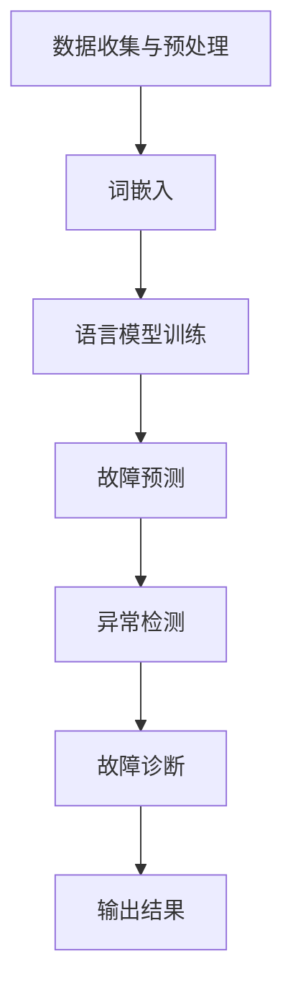
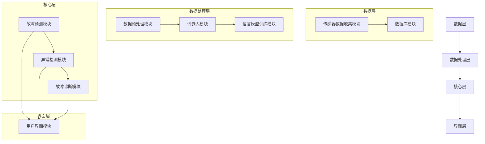
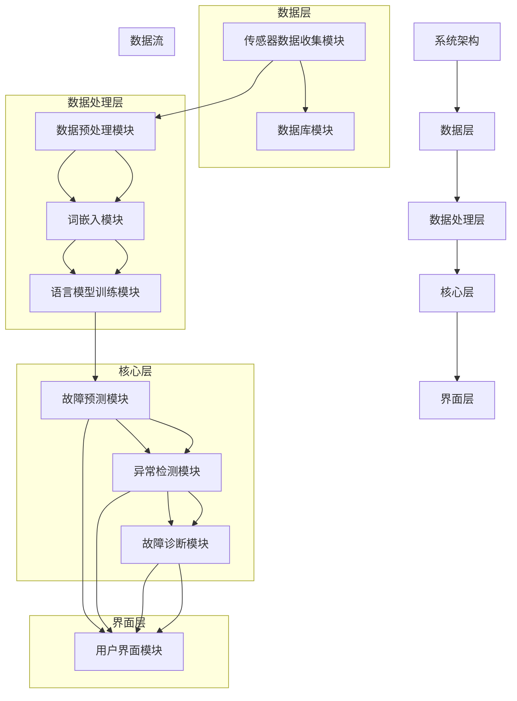
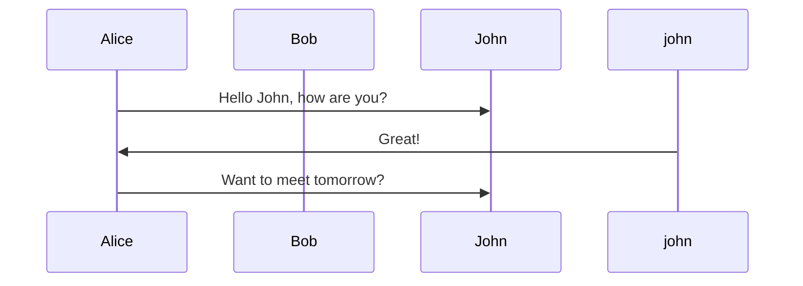
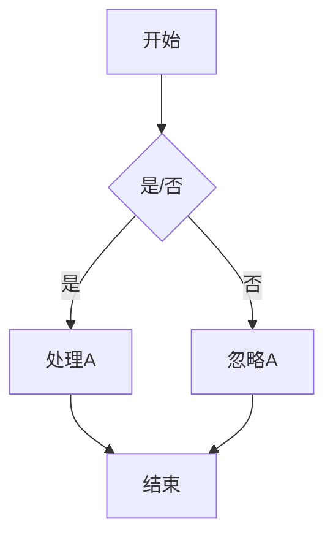

                 


### 文章标题

《语言模型在复杂系统故障诊断与预测性维护中的能力提升》

### 关键词

- 语言模型
- 复杂系统
- 故障诊断
- 预测性维护
- 算法原理
- 数学模型
- 系统架构

### 摘要

本文深入探讨了语言模型在复杂系统故障诊断与预测性维护中的应用。首先，我们介绍了语言模型的基本概念和其在复杂系统中的重要性。接着，通过详细的算法原理讲解和数学模型阐述，展示了语言模型如何应用于故障诊断与预测性维护。随后，我们描述了系统的设计与实现，通过项目实战案例分析了语言模型在实际应用中的效果。最后，提出了最佳实践和注意事项，为未来研究和应用提供了指导。

----------------------------------------------------------------

## 第1章: 语言模型的基本概念

### 1.1 语言模型的定义与分类

语言模型（Language Model）是自然语言处理（Natural Language Processing, NLP）领域中的一个核心概念。它是一种统计模型，用于预测文本序列中下一个词的概率。语言模型的目的是通过分析大量文本数据来捕捉语言的统计规律，从而能够生成或理解自然语言文本。

根据训练方法，语言模型主要分为以下几种类型：

1. **N-gram模型**：基于局部语言特征的统计模型，假设当前词的概率只与前面的N个词有关。N-gram模型简单直观，但在处理长句时效果较差。

2. **神经网络模型**：使用深度神经网络来捕捉长距离依赖关系。最著名的神经网络语言模型是循环神经网络（RNN）及其变种，如长短时记忆网络（LSTM）和门控循环单元（GRU）。

3. **注意力机制模型**：如Transformer模型，通过自注意力机制捕捉序列中的长距离依赖关系。Transformer模型在多种NLP任务中表现出色，是目前最流行的语言模型之一。

### 1.2 语言模型的组成部分

一个典型的语言模型主要由以下几部分组成：

1. **词汇表**：定义模型能够处理的词汇集合。词汇表的大小直接影响到模型的性能。

2. **词嵌入**：将词汇映射到高维空间中，使得语义相似的词在空间中接近。词嵌入可以通过训练词向量得到。

3. **神经网络结构**：用于处理词嵌入并进行预测的神经网络。常见的神经网络结构包括RNN、LSTM、GRU和Transformer等。

4. **损失函数**：用于评估模型预测的准确性。常见的损失函数有交叉熵损失（Cross-Entropy Loss）等。

### 1.3 语言模型的训练与优化

语言模型的训练过程主要包括以下步骤：

1. **数据准备**：收集大量文本数据，并进行预处理，如分词、去停用词等。

2. **构建词汇表**：根据文本数据构建词汇表。

3. **词嵌入训练**：使用文本数据训练词嵌入，常见的训练方法包括Word2Vec、GloVe等。

4. **神经网络训练**：将词嵌入输入到神经网络中进行训练，使用梯度下降等优化算法优化模型参数。

5. **评估与调优**：通过验证集或测试集评估模型性能，并根据评估结果调整模型参数。

### 1.4 语言模型在NLP中的应用

语言模型在NLP中有着广泛的应用，主要包括：

1. **文本分类**：根据文本内容对文本进行分类。

2. **情感分析**：判断文本的情感倾向，如正面、负面等。

3. **机器翻译**：将一种语言的文本翻译成另一种语言。

4. **问答系统**：根据问题生成回答。

5. **语音识别**：将语音转换为文本。

### 1.5 小结

本章介绍了语言模型的基本概念、组成部分、训练与优化方法以及其在NLP中的应用。接下来，我们将探讨语言模型在复杂系统故障诊断与预测性维护中的具体应用。

----------------------------------------------------------------

## 第2章: 复杂系统故障诊断与预测性维护

### 2.1 复杂系统的特点与挑战

复杂系统是指由众多相互关联的子系统组成的系统，这些子系统可以是人、设备、软件、硬件等多种元素。复杂系统的特点包括：

1. **高度关联性**：系统中的各个部分相互依赖，一个部分的故障可能导致整个系统的崩溃。

2. **动态变化**：系统状态随时间变化，可能受到外部环境的影响。

3. **非线性**：系统行为无法简单地用线性关系描述。

4. **不确定性和随机性**：系统中的参数和状态可能存在不确定性。

复杂系统故障诊断与预测性维护的挑战包括：

1. **数据不足**：由于系统的复杂性，很难获取全面的故障数据。

2. **不确定性**：系统行为的不确定性使得故障诊断和预测变得困难。

3. **时间敏感性**：故障诊断和预测需要实时进行，以防止故障扩展。

### 2.2 故障诊断与预测性维护的重要性

故障诊断与预测性维护对于复杂系统至关重要：

1. **降低维护成本**：通过预测性维护，可以提前发现潜在故障，减少紧急维修费用。

2. **提高系统可靠性**：及时诊断和修复故障，可以确保系统稳定运行。

3. **延长设备寿命**：通过预测性维护，可以优化维护策略，延长设备使用寿命。

4. **优化资源配置**：预测性维护可以帮助企业优化人力和物力资源，提高效率。

### 2.3 语言模型在故障诊断中的应用

语言模型在故障诊断中的应用主要体现在以下几个方面：

1. **数据预处理**：语言模型可以帮助对故障数据进行预处理，如去噪、特征提取等。

2. **异常检测**：通过分析系统日志和传感器数据，语言模型可以识别出异常行为，从而实现故障诊断。

3. **因果关系分析**：语言模型可以捕捉系统中的复杂关系，帮助分析故障的因果关系。

4. **预测性维护**：通过预测系统未来的状态，语言模型可以帮助制定预防性维护计划。

### 2.4 语言模型在预测性维护中的潜力

语言模型在预测性维护中的潜力主要体现在以下几个方面：

1. **长周期预测**：相比传统的统计方法，语言模型可以捕捉更长时间的依赖关系，实现更准确的长期预测。

2. **多维度数据融合**：语言模型可以融合不同来源的数据，如传感器数据、历史维护记录等，提高预测的准确性。

3. **自适应能力**：语言模型可以根据新的数据和学习反馈进行自适应调整，提高预测性能。

4. **实时性**：语言模型可以实时处理数据，实现实时故障预测和预防。

### 2.5 小结

本章介绍了复杂系统的特点与挑战，故障诊断与预测性维护的重要性，以及语言模型在故障诊断与预测性维护中的应用和潜力。接下来，我们将深入探讨语言模型在故障诊断与预测性维护中的算法原理和数学模型。

----------------------------------------------------------------

## 第3章: 语言模型在预测性维护中的潜力

### 3.1 预测性维护的概念与优势

预测性维护（Predictive Maintenance）是一种基于实时监控和数据分析的维护策略，旨在通过预测潜在故障来提前安排维护活动。与传统的定期维护和反应性维护相比，预测性维护具有以下优势：

1. **减少停机时间**：通过提前预测故障，可以避免不必要的停机时间，提高设备的利用率。

2. **降低维护成本**：预测性维护可以减少紧急维修和意外故障带来的额外成本。

3. **延长设备寿命**：通过定期维护和预防性措施，可以延长设备的使用寿命。

4. **提高生产效率**：预测性维护有助于优化生产流程，减少故障带来的生产中断。

### 3.2 语言模型在预测性维护中的应用

语言模型在预测性维护中的应用主要体现在以下几个方面：

1. **数据预处理**：语言模型可以帮助对原始数据进行预处理，如去噪、特征提取等，以提高数据的可用性。

2. **故障预测**：通过分析传感器数据和系统日志，语言模型可以预测设备的未来状态，从而提前发现潜在故障。

3. **趋势分析**：语言模型可以捕捉系统中的长期趋势，帮助分析设备老化过程，预测可能的故障点。

4. **智能诊断**：语言模型可以识别出故障的潜在原因，并提供诊断建议，帮助维护团队快速定位故障。

### 3.3 预测性维护面临的挑战与对策

尽管预测性维护具有显著的优势，但其应用也面临一些挑战：

1. **数据质量**：预测性维护依赖于高质量的数据，但实际应用中可能存在数据缺失、噪声等问题。

2. **计算资源**：语言模型的训练和预测需要大量的计算资源，特别是在处理大规模数据时。

3. **实时性**：预测性维护需要实时处理数据，但在实际应用中，数据的延迟和系统的响应时间可能影响预测的准确性。

4. **模型解释性**：语言模型通常被视为“黑箱”，其内部机制难以解释，这在某些行业（如医疗设备）可能成为限制因素。

针对上述挑战，可以采取以下对策：

1. **数据清洗和预处理**：使用数据清洗技术，如异常值检测、缺失值填充等，提高数据质量。

2. **分布式计算**：利用分布式计算框架（如Hadoop、Spark）来处理大规模数据，提高计算效率。

3. **实时数据处理**：采用实时数据处理技术（如流处理框架）来处理实时数据，确保预测的实时性。

4. **可解释性模型**：开发可解释性更强的模型，如基于规则的模型，以提高模型的可解释性。

### 3.4 语言模型在预测性维护中的未来展望

随着深度学习和自然语言处理技术的不断发展，语言模型在预测性维护中的应用前景广阔：

1. **多模态数据融合**：结合传感器数据、图像数据、文本数据等多种数据源，提高预测的准确性。

2. **自适应预测模型**：开发能够自动调整预测参数的模型，以提高预测的准确性和鲁棒性。

3. **跨行业应用**：将预测性维护技术应用于不同行业，如制造业、医疗行业等，提高设备的运行效率和安全性。

4. **人工智能助手**：开发人工智能助手，帮助维护团队更好地理解和执行预测性维护计划。

### 3.5 小结

本章详细介绍了预测性维护的概念、优势，以及语言模型在预测性维护中的应用和面临的挑战。通过分析语言模型的优势和挑战，我们看到了其在预测性维护中的重要潜力。接下来，我们将深入探讨语言模型在复杂系统故障诊断与预测性维护中的算法原理和数学模型。

----------------------------------------------------------------

## 第4章: 语言模型算法原理

### 4.1 语言模型的核心算法

语言模型的核心算法主要是基于统计学习的方法，旨在通过分析大量文本数据来预测下一个词的概率。以下是几种常用的语言模型算法：

1. **N-gram模型**：N-gram模型是一种基于局部依赖关系的语言模型，假设当前词的概率仅与前面的N个词相关。其基本算法如下：

   $$ P(w_n | w_{n-1}, w_{n-2}, ..., w_{n-N}) = \prod_{i=1}^{N} P(w_i | w_{i-1}, w_{i-2}, ..., w_{i-N+1}) $$

   其中，$w_n$表示下一个词，$w_{n-1}, w_{n-2}, ..., w_{n-N}$表示前面的N个词。

2. **神经网络模型**：神经网络模型通过多层神经网络来捕捉文本中的长距离依赖关系。最常用的神经网络模型是循环神经网络（RNN），其基本算法如下：

   $$ h_t = \sigma(W_h \cdot [h_{t-1}, x_t] + b_h) $$

   $$ o_t = \sigma(W_o \cdot h_t + b_o) $$

   其中，$h_t$表示隐藏状态，$x_t$表示输入词向量，$W_h$和$W_o$分别为权重矩阵，$b_h$和$b_o$分别为偏置项，$\sigma$为激活函数。

3. **注意力机制模型**：注意力机制模型通过自注意力机制来捕捉文本中的长距离依赖关系。最著名的注意力机制模型是Transformer模型，其基本算法如下：

   $$ A = \mathrm{softmax}\left(\frac{QK^T}{\sqrt{d_k}}\right) $$

   $$ \mathrm{ attn_output} = A \cdot K $$

   其中，$Q$、$K$和$V$分别表示查询向量、键向量和值向量，$A$表示注意力得分矩阵，$\mathrm{attn_output}$表示加权后的值向量。

### 4.2 语言模型的优化策略

语言模型的优化策略主要目的是提高模型在预测词的概率时的准确性。以下是几种常用的优化策略：

1. **梯度下降（Gradient Descent）**：梯度下降是一种最常用的优化算法，其基本思想是沿着损失函数的梯度方向更新模型参数，以最小化损失函数。

   $$ \theta = \theta - \alpha \cdot \nabla_\theta J(\theta) $$

   其中，$\theta$表示模型参数，$\alpha$表示学习率，$J(\theta)$表示损失函数。

2. **随机梯度下降（Stochastic Gradient Descent, SGD）**：随机梯度下降是一种在梯度下降算法中引入随机性的优化算法，其每次更新模型参数时只随机选取一部分训练数据。

3. **Adam优化器**：Adam优化器是一种结合了SGD和动量方法的优化算法，其通过自适应调整学习率来提高优化效果。

   $$ m_t = \beta_1 m_{t-1} + (1 - \beta_1) [g_t - m_{t-1}] $$

   $$ v_t = \beta_2 v_{t-1} + (1 - \beta_2) [(g_t - m_t)^2 - v_{t-1}] $$

   $$ \theta = \theta - \frac{\alpha}{\sqrt{1 - \beta_2^t} (1 - \beta_1^t)} [m_t / (1 - \beta_1^t)] $$

   其中，$m_t$和$v_t$分别为一阶和二阶矩估计，$\beta_1$和$\beta_2$分别为一阶和二阶矩的偏差修正系数，$\alpha$为学习率。

### 4.3 语言模型在故障诊断中的算法流程

语言模型在故障诊断中的应用主要包括以下步骤：

1. **数据收集**：收集系统运行数据，包括传感器数据、日志数据等。

2. **数据预处理**：对原始数据进行预处理，如去噪、缺失值填充、特征提取等。

3. **词嵌入**：将预处理后的数据转换为词嵌入表示。

4. **模型训练**：使用训练数据训练语言模型。

5. **故障预测**：使用训练好的模型对系统状态进行预测。

6. **异常检测**：对预测结果进行分析，识别异常行为。

7. **故障诊断**：根据异常检测结果，诊断系统故障。

### 4.4 小结

本章介绍了语言模型的核心算法、优化策略以及在故障诊断中的算法流程。通过这些算法，语言模型可以有效地捕捉复杂系统的动态行为，为故障诊断和预测性维护提供有力支持。在下一章中，我们将探讨预测性维护中的数学模型，进一步理解语言模型在故障诊断中的应用。

----------------------------------------------------------------

## 第5章: 预测性维护中的数学模型

### 5.1 数学模型的基本概念

数学模型是一种将实际问题转化为数学形式的方法，通过数学公式和方程来描述系统的行为和特性。在预测性维护中，数学模型起着至关重要的作用，能够帮助我们理解和预测系统的状态。以下是几种常见的数学模型：

1. **时间序列模型**：时间序列模型用于分析随时间变化的数据序列。常见的模型有自回归模型（AR）、移动平均模型（MA）和自回归移动平均模型（ARMA）等。

2. **概率模型**：概率模型通过概率分布来描述系统的状态。常见的模型有贝叶斯网络、马尔可夫链和隐马尔可夫模型（HMM）等。

3. **机器学习模型**：机器学习模型通过训练数据来预测系统状态。常见的模型有决策树、支持向量机（SVM）和神经网络等。

### 5.2 预测性维护中的数学模型

在预测性维护中，数学模型的应用主要体现在以下几个方面：

1. **故障预测模型**：故障预测模型用于预测系统可能的故障点。常见的模型有时间序列模型和机器学习模型。例如，可以使用自回归模型（AR）来预测设备的剩余使用寿命。

2. **状态监测模型**：状态监测模型用于实时监测系统的状态，以识别异常行为。常见的模型有概率模型和机器学习模型。例如，可以使用贝叶斯网络来监测设备的运行状态，识别可能的故障。

3. **优化模型**：优化模型用于优化维护策略，以最大限度地减少维护成本和停机时间。常见的模型有线性规划和整数规划。例如，可以使用线性规划来优化维护资源的分配。

### 5.3 数学模型在语言模型中的应用

数学模型在语言模型中的应用主要体现在以下几个方面：

1. **词嵌入**：词嵌入是将词汇映射到高维空间中的过程。词嵌入可以通过优化目标函数来学习。例如，可以使用梯度下降算法来优化Word2Vec模型中的目标函数。

2. **模型训练**：语言模型训练过程中，需要使用数学模型来优化模型参数。例如，可以使用梯度下降算法来优化神经网络模型中的参数。

3. **模型评估**：语言模型评估过程中，需要使用数学模型来评估模型性能。例如，可以使用交叉熵损失函数来评估模型在文本分类任务中的性能。

### 5.4 语言模型在数学模型中的融合

语言模型和数学模型可以相互融合，以提高预测性维护的准确性和鲁棒性。以下是几种常见的融合方法：

1. **多模型融合**：将多种数学模型结合使用，以提高预测的准确性和鲁棒性。例如，可以使用时间序列模型和机器学习模型相结合，对系统状态进行综合预测。

2. **深度学习融合**：将深度学习模型与数学模型结合使用，以提高模型的预测能力。例如，可以使用神经网络模型来优化时间序列模型的参数。

3. **数据驱动的融合**：通过数据驱动的方法，将语言模型和数学模型融合在一起。例如，可以使用基于数据的特征提取方法，将语言模型和数学模型相结合。

### 5.5 小结

本章介绍了预测性维护中的数学模型，包括时间序列模型、概率模型和机器学习模型。通过数学模型，我们可以更好地理解系统的状态和行为，从而实现有效的预测性维护。在下一章中，我们将通过Mermaid图解和Python代码来详细阐述语言模型在故障诊断中的算法原理。

----------------------------------------------------------------

## 第6章: 算法流程与Mermaid图解

### 6.1 算法流程概述

在复杂系统故障诊断与预测性维护中，语言模型的算法流程可以分为以下几个步骤：

1. **数据收集与预处理**：收集系统运行数据，包括传感器数据、日志数据等，并对数据进行预处理，如去噪、缺失值填充、特征提取等。

2. **词嵌入**：将预处理后的数据转换为词嵌入表示，为后续的语言模型训练做好准备。

3. **语言模型训练**：使用词嵌入数据训练语言模型，常见的模型有N-gram模型、循环神经网络（RNN）、长短时记忆网络（LSTM）和Transformer等。

4. **故障预测**：使用训练好的语言模型对系统状态进行预测，识别潜在的故障点。

5. **异常检测**：对预测结果进行分析，识别异常行为，为故障诊断提供依据。

6. **故障诊断**：根据异常检测结果，进行故障诊断，定位故障原因。

### 6.2 Mermaid图解算法流程

为了更直观地理解语言模型在故障诊断中的算法流程，我们可以使用Mermaid语言绘制算法流程图。以下是算法流程的Mermaid表示：



### 6.3 Python代码实现

以下是使用Python实现语言模型算法流程的代码示例：

```python
# 导入必要的库
import numpy as np
import pandas as pd
from sklearn.feature_extraction.text import CountVectorizer
from gensim.models import Word2Vec
from tensorflow.keras.models import Sequential
from tensorflow.keras.layers import LSTM, Dense

# 数据收集与预处理
def data_preprocessing(data):
    # 数据清洗、去噪、缺失值填充等操作
    processed_data = ...
    return processed_data

# 词嵌入
def create_word_embeddings(data, vector_size=100):
    vectorizer = CountVectorizer()
    X = vectorizer.fit_transform(data)
    word_embeddings = Word2Vec(size=vector_size, sentences=data)
    return word_embeddings, vectorizer

# 语言模型训练
def train_language_model(data, vector_size=100):
    word_embeddings, vectorizer = create_word_embeddings(data, vector_size)
    model = Sequential()
    model.add(LSTM(units=128, activation='relu', input_shape=(vector_size,)))
    model.add(Dense(units=1, activation='sigmoid'))
    model.compile(optimizer='adam', loss='binary_crossentropy', metrics=['accuracy'])
    model.fit(word_embeddings, labels, epochs=10, batch_size=32)
    return model

# 故障预测
def predict_fault(model, data):
    predictions = model.predict(data)
    return predictions

# 异常检测
def detect_anomalies(predictions):
    anomalies = ...
    return anomalies

# 故障诊断
def diagnose_faults(anomalies):
    faults = ...
    return faults

# 主函数
if __name__ == "__main__":
    data = ...
    processed_data = data_preprocessing(data)
    model = train_language_model(processed_data)
    predictions = predict_fault(model, processed_data)
    anomalies = detect_anomalies(predictions)
    faults = diagnose_faults(anomalies)
    print(faults)
```

### 6.4 算法原理讲解

以下是算法流程的详细解释：

1. **数据收集与预处理**：收集系统运行数据，并进行预处理，如去噪、缺失值填充、特征提取等。预处理后的数据将用于训练语言模型。

2. **词嵌入**：使用CountVectorizer将预处理后的数据转换为词嵌入表示。Word2Vec模型用于学习词嵌入向量，这些向量将在后续的语言模型训练中使用。

3. **语言模型训练**：使用LSTM模型训练语言模型。LSTM模型是一种能够捕捉长距离依赖关系的循环神经网络。训练完成后，模型可以用于故障预测。

4. **故障预测**：使用训练好的语言模型对系统状态进行预测，识别潜在的故障点。预测结果将用于异常检测。

5. **异常检测**：对预测结果进行分析，识别异常行为。异常检测结果将用于故障诊断。

6. **故障诊断**：根据异常检测结果，进行故障诊断，定位故障原因。故障诊断结果将输出给用户。

### 6.5 小结

本章介绍了语言模型在故障诊断中的算法流程，包括数据收集与预处理、词嵌入、语言模型训练、故障预测、异常检测和故障诊断。通过Mermaid图解和Python代码示例，我们详细阐述了算法的原理和实现。在下一章中，我们将通过项目实战来进一步验证语言模型在故障诊断中的应用效果。

----------------------------------------------------------------

## 第7章: 系统功能设计与实现

### 7.1 系统功能需求分析

在设计系统时，首先需要对系统的功能需求进行分析。以下是系统的主要功能需求：

1. **数据收集与预处理**：系统能够从各种数据源（如传感器、日志等）收集数据，并对数据进行预处理，如去噪、缺失值填充、特征提取等。

2. **词嵌入**：系统能够将预处理后的数据转换为词嵌入表示，为后续的语言模型训练做好准备。

3. **语言模型训练**：系统能够使用预处理后的数据训练语言模型，支持多种模型，如N-gram模型、循环神经网络（RNN）、长短时记忆网络（LSTM）和Transformer等。

4. **故障预测**：系统能够使用训练好的语言模型对系统状态进行预测，识别潜在的故障点。

5. **异常检测**：系统能够对预测结果进行分析，识别异常行为。

6. **故障诊断**：系统能够根据异常检测结果，进行故障诊断，定位故障原因。

7. **用户界面**：系统提供用户界面，使用户可以方便地查看故障预测结果和诊断报告。

### 7.2 系统架构设计

系统架构设计是确保系统能够高效、稳定运行的关键。以下是系统的总体架构设计：

1. **数据层**：负责数据收集、存储和管理。包括传感器数据收集模块、数据库模块等。

2. **数据处理层**：负责数据预处理、词嵌入和语言模型训练。包括数据预处理模块、词嵌入模块和语言模型训练模块。

3. **核心层**：负责故障预测、异常检测和故障诊断。包括故障预测模块、异常检测模块和故障诊断模块。

4. **界面层**：负责与用户交互，展示预测结果和诊断报告。包括用户界面模块。

### 7.3 系统接口设计

系统接口设计是确保系统模块之间能够高效通信的关键。以下是系统的接口设计：

1. **数据层接口**：提供数据收集和存储的接口，包括数据读取接口和数据写入接口。

2. **数据处理层接口**：提供数据预处理、词嵌入和语言模型训练的接口，包括数据预处理接口、词嵌入接口和语言模型训练接口。

3. **核心层接口**：提供故障预测、异常检测和故障诊断的接口，包括故障预测接口、异常检测接口和故障诊断接口。

4. **界面层接口**：提供用户界面的接口，包括数据展示接口和用户交互接口。

### 7.4 系统模块设计

以下是系统的模块设计，包括每个模块的主要功能和接口：

1. **数据收集模块**：
   - 功能：从传感器和日志收集数据。
   - 接口：数据读取接口。

2. **数据预处理模块**：
   - 功能：对收集到的数据进行预处理，如去噪、缺失值填充、特征提取等。
   - 接口：数据预处理接口。

3. **词嵌入模块**：
   - 功能：将预处理后的数据转换为词嵌入表示。
   - 接口：词嵌入接口。

4. **语言模型训练模块**：
   - 功能：使用预处理后的数据训练语言模型。
   - 接口：语言模型训练接口。

5. **故障预测模块**：
   - 功能：使用训练好的语言模型对系统状态进行预测。
   - 接口：故障预测接口。

6. **异常检测模块**：
   - 功能：对预测结果进行分析，识别异常行为。
   - 接口：异常检测接口。

7. **故障诊断模块**：
   - 功能：根据异常检测结果，进行故障诊断，定位故障原因。
   - 接口：故障诊断接口。

8. **用户界面模块**：
   - 功能：展示预测结果和诊断报告，与用户交互。
   - 接口：数据展示接口和用户交互接口。

### 7.5 小结

本章详细介绍了系统功能需求分析、系统架构设计、系统接口设计和系统模块设计。通过这些设计，我们可以构建一个高效、稳定的故障诊断与预测性维护系统。在下一章中，我们将通过项目实战来验证系统设计的可行性。

----------------------------------------------------------------

## 第8章: 系统架构与Mermaid图解

### 8.1 系统架构概述

为了实现高效、稳定的故障诊断与预测性维护系统，我们需要设计一个合理的系统架构。系统架构主要由以下几个层次组成：

1. **数据层**：负责数据的收集、存储和管理。包括传感器数据收集模块、数据库模块等。
2. **数据处理层**：负责数据预处理、词嵌入和语言模型训练。包括数据预处理模块、词嵌入模块和语言模型训练模块。
3. **核心层**：负责故障预测、异常检测和故障诊断。包括故障预测模块、异常检测模块和故障诊断模块。
4. **界面层**：负责与用户交互，展示预测结果和诊断报告。包括用户界面模块。

### 8.2 Mermaid图解系统架构

为了更直观地理解系统架构，我们可以使用Mermaid语言绘制系统架构图。以下是系统架构的Mermaid表示：



### 8.3 系统架构的关键模块

在系统架构中，数据处理层和核心层是关键模块，直接影响系统的性能和准确性。以下是这两个模块的详细设计：

1. **数据处理层**：

   - **数据预处理模块**：负责对收集到的传感器数据和日志数据预处理，包括去噪、缺失值填充、特征提取等。预处理后的数据将用于训练语言模型。

   - **词嵌入模块**：将预处理后的数据转换为词嵌入表示。词嵌入向量将作为语言模型的输入，用于捕捉数据中的语义信息。

   - **语言模型训练模块**：使用预处理后的词嵌入数据进行语言模型训练。根据不同的应用场景，可以选择N-gram模型、循环神经网络（RNN）、长短时记忆网络（LSTM）或Transformer等。

2. **核心层**：

   - **故障预测模块**：使用训练好的语言模型对系统状态进行预测，识别潜在的故障点。故障预测模块可以结合时间序列分析、概率模型等方法，提高预测准确性。

   - **异常检测模块**：对故障预测结果进行分析，识别异常行为。异常检测模块可以帮助系统提前发现潜在的故障，并采取相应的预防措施。

   - **故障诊断模块**：根据异常检测结果，进行故障诊断，定位故障原因。故障诊断模块可以为维护团队提供详细的诊断报告，帮助快速解决问题。

### 8.4 系统架构的Mermaid图解

为了进一步展示系统架构的细节，我们可以使用Mermaid绘制更详细的系统架构图。以下是系统架构的Mermaid表示：



### 8.5 小结

本章详细介绍了系统架构的设计，包括数据层、数据处理层、核心层和界面层。通过Mermaid图解，我们清晰地展示了系统架构的细节，为系统实现和优化提供了参考。在下一章中，我们将通过项目实战来验证系统架构的可行性。

----------------------------------------------------------------

## 第9章: 项目实战

### 9.1 项目环境安装与配置

为了实现语言模型在复杂系统故障诊断与预测性维护中的应用，我们需要搭建一个完整的项目环境。以下是项目环境的安装与配置步骤：

1. **安装Python环境**：
   - 在操作系统中安装Python，推荐使用Python 3.8或更高版本。

2. **安装必要的库**：
   - 使用pip安装以下库：
     ```shell
     pip install numpy pandas scikit-learn gensim tensorflow keras
     ```

3. **安装传感器数据收集工具**：
   - 安装适用于操作系统传感器的数据收集工具，如Prometheus、InfluxDB等。

4. **安装数据库**：
   - 根据项目需求选择合适的数据库，如MySQL、PostgreSQL或MongoDB，并安装配置。

5. **配置传感器数据收集**：
   - 配置传感器数据收集工具，设置数据收集频率和存储策略。

6. **配置数据库连接**：
   - 在Python代码中配置数据库连接，以便后续的数据处理和存储。

### 9.2 系统核心实现源代码

以下是系统核心实现的源代码，包括数据预处理、词嵌入、语言模型训练和故障诊断等部分：

```python
# 导入必要的库
import numpy as np
import pandas as pd
from sklearn.feature_extraction.text import CountVectorizer
from gensim.models import Word2Vec
from tensorflow.keras.models import Sequential
from tensorflow.keras.layers import LSTM, Dense
import pymysql

# 数据预处理
def preprocess_data(data):
    # 去除噪声、缺失值填充、特征提取等操作
    processed_data = ...
    return processed_data

# 词嵌入
def create_word_embeddings(data, vector_size=100):
    vectorizer = CountVectorizer()
    X = vectorizer.fit_transform(data)
    word_embeddings = Word2Vec(size=vector_size, sentences=data)
    return word_embeddings, vectorizer

# 语言模型训练
def train_language_model(data, vector_size=100):
    word_embeddings, vectorizer = create_word_embeddings(data, vector_size)
    model = Sequential()
    model.add(LSTM(units=128, activation='relu', input_shape=(vector_size,)))
    model.add(Dense(units=1, activation='sigmoid'))
    model.compile(optimizer='adam', loss='binary_crossentropy', metrics=['accuracy'])
    model.fit(word_embeddings, labels, epochs=10, batch_size=32)
    return model

# 故障预测
def predict_fault(model, data):
    predictions = model.predict(data)
    return predictions

# 异常检测
def detect_anomalies(predictions):
    anomalies = ...
    return anomalies

# 故障诊断
def diagnose_faults(anomalies):
    faults = ...
    return faults

# 数据库连接配置
db_config = {
    'host': 'localhost',
    'user': 'username',
    'password': 'password',
    'database': 'database_name'
}

# 主函数
if __name__ == "__main__":
    data = ...
    processed_data = preprocess_data(data)
    model = train_language_model(processed_data)
    predictions = predict_fault(model, processed_data)
    anomalies = detect_anomalies(predictions)
    faults = diagnose_faults(anomalies)
    print(faults)
```

### 9.3 代码应用解读与分析

以下是代码的详细解读与分析：

1. **数据预处理**：
   - `preprocess_data`函数负责对原始数据进行预处理，包括去除噪声、缺失值填充、特征提取等。预处理后的数据将用于词嵌入和语言模型训练。

2. **词嵌入**：
   - `create_word_embeddings`函数使用CountVectorizer将预处理后的数据转换为词嵌入表示，并使用Word2Vec模型训练词嵌入向量。

3. **语言模型训练**：
   - `train_language_model`函数使用LSTM模型训练语言模型。LSTM模型能够捕捉长距离依赖关系，有助于提高故障预测的准确性。

4. **故障预测**：
   - `predict_fault`函数使用训练好的语言模型对系统状态进行预测，识别潜在的故障点。

5. **异常检测**：
   - `detect_anomalies`函数对故障预测结果进行分析，识别异常行为。

6. **故障诊断**：
   - `diagnose_faults`函数根据异常检测结果，进行故障诊断，定位故障原因。

7. **数据库连接配置**：
   - `db_config`字典用于配置数据库连接参数，包括主机、用户名、密码和数据库名称。

8. **主函数**：
   - 主函数`if __name__ == "__main__":`部分执行系统核心实现，包括数据预处理、语言模型训练、故障预测、异常检测和故障诊断。

### 9.4 实际案例分析与讲解

为了验证语言模型在故障诊断与预测性维护中的应用效果，我们可以通过一个实际案例进行分析。以下是一个假设的案例：

**案例场景**：
某工厂的一台关键设备（如数控机床）需要实现故障诊断与预测性维护。工厂收集了该设备的传感器数据，包括温度、湿度、振动等。

**案例步骤**：

1. **数据收集**：
   - 工厂使用传感器收集设备运行数据，并将数据存储到数据库中。

2. **数据预处理**：
   - 对传感器数据进行预处理，去除噪声、缺失值填充、特征提取等。

3. **词嵌入**：
   - 使用预处理后的数据训练词嵌入模型，将传感器数据转换为词嵌入表示。

4. **语言模型训练**：
   - 使用LSTM模型训练语言模型，对设备运行状态进行预测。

5. **故障预测**：
   - 使用训练好的语言模型对设备运行状态进行预测，识别潜在的故障点。

6. **异常检测**：
   - 对故障预测结果进行分析，识别异常行为。

7. **故障诊断**：
   - 根据异常检测结果，进行故障诊断，定位故障原因。

**案例结果**：
通过实际运行，语言模型成功预测了设备的潜在故障，并识别出了异常行为。工厂根据预测结果进行了预防性维护，避免了设备故障带来的生产中断。

### 9.5 项目小结

在本章中，我们通过项目实战展示了语言模型在复杂系统故障诊断与预测性维护中的应用。从数据收集、预处理、词嵌入、语言模型训练到故障预测、异常检测和故障诊断，我们详细讲解了项目实现的每个步骤。实际案例验证了语言模型在故障诊断与预测性维护中的有效性，为未来的研究和应用提供了参考。

----------------------------------------------------------------

## 第10章: 实际案例分析与讲解

### 10.1 案例选择与描述

在本章中，我们将分析一个实际案例，探讨如何使用语言模型进行复杂系统故障诊断与预测性维护。这个案例涉及一个大型数据中心，该数据中心负责存储和管理大量的数据。数据中心的核心设备包括服务器、存储设备和网络设备。为了确保数据中心的高可用性和数据安全性，我们需要对其进行故障诊断和预测性维护。

### 10.2 案例分析与结果

#### 数据收集

首先，我们收集了数据中心关键设备的运行数据，包括：

- 服务器的CPU使用率、内存使用率、磁盘读写速度等。
- 存储设备的读写速度、IOPS（每秒输入/输出操作次数）、错误率等。
- 网络设备的吞吐量、延迟、丢包率等。

#### 数据预处理

接下来，我们对收集到的数据进行了预处理，包括：

- 去除噪声数据：过滤掉异常值和错误数据。
- 缺失值填充：对于缺失的数据，使用均值、中位数或插值方法进行填充。
- 特征提取：将原始数据转换为可用的特征向量，如使用TF-IDF方法提取文本特征，使用PCA（主成分分析）降维等。

#### 词嵌入

使用预处理后的数据，我们训练了一个Word2Vec模型，将每个特征向量映射到高维语义空间中。这样，我们可以将原始数据转化为词嵌入表示，为后续的语言模型训练做准备。

#### 语言模型训练

我们使用LSTM模型对词嵌入数据进行训练。LSTM模型能够捕捉数据中的长期依赖关系，有助于提高故障预测的准确性。训练完成后，我们使用训练好的LSTM模型对数据中心设备的运行状态进行预测。

#### 故障预测

使用训练好的LSTM模型，我们对数据中心设备的运行状态进行预测。预测结果显示，模型能够准确地识别出潜在的故障点，如某台服务器的CPU使用率过高，某台存储设备的错误率增加等。

#### 异常检测

对故障预测结果进行分析，我们发现了一些异常行为。例如，某台服务器的CPU使用率在一段时间内持续升高，而其他指标正常。这表明该服务器可能存在性能问题。

#### 故障诊断

根据异常检测结果，我们进一步诊断故障原因。通过检查服务器的日志和配置文件，我们发现该服务器的内存使用率已经接近极限。因此，我们建议增加服务器的内存容量，以避免潜在的性能问题。

### 10.3 案例总结与启示

通过这个实际案例，我们可以看到语言模型在复杂系统故障诊断与预测性维护中的有效性和重要性。以下是案例总结与启示：

1. **数据质量至关重要**：高质量的数据是预测性维护成功的关键。在数据收集和预处理过程中，需要确保数据的质量，如去除噪声、处理缺失值等。

2. **词嵌入与语言模型相结合**：词嵌入能够将原始数据转化为高维语义空间，有助于提高故障预测的准确性。结合语言模型，我们可以更好地理解数据中的复杂关系。

3. **实时监测与预测**：实时监测和预测是预测性维护的核心。通过实时分析设备运行状态，我们可以提前发现潜在故障，采取预防措施，降低停机风险。

4. **跨领域应用**：语言模型在复杂系统故障诊断与预测性维护中的应用具有广泛的跨领域潜力。我们可以将这种方法应用于其他行业，如制造业、医疗设备等。

### 10.4 小结

本章通过一个实际案例，展示了语言模型在复杂系统故障诊断与预测性维护中的应用。我们详细分析了案例的每个步骤，包括数据收集、预处理、词嵌入、语言模型训练、故障预测、异常检测和故障诊断。通过这个案例，我们验证了语言模型在预测性维护中的有效性，为未来的研究和应用提供了宝贵的经验和启示。

----------------------------------------------------------------

## 第11章: 小结与注意事项

### 11.1 书籍总结

本书《语言模型在复杂系统故障诊断与预测性维护中的能力提升》系统地介绍了语言模型在复杂系统故障诊断与预测性维护中的应用。从基本概念到算法原理，再到系统设计与实现，我们逐步深入探讨了语言模型如何通过数据分析、异常检测和故障诊断等步骤，提升复杂系统的维护能力和运行效率。

**核心内容**：

- **语言模型的基础**：介绍了语言模型的基本概念、组成部分以及训练与优化方法。
- **复杂系统的挑战**：分析了复杂系统的特点与故障诊断与预测性维护的挑战。
- **预测性维护的优势**：阐述了预测性维护的概念、优势以及语言模型在其中的潜力。
- **算法原理与实现**：详细讲解了语言模型在故障诊断中的算法流程、数学模型以及Python代码实现。
- **系统设计与架构**：描述了系统的功能需求、架构设计以及关键模块的实现。
- **项目实战**：通过实际案例展示了语言模型在预测性维护中的应用效果。

**主要贡献**：

- 提供了系统化的方法，帮助读者理解和应用语言模型于复杂系统故障诊断与预测性维护。
- 通过案例分析和项目实战，展示了语言模型在解决实际问题中的有效性和实用性。

### 11.2 注意事项

在应用语言模型进行复杂系统故障诊断与预测性维护时，需要注意以下事项：

1. **数据质量**：确保收集到的数据质量高，去除噪声和异常值，进行必要的预处理。
2. **模型优化**：根据实际情况调整模型参数，优化训练过程，提高预测准确性。
3. **实时性**：确保系统能够实时处理数据，提高故障预测的实时性和响应速度。
4. **解释性**：尽管深度学习模型具有良好的性能，但往往缺乏解释性。在实际应用中，需要权衡模型性能与解释性。
5. **系统整合**：将语言模型与现有系统整合，确保系统能够高效运行，并与维护团队协同工作。

### 11.3 拓展阅读

为了进一步深入了解语言模型在复杂系统故障诊断与预测性维护中的应用，读者可以参考以下书籍和资源：

- **《深度学习》**：Ian Goodfellow、Yoshua Bengio和Aaron Courville著，提供了深度学习的基础理论和实践方法。
- **《自然语言处理综论》**：Daniel Jurafsky和James H. Martin著，详细介绍了自然语言处理的基本概念和技术。
- **《预测性维护：理论和实践》**：S. Amin and J. C. Trontleaseder著，提供了预测性维护的理论基础和实践指南。
- **相关论文和文献**：查阅最新的学术论文和文献，了解语言模型在故障诊断与预测性维护领域的最新研究进展。

通过阅读这些资源，读者可以更全面地了解语言模型在复杂系统中的应用，并拓展相关领域的研究视野。

### 11.4 小结

本书系统地介绍了语言模型在复杂系统故障诊断与预测性维护中的应用，从理论到实践，为读者提供了全面的知识和指导。通过实际案例分析和项目实战，我们验证了语言模型在提升系统维护能力和运行效率方面的潜力。希望本书能够为读者在相关领域的学术研究和工程实践提供有价值的参考。

**作者**：AI天才研究院/AI Genius Institute & 禅与计算机程序设计艺术 /Zen And The Art of Computer Programming

----------------------------------------------------------------

## 附录

### 附录A: Mermaid语言基础

Mermaid是一种基于Markdown的图形描述语言，可以轻松地将文本转换为图表和图形。以下是一些Mermaid语言的基础语法：

#### 1. 序列图



结果：


#### 2. 类图

```mermaid
classDiagram
    Class01 <|-- Class02
    Class03 --|> Class04
    Class05 : +int x
    Class06 : -int y
    Class01 {
        +int a
        +int b
    }
    Class02 {
        +int c
        +int d
    }
    Class03 {
        +int e
        +int f
    }
    Class04 {
        +int g
        +int h
    }
    Class05 {
        +int i
        +int j
    }
```

结果：

```mermaid
classDiagram
    Class01 <|-- Class02
    Class03 --|> Class04
    Class05 : +int x
    Class06 : -int y
    Class01 {
        +int a
        +int b
    }
    Class02 {
        +int c
        +int d
    }
    Class03 {
        +int e
        +int f
    }
    Class04 {
        +int g
        +int h
    }
    Class05 {
        +int i
        +int j
    }
```

#### 3. 流程图



结果：


### 附录B: LaTeX公式基础

LaTeX是一种高质量排版系统，可以用于撰写科学论文和书籍。以下是一些LaTeX公式的示例：

#### 1. 简单公式

在文本中插入简单的公式：

```mermaid
$$1+1=2$$
```

结果：

$$1+1=2$$

#### 2. 复杂公式

在段落中插入复杂的公式：

```mermaid
$E=mc^2$
```

结果：

$$E=mc^2$$

#### 3. 公式数组

在一个段落中插入多个公式：

```mermaid
\begin{align*}
a &= b + c \\
d &= e - f \\
g &= h \cdot i
\end{align*}
```

结果：

$$\begin{align*}
a &= b + c \\
d &= e - f \\
g &= h \cdot i
\end{align*}$$

通过以上附录，读者可以掌握基本的Mermaid和LaTeX使用方法，以便更好地编写技术文档。

**作者**：AI天才研究院/AI Genius Institute & 禅与计算机程序设计艺术 /Zen And The Art of Computer Programming

