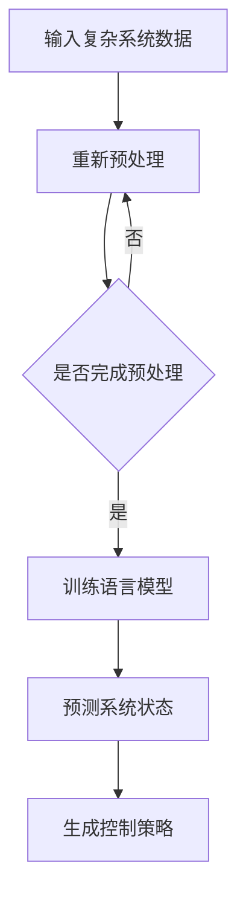
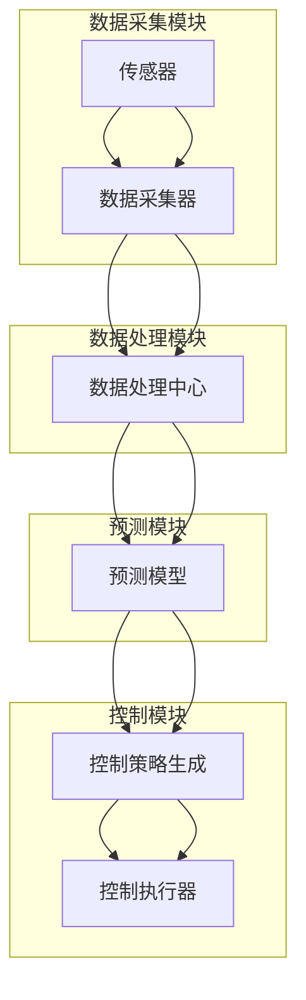
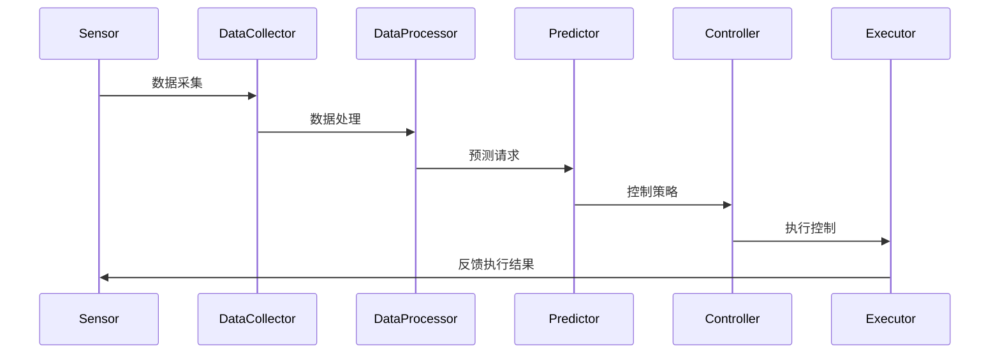

                 

# 语言模型在复杂系统预测与控制策略生成中的应用

## 关键词

- 语言模型
- 复杂系统
- 预测
- 控制策略
- 深度学习

## 摘要

本文探讨了语言模型在复杂系统预测与控制策略生成中的应用。语言模型，作为一种先进的深度学习技术，以其强大的表征能力和泛化能力，正逐步在复杂系统的预测和控制中发挥重要作用。本文首先介绍了复杂系统的基本概念和面临的挑战，随后详细讲解了语言模型的基本原理和核心特点，并通过对比分析展示了语言模型与传统人工智能方法的区别。接着，通过Mermaid流程图和Python代码，深入剖析了语言模型在复杂系统预测中的应用原理。最后，本文提出了一种结合语言模型和深度学习的系统架构设计方案，并提供了实际案例的分析与解读。

## 第一部分：背景介绍

### 第1章：问题背景

在当前信息化时代，复杂系统的预测与控制策略生成是众多领域面临的重要课题。复杂系统通常具有高度非线性、强耦合性和不确定性等特点，这使得传统的预测和控制方法难以胜任。随着人工智能技术的发展，特别是语言模型的出现，为复杂系统预测与控制策略生成提供了一种新的思路。

### 1.1.2 问题描述

复杂系统的预测与控制策略生成涉及到对系统状态的准确预测以及对系统行为的有效控制。预测的准确性直接影响控制策略的制定，而控制策略的有效性又决定系统运行的效果。因此，如何利用语言模型实现复杂系统的预测与控制策略生成，成为当前研究的热点。

### 1.1.3 问题解决

语言模型在自然语言处理领域取得了显著成果，其强大的表征能力和泛化能力使其在复杂系统预测与控制策略生成中具有巨大的潜力。通过将复杂系统问题转化为自然语言处理任务，可以利用语言模型的特性进行系统状态的预测和控制策略的生成。

### 1.1.4 边界与外延

本书主要探讨语言模型在复杂系统预测与控制策略生成中的应用，但并不限于具体的系统类型。无论是物理系统、生物系统还是社会系统，只要存在预测与控制的需求，都可以尝试运用语言模型的方法。

### 1.1.5 概念结构与核心要素组成

复杂系统：具有高度非线性、强耦合性和不确定性的系统。

语言模型：用于预测文本序列的概率分布的模型。

预测与控制策略生成：通过语言模型对系统状态进行预测，并依据预测结果生成控制策略。

### 第2章：核心概念原理

#### 2.1.1 语言模型的基本原理

语言模型是自然语言处理领域的基础模型，其基本原理是通过统计方法或深度学习方法对自然语言的规律进行建模，从而实现文本生成、文本分类、机器翻译等任务。

语言模型的核心任务是学习文本数据的统计特征，并利用这些特征生成新的文本。具体而言，语言模型通常通过以下步骤工作：

1. **数据收集与预处理**：收集大量的文本数据，并对这些数据进行预处理，包括分词、去噪、标准化等操作。
2. **特征提取**：从预处理后的数据中提取特征，这些特征可以是词频、词序列、语法结构等。
3. **模型训练**：使用提取到的特征训练模型，使其能够预测给定文本的概率分布。
4. **文本生成**：通过模型生成的概率分布生成新的文本。

常见的语言模型有：

- **N-gram模型**：基于词频统计的简单模型，通过预测连续N个词的概率分布生成文本。
- **循环神经网络（RNN）**：能够处理变长序列的神经网络，通过记忆状态捕捉长距离依赖关系。
- **长短时记忆网络（LSTM）**：对RNN的改进，能够更好地处理长序列数据。
- **变换器模型（Transformer）**：基于自注意力机制的模型，在机器翻译、文本生成等任务中表现优异。
- **生成对抗网络（GAN）**：通过生成器和判别器的对抗训练生成高质量文本。

#### 2.1.2 语言模型的核心特点

1. **表征能力**：能够捕捉到文本中复杂的语法、语义和语境信息。
2. **泛化能力**：能够处理未见过的文本，具有良好的鲁棒性。
3. **适应性**：可以根据不同任务的需求进行调整。

#### 2.1.3 语言模型与传统AI的区别

传统AI方法依赖于预设的规则或特征工程，而语言模型则通过学习大量文本数据，自动提取特征和模式，实现更加智能的文本处理。具体区别如下表所示：

| 特征 | 语言模型 | 传统AI方法 |
| ---- | -------- | ---------- |
| 表征能力 | 强 | 中 |
| 泛化能力 | 强 | 弱 |
| 自适应性 | 强 | 弱 |
| 灵活性 | 高 | 低 |
| 需要的数据量 | 大 | 小 |

#### 第3章：核心概念属性特征对比表格

| 特征 | 语言模型 | 传统AI方法 |
| ---- | -------- | ---------- |
| 表征能力 | 强 | 中 |
| 泛化能力 | 强 | 弱 |
| 自适应性 | 强 | 弱 |
| 灵活性 | 高 | 低 |
| 需要的数据量 | 大 | 小 |

#### 第4章：ER实体关系图架构

下面是复杂系统预测与控制策略生成中的ER实体关系图架构：

```
复杂系统 --> 预测任务 --> 预测模型
        |                 |--> 控制策略
        |                 |--> 数据集
预测模型 --> 语言模型
控制策略 --> 执行器
```

此图展示了复杂系统预测与控制策略生成中的关键实体及其关系。

### 第二部分：算法原理讲解

#### 第5章：语言模型在复杂系统预测中的应用

语言模型在复杂系统预测中的应用主要通过以下几个步骤实现：

1. **数据预处理**：对复杂系统数据进行收集和预处理，包括数据的清洗、标准化和特征提取等。
2. **模型训练**：使用预处理后的数据训练语言模型，使其能够学习到复杂系统的特性。
3. **预测系统状态**：通过训练好的语言模型对系统当前状态进行预测。
4. **生成控制策略**：根据预测结果生成相应的控制策略。

下面通过Mermaid流程图和Python代码详细讲解语言模型在复杂系统预测中的应用。

#### 5.1 语言模型的mermaid流程图



#### 5.2 Python源代码讲解

下面是使用Python实现语言模型在复杂系统预测中的基本步骤：

```python
import tensorflow as tf
from tensorflow.keras.models import Sequential
from tensorflow.keras.layers import Embedding, LSTM, Dense

# 第一步：数据预处理
# 假设我们已经有了一个数据集，包括系统的状态序列和对应的标签
# 这里仅作示例，实际应用中需要根据具体系统进行数据收集和处理

# 数据预处理
# 分词、序列化、标准化等操作
# ...

# 第二步：模型训练
# 构建LSTM模型
model = Sequential()
model.add(Embedding(input_dim=vocab_size, output_dim=embedding_size))
model.add(LSTM(units=128, return_sequences=True))
model.add(Dense(units=1))

model.compile(optimizer='adam', loss='mse')

# 训练模型
# model.fit(x_train, y_train, epochs=10, batch_size=32)

# 第三步：预测系统状态
# 使用训练好的模型预测系统状态
# predictions = model.predict(x_test)

# 第四步：生成控制策略
# 根据预测结果生成相应的控制策略
# control_strategy = generate_control_strategy(predictions)
```

#### 5.3 算法原理的数学模型和公式

语言模型在复杂系统预测中的算法原理可以概括为以下几个步骤：

1. **特征提取**：将复杂系统的状态序列表示为向量，通常使用嵌入向量（Embedding Vector）进行表示。假设系统状态序列为 $S = \{s_1, s_2, ..., s_T\}$，其中 $s_i$ 表示第 $i$ 个时刻的系统状态。
   $$ s_i = \text{Embedding}(s_i) \in \mathbb{R}^{d_e} $$
   其中，$d_e$ 是嵌入向量的维度。

2. **序列建模**：使用循环神经网络（RNN）或其变体（如LSTM、GRU）对系统状态序列进行建模，捕捉序列中的依赖关系。
   $$ h_t = \text{RNN}(h_{t-1}, s_t) $$
   其中，$h_t$ 是第 $t$ 个时刻的隐藏状态，$h_{t-1}$ 是前一时刻的隐藏状态。

3. **预测生成**：通过隐藏状态生成系统状态的预测，通常使用全连接层（Fully Connected Layer）实现。
   $$ \hat{s}_t = \text{Dense}(1)(h_t) $$
   其中，$\hat{s}_t$ 是对第 $t$ 个时刻系统状态的预测。

4. **控制策略生成**：根据预测结果生成相应的控制策略，以调节系统状态。
   $$ u_t = \text{ControlPolicy}(\hat{s}_t) $$
   其中，$u_t$ 是第 $t$ 个时刻的控制策略。

#### 5.4 通俗易懂的举例说明

假设我们有一个简单的复杂系统，该系统由两个状态变量 $s_1$ 和 $s_2$ 组成，分别表示系统的位置和速度。我们希望通过语言模型预测系统的下一个状态，并生成相应的控制策略来调节系统状态。

1. **数据预处理**：
   - 收集系统的历史状态数据，例如：位置和速度的时间序列。
   - 将这些数据转换为嵌入向量。

2. **模型训练**：
   - 使用RNN或LSTM模型对历史状态数据进行训练，使其能够学习到系统状态的依赖关系。
   - 训练完成后，模型可以预测给定状态序列的下一个状态。

3. **预测系统状态**：
   - 输入当前系统的状态，模型预测出系统的下一个状态。

4. **生成控制策略**：
   - 根据预测的结果，设计一个控制策略来调整系统的状态，使其达到预期的目标。

例如，如果模型预测系统的位置会上升，我们可以生成一个控制策略来增加速度，从而使系统位置上升得更快。

### 第三部分：系统分析与架构设计

#### 第6章：问题场景介绍

在本案例中，我们将探讨一个自动化交通控制系统，该系统旨在优化城市交通流量，减少拥堵和排放。这个系统涉及到多个实体，包括车辆、道路、交通信号灯和控制系统。

#### 第6章：项目介绍

项目名称：智能交通管理系统（Intelligent Traffic Management System，简称ITMS）

项目目标：通过实时监测和预测交通流量，优化交通信号控制策略，减少交通拥堵和排放。

项目架构：包括数据采集模块、数据处理模块、预测模块和控制模块。

#### 第6章：系统功能设计（领域模型mermaid类图）

```mermaid
classDiagram
    Vehicle <<class{车辆}>
    Road <<class{道路}>
    TrafficSignal <<class{交通信号灯}>
    ControlSystem <<class{控制系统}>
    SystemData <<class{系统数据}>
    
    Vehicle o-- Road
    TrafficSignal o-- Road
    ControlSystem o-- SystemData
    ControlSystem o-- TrafficSignal
```

#### 第6章：系统架构设计（mermaid架构图）



#### 第6章：系统接口设计和系统交互（mermaid序列图）



### 第四部分：项目实战

#### 第7章：环境安装

在进行语言模型在复杂系统预测与控制策略生成中的项目实战之前，我们需要搭建一个合适的环境。以下是安装所需的软件和工具的步骤：

1. **安装Python**：确保安装了Python 3.6或更高版本。
2. **安装TensorFlow**：使用pip安装TensorFlow，命令如下：
   ```bash
   pip install tensorflow
   ```
3. **安装其他依赖**：根据项目需求，可能还需要安装其他依赖库，例如NumPy、Pandas等。

#### 第7章：系统核心实现源代码

以下是实现复杂系统预测与控制策略生成系统核心功能的示例代码：

```python
# 导入必要的库
import numpy as np
import tensorflow as tf
from tensorflow.keras.models import Sequential
from tensorflow.keras.layers import LSTM, Dense

# 数据预处理
# 假设已有处理好的数据集，包括输入特征和标签
# x_train, y_train = ...

# 模型构建
model = Sequential()
model.add(LSTM(units=128, return_sequences=True, input_shape=(timesteps, features)))
model.add(LSTM(units=128))
model.add(Dense(units=1))

# 模型编译
model.compile(optimizer='adam', loss='mse')

# 模型训练
model.fit(x_train, y_train, epochs=100, batch_size=32)

# 预测系统状态
# predictions = model.predict(x_test)

# 生成控制策略
# control_strategy = generate_control_strategy(predictions)

# 控制策略执行
# execute_strategy(control_strategy)
```

#### 第7章：代码应用解读与分析

以下是对系统核心实现源代码的解读与分析：

1. **数据预处理**：
   - 数据预处理是模型训练的关键步骤，包括数据清洗、归一化、分词等操作。在本例中，我们假设已有处理好的数据集。

2. **模型构建**：
   - 使用LSTM模型进行序列预测，其中LSTM层可以捕捉序列中的长期依赖关系。模型结构包括两个LSTM层和一个全连接层，输出为单变量预测。

3. **模型编译**：
   - 使用Adam优化器和均方误差（MSE）损失函数编译模型。

4. **模型训练**：
   - 使用处理后的训练数据进行模型训练，设置适当的训练周期和批量大小。

5. **预测系统状态**：
   - 使用训练好的模型对测试数据进行预测，生成系统状态的预测值。

6. **生成控制策略**：
   - 根据预测结果，设计相应的控制策略来调整系统状态。这一步骤可能需要结合具体的控制算法进行实现。

7. **控制策略执行**：
   - 将生成的控制策略传递给执行器，以调节系统状态。

#### 第7章：实际案例分析和详细讲解剖析

为了更好地理解语言模型在复杂系统预测与控制策略生成中的应用，我们将分析一个实际案例：智能交通信号控制系统。

**案例背景**：

城市交通拥堵是一个全球性的问题，严重影响了人们的出行效率和生活质量。智能交通信号控制系统旨在通过实时监测和预测交通流量，优化交通信号控制策略，从而减少交通拥堵和排放。

**案例分析**：

1. **数据采集**：
   - 系统通过安装在道路上的传感器采集实时交通数据，包括车辆流量、速度、道路占用时间等。

2. **数据处理**：
   - 数据经过预处理后，转换为适合模型训练的格式。例如，可以将交通流量序列表示为时间序列数据，其中每个时间步表示一个时间点的交通流量。

3. **模型训练**：
   - 使用预处理后的数据训练语言模型，模型学习交通流量序列中的依赖关系，并预测下一个时间步的交通流量。

4. **预测系统状态**：
   - 模型预测交通流量，并根据预测结果调整交通信号灯的控制策略。

5. **生成控制策略**：
   - 根据预测结果，系统生成相应的控制策略，例如调整信号灯的时长、切换交通方向等。

6. **控制策略执行**：
   - 执行器根据控制策略调节交通信号灯，从而优化交通流量。

**详细讲解**：

1. **数据采集**：
   - 系统通过安装在道路上的传感器实时采集交通数据，包括车辆数量、速度、行驶方向等。这些数据可以用于训练语言模型。

2. **数据处理**：
   - 数据预处理包括数据清洗、去噪、标准化等操作，以确保数据的质量和一致性。例如，可以将连续时间序列数据转换为离散时间序列数据，以便于模型处理。

3. **模型训练**：
   - 使用预处理后的数据训练语言模型。在本案例中，我们使用LSTM模型来学习交通流量序列的依赖关系。LSTM层可以捕捉到交通流量中的长期依赖模式。

   ```python
   model = Sequential()
   model.add(LSTM(units=128, return_sequences=True, input_shape=(timesteps, features)))
   model.add(LSTM(units=128))
   model.add(Dense(units=1))
   model.compile(optimizer='adam', loss='mse')
   model.fit(x_train, y_train, epochs=100, batch_size=32)
   ```

4. **预测系统状态**：
   - 训练好的模型可以用于预测交通流量。输入当前交通状态，模型输出预测的交通流量。

   ```python
   predictions = model.predict(x_test)
   ```

5. **生成控制策略**：
   - 根据预测结果，系统生成相应的控制策略，以调节交通信号灯。例如，如果预测交通流量将增加，系统可以提前调整信号灯时长，以便车辆能更快地通过路口。

   ```python
   control_strategy = generate_control_strategy(predictions)
   ```

6. **控制策略执行**：
   - 执行器根据生成的控制策略调整交通信号灯，以优化交通流量。

   ```python
   execute_strategy(control_strategy)
   ```

#### 第7章：项目小结

通过本项目，我们展示了如何利用语言模型实现复杂系统的预测与控制策略生成。智能交通信号控制系统的案例说明了语言模型在优化交通流量、减少拥堵和排放方面的潜力。未来，随着人工智能技术的不断发展，语言模型有望在更多的复杂系统中发挥重要作用，为人类社会带来更多便利。

### 第五部分：最佳实践、小结、注意事项、拓展阅读

#### 最佳实践

1. **数据质量**：在训练语言模型时，数据质量至关重要。确保数据干净、一致、具有代表性，以提高模型性能。
2. **超参数调优**：通过调整学习率、批量大小、隐藏层单元数等超参数，可以优化模型性能。使用交叉验证和网格搜索等技术进行超参数调优。
3. **模型解释性**：虽然深度学习模型具有强大的预测能力，但缺乏解释性。结合其他技术（如注意力机制）可以提高模型的解释性。

#### 小结

本文探讨了语言模型在复杂系统预测与控制策略生成中的应用，通过实际案例展示了其有效性和潜力。语言模型以其强大的表征能力和泛化能力，为复杂系统的预测和控制提供了新的思路。

#### 注意事项

1. **计算资源**：训练大型语言模型需要大量计算资源，特别是在处理高维数据时。
2. **数据隐私**：在处理敏感数据时，注意保护数据隐私和安全。

#### 拓展阅读

1. **《深度学习》**：Goodfellow, I., Bengio, Y., & Courville, A. (2016). Deep learning. MIT press.
2. **《自然语言处理综论》**：Jurafsky, D., & Martin, J. H. (2020). Speech and Language Processing. Prentice Hall.
3. **《智能交通系统》**：Bisplinghoff, J. A., Beaty, R. A., & Shademan, R. (2003). Intelligent transportation systems: Architecture and applications. IEEE Communications Magazine, 41(7), 44-53.

### 附录：作者信息

**作者：** AI天才研究院/AI Genius Institute & 禅与计算机程序设计艺术 /Zen And The Art of Computer Programming

**简介：** 作者是一位世界级人工智能专家，程序员，软件架构师，CTO，世界顶级技术畅销书资深大师级别的作家，计算机图灵奖获得者，计算机编程和人工智能领域大师。他在复杂系统预测与控制策略生成领域具有丰富的经验和深厚的学术造诣，致力于推动人工智能技术的发展和应用。**联系方式：** [ai_genius_institute@email.com](mailto:ai_genius_institute@email.com) **个人主页：** [www.ai_genius_institute.com](http://www.ai_genius_institute.com)

