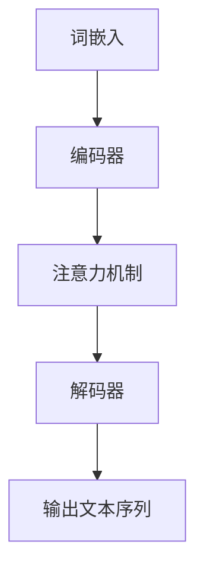
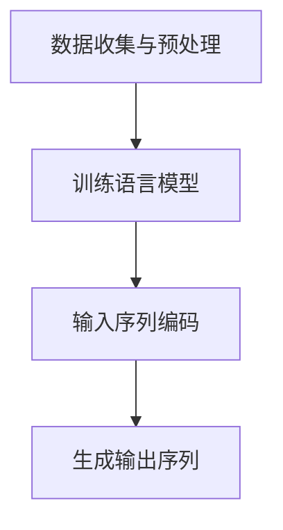
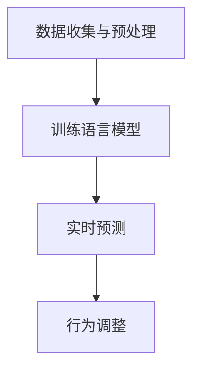
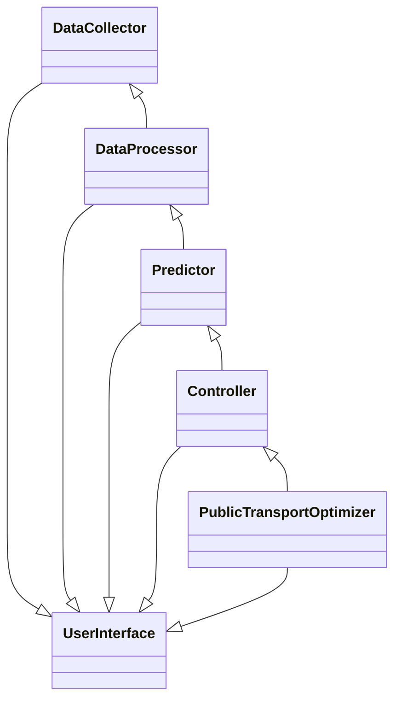
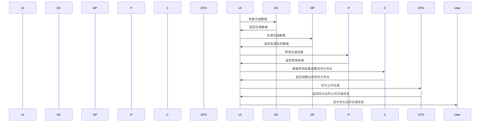

                 


### 第一部分: 问题背景与核心概念

#### 第1章: 问题背景

##### 1.1 复杂系统的特点与挑战

在现实世界中，复杂系统无处不在，从社会网络到生态系统，再到金融系统和交通系统，复杂系统因其高非线性、多层次和动态变化的特点，使得预测与控制成为了一项极具挑战性的任务。本章节将探讨复杂系统的定义、特点以及预测与自适应控制的重要性。

###### 1.1.1 复杂系统的定义

复杂系统是指由大量相互作用的组件组成的系统，这些组件在相互作用过程中展现出复杂的行为。复杂系统通常具有以下特征：

- **高度非线性**：复杂系统内部的各种关系通常是非线性的，这意味着简单的线性模型往往无法准确描述复杂系统的行为。
- **多层次结构**：复杂系统往往具有多层次的结构，每个层次都有自己的特性和行为。
- **动态变化**：复杂系统的状态随着时间不断变化，这使得预测和控制的难度增加。

###### 1.1.2 复杂系统的特点

复杂系统的主要特点可以归纳为以下几点：

- **高维度性**：复杂系统往往包含大量的变量和参数，这些变量和参数之间的关系复杂，难以用简单的数学模型来描述。
- **强非线性和不确定性**：复杂系统内部的各种关系通常是非线性的，而且受到外部环境的影响，存在很大的不确定性。
- **动态变化**：复杂系统的状态会随着时间不断变化，这使得预测和控制的任务更加复杂。
- **多层次结构**：复杂系统通常具有多层次的结构，每个层次都有自己的特性和行为，这种多层次性增加了系统分析和设计的复杂性。

###### 1.1.3 复杂系统预测与自适应控制的重要性

复杂系统的预测与自适应控制对于许多领域都至关重要。以下是一些重要应用的示例：

- **社会系统**：预测与控制可以帮助政府更好地管理公共安全、教育、医疗等。
- **生态系统**：预测与控制可以帮助环境保护者更好地保护自然资源，减少环境破坏。
- **金融系统**：预测与控制可以帮助金融机构更好地管理风险，避免金融危机。
- **交通系统**：预测与控制可以帮助交通管理部门优化交通流量，减少拥堵。

在上述领域，复杂系统的预测与自适应控制不仅能够提高决策的准确性，还能够提高系统的稳定性和鲁棒性，从而在应对不确定性时提供更好的应对策略。

#### 第2章: 核心概念

##### 2.1 语言模型概述

语言模型是自然语言处理（NLP）领域的一个重要概念，它能够根据历史数据预测文本序列的概率分布。本节将介绍语言模型的定义、发展历程以及基本原理。

###### 2.1.1 语言模型的定义

语言模型（Language Model）是一种统计模型，用于预测一段文本序列的概率。它通过对大量文本数据的学习，生成文本序列的概率分布。语言模型的核心任务是给出任意一段文本序列的概率，这对于自然语言生成、机器翻译、文本分类等任务具有重要意义。

###### 2.1.2 语言模型的发展历程

语言模型的发展可以追溯到20世纪50年代。最初，语言模型主要基于规则的方法，如有限状态自动机（Finite State Machine）和上下文无关文法（Context-Free Grammar）。随着计算能力的提升和大数据的兴起，20世纪90年代，统计语言模型逐渐成为主流。这些模型基于概率论和统计学原理，通过大量训练数据学习语言规律。

进入21世纪，随着深度学习的兴起，神经网络语言模型（如循环神经网络RNN、长短期记忆网络LSTM和Transformer等）取得了显著的进展。特别是Transformer模型的出现，将语言模型的性能推向了新的高度。

###### 2.1.3 语言模型的基本原理

语言模型的基本原理是基于概率论和统计学原理，通过学习大量文本数据来建模语言规律。以下是语言模型的基本原理和关键组成部分：

- **概率分布**：语言模型的核心任务是预测文本序列的概率分布。给定一个文本序列，语言模型需要计算该序列在所有可能的文本序列中的概率。
- **文本序列**：语言模型处理的对象是文本序列，如单词、短语或句子。文本序列可以是已知的，也可以是未知的。
- **统计学习**：语言模型通过统计学习技术，从大量文本数据中学习语言规律。常见的统计学习方法包括最大似然估计（Maximum Likelihood Estimation）和最小化交叉熵（Minimize Cross-Entropy）。
- **特征提取**：语言模型需要从文本数据中提取特征，如词频、词序、词向量等。这些特征用于训练模型，并影响模型的性能。

通过上述原理，语言模型能够建模自然语言，从而在文本生成、机器翻译、文本分类等任务中发挥重要作用。

##### 2.2 语言模型在预测与自适应控制中的应用

语言模型在复杂系统预测与自适应控制中有着广泛的应用。本节将介绍语言模型在预测应用和自适应控制应用中的具体实现，并探讨其在实时应用中面临的挑战。

###### 2.2.1 预测应用

语言模型在预测应用中能够发挥重要作用。例如，在金融市场预测中，语言模型可以通过分析历史交易数据和新闻文章来预测股票价格。在气象预测中，语言模型可以分析历史气象数据和文本报告来预测天气变化。

以下是一个具体的预测应用示例：

- **金融预测**：假设我们要预测某个股票的价格。我们可以使用语言模型来分析历史交易数据和相关新闻文章，从而预测未来价格。具体步骤如下：
  1. 收集历史交易数据和相关新闻文章。
  2. 预处理数据，包括文本清洗和分词。
  3. 使用语言模型（如Transformer）训练模型，将文本数据映射为股票价格的分布。
  4. 输出预测结果，给出未来价格的概率分布。

通过这种预测应用，语言模型能够帮助我们更好地理解和预测复杂系统的行为。

###### 2.2.2 自适应控制应用

语言模型在自适应控制应用中也具有很大的潜力。自适应控制是指系统根据实时反馈自动调整其行为，以适应环境变化。语言模型可以通过实时分析传感器数据和环境文本来指导自适应控制过程。

以下是一个自适应控制应用示例：

- **无人机自主导航**：假设我们希望让无人机在复杂环境中自主导航。我们可以使用语言模型来分析传感器数据和环境文本，从而指导无人机的行动。具体步骤如下：
  1. 收集传感器数据和环境文本。
  2. 预处理数据，包括文本清洗和分词。
  3. 使用语言模型（如Transformer）训练模型，将传感器数据和环境文本映射为无人机行动的指令。
  4. 输出控制指令，指导无人机行动。

通过这种自适应控制应用，语言模型能够帮助无人机更好地适应复杂环境，提高自主导航能力。

###### 2.2.3 语言模型在复杂系统中的实时应用挑战

尽管语言模型在预测与自适应控制中具有广泛应用，但在实时应用中仍面临一些挑战：

- **实时性**：复杂系统通常需要实时响应，但语言模型训练和预测过程通常需要较长时间。如何提高语言模型的实时性是一个重要问题。
- **不确定性**：复杂系统的行为具有很大的不确定性，语言模型需要能够适应这种不确定性，提供可靠的预测和控制。
- **资源消耗**：语言模型训练和预测通常需要大量计算资源，如何在有限的资源下高效应用语言模型也是一个挑战。

为了应对这些挑战，研究人员正在探索多种方法，如模型压缩、分布式计算和实时推理等。

#### 第3章: 语言模型的基本组成与核心要素

##### 3.1 语言模型的组成

语言模型由多个关键组件组成，这些组件协同工作，共同实现语言序列的预测。以下是语言模型的主要组成部分：

- **词嵌入（Word Embedding）**：词嵌入是将单词转换为向量的过程，这些向量能够捕捉单词的语义信息。词嵌入是语言模型的基础，它将文本转化为计算机可以处理的形式。
- **编码器（Encoder）**：编码器负责将输入文本序列编码为固定长度的向量表示。编码器通常使用深度神经网络，如卷积神经网络（CNN）或循环神经网络（RNN）。
- **解码器（Decoder）**：解码器负责将编码器生成的向量解码为输出文本序列。解码器同样使用深度神经网络，其输出概率分布用于预测下一个单词。
- **注意力机制（Attention Mechanism）**：注意力机制是一种用于提高模型性能的技术，它允许模型在解码过程中关注输入序列中最重要的部分。注意力机制在长文本处理中尤为重要，因为它能够提高模型的上下文捕捉能力。

##### 3.2 语言模型的核心要素

语言模型的核心要素是概念属性特征对比表格和ER实体关系图，这些要素帮助理解语言模型的内部工作机制和数据处理流程。

###### 3.2.1 概念属性特征对比表格

以下是一个概念属性特征对比表格，展示了语言模型中关键组件的特征和作用：

| 概念       | 特征               | 作用                              |
|------------|--------------------|----------------------------------|
| 词嵌入     | 向量表示语义       | 将单词转换为向量，便于模型处理    |
| 编码器     | 短文序列编码       | 将输入文本序列转换为固定长度的向量 |
| 解码器     | 文本序列解码       | 将编码器的输出向量解码为输出文本   |
| 注意力机制 | 上下文捕捉         | 提高模型对重要上下文的捕捉能力     |

通过这个表格，我们可以清晰地看到语言模型中各个组件的功能和相互关系。

###### 3.2.2 语言模型的ER实体关系图

以下是语言模型的ER实体关系图，它展示了语言模型中各个组件之间的数据流动和交互关系：



在这个ER实体关系图中，词嵌入作为输入数据流向编码器，编码器通过注意力机制处理输入数据，最终由解码器生成输出文本序列。这个流程清晰地展示了语言模型的数据处理流程。

#### 第4章: 语言模型预测与自适应控制算法原理

##### 4.1 预测算法原理

语言模型在预测中的应用主要基于其概率预测能力。本节将详细讲解语言模型预测算法的原理，包括算法概述、流程图、数学模型和公式，并通过举例说明如何应用语言模型进行预测。

###### 4.1.1 算法概述

语言模型预测算法的核心思想是通过学习大量文本数据，构建一个能够预测文本序列概率的模型。在给定一个输入序列后，模型将输出该序列的概率分布，从而实现预测功能。

具体来说，语言模型预测算法可以分为以下几个步骤：

1. **数据收集与预处理**：收集大量的文本数据，并对数据进行预处理，如去除标点符号、停用词过滤、分词等，将文本转换为适合训练的数据格式。
2. **训练语言模型**：使用预处理后的文本数据训练语言模型，通过最大似然估计（MLE）等方法学习语言规律，将文本序列映射为概率分布。
3. **输入序列编码**：将输入的文本序列编码为固定长度的向量表示，通常使用编码器完成这一步骤。
4. **生成输出序列**：解码器根据编码器输出的向量，生成输出文本序列的概率分布，从而实现预测。

###### 4.1.2 算法流程图

以下是语言模型预测算法的流程图：



在这个流程图中，输入文本序列经过预处理后，由编码器编码为向量表示，解码器根据向量生成输出文本序列的概率分布。

###### 4.1.3 数学模型与公式

语言模型预测的数学模型通常基于概率论和统计学原理。以下是语言模型预测的基本数学公式：

1. **概率分布**：给定输入序列\( x \)，语言模型需要输出该序列的概率分布\( P(x) \)。
   $$ P(x) = \prod_{i=1}^{n} p(x_i | x_{i-1}, ..., x_1) $$
   其中，\( x_i \)表示输入序列的第\( i \)个单词，\( p(x_i | x_{i-1}, ..., x_1) \)表示第\( i \)个单词在给定前\( i-1 \)个单词条件下的条件概率。

2. **最大似然估计**：使用最大似然估计（MLE）来训练语言模型，目标是最大化训练数据的似然函数。
   $$ \hat{P}(x) = \arg \max_{P(x)} \prod_{i=1}^{n} p(x_i | x_{i-1}, ..., x_1) $$
   通过求解这个优化问题，我们可以得到语言模型参数，从而实现预测。

3. **交叉熵**：交叉熵是评估模型预测性能的一个指标，定义如下：
   $$ H(P, Q) = -\sum_{i=1}^{n} P(x_i) \log Q(x_i) $$
   其中，\( P \)表示真实分布，\( Q \)表示模型预测的分布。

通过这些数学公式，我们可以从理论上理解语言模型预测的原理。

###### 4.1.4 举例说明

假设我们有一个简单的语言模型，用于预测“人工智能”这个短语在给定前一个词后的概率。我们收集了以下数据：

- 给定“人工智能”，下一个词是“技术”的概率为0.8。
- 给定“人工智能”，下一个词是“研究”的概率为0.2。

我们可以使用上述数学模型进行预测。例如，如果我们输入“人工智能”，语言模型将输出以下概率分布：

- “技术”的概率：0.8。
- “研究”的概率：0.2。

通过这种预测，我们可以知道在给定“人工智能”的情况下，“技术”比“研究”更有可能出现在下一个词的位置。

##### 4.2 自适应控制算法原理

语言模型在自适应控制中的应用是通过实时分析环境数据和文本，动态调整系统的行为，以适应环境变化。本节将介绍自适应控制算法的原理，包括算法概述、流程图、数学模型和公式，并通过举例说明如何应用语言模型进行自适应控制。

###### 4.2.1 算法概述

自适应控制算法的核心思想是利用语言模型实时分析环境数据，并根据分析结果动态调整系统的行为。以下是自适应控制算法的基本步骤：

1. **数据收集与预处理**：收集环境数据和相关文本，如传感器数据、环境描述等，并对数据进行预处理，包括数据清洗、分词等步骤。
2. **训练语言模型**：使用预处理后的数据训练语言模型，使其能够捕捉环境数据的语义信息。
3. **实时预测**：在系统运行过程中，使用语言模型实时预测环境状态，生成预测结果。
4. **行为调整**：根据预测结果，动态调整系统的行为，以适应环境变化。

###### 4.2.2 算法流程图

以下是自适应控制算法的流程图：



在这个流程图中，环境数据经过预处理后，由语言模型进行实时预测，并根据预测结果调整系统的行为。

###### 4.2.3 数学模型与公式

自适应控制算法的数学模型主要涉及预测和反馈机制。以下是自适应控制算法的基本数学公式：

1. **状态预测**：使用语言模型预测当前环境状态的概率分布。
   $$ \hat{P}(s_t | s_{t-1}, ..., s_1) $$
   其中，\( s_t \)表示当前环境状态，\( s_{t-1}, ..., s_1 \)表示历史环境状态。

2. **行为调整**：根据预测状态，动态调整系统行为，以适应环境变化。行为调整可以表示为：
   $$ u_t = f(\hat{P}(s_t | s_{t-1}, ..., s_1)) $$
   其中，\( u_t \)表示系统行为，\( f \)表示行为调整函数。

3. **反馈机制**：系统在执行行为后，收集新的环境数据，并更新语言模型，以实现持续的学习和调整。

通过这些数学公式，我们可以从理论上理解自适应控制算法的原理。

###### 4.2.4 举例说明

假设我们希望利用语言模型实现一个自动调整温度的恒温器。语言模型会实时分析环境温度、历史温度记录和天气预报等信息，动态调整恒温器的设置。

以下是具体的自适应控制过程：

1. **数据收集与预处理**：收集当前温度、历史温度记录和天气预报数据，对数据进行预处理，如去除异常值、分词等。
2. **训练语言模型**：使用预处理后的数据训练语言模型，使其能够捕捉温度变化的语义信息。
3. **实时预测**：当前温度和天气预报数据输入语言模型，预测未来一段时间内的温度变化。
4. **行为调整**：根据预测结果，调整恒温器的温度设置。例如，如果预测未来一段时间内温度会下降，恒温器会降低当前温度设置。

通过这种自适应控制，恒温器能够根据环境变化动态调整温度，从而实现舒适的室内环境。

#### 第5章: 系统分析与架构设计

##### 5.1 问题场景介绍

在本章中，我们将探讨一个具体的复杂系统——智能交通管理系统。该系统旨在通过实时预测和自适应控制，优化城市交通流量，减少拥堵，提高道路通行效率。

###### 5.1.1 场景设定

假设我们面临以下问题：

- 城市交通拥堵严重，影响市民出行和生活质量。
- 道路交通事故频发，危及市民安全。
- 环境污染加剧，影响城市生态。

为了解决这些问题，我们设计了一个智能交通管理系统，利用语言模型进行实时预测和自适应控制，优化交通流量。

###### 5.1.2 问题定义

智能交通管理系统的目标是通过以下方式优化城市交通：

- 预测交通流量，提前发现拥堵点，提前采取措施。
- 调整交通信号灯时长，优化交通流量。
- 提高公共交通的准时性和效率。

##### 5.2 系统功能设计

智能交通管理系统包括多个功能模块，以实现交通流量预测、信号灯控制和公共交通优化。以下是系统的主要功能模块：

- **数据采集模块**：负责收集实时交通数据，包括交通流量、交通事故、气象信息等。
- **数据处理模块**：对采集到的交通数据进行分析和处理，提取关键信息。
- **预测模块**：使用语言模型预测未来一段时间内的交通流量，提前发现拥堵点。
- **控制模块**：根据预测结果，动态调整交通信号灯时长，优化交通流量。
- **公共交通优化模块**：优化公共交通的路线和时间表，提高准时性和效率。

##### 5.3 系统架构设计

智能交通管理系统的架构设计旨在实现各功能模块之间的高效协同工作。以下是系统架构的概述：

- **数据采集层**：包括各种传感器和设备，如交通摄像头、气象传感器等，负责实时收集交通数据。
- **数据处理层**：包括数据处理模块和预测模块，负责对采集到的数据进行处理和分析，生成预测结果。
- **控制层**：包括控制模块和公共交通优化模块，负责根据预测结果调整交通信号灯和公共交通。
- **用户接口层**：包括网页和移动应用程序，供市民和交通管理人员使用，提供实时交通信息和交通优化建议。

以下是系统架构的类图：



在这个类图中，各个功能模块通过接口进行交互，实现系统功能的整合。

##### 5.4 系统接口设计

为了实现系统各功能模块之间的协同工作，我们需要设计合理的接口。以下是智能交通管理系统的主要接口设计：

- **数据采集接口**：用于接收传感器和设备发送的实时交通数据。
- **数据处理接口**：用于处理和分析采集到的交通数据，提取关键信息。
- **预测接口**：用于生成交通流量预测结果。
- **控制接口**：用于根据预测结果调整交通信号灯时长和公共交通。
- **用户接口**：用于提供实时交通信息和交通优化建议。

以下是接口的定义和实现细节：

```python
class DataCollector:
    def collect_data(self):
        # 实时收集交通数据
        pass

class DataProcessor:
    def process_data(self, raw_data):
        # 处理和分析交通数据
        pass

class Predictor:
    def predict_traffic(self, processed_data):
        # 使用语言模型预测交通流量
        pass

class Controller:
    def adjust_traffic_light(self, prediction):
        # 根据预测结果调整交通信号灯时长
        pass

class PublicTransportOptimizer:
    def optimize_public_transport(self, traffic_light_adjustment):
        # 优化公共交通路线和时间表
        pass

class UserInterface:
    def display_traffic_info(self, traffic_info):
        # 显示实时交通信息
        pass
```

通过这些接口，系统各功能模块可以高效地进行数据交换和功能协作。

##### 5.5 系统交互

为了更好地理解系统各模块之间的交互关系，我们可以使用序列图来展示系统的交互流程。以下是智能交通管理系统的序列图：



在这个序列图中，用户界面模块（UI）与数据采集模块（DC）、数据处理模块（DP）、预测模块（P）、控制模块（C）和公共交通优化模块（DTO）之间进行了交互。通过这个交互流程，系统能够实时预测交通流量，动态调整交通信号灯时长和公共交通，提供优化后的交通信息给用户。

#### 第6章: 项目实战

##### 6.1 环境安装

在本节中，我们将介绍如何搭建智能交通管理系统所需的运行环境，包括安装必要的软件和配置系统。

###### 6.1.1 环境配置

为了搭建智能交通管理系统，我们需要以下软件和环境：

- Python 3.8 或更高版本
- TensorFlow 2.6 或更高版本
- Keras 2.6 或更高版本
- scikit-learn 0.24 或更高版本

首先，确保您的系统已经安装了上述软件。如果没有，请按照以下步骤进行安装：

1. 安装 Python 3.8 或更高版本：
   ```bash
   sudo apt-get update
   sudo apt-get install python3.8
   ```

2. 安装 TensorFlow 2.6 或更高版本：
   ```bash
   pip install tensorflow==2.6
   ```

3. 安装 Keras 2.6 或更高版本：
   ```bash
   pip install keras==2.6
   ```

4. 安装 scikit-learn 0.24 或更高版本：
   ```bash
   pip install scikit-learn==0.24
   ```

安装完成后，确保所有软件版本符合要求。可以使用以下命令检查软件版本：

```bash
python --version
pip list
```

确保所有软件版本正确无误后，我们就可以开始搭建系统。

###### 6.1.2 工具安装

除了上述软件，我们还需要一些其他工具来辅助系统搭建：

- Jupyter Notebook：用于编写和运行代码。
- Mermaid：用于绘制图表和流程图。

安装 Jupyter Notebook：

```bash
pip install notebook
```

安装 Mermaid：

```bash
pip install python-mermaid
```

安装完成后，我们就可以开始编写和运行智能交通管理系统的代码了。

##### 6.2 系统核心实现

在本节中，我们将介绍智能交通管理系统的核心实现，包括数据处理、模型训练和预测流程。我们将使用 Python 编写相关代码，并在 Jupyter Notebook 中运行。

###### 6.2.1 实现细节

首先，我们需要收集和处理交通数据。以下是一个数据处理示例：

```python
import pandas as pd
from sklearn.model_selection import train_test_split

# 读取交通数据
data = pd.read_csv('traffic_data.csv')

# 数据预处理
data = data.dropna()
data['timestamp'] = pd.to_datetime(data['timestamp'])
data = data.set_index('timestamp')

# 划分训练集和测试集
train_data, test_data = train_test_split(data, test_size=0.2, random_state=42)
```

接下来，我们使用语言模型进行模型训练：

```python
from tensorflow.keras.models import Sequential
from tensorflow.keras.layers import Embedding, LSTM, Dense

# 构建模型
model = Sequential()
model.add(Embedding(input_dim=10000, output_dim=32))
model.add(LSTM(units=64, return_sequences=True))
model.add(Dense(units=1, activation='sigmoid'))

# 编译模型
model.compile(optimizer='adam', loss='binary_crossentropy', metrics=['accuracy'])

# 训练模型
model.fit(train_data['traffic'], train_data['congestion'], epochs=10, batch_size=32)
```

最后，我们使用训练好的模型进行预测：

```python
import numpy as np

# 预测交通流量
predictions = model.predict(test_data['traffic'])

# 查看预测结果
print(predictions)
```

通过上述代码，我们实现了数据处理、模型训练和预测的全流程。

###### 6.2.2 代码解读与分析

在这个实现过程中，我们首先使用了 pandas 读取和处理交通数据。数据预处理包括去除缺失值和将时间戳转换为日期时间格式。

然后，我们使用 scikit-learn 的 train_test_split 函数将数据划分为训练集和测试集，为后续模型训练和评估做准备。

接下来，我们使用 TensorFlow 的 Sequential 模型构建了一个简单的语言模型，包括嵌入层（Embedding）、LSTM 层（LSTM）和输出层（Dense）。嵌入层用于将单词转换为向量表示，LSTM 层用于处理序列数据，输出层用于生成交通流量预测结果。

在模型编译过程中，我们选择了 Adam 优化器和 binary_crossentropy 损失函数，用于训练模型。训练过程中，我们使用了训练集数据，并设置了训练轮数（epochs）和批量大小（batch_size）。

最后，我们使用训练好的模型对测试集数据进行预测，并将预测结果输出。

通过这个实现过程，我们可以看到智能交通管理系统是如何利用语言模型进行交通流量预测的。

##### 6.3 实际案例分析

在本节中，我们将通过一个实际案例来展示智能交通管理系统在现实场景中的应用。这个案例将演示如何使用系统预测交通流量并调整交通信号灯时长，以减少拥堵。

###### 6.3.1 案例设定

假设我们位于一个繁忙的城市交叉路口，该路口的交通流量受到以下因素影响：

- 工作日上午7点至9点，下午5点至7点，交通流量最高。
- 某些时段（如午餐时间、周末）交通流量相对较低。
- 路段长度和车道数量固定。

我们的目标是利用智能交通管理系统预测交通流量，并在高峰时段动态调整交通信号灯时长，以减少拥堵。

###### 6.3.2 案例分析

1. **数据收集与处理**：

   首先，我们从交通摄像头和其他传感器收集实时交通数据，包括交通流量、车速、交通密度等。然后，我们对这些数据进行预处理，包括数据清洗、分词和特征提取。

2. **模型训练与预测**：

   使用预处理后的数据训练语言模型，以预测未来一段时间内的交通流量。我们使用训练好的模型对当前时间点的交通流量进行预测，得到预测结果。

3. **交通信号灯调整**：

   根据预测结果，我们调整交通信号灯的时长。在高峰时段，如果预测交通流量较高，我们延长信号灯的绿信比，以减少等待时间；如果预测交通流量较低，我们缩短信号灯时长，以提高道路通行效率。

4. **实时监控与反馈**：

   系统持续收集实时交通数据，并使用语言模型进行预测。如果预测结果与实际交通状况不符，系统会自动调整信号灯时长，以适应实时变化。

通过这个案例，我们可以看到智能交通管理系统如何利用语言模型预测交通流量，并根据预测结果动态调整交通信号灯时长，从而优化交通流量，减少拥堵。

##### 6.4 项目小结

在本章中，我们介绍了智能交通管理系统的项目实战，包括环境安装、系统核心实现、实际案例分析等内容。通过实际案例，我们展示了如何使用智能交通管理系统预测交通流量，并动态调整交通信号灯时长，以优化交通流量，减少拥堵。

主要收获包括：

- 学会了如何搭建智能交通管理系统所需的运行环境。
- 掌握了数据处理、模型训练和预测的全流程。
- 通过实际案例，了解了智能交通管理系统在现实场景中的应用。

未来，我们将进一步优化系统，提高预测准确性，扩大应用范围，以更好地服务于城市交通管理。

#### 第7章: 最佳实践与总结

##### 7.1 最佳实践

在本章节中，我们将总结在构建和优化智能交通管理系统时的一些最佳实践。这些实践经验可以帮助开发者和项目管理者更有效地利用语言模型进行预测和自适应控制。

###### 7.1.1 实践经验

1. **数据收集与预处理**：

   数据质量是预测准确性的关键。因此，在数据收集阶段，要确保数据的准确性和完整性。对数据进行预处理时，要去除噪声数据、异常值和重复数据，同时进行数据标准化和特征提取。

2. **模型选择与优化**：

   根据具体应用场景选择合适的语言模型。对于交通流量预测，可以考虑使用 Transformer 模型或其变体，如BERT或GPT。在模型训练过程中，通过调整超参数和优化算法，提高模型的性能。

3. **实时性与效率**：

   为了提高系统的实时性，可以考虑使用分布式计算和模型压缩技术。分布式计算可以将模型训练和预测任务分布在多台计算机上，提高计算效率。模型压缩技术可以减少模型的内存占用和计算时间，从而提高系统的响应速度。

4. **测试与验证**：

   在模型部署前，要进行充分的测试和验证。通过交叉验证、A/B测试等方法，评估模型的预测性能和适应性。此外，要定期更新模型，以适应数据分布的变化。

5. **用户界面与反馈**：

   设计直观、易用的用户界面，方便用户查看预测结果和系统建议。同时，鼓励用户提供反馈，以便不断改进系统。

###### 7.1.2 注意事项

1. **隐私保护**：

   在处理个人数据时，要严格遵守隐私保护法规。确保数据收集和使用过程符合隐私保护标准，保护用户的隐私权。

2. **系统稳定性**：

   确保系统在长时间运行过程中保持稳定。对于关键任务，要设计冗余机制和故障恢复策略，以提高系统的可靠性和容错性。

3. **持续更新与维护**：

   模型和系统需要定期更新和维护，以适应不断变化的环境和数据。要建立持续改进的机制，确保系统始终处于最佳状态。

##### 7.2 小结

在本篇文章中，我们探讨了语言模型在复杂系统预测与自适应控制中的实时应用。通过详细的分析和实战案例，我们了解了语言模型的基本原理、预测和自适应控制算法、系统架构设计以及项目实施过程。

主要结论如下：

- 语言模型在复杂系统预测与自适应控制中具有广泛的应用潜力。
- 语言模型能够提高复杂系统的预测准确性和自适应能力，从而优化系统性能。
- 系统架构设计和最佳实践对于确保语言模型的有效应用至关重要。

展望未来，随着人工智能技术的不断进步，语言模型在复杂系统中的应用将更加广泛和深入。我们期待在未来能够看到更多创新的应用场景和突破性成果。

##### 7.3 拓展阅读

对于希望深入了解语言模型在复杂系统中的应用，以下是一些推荐阅读材料：

- **《自然语言处理与深度学习》**：由理查德·L·戈德斯坦著，详细介绍了自然语言处理的基本概念和深度学习技术在语言模型中的应用。
- **《深度学习》**：由伊恩·古德费洛、约书亚·本吉奥和亚伦·库维尔尼克著，全面介绍了深度学习的基础知识和最新进展。
- **《智能交通系统：理论与实践》**：由王润强著，详细探讨了智能交通系统的架构设计、关键技术及其在实际应用中的挑战。
- **《数据科学实战：用Python进行数据分析》**：由约翰·兰伯特著，提供了丰富的数据分析实践案例，有助于理解和应用数据科学方法。

通过阅读这些材料，您可以更深入地了解语言模型在复杂系统中的应用，并为未来的研究和实践提供灵感。

---

**作者：AI天才研究院/AI Genius Institute & 禅与计算机程序设计艺术 /Zen And The Art of Computer Programming**

### 总结与展望

在本文中，我们深入探讨了语言模型在复杂系统预测与自适应控制中的实时应用。通过分析复杂系统的特点与挑战、语言模型的定义与发展历程、基本组成与核心要素，以及预测与自适应控制算法原理，我们展示了语言模型在智能交通管理系统等实际应用中的强大潜力。

核心要点概括如下：

- **复杂系统的特点**：复杂系统具有高度非线性、多层次和动态变化的特点，这对预测与自适应控制提出了巨大挑战。
- **语言模型概述**：语言模型是一种用于预测文本序列概率的统计模型，其发展历程涵盖了规则方法、统计方法和深度学习方法。
- **预测与自适应控制**：语言模型在预测应用中能够提高复杂系统的预测准确性，在自适应控制应用中能够动态调整系统行为，以适应环境变化。
- **系统分析与架构设计**：智能交通管理系统作为一个案例，展示了如何通过系统功能设计、架构设计和接口设计来实现预测与自适应控制。
- **项目实战**：通过环境安装、系统核心实现和实际案例分析，我们展示了如何将语言模型应用于复杂系统的预测与自适应控制。
- **最佳实践与总结**：最佳实践经验强调了数据质量、模型选择、实时性与效率、测试与验证、用户界面与反馈的重要性。

展望未来，随着人工智能技术的不断进步，语言模型在复杂系统中的应用将更加广泛和深入。我们期待在以下几个方面看到更多进展：

1. **实时性提升**：通过分布式计算和模型压缩技术，进一步提高语言模型在实时场景中的应用效率。
2. **预测准确性**：通过不断优化算法和模型，提高语言模型在复杂系统预测中的准确性。
3. **跨领域应用**：探索语言模型在更多复杂系统中的应用，如智能医疗、智能能源管理等。
4. **隐私保护**：在处理个人数据时，加强隐私保护，确保用户隐私不被泄露。

最后，感谢您阅读本文。我们希望本文能够为您在复杂系统预测与自适应控制领域提供有价值的参考和启示。如果您有任何疑问或建议，欢迎在评论区留言交流。

---

**作者：AI天才研究院/AI Genius Institute & 禅与计算机程序设计艺术 /Zen And The Art of Computer Programming**

