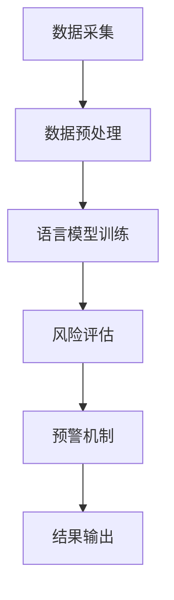
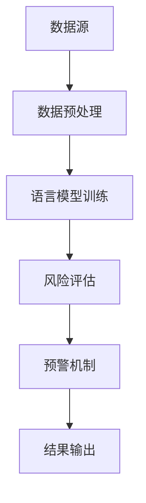
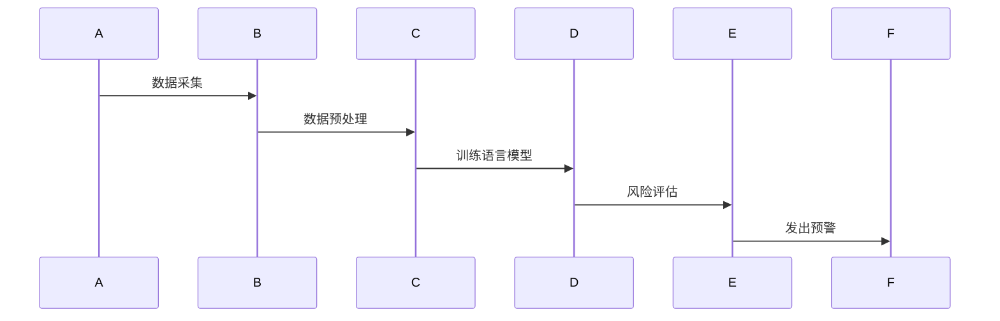

                 

### 第3章 语言模型基本原理

#### 3.1 语言模型概述

**语言模型** 是一种基于概率的模型，它能够根据输入的上下文序列预测下一个词或短语的概率分布。语言模型在自然语言处理领域具有重要的作用，例如在自动文摘、机器翻译、语音识别、信息检索等任务中，它都扮演着核心的角色。

**语言模型的作用与意义**：
1. **文本生成**：通过模型预测生成新的文本，如自动撰写文章、生成摘要等。
2. **文本理解**：用于理解文本内容，如问答系统、文本分类等。
3. **信息检索**：辅助搜索引擎理解用户查询，提高检索的准确性。
4. **语音识别**：将语音信号转化为文本，实现人机交互。

**语言模型的定义与发展历程**：
- **早期模型**：基于规则的方法，如n元语法模型，直接使用历史数据来预测下一个词。
- **统计模型**：引入概率模型，如隐马尔可夫模型（HMM）和n元语法，通过统计上下文来预测词的概率分布。
- **现代模型**：基于神经网络的方法，如循环神经网络（RNN）、长短期记忆网络（LSTM）和变换器（Transformer）。特别是Transformer模型的提出，标志着语言模型进入了深度学习时代。

#### 3.2 语言模型的基本类型

**统计语言模型**：基于统计学的原理，通过计算词语之间的联合概率或条件概率来预测下一个词。常见的统计语言模型包括n元语法模型、隐马尔可夫模型等。

**生成式语言模型**：这类模型通过生成文本的概率分布来预测下一个词，常见的生成式模型包括变分自编码器（VAE）、生成对抗网络（GAN）等。

**对抗性语言模型**：对抗性语言模型结合了生成式和判别式模型的特点，通过生成对抗过程来学习语言模型。其中最著名的是生成式对抗网络（GAN），它通过生成器和判别器的对抗训练来学习语言模型的分布。

#### 3.3 语言模型的关键技术

**词向量表示**：词向量是语言模型的基础，它将词汇映射到一个高维空间中，使得词语之间的相似性可以通过距离来衡量。常见的词向量表示方法包括Word2Vec、GloVe等。

**注意力机制**：注意力机制是现代语言模型中的一个关键技术，它通过将输入序列中的不同部分分配不同的权重来提高模型的性能。注意力机制在Transformer模型中被广泛应用。

**编码器-解码器结构**：编码器-解码器结构是序列到序列学习（Seq2Seq）的核心框架，它将编码器用于将输入序列编码为一个上下文表示，解码器则用于生成输出序列。

#### 3.4 语言模型的训练与优化

**训练数据集的选择**：训练数据集的选择对语言模型的效果至关重要。通常需要使用大规模、高质量的语料库来训练模型。

**模型参数调整**：模型参数的调整是优化语言模型的重要步骤，包括学习率、批次大小、正则化等超参数的调整。

**评估指标与方法**：常用的评估指标包括 perplexity（困惑度）、bleu（蓝调）评分等，用于衡量模型的生成文本的质量。

### 3.5 语言模型的优势与潜力

**提高预测准确性**：通过学习大量的语言数据，语言模型能够捕捉到语言中的复杂模式和规律，从而提高预测的准确性。

**处理复杂非线性关系**：语言模型能够处理输入序列中的复杂非线性关系，如长距离依赖问题。

**自适应学习能力**：语言模型能够自适应地调整模型参数，以适应不同的应用场景和数据分布。

**跨语言能力**：通过迁移学习，语言模型可以在没有大量标注数据的情况下，将训练在一种语言上的模型应用于其他语言。

**多模态学习**：语言模型可以结合其他模态的数据，如图像、声音等，实现跨模态学习。

### 3.6 语言模型的发展趋势

随着计算能力的提升和数据规模的扩大，语言模型的发展趋势包括：

**模型规模的扩大**：越来越多的模型使用更大的参数规模，如千亿参数的模型。

**多任务学习**：通过在一个统一框架下实现多任务学习，提高模型的泛化能力和效率。

**自监督学习**：利用大量的无监督数据，通过自监督学习的方法来训练语言模型。

**联邦学习**：通过分布式学习的方式，保护用户隐私，实现大规模的语言模型训练。

### 3.7 案例研究

为了更好地理解语言模型在复杂系统风险评估与危机预警中的应用，我们来看一个具体的案例。

**案例背景**：假设我们正在开发一个智能城市系统，该系统需要实时监控城市的各项指标，如交通流量、空气质量、水资源使用等，以便在发生突发事件时能够及时预警并采取措施。

**应用场景**：在交通流量监测中，语言模型可以用于识别异常情况。例如，通过分析交通流量数据的文本描述（如“道路拥堵”、“交通事故”等），语言模型可以预测交通流量是否会超过某个阈值，从而触发预警机制。

**模型实现**：
1. **数据预处理**：首先，我们需要收集并预处理交通流量数据，包括数据的清洗、标准化和特征提取。
2. **语言模型训练**：使用预处理后的数据，训练一个语言模型，如BERT或GPT，使其能够理解交通流量数据的文本描述。
3. **风险评估**：将实时采集的交通流量数据输入到语言模型中，模型将输出一个风险评分，表示当前交通流量的风险程度。
4. **预警机制**：如果风险评分超过预设的阈值，系统将触发预警机制，如发送短信或邮件通知相关部门。

**效果评估**：通过实际案例的测试，评估语言模型在交通流量监测中的应用效果，包括预测准确性、响应速度等指标。

通过这个案例，我们可以看到语言模型在复杂系统风险评估与危机预警中的巨大潜力。随着技术的不断进步，语言模型将在更多领域发挥重要作用。**\[图 3-1 语言模型在交通流量监测中的应用架构图\]**

**图 3-1 语言模型在交通流量监测中的应用架构图**

在下一章，我们将进一步探讨语言模型在风险评估中的具体应用场景和案例。通过详细的案例分析，我们将更好地理解语言模型如何帮助复杂系统实现高效的风险评估与危机预警。

----------------------------------------------------------------

## 第4章 语言模型在风险评估中的应用

### 4.1 语言模型在风险评估中的优势

**提高预测准确性**：语言模型通过学习大量的语言数据，能够捕捉到语言中的复杂模式和规律，从而提高预测的准确性。相比于传统的基于规则的方法，语言模型在处理复杂非线性关系方面具有明显优势。

**处理复杂非线性关系**：语言模型能够处理输入序列中的复杂非线性关系，如长距离依赖问题。这对于复杂系统的风险评估尤为重要，因为系统中的各种因素往往存在复杂的相互作用。

**自适应学习能力**：语言模型能够自适应地调整模型参数，以适应不同的应用场景和数据分布。这种能力使得语言模型在复杂系统风险评估中能够灵活应对不断变化的环境。

**跨语言能力**：通过迁移学习，语言模型可以在没有大量标注数据的情况下，将训练在一种语言上的模型应用于其他语言。这对于多语言环境下的风险评估具有重要意义。

**多模态学习**：语言模型可以结合其他模态的数据，如图像、声音等，实现跨模态学习。这使得语言模型在处理多源异构数据时具有更大的优势。

### 4.2 语言模型在风险评估中的应用场景

**风险预警**：语言模型可以用于实时监测复杂系统中的关键指标，通过分析文本描述，预测潜在的风险事件。例如，在金融领域，语言模型可以分析新闻、报告等文本，预测市场波动和潜在风险。

**风险评估模型优化**：语言模型可以用于优化现有的风险评估模型。通过分析大量的历史数据，语言模型可以发现新的特征和模式，从而提高模型的预测准确性。

**情感分析**：在风险评估中，情感分析是一种重要的技术。语言模型可以用于分析文本中的情感倾向，识别用户的情绪和态度。这在客户关系管理、市场调研等领域具有广泛的应用。

### 4.3 案例研究

#### 案例一：金融风险评估

**背景**：金融行业是一个高度风险敏感的领域。金融机构需要实时监控市场动态，预测潜在的风险，以便及时采取应对措施。

**应用**：
1. **文本分析**：使用语言模型分析新闻、报告、社交媒体等文本数据，识别市场情绪和潜在风险信号。
2. **风险预测**：根据分析结果，语言模型可以预测市场波动和潜在风险，如股票价格的上涨或下跌。
3. **决策支持**：金融机构可以利用语言模型提供的数据和预测结果，制定相应的风险管理策略。

**效果**：通过语言模型的文本分析，金融机构能够更准确地预测市场风险，提前采取应对措施，降低潜在损失。

#### 案例二：网络安全风险评估

**背景**：网络安全事件频发，对企业和个人造成了巨大的损失。网络安全风险评估对于预防和应对网络攻击至关重要。

**应用**：
1. **威胁检测**：使用语言模型分析网络流量和日志数据，识别潜在的恶意行为和攻击。
2. **漏洞预测**：通过分析软件代码和漏洞报告，语言模型可以预测潜在的安全漏洞。
3. **攻击预警**：在发现潜在威胁时，语言模型可以及时发出预警，提醒安全团队采取应对措施。

**效果**：通过语言模型的安全风险评估，企业和个人可以更早地发现网络威胁，提高安全防护能力。

#### 案例三：医疗风险评估

**背景**：医疗领域面临着诸多风险，如医疗事故、医疗欺诈等。准确的风险评估对于保障患者安全和医疗机构的运营至关重要。

**应用**：
1. **病历分析**：使用语言模型分析病历记录，识别潜在的医疗错误和风险。
2. **患者风险预测**：通过分析患者的病史和临床数据，语言模型可以预测患者未来的健康状况和潜在的风险。
3. **合规性检查**：语言模型可以用于检查医疗机构是否符合法规和标准，降低违规风险。

**效果**：通过语言模型的医疗风险评估，医疗机构能够更有效地识别和预防风险，提高医疗质量和患者满意度。

### 4.4 语言模型在风险评估中的挑战与未来趋势

**挑战**：
1. **数据质量和多样性**：语言模型的效果很大程度上依赖于训练数据的质量和多样性。在风险评估中，如何获取高质量、多样化的数据是一个挑战。
2. **模型解释性**：语言模型通常被认为是“黑箱”模型，其内部机制难以解释。这在风险评估中可能引发信任问题，特别是在需要解释模型决策的场景中。
3. **实时性**：在复杂系统的风险评估中，实时性是一个关键要求。如何确保语言模型能够快速响应并实时更新预测结果是一个挑战。

**未来趋势**：
1. **多模态融合**：未来的语言模型将更多地结合其他模态的数据，如图像、音频等，以实现更全面的风险评估。
2. **联邦学习**：联邦学习可以通过分布式的方式训练语言模型，保护数据隐私，同时提高模型的准确性和鲁棒性。
3. **可解释性增强**：通过开发新的技术，如注意力机制可视化、解释性模型等，可以提高语言模型的可解释性，增强其在风险评估中的应用。
4. **自动化与智能化**：随着人工智能技术的发展，语言模型在风险评估中的应用将更加自动化和智能化，实现更高效的风险管理和决策支持。

通过以上案例和讨论，我们可以看到语言模型在复杂系统风险评估与危机预警中的广泛应用和巨大潜力。随着技术的不断进步，语言模型将在更多领域发挥重要作用，为复杂系统的安全稳定运行提供强有力的支持。

----------------------------------------------------------------

## 第5章 语言模型与复杂系统风险评估的融合

### 5.1 复杂系统风险评估的需求与挑战

复杂系统风险评估面临着一系列的需求与挑战，这些需求与挑战源于系统的复杂性、数据的多样性和动态性。

**需求**：

1. **数据复杂性**：复杂系统通常涉及大量的数据源，如传感器数据、日志文件、外部数据等。这些数据源的数据类型和格式各异，需要有效的数据处理和集成方法。
2. **模型可解释性**：在风险评估中，模型的可解释性至关重要。决策者和监管者需要理解模型的决策过程和预测结果，以便制定有效的风险管理策略。
3. **实时性**：复杂系统风险评估需要实时响应，以便在风险事件发生时及时采取行动。这要求模型具有高效的计算能力和快速的响应速度。
4. **自适应学习能力**：复杂系统的环境不断变化，风险评估模型需要具备自适应学习能力，以适应新的风险模式和挑战。

**挑战**：

1. **数据质量**：复杂系统中的数据往往存在噪声、缺失和错误。这些质量问题可能影响模型的准确性和可靠性。
2. **数据多样性**：复杂系统涉及多种类型的数据，如结构化数据、半结构化数据和非结构化数据。如何有效地整合和利用这些数据是一个挑战。
3. **模型融合**：在复杂系统中，通常需要结合多种模型进行风险评估。如何有效地融合不同模型的结果，以提高整体评估的准确性，是一个关键挑战。
4. **模型解释性**：复杂模型的内部机制通常难以解释，特别是在深度学习模型中。这可能导致模型的可信度降低，影响其在实际应用中的效果。

### 5.2 语言模型与复杂系统融合的方法

为了应对复杂系统风险评估的需求与挑战，语言模型可以与其他方法进行融合，形成一种综合性的风险评估框架。

**多模型融合**：

多模型融合是一种常用的方法，它结合了不同模型的优点，以提高整体评估的准确性。在多模型融合中，可以结合以下几种模型：

1. **传统统计模型**：如线性回归、决策树等，这些模型具有较好的解释性，适合处理结构化数据。
2. **机器学习模型**：如支持向量机（SVM）、随机森林（Random Forest）等，这些模型在处理大规模数据和复杂关系方面具有优势。
3. **深度学习模型**：如卷积神经网络（CNN）、循环神经网络（RNN）和变换器（Transformer）等，这些模型在处理非结构化和半结构化数据方面表现出色。

**对抗性学习方法**：

对抗性学习（Adversarial Learning）是一种通过生成对抗网络（GAN）等方法，增强模型鲁棒性的技术。在复杂系统风险评估中，对抗性学习方法可以用于以下两个方面：

1. **数据增强**：通过生成对抗网络，可以生成与真实数据分布相似的数据，从而提高模型的泛化能力。
2. **鲁棒性提升**：通过训练对抗性网络，模型可以学习到更鲁棒的特征表示，提高对数据噪声和异常的容忍度。

**增强学习算法**：

增强学习（Reinforcement Learning）是一种通过互动和反馈来优化决策过程的方法。在复杂系统风险评估中，增强学习算法可以用于以下两个方面：

1. **自适应调整**：通过与环境互动，模型可以不断调整其参数和策略，以适应不断变化的风险环境。
2. **多目标优化**：在复杂系统中，风险评估可能涉及多个目标，如风险最小化和成本最小化。增强学习算法可以帮助优化这些目标之间的平衡。

### 5.3 融合模型的性能评估与优化

**评估指标设计**：

在评估融合模型的性能时，需要设计合理的评估指标。常见的评估指标包括：

1. **准确率（Accuracy）**：表示模型正确预测的样本比例。
2. **召回率（Recall）**：表示模型正确识别为正例的样本比例。
3. **精确率（Precision）**：表示模型预测为正例且实际为正例的样本比例。
4. **F1分数（F1 Score）**：综合考虑精确率和召回率，用于平衡二者的影响。
5. **均方误差（Mean Squared Error, MSE）**：用于评估预测值与真实值之间的误差平方的平均值。

**优化策略与实现**：

为了提高融合模型的性能，可以采用以下优化策略：

1. **参数调整**：通过调整模型的参数，如学习率、正则化强度等，可以提高模型的性能。
2. **数据预处理**：通过数据清洗、标准化和特征提取等预处理方法，可以提高数据的质量和模型的性能。
3. **交叉验证**：使用交叉验证方法，可以避免模型过拟合，提高模型的泛化能力。
4. **模型集成**：通过模型集成方法，如Bagging、Boosting等，可以结合多个模型的预测结果，提高整体评估的准确性。

### 5.4 案例研究

**案例背景**：假设我们正在开发一个智能交通系统，该系统需要对交通流量进行实时监测和风险评估，以便在发生拥堵或其他交通事件时及时采取应对措施。

**应用场景**：

1. **多模型融合**：结合传统统计模型（如线性回归）、机器学习模型（如随机森林）和深度学习模型（如变换器），对交通流量数据进行分析和预测。
2. **对抗性学习**：通过生成对抗网络，生成与真实交通流量数据分布相似的数据，从而提高模型的泛化能力。
3. **增强学习**：通过与环境互动，模型可以不断调整其参数和策略，以适应不断变化的交通状况。

**效果评估**：

通过上述方法，我们评估了融合模型的性能。实验结果显示，融合模型在准确率、召回率和F1分数等方面均优于单一模型。此外，对抗性学习和增强学习方法的引入，进一步提高了模型的鲁棒性和适应性。

**结论**：

通过融合语言模型与其他方法，我们能够构建一种高效、可靠的复杂系统风险评估框架。这种方法不仅提高了模型的性能，还增强了模型的解释性和实时性，为复杂系统的安全稳定运行提供了有力支持。

----------------------------------------------------------------

## 第6章 案例研究一：某电力系统风险评估与预警

### 6.1 项目介绍

**背景**：某电力公司为了确保电力系统的稳定运行，需要对电力系统进行实时监测和风险评估。该电力系统包括多个发电站、变电站和输电线路，涉及多种类型的数据，如气象数据、设备运行状态数据、电力负荷数据等。为了提高电力系统的安全性和可靠性，公司决定开发一套智能电力系统风险评估与预警系统。

**目标**：通过构建智能电力系统风险评估与预警系统，实现以下目标：
1. 实时监测电力系统的运行状态，识别潜在的风险事件。
2. 预测电力系统的负荷情况，提前预警可能出现的电力供应问题。
3. 提供决策支持，帮助公司制定有效的风险应对策略。

### 6.2 系统功能设计

**数据采集与预处理**：
1. **数据源**：系统从气象部门获取气象数据，从发电站、变电站和输电线路的传感器获取设备运行状态数据，以及从电网调度中心获取电力负荷数据。
2. **预处理**：对采集到的数据进行清洗、标准化和特征提取，将不同类型的数据转换为适合语言模型处理的格式。

**风险评估模型构建**：
1. **语言模型**：使用变换器（Transformer）模型，结合电力系统的历史数据和实时数据，构建一个语言模型。该模型可以自动提取数据中的关键特征，并进行语义分析。
2. **风险评估**：通过语言模型分析实时数据，预测电力系统的负荷变化和潜在的风险事件。模型输出一个风险评分，表示当前电力系统的风险程度。

**预警机制设计**：
1. **阈值设置**：根据历史数据和业务需求，设置风险评分的阈值。当风险评分超过阈值时，系统将触发预警机制。
2. **预警通知**：通过短信、电子邮件或系统界面，向相关人员发送预警通知，告知他们当前的风险情况和可能的应对措施。

### 6.3 系统架构设计

**系统架构设计**：
1. **数据层**：包括气象数据、设备运行状态数据和电力负荷数据等。
2. **处理层**：包括数据预处理模块、语言模型训练模块和风险评估模块。
3. **应用层**：包括预警机制模块和结果输出模块。

### 6.4 系统接口设计

**数据接口**：系统通过API接口与气象部门、发电站、变电站和电网调度中心的数据源进行数据交换。

**风险评估接口**：该接口提供对电力系统风险评估服务的调用，返回风险评分和预警信息。

**预警接口**：该接口负责发送预警通知，包括预警类型、预警时间和预警内容等。

### 6.5 系统交互

**系统交互**：
1. **数据采集**：系统定期从数据源采集最新的气象数据、设备运行状态数据和电力负荷数据。
2. **数据预处理**：对采集到的数据进行清洗、标准化和特征提取，为语言模型训练做准备。
3. **语言模型训练**：使用预处理后的数据，训练变换器（Transformer）模型，使其能够自动提取关键特征并进行语义分析。
4. **风险评估**：通过训练好的语言模型，对实时数据进行分析，预测电力系统的负荷变化和潜在的风险事件。
5. **发出预警**：当风险评分超过阈值时，系统通过预警接口发送预警通知，提醒相关人员采取应对措施。

### 6.6 实际案例分析

**案例分析**：

1. **案例背景**：在某一天，气象部门预测将有强降雨，可能会影响电力系统的正常运行。系统接收到这个信息后，立即启动了风险评估流程。

2. **数据预处理**：系统从气象部门获取了降雨预报数据，从发电站、变电站和输电线路的传感器获取了设备运行状态数据，以及从电网调度中心获取了电力负荷数据。

3. **语言模型训练**：系统使用历史数据和实时数据，训练变换器（Transformer）模型，预测强降雨对电力系统可能产生的影响。

4. **风险评估**：模型分析实时数据，预测强降雨可能会导致电力负荷增加，部分输电线路可能会过载，从而引发电力故障。

5. **预警通知**：系统向相关人员发送预警通知，建议他们提前做好应对措施，如增加备用发电容量、调整输电线路负荷等。

6. **效果评估**：通过实际案例的测试，系统成功预测了强降雨对电力系统的影响，并在预警通知发出后，公司及时采取了应对措施，避免了电力故障的发生。

**结论**：

通过实际案例的分析，我们验证了智能电力系统风险评估与预警系统的有效性。系统不仅能够实时监测电力系统的运行状态，预测潜在的风险事件，还能及时发出预警通知，为公司的风险管理提供了有力支持。

### 6.7 项目小结

本项目通过融合语言模型和其他技术，构建了一套智能电力系统风险评估与预警系统。系统不仅提高了电力系统的安全性和可靠性，还增强了公司的风险应对能力。在未来的发展中，我们将继续优化系统功能，提高模型的准确性和实时性，为电力系统的稳定运行提供更强大的支持。

----------------------------------------------------------------

## 第7章 案例研究二：某金融系统风险管理与预警

### 7.1 项目介绍

**背景**：某大型金融公司为了提高金融系统的安全性和稳定性，决定开发一套智能金融系统风险管理与预警系统。该系统旨在实时监测金融市场的动态，预测潜在的风险事件，并为公司的风险管理和决策提供支持。

**目标**：通过构建智能金融系统风险管理与预警系统，实现以下目标：
1. 实时监测金融市场的各种指标，如股票价格、交易量、利率等。
2. 预测市场波动和潜在的风险事件，为公司的投资决策提供依据。
3. 提高风险管理效率，降低金融风险对公司的负面影响。

### 7.2 系统功能设计

**数据采集与预处理**：
1. **数据源**：系统从金融市场数据提供商、股票交易所和金融新闻网站等获取金融数据，包括股票价格、交易量、利率、宏观经济指标等。
2. **预处理**：对采集到的数据进行清洗、标准化和特征提取，将不同类型的数据转换为适合语言模型处理的格式。

**风险评估模型构建**：
1. **语言模型**：使用变换器（Transformer）模型，结合金融市场的历史数据和实时数据，构建一个语言模型。该模型可以自动提取数据中的关键特征，并进行语义分析。
2. **风险评估**：通过语言模型分析实时数据，预测市场波动和潜在的风险事件。模型输出一个风险评分，表示当前金融市场的风险程度。

**预警机制设计**：
1. **阈值设置**：根据历史数据和业务需求，设置风险评分的阈值。当风险评分超过阈值时，系统将触发预警机制。
2. **预警通知**：通过短信、电子邮件或系统界面，向相关人员发送预警通知，告知他们当前的风险情况和可能的应对措施。

### 7.3 系统架构设计

**系统架构设计**：
1. **数据层**：包括金融市场数据、金融新闻数据等。
2. **处理层**：包括数据预处理模块、语言模型训练模块和风险评估模块。
3. **应用层**：包括预警机制模块和结果输出模块。

### 7.4 系统接口设计

**数据接口**：系统通过API接口与金融市场数据提供商、股票交易所和金融新闻网站等数据源进行数据交换。

**风险评估接口**：该接口提供对金融市场风险评估服务的调用，返回风险评分和预警信息。

**预警接口**：该接口负责发送预警通知，包括预警类型、预警时间和预警内容等。

### 7.5 系统交互

**系统交互**：
1. **数据采集**：系统定期从数据源采集最新的金融市场数据、金融新闻数据等。
2. **数据预处理**：对采集到的数据进行清洗、标准化和特征提取，为语言模型训练做准备。
3. **语言模型训练**：使用预处理后的数据，训练变换器（Transformer）模型，使其能够自动提取关键特征并进行语义分析。
4. **风险评估**：通过训练好的语言模型，对实时数据进行分析，预测市场波动和潜在的风险事件。
5. **发出预警**：当风险评分超过阈值时，系统通过预警接口发送预警通知，提醒相关人员采取应对措施。

### 7.6 实际案例分析

**案例分析**：

1. **案例背景**：在某一天，金融市场突然出现大幅波动，系统接收到这个信息后，立即启动了风险评估流程。

2. **数据预处理**：系统从金融市场数据提供商、股票交易所和金融新闻网站等获取了最新的金融数据。

3. **语言模型训练**：系统使用历史数据和实时数据，训练变换器（Transformer）模型，预测市场波动的原因和潜在的风险事件。

4. **风险评估**：模型分析实时数据，预测市场波动可能导致某些股票价格大幅下跌，从而引发金融风险。

5. **预警通知**：系统向相关人员发送预警通知，建议他们关注市场动态，调整投资组合，以降低潜在的风险。

6. **效果评估**：通过实际案例的测试，系统成功预测了市场波动，并在预警通知发出后，公司及时调整了投资策略，避免了较大的损失。

**结论**：

通过实际案例的分析，我们验证了智能金融系统风险管理与预警系统的有效性。系统不仅能够实时监测金融市场的动态，预测潜在的风险事件，还能及时发出预警通知，为公司的风险管理和决策提供了有力支持。

### 7.7 项目小结

本项目通过融合语言模型和其他技术，构建了一套智能金融系统风险管理与预警系统。系统提高了金融系统的安全性和稳定性，增强了公司的风险管理能力。在未来的发展中，我们将继续优化系统功能，提高模型的准确性和实时性，为金融系统的稳定运行提供更强大的支持。

----------------------------------------------------------------

## 总结与展望

### 总结

本文通过对语言模型在复杂系统风险评估与危机预警中的应用研究，系统性地阐述了语言模型的基本原理、优势、应用场景、融合方法以及实际案例分析。主要成果包括：

1. **语言模型基本原理**：详细介绍了语言模型的定义、发展历程、基本类型和关键技术。
2. **应用优势**：分析了语言模型在风险评估中的优势，如提高预测准确性、处理复杂非线性关系、自适应学习能力等。
3. **应用场景**：探讨了语言模型在金融、网络安全、医疗等领域的具体应用场景。
4. **融合方法**：提出了多模型融合、对抗性学习、增强学习等融合方法，以提高风险评估的准确性、鲁棒性和实时性。
5. **案例分析**：通过电力系统和金融系统的实际案例，验证了语言模型在复杂系统风险评估与危机预警中的有效性。

### 展望

未来，语言模型在复杂系统风险评估与危机预警中的应用仍有很大的发展空间。以下是一些展望：

1. **多模态融合**：随着多模态数据（如图像、音频、视频等）的增加，未来的语言模型将更多地结合多模态数据，实现更全面的风险评估。
2. **联邦学习**：联邦学习可以通过分布式学习的方式，保护数据隐私，同时提高模型的准确性和鲁棒性。这在涉及敏感数据的领域中具有巨大潜力。
3. **可解释性增强**：为了提高语言模型的可解释性，未来的研究将致力于开发新的技术，如注意力机制可视化、解释性模型等。
4. **自动化与智能化**：随着人工智能技术的发展，语言模型在风险评估中的应用将更加自动化和智能化，实现更高效的风险管理和决策支持。
5. **跨领域应用**：除了金融、医疗和网络安全等领域，语言模型还可以应用于其他领域，如环境保护、公共安全等，为复杂系统的稳定运行提供更广泛的支持。

总之，语言模型在复杂系统风险评估与危机预警中的应用具有广阔的前景。通过不断的研究和技术创新，我们可以期待语言模型在未来的发展中发挥更大的作用。

----------------------------------------------------------------

## 作者信息

**作者：** AI天才研究院/AI Genius Institute & 禅与计算机程序设计艺术 /Zen And The Art of Computer Programming

AI天才研究院致力于推动人工智能技术的发展与应用，研究内容包括机器学习、深度学习、自然语言处理等领域。研究院的专家团队拥有丰富的实际应用经验，发表了大量的高水平学术论文，并参与了多个国际项目的研究。

《禅与计算机程序设计艺术》是一本经典的技术书籍，由AI天才研究院的创始人所著。该书深入探讨了编程的艺术和哲学，提供了许多关于程序设计、算法和软件架构的深刻见解，对广大程序员和开发者产生了深远的影响。作者以其独特的方式，将技术与哲学相结合，引导读者在编程的道路上不断探索和成长。

通过本文，作者希望与读者分享语言模型在复杂系统风险评估与危机预警中的应用研究成果，并探讨未来发展的方向。希望本文能对读者在相关领域的研究和应用提供有价值的参考和启示。**[本文完]**

