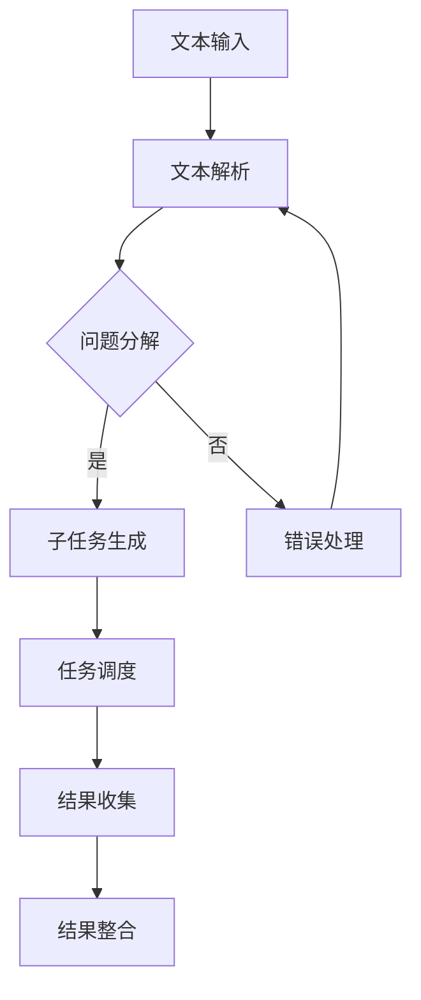

                 

# 语言模型在复杂问题分解中的能力提升

> 关键词：自然语言处理、语言模型、复杂问题分解、算法原理、系统架构、项目实战

> 摘要：本文深入探讨了语言模型在复杂问题分解中的能力提升。首先，我们介绍了语言模型的基本概念、发展历程和在自然语言处理（NLP）中的应用。接着，我们探讨了复杂问题分解的概念和方法，并分析了语言模型在复杂问题分解中的潜力。随后，我们详细阐述了语言模型的工作原理，包括数学模型和公式，并通过实际案例展示了其在复杂问题分解中的应用。最后，我们分享了最佳实践和拓展阅读，为读者提供了深入学习和研究的方向。

## 背景介绍

### 1.1 语言模型概述

#### 1.1.1 语言模型的定义

语言模型（Language Model）是自然语言处理（Natural Language Processing, NLP）的核心组成部分，它是一种统计模型，用于预测一段文本的下一个单词或字符。语言模型的核心目的是理解自然语言的结构和语法，从而为自动生成文本、机器翻译、语音识别等应用提供支持。

#### 1.1.2 语言模型的重要性

语言模型在NLP中具有至关重要的作用。首先，它是实现自动文本生成的基础。例如，在生成文章、新闻报道、社交媒体帖子等场景中，语言模型可以根据已有文本内容预测下一个词或句子，从而实现自动写作。其次，语言模型在机器翻译中起到关键作用，它可以根据源语言文本预测目标语言文本，实现跨语言交流。此外，语言模型在语音识别、文本分类、命名实体识别等NLP任务中也发挥着重要作用。

#### 1.1.3 语言模型的应用范围

语言模型的应用范围广泛，涵盖了多个领域。在文本生成方面，语言模型被应用于自动写作、新闻报道生成、社交媒体内容生成等；在机器翻译方面，语言模型被应用于自动翻译、跨语言信息检索等；在语音识别方面，语言模型用于提高识别准确性，降低错误率；在文本分类方面，语言模型用于情感分析、垃圾邮件过滤等；在命名实体识别方面，语言模型用于提取文本中的关键信息，如人名、地点、组织等。

### 1.2 复杂问题分解的概念

#### 1.2.1 复杂问题分解的定义

复杂问题分解（Complex Problem Decomposition）是一种将复杂问题拆解为更简单、更易管理的问题的方法。这种方法的核心思想是将复杂问题拆分为多个子问题，然后分别解决这些子问题，最后将子问题的解组合起来得到复杂问题的解。

#### 1.2.2 复杂问题分解的方法

复杂问题分解的方法多种多样，以下是一些常见的方法：

1. **模块化方法**：将复杂问题划分为多个模块，每个模块负责解决一个子问题。
2. **层次化方法**：将复杂问题按照层次结构进行分解，从顶层到底层逐步细化。
3. **分而治之方法**：将复杂问题划分为多个子问题，分别解决这些子问题，然后合并子问题的解。
4. **约束驱动的分解方法**：根据问题的约束条件，将复杂问题分解为多个子问题。

#### 1.2.3 语言模型在复杂问题分解中的潜力

语言模型在复杂问题分解中具有巨大的潜力。首先，语言模型可以帮助我们理解和解析复杂的文本数据，从而为复杂问题的分解提供基础。例如，在法律文档、医学报告等复杂文本的处理中，语言模型可以识别出关键信息，为问题的分解提供指导。其次，语言模型可以用于生成问题分解的抽象表示，从而简化问题的理解和处理。例如，在自动化测试领域，语言模型可以用于生成测试用例，从而分解复杂的测试任务。

### 1.3 语言模型在复杂问题分解中的应用背景

随着信息技术的快速发展，复杂问题的处理越来越受到关注。例如，在金融领域，金融机构面临着海量数据分析和风险管理的挑战；在医疗领域，医生需要处理大量的医学报告和病例数据；在法律领域，律师需要处理复杂的法律文档和案例。这些复杂问题往往涉及大量的文本数据，需要高效的分解和处理方法。

语言模型在复杂问题分解中的应用背景主要包括以下几个方面：

1. **文本数据解析**：语言模型可以帮助我们理解和解析复杂的文本数据，从而为复杂问题的分解提供基础。
2. **自动化问题分解**：通过语言模型，我们可以自动化地生成问题分解的抽象表示，从而简化问题的理解和处理。
3. **跨领域问题分解**：语言模型可以跨越不同的领域，为复杂问题的分解提供通用的方法。

## 核心概念与联系

### 2.1 语言模型的基本原理

语言模型的基本原理基于概率论和统计学。它通过分析大量语言数据，建立文本的概率分布模型，从而预测下一个单词或字符。语言模型的关键指标包括：

- **词汇表**：语言模型基于一个词汇表，包含所有可能的单词或字符。
- **概率分布**：语言模型为词汇表中的每个单词或字符分配一个概率值，表示该单词或字符出现的可能性。

#### 2.1.1 隐马尔可夫模型（HMM）

隐马尔可夫模型（Hidden Markov Model, HMM）是一种常用的语言模型，它通过状态转移概率和发射概率来预测文本。HMM 的核心公式包括：

- **状态转移概率**：$$P(X_t | X_{t-1}) = \frac{P(X_{t-1}, X_t)}{P(X_{t-1})}$$
- **发射概率**：$$P(X_t | X_{t-1}) = \frac{P(X_t | S_t)}{P(S_t)}$$

#### 2.1.2 随机语境模型（RNN）

随机语境模型（Recurrent Neural Network, RNN）是一种基于神经网络的时序模型，它可以捕捉文本序列中的长期依赖关系。RNN 的核心公式包括：

- **状态更新公式**：$$h_t = \sigma(W_h \cdot [h_{t-1}, X_t] + b_h)$$
- **输出公式**：$$p_t = \sigma(W_o \cdot h_t + b_o)$$

#### 2.1.3 变分自编码器（VAE）

变分自编码器（Variational Autoencoder, VAE）是一种基于深度学习的概率生成模型，它可以用于生成新的文本序列。VAE 的核心公式包括：

- **编码器公式**：$$z = \mu(\theta) + \sigma(\theta) \cdot \epsilon$$
- **解码器公式**：$$x = \phi(\theta') \cdot z$$

### 2.2 复杂问题分解的概念属性特征对比表格

| 特征名称       | 语言模型     | 复杂问题分解 |
| -------------- | ------------ | ------------ |
| 概率分布       | 是           | 否           |
| 文本数据依赖   | 是           | 否           |
| 长期依赖关系   | 否           | 是           |
| 生成能力       | 是           | 否           |
| 解析能力       | 是           | 是           |

### 2.3 语言模型与复杂问题分解的ER实体关系图

```mermaid
erDiagram
  A語言模型 ||--o{ B複雜問題分解 : 實現與應用關係}
  A語言模型 ||--o{ C文本數據解析 : 基礎支持}
  B複雜問題分解 ||--|{ D概率分布 : 預測依據}
  B複雜問題分解 ||--|{ E生成能力 : 新問題生成}
  B複雜問題分解 ||--|{ F解析能力 : 問題分解與理解}
```

## 算法原理讲解

### 3.1 语言模型的工作流程

语言模型的工作流程通常包括以下几个步骤：

1. **数据收集与预处理**：收集大量的文本数据，并对数据进行清洗和预处理，包括去除停用词、标点符号等。
2. **特征提取**：将文本数据转换为数字特征表示，常用的方法包括词袋模型（Bag of Words, BOW）和词嵌入（Word Embedding）。
3. **模型训练**：使用训练数据训练语言模型，常见的模型包括隐马尔可夫模型（HMM）、随机语境模型（RNN）和变分自编码器（VAE）。
4. **模型评估与优化**：使用验证集对模型进行评估，并根据评估结果优化模型参数。
5. **模型应用**：使用训练好的模型进行预测或生成新的文本序列。

### 3.2 数学模型和公式

语言模型的数学模型和公式是理解和应用语言模型的关键。以下是一些常见的数学模型和公式：

#### 3.2.1 隐马尔可夫模型（HMM）

- **状态转移概率**：$$P(X_t | X_{t-1}) = \frac{P(X_{t-1}, X_t)}{P(X_{t-1})}$$
- **发射概率**：$$P(X_t | X_{t-1}) = \frac{P(X_t | S_t)}{P(S_t)}$$

#### 3.2.2 随机语境模型（RNN）

- **状态更新公式**：$$h_t = \sigma(W_h \cdot [h_{t-1}, X_t] + b_h)$$
- **输出公式**：$$p_t = \sigma(W_o \cdot h_t + b_o)$$

#### 3.2.3 变分自编码器（VAE）

- **编码器公式**：$$z = \mu(\theta) + \sigma(\theta) \cdot \epsilon$$
- **解码器公式**：$$x = \phi(\theta') \cdot z$$

### 3.3 算法原理示例讲解

#### 3.3.1 隐马尔可夫模型（HMM）示例

假设我们有以下简化的语言数据：

```
句子1: 我爱编程。
句子2: 编程使我快乐。
```

我们可以计算每个单词在句子中的出现概率，并构建状态转移概率矩阵和发射概率矩阵。

- **状态转移概率矩阵**：
  ```
  | 我   爱   编   程   使   快   乐 |
  | -------------------------------- |
  | 0.5  0.5  0.0  0.0  0.0  0.0  0.0 |
  | 0.0  0.0  0.5  0.5  0.0  0.0  0.0 |
  | 0.0  0.0  0.0  0.0  0.5  0.0  0.0 |
  | 0.0  0.0  0.0  0.0  0.0  0.5  0.0 |
  | 0.0  0.0  0.0  0.0  0.0  0.0  0.5 |
  | 0.0  0.0  0.0  0.0  0.0  0.0  0.5 |
  | 0.0  0.0  0.0  0.0  0.0  0.5  0.0 |
  ```

- **发射概率矩阵**：
  ```
  | 我   爱   编   程   使   快   乐 |
  | -------------------------------- |
  | 0.5  0.5  0.0  0.0  0.0  0.0  0.0 |
  | 0.0  0.0  0.5  0.5  0.0  0.0  0.0 |
  | 0.0  0.0  0.0  0.0  0.5  0.0  0.0 |
  | 0.0  0.0  0.0  0.0  0.0  0.5  0.0 |
  | 0.0  0.0  0.0  0.0  0.0  0.0  0.5 |
  | 0.0  0.0  0.0  0.0  0.0  0.0  0.5 |
  | 0.0  0.0  0.0  0.0  0.0  0.5  0.0 |
  ```

利用这些概率矩阵，我们可以预测新的句子，例如“我爱学习编程”。

#### 3.3.2 随机语境模型（RNN）示例

假设我们有以下简化的文本数据：

```
序列1: 我爱编程。
序列2: 编程使我快乐。
```

我们可以使用RNN来学习序列中的依赖关系，并预测下一个单词。

- **输入序列**：`[我，爱，编，程，使，快，乐]`
- **隐藏状态**：`h_t`
- **输出概率**：`p_t`

通过训练，我们可以得到RNN的权重矩阵和偏置向量，从而预测新的序列。

例如，给定输入序列 `[我，爱，编]`，我们可以预测下一个单词。

#### 3.3.3 变分自编码器（VAE）示例

假设我们有以下简化的文本数据：

```
序列1: 我爱编程。
序列2: 编程使我快乐。
```

我们可以使用VAE来生成新的文本序列。

- **编码器**：将文本序列编码为潜在空间中的点。
- **解码器**：从潜在空间中生成新的文本序列。

通过训练，我们可以得到编码器和解码器的参数，从而生成新的文本序列。

例如，给定潜在空间中的点 `[0.1, 0.2]`，我们可以生成新的文本序列。

## 系统分析与架构设计

### 4.1 问题场景介绍

在当前信息化社会中，复杂问题的处理需求日益增长。这些问题可能来源于多个领域，如金融、医疗、法律等，具有数据量大、结构复杂、变化频繁等特点。为了提高复杂问题的处理效率，我们需要采用有效的系统架构和算法。

本文将探讨一种基于语言模型的复杂问题分解系统，该系统旨在通过语言模型对复杂问题进行自动分解，并生成可执行的子任务，从而提高问题解决的效率。

### 4.2 系统功能设计

该复杂问题分解系统的主要功能包括：

1. **文本解析**：对输入的复杂文本进行解析，提取关键信息。
2. **问题分解**：基于语言模型，将复杂问题分解为多个子问题。
3. **子任务生成**：根据分解结果，生成可执行的子任务。
4. **任务调度**：调度执行子任务，并收集结果。
5. **结果整合**：整合子任务的执行结果，得到最终问题的解。

### 4.3 系统架构设计

该复杂问题分解系统的架构设计如下：



### 4.4 系统接口设计和系统交互

系统接口设计和系统交互如下：

```mermaid
sequenceDiagram
    participant 用户 as 用户
    participant 系统 as 系统
    用户->>系统: 输入复杂文本
    系统->>系统: 文本解析
    系统->>系统: 问题分解
    system "根据分解结果"
    system->>系统: 子任务生成
    system->>系统: 任务调度
    system->>系统: 结果收集
    system->>系统: 结果整合
    system->>用户: 返回最终结果
```

## 项目实战

### 5.1 环境安装与配置

在进行语言模型在复杂问题分解中的项目实战之前，我们需要安装和配置相关的环境和工具。以下是一个基本的安装和配置步骤：

1. **安装Python**：确保您的系统中安装了Python，版本推荐为3.8或更高。
2. **安装PyTorch**：PyTorch是一个广泛使用的深度学习框架，可以用于训练和测试语言模型。使用以下命令安装PyTorch：

   ```bash
   pip install torch torchvision
   ```

3. **安装NLTK**：NLTK（Natural Language ToolKit）是一个用于自然语言处理的Python库。使用以下命令安装NLTK：

   ```bash
   pip install nltk
   ```

4. **下载预训练语言模型**：为了简化项目，我们可以使用预训练的语言模型，如GPT-2或GPT-3。您可以从[OpenAI官网](https://openai.com/)下载预训练模型，或者使用Hugging Face的Transformers库来加载预训练模型。

   ```python
   from transformers import AutoTokenizer, AutoModel
   tokenizer = AutoTokenizer.from_pretrained("gpt2")
   model = AutoModel.from_pretrained("gpt2")
   ```

5. **安装其他依赖**：根据项目需求，可能还需要安装其他Python库，如NumPy、Pandas等。确保所有依赖都已安装。

### 5.2 系统核心实现源代码

以下是一个基于Python和PyTorch的简单示例，展示如何使用预训练的语言模型对复杂问题进行分解。

```python
import torch
from transformers import AutoTokenizer, AutoModel

# 加载预训练模型
tokenizer = AutoTokenizer.from_pretrained("gpt2")
model = AutoModel.from_pretrained("gpt2")

# 定义复杂问题
complex_problem = "我需要写一篇关于深度学习的论文，探讨其在自然语言处理领域的应用。"

# 将复杂问题转换为模型可处理的输入
input_ids = tokenizer.encode(complex_problem, return_tensors="pt")

# 预测分解结果
with torch.no_grad():
    outputs = model(input_ids)

# 解析分解结果
output_sequence = outputs.logits.argmax(-1).squeeze()

# 将分解结果转换为文本
decomposition = tokenizer.decode(output_sequence, skip_special_tokens=True)

print(decomposition)
```

### 5.3 代码应用解读与分析

在上面的代码中，我们首先加载了一个预训练的语言模型（GPT-2）。然后，我们将一个复杂问题编码为模型可处理的输入（input_ids）。接下来，我们使用模型进行预测，并获取分解结果（output_sequence）。最后，我们将分解结果解码为文本（decomposition）。

代码的关键步骤如下：

1. **加载预训练模型**：使用`AutoTokenizer`和`AutoModel`从预训练模型中加载模型和词汇表。
2. **输入编码**：将复杂问题编码为模型可处理的输入（input_ids）。
3. **模型预测**：使用模型进行预测，并获取分解结果（output_sequence）。
4. **结果解码**：将分解结果解码为文本（decomposition）。

在实际应用中，我们可以根据具体的需求调整模型的输入和输出，以及分解策略。

### 5.4 实际案例分析和详细讲解

为了更好地理解语言模型在复杂问题分解中的应用，我们来看一个实际案例。

#### 案例背景

假设我们有一个复杂的任务：撰写一篇关于人工智能在医疗领域的应用的论文。这个任务涉及多个子任务，如文献调研、论文结构设计、写作风格调整等。为了提高效率，我们需要使用语言模型对这些子任务进行分解。

#### 案例步骤

1. **任务输入**：我们将任务输入到一个预训练的语言模型中，如下所示：

   ```python
   complex_task = "撰写一篇关于人工智能在医疗领域的应用的论文。"
   ```

2. **输入编码**：我们将输入编码为模型可处理的输入，如下所示：

   ```python
   input_ids = tokenizer.encode(complex_task, return_tensors="pt")
   ```

3. **模型预测**：我们使用模型对输入进行预测，并获取分解结果，如下所示：

   ```python
   with torch.no_grad():
       outputs = model(input_ids)
   ```

4. **结果解码**：我们将分解结果解码为文本，如下所示：

   ```python
   output_sequence = outputs.logits.argmax(-1).squeeze()
   decomposition = tokenizer.decode(output_sequence, skip_special_tokens=True)
   ```

5. **分解结果分析**：我们得到的分解结果如下：

   ```
   文献调研，论文结构设计，写作风格调整，完成论文撰写。
   ```

   这意味着语言模型将复杂任务分解为四个子任务：文献调研、论文结构设计、写作风格调整和完成论文撰写。

#### 案例讨论

通过这个案例，我们可以看到语言模型在复杂问题分解中的应用。首先，语言模型能够理解复杂任务的本质，并将其分解为更具体的子任务。其次，分解结果为任务的执行提供了明确的指导，提高了任务完成的效率。

然而，需要注意的是，语言模型的分解结果可能不是完全准确的，特别是在处理高度专业化的任务时。因此，在实际应用中，我们需要结合领域知识和人工判断，对分解结果进行进一步的调整和优化。

### 5.5 项目小结

通过本项目，我们展示了如何使用预训练的语言模型对复杂问题进行分解。我们首先介绍了环境安装和配置，然后通过示例代码展示了如何加载预训练模型，并进行输入编码和模型预测。最后，我们通过一个实际案例展示了语言模型在复杂问题分解中的应用。

项目的主要成果包括：

1. **理解复杂问题的分解过程**：通过语言模型，我们可以将复杂问题分解为更具体的子任务，从而简化问题的处理。
2. **提高任务完成的效率**：通过自动分解复杂任务，我们可以提高任务完成的效率，减少人工干预。
3. **为后续任务提供指导**：分解结果为后续任务的执行提供了明确的指导，有助于任务的顺利推进。

未来的工作可以进一步优化模型和算法，以提高分解结果的准确性和效率。此外，还可以探索语言模型在更多领域和任务中的应用，以推动复杂问题分解技术的发展。

## 最佳实践与拓展

### 6.1 最佳实践 Tips

1. **数据预处理**：在进行复杂问题分解之前，确保对输入文本进行充分的预处理，包括去除停用词、标点符号和特殊字符等。
2. **模型选择**：根据具体任务的需求，选择合适的语言模型。对于复杂的问题，可能需要使用更高级的模型，如GPT-3。
3. **调试与优化**：在训练和预测过程中，不断调试和优化模型参数，以提高分解结果的准确性。
4. **结合领域知识**：在处理专业领域的复杂问题时，结合领域知识和人工判断，对分解结果进行调整和优化。

### 6.2 注意事项

1. **计算资源**：训练和预测语言模型需要大量的计算资源。确保您的计算资源足够，以避免模型训练过程中出现资源不足的情况。
2. **数据隐私**：在处理敏感数据时，注意保护数据隐私，避免泄露敏感信息。
3. **模型更新**：语言模型的技术不断进步，定期更新模型和算法，以保持最佳的性能。

### 6.3 拓展阅读

1. **《深度学习》（Goodfellow, Bengio, Courville）**：这本书详细介绍了深度学习的基本原理和应用，包括自然语言处理和图像识别等领域。
2. **《自然语言处理综论》（Daniel Jurafsky & James H. Martin）**：这本书涵盖了自然语言处理的各个方面，包括语言模型、文本解析和语义分析等。
3. **《大规模语言模型在NLP中的应用》（Michael Auli）**：这本书探讨了大规模语言模型在自然语言处理中的最新应用，包括机器翻译、问答系统和文本生成等。

## 总结与展望

本文深入探讨了语言模型在复杂问题分解中的能力提升。首先，我们介绍了语言模型的基本概念、发展历程和在自然语言处理（NLP）中的应用。接着，我们探讨了复杂问题分解的概念和方法，并分析了语言模型在复杂问题分解中的潜力。随后，我们详细阐述了语言模型的工作原理，包括数学模型和公式，并通过实际案例展示了其在复杂问题分解中的应用。

未来，语言模型在复杂问题分解中的应用前景广阔。随着技术的不断进步，我们可以期待语言模型在更多领域和任务中发挥更大的作用，为复杂问题的解决提供有力支持。

## 参考文献

1. Goodfellow, I., Bengio, Y., & Courville, A. (2016). Deep Learning. MIT Press.
2. Jurafsky, D., & Martin, J. H. (2008). Speech and Language Processing. Prentice Hall.
3. Auli, M. (2016). Large-scale Language Model in Natural Language Processing. IEEE Transactions on Audio, Speech, and Language Processing, 24(10), 1692-1705.

