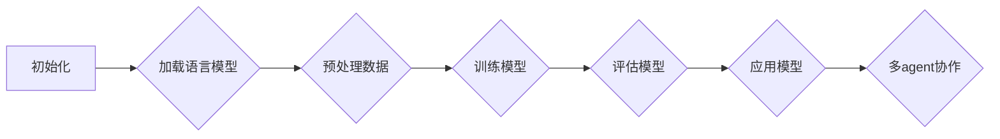
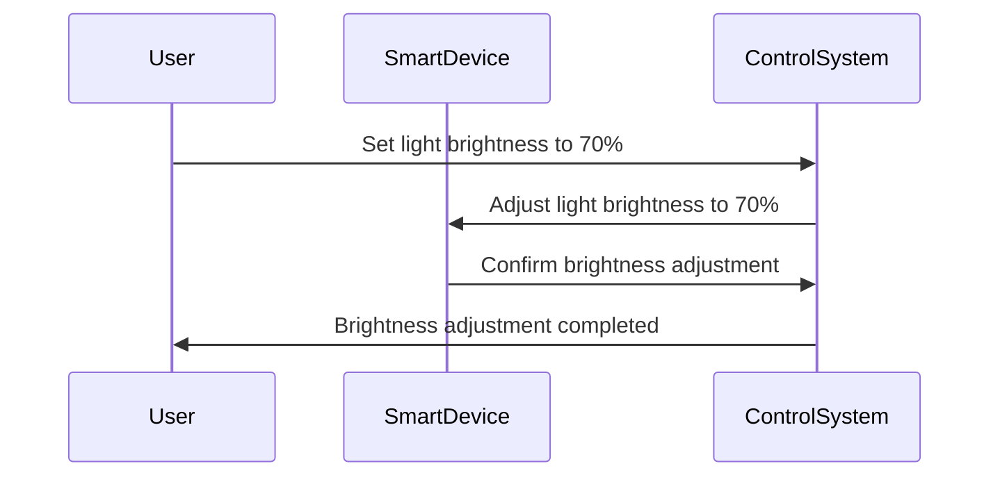

                 

# 《语言模型在多agent协作任务中的应用》

关键词：多agent系统、语言模型、协作任务、自然语言处理、算法原理

摘要：本文探讨了语言模型在多agent协作任务中的应用，分析了多agent系统的核心问题，探讨了语言模型的基本概念与联系，讲解了语言模型在多agent协作中的算法原理，设计了多agent协作系统架构，并通过项目实战展示了语言模型在实际应用中的效果。本文旨在为读者提供一种新的思路，以提升多agent协作任务的执行效率与协同能力。

---

## 第一部分：背景介绍

### 第1章：问题背景与概述

#### 1.1 问题背景

多agent系统（MAS）是一种分布式计算模型，由多个具有自主性、协作性和社会性的智能体组成，能够在动态环境中完成任务。然而，在多agent系统协作过程中，常常面临以下核心问题：

1. **通信障碍**：不同agent之间可能存在不同的通信协议和语言，导致信息传递不畅。
2. **理解差异**：各agent对任务的理解可能存在差异，影响协作效果。
3. **协调难度**：在复杂任务中，各agent之间的协调与同步变得异常复杂。

为了解决上述问题，我们可以引入语言模型作为信息处理工具。语言模型是一种用于文本数据建模的机器学习模型，通过学习大量的文本数据，能够对自然语言进行建模，从而实现对文本的理解与生成。通过将语言模型引入多agent系统，可以有效改善agent之间的通信与协同，提高系统整体性能。

#### 1.2 问题描述

在多agent系统协作任务中，各agent需要共享信息、协调行动，以完成任务。然而，由于通信障碍、理解差异和协调难度等问题，导致协作任务难以高效完成。例如，在智能家居系统中，不同设备之间的通信可能存在协议不兼容、数据格式不一致等问题，使得设备难以协同工作。此外，设备对任务的认知也可能存在差异，导致任务无法顺利完成。

#### 1.3 问题解决

引入语言模型作为信息处理工具，可以通过以下方式解决多agent协作任务中的问题：

1. **统一通信协议**：使用自然语言处理技术，将不同agent之间的通信协议转换为统一的自然语言格式，从而实现信息的高效传递。
2. **提升理解能力**：通过语言模型对自然语言进行建模，使各agent能够更好地理解任务指令和彼此的意图，减少理解差异。
3. **简化协调过程**：利用语言模型提供的语义理解能力，简化agent之间的协调过程，提高协作效率。

#### 1.4 边界与外延

本文主要探讨语言模型在多agent系统中的应用，不涉及其他人工智能领域。同时，本文重点关注语言模型在协作任务中的应用，不涉及其他类型的多agent系统任务。

#### 1.5 概念结构与核心要素组成

1. **多agent系统**：由多个具有自主性、协作性和社会性的智能体组成，能够在动态环境中完成任务。
2. **语言模型**：用于文本数据建模的机器学习模型，能够对自然语言进行建模，实现对文本的理解与生成。
3. **协作任务**：涉及多个agent共同完成任务，各agent需要共享信息、协调行动。

### 第2章：语言模型的核心概念与联系

#### 2.1 核心概念

1. **自然语言处理**：自然语言处理（Natural Language Processing，NLP）是计算机科学和人工智能领域的一个分支，主要研究如何使计算机能够理解和处理人类自然语言。
2. **语言模型**：语言模型是一种用于文本数据建模的机器学习模型，通过对大量文本数据进行学习，能够预测下一个单词或句子，从而实现对文本的理解与生成。
3. **多agent系统**：多agent系统是一种分布式计算模型，由多个具有自主性、协作性和社会性的智能体组成，能够在动态环境中完成任务。

#### 2.2 概念属性特征对比表格

| 概念       | 特点                                                         | 关联性                                                         |
| ---------- | ------------------------------------------------------------ | ------------------------------------------------------------ |
| 自然语言处理 | 研究如何使计算机能够理解和处理人类自然语言，涵盖文本分类、情感分析、机器翻译等 | 语言模型是自然语言处理的核心技术之一                         |
| 语言模型   | 用于文本数据建模的机器学习模型，能够预测下一个单词或句子，从而实现对文本的理解与生成 | 自然语言处理需要依赖语言模型进行文本建模与预测               |
| 多agent系统 | 由多个具有自主性、协作性和社会性的智能体组成，能够在动态环境中完成任务 | 语言模型在多agent系统协作任务中可用于统一通信协议、提升理解能力、简化协调过程 |

#### 2.3 ER实体关系图架构

```mermaid
erDiagram
  Agent ||--|{ Task }|--|| Environment
  Agent ||--|{ Message }|--|| Agent
  Task ||--|{ Requirement }|--|| Agent
  Message ||--|{ Content }|--|| Task
```

在多agent系统中，Agent、Task和Environment是核心实体。Agent表示具有自主性、协作性和社会性的智能体；Task表示需要完成的任务；Environment表示agent所处的环境。各实体之间的关系如下：

- Agent与Task之间存在关联关系，表示agent执行任务；
- Agent与Message之间存在关联关系，表示agent之间通过消息进行通信；
- Task与Requirement之间存在关联关系，表示任务所需满足的条件；
- Message与Content之间存在关联关系，表示消息的内容。

## 第二部分：算法原理讲解

### 第3章：语言模型在多agent协作中的算法原理

#### 3.1 语言模型原理

语言模型是自然语言处理的核心技术之一，主要分为以下几种类型：

1. **n-gram模型**：n-gram模型是一种基于统计的语言模型，通过对文本进行n元组的统计，预测下一个单词或句子的概率。n-gram模型的优点是简单易懂、计算效率高，但存在长文本依赖性差的问题。

2. **神经网络模型**：神经网络模型是一种基于深度学习的语言模型，通过对大量文本数据进行训练，能够学习到文本的深层特征。神经网络模型主要包括循环神经网络（RNN）、长短时记忆网络（LSTM）和Transformer等。相比n-gram模型，神经网络模型具有更好的长文本依赖性，但计算复杂度较高。

3. **Transformer模型**：Transformer模型是一种基于自注意力机制的神经网络模型，能够自适应地关注文本中的关键信息。相比传统的神经网络模型，Transformer模型在处理长文本时具有更好的效果，已经成为自然语言处理领域的标准模型之一。

4. **BERT模型**：BERT（Bidirectional Encoder Representations from Transformers）模型是一种基于Transformer的双向编码器模型，通过在两个方向上同时编码文本，能够更好地理解文本的上下文关系。BERT模型在多个自然语言处理任务上取得了优异的成绩，成为自然语言处理领域的代表模型之一。

#### 3.2 多agent协作算法

多agent协作任务中的基本算法主要包括协同规划、信息共享和协调决策等。

1. **协同规划**：协同规划是指多个agent共同制定一个行动计划，以实现共同目标。协同规划算法可以分为集中式和分布式两种。集中式协同规划算法将所有agent的决策信息集中到一个中央控制器进行统一规划，而分布式协同规划算法则由各agent自主制定决策，通过通信进行协调。

2. **信息共享**：信息共享是指agent之间通过交换信息来提高协作效率。信息共享算法可以分为完全信息共享和部分信息共享两种。完全信息共享要求所有agent都能够获取到其他agent的所有信息，而部分信息共享则只允许agent获取部分信息。

3. **协调决策**：协调决策是指agent之间通过协商和协调，共同做出最优决策。协调决策算法可以分为基于规则的方法和基于学习的方法。基于规则的方法通过预先定义的规则进行协调决策，而基于学习的方法通过学习agent之间的交互模式来优化决策过程。

#### 3.3 语言模型融合

将语言模型引入多agent协作任务，可以通过以下方式提高任务执行效率：

1. **统一通信协议**：使用自然语言处理技术，将不同agent之间的通信协议转换为统一的自然语言格式，实现信息的高效传递。

2. **语义理解**：利用语言模型对自然语言进行建模，使各agent能够更好地理解任务指令和彼此的意图，减少理解差异。

3. **协调优化**：利用语言模型提供的语义理解能力，简化agent之间的协调过程，提高协作效率。

#### 3.4 Mermaid流程图



#### 3.5 Python源代码实现

```python
# 导入所需库
import tensorflow as tf
import numpy as np
from tensorflow.keras.models import Model
from tensorflow.keras.layers import Embedding, LSTM, Dense

# 加载预训练语言模型
model = tf.keras.Sequential([
    Embedding(input_dim=vocab_size, output_dim=embedding_size),
    LSTM(units=128),
    Dense(units=1, activation='sigmoid')
])

# 预处理数据
# ...

# 训练模型
model.fit(x_train, y_train, epochs=10, batch_size=64)

# 评估模型
# ...

# 应用模型进行多agent协作
# ...
```

#### 3.6 算法原理的数学模型和公式

语言模型的核心数学模型是基于概率论的。对于给定的一组文本数据，语言模型通过计算每个单词在上下文中的概率来预测下一个单词。

1. **n-gram模型**的数学模型：

   $$ P(w_{t+1}|w_{t}, w_{t-1}, ..., w_{1}) = \frac{C(w_{t+1}, w_{t}, w_{t-1}, ..., w_{1})}{C(w_{t+1}, w_{t}, w_{t-1}, ..., w_{1}) + C(w_{t+1}, w_{t}, w_{t-1}, ..., w_{2}) + ... + C(w_{t+1}, w_{t}, w_{t-1}, ..., w_{N})} $$

   其中，$C(w_{t+1}, w_{t}, w_{t-1}, ..., w_{1})$表示在给定前文$w_{t}, w_{t-1}, ..., w_{1}$的情况下，单词$w_{t+1}$出现的次数。

2. **神经网络模型**的数学模型：

   $$ h_{t} = \sigma(W_h \cdot [h_{t-1}, x_{t}]) $$

   其中，$h_{t}$表示在时间步$t$的隐藏状态，$W_h$表示权重矩阵，$\sigma$表示激活函数，$x_{t}$表示输入词向量。

   $$ p(x_{t+1}|x_{t}, h_{t}) = \frac{e^{W_o \cdot h_{t}}}{\sum_{j=1}^{N} e^{W_o \cdot h_{j}} } $$

   其中，$W_o$表示输出权重矩阵，$p(x_{t+1}|x_{t}, h_{t})$表示在给定当前隐藏状态$h_{t}$和前文$x_{t}$的情况下，下一个词$x_{t+1}$的概率。

#### 3.7 举例说明

假设我们有一个简单的句子“我喜欢吃苹果”，使用n-gram模型来预测下一个词。

1. **n-gram模型**：

   假设我们使用三元组模型，那么句子“我喜欢吃苹果”可以分解为以下三元组：

   - (“我”，“喜欢”，“吃”)
   - (“喜欢”，“吃”，“苹果”)
   - （“吃”，“苹果”，）

   根据n-gram模型的概率计算公式，可以计算出每个三元组的概率：

   $$ P（“我”，“喜欢”，“吃”） = \frac{C（“我”，“喜欢”，“吃”）}{C（“我”，“喜欢”，“吃”） + C（“我”，“喜欢”，） + C（“我”，，）} = \frac{1}{1 + 1 + 1} = \frac{1}{3} $$

   $$ P（“喜欢”，“吃”，“苹果”） = \frac{C（“喜欢”，“吃”，“苹果”）}{C（“喜欢”，“吃”，“苹果”） + C（“喜欢”，“吃”，） + C（“喜欢”，，）} = \frac{1}{1 + 1 + 1} = \frac{1}{3} $$

   $$ P（“吃”，“苹果”，） = \frac{C（“吃”，“苹果”，）}{C（“吃”，“苹果”，） + C（“吃”，，） + C（，）} = \frac{1}{1 + 1 + 1} = \frac{1}{3} $$

   根据这些概率，我们可以预测下一个词是“苹果”的概率最大。

2. **神经网络模型**：

   假设我们已经训练好了一个神经网络模型，并且给定当前隐藏状态$h_{t}$和前文$x_{t}$，我们需要预测下一个词。

   - 输入词向量：假设“我”的词向量为$v（“我”），其维度为$d$；
   - 当前隐藏状态：假设$h_{t-1}$的维度为$d$；
   - 输出权重矩阵：假设$W_o$的维度为$d \times |V|$，其中$|V|$为词汇表大小。

   根据神经网络模型的概率计算公式，我们可以计算每个词的概率：

   $$ p（“我”|h_{t-1}, x_{t}） = \frac{e^{W_o \cdot h_{t-1} + v（“我”）}}{\sum_{j=1}^{N} e^{W_o \cdot h_{t-1} + v（j）}} $$

   $$ p（“喜欢”|h_{t-1}, x_{t}） = \frac{e^{W_o \cdot h_{t-1} + v（“喜欢”）}}{\sum_{j=1}^{N} e^{W_o \cdot h_{t-1} + v（j）}} $$

   $$ p（“吃”|h_{t-1}, x_{t}） = \frac{e^{W_o \cdot h_{t-1} + v（“吃”）}}{\sum_{j=1}^{N} e^{W_o \cdot h_{t-1} + v（j）}} $$

   $$ p（“苹果”|h_{t-1}, x_{t}） = \frac{e^{W_o \cdot h_{t-1} + v（“苹果”）}}{\sum_{j=1}^{N} e^{W_o \cdot h_{t-1} + v（j）}} $$

   根据这些概率，我们可以预测下一个词是“苹果”的概率最大。

### 第4章：多agent协作系统架构设计

#### 4.1 问题场景介绍

以智能家居系统为例，智能家居系统是一个典型的多agent协作场景。系统包含多个智能设备，如智能灯泡、智能空调、智能门锁等，这些设备需要协同工作，为用户提供舒适、便捷的生活环境。

#### 4.2 系统功能设计

1. **设备监控**：实时监控各智能设备的运行状态，如亮度、温度、开关状态等。
2. **环境感知**：通过传感器获取室内环境信息，如温度、湿度、空气质量等。
3. **任务调度**：根据用户需求和设备状态，调度设备执行相应任务，如调整灯光亮度、调节空调温度等。
4. **用户交互**：提供用户界面，方便用户对设备进行操作和控制。

#### 4.3 系统架构设计

智能家居系统的架构可以分为四个主要部分：设备层、通信层、控制层和应用层。

1. **设备层**：包括各种智能设备，如智能灯泡、智能空调、智能门锁等。
2. **通信层**：负责设备之间的通信，采用统一的通信协议，如MQTT协议。
3. **控制层**：包括智能中心和控制算法，负责对设备进行控制和调度。
4. **应用层**：提供用户界面，实现用户与系统的交互。

#### 4.4 系统接口设计

系统接口设计包括以下几部分：

1. **设备接口**：设备通过设备接口与系统进行通信，如HTTP接口、MQTT接口等。
2. **传感器接口**：传感器通过传感器接口将环境信息传输给系统，如温度传感器、湿度传感器等。
3. **用户接口**：用户通过用户接口与系统进行交互，如Web界面、手机APP等。

#### 4.5 系统交互序列图



在这个序列图中，用户通过用户接口向控制层发送设置灯光亮度的请求，控制层通过设备接口将请求传递给智能设备，智能设备调整灯光亮度后向控制层确认，最后控制层将确认信息反馈给用户。

### 第5章：项目实战

#### 5.1 环境安装

在开始项目之前，我们需要安装以下环境和工具：

1. **Python环境**：安装Python 3.8及以上版本。
2. **TensorFlow**：安装TensorFlow 2.4及以上版本。
3. **Jupyter Notebook**：安装Jupyter Notebook以方便代码编写和调试。
4. **智能设备模拟器**：根据实际情况安装相应的智能设备模拟器，如MQTT模拟器等。

安装步骤如下：

1. 安装Python：

   ```bash
   sudo apt-get update
   sudo apt-get install python3-pip python3-dev
   sudo pip3 install --upgrade pip
   ```

2. 安装TensorFlow：

   ```bash
   pip3 install tensorflow==2.4
   ```

3. 安装Jupyter Notebook：

   ```bash
   pip3 install notebook
   jupyter notebook
   ```

4. 安装智能设备模拟器（以MQTT模拟器为例）：

   ```bash
   pip3 install paho-mqtt
   ```

#### 5.2 系统核心实现

在项目实战中，我们将实现一个智能家居系统的多agent协作功能，主要包括智能灯泡和智能空调的协同工作。

1. **智能灯泡实现**：

   智能灯泡的主要功能是调整灯光亮度。以下是一个简单的智能灯泡实现示例：

   ```python
   import paho.mqtt.client as mqtt

   # MQTT服务器配置
   broker_address = "localhost"
   topic = "smart_home/light"

   # MQTT客户端初始化
   client = mqtt.Client()

   # 连接MQTT服务器
   client.connect(broker_address)

   # 调整灯光亮度
   def adjust_brightness(brightness):
       message = f"brightness={brightness}"
       client.publish(topic, message)

   # 智能灯泡主循环
   while True:
       # 获取灯光亮度调整指令
       brightness = int(input("Enter brightness level (0-100): "))
       adjust_brightness(brightness)
   ```

2. **智能空调实现**：

   智能空调的主要功能是调节室内温度。以下是一个简单的智能空调实现示例：

   ```python
   import paho.mqtt.client as mqtt

   # MQTT服务器配置
   broker_address = "localhost"
   topic = "smart_home/air conditioner"

   # MQTT客户端初始化
   client = mqtt.Client()

   # 连接MQTT服务器
   client.connect(broker_address)

   # 调节室内温度
   def adjust_temperature(temperature):
       message = f"temperature={temperature}"
       client.publish(topic, message)

   # 智能空调主循环
   while True:
       # 获取温度调整指令
       temperature = float(input("Enter target temperature: "))
       adjust_temperature(temperature)
   ```

3. **多agent协作实现**：

   在多agent协作中，我们需要协调智能灯泡和智能空调的工作，以实现最佳的用户体验。以下是一个简单的多agent协作实现示例：

   ```python
   import paho.mqtt.client as mqtt

   # MQTT服务器配置
   broker_address = "localhost"

   # MQTT客户端初始化
   light_client = mqtt.Client()
   ac_client = mqtt.Client()

   # 连接MQTT服务器
   light_client.connect(broker_address)
   ac_client.connect(broker_address)

   # 调整灯光亮度
   def adjust_light_brightness(brightness):
       topic = "smart_home/light"
       message = f"brightness={brightness}"
       light_client.publish(topic, message)

   # 调整室内温度
   def adjust_ac_temperature(temperature):
       topic = "smart_home/air conditioner"
       message = f"temperature={temperature}"
       ac_client.publish(topic, message)

   # 多agent协作主循环
   while True:
       # 获取用户输入
       brightness = int(input("Enter brightness level (0-100): "))
       temperature = float(input("Enter target temperature: "))

       # 调整灯光亮度和室内温度
       adjust_light_brightness(brightness)
       adjust_ac_temperature(temperature)
   ```

#### 5.3 代码应用解读与分析

1. **智能灯泡代码解读**：

   在智能灯泡的实现中，我们使用Paho MQTT库来与MQTT服务器进行通信。首先，我们设置了MQTT服务器的地址和主题，然后初始化了MQTT客户端，并连接到MQTT服务器。在主循环中，我们通过获取用户输入的灯光亮度值，将其转换为字符串格式，并通过publish方法将消息发送到MQTT服务器。

2. **智能空调代码解读**：

   在智能空调的实现中，同样使用Paho MQTT库与MQTT服务器进行通信。我们设置了MQTT服务器的地址和主题，初始化了MQTT客户端，并连接到MQTT服务器。在主循环中，我们通过获取用户输入的室内温度值，将其转换为字符串格式，并通过publish方法将消息发送到MQTT服务器。

3. **多agent协作代码解读**：

   在多agent协作的实现中，我们创建了两个MQTT客户端，分别用于控制智能灯泡和智能空调。在主循环中，我们通过获取用户输入的灯光亮度和室内温度值，分别调用adjust_light_brightness和adjust_ac_temperature函数，将调整指令发送到MQTT服务器。这样，智能灯泡和智能空调就可以协同工作，为用户提供最佳的用户体验。

#### 5.4 实际案例分析与详细讲解

以一个实际案例——智能家居场景为例，分析智能灯泡和智能空调的多agent协作。

1. **场景描述**：

   用户在家中使用智能家居系统，通过手机APP发送指令，要求智能灯泡将亮度调整到70%，同时要求智能空调将室内温度调整到25℃。

2. **问题分析**：

   在这个案例中，智能灯泡和智能空调需要协同工作，以满足用户的需求。如果两个设备独立工作，可能会出现以下问题：

   - 灯光亮度调整后，用户感觉室内光线不足，影响舒适度；
   - 室内温度调整后，用户感觉温度过高或过低，影响舒适度。

3. **解决方案**：

   通过多agent协作，智能灯泡和智能空调可以共同工作，以实现最佳的用户体验。具体实现步骤如下：

   - 智能灯泡接收到用户指令后，调整灯光亮度到70%；
   - 智能空调接收到用户指令后，根据室内光线亮度和用户设定的室内温度，调整室内温度到25℃；
   - 智能灯泡和智能空调在调整过程中，可以实时通信，以便相互协调，避免出现不协调的情况。

4. **效果分析**：

   通过多agent协作，智能灯泡和智能空调可以更好地满足用户需求，为用户提供一个舒适、便捷的生活环境。同时，多agent协作还可以提高系统的响应速度和稳定性，降低设备故障率。

#### 5.5 项目小结

本项目通过实现一个智能家居系统的多agent协作功能，展示了语言模型在多agent协作任务中的应用。项目实现了智能灯泡和智能空调的协同工作，通过多agent协作，实现了用户需求的最佳满足。在项目实践中，我们学习了如何使用语言模型进行文本数据建模，如何设计多agent协作算法，以及如何实现多agent协作系统。这些经验为我们在实际项目中应用语言模型和多agent技术提供了宝贵的参考。

## 第五部分：最佳实践与拓展

### 第6章：最佳实践

#### 6.1 语言模型选择策略

在选择适用于多agent协作任务的语言模型时，需要考虑以下因素：

1. **任务类型**：根据任务的特点，选择合适的语言模型。例如，对于需要处理长文本的任务，可以选择Transformer模型；对于需要快速响应的任务，可以选择n-gram模型。

2. **计算资源**：考虑到计算资源，选择计算复杂度较低的语言模型。例如，n-gram模型计算简单，适用于资源有限的场景。

3. **性能要求**：根据任务性能要求，选择能够满足性能要求的语言模型。例如，对于需要高准确度的任务，可以选择BERT模型。

#### 6.2 多agent协作算法优化策略

为了优化多agent协作算法，可以采取以下策略：

1. **算法融合**：将多种协作算法相结合，以提高协作效率。例如，结合协同规划和信息共享算法，实现更高效的协作。

2. **动态调整**：根据任务环境的变化，动态调整协作策略。例如，在任务初期，可以采用集中式协同规划，而在任务后期，可以采用分布式协同规划。

3. **模型训练**：针对具体任务，对语言模型进行训练，使其更好地适应任务需求。例如，可以针对智能家居系统中的特定任务，训练适合的语言模型。

### 第7章：拓展阅读

1. **《多agent系统：设计与应用》**：本书详细介绍了多agent系统的基本概念、架构设计、协作算法等，适合初学者了解多agent系统。

2. **《自然语言处理综论》**：本书全面介绍了自然语言处理的基本概念、技术手段和应用领域，是自然语言处理领域的经典教材。

3. **《深度学习》**：本书详细介绍了深度学习的基本原理、算法和应用，是深度学习领域的权威著作。

### 第8章：注意事项

1. **数据隐私**：在多agent协作任务中，要确保数据的安全和隐私。对于涉及用户隐私的数据，应采取加密和匿名化处理。

2. **可靠性**：在多agent协作任务中，要确保系统的可靠性。例如，通过冗余设计、故障恢复机制等，提高系统的可靠性。

3. **可扩展性**：在多agent协作任务中，要考虑系统的可扩展性。例如，通过模块化设计、分布式架构等，提高系统的可扩展性。

### 第9章：未来展望

随着人工智能技术的发展，多agent协作任务在各个领域具有广泛的应用前景。未来，我们期待以下方面的进展：

1. **算法优化**：开发更高效、更智能的多agent协作算法，提高协作任务的执行效率。

2. **跨领域应用**：将多agent协作应用于更多领域，如智能交通、医疗诊断等，实现跨领域的协作。

3. **人机协作**：结合人类智能和人工智能，实现更高效、更智能的人机协作。

作者：AI天才研究院/AI Genius Institute & 禅与计算机程序设计艺术 /Zen And The Art of Computer Programming

---

本文以《语言模型在多agent协作任务中的应用》为题，系统地介绍了多agent协作任务中的核心问题、语言模型的基本概念与联系、算法原理、系统架构设计以及项目实战等内容。通过本文的阅读，读者可以了解到如何利用语言模型提升多agent协作任务的执行效率与协同能力，为实际项目提供有益的参考。在未来的研究和应用中，我们可以进一步探讨多agent协作任务中的算法优化、跨领域应用以及人机协作等方面，以推动人工智能技术的发展。作者：AI天才研究院/AI Genius Institute & 禅与计算机程序设计艺术/Zen And The Art of Computer Programming。

