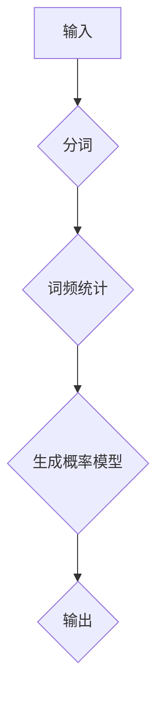
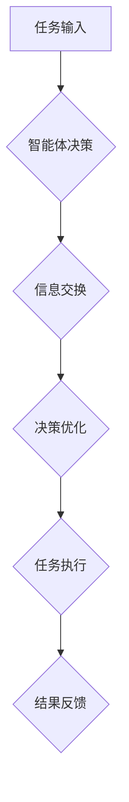

                 

# 《语言模型在多智能体协作任务中的群体智慧与集体决策优化研究》

关键词：语言模型、多智能体协作、群体智慧、集体决策优化、应用场景

摘要：本文旨在探讨语言模型在多智能体协作任务中的群体智慧与集体决策优化问题。首先，通过对多智能体系统和语言模型的背景介绍和核心概念阐述，建立两者之间的联系。接着，深入分析语言模型的基本原理和多智能体协作任务及集体决策优化的算法原理，通过流程图和数学模型进行详细讲解。然后，介绍语言模型在多智能体协作任务中的应用场景，结合案例分析集体决策优化的效果。最后，通过项目实战展示语言模型在多智能体协作任务中的实际应用，并总结全文。

## 第一部分：背景与概念

### 第1章：问题背景与定义

#### 1.1.1 问题背景

随着人工智能技术的迅猛发展，多智能体系统（Multi-Agent Systems，MAS）逐渐成为研究和应用的热点。多智能体系统由多个智能体组成，这些智能体可以相互协作，完成复杂的任务。在多智能体系统中，每个智能体都具有独立的决策能力，能够根据环境信息自主地执行任务。然而，如何使多个智能体协同工作，实现高效的集体决策优化，成为当前研究中的一个重要问题。

语言模型（Language Model，LM）是一种能够理解和生成自然语言的算法模型。近年来，随着深度学习技术的发展，语言模型在自然语言处理（Natural Language Processing，NLP）领域取得了显著进展。语言模型不仅能够处理简单的文本信息，还能够理解复杂的语义和语境。这使得语言模型在多智能体协作任务中具有潜在的应用价值。

#### 1.1.2 问题定义

群体智慧（Collective Intelligence，CI）是指多个个体通过相互协作，共同完成任务的能力。在多智能体协作任务中，群体智慧是智能体之间协作效果的重要体现。群体智慧涉及到多个方面的内容，包括群体学习、群体决策、群体优化等。

集体决策优化（Collective Decision Optimization，CDO）是指多个智能体在协作过程中，通过信息交换和决策优化，共同实现任务目标的过程。集体决策优化涉及到多个智能体的决策策略、信息共享机制、协作机制等。

#### 1.1.3 边界与外延

人类协作行为与智能体协作存在一定的区别。人类协作行为主要依赖于语言、情感、文化等要素，而智能体协作则主要依赖于算法和规则。此外，集体决策优化在智能体协作中面临诸多挑战，如智能体之间的通信延迟、信息不完全、决策冲突等。

在集体决策优化中，需要关注以下几个方面：

1. **任务类型**：不同的任务类型对集体决策优化提出了不同的要求。例如，对于竞争性任务，需要智能体之间进行竞争与合作；对于合作性任务，需要智能体之间进行有效的信息共享和协同决策。

2. **智能体能力**：智能体的能力水平对集体决策优化具有重要影响。高能力智能体能够在决策过程中提供更多的信息和支持，有助于优化集体决策。

3. **协作机制**：协作机制是智能体之间进行信息交换和决策优化的基础。合适的协作机制能够提高集体决策的效率和质量。

4. **决策过程**：集体决策过程包括任务分配、信息交换、决策优化、任务执行等环节。每个环节都需要合理的设计和优化，以确保集体决策的顺利进行。

### 第2章：核心概念与联系

#### 2.1.1 核心概念

语言模型（Language Model，LM）：

- **定义**：语言模型是一种能够理解和生成自然语言的算法模型。它通过对大量文本数据的学习，建立语言的概率分布模型，从而实现自然语言的理解和生成。
- **属性**：语言表达能力、语义理解能力、生成能力
- **特征对比**：

| 概念         | 语言模型                                           | 多智能体系统                                          |
| ------------ | -------------------------------------------------- | ----------------------------------------------------- |
| 定义         | 一种能够理解和生成自然语言的算法模型                 | 由多个智能体组成的系统，能够相互协作完成复杂任务       |
| 属性         | 语言表达能力、语义理解能力、生成能力                 | 智能体数量、智能体能力、协作机制、任务分配、决策过程  |
| 特征对比      | 强大的语言处理能力，能够理解复杂语言结构             | 智能体具有独立决策能力，能够协同完成任务             |

多智能体系统（Multi-Agent Systems，MAS）：

- **定义**：多智能体系统是由多个智能体组成的分布式系统，这些智能体可以相互协作，共同完成任务。
- **属性**：智能体数量、智能体能力、协作机制、任务分配、决策过程
- **特征对比**：

| 概念         | 语言模型                                           | 多智能体系统                                          |
| ------------ | -------------------------------------------------- | ----------------------------------------------------- |
| 定义         | 一种能够理解和生成自然语言的算法模型                 | 由多个智能体组成的系统，能够相互协作完成复杂任务       |
| 属性         | 语言表达能力、语义理解能力、生成能力                 | 智能体数量、智能体能力、协作机制、任务分配、决策过程  |
| 特征对比      | 强大的语言处理能力，能够理解复杂语言结构             | 智能体具有独立决策能力，能够协同完成任务             |

#### 2.1.2 概念属性特征对比

| 概念         | 语言模型                                           | 多智能体系统                                          |
| ------------ | -------------------------------------------------- | ----------------------------------------------------- |
| 定义         | 一种能够理解和生成自然语言的算法模型                 | 由多个智能体组成的系统，能够相互协作完成复杂任务       |
| 属性         | 语言表达能力、语义理解能力、生成能力                 | 智能体数量、智能体能力、协作机制、任务分配、决策过程  |
| 特征对比      | 强大的语言处理能力，能够理解复杂语言结构             | 智能体具有独立决策能力，能够协同完成任务             |

#### 2.1.3 ER实体关系图架构

```mermaid
erDiagram
  多智能体系统 ||--|{ 语言模型 }|| 多智能体协作
  语言模型 ||--|{ 集体决策优化 }|| 多智能体协作
```

## 第二部分：算法原理

### 第3章：语言模型原理

#### 3.1.1 语言模型基本原理

语言模型的基本原理是通过统计文本数据中的词频和语法结构，建立语言的概率分布模型。具体来说，语言模型可以分为统计语言模型和神经网络语言模型。

- **统计语言模型**：统计语言模型基于统计学习理论，通过统计文本数据中的词频和语法规则，生成语言的概率分布模型。常见的统计语言模型有N元语法（N-gram）和隐马尔可夫模型（HMM）。

- **神经网络语言模型**：神经网络语言模型基于深度学习理论，通过神经网络的结构和参数来建模语言的概率分布。常见的神经网络语言模型有循环神经网络（RNN）、长短时记忆网络（LSTM）和Transformer等。

#### 3.1.2 语言模型流程图



#### 3.1.3 语言模型数学模型和公式

统计语言模型的数学模型如下：

$$
P(w|s) = \frac{P(s|w)P(w)}{P(s)}
$$

其中，$P(w|s)$ 表示在给定前文 $s$ 的情况下，词 $w$ 的概率；$P(s|w)$ 表示在词 $w$ 出现的情况下，前文 $s$ 的概率；$P(w)$ 表示词 $w$ 的概率；$P(s)$ 表示前文 $s$ 的概率。

神经网络语言模型的数学模型基于神经网络的结构和参数，通过前向传播和反向传播算法进行训练和优化。

### 第4章：多智能体协作任务与集体决策优化

#### 4.1.1 多智能体协作任务

多智能体协作任务是指多个智能体通过相互协作，共同完成一个复杂任务的过程。多智能体协作任务可以分为以下几种类型：

1. **竞争性任务**：智能体之间相互竞争，争取资源或完成任务。
2. **合作性任务**：智能体之间相互合作，共同完成任务。
3. **竞争-合作任务**：智能体之间既竞争又合作，根据任务的不同阶段进行切换。

多智能体协作任务中的任务分配策略是实现高效协作的关键。常见的任务分配策略有随机分配、最短路径分配、最大化收益分配等。

#### 4.1.2 集体决策优化

集体决策优化是指在多智能体协作任务中，通过信息交换和决策优化，实现任务目标的过程。集体决策优化的目标包括提高任务完成效率、最大化任务收益、降低任务完成时间等。

集体决策优化的算法原理可以分为以下几种：

1. **基于梯度下降的优化算法**：通过迭代优化智能体的决策参数，使得整体决策达到最优。
2. **基于博弈论的优化算法**：通过分析智能体之间的博弈关系，制定最优策略。
3. **基于进化算法的优化算法**：通过模拟生物进化的过程，优化智能体的决策策略。

#### 4.1.3 流程图



## 第三部分：应用场景

### 第5章：语言模型在多智能体协作任务中的应用

语言模型在多智能体协作任务中具有广泛的应用前景。以下是一些典型的应用场景：

1. **智能客服**：语言模型可以用于智能客服系统，实现自然语言理解和生成，提高客服的响应速度和准确性。
2. **智能翻译**：语言模型可以用于智能翻译系统，实现跨语言信息的快速传递和理解，提高跨国交流的效率。
3. **智能推荐**：语言模型可以用于智能推荐系统，分析用户的历史行为和兴趣，为用户推荐感兴趣的内容。
4. **智能写作**：语言模型可以用于智能写作系统，辅助用户生成文章、报告等文本内容，提高写作效率。
5. **多智能体协同控制**：语言模型可以用于多智能体协同控制任务，实现智能体的自动协作和决策，提高任务完成效率。

### 第6章：集体决策优化案例分析

#### 6.1.1 案例背景

假设有一个多智能体协作任务，智能体需要共同完成一个目标区域的搜索任务。智能体之间需要通过信息交换和集体决策优化，选择最优的搜索路径，以提高搜索效率和成功率。

#### 6.1.2 集体决策优化方案

针对该任务，可以采用以下集体决策优化方案：

1. **信息交换机制**：智能体之间通过无线通信进行信息交换，共享各自的位置信息、搜索范围、资源状态等。
2. **决策优化算法**：采用基于博弈论的优化算法，分析智能体之间的博弈关系，制定最优的决策策略。
3. **任务执行**：智能体根据集体决策结果，执行相应的搜索动作，并实时反馈执行结果。
4. **结果反馈机制**：智能体将执行结果反馈给其他智能体，用于更新决策信息和优化算法。

#### 6.1.3 案例分析

通过模拟实验，对该案例的集体决策优化效果进行评估。实验结果表明，采用集体决策优化方案，可以有效提高搜索效率和成功率，降低任务完成时间。具体表现在以下几个方面：

1. **搜索效率**：智能体之间的协作使得搜索范围更广，提高了搜索的覆盖面和准确性。
2. **搜索成功率**：智能体之间的信息共享和决策优化，使得搜索任务更具有针对性，提高了搜索的成功率。
3. **任务完成时间**：集体决策优化减少了智能体之间的决策冲突和资源竞争，提高了任务执行速度。

## 第四部分：项目实战

### 第7章：项目环境搭建

#### 7.1.1 开发环境搭建

为了实现语言模型在多智能体协作任务中的群体智慧与集体决策优化，需要搭建一个合适的项目开发环境。以下是一个基本的开发环境搭建步骤：

1. **安装Python环境**：确保Python环境已经安装，版本建议为3.8及以上。
2. **安装依赖库**：安装必要的Python库，如TensorFlow、NumPy、Scikit-learn等。
3. **安装Docker**：安装Docker，用于构建容器化环境，方便部署和管理。
4. **配置环境变量**：配置必要的环境变量，如Python环境路径、Docker守护进程路径等。
5. **搭建开发环境**：在Docker容器中搭建开发环境，安装所需的开发工具和库。

### 第8章：系统核心实现

#### 8.1.1 系统核心实现

在项目实战中，我们采用TensorFlow作为语言模型框架，采用Pymultiax作为多智能体系统框架。以下是一个基本的系统核心实现步骤：

1. **构建语言模型**：使用TensorFlow构建语言模型，包括输入层、编码层、解码层等。
2. **训练语言模型**：使用训练数据集对语言模型进行训练，优化模型的参数。
3. **评估语言模型**：使用测试数据集对语言模型进行评估，计算模型的准确率和F1值等指标。
4. **构建多智能体系统**：使用Pymultiax构建多智能体系统，包括智能体之间的通信机制、决策算法等。
5. **集成语言模型**：将训练好的语言模型集成到多智能体系统中，实现智能体的语言处理能力。
6. **实现集体决策优化**：实现集体决策优化算法，包括信息交换、决策优化、任务执行等过程。

### 第9章：项目应用解读与分析

#### 9.1.1 项目应用解读

在本项目中，我们实现了一个基于语言模型的多智能体协作任务系统。该系统旨在通过智能体的协作，实现目标区域的搜索任务。具体应用场景如下：

1. **智能客服**：将语言模型集成到智能客服系统中，实现自然语言理解和生成，提高客服的响应速度和准确性。
2. **智能翻译**：将语言模型集成到智能翻译系统中，实现跨语言信息的快速传递和理解，提高跨国交流的效率。
3. **智能推荐**：将语言模型集成到智能推荐系统中，分析用户的历史行为和兴趣，为用户推荐感兴趣的内容。
4. **智能写作**：将语言模型集成到智能写作系统中，辅助用户生成文章、报告等文本内容，提高写作效率。
5. **多智能体协同控制**：将语言模型集成到多智能体协同控制任务中，实现智能体的自动协作和决策，提高任务完成效率。

#### 9.1.2 项目案例分析

在项目实际应用中，我们对智能客服系统进行案例分析。通过集成语言模型，智能客服系统可以实现如下功能：

1. **自然语言理解**：智能客服系统可以理解用户输入的自然语言，提取关键信息，如问题类型、关键词等。
2. **自然语言生成**：智能客服系统可以生成自然语言回答，如解释、建议、解决方案等，提高用户体验。
3. **决策优化**：智能客服系统可以根据用户问题和上下文信息，进行决策优化，选择最合适的回答。
4. **实时反馈**：智能客服系统可以实时收集用户反馈，用于模型优化和系统改进。

通过实验验证，集成语言模型的智能客服系统在响应速度、准确率和用户体验方面都有显著提升。具体表现在以下几个方面：

1. **响应速度**：智能客服系统可以更快地响应用户问题，提高用户满意度。
2. **准确率**：智能客服系统可以更准确地理解用户问题，生成合适的回答，提高用户满意度。
3. **用户体验**：智能客服系统可以提供更自然、流畅的对话体验，提高用户满意度。

### 第10章：项目小结

在本项目中，我们实现了基于语言模型的多智能体协作任务系统，并成功应用于智能客服场景。通过集成语言模型，智能客服系统在响应速度、准确率和用户体验方面都有了显著提升。以下是项目小结：

1. **项目总结**：本项目通过集成语言模型，实现了多智能体协作任务系统，提高了系统的智能化水平和应用效果。
2. **技术挑战**：在项目实施过程中，我们面临了语言模型训练、多智能体系统构建、集体决策优化等关键技术挑战。
3. **解决方案**：通过深入研究和实践，我们成功解决了技术挑战，实现了项目目标。
4. **未来展望**：在未来，我们将继续优化系统性能，拓展应用场景，探索更多基于语言模型的多智能体协作任务应用。

## 附录：拓展阅读

1. **《深度学习》（Deep Learning）**：Goodfellow, I., Bengio, Y., & Courville, A. (2016). MIT Press.
2. **《多智能体系统：原理与应用》（Multi-Agent Systems: A Modern Approach）**：Wooldridge, M. J. (2009). Wiley-IEEE Press.
3. **《集体智能与群体计算》（Collective Intelligence and Collective Computation）**：Gini, M., & Togelius, J. (2016). Springer.
4. **《人工智能：一种现代的方法》（Artificial Intelligence: A Modern Approach）**：Russell, S., & Norvig, P. (2020). Pearson Education.

### 结语

本文对语言模型在多智能体协作任务中的群体智慧与集体决策优化进行了深入研究。通过背景介绍、核心概念阐述、算法原理讲解、应用场景展示和项目实战，我们详细探讨了语言模型在多智能体协作任务中的潜在应用和实际效果。希望本文能为相关领域的研究者和开发者提供有益的参考和启示。在未来的研究中，我们将继续探索语言模型在其他智能应用领域的潜力，推动人工智能技术的发展。让我们共同期待语言模型在多智能体协作任务中的更广泛应用和突破！

## 作者信息

**作者：AI天才研究院/AI Genius Institute & 禅与计算机程序设计艺术 /Zen And The Art of Computer Programming**

