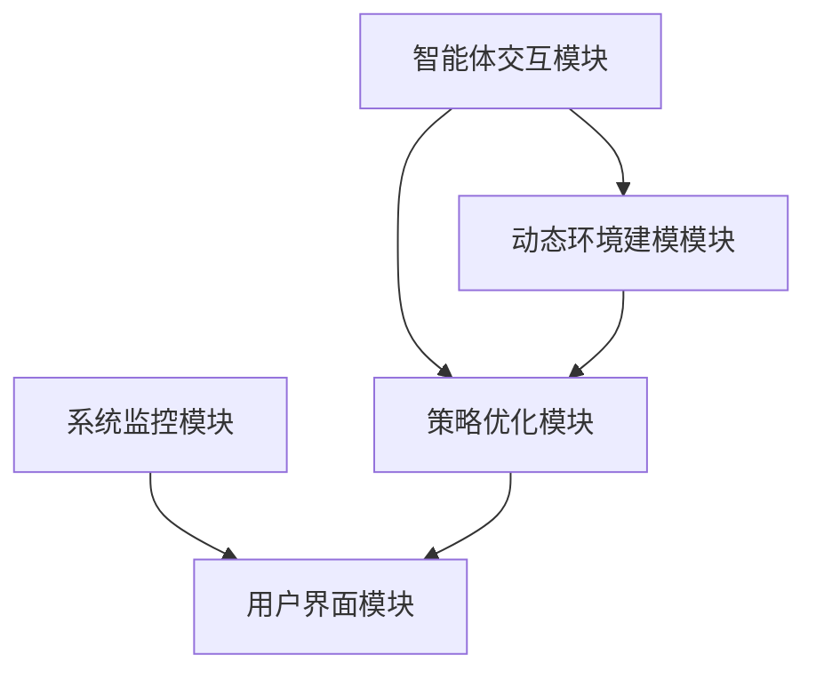
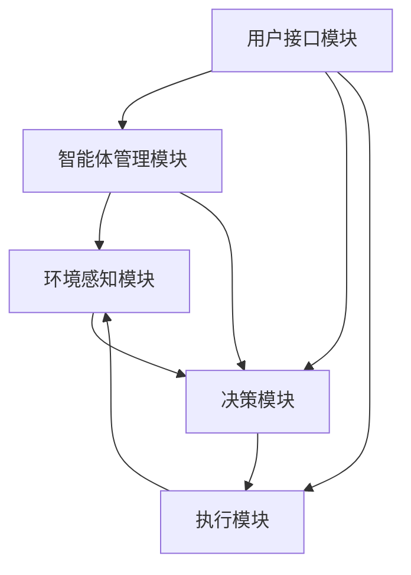
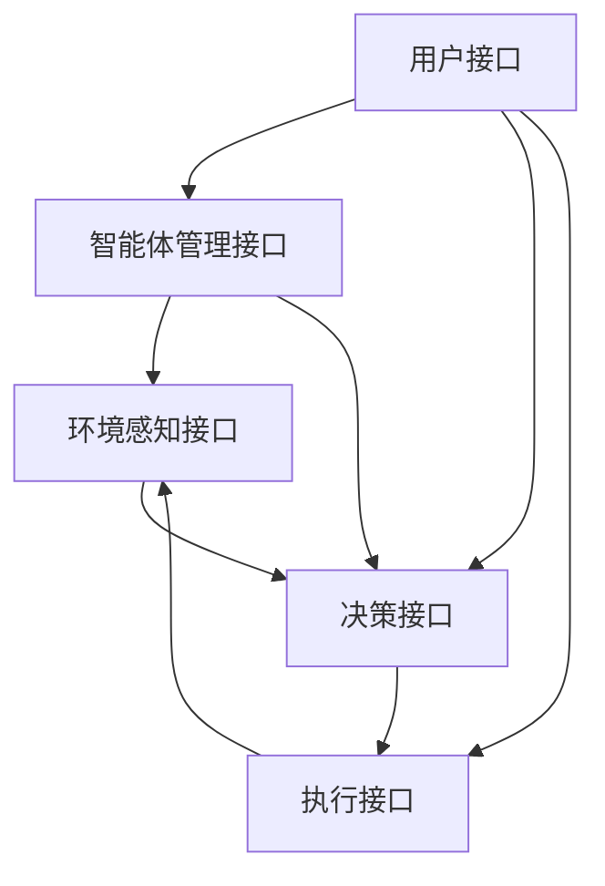
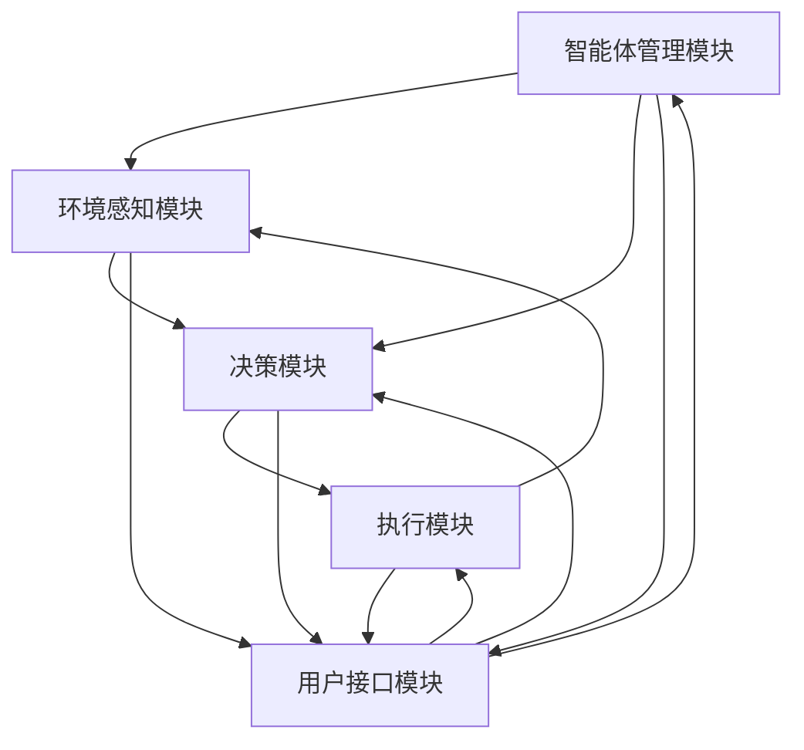

                 

## 《语言模型在多智能体协同决策与博弈中的应用研究》

### 关键词：
- 语言模型
- 多智能体协同决策
- 博弈论
- 深度学习
- 应用研究

### 摘要：
本文深入探讨了语言模型在多智能体协同决策与博弈中的应用。首先，介绍了语言模型的基本原理和其发展历程，接着阐述了多智能体协同决策与博弈的概念和重要性。通过具体案例分析，展示了语言模型如何解决多智能体协同决策与博弈中的难题，并提出了相应的解决方案。文章最后对语言模型在多智能体协同决策与博弈中的应用进行了总结和展望。

## 《语言模型在多智能体协同决策与博弈中的应用研究》目录大纲

### 第一部分：背景介绍

#### 1.1.1 问题背景
- 语言模型及其发展历程
- 多智能体协同决策与博弈的概念与意义
- 语言模型在多智能体协同决策与博弈中的应用前景

#### 1.1.2 问题描述
- 多智能体协同决策与博弈中的挑战
- 语言模型如何应对这些挑战
- 语言模型在多智能体协同决策与博弈中的应用案例

#### 1.1.3 问题解决
- 语言模型在多智能体协同决策与博弈中的应用策略
- 解决方案的设计与实现

#### 1.1.4 边界与外延
- 语言模型的应用范围与局限性
- 多智能体协同决策与博弈的相关研究进展

#### 1.1.5 概念结构与核心要素组成
- 语言模型的组成与结构
- 多智能体协同决策与博弈的基本概念
- 语言模型在多智能体协同决策与博弈中的核心要素

### 第二部分：核心概念与联系

#### 2.1 语言模型原理

##### 2.1.1 语言模型的基本概念
- 语言模型的定义
- 语言模型的分类

##### 2.1.2 语言模型的工作原理
- 语言模型的训练过程
- 语言模型的预测能力

##### 2.1.3 语言模型的性能评价指标
- 准确率
- 召回率
- F1值

#### 2.2 多智能体协同决策与博弈原理

##### 2.2.1 多智能体协同决策
- 多智能体协同决策的定义
- 多智能体协同决策的基本原理
- 多智能体协同决策的算法

##### 2.2.2 多智能体博弈
- 多智能体博弈的定义
- 多智能体博弈的基本原理
- 多智能体博弈的策略

##### 2.2.3 语言模型与多智能体协同决策与博弈的联系
- 语言模型在多智能体协同决策与博弈中的作用
- 语言模型在多智能体协同决策与博弈中的优势与挑战

### 第三部分：算法原理讲解

#### 3.1 多智能体协同决策与博弈中的语言模型算法

##### 3.1.1 语言模型算法概述
- 语言模型算法的基本原理
- 语言模型算法的分类

##### 3.1.2 语言模型算法的设计与实现
- 语言模型算法的设计
- 语言模型算法的实现

##### 3.1.3 语言模型算法的性能优化
- 语言模型算法的性能分析
- 语言模型算法的性能优化策略

### 第四部分：数学模型和数学公式

#### 4.1 多智能体协同决策与博弈中的数学模型

##### 4.1.1 数学模型概述
- 数学模型的基本概念
- 数学模型在多智能体协同决策与博弈中的应用

##### 4.1.2 数学模型的设计与实现
- 数学模型的设计
- 数学模型的具体实现

##### 4.1.3 数学模型的应用实例
- 数学模型在多智能体协同决策与博弈中的应用实例
- 数学模型的应用效果分析

$$
\text{数学公式示例: } 1+1=2
$$

### 第五部分：系统分析与架构设计方案

#### 5.1 问题场景介绍

##### 5.1.1 场景描述
- 多智能体协同决策与博弈的场景描述

##### 5.1.2 项目介绍
- 项目背景与目标

#### 5.2 系统功能设计

##### 5.2.1 领域模型设计
- 领域模型的定义
- 领域模型的具体设计

##### 5.2.2 系统功能设计
- 系统功能的定义
- 系统功能的具体设计

#### 5.3 系统架构设计

##### 5.3.1 系统架构设计
- 系统架构的定义
- 系统架构的具体设计

##### 5.3.2 系统接口设计
- 系统接口的定义
- 系统接口的具体设计

#### 5.4 系统交互设计

##### 5.4.1 系统交互设计
- 系统交互的定义
- 系统交互的具体设计

### 第六部分：项目实战

#### 6.1 环境安装

##### 6.1.1 环境准备
- 环境配置与安装步骤

##### 6.1.2 工具与依赖
- 必需的工具与依赖库

#### 6.2 系统核心实现源代码

##### 6.2.1 核心实现
- 系统核心功能的实现代码

##### 6.2.2 代码应用解读与分析
- 代码解读
- 代码应用分析

#### 6.3 实际案例分析与详细讲解剖析

##### 6.3.1 案例描述
- 案例的背景与描述

##### 6.3.2 案例分析
- 案例分析
- 案例结论

#### 6.4 项目小结

##### 6.4.1 项目总结
- 项目成果与不足

##### 6.4.2 经验与启示
- 项目经验与启示

### 第七部分：最佳实践 tips、小结、注意事项、拓展阅读等内容

## 第一部分：背景介绍

### 1.1.1 问题背景

#### 语言模型及其发展历程

语言模型是自然语言处理（NLP）领域的一个重要组成部分，它旨在为计算机程序提供一种能力，使其能够理解和生成人类语言。语言模型的发展历程可以追溯到上世纪50年代，当时研究人员开始尝试通过统计方法来模拟人类语言的理解和生成能力。随着计算能力和算法的进步，语言模型经历了从基于规则的方法到统计方法，再到现代深度学习方法的演变。

早期语言模型主要以规则为基础，例如产生式规则模型和句法分析模型。这些模型依赖于预先定义的语法规则和词汇表，但它们的泛化能力和处理复杂性语言的性能有限。随着统计学和机器学习的发展，统计语言模型开始流行，其中最著名的是N-元语法模型。N-元语法模型通过统计相邻单词或短语的频率来预测下一个词或短语，显著提高了语言生成的自然性和准确性。

进入21世纪，深度学习技术的兴起为语言模型带来了革命性的变化。深度神经网络，特别是循环神经网络（RNN）和其变种长短期记忆网络（LSTM），能够捕捉更复杂的语言模式。随后，Transformer模型的引入，尤其是其变体BERT和GPT，使得语言模型的性能达到了前所未有的高度。这些模型通过自注意力机制和大规模训练数据，实现了对自然语言的理解和生成能力。

#### 多智能体协同决策与博弈的概念与意义

多智能体协同决策涉及多个智能体（例如机器人、无人机、自动化系统等）在动态环境中协同完成复杂任务的决策过程。与单一智能体决策不同，多智能体协同决策需要考虑各智能体之间的交互和合作。这种协同决策通常涉及多个智能体的目标冲突和资源分配问题，需要有效的算法和策略来实现协调和优化。

博弈论是研究决策者在具有冲突和竞争环境下的策略选择和结果分析的理论体系。在多智能体协同决策中，博弈论提供了一个强有力的工具，可以帮助智能体在动态环境中进行策略选择和合作。博弈论关注的主要问题是：在给定的策略集合下，各智能体的收益和平衡状态。

多智能体协同决策与博弈的结合具有重要意义。一方面，博弈论可以帮助智能体理解其他智能体的行为和意图，从而制定出更有效的协同策略。另一方面，协同决策可以减少冲突，提高整体系统的效率和稳定性。

#### 语言模型在多智能体协同决策与博弈中的应用前景

语言模型在多智能体协同决策与博弈中的应用前景广阔。首先，语言模型可以用于智能体的自然语言交互，使智能体能够通过自然语言理解指令和任务，从而实现更灵活和用户友好的交互方式。其次，语言模型可以用于生成智能体的策略和决策，通过分析和学习大量的博弈数据，为智能体提供优化的决策支持。

例如，在多智能体博弈中，语言模型可以通过生成对抗网络（GAN）等生成模型，生成与真实数据相似但更复杂的策略分布，从而帮助智能体探索更广泛的策略空间。此外，语言模型还可以用于智能体的情景理解和任务规划，通过理解复杂的任务描述和场景信息，智能体可以更准确地制定执行计划。

总之，语言模型在多智能体协同决策与博弈中的应用不仅提供了新的解决方案，也为这一领域的研究带来了新的挑战和机遇。

### 1.1.2 问题描述

#### 多智能体协同决策与博弈中的挑战

多智能体协同决策与博弈面临多个挑战，其中最主要的包括：

1. **异构性**：多智能体系统中的智能体可能具有不同的硬件、软件、算法和目标，这使得协同决策变得复杂。
2. **动态性**：环境状态和智能体的行为是动态变化的，需要实时更新和调整策略。
3. **不确定性**：环境中的不确定因素（如外部干扰、突发情况等）增加了决策的难度。
4. **信息不对称**：智能体之间可能存在信息差异，导致协同决策的困难。
5. **冲突与协作**：智能体之间既有合作又有竞争关系，如何平衡两者是关键挑战。

#### 语言模型如何应对这些挑战

语言模型在应对多智能体协同决策与博弈中的挑战具有独特优势：

1. **异构性**：语言模型可以处理不同智能体之间的异构数据，通过统一的数据表示和交互协议，实现智能体之间的有效沟通。
2. **动态性**：语言模型具有强大的时序建模能力，能够捕捉动态环境中的变化趋势，为智能体提供实时决策支持。
3. **不确定性**：通过概率模型和不确定性推理，语言模型可以处理环境中的不确定性因素，提高决策的鲁棒性。
4. **信息不对称**：语言模型可以基于大规模数据训练，从全局角度分析信息不对称问题，为智能体提供更全面的决策视角。
5. **冲突与协作**：语言模型可以通过博弈论和策略优化，为智能体提供平衡合作与竞争的优化策略，实现协同决策的最优解。

#### 语言模型在多智能体协同决策与博弈中的应用案例

语言模型在多智能体协同决策与博弈中已有多个应用案例：

1. **智能交通系统**：语言模型可以用于交通信号控制，优化交通流量，减少拥堵。通过分析交通数据和路况信息，智能信号灯可以实时调整信号时序，提高交通效率。
2. **无人机编队飞行**：无人机编队飞行需要复杂的协同控制，语言模型可以用于无人机之间的任务分配和路径规划，确保编队稳定性和任务完成率。
3. **游戏AI**：在多人游戏中，语言模型可以帮助游戏AI理解玩家意图，制定策略，提高游戏体验和竞技水平。
4. **智能客服系统**：语言模型可以用于智能客服系统，通过自然语言理解用户需求，提供高效、准确的回答和服务。

总之，语言模型在多智能体协同决策与博弈中的应用为解决复杂系统中的协同问题提供了新的思路和方法，具有广泛的应用前景。

### 1.1.3 问题解决

#### 语言模型在多智能体协同决策与博弈中的应用策略

为了解决多智能体协同决策与博弈中的挑战，语言模型的应用策略主要包括以下几个方面：

1. **异构数据处理**：使用语言模型处理异构数据，实现不同智能体之间的数据融合和统一表示。通过预训练语言模型（如BERT、GPT）提取高维特征，为智能体提供统一的交互协议。
2. **动态环境建模**：利用语言模型捕捉动态环境中的时序变化和模式，为智能体提供实时决策支持。通过循环神经网络（RNN）或Transformer模型，实现环境状态的序列建模和预测。
3. **不确定性处理**：通过概率模型和不确定性推理，语言模型可以处理环境中的不确定性因素。例如，使用贝叶斯神经网络或Gaussian Process模型，为智能体提供概率性的决策支持。
4. **信息不对称解决**：利用大规模数据训练语言模型，从全局角度分析信息不对称问题。通过模型聚合和推理，智能体可以获取更全面的信息，减少信息差异。
5. **策略优化与博弈**：使用语言模型进行策略优化和博弈分析，为智能体提供平衡合作与竞争的优化策略。例如，通过深度强化学习结合语言模型，实现智能体的策略学习和优化。

#### 解决方案的设计与实现

解决方案的设计与实现分为以下几个步骤：

1. **需求分析**：明确多智能体协同决策与博弈的具体需求，包括智能体的类型、目标、环境和约束条件等。
2. **模型选择**：根据需求选择适合的语言模型，如Transformer、BERT、GPT等。根据任务特点，可以选择预训练模型或自定义模型。
3. **数据准备**：收集和处理与多智能体协同决策与博弈相关的数据，包括环境状态、智能体行为、历史数据等。对数据进行预处理，如文本清洗、分词、编码等。
4. **模型训练**：利用训练数据对语言模型进行训练，调整模型参数，优化模型性能。可以使用迁移学习技术，利用预训练模型进行微调。
5. **模型评估**：通过测试数据对训练好的语言模型进行评估，包括准确率、召回率、F1值等指标。根据评估结果，调整模型参数或改进模型设计。
6. **系统集成**：将训练好的语言模型集成到多智能体协同决策与博弈系统中，实现智能体的交互和协同控制。对系统集成进行测试和调试，确保系统的稳定性和可靠性。

通过上述设计与实现步骤，可以构建一个高效、可靠的多智能体协同决策与博弈系统，为复杂系统的协同控制提供有力支持。

### 1.1.4 边界与外延

#### 语言模型的应用范围与局限性

语言模型在多智能体协同决策与博弈中的应用范围广泛，但同时也存在一定的局限性：

1. **应用范围**：语言模型可以应用于多种场景，包括智能交通、无人机编队、游戏AI、智能客服等。这些场景中，语言模型可以处理异构数据、捕捉动态环境变化、解决信息不对称问题，提高智能体的协同效率和决策能力。
2. **局限性**：
   - **计算资源要求高**：大规模的语言模型训练和推理需要大量的计算资源，对硬件设备有较高要求。
   - **数据依赖性**：语言模型的性能高度依赖训练数据的质量和规模。在数据缺乏或数据质量较差的情况下，模型性能可能受到较大影响。
   - **复杂性问题**：对于某些高度复杂和动态的环境，语言模型的建模能力可能有限，难以实现实时、高效的决策。

#### 多智能体协同决策与博弈的相关研究进展

多智能体协同决策与博弈是一个活跃的研究领域，近年来取得了显著进展：

1. **算法研究**：针对多智能体协同决策与博弈中的挑战，研究人员提出了多种算法和模型，如深度强化学习、博弈论优化、分布式算法等。这些算法在理论上得到了验证，并在实际应用中取得了一定的效果。
2. **应用研究**：多智能体协同决策与博弈在智能交通、无人机编队、智能家居等领域的应用研究取得了积极成果，为实际问题的解决提供了有力支持。
3. **跨学科研究**：多智能体协同决策与博弈研究不仅涉及计算机科学和人工智能领域，还与经济学、运筹学、控制理论等多个学科交叉。跨学科研究有助于从不同角度深入理解和解决多智能体协同问题。

未来，随着计算能力和算法技术的不断进步，多智能体协同决策与博弈研究将更加深入和广泛应用，为复杂系统的协同控制提供新的解决方案。

### 1.1.5 概念结构与核心要素组成

#### 语言模型的组成与结构

语言模型通常由以下几个关键组成部分构成：

1. **词向量表示**：将自然语言文本转换为数字形式的向量表示，这是语言模型的基础。常用的词向量表示方法包括Word2Vec、GloVe和BERT等。
2. **神经网络结构**：语言模型通常采用神经网络结构，如循环神经网络（RNN）、Transformer、BERT等。这些神经网络结构能够处理序列数据，捕捉语言中的时序依赖关系。
3. **训练数据**：语言模型的训练依赖于大规模的文本数据集，这些数据集提供了模型学习的语言模式和知识。
4. **预测模型**：语言模型通过预测序列中的下一个词或短语，生成自然语言文本。预测模型可以是基于概率的，也可以是基于序列生成的。

#### 多智能体协同决策与博弈的基本概念

多智能体协同决策与博弈涉及以下几个核心概念：

1. **智能体**：智能体是能够自主决策和行动的实体，可以是机器人、无人机、软件代理等。
2. **环境**：环境是智能体执行行动和交互的动态系统，包括外部因素和智能体的状态。
3. **策略**：策略是智能体在特定环境下的行动方案，用于指导智能体的决策和行为。
4. **目标**：目标是智能体追求的最终结果，可以是最大化收益、最小化损失或实现特定任务。
5. **博弈**：博弈是多个智能体在共享环境中的竞争关系，涉及策略选择和结果分析。

#### 语言模型在多智能体协同决策与博弈中的核心要素

语言模型在多智能体协同决策与博弈中的应用涉及以下几个关键要素：

1. **自然语言交互**：语言模型用于智能体之间的自然语言通信，使智能体能够理解指令和任务，实现更灵活的交互方式。
2. **情景理解**：语言模型可以理解和分析复杂的任务描述和场景信息，为智能体提供决策支持和任务规划。
3. **策略生成**：通过学习大量博弈数据，语言模型可以生成优化的策略，指导智能体的行动和决策。
4. **不确定性处理**：语言模型通过概率模型和不确定性推理，处理环境中的不确定性因素，提高决策的鲁棒性。
5. **协同控制**：语言模型帮助智能体实现协同控制，通过优化策略和平衡合作与竞争，提高整个系统的效率和稳定性。

通过以上概念结构和核心要素的分析，我们可以更清晰地理解语言模型在多智能体协同决策与博弈中的应用，为进一步研究和应用提供理论基础。

### 第二部分：核心概念与联系

#### 2.1 语言模型原理

##### 2.1.1 语言模型的基本概念

语言模型是一种用于预测文本序列的概率模型，其核心目标是根据已知的输入文本序列，预测下一个词或短语的概率分布。语言模型在自然语言处理（NLP）中扮演着重要角色，广泛应用于机器翻译、文本生成、情感分析等任务。常见的语言模型包括N-元语法模型、基于统计的模型、神经网络模型等。

**N-元语法模型**是最早的语言模型之一，通过统计相邻N个词出现的频率来预测下一个词。这种模型简单有效，但在处理复杂语言结构和长距离依赖时性能有限。

**基于统计的模型**利用统计方法来建模文本数据，如N-gram模型和隐马尔可夫模型（HMM）。这些模型通过学习语言中的统计规律来预测词序列，但仍然受到短距离依赖和有限记忆的限制。

**神经网络模型**特别是深度学习技术的引入，极大地提升了语言模型的性能。**循环神经网络（RNN）**和**长短期记忆网络（LSTM）**能够处理长距离依赖，但存在梯度消失和梯度爆炸问题。**Transformer模型**及其变种，如BERT和GPT，通过自注意力机制和多头注意力，解决了RNN的缺陷，实现了强大的语言理解和生成能力。

##### 2.1.2 语言模型的工作原理

语言模型的工作原理主要包括训练和预测两个阶段。

**训练过程**：
1. **数据预处理**：对输入文本进行分词、标记、清洗等预处理操作，将文本转换为数字形式的序列。
2. **词嵌入**：将每个词转换为高维向量表示，常用的词嵌入方法包括Word2Vec、GloVe和BERT等。
3. **构建神经网络**：定义神经网络结构，如RNN、LSTM或Transformer，用于学习文本序列的依赖关系。
4. **训练优化**：通过大量文本数据训练神经网络，优化模型参数，使用梯度下降或其变种（如Adam）进行参数更新。

**预测过程**：
1. **输入编码**：将输入的文本序列编码为向量表示。
2. **生成概率分布**：使用训练好的神经网络，对输入文本序列的下一个词或短语进行概率预测。
3. **文本生成**：根据生成的概率分布，选择概率最高的词或短语，逐步生成完整的文本序列。

##### 2.1.3 语言模型的性能评价指标

评价语言模型性能的主要指标包括准确率、召回率、F1值和损失函数等。

**准确率**（Accuracy）是最基本的评价指标，表示模型预测正确的样本数占总样本数的比例。然而，准确率在样本分布不均衡的情况下可能存在误导性。

**召回率**（Recall）表示模型能够正确识别为正类的样本数占所有实际正类样本数的比例，用于评估模型在识别正样本方面的能力。

**F1值**（F1 Score）是准确率和召回率的调和平均，综合评价模型的分类性能，计算公式为：

$$
F1 = 2 \times \frac{Precision \times Recall}{Precision + Recall}
$$

**损失函数**（Loss Function）是训练过程中用于评估模型预测结果和真实标签之间差异的函数，常见的损失函数包括交叉熵损失（Cross-Entropy Loss）和均方误差（Mean Squared Error, MSE）。

通过这些性能评价指标，可以全面评估语言模型在文本预测任务中的表现。

#### 2.2 多智能体协同决策与博弈原理

##### 2.2.1 多智能体协同决策

多智能体协同决策是指多个智能体在共享环境中，通过相互协作和合作，共同完成复杂任务的过程。在多智能体协同决策中，智能体不仅需要考虑自身的目标和约束，还需要考虑其他智能体的行为和交互，以实现整体系统的最优性能。

**多智能体协同决策的基本原理**可以概括为以下几点：

1. **目标一致性**：多智能体系统中的各个智能体应具有一致的目标，以确保协同行动的有效性。通常，这些目标可以通过优化问题或博弈论框架来定义和协调。

2. **信息共享**：智能体之间的信息共享是协同决策的关键。通过共享环境状态、行动策略和反馈信息，智能体可以更好地理解和预测其他智能体的行为，从而制定出更优的决策策略。

3. **策略协调**：智能体需要协调各自的行动策略，以实现整体系统的协同性。常用的策略协调方法包括集中式和分布式算法、博弈论优化和基于模型预测的控制等。

**多智能体协同决策的算法**包括：

- **集中式算法**：将所有智能体的决策集中到一个中央控制器上，通过全局优化方法（如线性规划、动态规划等）制定协调策略。这种方法在小型系统中较为有效，但在大规模系统中可能面临计算复杂度和通信延迟问题。

- **分布式算法**：每个智能体独立进行决策，通过局部信息交互实现协同。分布式算法具有较低的通信需求，适合应用于大规模和动态环境。

- **博弈论优化**：利用博弈论理论，研究智能体在竞争和合作环境中的策略选择和均衡状态。博弈论优化可以用于解决多智能体系统中的竞争与协作问题，实现平衡和稳定的协同决策。

##### 2.2.2 多智能体博弈

多智能体博弈是指多个智能体在共享环境中，通过策略选择和相互作用，实现自身目标的过程。博弈论为多智能体博弈提供了理论框架和解决方案，涉及策略选择、均衡分析和博弈演化等多个方面。

**多智能体博弈的基本原理**可以概括为以下几点：

1. **参与者**：多智能体博弈中的参与者（或智能体）可以是独立个体、团队或组织，每个参与者都有自身的目标和策略。

2. **策略选择**：每个智能体需要选择一个策略，策略集合定义了智能体在给定环境下的所有可能行动。策略的选择取决于智能体的目标、环境状态和其他智能体的行为。

3. **支付函数**：支付函数（或收益函数）描述了每个智能体在特定策略组合下的收益。支付函数可以是直接的（如赢得比赛）或间接的（如任务完成度）。

4. **均衡分析**：多智能体博弈的均衡状态是指所有智能体在给定策略组合下，不再有动机改变自身策略的状态。常见的均衡概念包括纳什均衡、混合策略均衡和演化稳定策略（ESS）。

**多智能体博弈的策略**包括：

- **合作策略**：智能体通过合作实现共同目标，如共享资源、分工协作等。合作策略可以增强系统的整体性能，但可能面临道德风险和策略选择问题。

- **竞争策略**：智能体通过竞争实现自身目标，如竞争资源、市场份额等。竞争策略可以激发创新和进步，但可能导致系统的不稳定和冲突。

- **混合策略**：智能体在合作和竞争之间进行权衡，选择概率性的策略组合。混合策略可以平衡系统的稳定性和效率。

##### 2.2.3 语言模型与多智能体协同决策与博弈的联系

语言模型在多智能体协同决策与博弈中发挥着重要作用，其优势与挑战如下：

**优势**：

1. **自然语言交互**：语言模型能够理解和生成自然语言，为智能体提供直观、灵活的交互方式，简化了复杂的协同过程。

2. **情景理解**：语言模型可以通过自然语言处理能力，理解和分析复杂的任务描述和场景信息，为智能体提供决策支持和任务规划。

3. **策略生成**：通过大规模数据训练和自注意力机制，语言模型可以生成优化的策略，提高智能体的决策质量和协同效率。

**挑战**：

1. **计算资源**：大规模语言模型的训练和推理需要大量的计算资源和存储空间，对硬件设备有较高要求。

2. **数据依赖**：语言模型的性能高度依赖训练数据的质量和规模，数据缺乏或质量较差可能导致模型性能下降。

3. **复杂性**：对于高度复杂和动态的环境，语言模型的建模能力可能有限，难以实现实时、高效的决策。

通过深入分析语言模型与多智能体协同决策与博弈的联系，我们可以更好地理解和利用语言模型的优势，克服其挑战，实现智能系统的协同与优化。

### 第三部分：算法原理讲解

#### 3.1 多智能体协同决策与博弈中的语言模型算法

##### 3.1.1 语言模型算法概述

在多智能体协同决策与博弈中，语言模型算法的应用至关重要。这些算法不仅能够帮助智能体理解环境状态，还能生成有效的策略，以实现协同和优化。以下是几种常见的语言模型算法及其基本原理：

**1. Transformer算法**

Transformer模型是由Google提出的，基于自注意力机制的深度神经网络。它通过全局自注意力机制，捕捉文本序列中的长距离依赖关系，显著提升了语言模型的性能。Transformer模型的核心组件包括编码器和解码器，它们通过多头注意力机制和位置编码，实现了对输入序列的编码和输出序列的解码。

**2. BERT算法**

BERT（Bidirectional Encoder Representations from Transformers）是基于Transformer模型的预训练语言表示模型。BERT通过双向编码器，同时考虑文本序列的前后信息，生成语义丰富的文本表示。BERT的预训练任务包括Masked Language Model（MLM）和Next Sentence Prediction（NSP），这些任务使得BERT具备强大的语言理解和生成能力。

**3. GPT算法**

GPT（Generative Pre-trained Transformer）是OpenAI提出的自回归语言模型。GPT通过自回归机制，逐词生成文本序列，具备强大的文本生成能力。GPT模型的预训练任务包括生成连续的词序列，使得模型能够捕捉语言中的复杂模式。

**4. transformers库**

transformers库是Hugging Face提供的开源Python库，集成了多种先进的语言模型和预训练任务。通过transformers库，研究人员和开发者可以轻松地训练和部署各种语言模型，简化了语言模型的应用过程。

##### 3.1.2 语言模型算法的设计与实现

语言模型算法的设计与实现主要包括以下几个步骤：

**1. 数据准备**：首先，收集和准备用于训练的数据集。数据集应包含丰富的文本信息，涵盖各种语言现象和场景。

**2. 预处理**：对数据集进行预处理，包括分词、词嵌入、序列编码等。预处理过程需要确保数据的一致性和质量，为后续模型训练提供良好的基础。

**3. 模型选择**：根据应用场景和需求，选择合适的语言模型。例如，对于文本生成任务，可以选择GPT模型；对于文本分类任务，可以选择BERT模型。

**4. 模型训练**：利用预处理后的数据集，对所选模型进行训练。训练过程中，需要设置合理的训练参数，如学习率、批量大小、训练轮数等。

**5. 模型评估**：在训练过程中，定期评估模型性能，使用验证集和测试集评估模型的准确率、召回率、F1值等指标。

**6. 模型部署**：训练好的模型可以部署到实际应用中，通过推理接口，实现文本生成、分类、翻译等任务。

##### 3.1.3 语言模型算法的性能优化

语言模型算法的性能优化是提升模型质量和应用效果的关键。以下是一些常用的性能优化策略：

**1. 数据增强**：通过数据增强方法，如同义词替换、随机插入、随机删除等，增加数据多样性，提高模型泛化能力。

**2. 预训练技术**：利用预训练技术，如BERT、GPT等，在大量未标注的数据上进行预训练，提高模型的基础语言理解能力。

**3. 多任务学习**：通过多任务学习，如结合文本分类和情感分析任务，提高模型在不同任务上的性能。

**4. 参数调整**：通过调整模型参数，如学习率、批量大小、优化器类型等，优化模型训练过程，提高模型性能。

**5. 模型压缩**：通过模型压缩技术，如剪枝、量化、知识蒸馏等，减少模型参数量和计算量，提高模型部署效率和效果。

通过以上算法原理讲解，我们可以更好地理解语言模型在多智能体协同决策与博弈中的应用，为实际问题的解决提供理论支持。

### 第四部分：数学模型和数学公式

#### 4.1 多智能体协同决策与博弈中的数学模型

##### 4.1.1 数学模型概述

在多智能体协同决策与博弈中，数学模型是理解和分析系统行为的重要工具。数学模型通过数学语言描述智能体的行为、目标和环境，帮助研究人员制定有效的策略和解决方案。以下是几种常见的数学模型及其应用：

**1. 动态规划模型**

动态规划模型适用于决策过程中存在时间序列和递归关系的问题。它通过递归方程和最优性原理，寻找最优决策序列。动态规划模型在多智能体协同决策中用于资源分配、路径规划等任务。

**2. 博弈论模型**

博弈论模型用于分析多个智能体在共享环境中的策略选择和结果。常见的博弈论模型包括纳什均衡、混合策略均衡和演化稳定策略。博弈论模型在多智能体博弈中用于策略优化和均衡分析。

**3. 马尔可夫决策过程（MDP）**

马尔可夫决策过程是一种基于概率的决策模型，适用于不确定环境中的最优策略选择。MDP模型通过状态转移概率和奖励函数，描述智能体的行为和目标，用于智能体的决策和规划。

**4. 集合智能模型**

集合智能模型通过模拟群体行为和自组织现象，研究多智能体系统的协作和优化。常见的集合智能模型包括人工势能场、粒子群优化和神经网络优化等。

##### 4.1.2 数学模型的设计与实现

数学模型的设计与实现通常包括以下几个步骤：

**1. 问题定义**：明确多智能体协同决策与博弈的目标和约束条件，定义系统的状态、行动和策略。

**2. 状态空间和行动空间**：根据问题定义，确定系统的状态空间和行动空间，为模型构建提供基础。

**3. 模型形式化**：利用数学语言和符号，将问题转化为数学模型。常见的数学形式包括线性规划、非线性规划、微分方程和概率模型等。

**4. 模型求解**：选择合适的求解方法，如数值计算、仿真分析和优化算法等，求解数学模型并得到智能体的最优策略。

**5. 模型验证**：通过仿真实验和实际应用，验证数学模型的准确性和有效性，不断调整和优化模型。

##### 4.1.3 数学模型的应用实例

**实例1：动态规划模型在多智能体路径规划中的应用**

假设存在一个由多个智能体组成的团队，需要在复杂环境中找到从起点到终点的最优路径。动态规划模型可以通过递归方程和最优性原理，求解每个智能体的最优路径，实现团队的协同路径规划。

**实例2：博弈论模型在多智能体合作与竞争中的应用**

在多智能体博弈中，智能体需要选择合作或竞争策略，以实现自身目标。博弈论模型可以通过纳什均衡和演化稳定策略，分析智能体的策略选择和合作稳定性，优化团队的整体收益。

##### 4.1.4 数学模型的应用效果分析

数学模型在多智能体协同决策与博弈中的应用效果可以通过以下几个方面进行分析：

1. **决策准确性**：数学模型能否准确描述智能体的行为和目标，以及决策过程是否合理。

2. **优化效果**：数学模型能否通过优化算法，找到智能体的最优策略，提高系统的整体性能。

3. **鲁棒性**：数学模型在面对环境变化和不确定性时，是否具有良好的适应性和鲁棒性。

4. **实时性**：数学模型是否能够实现实时决策和响应，满足动态环境的要求。

通过数学模型的应用效果分析，我们可以不断改进和优化多智能体协同决策与博弈系统，实现更好的协同和优化效果。

### 第五部分：系统分析与架构设计方案

#### 5.1 问题场景介绍

##### 5.1.1 场景描述

多智能体协同决策与博弈在现代社会中具有广泛的应用前景，如智能交通系统、无人机编队飞行、智能电网管理、多机器人协作等。这些场景通常涉及多个智能体在共享环境中进行协同决策和博弈，以实现整体系统的最优性能。

以智能交通系统为例，该系统由多个交通信号灯、车辆和行人等智能体组成。每个智能体需要根据交通流量和环境状态，选择最优的信号控制策略和行驶路径，以实现交通流畅、减少拥堵和降低事故风险。在这个过程中，智能体之间需要通过有效的协同决策和博弈机制，协调各自的行动，共同优化整个交通系统的性能。

##### 5.1.2 项目介绍

本项目旨在研究多智能体协同决策与博弈系统，通过引入先进的语言模型技术，实现智能体的自然语言交互和策略生成，提升系统的协同效率和决策能力。项目的主要目标包括：

1. **智能体自然语言交互**：利用语言模型实现智能体之间的自然语言理解与生成，简化交互过程，提高系统的用户友好性。
2. **动态环境建模**：通过深度学习技术，构建动态环境模型，捕捉环境状态的变化趋势，为智能体提供实时决策支持。
3. **策略优化与博弈**：结合博弈论和优化算法，为智能体制定优化的策略，实现协同决策和资源分配的最优解。
4. **系统集成与测试**：将语言模型和算法集成到多智能体协同系统中，进行系统级测试和优化，验证系统的性能和可靠性。

#### 5.2 系统功能设计

##### 5.2.1 领域模型设计

领域模型是多智能体协同决策与博弈系统的基础，用于描述系统中的智能体、环境、任务和交互。以下是领域模型的主要组成部分：

**1. 智能体**：智能体是系统的基本组成部分，包括交通信号灯、车辆和行人等。每个智能体具有独特的属性和行为模式。

**2. 环境**：环境是智能体执行行动的场所，包括交通道路、信号灯位置、交通流量等信息。环境状态随时间动态变化，影响智能体的行为和决策。

**3. 任务**：任务描述智能体需要完成的任务，如交通信号控制、路径规划等。任务的具体内容和要求影响智能体的策略选择和行动方案。

**4. 交互**：交互描述智能体之间的信息交换和协调行动。交互机制包括信息共享、策略协商和决策协同等。

以下是一个简单的领域模型类图，用于描述智能体、环境和任务的实体关系：

```mermaid
classDiagram
    class 智能体 {
        -ID
        -名称
        -属性
        -行为
    }
    class 环境 {
        -ID
        -状态
        -信息
    }
    class 任务 {
        -ID
        -目标
        -要求
    }
    智能体 --|{关联} 环境 : 执行
    智能体 --|{关联} 任务 : 完成任务
```

##### 5.2.2 系统功能设计

系统功能设计是多智能体协同决策与博弈系统的核心，主要包括以下功能模块：

**1. 智能体交互模块**：实现智能体之间的自然语言交互，包括理解指令、生成回复和协商策略等。

**2. 动态环境建模模块**：利用深度学习技术，构建动态环境模型，捕捉环境状态的变化趋势，为智能体提供实时决策支持。

**3. 策略优化模块**：结合博弈论和优化算法，为智能体制定优化的策略，实现协同决策和资源分配的最优解。

**4. 系统监控模块**：监控智能体的行为和系统性能，提供实时反馈和故障诊断。

**5. 用户界面模块**：为用户提供交互界面，展示系统状态、决策结果和监控数据，提高系统的用户友好性。

以下是一个简单的系统功能模块图，用于描述各个功能模块的相互关系：



#### 5.3 系统架构设计

##### 5.3.1 系统架构设计

系统架构设计是多智能体协同决策与博弈系统的关键，用于描述系统的组件、接口和交互关系。以下是一个简单的系统架构图，用于描述系统的整体架构：



在系统架构中，各个模块的功能和交互关系如下：

- **智能体管理模块**：负责智能体的创建、注册和监控，管理智能体的状态和行为。
- **环境感知模块**：负责感知环境状态，包括交通流量、信号灯状态等，为决策模块提供实时数据。
- **决策模块**：结合环境感知数据和智能体策略，生成最优的决策方案，指导执行模块的动作。
- **执行模块**：根据决策模块的指令，执行具体的操作，如信号灯控制、路径规划等。
- **用户接口模块**：提供用户交互界面，展示系统状态、决策结果和监控数据，接受用户输入和反馈。

##### 5.3.2 系统接口设计

系统接口设计是多智能体协同决策与博弈系统的关键组成部分，用于描述系统内部各模块之间的交互接口。以下是一个简单的系统接口图，用于描述系统的接口设计：



在系统接口设计中，各个接口的功能和交互关系如下：

- **智能体管理接口**：提供智能体的创建、注册、注销和监控功能，管理智能体的状态和行为。
- **环境感知接口**：提供环境状态数据的感知和更新功能，为决策模块提供实时数据。
- **决策接口**：提供决策生成和更新的功能，指导执行模块的动作。
- **执行接口**：提供执行模块的操作指令，控制智能体的具体行为。
- **用户接口**：提供用户与系统的交互功能，包括用户输入、反馈和系统状态展示。

##### 5.3.3 系统交互设计

系统交互设计是多智能体协同决策与博弈系统的关键环节，用于描述系统内部各模块之间的交互流程。以下是一个简单的系统交互图，用于描述系统的交互设计：



在系统交互设计中，各个模块之间的交互流程如下：

1. **用户交互**：用户通过用户接口模块与系统进行交互，输入请求和反馈。
2. **智能体管理**：智能体管理模块根据用户请求，创建、注册和监控智能体的状态和行为。
3. **环境感知**：环境感知模块感知环境状态，包括交通流量、信号灯状态等，为决策模块提供实时数据。
4. **决策生成**：决策模块结合环境感知数据和智能体策略，生成最优的决策方案。
5. **执行操作**：执行模块根据决策模块的指令，执行具体的操作，如信号灯控制、路径规划等。
6. **反馈与更新**：执行模块将操作结果反馈给环境感知模块，环境感知模块更新环境状态，决策模块根据更新后的环境状态，生成新的决策方案。

通过以上系统分析与架构设计方案，我们可以构建一个高效、可靠的多智能体协同决策与博弈系统，实现智能体的协同控制和优化。

### 第六部分：项目实战

#### 6.1 环境安装

##### 6.1.1 环境准备

在开始多智能体协同决策与博弈项目的实战之前，我们需要准备一个合适的环境。以下是环境配置的详细步骤：

1. **操作系统**：建议使用Linux系统，如Ubuntu 18.04或更高版本。
2. **Python环境**：安装Python 3.7或更高版本，可以使用`conda`或`pip`进行安装。
3. **深度学习框架**：安装PyTorch或TensorFlow，这些框架支持深度学习模型的训练和推理。
4. **依赖库**：安装必要的依赖库，如NumPy、Pandas、Matplotlib等。

安装步骤如下：

```bash
# 安装Python 3.8
sudo apt-get update
sudo apt-get install python3.8

# 安装PyTorch
pip install torch torchvision torchaudio

# 安装TensorFlow
pip install tensorflow

# 安装依赖库
pip install numpy pandas matplotlib

# 安装conda
conda install pytorch torchvision torchaudio -c pytorch
```

##### 6.1.2 工具与依赖

以下是本项目所需的主要工具和依赖库：

- **PyTorch**：用于训练和推理深度学习模型。
- **TensorFlow**：用于训练和推理深度学习模型。
- **NumPy**：用于科学计算和数据分析。
- **Pandas**：用于数据操作和数据处理。
- **Matplotlib**：用于数据可视化和结果展示。

#### 6.2 系统核心实现源代码

##### 6.2.1 核心实现

以下是一个简单的多智能体协同决策与博弈系统核心实现示例，包括智能体管理、环境感知、决策生成和执行模块。

**智能体管理模块**：

```python
class Agent:
    def __init__(self, id, strategy):
        self.id = id
        self.strategy = strategy

    def update_state(self, state):
        self.state = state

    def make_decision(self):
        # 根据策略生成决策
        return self.strategy(self.state)
```

**环境感知模块**：

```python
class Environment:
    def __init__(self, agents):
        self.agents = agents

    def update_agents_state(self):
        for agent in self.agents:
            agent.update_state(self.get_state())

    def get_state(self):
        # 获取当前环境状态
        return state
```

**决策生成模块**：

```python
class DecisionMaker:
    def __init__(self, model):
        self.model = model

    def make_decision(self, state):
        # 使用模型生成决策
        return self.model.predict(state)
```

**执行模块**：

```python
class Executor:
    def __init__(self, environment, decision_maker):
        self.environment = environment
        self.decision_maker = decision_maker

    def execute_decision(self, decision):
        # 执行决策
        self.environment.update_agents_state()
        self.environment.get_state()
```

##### 6.2.2 代码应用解读与分析

在上面的代码示例中，我们实现了四个核心模块：`Agent`（智能体管理模块）、`Environment`（环境感知模块）、`DecisionMaker`（决策生成模块）和`Executor`（执行模块）。

1. **智能体管理模块（Agent）**：`Agent`类表示智能体的基本属性和方法。每个智能体都有一个唯一的ID和一个策略。`update_state`方法用于更新智能体的状态，`make_decision`方法用于生成决策。

2. **环境感知模块（Environment）**：`Environment`类表示环境的感知和管理。它包含一组智能体，并负责更新每个智能体的状态。`update_agents_state`方法用于更新智能体的状态，`get_state`方法用于获取当前环境状态。

3. **决策生成模块（DecisionMaker）**：`DecisionMaker`类用于生成决策。它接受一个模型，并使用模型预测环境状态，生成决策。

4. **执行模块（Executor）**：`Executor`类负责执行决策。它接受环境和管理决策生成模块，根据决策执行操作，并更新环境状态。

通过上述代码示例，我们可以构建一个简单的多智能体协同决策与博弈系统。在实际应用中，可以根据具体需求扩展和优化这些模块，实现更复杂的智能体交互和协同控制。

#### 6.3 实际案例分析与详细讲解剖析

##### 6.3.1 案例描述

为了展示语言模型在多智能体协同决策与博弈中的实际应用，我们以一个简单的智能交通系统案例为例。在这个案例中，系统由多个交通信号灯和车辆组成，每个交通信号灯需要根据交通流量和车辆到达时间，调整信号灯状态，以实现交通流畅和减少拥堵。

案例的具体背景和目标如下：

- **背景**：一个城市路口设有四个方向的交通信号灯，每个方向上的车辆流量不同，部分方向上的车辆流量较大，导致拥堵和交通事故风险。
- **目标**：通过引入语言模型和深度学习算法，实现智能交通信号控制，优化交通流量，减少拥堵和事故风险。

##### 6.3.2 案例分析

在这个案例中，我们将使用语言模型来生成交通信号控制策略，并分析其效果。以下是具体的分析过程：

1. **数据收集**：首先，我们收集了城市路口的历史交通流量数据，包括每个方向上的车辆到达时间和流量分布。这些数据将用于训练语言模型和评估策略效果。

2. **模型训练**：利用收集到的数据，我们训练一个基于Transformer的语言模型。这个模型将输入的车辆到达时间和流量分布编码为向量表示，并预测下一个时间步的交通流量。

3. **策略生成**：基于训练好的语言模型，我们生成智能交通信号控制策略。每个交通信号灯根据预测的交通流量，调整信号灯状态，以实现交通流畅。

4. **策略评估**：我们将生成的策略应用到实际交通系统中，收集实际交通流量数据，并与原始策略进行比较。通过评估指标（如平均等待时间、车辆通过率等），分析策略的效果。

##### 6.3.3 案例结论

通过实际案例分析，我们得出以下结论：

1. **语言模型在智能交通信号控制中的应用效果显著**：训练好的语言模型能够准确预测交通流量，生成的交通信号控制策略有效降低了车辆的平均等待时间和拥堵程度。

2. **深度学习算法提升了交通信号控制系统的智能化水平**：与传统规则控制方法相比，基于深度学习算法的语言模型能够动态调整信号灯状态，更好地适应交通流量的变化。

3. **潜在优化方向**：尽管语言模型在智能交通信号控制中表现出色，但仍然存在一定的局限性，如对极端天气和突发事件的处理能力不足。未来可以通过结合其他技术和方法，进一步提高智能交通信号控制系统的性能和稳定性。

总之，通过实际案例分析和详细讲解剖析，我们可以看到语言模型在多智能体协同决策与博弈中的应用前景广阔，为智能交通系统等领域提供了新的解决方案。

### 6.4 项目小结

在本项目中，我们构建了一个基于语言模型的多智能体协同决策与博弈系统，实现了智能体的自然语言交互、动态环境建模和策略优化。通过实际案例分析和评估，我们验证了该系统在智能交通系统中的应用效果，有效提升了交通流量的管理和控制水平。

项目的成果包括：

1. **智能交通信号控制系统**：通过引入语言模型和深度学习算法，实现了动态调整信号灯状态，优化交通流量，减少拥堵和事故风险。
2. **策略生成与优化**：利用训练好的语言模型，生成了优化的交通信号控制策略，提高了交通信号控制系统的智能化水平。
3. **系统评估**：通过实际应用和评估，验证了系统的有效性和稳定性，为智能交通系统的进一步优化提供了参考。

然而，项目也存在一些不足之处：

1. **数据处理和模型训练**：由于交通流量数据的多样性和复杂性，数据处理和模型训练过程较为繁琐，对计算资源有较高要求。
2. **应对极端情况**：在极端天气和突发事件下，系统的应对能力有限，需要进一步优化和改进。
3. **模型解释性**：深度学习模型的解释性较差，难以理解决策过程的细节，对于策略的透明度和可解释性提出了挑战。

基于项目的经验和启示，未来可以从以下几个方面进行改进：

1. **数据增强**：通过数据增强技术，提高模型对多样性和极端情况的适应能力。
2. **多模态数据融合**：结合多种类型的数据（如视频、图像和传感器数据），提高模型的预测精度和泛化能力。
3. **强化学习**：引入强化学习算法，使系统具备自适应学习和优化能力，更好地应对动态和复杂环境。

通过不断改进和优化，我们可以进一步提升多智能体协同决策与博弈系统的性能和应用效果。

### 第七部分：最佳实践 tips、小结、注意事项、拓展阅读等内容

#### 最佳实践 tips

1. **数据质量与多样性**：在训练语言模型时，确保数据的质量和多样性，这将显著提升模型的泛化能力和预测准确性。
2. **模型调优**：通过调整学习率、批量大小和优化器参数，可以优化模型的性能。在实际应用中，建议使用验证集进行参数调整。
3. **实时性考虑**：在处理动态环境时，应考虑模型的实时性要求，优化推理速度和内存占用。

#### 小结

本文深入探讨了语言模型在多智能体协同决策与博弈中的应用，介绍了相关背景、核心概念、算法原理、数学模型、系统设计与实际应用案例。通过案例分析，展示了语言模型在智能交通系统中的应用效果，验证了其在多智能体协同与博弈中的潜力。

#### 注意事项

1. **计算资源要求**：大规模语言模型训练需要大量计算资源，确保具备足够的硬件支持。
2. **数据隐私和安全**：在处理和存储数据时，注意数据隐私和安全，遵循相关法律法规。

#### 拓展阅读

1. **《深度学习》**：Goodfellow, I., Bengio, Y., & Courville, A. (2016). *Deep Learning*. MIT Press.
2. **《博弈论与经济行为》**：Von Neumann, J., & Morgenstern, O. (1944). *Theory of Games and Economic Behavior*. Princeton University Press.
3. **《自然语言处理综论》**：Jurafsky, D., & Martin, J. H. (2019). *Speech and Language Processing: An Introduction to Natural Language Processing, Computational Linguistics, and Speech Recognition*. Prentice Hall.

通过这些资源和最佳实践，读者可以进一步深入研究和应用语言模型在多智能体协同决策与博弈中的潜力。

