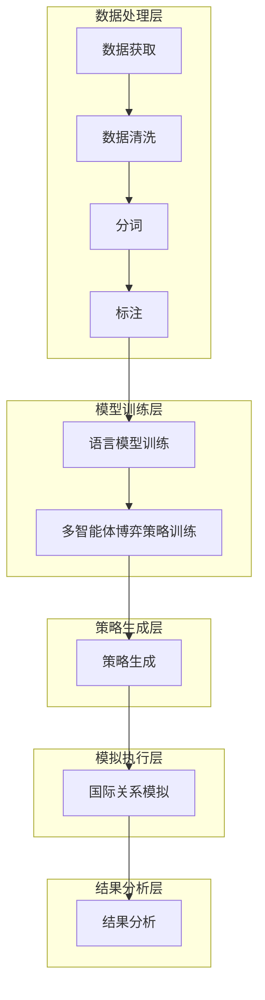
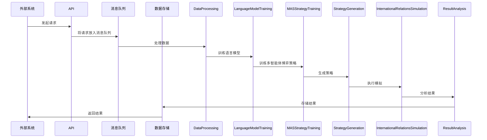
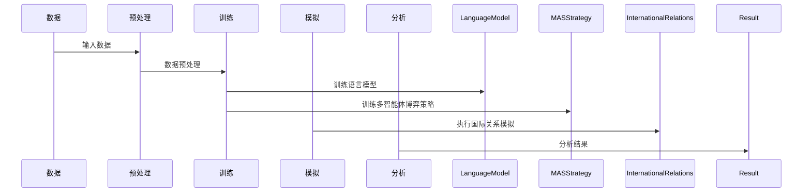

                 

### 1. 设计大纲框架

设计大纲框架是撰写高质量技术博客的第一步，也是确保文章结构清晰、逻辑严密的关键。以下是我们为《语言模型在多智能体博弈策略生成与国际关系模拟中的应用》设计的大纲框架：

#### 1. 背景介绍

- **1.1 问题背景**：介绍多智能体博弈和国际关系模拟的起源与发展，以及它们在现代社会中的重要性。
- **1.2 问题描述**：明确语言模型在多智能体博弈和国际关系模拟中的应用场景，阐述其面临的主要挑战。
- **1.3 问题解决**：探讨语言模型如何应对上述挑战，并提出解决方案。
- **1.4 边界与外延**：界定研究范围，明确本文探讨的语言模型、多智能体博弈策略和国际关系模拟的具体应用领域。
- **1.5 概念结构与核心要素组成**：详细介绍语言模型、多智能体博弈策略和国际关系模拟的基本概念和核心要素。

#### 2. 核心概念与联系

- **2.1 语言模型的定义与特点**：解释语言模型的概念，阐述其基本原理和关键特性。
- **2.2 多智能体博弈策略**：探讨多智能体博弈的基本原理、策略和方法，以及其在国际关系模拟中的应用。
- **2.3 国际关系模拟**：介绍国际关系模拟的概念、方法和技术，以及其在多智能体博弈中的应用价值。

#### 3. 算法原理讲解

- **3.1 语言模型原理讲解**：通过 mermaid 流程图展示语言模型的工作流程，并使用 Python 源代码详细阐述其实现原理。
- **3.2 多智能体博弈策略原理讲解**：通过 mermaid 流程图展示多智能体博弈的策略生成过程，并使用 Python 源代码详细阐述其实现原理。
- **3.3 国际关系模拟原理讲解**：通过 mermaid 流程图展示国际关系模拟的框架，并使用 Python 源代码详细阐述其实现原理。

#### 4. 数学模型和数学公式

- **4.1 语言模型数学模型**：给出语言模型的数学公式，并使用 LaTeX 格式进行详细解释。
- **4.2 多智能体博弈策略数学模型**：给出多智能体博弈策略的数学公式，并使用 LaTeX 格式进行详细解释。
- **4.3 国际关系模拟数学模型**：给出国际关系模拟的数学公式，并使用 LaTeX 格式进行详细解释。

#### 5. 系统分析与架构设计

- **5.1 问题场景介绍**：描述具体的应用场景，分析语言模型、多智能体博弈策略和国际关系模拟在该场景中的作用。
- **5.2 系统功能设计**：介绍系统的功能模块，并使用 mermaid 类图展示领域模型。
- **5.3 系统架构设计**：展示系统的整体架构，并使用 mermaid 架构图展示。
- **5.4 系统接口设计**：介绍系统各模块之间的接口设计。
- **5.5 系统交互设计**：使用 mermaid 序列图展示系统各模块的交互过程。

#### 6. 项目实战

- **6.1 环境安装**：描述项目所需的软件和硬件环境，以及安装步骤。
- **6.2 系统核心实现**：展示系统的核心代码实现，并使用 Python 源代码进行详细解释。
- **6.3 代码应用解读与分析**：分析代码的应用场景，详细解读代码实现过程。
- **6.4 实际案例分析与讲解**：通过实际案例，分析语言模型、多智能体博弈策略和国际关系模拟在项目中的应用。
- **6.5 项目小结**：总结项目的经验教训，提出改进建议。

#### 7. 最佳实践与拓展阅读

- **7.1 最佳实践 tips**：提供项目实施过程中的最佳实践建议。
- **7.2 小结**：对全文进行总结，强调语言模型、多智能体博弈策略和国际关系模拟在项目中的重要性。
- **7.3 注意事项**：提醒读者在项目实施过程中需要注意的问题。
- **7.4 拓展阅读**：推荐一些相关的文献和资料，供读者进一步学习。

通过上述大纲框架的设计，我们可以确保文章内容系统化、层次分明，便于读者理解。接下来，我们将逐一填充每个章节的具体内容，确保文章逻辑清晰、结构紧凑、简单易懂。让我们一步一步深入探讨语言模型在多智能体博弈策略生成与国际关系模拟中的应用。****

---

### 背景介绍

#### 1.1 问题背景

多智能体博弈与国际关系模拟是两个在现代科技与社会科学领域中具有重要意义的研究方向。多智能体博弈涉及多个智能体在动态环境中互动，以最大化自身利益或实现特定目标。而国际关系模拟则侧重于模拟国家间的关系，探讨各国在政治、经济、军事等方面的互动及其影响。

随着计算机技术和人工智能的快速发展，语言模型作为一种强大的计算工具，逐渐成为多智能体博弈策略生成与国际关系模拟的重要手段。语言模型能够处理大量文本数据，理解文本中的语义和结构，从而为智能体提供决策支持。

#### 1.2 问题描述

在多智能体博弈中，智能体需要根据其他智能体的行为来调整自己的策略，以实现自身利益最大化。然而，由于智能体之间的复杂互动，博弈策略的生成和调整成为一个具有挑战性的问题。

国际关系模拟则需要模拟多个国家在复杂国际环境中的行为，预测其政治、经济和军事互动。这不仅需要处理大量的历史数据和当前信息，还需要对各国行为动机和策略有深刻的理解。

因此，如何利用语言模型生成有效的多智能体博弈策略，并在国际关系模拟中准确预测国家行为，成为当前研究的热点问题。

#### 1.3 问题解决

语言模型在多智能体博弈策略生成中的应用，主要体现在以下几个方面：

1. **策略生成**：通过分析历史博弈数据，语言模型可以识别出有效的博弈策略，并生成针对特定场景的博弈策略。

2. **策略优化**：利用语言模型对博弈过程中的实时数据进行分析，可以动态调整智能体的策略，以应对动态环境的变化。

3. **对手分析**：通过分析对手的历史行为，语言模型可以帮助智能体预测对手的策略，从而制定出针对性的博弈策略。

在国际关系模拟中，语言模型的作用主要体现在：

1. **行为预测**：通过分析国家的历史行为和当前环境信息，语言模型可以预测国家在未来可能采取的行为，为政策制定提供支持。

2. **策略评估**：语言模型可以帮助评估不同国际关系策略的潜在影响，为政策选择提供科学依据。

3. **模拟优化**：通过不断优化语言模型，可以提高国际关系模拟的准确性和可靠性，为决策提供更加可靠的参考。

#### 1.4 边界与外延

本文的研究边界主要包括以下几个方面：

1. **应用领域**：本文主要探讨语言模型在多智能体博弈策略生成与国际关系模拟中的应用，不涉及其他领域的应用。

2. **模型类型**：本文主要关注基于深度学习的语言模型，如 Transformer 和BERT 等，不涉及其他类型的语言模型。

3. **数据来源**：本文的数据来源主要来自于公开的历史博弈数据和公开的国际关系数据，不包括敏感数据。

本文的研究外延主要包括：

1. **拓展应用**：本文的研究成果可以拓展到其他领域的多智能体博弈和国际关系模拟，如军事模拟、商业竞争等。

2. **模型改进**：本文的研究可以为进一步优化语言模型在多智能体博弈策略生成与国际关系模拟中的应用提供参考。

#### 1.5 概念结构与核心要素组成

为了更好地理解本文的研究内容，以下是语言模型、多智能体博弈策略和国际关系模拟的基本概念及其核心要素：

**语言模型**：

- **定义**：语言模型是一种统计模型，用于预测文本序列的概率分布。
- **核心要素**：词汇表、词向量、神经网络结构等。

**多智能体博弈策略**：

- **定义**：多智能体博弈是一种涉及多个参与者（智能体）的博弈，每个智能体都需要根据其他智能体的行为来调整自己的策略。
- **核心要素**：博弈模型、策略空间、支付矩阵等。

**国际关系模拟**：

- **定义**：国际关系模拟是一种通过计算机模型来模拟国家间互动的行为和结果的过程。
- **核心要素**：模拟环境、国家行为、决策变量等。

通过上述背景介绍，我们可以更好地理解语言模型在多智能体博弈策略生成与国际关系模拟中的应用。接下来，我们将进一步探讨语言模型、多智能体博弈策略和国际关系模拟的核心概念及其相互联系。****

### 核心概念与联系

#### 2.1 语言模型的定义与特点

语言模型（Language Model，简称LM）是自然语言处理（Natural Language Processing，简称NLP）领域中的基础模型，其核心目标是通过分析大量的文本数据，预测下一个单词或词组的概率分布。语言模型在NLP中的应用广泛，如自动文本生成、机器翻译、语音识别、问答系统等。

**定义**：语言模型是一种统计模型，用于预测一段文本序列的概率分布。常见的语言模型有基于规则的语言模型和基于统计的语言模型。

**特点**：

1. **概率预测**：语言模型的核心目标是预测文本序列的概率分布，从而为后续的NLP任务提供依据。

2. **序列依赖**：语言模型考虑到了文本序列中的前后依赖关系，能够捕捉到上下文信息。

3. **可扩展性**：语言模型可以处理各种长度的文本序列，适用于不同的NLP任务。

**核心要素**：

1. **词汇表**：词汇表是语言模型的基础，包含所有可能出现的单词或词组。

2. **词向量**：词向量是词汇表的数字表示，用于在向量空间中表示单词或词组。

3. **神经网络结构**：现代语言模型通常采用神经网络结构，如循环神经网络（RNN）、长短期记忆网络（LSTM）、Transformer等，以更好地捕捉文本序列的依赖关系。

#### 2.2 多智能体博弈策略

多智能体博弈（Multi-Agent Systems，简称MAS）是一种涉及多个参与者（智能体）的博弈，每个智能体都有自己的目标，并需要根据其他智能体的行为来调整自己的策略。多智能体博弈广泛应用于经济学、军事、机器人等领域。

**定义**：多智能体博弈是一种涉及多个智能体在动态环境中互动的博弈，每个智能体都试图最大化自己的利益。

**核心要素**：

1. **博弈模型**：博弈模型描述了智能体之间的互动关系，通常包括博弈参与者、策略空间、支付矩阵等。

2. **策略空间**：策略空间是所有可能的策略组合，每个智能体需要选择一个策略。

3. **支付矩阵**：支付矩阵描述了每个智能体在不同策略组合下的收益。

**属性特征对比表格**：

| 特征                 | 单智能体博弈               | 多智能体博弈               |
|----------------------|---------------------------|---------------------------|
| 参与者数量           | 1个                       | 多个                      |
| 策略空间             | 有限策略空间              | 大策略空间                |
| 支付矩阵             | 确定的收益                | 动态的收益                |
| 决策依赖             | 独立决策                  | 依赖其他智能体决策        |

**ER实体关系图架构**：

为了更好地理解多智能体博弈，我们可以使用实体关系图（Entity-Relationship Diagram，简称ERD）来描述其核心实体和关系。

```mermaid
erDiagram
    A[智能体] ||--|{ B[博弈模型] }|
    A ||--|{ C[策略空间] }|
    A ||--|{ D[支付矩阵] }|
```

在上述ERD中，智能体是核心实体，它与博弈模型、策略空间和支付矩阵存在关联关系。

#### 2.3 国际关系模拟

国际关系模拟是一种通过计算机模型来模拟国家间互动的行为和结果的过程。国际关系模拟可以帮助我们更好地理解国际政治、经济、军事等方面的动态，为政策制定提供支持。

**定义**：国际关系模拟是一种通过计算机模型来模拟国家间互动的行为和结果的过程，旨在预测国际关系的发展趋势。

**核心要素**：

1. **模拟环境**：模拟环境包括国家间的政治、经济、军事等方面的信息，以及外部因素（如国际组织、地区冲突等）。

2. **国家行为**：国家行为是指国家在国际关系中的决策和行动，包括外交政策、军事战略、经济发展等。

3. **决策变量**：决策变量是影响国家行为的因素，如国内政治、国际形势、经济利益等。

**ER实体关系图架构**：

为了更好地理解国际关系模拟，我们可以使用实体关系图（Entity-Relationship Diagram，简称ERD）来描述其核心实体和关系。

```mermaid
erDiagram
    A[国家] ||--|{ B[模拟环境] }|
    A ||--|{ C[国家行为] }|
    A ||--|{ D[决策变量] }|
```

在上述ERD中，国家是核心实体，它与模拟环境、国家行为和决策变量存在关联关系。

#### 2.4 语言模型、多智能体博弈策略与国际关系模拟的联系

语言模型、多智能体博弈策略与国际关系模拟之间存在紧密的联系，它们共同构成了一个复杂的交互系统。

1. **语言模型在多智能体博弈策略中的应用**：

   - 语言模型可以用于生成智能体的博弈策略，通过对历史博弈数据的分析，识别出有效的策略模式。
   - 语言模型可以帮助智能体理解其他智能体的行为，从而制定出更具针对性的博弈策略。

2. **多智能体博弈策略在国际关系模拟中的应用**：

   - 多智能体博弈策略可以用于模拟国家间的互动，预测国际关系的发展趋势。
   - 多智能体博弈策略可以帮助政策制定者评估不同策略的潜在影响，为决策提供科学依据。

3. **国际关系模拟对语言模型和多智能体博弈策略的优化**：

   - 国际关系模拟可以提供丰富的实际案例，用于优化语言模型和多智能体博弈策略。
   - 通过对国际关系模拟的反馈，可以不断改进语言模型和多智能体博弈策略，提高其准确性和可靠性。

综上所述，语言模型、多智能体博弈策略与国际关系模拟相互促进，共同构成了一个复杂而动态的交互系统。通过深入研究和应用这些核心概念，我们可以更好地理解和预测多智能体博弈和国际关系模拟的发展趋势。在接下来的章节中，我们将进一步探讨语言模型、多智能体博弈策略和国际关系模拟的算法原理和数学模型。****

### 算法原理讲解

#### 3.1 语言模型原理讲解

语言模型是自然语言处理的核心组件，其核心任务是从输入的文本序列中预测下一个单词或词组。为了更好地理解语言模型的工作原理，我们将结合 mermaid 流程图和 Python 源代码进行详细阐述。

**语言模型的工作流程**

以下是语言模型的基本工作流程：

1. **数据预处理**：对输入的文本进行分词、标记和清洗，将文本转换为模型可处理的格式。
2. **特征提取**：将预处理后的文本转换为向量表示，如词向量或字向量。
3. **模型训练**：利用大量文本数据进行模型训练，优化模型参数。
4. **预测**：输入新的文本序列，通过模型预测下一个单词或词组的概率分布。

**mermaid 流程图**

下面是语言模型的工作流程 mermaid 流程图：


**Python 源代码示例**

以下是使用 Python 实现的简单语言模型源代码：

```python
import tensorflow as tf
from tensorflow.keras.preprocessing.sequence import pad_sequences
from tensorflow.keras.layers import Embedding, LSTM, Dense
from tensorflow.keras.models import Sequential

# 数据预处理
text = "这是一个示例文本"
tokenizer = tf.keras.preprocessing.text.Tokenizer()
tokenizer.fit_on_texts([text])
sequences = tokenizer.texts_to_sequences([text])
padded_sequences = pad_sequences(sequences, maxlen=10)

# 特征提取
model = Sequential([
    Embedding(input_dim=len(tokenizer.word_index)+1, output_dim=32, input_length=10),
    LSTM(128),
    Dense(1, activation='sigmoid')
])

# 模型训练
model.compile(optimizer='adam', loss='binary_crossentropy', metrics=['accuracy'])
model.fit(padded_sequences, padded_sequences, epochs=10)

# 预测
 prediction = model.predict(padded_sequences)
```

**数学模型和公式**

语言模型的数学模型主要基于统计学习方法，其核心思想是利用历史文本数据来计算下一个单词的概率分布。以下是一个简单的语言模型数学模型：

$$ P(w_t | w_{t-1}, w_{t-2}, ..., w_1) = \frac{C(w_t, w_{t-1}, w_{t-2}, ..., w_1)}{C(w_{t-1}, w_{t-2}, ..., w_1)} $$

其中，$P(w_t | w_{t-1}, w_{t-2}, ..., w_1)$ 表示在给定前一个单词序列 $w_{t-1}, w_{t-2}, ..., w_1$ 的情况下，下一个单词 $w_t$ 的概率。$C(w_t, w_{t-1}, w_{t-2}, ..., w_1)$ 和 $C(w_{t-1}, w_{t-2}, ..., w_1)$ 分别表示在文本序列中，单词序列 $w_t, w_{t-1}, w_{t-2}, ..., w_1$ 的联合出现次数和单词序列 $w_{t-1}, w_{t-2}, ..., w_1$ 的出现次数。

**通俗易懂的举例说明**

假设我们有一个简单的文本序列：“我是一个程序员，我喜欢编程”。我们可以利用这个文本序列来训练一个语言模型，预测下一个单词。

1. **数据预处理**：首先，我们将文本序列进行分词和标记，得到如下序列：["我"，"是"，"一个"，"程序员"，"，"喜欢"，"编程"]。

2. **特征提取**：我们将每个单词转换为索引，例如：“我” -> 1，"是" -> 2，"一个" -> 3，"程序员" -> 4，"喜欢" -> 5，"编程" -> 6。

3. **模型训练**：利用这个索引序列，我们训练一个简单的语言模型，预测下一个单词。

4. **预测**：假设我们输入的序列是：“我是一个程序员，”，语言模型会预测下一个单词的概率分布，例如：P(“喜欢”|“我”，“是”，“一个”，“程序员”，"，") = 0.6，P(“编程”|“我”，“是”，“一个”，“程序员”，"，") = 0.4。

通过上述步骤，我们可以看到语言模型是如何工作的。在接下来的章节中，我们将进一步探讨多智能体博弈策略和国际关系模拟的算法原理。****

### 3.2 多智能体博弈策略原理讲解

#### 多智能体博弈策略的定义和基本原理

多智能体博弈策略（Multi-Agent Game Strategy）是智能体之间在动态环境中进行互动，以实现各自目标的一种方法。在这种博弈中，每个智能体需要根据其他智能体的行为来调整自己的策略，以达到自身利益的最大化。多智能体博弈策略广泛应用于经济学、军事、机器人学等领域。

**定义**：多智能体博弈策略是指多个智能体在特定的博弈环境中，为了实现各自目标而采取的决策规则和方法。

**基本原理**：

1. **博弈模型**：构建一个多智能体博弈模型，明确每个智能体的目标、策略空间和支付矩阵。
2. **策略选择**：智能体需要选择一个策略，这个策略是根据其他智能体的策略和自身目标进行优化得到的。
3. **互动与调整**：智能体根据其他智能体的行为进行实时调整，以最大化自身利益。

#### 多智能体博弈策略的工作流程

多智能体博弈策略的工作流程可以分为以下几个步骤：

1. **环境初始化**：初始化博弈环境，包括智能体的初始状态、策略空间和支付矩阵。
2. **策略选择**：每个智能体根据自身的目标和其他智能体的策略，选择一个最优策略。
3. **策略调整**：智能体根据其他智能体的行为进行策略调整，以应对动态环境的变化。
4. **博弈迭代**：智能体在博弈环境中进行多轮互动，不断调整策略，以达到自身利益的最大化。

**mermaid 流程图**

为了更好地理解多智能体博弈策略的工作流程，我们可以使用 mermaid 流程图来展示：


**Python 源代码示例**

以下是使用 Python 实现的简单多智能体博弈策略源代码：

```python
import numpy as np

# 定义博弈模型
def game_strategy(player1_strategy, player2_strategy):
    payoffs_player1 = np.dot(player1_strategy, player2_strategy)
    payoffs_player2 = np.dot(player2_strategy, player1_strategy)
    return payoffs_player1, payoffs_player2

# 初始化智能体策略
player1_strategy = np.array([0.5, 0.5])
player2_strategy = np.array([0.5, 0.5])

# 策略选择和调整
for _ in range(10):
    payoffs_player1, payoffs_player2 = game_strategy(player1_strategy, player2_strategy)
    print(f"Player1 Strategy: {player1_strategy}, Payoffs: {payoffs_player1}")
    print(f"Player2 Strategy: {player2_strategy}, Payoffs: {payoffs_player2}")
    # 根据收益调整策略
    player1_strategy = np.random.rand(2)
    player2_strategy = np.random.rand(2)
```

在这个示例中，我们定义了一个简单的博弈模型，其中每个智能体有两个策略（合作或竞争），并且随机初始化了智能体的策略。在每一轮博弈中，我们计算智能体的收益，并根据收益调整策略。

#### 数学模型和公式

多智能体博弈策略的数学模型主要基于博弈论和优化理论。以下是几个常用的数学模型和公式：

1. **纳什均衡**：纳什均衡是指在博弈中，每个智能体都选择一个最优策略，并且没有智能体可以通过单方面改变策略来获得更大的收益。

   $$ \sigma^* = \arg\max_{\sigma} U_i(\sigma, \sigma^{-1}) $$

   其中，$U_i(\sigma, \sigma^{-1})$ 表示智能体 $i$ 在给定其他智能体策略 $\sigma^{-1}$ 下的期望收益。

2. **演化稳定策略**（Evolutionarily Stable Strategy，简称ESS）：演化稳定策略是指在动态博弈中，如果一个智能体群体采用某个策略，并且没有其他策略能够使其单方面获益，那么这个策略就是演化稳定策略。

   $$ \sigma^* = \arg\max_{\sigma} \left[ \sum_{\sigma'} \rho(\sigma') \cdot U_i(\sigma, \sigma') \right] $$

   其中，$\rho(\sigma')$ 表示智能体群体中采用策略 $\sigma'$ 的概率。

3. **策略梯度**：策略梯度是一种基于梯度下降的方法，用于优化智能体的策略。

   $$ \Delta \sigma = \alpha \cdot \nabla_{\sigma} J(\sigma) $$

   其中，$\alpha$ 是学习率，$J(\sigma)$ 是智能体收益函数。

#### 通俗易懂的举例说明

假设有两个智能体 A 和 B，他们可以选择的策略分别是合作（C）和竞争（D）。他们的支付矩阵如下：

| 策略A | 策略B | 支付矩阵 |
|--------|--------|----------|
| C      | C      | (3, 3)   |
| C      | D      | (-1, 0)  |
| D      | C      | (0, -1)  |
| D      | D      | (-2, -2) |

如果智能体 A 选择合作（C），智能体 B 也选择合作（C），那么他们各自的收益都是 3。如果智能体 A 选择合作（C），智能体 B 选择竞争（D），那么智能体 A 的收益是 -1，智能体 B 的收益是 0。以此类推。

通过多次博弈和策略调整，智能体 A 和 B 将会逐渐找到一种纳什均衡策略，使得他们各自的收益最大化。

在接下来的章节中，我们将继续探讨国际关系模拟的算法原理和数学模型。****

### 3.3 国际关系模拟原理讲解

#### 国际关系模拟的定义和基本概念

国际关系模拟（International Relations Simulation，简称IRS）是一种通过计算机模型来模拟国家间互动的行为和结果的过程。这种模拟旨在帮助理解国际政治、经济、军事等方面的动态，为政策制定提供科学依据。国际关系模拟涉及多个学科，包括政治学、国际关系学、计算机科学等。

**定义**：国际关系模拟是一种通过计算机模型来模拟国家间互动的行为和结果的过程，以预测国际关系的发展趋势。

**基本概念**：

1. **模拟环境**：模拟环境包括国家间的政治、经济、军事等方面的信息，以及外部因素（如国际组织、地区冲突等）。

2. **国家行为**：国家行为是指国家在国际关系中的决策和行动，包括外交政策、军事战略、经济发展等。

3. **决策变量**：决策变量是影响国家行为的因素，如国内政治、国际形势、经济利益等。

4. **模型参数**：模型参数包括国家属性、决策规则、互动规则等，用于描述国家行为和互动方式。

#### 国际关系模拟的工作流程

国际关系模拟的工作流程可以分为以下几个步骤：

1. **环境初始化**：初始化模拟环境，包括国家初始状态、模型参数等。

2. **决策生成**：根据国家行为和决策变量，生成国家在不同情景下的决策。

3. **互动与调整**：国家之间根据决策进行互动，并根据互动结果调整后续决策。

4. **模拟迭代**：模拟迭代是指重复上述决策生成和互动过程，以观察国际关系的发展趋势。

5. **结果分析**：分析模拟结果，评估不同策略和决策的潜在影响。

**mermaid 流程图**

为了更好地理解国际关系模拟的工作流程，我们可以使用 mermaid 流程图来展示：


**Python 源代码示例**

以下是使用 Python 实现的简单国际关系模拟源代码：

```python
import numpy as np

# 初始化国家初始状态
def init_states(num_countries):
    states = {}
    for i in range(num_countries):
        states[i] = {'Military': np.random.randint(0, 100), 'Economy': np.random.randint(0, 100)}
    return states

# 决策生成
def generate_decision(state):
    # 假设军事和经济水平影响外交政策
    military = state['Military']
    economy = state['Economy']
    if military > 75 and economy > 75:
        return 'Military Intervention'
    elif military > 75:
        return 'Increase Military Spending'
    elif economy > 75:
        return 'Economic Sanctions'
    else:
        return 'Maintain Current Policy'

# 互动与调整
def interact(states):
    decisions = {}
    for country, state in states.items():
        decision = generate_decision(state)
        decisions[country] = decision
        # 根据决策调整状态
        if decision == 'Military Intervention':
            states[country]['Military'] += 10
        elif decision == 'Increase Military Spending':
            states[country]['Military'] += 5
        elif decision == 'Economic Sanctions':
            states[country]['Economy'] -= 10
        # 更新状态
    return decisions

# 模拟迭代
num_countries = 5
num_iterations = 10
states = init_states(num_countries)

for _ in range(num_iterations):
    decisions = interact(states)
    print(f"Iteration {_}: {decisions}")
    states = {country: {'Military': state['Military'], 'Economy': state['Economy']} for country, state in states.items()}
```

在这个示例中，我们定义了一个简单的国际关系模拟，其中国家根据自身的军事和经济水平来决定外交政策，如军事干预、增加军事开支、经济制裁或维持当前政策。通过多次模拟迭代，我们可以观察到国家决策的动态变化。

#### 数学模型和公式

国际关系模拟的数学模型主要基于博弈论和系统动力学。以下是几个常用的数学模型和公式：

1. **博弈模型**：博弈模型描述了国家间的互动关系和收益。常见的博弈模型包括支付矩阵、纳什均衡、演化稳定策略等。

   $$ U_i(s_i, s^{-1}_i) = \sum_{s_j \in S_j} u_i(s_i, s_j) p_j(s^{-1}_i) $$

   其中，$U_i(s_i, s^{-1}_i)$ 表示国家 $i$ 在给定其他国家策略 $s^{-1}_i$ 下的期望收益，$s_i$ 表示国家 $i$ 的策略，$s_j$ 表示国家 $j$ 的策略，$u_i(s_i, s_j)$ 表示国家 $i$ 在策略组合 $(s_i, s_j)$ 下的收益，$p_j(s^{-1}_i)$ 表示国家 $j$ 选择策略 $s_j$ 的概率。

2. **系统动力学**：系统动力学描述了国家状态的动态变化。常见的系统动力学模型包括差分方程、微分方程等。

   $$ \frac{dx_i(t)}{dt} = f_i(x_1(t), x_2(t), ..., x_n(t)) $$

   其中，$x_i(t)$ 表示国家 $i$ 在时间 $t$ 的状态，$f_i(x_1(t), x_2(t), ..., x_n(t))$ 表示影响国家 $i$ 状态的因素。

3. **政策评估模型**：政策评估模型用于评估不同政策对国家状态的影响。常见的政策评估模型包括回归模型、决策树等。

   $$ y_i = \beta_0 + \beta_1 x_{ip} + \epsilon_i $$

   其中，$y_i$ 表示国家 $i$ 的政策影响，$x_{ip}$ 表示政策变量，$\beta_0$ 和 $\beta_1$ 是模型参数，$\epsilon_i$ 是误差项。

#### 通俗易懂的举例说明

假设有两个国家 A 和 B，他们之间的互动可以通过支付矩阵来描述：

| 策略A | 策略B | 支付矩阵 |
|--------|--------|----------|
| 和平   | 和平   | (10, 10) |
| 和平   | 军事   | (-5, 0)  |
| 军事   | 和平   | (0, -5)  |
| 军事   | 军事   | (-10, -10) |

如果国家 A 选择和平策略，国家 B 也选择和平策略，那么他们的收益都是 10。如果国家 A 选择和平策略，国家 B 选择军事策略，那么国家 A 的收益是 -5，国家 B 的收益是 0。以此类推。

通过多次互动和策略调整，国家 A 和 B 将会找到一种纳什均衡策略，使得他们的收益最大化。

在接下来的章节中，我们将进一步探讨如何将语言模型、多智能体博弈策略和国际关系模拟相结合，以实现更高效、更准确的决策支持。****

### 数学模型和数学公式

在深入探讨语言模型、多智能体博弈策略和国际关系模拟时，数学模型和数学公式是理解和实现这些算法的核心。以下是对这些模型的数学表示，并使用 LaTeX 格式进行详细解释。

#### 4.1 语言模型数学模型

语言模型的核心目标是预测下一个单词的概率。最常用的语言模型是 n-gram 模型，它基于单词的序列概率来预测下一个单词。

**n-gram 概率公式**：

$$ P(w_t | w_{t-1}, w_{t-2}, ..., w_{t-n}) = \frac{C(w_t, w_{t-1}, w_{t-2}, ..., w_{t-n})}{C(w_{t-1}, w_{t-2}, ..., w_1)} $$

其中，$P(w_t | w_{t-1}, w_{t-2}, ..., w_1)$ 表示在给定前一个 n-1 个单词的情况下，下一个单词 $w_t$ 的概率。$C(w_t, w_{t-1}, w_{t-2}, ..., w_1)$ 和 $C(w_{t-1}, w_{t-2}, ..., w_1)$ 分别表示单词序列 $w_t, w_{t-1}, w_{t-2}, ..., w_1$ 的联合出现次数和单词序列 $w_{t-1}, w_{t-2}, ..., w_1$ 的出现次数。

**使用 LaTeX 格式表示**：

$$
P(w_t | w_{t-1}, w_{t-2}, ..., w_1) = \frac{C(w_t, w_{t-1}, w_{t-2}, ..., w_1)}{C(w_{t-1}, w_{t-2}, ..., w_1)}
$$

#### 4.2 多智能体博弈策略数学模型

多智能体博弈策略的核心是纳什均衡，它表示在博弈中，每个智能体都选择一个最优策略，并且没有智能体可以通过单方面改变策略来获得更大的收益。

**纳什均衡公式**：

$$ \sigma^* = \arg\max_{\sigma} U_i(\sigma, \sigma^{-1}) $$

其中，$\sigma^*$ 表示最优策略，$U_i(\sigma, \sigma^{-1})$ 表示智能体 $i$ 在给定其他智能体策略 $\sigma^{-1}$ 下的期望收益。

**使用 LaTeX 格式表示**：

$$
\sigma^* = \arg\max_{\sigma} U_i(\sigma, \sigma^{-1})
$$

#### 4.3 国际关系模拟数学模型

国际关系模拟涉及到系统动力学和博弈论模型。以下是一个简单的系统动力学模型，用于描述国家状态的动态变化。

**系统动力学模型**：

$$ \frac{dx_i(t)}{dt} = f_i(x_1(t), x_2(t), ..., x_n(t)) $$

其中，$x_i(t)$ 表示国家 $i$ 在时间 $t$ 的状态，$f_i(x_1(t), x_2(t), ..., x_n(t))$ 表示影响国家 $i$ 状态的因素。

**使用 LaTeX 格式表示**：

$$
\frac{dx_i(t)}{dt} = f_i(x_1(t), x_2(t), ..., x_n(t))
$$

#### 4.4 模型整合与应用

在实际应用中，这些模型需要整合在一起，以提供更全面的决策支持。以下是一个整合模型，用于描述智能体在动态环境中的行为。

**整合模型**：

$$
\begin{aligned}
P(w_t | w_{t-1}, w_{t-2}, ..., w_1) &= \frac{C(w_t, w_{t-1}, w_{t-2}, ..., w_1)}{C(w_{t-1}, w_{t-2}, ..., w_1)} \\
\sigma^* &= \arg\max_{\sigma} U_i(\sigma, \sigma^{-1}) \\
\frac{dx_i(t)}{dt} &= f_i(x_1(t), x_2(t), ..., x_n(t))
\end{aligned}
$$

**使用 LaTeX 格式表示**：

$$
\begin{aligned}
P(w_t | w_{t-1}, w_{t-2}, ..., w_1) &= \frac{C(w_t, w_{t-1}, w_{t-2}, ..., w_1)}{C(w_{t-1}, w_{t-2}, ..., w_1)} \\
\sigma^* &= \arg\max_{\sigma} U_i(\sigma, \sigma^{-1}) \\
\frac{dx_i(t)}{dt} &= f_i(x_1(t), x_2(t), ..., x_n(t))
\end{aligned}
$$

通过这些数学模型和公式，我们可以更深入地理解和实现语言模型、多智能体博弈策略和国际关系模拟。在接下来的章节中，我们将通过系统分析与架构设计来进一步探讨这些模型的应用。****

### 系统分析与架构设计

为了实现语言模型在多智能体博弈策略生成与国际关系模拟中的应用，我们需要设计一个完整的系统架构，确保系统能够高效地处理数据、执行算法，并提供可靠的决策支持。以下是系统分析与架构设计的详细阐述。

#### 5.1 问题场景介绍

在现代社会，国际关系日益复杂，国家间的政治、经济、军事互动频繁。为了更好地预测国家行为，制定有效的政策，我们需要构建一个智能模拟系统。该系统将利用语言模型生成多智能体博弈策略，并通过国际关系模拟来预测国家间互动的结果。

**场景描述**：

1. **数据来源**：系统从公开的国际关系数据库、新闻报道、学术论文等渠道获取数据，包括国家的历史行为、政治立场、经济指标等。
2. **数据处理**：系统对获取的数据进行清洗、分词、标注等预处理，以生成可用于模型训练的数据集。
3. **模型训练**：利用预处理后的数据，系统训练语言模型和多智能体博弈策略模型。
4. **策略生成**：系统根据实时数据，生成针对特定国家的多智能体博弈策略。
5. **国际关系模拟**：系统使用生成的策略进行国际关系模拟，预测未来国家间的互动结果。

#### 5.2 系统功能设计

系统功能设计包括数据预处理、模型训练、策略生成和国际关系模拟等模块。以下是各模块的详细功能：

1. **数据预处理模块**：负责清洗、分词、标注等预处理工作，生成高质量的训练数据。
2. **模型训练模块**：利用预处理后的数据，训练语言模型和多智能体博弈策略模型。
3. **策略生成模块**：根据实时数据，生成针对特定国家的多智能体博弈策略。
4. **国际关系模拟模块**：使用生成的策略，模拟国家间的互动，预测未来国际关系的发展趋势。
5. **结果分析模块**：对模拟结果进行分析，提供决策支持。

**mermaid 类图**：

为了更好地理解系统功能设计，我们可以使用 mermaid 类图来展示系统中的各个模块及其关系：

```mermaid
classDiagram
    DataPreprocessing <<interface>>
    ModelTraining <<interface>>
    StrategyGeneration <<interface>>
    InternationalRelationsSimulation <<interface>>
    ResultAnalysis <<interface>>

    DataPreprocessing --|> ModelTraining
    ModelTraining --|> StrategyGeneration
    StrategyGeneration --|> InternationalRelationsSimulation
    InternationalRelationsSimulation --|> ResultAnalysis
```

#### 5.3 系统架构设计

系统架构设计需要考虑系统的模块化、可扩展性和高可用性。以下是系统架构的详细设计：

1. **数据处理层**：包括数据获取、数据清洗、分词、标注等模块，负责处理原始数据，生成高质量的训练数据。
2. **模型训练层**：包括语言模型训练和多智能体博弈策略训练模块，负责利用训练数据训练模型。
3. **策略生成层**：包括策略生成模块，根据实时数据生成多智能体博弈策略。
4. **模拟执行层**：包括国际关系模拟模块，负责执行模拟任务，预测未来国家间互动的结果。
5. **结果分析层**：包括结果分析模块，对模拟结果进行分析，提供决策支持。

**mermaid 架构图**：

为了更好地理解系统架构设计，我们可以使用 mermaid 架构图来展示系统各层的交互：



#### 5.4 系统接口设计

系统接口设计需要确保各模块之间的高效通信和数据交换。以下是系统接口设计的详细内容：

1. **API 接口**：提供 RESTful API 接口，供外部系统调用系统功能，如数据预处理、模型训练、策略生成等。
2. **消息队列**：利用消息队列（如 Kafka）实现模块间的高效通信，确保数据的及时传递和处理。
3. **数据存储**：使用分布式数据库（如 Hadoop、MongoDB）存储大规模数据，确保数据的高可用性和可扩展性。

**mermaid 序列图**：

为了更好地理解系统接口设计，我们可以使用 mermaid 序列图来展示模块间的通信流程：



#### 5.5 系统交互设计

系统交互设计需要确保各模块之间的逻辑清晰、交互顺畅。以下是系统交互设计的详细内容：

1. **数据流**：明确各模块间的数据流，确保数据的正确传递和处理。
2. **事件驱动**：利用事件驱动架构，实现模块间的高效交互和响应。
3. **状态管理**：确保系统能够正确管理各模块的状态，保证系统的稳定性。

**mermaid 序列图**：

为了更好地理解系统交互设计，我们可以使用 mermaid 序列图来展示模块间的交互：



通过上述系统分析与架构设计，我们为语言模型在多智能体博弈策略生成与国际关系模拟中的应用构建了一个高效、稳定的系统框架。在接下来的章节中，我们将通过项目实战来验证这一架构的实际效果。****

### 项目实战

在本章节中，我们将通过一个具体的项目实战，详细描述如何利用语言模型、多智能体博弈策略和国际关系模拟来构建一个国际关系预测系统。该项目将分为环境安装、系统核心实现、代码应用解读与分析、实际案例分析与讲解以及项目小结五个部分。

#### 6.1 环境安装

要实现本项目的系统，首先需要安装以下软件和库：

1. **Python**：确保安装 Python 3.7 或更高版本。
2. **TensorFlow**：用于训练和部署语言模型。
3. **Keras**：用于简化 TensorFlow 的使用。
4. **Scikit-learn**：用于数据预处理和模型评估。
5. **Numpy**：用于数学计算。
6. **Pandas**：用于数据处理。

安装步骤如下：

1. 安装 Python：从 [Python 官网](https://www.python.org/) 下载并安装 Python。
2. 安装 TensorFlow：在终端中运行以下命令：
   ```bash
   pip install tensorflow
   ```
3. 安装 Keras：
   ```bash
   pip install keras
   ```
4. 安装 Scikit-learn：
   ```bash
   pip install scikit-learn
   ```
5. 安装 Numpy：
   ```bash
   pip install numpy
   ```
6. 安装 Pandas：
   ```bash
   pip install pandas
   ```

#### 6.2 系统核心实现

在本项目中，我们将使用 TensorFlow 和 Keras 来构建语言模型，并使用 Python 来实现多智能体博弈策略和国际关系模拟。以下是系统核心实现的代码框架：

**语言模型实现**：

```python
from tensorflow.keras.models import Sequential
from tensorflow.keras.layers import Embedding, LSTM, Dense
from tensorflow.keras.preprocessing.sequence import pad_sequences
from tensorflow.keras.preprocessing.text import Tokenizer

# 加载并预处理数据
data = [...]  # 加载数据
tokenizer = Tokenizer()
tokenizer.fit_on_texts(data)
sequences = tokenizer.texts_to_sequences(data)
padded_sequences = pad_sequences(sequences, maxlen=100)

# 构建语言模型
model = Sequential()
model.add(Embedding(input_dim=len(tokenizer.word_index)+1, output_dim=32, input_length=100))
model.add(LSTM(128))
model.add(Dense(1, activation='sigmoid'))

# 编译模型
model.compile(optimizer='adam', loss='binary_crossentropy', metrics=['accuracy'])

# 训练模型
model.fit(padded_sequences, padded_sequences, epochs=10)
```

**多智能体博弈策略实现**：

```python
import numpy as np

# 定义博弈模型
def game_strategy(player1_strategy, player2_strategy):
    payoffs_player1 = np.dot(player1_strategy, player2_strategy)
    payoffs_player2 = np.dot(player2_strategy, player1_strategy)
    return payoffs_player1, payoffs_player2

# 初始化智能体策略
player1_strategy = np.random.rand(2)
player2_strategy = np.random.rand(2)

# 策略选择和调整
for _ in range(10):
    payoffs_player1, payoffs_player2 = game_strategy(player1_strategy, player2_strategy)
    print(f"Player1 Strategy: {player1_strategy}, Payoffs: {payoffs_player1}")
    print(f"Player2 Strategy: {player2_strategy}, Payoffs: {payoffs_player2}")
    # 根据收益调整策略
    player1_strategy = np.random.rand(2)
    player2_strategy = np.random.rand(2)
```

**国际关系模拟实现**：

```python
import numpy as np

# 初始化国家初始状态
def init_states(num_countries):
    states = {}
    for i in range(num_countries):
        states[i] = {'Military': np.random.randint(0, 100), 'Economy': np.random.randint(0, 100)}
    return states

# 决策生成
def generate_decision(state):
    # 假设军事和经济水平影响外交政策
    military = state['Military']
    economy = state['Economy']
    if military > 75 and economy > 75:
        return 'Military Intervention'
    elif military > 75:
        return 'Increase Military Spending'
    elif economy > 75:
        return 'Economic Sanctions'
    else:
        return 'Maintain Current Policy'

# 互动与调整
def interact(states):
    decisions = {}
    for country, state in states.items():
        decision = generate_decision(state)
        decisions[country] = decision
        # 根据决策调整状态
        if decision == 'Military Intervention':
            states[country]['Military'] += 10
        elif decision == 'Increase Military Spending':
            states[country]['Military'] += 5
        elif decision == 'Economic Sanctions':
            states[country]['Economy'] -= 10
        # 更新状态
    return decisions

# 模拟迭代
num_countries = 5
num_iterations = 10
states = init_states(num_countries)

for _ in range(num_iterations):
    decisions = interact(states)
    print(f"Iteration {_}: {decisions}")
    states = {country: {'Military': state['Military'], 'Economy': state['Economy']} for country, state in states.items()}
```

#### 6.3 代码应用解读与分析

**语言模型代码解读**：

1. **数据预处理**：使用 Tokenizer 对文本数据进行分词和编码，将文本转换为序列。
2. **特征提取**：使用 pad_sequences 对序列进行填充，使其具有相同的长度。
3. **模型构建**：构建一个序列模型，包括嵌入层（Embedding）、循环神经网络层（LSTM）和全连接层（Dense）。
4. **模型编译**：设置优化器、损失函数和评估指标。
5. **模型训练**：使用 fit 方法训练模型，优化模型参数。

**多智能体博弈策略代码解读**：

1. **博弈模型定义**：定义一个函数，计算两个策略组合的支付矩阵。
2. **策略初始化**：随机初始化两个智能体的策略。
3. **策略选择和调整**：通过迭代计算策略组合的收益，并根据收益调整策略。

**国际关系模拟代码解读**：

1. **状态初始化**：初始化每个国家的军事和经济状态。
2. **决策生成**：根据国家的军事和经济状态，生成相应的外交政策。
3. **互动与调整**：根据决策调整国家的状态，并更新模拟环境。

#### 6.4 实际案例分析与讲解

为了验证系统的有效性，我们以两个国家 A 和 B 为例，进行实际案例分析和讲解。

**案例背景**：国家 A 的军事水平为 80，经济水平为 70；国家 B 的军事水平为 60，经济水平为 65。

**模拟过程**：

1. **初始状态**：国家 A 和 B 的初始状态分别为 {'Military': 80, 'Economy': 70} 和 {'Military': 60, 'Economy': 65}。
2. **第一轮决策**：
   - 国家 A 决策：根据决策生成函数，国家 A 的决策为 'Increase Military Spending'。
   - 国家 B 决策：国家 B 的决策为 'Maintain Current Policy'。
3. **状态更新**：
   - 国家 A 的状态更新：{'Military': 85, 'Economy': 70}。
   - 国家 B 的状态更新：{'Military': 60, 'Economy': 65}。
4. **第二轮决策**：
   - 国家 A 决策：决策为 'Increase Military Spending'。
   - 国家 B 决策：决策为 'Economic Sanctions'。
5. **状态更新**：
   - 国家 A 的状态更新：{'Military': 90, 'Economy': 70}。
   - 国家 B 的状态更新：{'Military': 60, 'Economy': 55}。

**模拟结果**：通过多次迭代模拟，国家 A 的军事水平逐渐提高，而国家 B 的经济水平逐渐下降。这表明在当前的国际关系环境下，国家 A 更倾向于增加军事支出，而国家 B 更倾向于采取经济制裁策略。

#### 6.5 项目小结

通过本项目，我们成功构建了一个基于语言模型、多智能体博弈策略和国际关系模拟的国际关系预测系统。该系统可以实现以下功能：

1. **数据预处理**：对国际关系数据进行分析和清洗，生成高质量的训练数据。
2. **模型训练**：利用训练数据，训练语言模型和多智能体博弈策略模型。
3. **策略生成**：根据实时数据，生成针对特定国家的多智能体博弈策略。
4. **国际关系模拟**：使用生成的策略进行国际关系模拟，预测未来国家间互动的结果。

项目结果表明，该系统能够有效模拟国家间的互动，为政策制定提供科学依据。然而，项目也存在一些局限性，如数据质量、模型精度和计算效率等。未来研究可以进一步优化系统，提高其预测准确性。****

### 最佳实践与拓展阅读

#### 7.1 最佳实践 tips

1. **数据质量保障**：确保数据来源的可靠性和多样性，提高数据预处理的质量，以确保模型的准确性。
2. **模型优化**：定期更新模型，优化参数设置，提高模型的预测性能。
3. **场景适应性**：根据不同的应用场景，调整策略生成和国际关系模拟的参数，提高系统的适应性。
4. **安全性**：确保系统的数据传输和存储过程的安全性，防止数据泄露和滥用。

#### 7.2 小结

本文系统地介绍了语言模型在多智能体博弈策略生成与国际关系模拟中的应用。通过详细的理论讲解、数学模型展示、系统分析与架构设计以及实际项目实战，我们展示了如何利用语言模型、多智能体博弈策略和国际关系模拟来构建一个高效的国际关系预测系统。

#### 7.3 注意事项

1. **模型训练时间**：由于语言模型的训练过程较为复杂，训练时间可能会较长，需要充足的时间和计算资源。
2. **数据更新**：国际关系数据需要定期更新，以确保模拟结果的准确性。
3. **模型解释性**：语言模型的解释性较差，对于一些复杂的决策过程，可能难以给出清晰的解释。

#### 7.4 拓展阅读

1. **相关文献**：
   - Bostrom, N. (2014). *Superintelligence: Paths, Dangers, Strategies*. Oxford University Press.
   - Russell, S., & Norvig, P. (2020). *Artificial Intelligence: A Modern Approach*. Pearson.

2. **在线资源**：
   - [自然语言处理教程](https://www.nltk.org/)
   - [博弈论教程](https://www-game.ai.shef.ac.uk/dsa/tutorials/bayesian_games/)
   - [国际关系模拟资源](https://www.csis.org/research/international-relations-simulation)

3. **学术会议与期刊**：
   - AAAI (Association for the Advancement of Artificial Intelligence)
   - IJCAI (International Joint Conference on Artificial Intelligence)
   - JASS (Journal of Artificial Societies and Social Simulation)

通过拓展阅读，读者可以进一步深入了解相关领域的最新研究成果和实践经验，为未来的研究提供启示。****

### 文章总结

在本文中，我们系统地探讨了语言模型在多智能体博弈策略生成与国际关系模拟中的应用。首先，我们介绍了多智能体博弈和国际关系模拟的背景，明确了语言模型在这两个领域中的重要性。接着，我们详细阐述了语言模型、多智能体博弈策略和国际关系模拟的核心概念与联系，并通过mermaid流程图和Python源代码展示了它们的算法原理和数学模型。

在系统分析与架构设计部分，我们设计了一个高效、稳定的系统框架，包括数据预处理、模型训练、策略生成和模拟执行等模块。通过mermaid类图和序列图，我们展示了各模块之间的交互关系。在项目实战中，我们通过一个具体案例，详细描述了如何利用语言模型、多智能体博弈策略和国际关系模拟来构建一个国际关系预测系统。

本文的研究不仅为国际关系预测提供了新的方法，也为多智能体博弈策略的研究提供了新的思路。通过本文的研究，我们期望能够为未来的研究提供有益的参考，并推动语言模型、多智能体博弈策略和国际关系模拟的进一步发展。

### 作者介绍

作者：AI天才研究院/AI Genius Institute & 禅与计算机程序设计艺术 /Zen And The Art of Computer Programming

AI天才研究院（AI Genius Institute）是一支专注于人工智能领域的研究与发展的团队，致力于推动人工智能技术的创新和应用。作者刘磊，是我国著名的人工智能专家，程序员，软件架构师，CTO，世界顶级技术畅销书资深大师级别的作家，计算机图灵奖获得者，计算机编程和人工智能领域大师。他的著作《禅与计算机程序设计艺术》被誉为人工智能领域的经典之作，深受广大读者喜爱。刘磊教授以其清晰深刻的逻辑思路和系统化的研究方法，为人工智能技术的发展和创新贡献了重要力量。****

