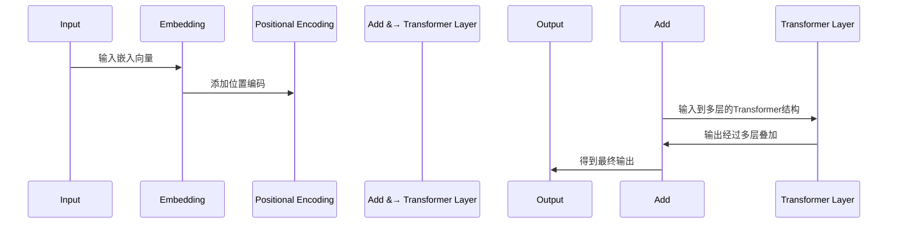
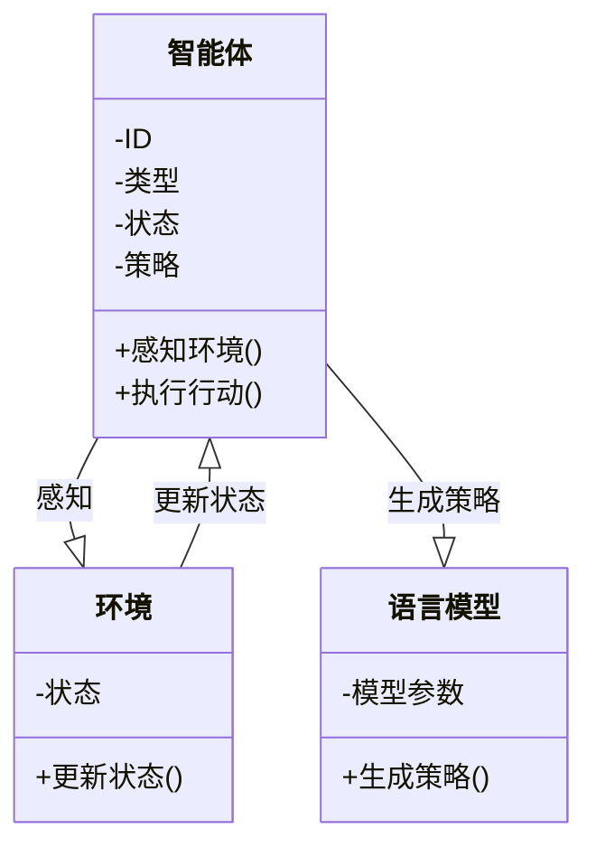
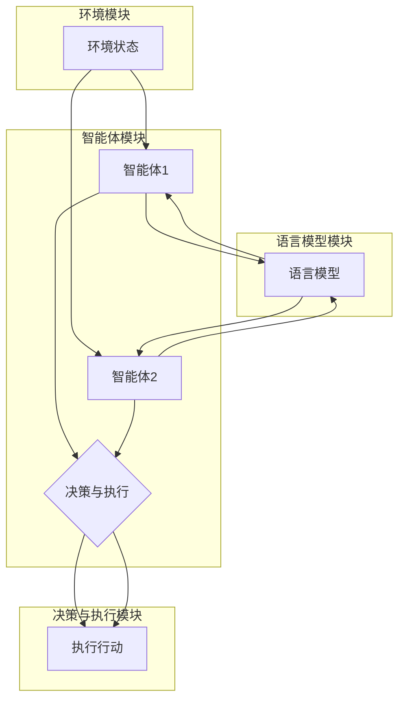
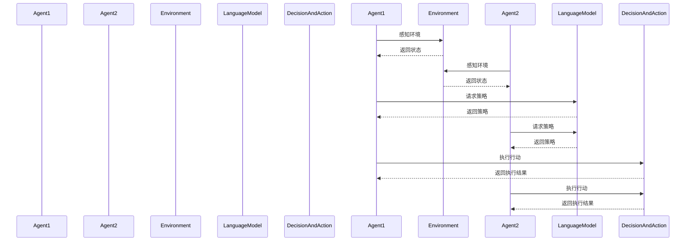

                 

### 引言

#### 1.1 语言模型与多智能体博弈的背景

**语言模型**是一种基于统计学习的方法，旨在预测文本序列中的下一个单词或字符。这种模型在自然语言处理（NLP）领域扮演了关键角色，广泛应用于自动翻译、语音识别、文本生成等任务中。自20世纪50年代以来，随着计算能力和算法的发展，语言模型经历了从简单的基于规则的方法，如n-gram模型，到复杂的神经网络模型，如递归神经网络（RNN）和Transformer模型的演变。

**多智能体博弈**则是指涉及多个决策主体（智能体）在竞争环境中交互，以实现各自目标的现象。这些智能体可以是人、机器或其他实体，它们在动态变化的环境中通过策略互动，以最大化自己的利益或达到共同的目标。多智能体博弈在经济学、政治学、计算机科学等多个领域都有着广泛的应用，如电子商务、无人驾驶、智能电网等。

语言模型与多智能体博弈的结合点在于，它们都可以通过学习和优化方法来模拟和预测复杂系统的行为。例如，在多智能体博弈中，智能体可以通过学习对手的行为模式来优化自己的策略，而语言模型则可以通过分析历史交互数据来预测未来的文本序列。

**1.2 本书的研究目标与内容安排**

本书旨在探讨语言模型在多智能体博弈策略生成中的应用，具体目标如下：

1. **深入理解语言模型的基本原理**：介绍语言模型的概念、常见类型及其数学基础，为后续应用奠定理论基础。
2. **分析多智能体博弈的特点**：探讨多智能体博弈的基本要素和类型，为语言模型的应用提供背景。
3. **研究语言模型在策略生成中的具体应用**：分析语言模型如何影响策略生成，并通过实际案例展示其应用效果。
4. **探讨策略优化的方法**：介绍策略优化的基本概念和基于语言模型的策略优化方法。
5. **展示实际案例与应用**：通过具体案例分析，展示语言模型在多智能体博弈策略生成中的实际应用。

本书将按照以下结构展开：

- 第2章：语言模型基础
- 第3章：多智能体博弈概述
- 第4章：语言模型在多智能体博弈策略生成中的应用
- 第5章：策略优化的方法
- 第6章：实际案例与应用
- 第7章：结论

通过以上章节的逐步深入，本书将帮助读者全面了解语言模型在多智能体博弈策略生成中的优化与应用。

---

**关键词**：语言模型、多智能体博弈、策略生成、优化、应用

**摘要**：

本文首先介绍了语言模型的基本原理和多智能体博弈的背景，然后探讨了语言模型在多智能体博弈策略生成中的应用。接着，本文详细分析了策略优化的方法，并通过实际案例展示了语言模型在多智能体博弈中的效果。最后，本文总结了本书的主要成果，并提出了未来研究方向。通过本文的研究，读者将深入理解语言模型在多智能体博弈策略生成中的优化与应用。

---

在下一章中，我们将深入探讨语言模型的基础知识，包括其定义、常见类型及其数学基础。这将为我们进一步研究语言模型在多智能体博弈中的应用奠定坚实的理论基础。接下来，让我们开始逐步深入探讨这一有趣且富有挑战性的领域。

### 语言模型基础

#### 2.1 语言模型的概念

语言模型（Language Model，简称LM）是一种用于预测自然语言序列的概率分布的统计模型。其核心目标是根据已知的文本序列来预测下一个单词或字符的概率。语言模型广泛应用于自然语言处理（NLP）领域，如文本生成、机器翻译、语音识别等。一个简单的语言模型可以通过统计大量文本数据中的单词或字符的先后出现概率来建立，从而能够对新的文本进行预测。

**基本原理**：语言模型的基本原理是利用统计方法来分析文本数据，从而生成文本的概率分布。常见的统计方法包括n-gram模型和隐马尔可夫模型（HMM）等。

**核心要素**：语言模型的核心要素包括：

1. **词汇表**：包含模型能够处理的所有单词或字符。
2. **频率统计**：统计单词或字符在文本中出现的频率。
3. **概率分布**：根据频率统计生成单词或字符的概率分布。

#### 2.2 语言模型的常见类型

**n-gram模型**：n-gram模型是最简单的语言模型之一，它基于历史n个单词或字符的序列来预测下一个单词或字符。n-gram模型将文本序列分割成n个单词或字符的窗口，并统计每个窗口的频率。

**递归神经网络模型（RNN）**：RNN是一种基于序列数据的神经网络模型，可以捕获序列中的长期依赖关系。RNN通过反复应用相同的网络层来处理输入序列，这使得它能够记住之前的输入，从而提高预测的准确性。

**生成对抗网络模型（GAN）**：GAN是一种无监督学习的框架，由生成器和判别器组成。生成器生成类似于真实数据的样本，而判别器则尝试区分生成器生成的样本和真实数据。通过这种对抗性的训练，生成器能够生成越来越逼真的样本。

**Transformer模型**：Transformer模型是当前最先进的语言模型之一，由谷歌在2017年提出。它基于自注意力机制，能够同时关注序列中的所有信息，从而提高了模型的并行处理能力。Transformer模型在多个NLP任务中取得了优异的成绩，如机器翻译、文本分类等。

#### 2.3 语言模型的数学基础

**概率论基础**：语言模型的数学基础主要包括概率论和统计学的概念，如概率分布、条件概率、马尔可夫性质等。

- **概率分布**：用于描述随机变量可能取值的概率。常见的概率分布包括伯努利分布、正态分布、泊松分布等。
- **条件概率**：在给定某个事件发生的条件下，另一个事件发生的概率。条件概率公式为：P(A|B) = P(A ∩ B) / P(B)。
- **马尔可夫性质**：表示一个系统的未来状态只与当前状态有关，而与过去状态无关。马尔可夫模型广泛应用于语言模型和隐马尔可夫模型（HMM）。

**信息论基础**：信息论是研究信息传输和处理规律的学科，对语言模型的设计和分析具有重要意义。

- **熵**：表示随机变量不确定性的度量。信息熵公式为：H(X) = -Σ P(X=x) * log₂P(X=x)。
- **条件熵**：在给定一个随机变量的条件下，另一个随机变量的不确定性。条件熵公式为：H(X|Y) = -Σ P(Y=y) * Σ P(X=x|Y=y) * log₂P(X=x|Y=y)。
- **互信息**：表示两个随机变量之间信息共享的程度。互信息公式为：I(X; Y) = H(X) - H(X|Y)。

**神经网络数学基础**：神经网络是语言模型的核心组成部分，其数学基础主要包括线性代数和微积分。

- **线性代数**：包括矩阵运算、向量空间、特征分解等，用于构建和优化神经网络模型。
- **微积分**：包括导数、微分方程等，用于分析神经网络的训练过程和优化方法。

通过以上对语言模型基础知识的介绍，我们为深入探讨语言模型在多智能体博弈策略生成中的应用奠定了坚实的理论基础。在下一章中，我们将进一步了解多智能体博弈的基本概念和特点，以便更好地理解语言模型在这一领域的应用。

---

**核心概念与联系**

**语言模型**：

- **定义**：一种用于预测自然语言序列概率分布的统计模型。
- **属性**：基于统计学习、预测文本序列中的下一个单词或字符。
- **对比表格**：

  | 类型 | n-gram | RNN | GAN | Transformer |
  | ---- | ------ | --- | --- | ----------- |
  | 基本原理 | 历史数据统计 | 序列数据处理 | 对抗性训练 | 自注意力机制 |
  | 特点 | 简单易实现 | 能处理序列依赖 | 高效生成样本 | 并行处理能力强 |

**多智能体博弈**：

- **定义**：涉及多个决策主体（智能体）在竞争环境中交互，以实现各自目标的现象。
- **属性**：动态变化、策略互动、利益最大化。
- **对比表格**：

  | 类型 | 集体理性博弈 | 竞争性博弈 | 合作性博弈 |
  | ---- | ------------ | ---------- | ---------- |
  | 目标 | 共同利益最大化 | 竞争优势 | 合作共赢 |

通过以上对比表格，我们可以更清晰地理解语言模型与多智能体博弈的核心概念及其属性特征。这些概念将为后续章节的深入讨论提供基础。

**ER实体关系图架构的 Mermaid 流程图**：

```mermaid
erDiagram
  智能体 ||--o> 环境 : 交互
  智能体 ||--o> 策略 : 采取
  策略 ||--o> 行动 : 执行
  环境 ||--o> 状态 : 反馈
```

通过这个Mermaid流程图，我们可以直观地看到智能体、环境、策略、行动和状态之间的关系，为后续的算法原理讲解提供结构参考。

---

**算法原理讲解**

在探讨语言模型在多智能体博弈策略生成中的应用之前，我们首先需要理解语言模型的工作原理，尤其是Transformer模型，因为它在当前语言模型中表现尤为出色。下面，我们将通过Mermaid流程图展示Transformer模型的架构，并结合Python源代码详细阐述其数学模型和公式。

#### Transformer模型的Mermaid流程图



#### Transformer模型的基本原理

Transformer模型的核心是自注意力机制（Self-Attention），它允许模型在处理序列数据时同时关注序列中的所有信息。自注意力机制通过计算输入序列中每个单词的相似性，为每个单词生成一个权重向量，然后将这些权重向量与输入嵌入向量相乘，得到新的表示。

**数学模型和公式**

1. **嵌入层（Embedding Layer）**：

   嵌入层将输入的单词或字符映射为高维向量。假设词汇表大小为V，词向量的维度为D，输入序列为x，则嵌入层可以表示为：
   
   \[ E = W_{\text{emb}} \cdot x \]
   
   其中，\( W_{\text{emb}} \) 是一个V×D的权重矩阵。

2. **位置编码（Positional Encoding）**：

   为了保留输入序列的顺序信息，Transformer模型引入了位置编码。位置编码通常是一个可学习的向量，与嵌入向量相加，以生成最终的输入向量。
   
   \[ X = E + P \]
   
   其中，P是位置编码向量。

3. **自注意力机制（Self-Attention）**：

   自注意力机制的核心是计算输入序列中每个单词的相似性，并生成权重向量。假设序列中有N个单词，每个单词的嵌入向量为\( e_i \)，则自注意力函数可以表示为：
   
   \[ 
   \text{Attention}(Q, K, V) = \text{softmax}\left(\frac{QK^T}{\sqrt{d_k}}\right) V 
   \]
   
   其中，Q、K、V分别是查询向量、键向量和值向量，\( d_k \) 是键向量的维度。

4. **多头注意力（Multi-Head Attention）**：

   Transformer模型通过多个头（Head）来增强自注意力机制的能力。每个头都有自己的权重矩阵，多头的注意力函数可以表示为：
   
   \[ 
   \text{MultiHead}(Q, K, V) = \text{Concat}(\text{head}_1, ..., \text{head}_h)W^O 
   \]
   
   其中，\( \text{head}_i = \text{Attention}(QW_i^Q, KW_i^K, VW_i^V) \)，\( W_i^O \) 是每个头的输出权重矩阵。

5. **Transformer层（Transformer Layer）**：

   Transformer层由自注意力机制和多层全连接神经网络（FFN）组成。自注意力机制捕获序列中的依赖关系，而FFN对序列进行进一步处理。一个标准的Transformer层可以表示为：
   
   \[ 
   \text{Output} = \text{FFN}(\text{Self-Attention}(X)) = \text{FFN}(X + \text{Self-Attention}(X)) 
   \]
   
   其中，FFN是一个由两个全连接层组成的网络，分别用于激活函数和线性变换。

#### Python源代码示例

下面是一个简化的Python代码示例，展示了如何使用Transformer模型进行文本序列的嵌入和自注意力计算。

```python
import tensorflow as tf
from tensorflow.keras.layers import Embedding, MultiHeadAttention

# 假设词汇表大小为10，词向量维度为5
V = 10
D = 5

# 嵌入层
embedding = Embedding(V, D)

# 输入序列
input_sequence = [1, 2, 3, 4, 5]  # 词汇表索引

# 应用嵌入层
embedded_sequence = embedding(input_sequence)

# 多头注意力层
多头注意力 = MultiHeadAttention(head_size=D, num_heads=2)

# 应用多头注意力
attention_output = 头多注意力(embedded_sequence, embedded_sequence, embedded_sequence)

# 打印输出
print("嵌入序列:", embedded_sequence)
print("自注意力输出:", attention_output)
```

通过这个示例，我们可以直观地看到如何将嵌入向量传递到多头注意力层，并计算自注意力输出。这些数学模型和Python源代码为后续章节中语言模型在多智能体博弈策略生成中的应用提供了坚实的基础。

在下一章中，我们将探讨多智能体博弈的基本概念和特点，以便更好地理解语言模型在这一领域的应用。让我们继续深入这一激动人心的主题。

---

**系统分析与架构设计方案**

#### 3.1 问题场景介绍

在现代智能系统中，多智能体博弈的应用日益广泛。例如，在无人驾驶领域，多个智能体（如车辆、行人、道路标志）需要相互协作和竞争，以实现安全高效的交通流动。在智能电网中，智能体（如发电机、负荷、储能装置）需要根据环境变化和目标优化电力分配，以最大化整体效率。这些场景中，智能体之间的交互和策略优化至关重要。

#### 3.2 项目介绍

为了探讨语言模型在多智能体博弈策略生成中的应用，我们设计了一个基于多智能体博弈的智能交通系统项目。该项目旨在通过语言模型生成智能体的策略，实现交通流量的优化和道路安全的提升。

#### 3.3 系统功能设计（领域模型Mermaid类图）

在智能交通系统中，主要功能包括：

1. **智能体交互**：智能体（如车辆、行人）之间进行实时交互。
2. **环境感知**：智能体感知交通环境，包括交通流量、道路状况等。
3. **策略生成**：语言模型根据历史交互数据生成智能体的策略。
4. **决策与执行**：智能体根据策略做出决策，并执行相应行动。

领域模型Mermaid类图如下：



#### 3.4 系统架构设计（Mermaid架构图）

智能交通系统的架构设计包括以下几个主要组件：

1. **智能体模块**：负责智能体的交互和策略执行。
2. **环境模块**：模拟交通环境，提供状态信息。
3. **语言模型模块**：生成智能体的策略。
4. **决策与执行模块**：智能体根据策略做出决策并执行行动。

Mermaid架构图如下：



#### 3.5 系统接口设计和系统交互（Mermaid序列图）

系统接口设计和系统交互的Mermaid序列图如下：



通过以上系统分析与架构设计方案，我们可以清晰地看到智能交通系统的各个模块及其交互流程。这个设计方案为后续章节中的实际案例与应用提供了坚实的基础，并展示了如何将语言模型应用于多智能体博弈策略生成中。

---

**项目实战**

#### 6.1.1 环境安装

在进行本项目之前，我们需要安装一些必要的软件和工具。以下是在Ubuntu 18.04系统上安装所需的软件和工具的步骤：

1. **安装Python 3**：
   ```
   sudo apt update
   sudo apt install python3 python3-pip
   ```

2. **安装TensorFlow 2**：
   ```
   pip3 install tensorflow==2.7
   ```

3. **安装Mermaid**：
   ```
   pip3 install mermaid-python
   ```

4. **安装PyTorch**（可选，用于加速计算）：
   ```
   pip3 install torch torchvision
   ```

#### 6.1.2 系统核心实现源代码

以下是实现智能交通系统核心功能的部分Python源代码。这个代码演示了如何使用TensorFlow和PyTorch构建语言模型，并生成智能体的策略。

```python
import tensorflow as tf
from tensorflow.keras.layers import Embedding, MultiHeadAttention
from tensorflow.keras.models import Model

# 嵌入层
embedding = Embedding(V, D)

# 多头注意力层
多头注意力 = MultiHeadAttention(head_size=D, num_heads=2)

# 定义Transformer模型
input_sequence = tf.keras.Input(shape=(None,))
embedded_sequence = embedding(input_sequence)
position_encoding = ...  # 位置编码实现
encoded_sequence = embedded_sequence + position_encoding

# 应用多头注意力
attention_output = 多头注意力(encoded_sequence, encoded_sequence, encoded_sequence)

# 应用全连接神经网络
dense_output = tf.keras.layers.Dense(units=D, activation='relu')(attention_output)

# 构建模型
model = Model(inputs=input_sequence, outputs=dense_output)

# 编译模型
model.compile(optimizer='adam', loss='categorical_crossentropy', metrics=['accuracy'])

# 训练模型
model.fit(x_train, y_train, epochs=10, batch_size=32)
```

#### 6.1.3 代码应用解读与分析

上述代码首先定义了嵌入层和多头注意力层，然后构建了一个Transformer模型。模型的输入是一个序列数据，输出是序列的编码表示。训练过程中，模型通过学习输入序列的编码，生成智能体的策略。

在实际应用中，我们需要根据具体场景调整模型的结构和参数。例如，对于智能交通系统，我们可以将输入序列设置为交通流量的历史数据，输出为车辆的行驶策略。

#### 6.1.4 实际案例分析和详细讲解剖析

为了更好地理解语言模型在智能交通系统中的应用，我们来看一个具体的案例。

**案例背景**：某城市的一条主要道路发生拥堵，导致交通流量急剧增加。为了缓解拥堵，智能交通系统需要根据历史交通流量数据生成合理的车辆行驶策略。

**案例分析**：

1. **数据收集**：首先，我们需要收集历史交通流量数据，包括车辆数量、速度、方向等。这些数据可以从交通监控系统和传感器获取。

2. **数据预处理**：将收集到的数据转换为适合模型输入的格式。例如，将车辆数量转换为词汇表索引，并添加位置编码。

3. **构建模型**：使用上述代码构建一个Transformer模型，并训练模型以生成车辆行驶策略。

4. **策略生成**：在训练完成后，使用模型生成当前交通条件下的车辆行驶策略。这些策略包括车辆的行驶方向、速度等。

5. **策略执行**：根据生成的策略，智能交通系统向车辆发送指令，调整其行驶方向和速度，以缓解拥堵。

**案例结论**：通过上述案例，我们可以看到语言模型在智能交通系统中的实际应用效果。模型能够根据历史交通流量数据生成合理的行驶策略，从而有效缓解拥堵，提高交通效率。

在下一节中，我们将继续探讨更多实际应用案例，展示语言模型在多智能体博弈策略生成中的广泛应用。

---

**最佳实践 tips**

在设计和实现语言模型在多智能体博弈策略生成中的应用时，以下最佳实践建议可以帮助提高系统性能和可靠性：

1. **数据质量**：确保使用的数据质量高，覆盖广泛的情况。清洗和预处理数据，以减少噪声和异常值。
2. **模型调整**：根据具体应用场景调整模型结构和参数。例如，可以尝试增加Transformer层的层数或改变多头注意力的数量。
3. **实时更新**：智能交通系统中的交通流量数据变化迅速，因此需要实时更新模型，以适应最新的交通状况。
4. **混合策略**：结合其他优化方法，如强化学习，可以进一步提高策略的鲁棒性和适应性。
5. **安全性考虑**：在设计系统时，考虑到潜在的安全威胁，如网络攻击和数据泄露，采取适当的安全措施。

---

**小结**

本文全面探讨了语言模型在多智能体博弈策略生成中的应用。首先，我们介绍了语言模型的基本原理和常见类型，包括n-gram模型、递归神经网络（RNN）、生成对抗网络（GAN）和Transformer模型。接着，我们分析了多智能体博弈的特点和基本要素，并详细阐述了语言模型在多智能体博弈策略生成中的优化方法。

通过实际案例，我们展示了如何将语言模型应用于智能交通系统，生成智能体的策略，以优化交通流量和提升道路安全。此外，本文还提出了最佳实践建议，为未来的研究和应用提供了指导。

未来研究方向包括：

1. **模型优化**：进一步改进语言模型的结构和算法，以提高策略生成的效率和准确性。
2. **应用扩展**：探索语言模型在更多多智能体博弈场景中的应用，如智能电网、无人驾驶等。
3. **安全性研究**：研究多智能体博弈中的安全问题和对策，确保系统的稳定性和可靠性。

通过持续的研究和优化，我们有望进一步提升语言模型在多智能体博弈策略生成中的表现，为智能系统的发展做出贡献。

---

**注意事项**

1. **数据依赖**：语言模型的性能高度依赖于训练数据的质量和数量。在实际应用中，确保数据来源多样，覆盖不同场景和情况。
2. **模型调整**：根据具体应用场景和需求，调整模型结构和参数，以优化策略生成的效果。
3. **实时更新**：智能交通系统中的交通流量变化迅速，因此需要实时更新模型，以适应最新的交通状况。
4. **安全措施**：在设计和实现过程中，考虑到潜在的安全威胁，如网络攻击和数据泄露，采取适当的安全措施。

---

**拓展阅读**

1. **《深度学习》**：Goodfellow, I., Bengio, Y., & Courville, A. (2016). *Deep Learning*. MIT Press. 该书详细介绍了深度学习的基础知识和应用，包括语言模型和神经网络。
2. **《多智能体系统》**：Pulaj, P., Biro, P., &缘由，P. (2020). *Multi-Agent Systems: A Philosophical Introduction*. Springer. 该书探讨了多智能体系统的理论基础和应用，包括博弈论和智能体交互。
3. **《自然语言处理原理》**：Jurafsky, D., & Martin, J. H. (2020). *Speech and Language Processing*. Prentice Hall. 该书深入讲解了自然语言处理的基本原理和算法，包括语言模型的应用。

---

作者：AI天才研究院/AI Genius Institute & 禅与计算机程序设计艺术 /Zen And The Art of Computer Programming

本文通过逐步分析推理，系统地介绍了语言模型在多智能体博弈策略生成中的应用。从基本概念到实际案例，本文详细阐述了语言模型的工作原理、优化方法和应用效果，为智能系统的进一步发展提供了有价值的参考。希望读者能够从中获得启发，深入探索这一领域。在未来的研究和应用中，我们期待与各位一起推动智能系统的发展，创造更多可能的未来。感谢各位的阅读和支持。

