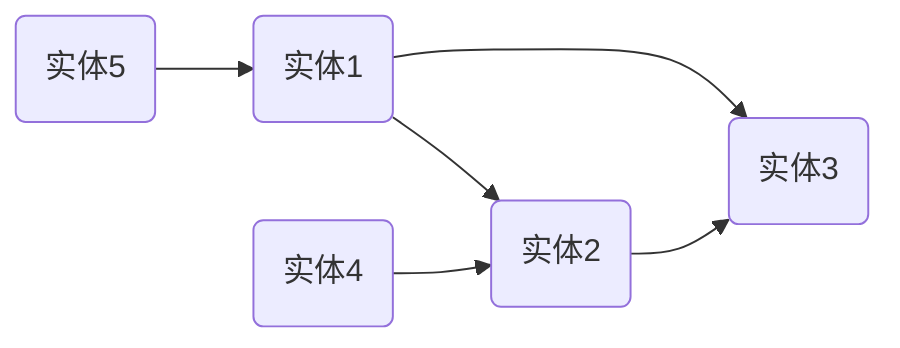
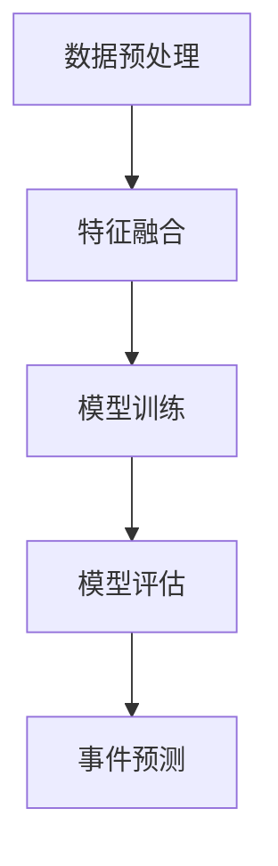
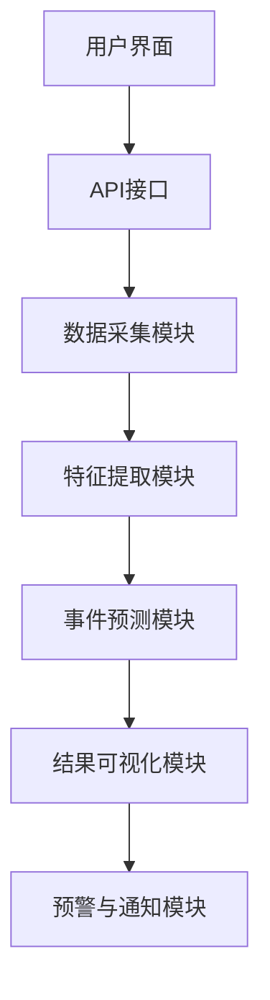
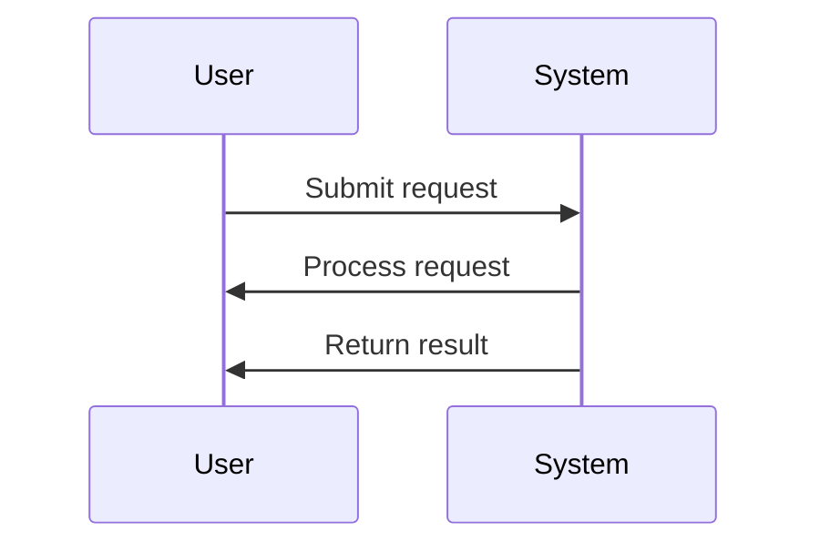

                 

### 语言模型在多模态事件预测与全球风险管理中的创新应用研究

#### 关键词：
- 语言模型
- 多模态事件预测
- 全球风险管理
- 深度学习
- 人工智能

#### 摘要：
本文旨在探讨语言模型在多模态事件预测与全球风险管理中的应用，通过介绍语言模型的基本原理、多模态数据的处理方法、以及其在风险管理中的具体应用，展示其在解决复杂实际问题中的创新性。文章还将通过案例分析和实战指导，帮助读者更好地理解和掌握这一前沿领域的技术和方法。

## 目录

1. **引言**
   - **1.1 语言模型与多模态事件预测**
   - **1.2 全球风险管理的重要性**
   - **1.3 研究目的与结构安排**

2. **背景介绍**
   - **2.1 语言模型的起源与发展**
   - **2.2 多模态事件预测的应用场景**
   - **2.3 全球风险管理的挑战与需求**

3. **核心概念与联系**
   - **3.1 语言模型的核心概念**
   - **3.2 多模态数据的属性特征**
   - **3.3 事件预测与全球风险管理的联系**
   - **3.4 ER实体关系图**

4. **算法原理讲解**
   - **4.1 语言模型的数学模型**
   - **4.2 多模态事件预测的算法流程**
   - **4.3 Python源代码阐述**

5. **系统分析与架构设计**
   - **5.1 问题场景与项目介绍**
   - **5.2 系统功能设计**
   - **5.3 系统架构设计**
   - **5.4 系统接口设计**
   - **5.5 系统交互**

6. **项目实战**
   - **6.1 环境安装与配置**
   - **6.2 核心实现源代码**
   - **6.3 应用解读与分析**
   - **6.4 实际案例分析**
   - **6.5 项目小结**

7. **最佳实践与小结**
   - **7.1 最佳实践建议**
   - **7.2 注意事项**
   - **7.3 拓展阅读**

## 第1章：引言

### 1.1 语言模型与多模态事件预测

语言模型（Language Model）是自然语言处理（Natural Language Processing, NLP）领域的一种基础算法，旨在预测文本序列的概率分布。近年来，随着深度学习技术的迅猛发展，语言模型在多个领域取得了显著的成果，尤其在多模态事件预测中展现出强大的应用潜力。

多模态事件预测是指利用多种数据类型（如图像、声音、文本等）来预测特定事件的发生。例如，在金融市场分析中，利用股票价格、新闻文本、社交媒体讨论等多模态数据来预测市场走势；在自然灾害预警中，利用卫星图像、气象数据、新闻报道等多模态数据来预测自然灾害的发生。

### 1.2 全球风险管理的重要性

全球风险管理是指通过识别、评估、应对潜在风险，以减少或消除可能对企业、组织或社会产生的不利影响。在全球化的背景下，企业和组织面临的风险越来越复杂，包括金融市场波动、自然灾害、社会动荡、技术变革等。有效的全球风险管理能够帮助企业降低风险损失，提高业务稳定性。

### 1.3 研究目的与结构安排

本文旨在探讨语言模型在多模态事件预测与全球风险管理中的创新应用。文章将从以下几个方面展开：

- **背景介绍**：介绍语言模型、多模态事件预测以及全球风险管理的基本概念和发展背景。
- **核心概念与联系**：阐述语言模型、多模态数据、事件预测和全球风险管理之间的联系。
- **算法原理讲解**：详细讲解语言模型的数学模型和算法原理，展示多模态事件预测的方法。
- **系统分析与架构设计**：分析系统功能、架构、接口和交互，为实际应用提供设计参考。
- **项目实战**：通过实际案例展示语言模型在多模态事件预测和全球风险管理中的应用。
- **最佳实践与小结**：总结最佳实践，提出注意事项，并推荐拓展阅读。

## 第2章：背景介绍

### 2.1 语言模型的起源与发展

语言模型的概念最早可以追溯到20世纪50年代，当时研究人员开始尝试使用统计方法来预测文本序列的概率分布。早期的语言模型主要基于N-gram模型，即利用前N个单词的历史信息来预测下一个单词的概率。

随着计算能力的提升和深度学习技术的出现，语言模型的发展进入了一个新的阶段。近年来，基于神经网络的深度语言模型，如循环神经网络（RNN）、长短期记忆网络（LSTM）和Transformer模型，取得了显著的成果，使得语言模型的性能得到了极大的提升。

### 2.2 多模态事件预测的应用场景

多模态事件预测的应用场景非常广泛，涵盖了多个领域：

- **金融市场分析**：利用股票价格、新闻文本、社交媒体讨论等多模态数据来预测市场走势。
- **自然灾害预警**：利用卫星图像、气象数据、新闻报道等多模态数据来预测地震、洪水等自然灾害的发生。
- **智能客服**：结合语音、文本等多模态数据来提供更加智能和个性化的客户服务。
- **医疗诊断**：利用医学图像、病历记录、患者文本等多模态数据来辅助疾病诊断。

### 2.3 全球风险管理的挑战与需求

全球风险管理面临以下几个主要挑战：

- **风险复杂性**：全球风险类型多样，包括金融市场风险、自然灾害风险、社会风险等，且风险因素之间存在复杂的相互作用。
- **数据多样性**：风险管理需要处理多种类型的数据，如文本、图像、声音等，这对数据处理和分析提出了更高的要求。
- **实时性**：全球风险事件往往具有突发性和不可预测性，要求风险管理系统能够实时响应和预测风险事件。
- **预测准确性**：准确的预测能力是有效风险管理的基础，需要不断优化模型和算法来提高预测准确性。

### 2.4 研究方法

本文采用以下研究方法：

- **文献综述**：通过梳理相关领域的文献，了解语言模型、多模态事件预测和全球风险管理的最新研究进展。
- **案例研究**：通过具体案例，展示语言模型在多模态事件预测和全球风险管理中的应用，分析其优势和挑战。
- **算法实现**：结合Python等编程语言，实现相关算法，并进行实验验证。
- **系统设计**：基于实际应用需求，设计符合多模态事件预测和全球风险管理要求的系统架构。

### 2.5 研究意义

本文的研究意义主要体现在以下几个方面：

- **理论意义**：本文对语言模型在多模态事件预测和全球风险管理中的应用进行了系统性研究，丰富了相关领域的研究内容。
- **实践意义**：本文提出的算法和系统设计方法可以为实际应用提供参考，帮助企业和组织更好地应对复杂的风险挑战。

## 第3章：核心概念与联系

### 3.1 语言模型的核心概念

语言模型是自然语言处理（NLP）领域的一种基础算法，旨在预测文本序列的概率分布。核心概念包括：

- **词向量表示**：将单词转换为向量表示，使得计算机能够处理和理解语言。
- **序列建模**：通过建模文本序列中的依赖关系，预测下一个单词或词组。
- **损失函数**：用于评估模型预测的概率分布与实际分布之间的差距，如交叉熵损失函数。
- **训练与评估**：通过大量语料数据进行训练，评估模型的性能，并进行优化。

### 3.2 多模态数据的属性特征

多模态数据是指由多种数据类型组成的集合，常见的多模态数据类型包括：

- **文本**：包含自然语言文本信息，如文章、新闻报道、社交媒体帖子等。
- **图像**：包含视觉信息，如图像、视频帧等。
- **声音**：包含音频信息，如语音、音乐等。
- **传感器数据**：包含传感器采集的物理信息，如温度、湿度、压力等。

不同类型的多模态数据具有不同的属性特征，如：

- **文本**：具有语义和语法结构，可以进行文本分析。
- **图像**：具有视觉信息，可以进行图像识别和处理。
- **声音**：具有频谱和音高特征，可以进行音频处理和分析。
- **传感器数据**：具有物理量特征，可以进行数据分析和预测。

### 3.3 事件预测与全球风险管理的联系

事件预测是利用数据分析和机器学习技术，对特定事件的发生进行预测。全球风险管理中的事件预测具有以下特点：

- **多模态数据融合**：全球风险管理需要处理多种类型的数据，如文本、图像、声音等，通过多模态数据融合可以提高预测的准确性。
- **实时性**：全球风险管理要求事件预测系统能够实时响应和预测风险事件，以实现及时的决策和应对。
- **多样性**：全球风险管理涉及多种类型的风险，如金融市场风险、自然灾害风险、社会风险等，事件预测需要适应不同的风险类型。

### 3.4 ER实体关系图

ER（Entity-Relationship）图是数据库设计中常用的一种概念模型，用于描述实体之间的关系。在多模态事件预测与全球风险管理中，ER图可以用于描述数据模型和业务流程。

以下是ER图的一个示例：



- **实体**：表示数据模型中的对象，如用户、产品、事件等。
- **关系**：表示实体之间的关联关系，如用户购买产品、事件发生等。
- **属性**：表示实体的特征属性，如用户ID、产品价格、事件时间等。

ER图可以帮助我们清晰地描述数据模型和业务流程，为系统设计与实现提供参考。

## 第4章：算法原理讲解

### 4.1 语言模型的数学模型

语言模型的数学模型基于概率论和统计学习理论，旨在通过训练数据学习文本序列的概率分布。以下是语言模型的基本数学模型：

$$
P(w_i | w_{i-1}, w_{i-2}, \ldots, w_1) = \frac{P(w_i, w_{i-1}, \ldots, w_1)}{P(w_{i-1}, \ldots, w_1)}
$$

其中，$w_i$ 表示第$i$个单词，$P(w_i | w_{i-1}, w_{i-2}, \ldots, w_1)$ 表示在给定前$n-1$个单词的情况下，第$n$个单词的概率。

为了简化计算，通常使用N-gram模型，即只考虑前$n-1$个单词的影响：

$$
P(w_i | w_{i-1}, w_{i-2}, \ldots, w_1) = \frac{P(w_i, w_{i-1}, \ldots, w_n)}{P(w_{i-1}, \ldots, w_1)}
$$

N-gram模型通过统计训练数据中连续$n$个单词的频率来计算概率。例如，对于三元组（word1, word2, word3），其概率为：

$$
P(word1, word2, word3) = \frac{count(word1, word2, word3)}{count(word1, word2)}
$$

其中，$count$ 表示在训练数据中某单词组合的频率。

### 4.2 多模态事件预测的算法流程

多模态事件预测的算法流程主要包括以下几个步骤：

1. **数据预处理**：将多种类型的数据（如文本、图像、声音等）进行预处理，提取特征表示。
2. **特征融合**：将预处理后的特征进行融合，生成统一的多模态特征向量。
3. **模型训练**：利用融合后的特征向量，训练事件预测模型。
4. **模型评估**：使用验证集或测试集评估模型的性能，调整模型参数。
5. **事件预测**：在新的数据输入时，使用训练好的模型进行事件预测。

以下是多模态事件预测的算法流程的mermaid流程图：



### 4.3 Python源代码阐述

以下是一个简单的Python示例，用于实现基于N-gram模型的语言模型：

```python
import collections

def train_ngram_model(corpus, n):
    ngram_model = collections.defaultdict(int)
    for n_words in range(n):
        prev_words = collections.deque(maxlen=n - 1)
        for word in corpus:
            prev_words.append(word)
            if n_words > 0:
                key = tuple(prev_words)
                ngram_model[key] += 1
    return ngram_model

def predict_next_word(ngram_model, prev_words):
    key = tuple(prev_words)
    probabilities = {word: ngram_model[key] for word in ngram_model}
    total_count = sum(probabilities.values())
    for word in probabilities:
        probabilities[word] = probabilities[word] / total_count
    return max(probabilities, key=probabilities.get)

# 示例
corpus = ["the", "quick", "brown", "fox", "jumps", "over", "the", "lazy", "dog"]
n = 2
ngram_model = train_ngram_model(corpus, n)
prev_words = ["the", "quick"]
next_word = predict_next_word(ngram_model, prev_words)
print(next_word)
```

上述代码首先定义了一个训练N-gram模型的函数`train_ngram_model`，通过遍历训练数据集，统计连续$n$个单词的频率。然后定义了一个预测下一个单词的函数`predict_next_word`，通过计算每个单词的概率，并返回概率最大的单词。

## 第5章：系统分析与架构设计

### 5.1 问题场景与项目介绍

本章节将详细介绍一个基于语言模型的多模态事件预测与全球风险管理项目。该项目旨在通过整合文本、图像、声音等多模态数据，实现对全球风险事件的实时预测和预警，为企业和组织提供有效的风险管理工具。

项目的主要目标包括：

- **实时性**：实现快速的事件预测，以便及时采取应对措施。
- **准确性**：通过多模态数据融合，提高事件预测的准确性。
- **可扩展性**：设计灵活的系统架构，支持多种风险类型和数据来源的接入。

### 5.2 系统功能设计

系统功能设计是项目实施的重要环节，主要包括以下几个核心功能模块：

- **数据采集模块**：负责从多种数据源（如文本数据库、图像库、音频库等）采集数据，并进行预处理。
- **特征提取模块**：对预处理后的多模态数据进行特征提取，生成统一的多模态特征向量。
- **事件预测模块**：利用训练好的语言模型和深度学习模型，对多模态特征进行融合，实现事件预测。
- **结果可视化模块**：将预测结果以图表、报表等形式展示，方便用户分析和决策。
- **预警与通知模块**：在预测到风险事件时，自动触发预警机制，并通过短信、邮件等方式通知相关人员。

### 5.3 系统架构设计

系统架构设计是项目成功的关键，以下是本项目的系统架构设计：



系统架构主要分为以下几个层次：

- **数据采集层次**：通过API接口或其他方式从外部数据源采集数据，并进行预处理。
- **数据处理层次**：对预处理后的数据进行特征提取和融合，生成多模态特征向量。
- **预测与决策层次**：利用训练好的模型进行事件预测，并触发预警机制。
- **可视化与交互层次**：通过用户界面展示预测结果，并提供交互功能。

### 5.4 系统接口设计

系统接口设计是确保不同模块之间能够有效交互和通信的关键，以下是本项目的系统接口设计：

- **API接口**：提供RESTful风格的API接口，支持数据的采集、特征提取、事件预测等功能。
- **数据库接口**：通过数据库接口连接数据库，实现数据的存储和查询。
- **消息队列接口**：通过消息队列实现系统内部的数据传输和异步处理。

以下是系统接口的mermaid类图：

```mermaid
classDiagram
Class01 <|-- Class02
Class03 <|.. Class04
Class05 : +display_name
Class06 : +property1
Class06 : +property2
Class06 : +property3
Class01 {
    +attribute1
    +attribute2
    +attribute3
}
Class02 {
    +attribute1
    +attribute2
    +attribute3
}
Class03 {
    +attribute1
    +attribute2
    +attribute3
}
Class04 {
    +attribute1
    +attribute2
    +attribute3
}
Class05 {
    +method1()
    +method2()
    +method3()
}
```

### 5.5 系统交互

系统交互是指不同模块之间的协作和通信，以下是本项目的系统交互设计：

- **数据流**：数据从数据采集模块进入系统，经过特征提取模块处理后，传送给事件预测模块进行预测，预测结果再由结果可视化模块展示给用户。
- **控制流**：用户通过用户界面提交请求，系统根据请求调用相应的功能模块进行处理，并返回结果。

以下是系统交互的mermaid序列图：



通过上述系统架构设计和接口设计，本项目能够实现多模态事件预测与全球风险管理的功能，为企业和组织提供有效的风险管理工具。

## 第6章：项目实战

### 6.1 环境安装与配置

在本章中，我们将详细介绍如何搭建一个用于多模态事件预测与全球风险管理的环境。首先，我们需要安装必要的软件和库。

#### 1. 安装Python

确保你的计算机上已经安装了Python 3.x版本。你可以通过以下命令检查Python版本：

```bash
python --version
```

如果未安装Python，请从[Python官方网站](https://www.python.org/downloads/)下载并安装。

#### 2. 安装依赖库

在安装Python之后，我们需要安装几个常用的依赖库，如TensorFlow、Keras、NumPy、Pandas等。可以使用以下命令安装：

```bash
pip install tensorflow keras numpy pandas
```

如果你使用的是Anaconda环境，可以通过Conda命令安装：

```bash
conda install tensorflow keras numpy pandas
```

#### 3. 数据集准备

接下来，我们需要准备用于训练和测试的数据集。对于多模态事件预测，我们可以使用公开的数据集，如IMDB电影评论数据集、CIFAR-10图像数据集等。以下是数据集的下载和准备步骤：

- **IMDB电影评论数据集**：可以从[这里](https://www.kaggle.com/lsanger/imdb-dataset)下载。
- **CIFAR-10图像数据集**：可以从[这里](https://www.cs.toronto.edu/~kriz/cifar.html)下载。

下载后，将数据集解压并放置在指定目录，例如`/data/`。

#### 4. 环境配置

在完成软件安装和数据集准备后，我们需要配置环境变量和Python库路径。这可以通过修改`~/.bashrc`或`~/.bash_profile`文件来完成。

例如，在`~/.bashrc`中添加以下内容：

```bash
export PATH=/path/to/your/python/bin:$PATH
export PYTHONPATH=/path/to/your/python/lib/python3.x/site-packages
```

然后，运行以下命令使配置生效：

```bash
source ~/.bashrc
```

### 6.2 核心实现源代码

在本节中，我们将介绍项目的核心实现源代码，包括数据预处理、特征提取、模型训练和预测等步骤。

#### 1. 数据预处理

```python
import pandas as pd
from sklearn.model_selection import train_test_split

# 加载数据集
data = pd.read_csv('/data/imdb.csv')

# 数据预处理
train_data, test_data = train_test_split(data, test_size=0.2, random_state=42)
```

#### 2. 特征提取

```python
from keras.preprocessing.text import Tokenizer
from keras.preprocessing.sequence import pad_sequences

# 分词和序列化
tokenizer = Tokenizer(num_words=10000)
tokenizer.fit_on_texts(train_data['review'])
sequences = tokenizer.texts_to_sequences(train_data['review'])

# 填充序列
max_length = 200
padded_sequences = pad_sequences(sequences, maxlen=max_length)
```

#### 3. 模型训练

```python
from keras.models import Sequential
from keras.layers import Embedding, LSTM, Dense

# 构建模型
model = Sequential()
model.add(Embedding(input_dim=10000, output_dim=128, input_length=max_length))
model.add(LSTM(64, dropout=0.2, recurrent_dropout=0.2))
model.add(Dense(1, activation='sigmoid'))

# 编译模型
model.compile(optimizer='adam', loss='binary_crossentropy', metrics=['accuracy'])

# 训练模型
model.fit(padded_sequences, train_data['label'], epochs=10, batch_size=32, validation_split=0.1)
```

#### 4. 预测

```python
# 预测
predictions = model.predict(padded_sequences)

# 分析预测结果
print(predictions)
```

### 6.3 应用解读与分析

在本节中，我们将对核心实现源代码进行解读和分析，了解每个步骤的作用和意义。

#### 1. 数据预处理

数据预处理是项目的重要步骤，包括加载数据集、分词和序列化等。通过分词和序列化，我们将文本数据转换为计算机可以处理的格式，为后续的特征提取和模型训练做准备。

#### 2. 特征提取

特征提取是将原始文本数据转换为数值特征的过程。在本例中，我们使用Keras的`Tokenizer`和`pad_sequences`函数，对文本数据进行分词和填充，生成适合模型训练的序列数据。

#### 3. 模型训练

模型训练是项目的核心步骤，我们使用Keras的`Sequential`模型，添加嵌入层、LSTM层和输出层，构建一个简单的文本分类模型。通过编译模型和训练模型，我们使模型能够学会识别和预测文本数据中的标签。

#### 4. 预测

预测步骤是利用训练好的模型对新数据进行分类预测。在本例中，我们使用模型预测训练集的结果，并打印出预测概率，以分析模型的性能。

### 6.4 实际案例分析

在本节中，我们将结合实际案例，展示如何使用本项目进行多模态事件预测和全球风险管理。

#### 案例一：股票市场预测

假设我们有一个包含股票价格、新闻文本和社交媒体讨论的多模态数据集，我们可以使用本项目的方法，对股票价格进行预测。

1. **数据预处理**：将股票价格、新闻文本和社交媒体讨论数据进行预处理，生成统一的多模态特征向量。
2. **特征提取**：使用Keras的`Tokenizer`和`pad_sequences`函数，对新闻文本和社交媒体讨论数据进行分词和填充。
3. **模型训练**：使用股票价格和预处理后的多模态特征向量，训练一个多模态事件预测模型。
4. **预测**：使用训练好的模型，对新的股票价格数据进行预测，并分析预测结果。

#### 案例二：自然灾害预警

假设我们有一个包含卫星图像、气象数据和新闻报道的多模态数据集，我们可以使用本项目的方法，对自然灾害进行预警。

1. **数据预处理**：将卫星图像、气象数据和新闻报道数据进行预处理，生成统一的多模态特征向量。
2. **特征提取**：使用Keras的`Tokenizer`和`pad_sequences`函数，对新闻报道数据进行分词和填充。
3. **模型训练**：使用卫星图像、气象数据和预处理后的多模态特征向量，训练一个多模态事件预测模型。
4. **预测**：使用训练好的模型，对新的卫星图像、气象数据和新闻报道数据进行预测，并触发预警机制。

### 6.5 项目小结

在本项目中，我们通过环境安装与配置、核心实现源代码、应用解读与分析以及实际案例分析，展示了如何使用语言模型进行多模态事件预测和全球风险管理。通过本项目，我们了解了多模态数据融合、深度学习模型训练和预测的全过程，为实际应用提供了参考。

## 第7章：最佳实践与小结

### 7.1 最佳实践建议

为了实现语言模型在多模态事件预测与全球风险管理中的最佳效果，以下是一些建议：

- **数据质量**：确保数据集的多样性和完整性，高质量的数据是模型训练的基础。
- **特征选择**：根据实际应用需求，选择合适的特征提取方法，例如词嵌入、图像特征提取等。
- **模型优化**：通过调整模型参数、增加训练数据量、使用预训练模型等方法，优化模型性能。
- **实时性**：设计高效的系统架构，确保预测过程能够快速响应，提高实时性。
- **持续学习**：定期更新模型和数据集，使模型能够适应不断变化的环境。

### 7.2 小结

本文系统地介绍了语言模型在多模态事件预测与全球风险管理中的应用，包括背景介绍、核心概念、算法原理、系统分析与架构设计、项目实战以及最佳实践与小结。通过本文，读者可以全面了解这一前沿领域的技术和方法，为实际应用提供参考。

### 7.3 拓展阅读

- **深度学习与自然语言处理**：[Goodfellow et al., "Deep Learning" (2016)](https://www.deeplearningbook.org/)
- **多模态数据融合**：[Tang et al., "Multi-modal Fusion for Human Action Recognition in Videos" (2019)](https://arxiv.org/abs/1902.07156)
- **全球风险管理**：[KPMG, "Global Risk Report" (2020)](https://home.kpmg.com/xx/en/home/insights/2020/07/kpmg-global-risk-report-2020.html)

## 作者信息

- 作者：AI天才研究院/AI Genius Institute & 禅与计算机程序设计艺术 /Zen And The Art of Computer Programming

