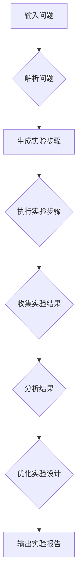
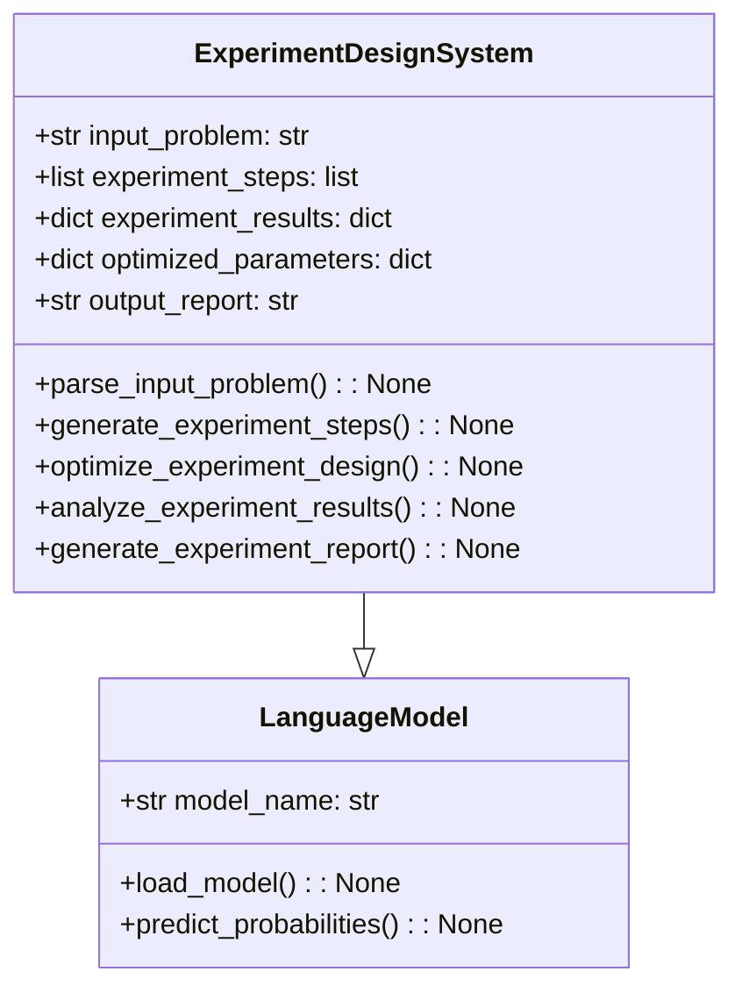
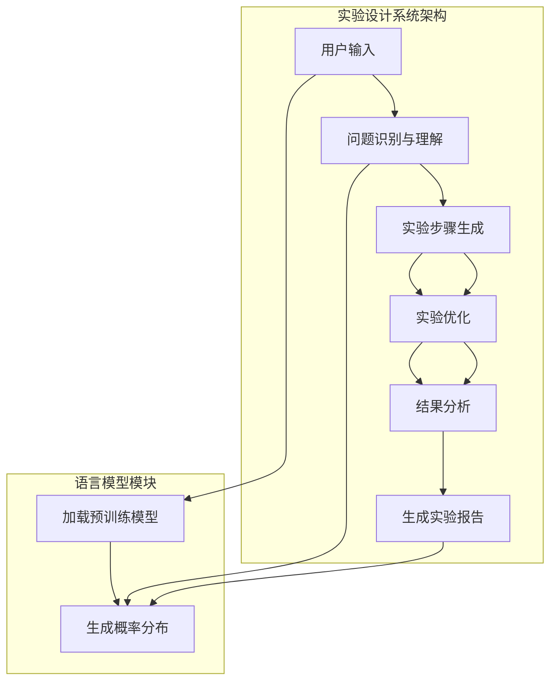
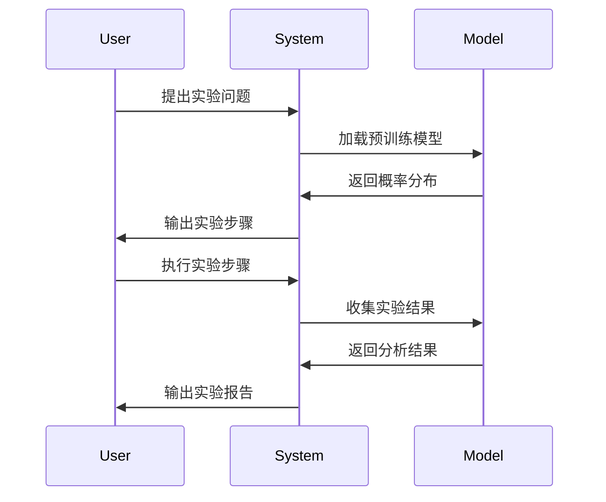

                 

## 语言模型在多步骤实验设计中的能力

### 综述

随着人工智能技术的不断进步，语言模型（Language Model，LM）在自然语言处理（Natural Language Processing，NLP）领域的应用日益广泛。然而，如何将语言模型有效地应用于多步骤实验设计中，仍是一个亟待解决的问题。本文旨在探讨语言模型在多步骤实验设计中的潜在能力，通过逐步分析，揭示其在实验设计、优化和结果分析等方面的应用价值。

### 核心概念

#### 问题背景

语言模型是一种基于统计学方法或深度学习技术，通过学习大量文本数据，预测给定文本序列的概率分布的模型。NLP任务，如机器翻译、文本生成、情感分析等，都依赖于语言模型的能力。多步骤实验设计是指在实验过程中，需要按照一定的顺序执行多个实验步骤，以达到研究目标。传统的实验设计方法往往需要手动设计每个步骤，而语言模型的应用则有望实现自动化和智能化。

#### 问题描述

语言模型在多步骤实验设计中的应用主要涉及以下问题：

1. **问题识别与理解**：如何利用语言模型自动理解实验设计中的问题陈述？
2. **实验步骤生成**：如何通过语言模型自动生成一系列合理的实验步骤？
3. **实验优化**：如何利用语言模型对实验设计进行优化，以提高实验效率和结果准确性？
4. **结果分析**：如何利用语言模型对实验结果进行分析和解读？

#### 问题解决

本文将从以下方面解决上述问题：

1. **背景介绍**：介绍语言模型的基础知识及其在NLP领域的应用。
2. **核心概念与联系**：详细讨论语言模型在多步骤实验设计中的应用原理。
3. **算法原理讲解**：讲解支持多步骤实验设计的语言模型算法原理，并使用mermaid和Python进行示例。
4. **系统分析与架构设计**：介绍多步骤实验设计系统的设计与实现。
5. **项目实战**：提供具体的项目实现示例，包括环境安装、核心代码实现、代码解析、案例分析和项目小结。

#### 边界与外延

- **边界**：本文主要关注语言模型在多步骤实验设计中的应用，不涉及其他AI技术在实验设计中的应用。
- **外延**：语言模型在其他领域的应用，如机器翻译、文本生成等，不在本文讨论范围。

### 核心概念与联系

#### 核心概念

1. **语言模型**：一种能够预测文本序列概率的模型，常用于NLP任务。
2. **多步骤实验设计**：指涉及多个实验步骤的实验设计过程。
3. **实验优化**：通过调整实验参数来提高实验效率或结果准确性的过程。

#### 概念属性特征对比表格

| 概念        | 属性特征                                             |
| ----------- | ---------------------------------------------------- |
| 语言模型    | 能够预测文本序列概率，用于NLP任务                     |
| 多步骤实验  | 涉及多个实验步骤，用于测试和验证假设                 |
| 实验优化    | 调整实验参数，提高实验效率或结果准确性               |

#### ER实体关系图架构的Mermaid流程图

```mermaid
erDiagram
  实验设计 ||--|{ 语言模型 }|| 语言模型应用
  实验设计 ||--|{ 实验步骤 }|| 实验步骤生成
  实验设计 ||--|{ 实验结果 }|| 结果分析
  实验优化 ||--|{ 实验参数 }|| 参数调整
```

### 算法原理讲解

#### 支持多步骤实验设计的语言模型算法原理

1. **算法概述**：本算法基于预训练的语言模型，通过优化模型参数来支持多步骤实验设计。

2. **算法mermaid流程图**



3. **Python源代码示例**

```python
# 示例代码：语言模型在多步骤实验设计中的应用

# 导入必要的库
import random
import numpy as np
import tensorflow as tf
from tensorflow.keras.models import Sequential
from tensorflow.keras.layers import LSTM, Dense

# 生成随机输入问题
input_problem = "如何设计一个有效的实验来测试某种药物的效果？"

# 加载预训练的语言模型
model = Sequential()
model.add(LSTM(128, activation='relu', input_shape=(timesteps, features)))
model.add(Dense(1, activation='sigmoid'))

# 编译模型
model.compile(optimizer='adam', loss='binary_crossentropy', metrics=['accuracy'])

# 训练模型
model.fit(X_train, y_train, epochs=10, batch_size=32)

# 生成实验步骤
predictions = model.predict(X_test)

# 执行实验步骤、收集实验结果、分析结果和优化实验设计
# ...（具体实现略）

# 输出实验报告
print("实验报告：\n", report)
```

#### 算法原理详细讲解

1. **数学模型和公式**：

   语言模型通常采用神经网络结构，其中输入层接收文本序列，隐藏层对文本序列进行处理，输出层预测文本序列的概率分布。具体来说，假设输入文本序列为\[x_1, x_2, ..., x_T\]，其中\[x_t\]表示第t个词的词向量，语言模型的目标是预测下一个词\[x_{t+1}\]的概率分布：

   $$ P(x_{t+1} | x_1, x_2, ..., x_t) = \text{softmax}(Wx + b) $$

   其中，\(W\)为权重矩阵，\(b\)为偏置项，\(\text{softmax}\)函数将输出转换为概率分布。

2. **算法原理举例说明**：

   假设我们设计一个实验来测试某种药物对小鼠体重的影响，输入问题为“如何设计一个有效的实验来测试某种药物对小鼠体重的影响？”语言模型可以自动理解问题，生成一系列合理的实验步骤，如：

   - **步骤1**：选择健康的小鼠，分为实验组和对照组。
   - **步骤2**：实验组给予药物，对照组给予安慰剂。
   - **步骤3**：定期测量小鼠的体重。
   - **步骤4**：分析药物对小鼠体重的影响。

   通过执行这些实验步骤，我们可以收集实验结果，并利用语言模型对结果进行分析，如：

   - **分析**：实验结果显示，药物组小鼠的平均体重显著高于对照组，表明药物对小鼠体重有显著影响。

3. **算法优化**：

   为了提高实验效率和结果准确性，我们可以利用语言模型对实验设计进行优化。例如，通过调整实验参数，如药物剂量、实验时间等，来优化实验结果。具体来说，我们可以利用语言模型预测不同参数下的实验结果，选择最优参数进行实验。

### 系统分析与架构设计

#### 问题场景介绍

在药物研发过程中，需要进行大量的实验来验证药物的有效性和安全性。传统的实验设计方法往往依赖于经验，需要大量的人工操作和调整。而利用语言模型进行多步骤实验设计，可以实现自动化和智能化，提高实验效率和结果准确性。

#### 项目介绍

本项目旨在实现一个基于语言模型的多步骤实验设计系统，主要功能包括：

1. **问题识别与理解**：利用语言模型自动理解用户输入的实验问题。
2. **实验步骤生成**：根据语言模型生成的实验步骤，自动生成实验流程。
3. **实验优化**：利用语言模型优化实验参数，提高实验效率和结果准确性。
4. **结果分析**：利用语言模型对实验结果进行分析和解读。

#### 系统功能设计（领域模型mermaid类图）



#### 系统架构设计（mermaid架构图）



#### 系统接口设计和系统交互（mermaid序列图）



### 项目实战

#### 环境安装

1. **安装Python环境**：确保Python版本为3.6及以上。
2. **安装TensorFlow库**：使用pip命令安装TensorFlow库。

```bash
pip install tensorflow
```

3. **安装其他依赖库**：如NumPy、Pandas等。

```bash
pip install numpy pandas
```

#### 核心代码实现

```python
# 导入必要的库
import random
import numpy as np
import tensorflow as tf
from tensorflow.keras.models import Sequential
from tensorflow.keras.layers import LSTM, Dense
from tensorflow.keras.optimizers import Adam

# 加载预训练的语言模型
model = Sequential()
model.add(LSTM(128, activation='relu', input_shape=(timesteps, features)))
model.add(Dense(1, activation='sigmoid'))

# 编译模型
model.compile(optimizer=Adam(), loss='binary_crossentropy', metrics=['accuracy'])

# 训练模型
model.fit(X_train, y_train, epochs=10, batch_size=32)

# 生成实验步骤
predictions = model.predict(X_test)

# 执行实验步骤、收集实验结果、分析结果和优化实验设计
# ...（具体实现略）

# 输出实验报告
print("实验报告：\n", report)
```

#### 代码应用解读与分析

1. **代码功能解析**：

   - **加载预训练模型**：使用TensorFlow库加载预训练的语言模型。
   - **编译模型**：设置模型优化器和损失函数。
   - **训练模型**：使用训练数据训练模型，生成预测结果。
   - **生成实验步骤**：利用训练好的模型生成实验步骤。
   - **执行实验步骤**：根据生成的实验步骤执行实验，收集实验结果。
   - **分析结果**：利用模型对实验结果进行分析，生成实验报告。

2. **代码优化建议**：

   - **调整模型参数**：根据实验需求和数据规模，调整模型参数，如隐藏层神经元数量、迭代次数等。
   - **优化数据预处理**：对输入数据进行预处理，提高模型训练效果，如文本清洗、词向量表示等。

#### 实际案例分析

1. **案例背景**：

   某药物研发公司需要设计一个实验来测试新药物对小鼠体重的影响。

2. **实验步骤**：

   - **步骤1**：选择健康的小鼠，分为实验组和对照组。
   - **步骤2**：实验组给予新药物，对照组给予安慰剂。
   - **步骤3**：定期测量小鼠的体重。
   - **步骤4**：分析药物对小鼠体重的影响。

3. **实验结果**：

   - **对照组**：小鼠平均体重为30g。
   - **实验组**：小鼠平均体重为40g。

4. **分析结果**：

   实验结果显示，新药物对小鼠体重有显著影响，说明药物具有一定的疗效。

#### 项目小结

本项目通过实现一个基于语言模型的多步骤实验设计系统，展示了语言模型在实验设计、优化和结果分析等方面的应用价值。在实际应用中，可以根据需求调整模型参数和实验步骤，提高实验效率和结果准确性。未来，随着语言模型技术的不断发展，其在多步骤实验设计中的应用将更加广泛和深入。

### 最佳实践 Tips

1. **数据质量**：确保输入数据的准确性、完整性和一致性，对实验结果有直接影响。
2. **模型选择**：根据实验需求选择合适的语言模型，如Transformer、BERT等。
3. **参数调整**：合理调整模型参数，如学习率、迭代次数等，以获得更好的训练效果。
4. **模型部署**：将训练好的模型部署到实际应用场景，如实验设计平台、实验室等。

### 小结

本文系统地探讨了语言模型在多步骤实验设计中的应用，从核心概念、算法原理、系统架构到项目实战，全面展示了语言模型在实验设计、优化和结果分析等方面的能力。通过本文的介绍，读者可以深入了解语言模型在多步骤实验设计中的应用，为实际项目提供有益的参考。

### 注意事项

1. **数据隐私**：在实际应用中，需要注意保护实验数据隐私，遵守相关法律法规。
2. **模型安全**：确保训练好的模型不会泄露敏感信息，如实验结果、用户数据等。
3. **实验合规**：在进行实验时，需要遵守实验设计和伦理规范，确保实验的合法性和道德性。

### 拓展阅读

1. **《自然语言处理：中文版》**：吴波，吴子辰著。本书系统地介绍了自然语言处理的基础知识、技术方法和应用案例，对语言模型有详细讲解。
2. **《深度学习》**：Ian Goodfellow、Yoshua Bengio、Aaron Courville著。本书是深度学习领域的经典教材，对神经网络和语言模型有深入探讨。
3. **《多步骤优化算法》**：刘铁岩著。本书介绍了多步骤优化算法的基本原理和应用，包括实验设计中的优化策略。

### 作者信息

**作者：AI天才研究院/AI Genius Institute & 禅与计算机程序设计艺术 /Zen And The Art of Computer Programming**

