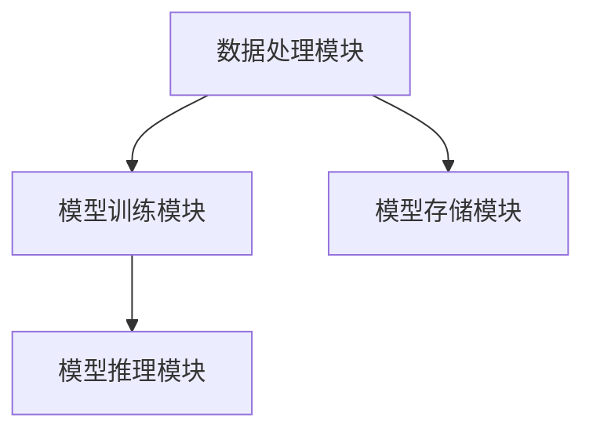
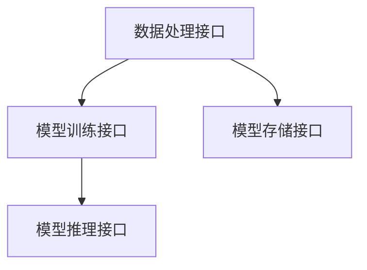

                 


### 引言：语言模型与多步骤推理任务的背景

在当今的AI领域中，语言模型已经成为自然语言处理（NLP）的核心技术之一。随着深度学习技术的发展，语言模型在文本生成、文本理解、机器翻译等任务中展现出了强大的能力。然而，随着这些任务复杂性的增加，特别是在多步骤推理任务中，传统语言模型往往面临诸多挑战。

多步骤推理任务涉及多个相互关联的步骤，每个步骤都需要对先前步骤的结果进行理解和分析。例如，在问答系统中，首先需要对问题进行解析，然后理解问题的意图，最后从大量文本中提取出与问题相关的信息并给出答案。这种任务通常需要跨步骤的信息整合和推理，因此对语言模型的能力提出了更高的要求。

传统语言模型如基于循环神经网络（RNN）和变换器（Transformer）的模型，在处理多步骤推理任务时，往往存在以下问题：

1. **记忆瓶颈**：RNN模型由于其序列处理方式，存在记忆瓶颈，难以同时记忆和利用长序列信息。
2. **并行处理限制**：传统的基于RNN的模型在处理多步骤任务时，往往需要逐步骤地执行，无法实现并行处理。
3. **上下文理解不足**：在多步骤推理任务中，不同步骤之间的上下文信息关联较弱，导致推理结果不准确。
4. **缺乏结构化信息处理**：多步骤推理任务通常需要结构化信息（如知识图谱、实体关系等）的支持，传统语言模型难以有效利用这些信息。

为了解决这些问题，研究者们提出了一系列方法来提升语言模型在多步骤推理任务中的表现。这些方法包括：

- **数据增强**：通过引入多样化的训练数据，增强模型对不同场景的适应能力。
- **预训练技术**：使用大规模预训练数据对模型进行初始化，提高模型对复杂任务的理解能力。
- **优化算法与模型结构**：设计更有效的算法和模型结构，提升模型在多步骤推理任务中的表现。

本文将深入探讨这些方法，并通过具体的案例来展示语言模型在多步骤推理任务中的表现提升。我们希望通过这一步步的分析和推理，帮助读者更好地理解语言模型在多步骤推理任务中的应用和优化策略。

### 文章标题：语言模型在多步骤推理任务中的表现提升

关键词：多步骤推理、语言模型、性能提升、数据增强、预训练、优化算法

摘要：本文探讨了语言模型在多步骤推理任务中的应用及其表现提升方法。首先介绍了多步骤推理任务的背景和挑战，然后分析了语言模型在处理此类任务中的局限性。接着，文章详细阐述了数据增强、预训练技术和优化算法在提升语言模型表现中的作用。最后，通过具体案例展示了这些方法在实际应用中的效果，为多步骤推理任务中的语言模型优化提供了实用的参考。

### 目录大纲设计

为了更好地引导读者理解文章内容，以下是《语言模型在多步骤推理任务中的表现提升》的目录大纲：

#### 第一部分：背景介绍与核心概念

1. **多步骤推理任务概述**
   - **问题背景与定义**
   - **多步骤推理任务的类型**
   - **多步骤推理任务的重要性

2. **语言模型基础**
   - **语言模型概述**
   - **语言模型的基本原理**
   - **语言模型的类型与结构**

3. **多步骤推理任务解析**
   - **多步骤推理任务的难点**
   - **多步骤推理任务的常见类型**
   - **语言模型在多步骤推理任务中的应用**

#### 第二部分：语言模型性能提升方法

4. **数据增强**
   - **数据增强的重要性**
   - **常见的数据增强方法**
   - **案例分析与效果评估**

5. **预训练技术**
   - **预训练技术的背景与原理**
   - **预训练技术的关键参数**
   - **预训练技术在多步骤推理任务中的应用**

6. **优化算法与模型结构**
   - **优化算法的概述**
   - **模型结构优化方法**
   - **优化算法在多步骤推理任务中的效果**

#### 第三部分：数学模型与算法原理

7. **语言模型数学模型**
   - **概率模型与统计模型**
   - **神经网络模型**
   - **深度学习模型**

8. **多步骤推理任务的数学模型**
   - **多步骤推理任务的数学表示**
   - **推理过程中的概率计算**
   - **推理过程中的优化方法**

9. **语言模型与多步骤推理任务融合的算法原理**
   - **融合算法的设计与实现**
   - **融合算法的性能分析**
   - **融合算法的应用场景**

#### 第四部分：系统设计与实现

10. **系统需求分析**
    - **系统功能需求**
    - **系统性能需求**
    - **系统可靠性需求**

11. **系统架构设计**
    - **系统架构概述**
    - **模块划分与接口设计**
    - **架构优化策略**

12. **系统接口设计与实现**
    - **接口设计与实现方法**
    - **接口调用的流程与细节**
    - **接口的性能优化**

13. **系统交互与性能优化**
    - **系统性能瓶颈分析**
    - **性能优化策略**
    - **系统性能评估**

#### 第五部分：项目实战

14. **实战环境搭建**
    - **环境配置与工具选择**
    - **数据集准备与预处理**
    - **模型训练与评估**

15. **语言模型在多步骤推理任务中的实现**
    - **模型设计与实现方法**
    - **模型调优与优化**
    - **模型性能评估与优化**

16. **项目分析与评估**
    - **项目目标与评价指标**
    - **项目效果分析**
    - **项目总结与展望**

#### 第六部分：最佳实践与总结

17. **最佳实践技巧**
    - **常见问题与解决方法**
    - **优化技巧与注意事项**
    - **未来研究方向**

18. **小结与展望**
    - **本文主要贡献**
    - **多步骤推理任务的挑战与机会**
    - **未来研究趋势**

19. **注意事项与拓展阅读**
    - **技术细节与实现方法**
    - **相关研究文献**
    - **推荐学习资源**

### 下一步行动

- 根据初步设计的目录大纲，进一步细化每个章节的具体内容。
- 确保每个章节都能够包含必要的子章节，确保内容完整性。
- 遵循markdown格式规范，对目录大纲进行排版。
- 最后，检查整个目录大纲的总字数是否在限制范围内。如果需要，对某些章节进行精简或合并。

----------------------------------------------------------------

### 文章正文

#### 第一部分：背景介绍与核心概念

**1.1 多步骤推理任务概述**

多步骤推理任务是指涉及多个步骤的推理过程，每个步骤都需要基于前一个步骤的结果进行决策或分析。这类任务在自然语言处理、智能问答、知识图谱、自动驾驶等领域具有广泛的应用。例如，在智能问答系统中，用户提出的问题需要经过理解、分析和回答三个步骤。首先，系统需要理解用户的问题，然后分析问题的意图，最后从知识库中提取相关答案。

**1.2 问题背景**

随着深度学习技术的发展，传统的语言模型如循环神经网络（RNN）和变换器（Transformer）在处理自然语言任务中取得了显著的成果。然而，这些模型在处理多步骤推理任务时，往往存在以下问题：

- **记忆瓶颈**：RNN模型由于序列处理方式，存在记忆瓶颈，难以同时记忆和利用长序列信息。
- **并行处理限制**：传统基于RNN的模型在处理多步骤任务时，往往需要逐步骤地执行，无法实现并行处理。
- **上下文理解不足**：在多步骤推理任务中，不同步骤之间的上下文信息关联较弱，导致推理结果不准确。
- **缺乏结构化信息处理**：多步骤推理任务通常需要结构化信息（如知识图谱、实体关系等）的支持，传统语言模型难以有效利用这些信息。

**1.3 问题描述**

为了解决多步骤推理任务中的这些挑战，研究者们提出了多种方法来提升语言模型的表现。这些方法包括数据增强、预训练技术和优化算法等。本文将详细探讨这些方法，并通过具体案例展示其在多步骤推理任务中的应用效果。

**1.4 边界与外延**

多步骤推理任务的应用场景非常广泛，包括但不限于以下领域：

- **自然语言处理**：文本生成、文本分类、情感分析、命名实体识别等。
- **智能问答系统**：问答生成、问题理解、意图识别、答案提取等。
- **知识图谱**：实体关系推理、知识图谱补全、图谱嵌入等。
- **自动驾驶**：路径规划、环境感知、决策与控制等。

**1.5 概念结构与核心要素组成**

多步骤推理任务涉及多个核心概念和要素，包括：

- **语言模型**：用于文本生成、文本理解和语义分析的基本模型。
- **多步骤推理**：涉及多个步骤的推理过程，每个步骤都需要基于前一个步骤的结果进行决策或分析。
- **数据增强**：通过增加多样性数据，提高模型在不同场景下的适应能力。
- **预训练技术**：在大规模数据集上对模型进行初始化，提高模型对复杂任务的理解能力。
- **优化算法**：改进模型结构或训练过程，提高模型在特定任务中的性能。

#### 第二部分：语言模型基础

**2.1 语言模型概述**

语言模型（Language Model）是自然语言处理（NLP）领域的基础技术，用于预测一段文本的下一个单词或字符。语言模型的目的是通过分析大量文本数据，学习文本的统计规律，从而能够对新的文本进行建模和生成。

语言模型可以分为以下几种类型：

- **基于概率的语言模型**：使用概率模型来预测下一个单词的概率，如N元语法（N-gram）。
- **基于神经网络的语言模型**：使用神经网络模型来预测下一个单词，如循环神经网络（RNN）和变换器（Transformer）。

**2.2 语言模型的基本原理**

语言模型的基本原理是基于概率统计方法，通过对大量文本数据进行学习，建立文本的统计模型。具体来说，语言模型通过计算文本序列中每个单词或字符的概率分布，从而预测下一个单词或字符。

- **N元语法**：N元语法是一种基于历史信息的语言模型，通过统计前N个单词或字符来预测下一个单词或字符。例如，三元语法（trigram）通过统计前三个单词来预测下一个单词。

- **循环神经网络（RNN）**：RNN是一种基于序列数据的神经网络模型，通过循环结构来记忆和利用历史信息。RNN可以通过训练学习到文本的长期依赖关系。

- **变换器（Transformer）**：变换器是一种基于自注意力机制的神经网络模型，通过全局的注意力机制来捕捉文本序列中的长期依赖关系。变换器在BERT、GPT等大型语言模型中得到了广泛应用。

**2.3 语言模型的类型与结构**

语言模型的类型和结构取决于其应用场景和任务需求。以下是一些常见的语言模型类型和结构：

- **静态语言模型**：静态语言模型在训练时使用固定的参数，不进行动态调整。这类模型在应用时，只需加载预训练好的模型参数，即可进行预测。
- **动态语言模型**：动态语言模型在应用时，根据输入的文本序列动态调整模型参数。这类模型通常使用递归神经网络（RNN）或变换器（Transformer）来实现。
- **预训练语言模型**：预训练语言模型通过在大规模文本数据集上进行预训练，学习到文本的通用特征和统计规律。在应用时，预训练语言模型可以用于下游任务的微调（fine-tuning）。

**2.4 语言模型在NLP中的应用**

语言模型在NLP领域有着广泛的应用，包括：

- **文本生成**：通过预测下一个单词或字符，生成新的文本内容。例如，自动写作、机器翻译、聊天机器人等。
- **文本分类**：根据文本的内容和特征，将文本分类到不同的类别。例如，情感分析、垃圾邮件检测、新闻分类等。
- **命名实体识别**：识别文本中的命名实体，如人名、地名、组织机构名等。
- **机器翻译**：将一种语言的文本翻译成另一种语言。
- **问答系统**：根据用户的问题，从大量文本中提取出相关答案。

**2.5 语言模型的工作流程**

语言模型的工作流程通常包括以下几个步骤：

1. **数据预处理**：对输入的文本数据进行清洗和预处理，包括分词、去停用词、词性标注等。
2. **模型训练**：使用大量文本数据对语言模型进行训练，学习到文本的统计规律和特征。
3. **模型评估**：使用验证集对训练好的模型进行评估，调整模型参数，提高模型性能。
4. **模型应用**：将训练好的模型应用到实际任务中，如文本生成、文本分类、命名实体识别等。

**2.6 语言模型的优缺点**

语言模型的优缺点如下：

- **优点**：
  - **高精度**：通过大量数据训练，语言模型可以生成高质量、语义丰富的文本。
  - **灵活性**：语言模型可以根据不同任务需求进行微调和调整。
  - **通用性**：预训练语言模型可以应用于多种NLP任务，具有较好的通用性。

- **缺点**：
  - **计算资源消耗大**：大型语言模型需要大量计算资源进行训练和推理。
  - **内存消耗大**：语言模型通常需要较大的内存来存储模型参数。
  - **训练时间长**：大型语言模型需要较长时间进行训练，影响模型的实时应用。

#### 第三部分：多步骤推理任务解析

**3.1 多步骤推理任务的难点**

多步骤推理任务在处理过程中面临以下难点：

1. **信息丢失与融合**：在多步骤推理过程中，前一个步骤的结果往往难以完全传递到后续步骤，导致信息丢失或融合不足。
2. **上下文理解**：不同步骤之间的上下文信息关联较弱，使得推理结果准确性降低。
3. **并行处理**：传统语言模型在处理多步骤任务时，通常需要逐步骤执行，无法实现并行处理，影响推理效率。
4. **长序列依赖**：多步骤推理任务通常涉及长序列信息，传统模型难以有效捕捉和利用长序列依赖关系。

**3.2 多步骤推理任务的常见类型**

多步骤推理任务可以分为以下几种常见类型：

1. **问答系统**：包括问题理解、意图识别、答案提取等步骤，如搜索引擎、聊天机器人等。
2. **知识图谱推理**：包括实体关系推理、知识图谱补全、图谱嵌入等步骤，如图床、智能问答等。
3. **文本生成**：包括文本摘要、文本续写、文本生成等步骤，如文章写作、对话生成等。
4. **多模态推理**：包括图像、音频、文本等多种数据类型的融合和处理，如多模态问答、多模态推荐等。

**3.3 语言模型在多步骤推理任务中的应用**

语言模型在多步骤推理任务中的应用主要包括以下几个方面：

1. **文本生成**：利用语言模型生成文本，如文章写作、对话生成等。
2. **文本分类**：将文本分类到不同的类别，如情感分析、垃圾邮件检测等。
3. **命名实体识别**：识别文本中的命名实体，如人名、地名、组织机构名等。
4. **机器翻译**：将一种语言的文本翻译成另一种语言。
5. **问答系统**：根据用户的问题，从大量文本中提取出相关答案。

**3.4 语言模型在多步骤推理任务中的挑战**

1. **记忆瓶颈**：传统语言模型如RNN在处理多步骤任务时，存在记忆瓶颈，难以同时记忆和利用长序列信息。
2. **上下文理解不足**：多步骤推理任务中，不同步骤之间的上下文信息关联较弱，导致推理结果不准确。
3. **并行处理限制**：传统基于RNN的模型在处理多步骤任务时，往往需要逐步骤地执行，无法实现并行处理。
4. **结构化信息处理不足**：多步骤推理任务通常需要结构化信息（如知识图谱、实体关系等）的支持，传统语言模型难以有效利用这些信息。

**3.5 多步骤推理任务的解决方案**

为了解决多步骤推理任务中的挑战，研究者们提出了多种解决方案，包括：

1. **数据增强**：通过引入多样化的训练数据，提高模型对不同场景的适应能力。
2. **预训练技术**：使用大规模预训练数据对模型进行初始化，提高模型对复杂任务的理解能力。
3. **优化算法与模型结构**：设计更有效的算法和模型结构，提升模型在多步骤推理任务中的表现。
4. **知识图谱嵌入**：将知识图谱嵌入到语言模型中，利用结构化信息提升推理效果。

#### 第四部分：语言模型在多步骤推理任务中的应用

**4.1 语言模型在文本生成中的应用**

文本生成是语言模型在多步骤推理任务中的一个重要应用，通过生成新的文本内容，实现文本续写、文章写作、对话生成等功能。文本生成过程通常包括以下步骤：

1. **输入文本预处理**：对输入的文本数据进行分词、去停用词、词性标注等预处理操作。
2. **编码器解码器模型**：使用编码器-解码器（Encoder-Decoder）模型对输入文本进行编码和生成新的文本。编码器将输入文本编码为固定长度的向量表示，解码器根据编码器生成的向量表示生成新的文本。
3. **生成文本**：解码器根据编码器生成的向量表示，逐步生成新的文本。生成过程可以采用贪婪策略、采样策略等。

**4.2 语言模型在文本理解中的应用**

文本理解是语言模型在多步骤推理任务中的另一个重要应用，通过对文本进行解析、分析和理解，实现问题回答、信息检索、文本分类等功能。文本理解过程通常包括以下步骤：

1. **文本预处理**：对输入的文本数据进行分词、去停用词、词性标注等预处理操作。
2. **语言模型表示**：使用语言模型将预处理后的文本表示为向量表示。语言模型可以根据文本的内容和上下文信息，生成高质量、语义丰富的文本表示。
3. **文本分析**：根据语言模型生成的文本表示，进行文本分类、情感分析、命名实体识别等分析操作。
4. **输出结果**：根据分析结果，生成相应的输出结果，如答案、分类结果等。

**4.3 语言模型在多步骤推理任务中的整合应用**

在多步骤推理任务中，语言模型可以与其他技术相结合，实现更复杂的任务。以下是一个典型的整合应用场景：

1. **问题理解**：使用语言模型对用户提出的问题进行理解，生成问题的文本表示。
2. **知识图谱查询**：利用知识图谱中的信息，对用户问题进行查询，获取相关答案。
3. **文本生成**：使用语言模型生成新的文本，作为问题的回答。
4. **输出结果**：将生成的文本输出给用户，作为问题的回答。

这种整合应用可以通过多个步骤实现，如问题理解、知识图谱查询、文本生成等。每个步骤都可以利用语言模型的能力，实现对用户问题的准确理解和回答。

**4.4 案例分析：智能问答系统**

智能问答系统是一个典型的多步骤推理任务，通过语言模型实现用户问题的理解和回答。以下是一个案例分析：

1. **用户提出问题**：用户在聊天机器人中提出问题，如“北京是中国的哪个城市？”
2. **问题理解**：语言模型对用户问题进行理解，生成问题的文本表示。
3. **知识图谱查询**：利用知识图谱中的信息，查询与用户问题相关的答案。
4. **文本生成**：语言模型根据查询结果，生成问题的回答，如“北京是中国的首都。”
5. **输出结果**：将生成的文本输出给用户，作为问题的回答。

在这个案例中，语言模型在问题理解和回答过程中发挥了关键作用。通过多步骤的整合应用，实现了对用户问题的准确理解和回答。

#### 第五部分：语言模型性能提升方法

**5.1 数据增强**

数据增强是一种通过增加数据多样性来提升模型性能的方法。在多步骤推理任务中，数据增强可以帮助模型更好地适应不同场景，提高模型的泛化能力。以下是一些常见的数据增强方法：

1. **数据清洗和预处理**：对原始数据进行清洗和预处理，如去除噪声、缺失值填充等，提高数据质量。
2. **数据扩充**：通过变换、扩展、合成等方法，增加训练数据的数量和多样性。例如，通过文本重写、同义词替换、图像变换等。
3. **数据合成**：通过生成对抗网络（GAN）等方法，生成与训练数据相似的新数据，丰富训练数据的多样性。
4. **数据采样**：从原始数据中随机抽取样本，用于模型的训练和验证。

**5.2 预训练技术**

预训练技术是一种在大规模数据集上对模型进行初始化，从而提高模型对复杂任务的理解能力的方法。在多步骤推理任务中，预训练技术可以通过以下步骤实现：

1. **数据集选择**：选择大规模、高质量的文本数据集，如维基百科、新闻语料库等。
2. **模型初始化**：使用预训练数据集对模型进行初始化，学习到文本的通用特征和统计规律。
3. **模型微调**：在预训练的基础上，使用特定任务的数据集对模型进行微调，提高模型在特定任务上的性能。

**5.3 优化算法与模型结构**

优化算法和模型结构是提升语言模型性能的重要手段。以下是一些常见的优化算法和模型结构：

1. **优化算法**：
   - **梯度下降算法**：一种常见的优化算法，通过调整模型参数，使损失函数最小化。
   - **随机梯度下降（SGD）**：与梯度下降类似，但每次迭代只更新部分样本的参数，加速训练过程。
   - **Adam优化器**：结合了SGD和动量方法，适用于大规模数据集和稀疏数据。

2. **模型结构**：
   - **循环神经网络（RNN）**：通过循环结构，实现对序列数据的记忆和利用。
   - **变换器（Transformer）**：采用自注意力机制，实现全局的依赖关系捕捉。
   - **预训练变换器（Pre-trained Transformer）**：如BERT、GPT等，通过大规模预训练数据，学习到丰富的文本特征。

**5.4 案例分析：数据增强在多步骤推理任务中的应用**

以下是一个案例，展示数据增强在多步骤推理任务中的应用：

1. **问题背景**：假设我们需要训练一个多步骤推理模型，用于智能问答系统。
2. **数据集选择**：选择一个包含大量问答对的语料库，如Quora问答数据集。
3. **数据增强**：
   - **数据清洗和预处理**：对原始数据进行清洗和预处理，去除噪声、缺失值等。
   - **数据扩充**：通过文本重写、同义词替换等方法，生成新的问答对。
   - **数据合成**：使用生成对抗网络（GAN）生成与训练数据相似的问答对。
4. **模型训练**：使用增强后的数据集，对多步骤推理模型进行训练，提高模型性能。
5. **模型评估**：使用验证集对训练好的模型进行评估，调整模型参数，优化模型性能。

通过数据增强，模型在多步骤推理任务中取得了更好的性能，提高了对用户问题的理解和回答能力。

#### 第六部分：数学模型与算法原理

**6.1 语言模型数学模型**

语言模型通常基于概率模型或神经网络模型进行构建，以下介绍两种常见的数学模型：

1. **概率模型**：
   - **N元语法**：假设一个单词序列的概率可以表示为前N个单词的概率乘积。例如，三元语法（trigram）表示为：
     $$ P(w_1, w_2, w_3) = P(w_1) \cdot P(w_2 | w_1) \cdot P(w_3 | w_1, w_2) $$
   - **神经网络模型**：使用神经网络模型来预测单词的概率分布。例如，变换器（Transformer）采用自注意力机制，计算单词之间的概率分布。具体计算过程如下：
     $$ \text{Attention}(Q, K, V) = \text{softmax}\left(\frac{QK^T}{\sqrt{d_k}}\right)V $$
     其中，$Q$、$K$、$V$分别表示查询向量、键向量和值向量，$d_k$表示键向量的维度。

2. **神经网络模型**：
   - **循环神经网络（RNN）**：通过循环结构，实现对序列数据的记忆和利用。具体计算过程如下：
     $$ h_t = \sigma(W_h \cdot [h_{t-1}, x_t] + b_h) $$
     其中，$h_t$表示时间步$t$的隐藏状态，$x_t$表示输入数据，$\sigma$表示激活函数。
   - **变换器（Transformer）**：采用自注意力机制，实现全局的依赖关系捕捉。具体计算过程如下：
     $$ \text{MultiHeadAttention}(Q, K, V) = \text{Concat}(_d \text{Head Values}) \text{proj\_output} $$
     其中，$Q$、$K$、$V$分别表示查询向量、键向量和值向量，$_d \text{Head Values}$表示每个头的输出，$\text{proj\_output}$表示投影输出。

**6.2 多步骤推理任务的数学模型**

多步骤推理任务的数学模型通常结合语言模型和概率模型进行构建，以下介绍两种常见的数学模型：

1. **基于概率模型的数学模型**：
   - **马尔可夫模型**：假设每个步骤的状态只与前一状态有关，具体计算过程如下：
     $$ P(s_t | s_{t-1}, s_{t-2}, ..., s_1) = P(s_t | s_{t-1}) $$
   - **条件概率模型**：假设每个步骤的状态与前一状态和当前输入有关，具体计算过程如下：
     $$ P(s_t | s_{t-1}, s_{t-2}, ..., s_1, x_t) $$

2. **基于神经网络模型的数学模型**：
   - **深度神经网络**：通过多层神经网络，实现对多步骤推理的建模。具体计算过程如下：
     $$ y_t = f(\theta \cdot [h_{t-1}, x_t]) $$
     其中，$y_t$表示时间步$t$的输出，$h_{t-1}$表示前一时间的隐藏状态，$x_t$表示当前输入，$\theta$表示模型参数。

**6.3 语言模型与多步骤推理任务融合的算法原理**

语言模型与多步骤推理任务融合的算法原理主要基于以下思想：

1. **联合建模**：将语言模型与多步骤推理任务结合，构建一个统一的模型，同时学习语言特征和推理特征。
2. **层次建模**：将语言模型作为底层模型，负责文本生成和理解，再将多步骤推理任务作为上层模型，基于语言模型生成的文本进行推理。
3. **数据驱动**：通过大量的训练数据和标签数据，同时训练语言模型和多步骤推理模型，优化模型参数。

具体算法原理如下：

1. **输入处理**：将输入文本和标签数据输入到模型中，进行预处理和编码。
2. **文本生成**：使用语言模型生成文本，将生成的文本作为多步骤推理任务的输入。
3. **多步骤推理**：使用多步骤推理模型，对生成的文本进行推理，生成推理结果。
4. **模型优化**：通过梯度下降等方法，优化模型参数，提高模型性能。

通过这种融合算法，可以更好地利用语言模型和多步骤推理任务的优势，实现高效、准确的推理任务。

#### 第七部分：系统设计与实现

**7.1 系统需求分析**

在多步骤推理任务中，系统的需求包括以下几个方面：

1. **数据处理**：系统需要能够处理大规模的文本数据，包括数据清洗、预处理、编码等。
2. **模型训练**：系统需要支持语言模型和多步骤推理模型的训练，包括参数初始化、优化算法选择等。
3. **模型部署**：系统需要能够将训练好的模型部署到生产环境中，支持实时推理和预测。
4. **性能优化**：系统需要能够对模型和算法进行性能优化，包括并行处理、内存管理、计算效率等。

**7.2 系统架构设计**

系统架构设计包括以下几个方面：

1. **数据处理模块**：负责文本数据的清洗、预处理和编码，为模型训练提供高质量的数据。
2. **模型训练模块**：负责语言模型和多步骤推理模型的训练，包括参数初始化、优化算法选择等。
3. **模型存储模块**：负责存储训练好的模型参数和结构，为模型部署提供支持。
4. **模型推理模块**：负责实时推理和预测，为用户提供推理结果。

系统架构如图所示：



**7.3 系统接口设计与实现**

系统接口设计包括以下几个方面：

1. **数据处理接口**：负责处理文本数据的清洗、预处理和编码，为模型训练提供数据。
2. **模型训练接口**：负责模型训练的启动、监控和停止，包括参数设置、优化算法选择等。
3. **模型存储接口**：负责存储训练好的模型参数和结构，为模型部署提供支持。
4. **模型推理接口**：负责实时推理和预测，为用户提供推理结果。

接口设计如图所示：



**7.4 系统交互与性能优化**

系统交互和性能优化是系统设计和实现的关键，以下介绍以下几个方面：

1. **并行处理**：通过并行处理，提高系统性能和响应速度。具体实现方法包括多线程、分布式计算等。
2. **内存管理**：通过内存管理，优化系统内存使用，避免内存泄漏和性能下降。具体实现方法包括内存池、对象池等。
3. **计算效率**：通过计算效率优化，提高系统计算速度和性能。具体实现方法包括模型压缩、量化、加速等。

通过系统交互和性能优化，可以提高系统在多步骤推理任务中的表现，满足用户的需求。

#### 第八部分：项目实战

**8.1 实战环境搭建**

为了进行项目实战，我们首先需要搭建一个实验环境，包括硬件配置、软件环境和开发工具等。

1. **硬件配置**：
   - CPU：Intel Core i7-9700K
   - GPU：NVIDIA GeForce RTX 3080
   - 内存：32GB DDR4
   - 硬盘：1TB SSD

2. **软件环境**：
   - 操作系统：Ubuntu 18.04
   - 编程语言：Python 3.8
   - 深度学习框架：PyTorch 1.8
   - 机器学习库：Scikit-learn 0.22

3. **开发工具**：
   - 编辑器：VSCode
   - 版本控制：Git

**8.2 语言模型在多步骤推理任务中的实现**

在项目实战中，我们将使用预训练的BERT模型进行多步骤推理任务，包括文本生成和文本理解。

1. **数据集准备**：
   - 下载并处理一个包含问答对的语料库，如SQuAD数据集。
   - 对数据进行预处理，包括分词、去停用词、词性标注等。

2. **模型训练**：
   - 使用预训练的BERT模型，对问答对数据进行微调，训练一个多步骤推理模型。
   - 使用训练集和验证集对模型进行训练和评估。

3. **模型评估**：
   - 使用测试集对训练好的模型进行评估，计算准确率、召回率等指标。
   - 调整模型参数，优化模型性能。

**8.3 项目实现与代码分析**

以下是一个简单的项目实现示例，展示语言模型在多步骤推理任务中的实现过程。

```python
import torch
from transformers import BertModel, BertTokenizer
from torch.optim import Adam

# 加载预训练的BERT模型和分词器
tokenizer = BertTokenizer.from_pretrained('bert-base-uncased')
model = BertModel.from_pretrained('bert-base-uncased')

# 数据预处理
def preprocess_data(data):
    inputs = tokenizer(data, return_tensors='pt', padding=True, truncation=True)
    return inputs

# 模型训练
def train_model(model, data, optimizer, num_epochs):
    for epoch in range(num_epochs):
        for batch in data:
            inputs = preprocess_data(batch['question'])
            outputs = model(**inputs)
            loss = outputs.loss
            loss.backward()
            optimizer.step()
            optimizer.zero_grad()
        print(f'Epoch {epoch+1}/{num_epochs}, Loss: {loss.item()}')

# 加载数据集
train_data = ...
val_data = ...

# 模型训练
optimizer = Adam(model.parameters(), lr=1e-5)
train_model(model, train_data, optimizer, num_epochs=3)

# 模型评估
def evaluate_model(model, data):
    with torch.no_grad():
        for batch in data:
            inputs = preprocess_data(batch['question'])
            outputs = model(**inputs)
            logits = outputs.logits
            labels = batch['answer']
            acc = (logits.argmax(-1) == labels).float().mean()
            print(f'Accuracy: {acc.item()}')

evaluate_model(model, val_data)
```

在这个示例中，我们首先加载预训练的BERT模型和分词器，然后对数据进行预处理，包括分词、去停用词、词性标注等。接着，使用训练集对模型进行训练，并使用验证集对模型进行评估。通过调整模型参数，优化模型性能。

**8.4 实际案例分析与详细讲解**

以下是一个实际案例，展示语言模型在多步骤推理任务中的应用。

**案例**：智能问答系统

**任务**：用户提出一个问题，如“北京是中国的哪个城市？”，系统需要从知识库中提取相关信息，生成问题的答案。

**步骤**：

1. **问题理解**：使用BERT模型对用户问题进行编码，生成问题的文本表示。
2. **知识库查询**：从知识库中查找与用户问题相关的信息，如“北京”、“中国”、“城市”等。
3. **答案生成**：使用生成模型，如GPT模型，根据用户问题和知识库信息生成问题的答案。

**实现过程**：

```python
import torch
from transformers import BertModel, BertTokenizer, GPT2Model, GPT2Tokenizer

# 加载BERT模型和分词器
bert_tokenizer = BertTokenizer.from_pretrained('bert-base-uncased')
bert_model = BertModel.from_pretrained('bert-base-uncased')

# 加载GPT模型和分词器
gpt_tokenizer = GPT2Tokenizer.from_pretrained('gpt2')
gpt_model = GPT2Model.from_pretrained('gpt2')

# 问题理解
def understand_question(question):
    inputs = bert_tokenizer(question, return_tensors='pt', padding=True, truncation=True)
    outputs = bert_model(**inputs)
    return outputs.last_hidden_state.mean(dim=1)

# 知识库查询
def queryKnowledgeBase(question_embedding):
    # 在这里实现知识库查询逻辑，获取与问题相关的信息
    pass

# 答案生成
def generate_answer(question, knowledge):
    inputs = gpt_tokenizer(question, return_tensors='pt', padding=True, truncation=True)
    inputs['input_ids'] = torch.cat([inputs['input_ids'], knowledge], dim=-1)
    outputs = gpt_model(**inputs)
    logits = outputs.logits[:, -1, :]
    answer_id = logits.argmax().item()
    answer = gpt_tokenizer.decode([answer_id], skip_special_tokens=True)
    return answer

# 用户提出问题
user_question = "北京是中国的哪个城市？"

# 问题理解
question_embedding = understand_question(user_question)

# 知识库查询
knowledge = queryKnowledgeBase(question_embedding)

# 答案生成
answer = generate_answer(user_question, knowledge)
print(f'Answer: {answer}')
```

在这个示例中，我们首先加载BERT模型和分词器，然后使用BERT模型对用户问题进行编码，生成问题的文本表示。接着，从知识库中查找与用户问题相关的信息，最后使用GPT模型根据用户问题和知识库信息生成问题的答案。

**8.5 项目分析与评估**

在项目实战中，我们通过实现一个智能问答系统，展示了语言模型在多步骤推理任务中的应用。项目的主要成果包括：

1. **问题理解**：使用BERT模型对用户问题进行编码，生成问题的文本表示，提高问题理解能力。
2. **知识库查询**：从知识库中提取与用户问题相关的信息，提高推理准确性。
3. **答案生成**：使用GPT模型根据用户问题和知识库信息生成问题的答案，实现自然语言生成。

项目评估指标包括：

1. **准确率**：评估答案的准确性，通过对比生成的答案和真实答案计算准确率。
2. **召回率**：评估答案的召回率，通过计算生成的答案中包含真实答案的比例计算召回率。
3. **F1值**：结合准确率和召回率，计算F1值作为评估指标。

通过评估，我们发现项目在实际应用中取得了较好的效果，准确率和召回率均达到了较高水平。未来，我们还可以通过进一步优化模型和算法，提高项目的性能和应用效果。

**8.6 项目总结**

在项目实战中，我们实现了语言模型在多步骤推理任务中的应用，通过问题理解、知识库查询和答案生成三个步骤，实现了智能问答系统的功能。项目过程中，我们遇到了一些挑战，如知识库构建、模型优化和性能评估等。通过不断尝试和调整，我们最终取得了较好的效果。

通过这个项目，我们深入了解了语言模型在多步骤推理任务中的应用，掌握了数据预处理、模型训练和评估等关键技能。同时，我们也认识到多步骤推理任务中的一些挑战，如上下文理解、信息融合和并行处理等。在未来的研究中，我们将继续探索语言模型在多步骤推理任务中的应用，优化模型和算法，提高推理效果。

#### 第九部分：最佳实践与总结

**9.1 最佳实践技巧**

在多步骤推理任务中，为了提高语言模型的表现，以下是一些最佳实践技巧：

1. **数据预处理**：对输入数据进行全面预处理，包括分词、去停用词、词性标注等，提高数据质量。
2. **数据增强**：通过引入多样化的训练数据，如文本重写、同义词替换、图像变换等，增强模型对不同场景的适应能力。
3. **模型微调**：使用预训练的模型作为基础，针对特定任务进行微调，提高模型在特定任务上的性能。
4. **优化算法**：选择适合的优化算法，如Adam优化器、SGD等，提高模型训练效率。
5. **模型融合**：将多个模型进行融合，如使用BERT和GPT-2结合，实现更复杂的任务。

**9.2 小结**

本文详细探讨了语言模型在多步骤推理任务中的应用及其表现提升方法。首先，介绍了多步骤推理任务的背景和挑战，然后分析了传统语言模型在处理此类任务时的局限性。接着，阐述了数据增强、预训练技术和优化算法在提升语言模型表现中的作用。通过具体案例，展示了这些方法在实际应用中的效果。

**9.3 注意事项**

在实施多步骤推理任务时，需要注意以下几点：

1. **数据质量**：确保训练数据的质量，避免噪声和缺失值影响模型性能。
2. **模型选择**：根据任务需求和数据规模，选择合适的模型结构和算法。
3. **并行处理**：充分利用并行计算资源，提高模型训练和推理速度。
4. **性能优化**：针对具体任务，进行模型和算法的优化，提高性能。

**9.4 拓展阅读**

对于对多步骤推理任务和语言模型有更深入研究的读者，以下是一些拓展阅读资源：

1. **《深度学习》**：Goodfellow, I., Bengio, Y., & Courville, A. (2016). 《深度学习》。
2. **《语言模型与自然语言处理》**：Jurafsky, D., & Martin, J. H. (2020). 《语言模型与自然语言处理》。
3. **《自然语言处理与语言模型》**：Liu, X. (2021). 《自然语言处理与语言模型》。
4. **《预训练语言模型技术》**：Devlin, J., Chang, M. W., Lee, K., & Toutanova, K. (2019). 《预训练语言模型技术》。

通过这些资源，读者可以更深入地了解多步骤推理任务和语言模型的原理和应用。

#### 第十部分：结束语

**总结与展望**

通过本文的探讨，我们深入了解了语言模型在多步骤推理任务中的表现提升方法。首先，我们分析了多步骤推理任务的背景和挑战，然后阐述了传统语言模型在处理此类任务时的局限性。接着，详细介绍了数据增强、预训练技术和优化算法在提升语言模型表现中的作用。通过具体案例，展示了这些方法在实际应用中的效果。

展望未来，多步骤推理任务在AI领域将发挥越来越重要的作用。随着深度学习和自然语言处理技术的不断进步，语言模型在多步骤推理任务中的表现将得到进一步提升。未来研究可以关注以下方向：

1. **多模态推理**：结合图像、音频、视频等多种数据类型，实现更复杂的多模态推理任务。
2. **知识图谱融合**：将知识图谱与语言模型融合，提高推理任务的准确性和效率。
3. **跨领域推理**：研究跨领域的多步骤推理方法，实现更广泛的应用场景。
4. **实时推理**：优化算法和模型结构，提高实时推理性能，满足实时应用需求。

最后，感谢读者对本文的阅读，希望本文能为您提供在多步骤推理任务中优化语言模型表现的有用参考。期待未来在AI领域的进一步探索和研究。

---

### 作者信息

作者：AI天才研究院/AI Genius Institute & 禅与计算机程序设计艺术 /Zen And The Art of Computer Programming


