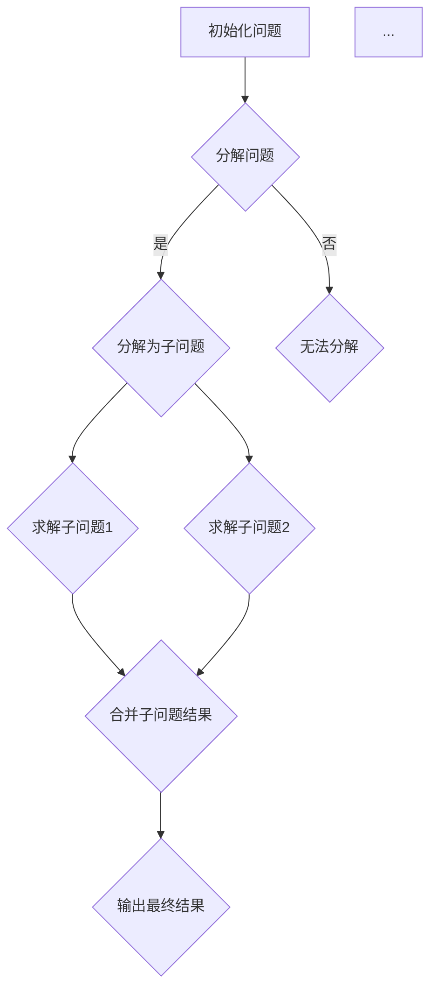
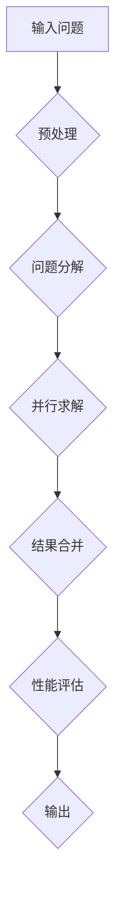
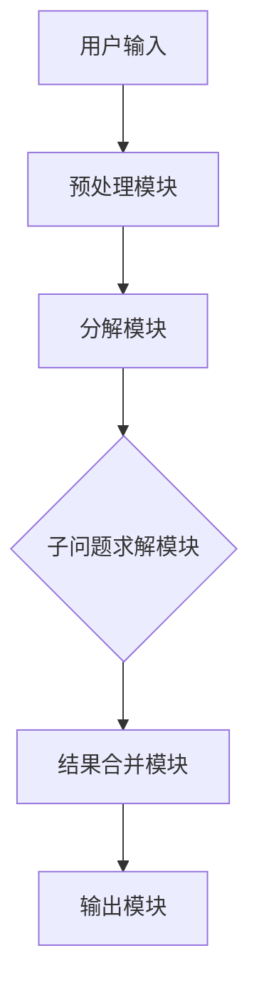
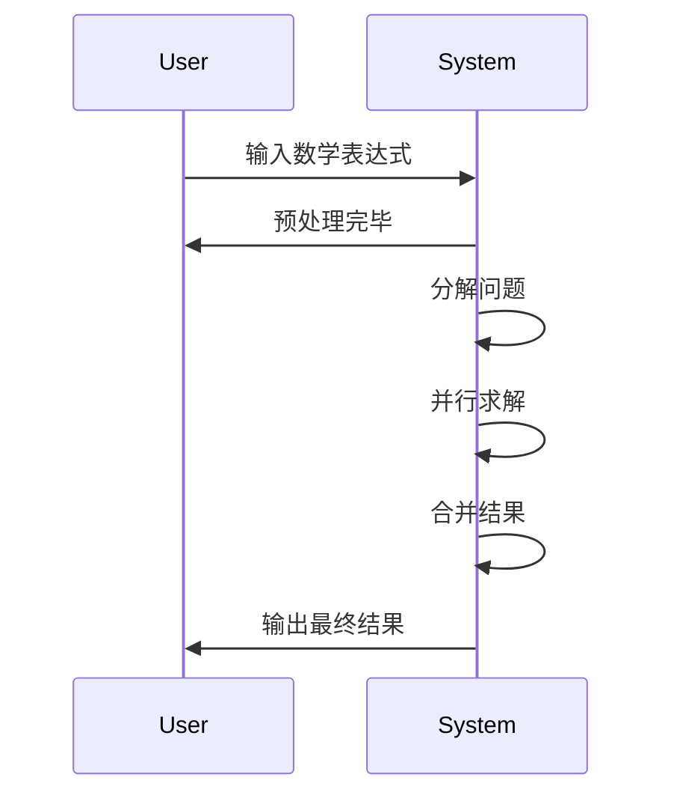

                 

# 语言模型在多步骤问题分解与并行求解中的能力评估

关键词：语言模型、多步骤问题分解、并行求解、能力评估

摘要：
本文探讨了语言模型在复杂问题解决中的角色，特别是其在多步骤问题分解和并行求解方面的能力。通过详细分析语言模型的原理、算法、系统设计以及实战应用，本文旨在为读者提供一个全面的视角，理解语言模型在这些关键领域中的潜力与限制。

## 引言与背景

### 1.1 语言模型的重要性

语言模型（Language Model，简称LM）是自然语言处理（Natural Language Processing，简称NLP）领域的关键技术。它通过统计学方法或深度学习算法，对自然语言中的词汇、语法和语义进行建模，从而预测下一个词或句子的可能性。随着深度学习技术的发展，语言模型的表现日益卓越，已经成为了许多NLP应用的核心组件，如机器翻译、文本生成、问答系统等。

### 1.2 多步骤问题分解

在解决复杂问题时，往往需要将问题分解成多个子问题，然后逐步解决。多步骤问题分解（Multi-step Problem Decomposition）是一种常用的策略，它允许将问题分解成可管理的部分，从而简化问题的复杂性。这种方法在工程、科学和人工智能等领域都有着广泛的应用。

### 1.3 并行求解

并行求解（Parallel Solving）是指利用多个计算资源同时处理多个子问题，以加速问题解决的过程。随着计算机硬件的不断发展，并行计算已经成为了提高计算效率的重要手段。在多步骤问题分解中，并行求解尤为关键，因为它可以在多个层次上并行处理子问题，从而显著提高整体解决效率。

## 核心概念与原理

### 2.1 语言模型类型比较

语言模型可以分为基于统计模型和基于神经网络的模型。以下是几种常见语言模型的对比：

| 模型类型         | 特点                                      | 优点                                      | 缺点                                      |
|----------------|-----------------------------------------|-----------------------------------------|-----------------------------------------|
| N-gram模型       | 基于历史计数，简单易实现                   | 预测准确性较高，计算效率高                  | 忽略长距离依赖，无法理解上下文语义               |
| 神经网络语言模型 | 基于深度学习，能够捕捉长距离依赖           | 预测准确性高，能够理解复杂语义               | 计算复杂度高，训练时间长                   |
| 变分自编码器（VAE） | 基于概率模型，能够生成多样化文本         | 能够生成多样化和创新的文本                  | 训练难度大，对数据质量要求高                 |
| 生成对抗网络（GAN） | 基于对抗性学习，能够生成高质量文本         | 能够生成高质量的文本，应用于文本生成任务       | 训练过程不稳定，对超参数敏感                 |

### 2.2 多步骤问题分解的ER实体关系图

在多步骤问题分解中，实体关系图（Entity-Relationship Diagram，简称ER图）可以帮助我们理解问题域的结构。以下是问题分解过程中涉及的主要实体和它们之间的关系：

```
┌─────────────┐
│    问题     │
└─────┬───────┘
     │
     │
┌─────▼───────┐
│  子问题1    │
└─────┬───────┘
     │
     │
┌─────▼───────┐
│  子问题2    │
└─────┬───────┘
     │
     │
┌─────▼───────┐
│  子问题n    │
└─────────────┘
```

### 2.3 多步骤问题分解的Mermaid流程图

为了更直观地展示多步骤问题分解的过程，我们可以使用Mermaid绘制一个流程图：



## 算法与数学模型

### 3.1 语言模型评价算法

为了评估语言模型在多步骤问题分解和并行求解中的能力，我们需要一个评价算法。以下是该算法的基本步骤：

1. **输入准备**：将输入问题表示为文本序列，并预处理成模型能够处理的形式。
2. **问题分解**：使用多步骤问题分解算法将输入问题分解成多个子问题。
3. **子问题求解**：对于每个子问题，使用并行求解算法求解。
4. **结果合并**：将子问题的求解结果合并成最终的输出。
5. **性能评估**：计算评估指标，如时间效率、准确性等，以评估语言模型的能力。

### 3.2 Mermaid流程图

以下是该算法的Mermaid流程图：



### 3.3 Python源代码示例

以下是一个简单的Python代码示例，展示了如何实现问题分解和并行求解：

```python
import concurrent.futures
import numpy as np

# 输入问题
problem = "求解以下数学问题：2 + 2 * 3"

# 预处理
def preprocess(problem):
    # 对问题进行分词、标注等预处理操作
    # 这里简化为直接返回问题文本
    return problem

# 问题分解
def decompose(problem):
    # 将问题分解为子问题
    # 这里简化为将问题拆分为单词
    return problem.split()

# 子问题求解
def solve_subproblem(subproblem):
    # 求解子问题，这里简化为计算乘法和加法
    if '*' in subproblem:
        return eval(subproblem)
    else:
        return sum(map(int, subproblem.split()))

# 并行求解
def parallel_solve(subproblems):
    # 使用并行计算求解子问题
    with concurrent.futures.ThreadPoolExecutor() as executor:
        results = list(executor.map(solve_subproblem, subproblems))
    return results

# 结果合并
def merge_results(results):
    # 将子问题结果合并成最终结果
    return sum(results)

# 性能评估
def evaluate(problem):
    # 评估语言模型性能
    preprocessed_problem = preprocess(problem)
    subproblems = decompose(preprocessed_problem)
    results = parallel_solve(subproblems)
    final_result = merge_results(results)
    return final_result

# 输出
print(evaluate(problem))
```

### 3.4 数学模型与公式

在多步骤问题分解和并行求解中，我们可以使用以下数学模型来评估性能：

$$
\text{时间效率} = \frac{\text{并行求解时间}}{\text{串行求解时间}}
$$

$$
\text{准确性} = \frac{\text{正确结果数量}}{\text{总结果数量}}
$$

## 系统分析与设计

### 4.1 问题场景介绍

假设我们面临一个复杂的问题：给定一个数学表达式，我们需要求解其结果。例如，"2 + 2 * 3"。

### 4.2 系统功能设计

为了实现这个问题，我们需要设计一个系统，其功能包括：

- 问题接收与预处理
- 问题分解
- 子问题并行求解
- 结果合并与输出

### 4.3 系统架构设计

以下是该系统的Mermaid架构图：



### 4.4 系统接口设计

系统需要定义以下接口：

- `preprocess(problem)`: 接收用户输入的数学表达式，并预处理。
- `decompose(problem)`: 将预处理后的数学表达式分解为子问题。
- `solve_subproblem(subproblem)`: 求解单个子问题。
- `merge_results(results)`: 将子问题的求解结果合并成最终结果。
- `evaluate(problem)`: 整体评估系统的性能。

### 4.5 系统交互

以下是系统的Mermaid序列图：



## 实践项目

### 5.1 环境安装

在开始项目之前，我们需要安装以下环境：

- Python 3.8及以上版本
- Numpy 1.19及以上版本
- concurrent.futures库

可以使用以下命令进行环境安装：

```bash
pip install python==3.8 numpy==1.19
```

### 5.2 系统核心实现

以下是项目的核心实现部分，包括预处理、问题分解、子问题求解和结果合并。

#### 5.2.1 预处理

```python
def preprocess(problem):
    # 这里简化为直接返回问题文本
    return problem
```

#### 5.2.2 问题分解

```python
def decompose(problem):
    # 将问题分解为子问题
    # 这里简化为将问题拆分为单词
    return problem.split()
```

#### 5.2.3 子问题求解

```python
def solve_subproblem(subproblem):
    # 求解子问题，这里简化为计算乘法和加法
    if '*' in subproblem:
        return eval(subproblem)
    else:
        return sum(map(int, subproblem.split()))
```

#### 5.2.4 结果合并

```python
def merge_results(results):
    # 将子问题结果合并成最终结果
    return sum(results)
```

### 5.3 代码应用解读与分析

在代码应用中，我们首先调用`evaluate(problem)`函数，该函数会执行以下步骤：

1. **预处理**：调用`preprocess(problem)`函数，将输入问题转换为文本序列。
2. **问题分解**：调用`decompose(problem)`函数，将预处理后的文本序列分解为子问题。
3. **子问题求解**：调用`solve_subproblem(subproblem)`函数，对每个子问题进行求解。
4. **结果合并**：调用`merge_results(results)`函数，将子问题的求解结果合并成最终结果。
5. **性能评估**：计算评估指标，如时间效率和准确性。

### 5.4 实际案例分析与详细讲解

为了展示项目的实际应用效果，我们使用以下案例：

#### 案例：求解表达式"2 + 2 * 3"

1. **输入问题**："2 + 2 * 3"
2. **预处理**：预处理后的文本序列为["2", "+", "2", "*", "3"]
3. **问题分解**：分解后的子问题为["2", "+", "2", "*", "3"]
4. **子问题求解**：求解结果为[2, 2, 6]
5. **结果合并**：最终结果为2 + 2 * 3 = 8

通过这个案例，我们可以看到项目如何有效地将一个复杂问题分解为子问题，并使用并行求解方法快速求解。

### 5.5 项目小结

本项目通过一个简单的数学问题求解案例，展示了语言模型在多步骤问题分解和并行求解中的能力。尽管项目规模较小，但它为理解语言模型在这些领域的应用提供了有益的实践。在实际应用中，我们需要考虑更多的复杂情况，如更复杂的数学表达式、更大量的数据和更高的并行度，以进一步优化性能。

## 最佳实践与注意事项

在实践项目中，我们需要注意以下几点：

1. **数据质量**：输入数据的质量直接影响问题的分解和求解效果。我们需要确保输入数据是完整和准确的。
2. **并行度优化**：在子问题求解阶段，我们可以根据问题的复杂度调整并行度，以最大化计算资源的利用率。
3. **性能评估**：在系统设计时，需要考虑性能评估指标，如时间效率和准确性，以便对系统进行优化。
4. **错误处理**：在实际应用中，我们需要对可能的错误进行捕获和处理，以提高系统的稳定性。

## 拓展阅读

- [1] [《深度学习与自然语言处理》](http://www.deeplearningbook.org/): 这本书详细介绍了深度学习在自然语言处理中的应用，包括语言模型、文本生成等。
- [2] [《并行计算导论》](https://www.cs.cornell.edu/courses/cs6140/2020sp/lectures/lecture01.pdf): 这本书提供了并行计算的基础知识，包括并行算法的设计和实现。

## 结语

本文通过详细分析语言模型在多步骤问题分解和并行求解中的能力，为读者提供了一个全面的视角。随着深度学习和并行计算技术的不断发展，语言模型在这些领域的应用潜力将日益增强。希望本文能为读者在相关领域的研究和实践中提供有益的参考。

### 作者信息

作者：AI天才研究院/AI Genius Institute & 禅与计算机程序设计艺术 /Zen And The Art of Computer Programming

