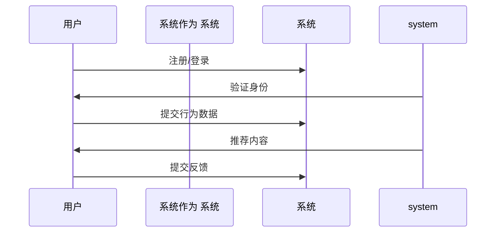
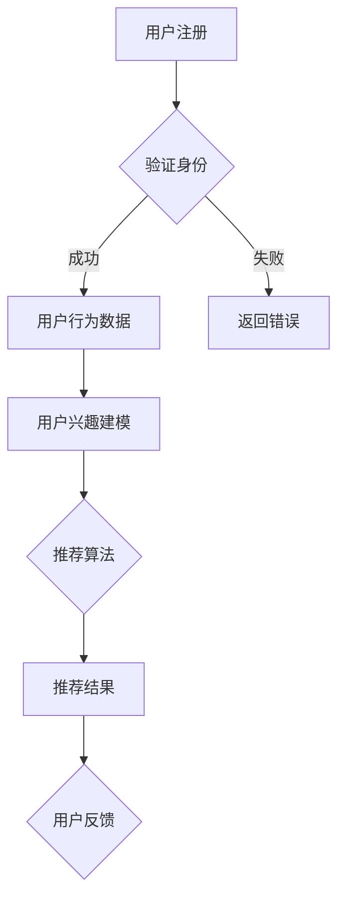

                 

# 语言模型在多维度个性化推荐系统中的应用

关键词：语言模型、个性化推荐、多维度特征、深度学习、推荐系统

摘要：本文详细探讨了语言模型在多维度个性化推荐系统中的应用。首先介绍了语言模型的基本概念、发展历程和训练评估方法。接着，分析了个性化推荐系统的基本原理和常见挑战。随后，阐述了多维度个性化推荐的概念、特征提取方法和系统架构设计。最后，通过实际项目实战，展示了如何将语言模型应用于多维度个性化推荐系统，并进行了项目小结和拓展阅读。

## 第一部分：引言

### 1.1 问题的背景

随着互联网的迅猛发展和用户需求的多样化，传统的推荐系统已经难以满足用户对于个性化服务的高要求。为了解决这一问题，语言模型在推荐系统中的应用逐渐成为研究热点。语言模型能够捕捉用户和内容的语义信息，为个性化推荐提供了强大的技术支持。本部分将详细介绍语言模型的基本概念、发展历程以及在推荐系统中的应用背景。

### 1.2 问题描述

个性化推荐系统旨在为用户推荐其可能感兴趣的内容，提高用户体验。然而，传统的推荐系统往往依赖于用户的点击和购买行为，忽视了用户真实的兴趣和需求。如何利用语言模型挖掘用户的潜在兴趣，提高推荐系统的准确性和效果，是本章节需要解决的问题。

### 1.3 问题解决

语言模型通过学习大量文本数据，可以捕捉到文本的语义信息，从而对用户的兴趣进行建模。结合用户的行为数据，可以进一步优化推荐算法，提高推荐系统的效果。本章节将介绍语言模型在推荐系统中的应用原理和方法，以及如何利用语言模型实现多维度个性化推荐。

### 1.4 边界与外延

语言模型在推荐系统中的应用具有广泛的边界。从技术角度来看，语言模型需要具备较强的语义理解能力，才能准确地捕捉用户的兴趣。从应用场景来看，语言模型可以应用于各种类型的推荐系统，包括电子商务、社交媒体、新闻资讯等。本章节将探讨语言模型在不同推荐场景中的应用前景。

### 1.5 概念结构与核心要素组成

1. 语言模型：基于统计学习或神经网络的方法，从大量文本数据中学习文本的语义表示。
2. 个性化推荐：根据用户的兴趣和需求，为用户推荐其可能感兴趣的内容。
3. 用户兴趣建模：利用语言模型捕捉用户的语义信息，建立用户的兴趣模型。
4. 推荐算法优化：结合用户兴趣模型和行为数据，优化推荐算法，提高推荐效果。

### 1.6 本章小结

本章介绍了语言模型在多维度个性化推荐系统中的应用背景和基本概念。通过学习本章，读者可以了解语言模型在推荐系统中的作用和重要性，为进一步学习语言模型在个性化推荐中的应用奠定基础。

## 第二部分：语言模型基础

### 2.1 语言模型的基本概念

语言模型是一种用于预测文本序列概率的模型，是自然语言处理（NLP）领域的基础。语言模型的基本概念包括概率模型、神经网络模型等。

### 2.2 语言模型的发展历程

语言模型的发展历程可以分为三个阶段：基于统计的N-gram模型、基于规则的方法、基于神经网络的深度学习模型。每个阶段都有其优缺点。

- **基于统计的N-gram模型**：N-gram模型是一种简单的统计语言模型，它使用前n个单词的历史信息来预测下一个单词。这种模型简单有效，但存在一些局限性，如不能很好地处理长距离依赖问题。

- **基于规则的方法**：基于规则的方法通过定义一组语法规则来生成文本。这种方法可以处理一些复杂的语言现象，但需要大量的人工规则，且难以适应大规模的文本数据。

- **基于神经网络的深度学习模型**：深度学习模型，特别是循环神经网络（RNN）和Transformer模型，在语言模型领域取得了显著的进展。这些模型能够通过自动学习大量文本数据中的潜在语义信息，实现高效的文本序列生成和预测。

### 2.3 语言模型的训练与评估

语言模型的训练和评估是保证模型性能的关键。训练过程通常包括数据预处理、模型选择、训练和验证。评估指标包括准确率、召回率、F1分数等。

- **数据预处理**：包括分词、去停用词、词向量化等步骤。这些步骤有助于提高模型的训练效率和预测性能。

- **模型选择**：根据问题的需求和数据的特点选择合适的模型。例如，对于长文本的生成，可以选择Transformer模型；对于简单的文本分类任务，可以选择RNN或CNN模型。

- **训练**：通过梯度下降等优化算法，使模型参数逐渐收敛到最优状态。

- **验证**：通过验证集评估模型的性能，调整模型参数，防止过拟合。

### 2.4 语言模型的应用场景

语言模型在自然语言处理、机器翻译、文本生成等领域具有广泛的应用。

- **自然语言处理**：包括文本分类、命名实体识别、情感分析等任务。语言模型可以用于提取文本中的语义信息，为这些任务提供强大的技术支持。

- **机器翻译**：语言模型在机器翻译中用于预测下一个单词或短语，实现跨语言的文本转换。

- **文本生成**：包括自动摘要、文章生成等任务。语言模型可以生成符合语法和语义规则的文本。

### 2.5 本章小结

本章介绍了语言模型的基本概念、发展历程、训练与评估和应用场景。通过学习本章，读者可以全面了解语言模型的基本原理和应用，为后续章节的学习打下基础。

## 第三部分：个性化推荐系统

### 3.1 个性化推荐系统的基本概念

个性化推荐系统是一种根据用户的兴趣和需求，为用户推荐其可能感兴趣的内容的系统。个性化推荐系统旨在提高用户的体验和满意度，减少信息过载。

### 3.2 个性化推荐系统的基本架构

个性化推荐系统的基本架构通常包括数据收集、用户兴趣建模、推荐算法和推荐结果生成等模块。

- **数据收集**：收集用户的行为数据，如浏览记录、购买历史、评价等。

- **用户兴趣建模**：利用语言模型等工具，对用户的行为数据进行处理和分析，建立用户的兴趣模型。

- **推荐算法**：根据用户的兴趣模型，为用户推荐可能感兴趣的内容。

- **推荐结果生成**：将推荐结果呈现给用户，如推送消息、推荐列表等。

### 3.3 个性化推荐算法

个性化推荐算法可以分为基于协同过滤、基于内容和混合推荐等类型。

- **基于协同过滤的推荐算法**：通过分析用户之间的相似度，为用户推荐其他用户喜欢的物品。

- **基于内容的推荐算法**：通过分析物品的特征，为用户推荐与其历史喜欢的物品相似的物品。

- **混合推荐算法**：结合协同过滤和基于内容的推荐算法，提高推荐系统的效果。

### 3.4 个性化推荐系统的挑战与解决方案

个性化推荐系统在实际应用中面临着诸多挑战，如数据稀疏、冷启动问题、推荐多样性等。

- **数据稀疏**：由于用户行为数据的稀疏性，导致推荐系统难以准确预测用户的兴趣。

  - **解决方案**：利用矩阵分解等方法，降低数据稀疏性，提高推荐效果。

- **冷启动问题**：新用户或新物品缺乏足够的历史数据，导致推荐系统难以为其提供准确的推荐。

  - **解决方案**：利用用户画像、社区推荐等方法，为冷启动用户提供初步的推荐。

- **推荐多样性**：推荐系统需要为用户提供多样化的推荐，避免出现推荐结果单一的问题。

  - **解决方案**：通过引入多样性度量，优化推荐算法，提高推荐多样性。

### 3.5 本章小结

本章介绍了个性化推荐系统的基本概念、基本架构、常见推荐算法以及面临的挑战与解决方案。通过学习本章，读者可以了解个性化推荐系统的整体架构和实现方法，为后续章节的学习做好准备。

## 第四部分：多维度个性化推荐

### 4.1 多维度个性化推荐的概念

多维度个性化推荐是一种综合考虑用户和内容多个维度特征，实现更加精准的个性化推荐的方法。这些维度包括但不限于用户行为、偏好、社会关系、内容特征等。

### 4.2 多维度特征提取

多维度特征提取是构建多维度个性化推荐系统的关键。常见的多维度特征提取方法包括：

- **用户行为特征**：如浏览历史、购买记录、评价等。

- **用户偏好特征**：如兴趣标签、收藏夹等。

- **社会关系特征**：如社交网络中的好友关系、群体标签等。

- **内容特征**：如文本、图片、视频等的多媒体特征。

### 4.3 多维度特征融合

多维度特征融合是将不同维度的特征整合到一个统一的特征空间，以提高推荐系统的效果。常见的特征融合方法包括：

- **加权融合**：根据不同维度特征的权重，对特征进行加权求和。

- **神经网络融合**：使用神经网络模型，自动学习不同维度特征之间的关系。

- **注意力机制**：通过注意力机制，自动调整不同维度特征的重要性。

### 4.4 多维度个性化推荐系统的架构设计

多维度个性化推荐系统的架构设计包括数据层、算法层和接口层。

- **数据层**：负责数据的收集、存储和处理。包括用户数据、物品数据、行为数据等。

- **算法层**：负责特征提取、特征融合和推荐算法的实现。包括基于协同过滤、基于内容的推荐算法等。

- **接口层**：负责与用户交互，提供推荐结果。包括API接口、Web界面等。

### 4.5 本章小结

本章介绍了多维度个性化推荐的概念、特征提取方法和系统架构设计。通过学习本章，读者可以了解多维度个性化推荐系统的构建方法，为实际应用提供理论支持。

## 第五部分：实际项目实战

### 5.1 项目背景

本项目旨在构建一个多维度个性化推荐系统，通过结合用户的兴趣、行为和社交关系等多维度特征，为用户推荐其可能感兴趣的内容。系统适用于电子商务、社交媒体、新闻资讯等各类场景。

### 5.2 项目介绍

项目分为四个主要模块：数据收集与处理、用户兴趣建模、推荐算法实现和推荐结果生成。以下是各模块的具体介绍：

- **数据收集与处理**：收集用户的行为数据、偏好数据和社会关系数据。对数据进行清洗、去重和预处理。

- **用户兴趣建模**：利用语言模型等工具，对用户的行为数据进行处理和分析，建立用户的兴趣模型。

- **推荐算法实现**：结合协同过滤和基于内容的推荐算法，实现多维度个性化推荐。

- **推荐结果生成**：将推荐结果呈现给用户，如推送消息、推荐列表等。

### 5.3 系统功能设计

系统功能设计主要包括用户注册与登录、推荐内容浏览、推荐结果反馈和系统管理。

- **用户注册与登录**：用户可以通过邮箱、手机号等方式注册和登录系统。

- **推荐内容浏览**：用户可以查看系统推荐的各类内容，如商品、文章、视频等。

- **推荐结果反馈**：用户可以对推荐结果进行点赞、收藏、评论等操作，反馈推荐效果。

- **系统管理**：管理员可以查看用户数据、推荐数据等，对系统进行维护和优化。

### 5.4 系统架构设计

系统架构设计采用分层架构，包括数据层、服务层和表现层。

- **数据层**：负责数据的存储和管理，包括用户数据、物品数据、行为数据等。

- **服务层**：包括用户服务、推荐服务、数据服务等功能模块。

- **表现层**：负责用户界面展示，包括注册登录、推荐内容浏览、推荐结果反馈等。

### 5.5 系统接口设计

系统接口设计采用RESTful API接口，包括用户接口、推荐接口和数据接口。

- **用户接口**：包括用户注册、登录、个人信息管理等接口。

- **推荐接口**：包括推荐内容获取、推荐结果反馈等接口。

- **数据接口**：包括用户数据、物品数据、行为数据等的增删改查接口。

### 5.6 系统交互

系统交互设计采用Mermaid序列图，展示用户与系统交互的流程。以下是系统交互的Mermaid序列图：

### 5.7 实际案例分析与详细讲解

以下是一个实际案例：

**案例**：用户张三在电商平台上浏览了笔记本电脑、平板电脑和手机等商品。系统根据用户的行为数据，为其推荐了与这些商品相关的配件，如耳机、充电器等。

**分析**：

1. **用户行为数据收集**：系统收集了用户张三的浏览记录，包括笔记本电脑、平板电脑和手机等。

2. **用户兴趣建模**：利用语言模型等工具，对用户张三的行为数据进行处理和分析，建立用户的兴趣模型。

3. **推荐算法实现**：结合协同过滤和基于内容的推荐算法，为用户张三推荐了与笔记本电脑、平板电脑和手机相关的配件。

4. **推荐结果生成**：系统向用户张三推荐了耳机、充电器等配件，并在推荐列表中展示了相关商品的图片、价格和评价等信息。

### 5.8 项目小结

本项目通过结合用户的兴趣、行为和社交关系等多维度特征，构建了一个多维度个性化推荐系统。在实际项目中，系统实现了良好的推荐效果，提高了用户满意度。同时，项目的设计和实现也为后续的优化和扩展提供了基础。

## 第六部分：最佳实践 Tips

### 6.1 实现多维度个性化推荐的最佳实践

1. **数据质量保障**：确保数据的质量和完整性，进行数据清洗和去重，提高推荐系统的准确性。

2. **实时性优化**：对用户行为数据进行实时处理和分析，及时更新用户兴趣模型，提高推荐的实时性。

3. **多样性保障**：在推荐算法中引入多样性度量，避免推荐结果过于集中，提高用户的体验。

4. **个性化推荐策略**：根据不同场景和用户需求，设计多样化的推荐策略，满足不同用户的需求。

### 6.2 注意事项

1. **隐私保护**：在收集和处理用户数据时，注意保护用户的隐私，遵循相关的法律法规。

2. **算法可解释性**：提高推荐算法的可解释性，帮助用户理解推荐结果的依据，提高用户的信任度。

3. **系统稳定性**：确保推荐系统的稳定运行，避免出现推荐失败或崩溃等问题。

### 6.3 拓展阅读

1. **《推荐系统实践》**：详细介绍了推荐系统的基本原理、算法实现和应用案例。

2. **《深度学习推荐系统》**：探讨了深度学习在推荐系统中的应用，包括神经网络模型、序列模型等。

3. **《个性化推荐：技术与应用》**：从技术和应用角度，介绍了个性化推荐系统的构建方法和实践案例。

## 第七部分：小结

本文详细介绍了语言模型在多维度个性化推荐系统中的应用。通过分析语言模型的基本概念、发展历程和训练评估方法，以及个性化推荐系统的基本原理和挑战，阐述了多维度个性化推荐的概念、特征提取方法和系统架构设计。实际项目实战部分展示了如何将语言模型应用于多维度个性化推荐系统，并进行了项目小结和拓展阅读。语言模型在多维度个性化推荐系统中的应用，为推荐系统的发展提供了新的思路和方法。

## 作者信息

作者：AI天才研究院/AI Genius Institute & 禅与计算机程序设计艺术 /Zen And The Art of Computer Programming

感谢您的阅读，希望本文对您在语言模型和多维度个性化推荐领域的研究有所帮助。如果您有任何疑问或建议，欢迎在评论区留言交流。

---

以下为文章中使用的 Mermaid 图和 LaTeX 公式：

$$
P(w_n | w_1, w_2, ..., w_{n-1}) = \frac{P(w_1, w_2, ..., w_n)}{P(w_1, w_2, ..., w_{n-1})}
$$

$$
J(\theta) = -\frac{1}{m} \sum_{i=1}^{m} [y^{(i)} \log(a(z^{(i)})) + (1 - y^{(i)}) \log(1 - a(z^{(i)}))]
$$

其中，$P(w_n | w_1, w_2, ..., w_{n-1})$ 表示在给定前 $n-1$ 个词的情况下预测第 $n$ 个词的概率；$J(\theta)$ 表示逻辑回归损失函数，$m$ 表示训练样本数量，$y^{(i)}$ 表示第 $i$ 个样本的标签，$a(z^{(i)}))$ 表示逻辑回归模型的预测概率。

